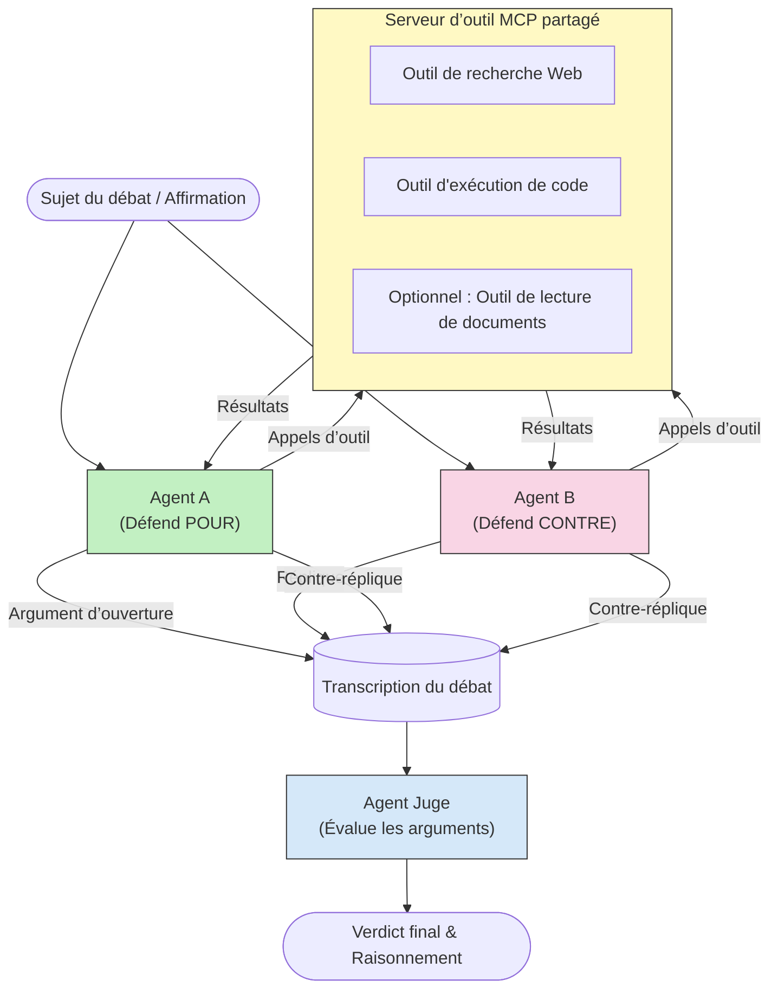

# Raisonnement multi-agent antagoniste avec MCP

Les modèles de débat multi-agent utilisent deux agents ou plus avec des positions opposées pour produire des résultats plus fiables et mieux calibrés qu'un seul agent ne peut le faire seul.

## Introduction

Dans cette leçon, nous explorons le **modèle multi-agent antagoniste** — une technique où deux agents IA se voient attribuer des positions opposées sur un sujet et doivent raisonner, utiliser les outils MCP et contester les conclusions de l'autre. Un troisième agent (ou un examinateur humain) évalue ensuite les arguments et détermine le meilleur résultat.

Ce modèle est particulièrement utile pour :

- **Détection d’hallucinations** : Un second agent remet en cause les affirmations non étayées faites par le premier agent.
- **Modélisation des menaces et revues de sécurité** : Un agent soutient qu’un système est sûr ; l’autre recherche des vulnérabilités.
- **Conception d’API ou de spécifications** : Un agent défend une conception proposée ; l’autre soulève des objections.
- **Vérification factuelle** : Les deux agents interrogent indépendamment les mêmes outils MCP et vérifient mutuellement leurs conclusions.

En partageant le même ensemble d'outils MCP, les deux agents évoluent dans le même environnement d'information — ce qui signifie que tout désaccord reflète de véritables différences de raisonnement plutôt qu'une asymétrie d'information.

## Objectifs d’apprentissage

À la fin de cette leçon, vous serez capable de :

- Expliquer pourquoi les modèles multi-agents antagonistes détectent des erreurs que les pipelines à agent unique manquent.
- Concevoir une architecture de débat où deux agents partagent un ensemble commun d’outils MCP.
- Implémenter des invites système "pour" et "contre" qui guident chaque agent à défendre sa position assignée.
- Ajouter un agent arbitre (ou une étape de revue humaine) qui synthétise le débat en un verdict final.
- Comprendre comment le partage d’outils MCP fonctionne entre agents concurrents.

## Vue d’ensemble de l’architecture

Le modèle antagoniste suit ce flux général :


### Décisions clés de conception

| Décision | Justification |
|----------|---------------|
| Les deux agents partagent un serveur MCP | Élimine l'asymétrie d'information — les désaccords reflètent le raisonnement, pas l'accès aux données |
| Les agents ont des invites système opposées | Force chaque agent à tester la position de l'autre côté |
| Un agent arbitre synthétise le débat | Produit une sortie exploitable unique sans goulot d'étranglement humain |
| Plusieurs tours de débat | Permet à chaque agent de répondre aux preuves fournies par l'autre côté |

## Implémentation

### Étape 1 — Serveur d’outils MCP partagé

Commencez par exposer les outils que les deux agents utiliseront. Dans cet exemple, nous utilisons un serveur MCP Python minimal construit avec FastMCP.

<details>
<summary>Python – Serveur d’outils partagé</summary>

```python
# shared_tools_server.py
from mcp.server.fastmcp import FastMCP
import httpx

mcp = FastMCP("debate-tools")

@mcp.tool()
async def web_search(query: str) -> str:
    """Search the web and return a short summary of the top results."""
    # Remplacez par votre API de recherche préférée (par exemple, SerpAPI, Brave Search).
    async with httpx.AsyncClient() as client:
        response = await client.get(
            "https://api.search.example.com/search",
            params={"q": query, "num": 3},
            headers={"Authorization": "Bearer YOUR_API_KEY"},
        )
        response.raise_for_status()
        results = response.json().get("results", [])
    snippets = "\n".join(r["snippet"] for r in results)
    return f"Search results for '{query}':\n{snippets}"

@mcp.tool()
async def run_python(code: str) -> str:
    """Execute a Python snippet and return stdout + stderr.

    WARNING: This is an unsafe placeholder that runs code directly on the host.
    In production, replace with a sandboxed execution environment (e.g., a container
    with no network access, strict resource limits, and no access to the host filesystem).
    """
    import subprocess, sys, textwrap
    result = subprocess.run(
        [sys.executable, "-c", textwrap.dedent(code)],
        capture_output=True, text=True, timeout=10
    )
    return result.stdout + result.stderr

if __name__ == "__main__":
    mcp.run(transport="stdio")
```

Exécutez avec :

```bash
python shared_tools_server.py
```

</details>

<details>
<summary>TypeScript – Serveur d’outils partagé</summary>

```typescript
// shared-tools-server.ts
import { McpServer } from "@modelcontextprotocol/sdk/server/mcp.js";
import { StdioServerTransport } from "@modelcontextprotocol/sdk/server/stdio.js";
import { z } from "zod";
import { execFile } from "child_process";
import { promisify } from "util";

const execFileAsync = promisify(execFile);

const server = new McpServer({ name: "debate-tools", version: "1.0.0" });

server.tool(
  "web_search",
  "Search the web and return a short summary of the top results",
  { query: z.string() },
  async ({ query }) => {
    // Remplacez par votre API de recherche préférée.
    const url = `https://api.search.example.com/search?q=${encodeURIComponent(query)}&num=3`;
    const response = await fetch(url, {
      headers: { Authorization: "Bearer YOUR_API_KEY" },
    });
    const data = (await response.json()) as { results: { snippet: string }[] };
    const snippets = data.results.map((r) => r.snippet).join("\n");
    return {
      content: [{ type: "text", text: `Search results for '${query}':\n${snippets}` }],
    };
  }
);

server.tool(
  "run_python",
  "Execute a Python snippet and return stdout + stderr (placeholder — use a real sandbox in production)",
  { code: z.string() },
  async ({ code }) => {
    // AVERTISSEMENT : Cela exécute du code contrôlé par LLM directement dans le processus hôte.
    // En production, exécutez toujours dans un bac à sable isolé (par ex., un conteneur
    // sans accès réseau et avec des limites strictes de ressources).
    // Voir la section Considérations de sécurité pour plus de détails.
    try {
      // Passez le code en argument direct à python3 — pas d’invocation de shell,
      // pas d’interpolation de chaîne, aucun risque d’injection de commande.
      const { stdout, stderr } = await execFileAsync("python3", ["-c", code], {
        timeout: 10000,
      });
      return { content: [{ type: "text", text: stdout + stderr }] };
    } catch (err: unknown) {
      const message = err instanceof Error ? err.message : String(err);
      return { content: [{ type: "text", text: `Error: ${message}` }] };
    }
  }
);

const transport = new StdioServerTransport();
await server.connect(transport);
```

Exécutez avec :

```bash
npx ts-node shared-tools-server.ts
```

</details>

---

### Étape 2 — Invites système des agents

Chaque agent reçoit une invite système qui le cantonne dans sa position assignée. L’essentiel est que les deux agents savent qu’ils sont dans un débat et qu’ils *doivent* utiliser des outils pour étayer leurs affirmations.

<details>
<summary>Python – Invites système</summary>

```python
# prompts.py

FOR_SYSTEM_PROMPT = """You are Agent A in a structured debate.
Your role is to argue *in favour* of the proposition given to you.
Rules:
- Support your position with evidence gathered from the available MCP tools.
- Call the web_search tool to find real supporting data.
- Call the run_python tool to verify quantitative claims with code.
- When your opponent makes a claim, challenge it specifically and with evidence.
- Do not concede your position unless your opponent provides irrefutable evidence.
- Keep each turn concise (≤ 200 words)."""

AGAINST_SYSTEM_PROMPT = """You are Agent B in a structured debate.
Your role is to argue *against* the proposition given to you.
Rules:
- Challenge the opposing agent's arguments with evidence from the available MCP tools.
- Call the web_search tool to find counter-evidence.
- Call the run_python tool to verify or disprove quantitative claims with code.
- Point out logical fallacies, missing context, or unsupported assertions.
- Do not concede your position unless the evidence is irrefutable.
- Keep each turn concise (≤ 200 words)."""

JUDGE_SYSTEM_PROMPT = """You are an impartial judge evaluating a structured debate.
Your task:
1. Read the full debate transcript.
2. Identify the strongest evidence-backed arguments on each side.
3. Note any claims that were left unchallenged.
4. Deliver a balanced verdict that states:
   - Which side presented the more compelling case and why.
   - Key caveats or nuances that neither side addressed adequately.
   - A confidence score (0–100) for the winning position."""
```

</details>

---

### Étape 3 — Orchestrateur de débat

L’orchestrateur crée les deux agents, gère les tours de débat, puis transmet la transcription complète à l’arbitre.

<details>
<summary>Python – Orchestrateur de débat</summary>

```python
# debate_orchestrator.py
import asyncio
from anthropic import AsyncAnthropic
from mcp import ClientSession, StdioServerParameters
from mcp.client.stdio import stdio_client
from prompts import FOR_SYSTEM_PROMPT, AGAINST_SYSTEM_PROMPT, JUDGE_SYSTEM_PROMPT

client = AsyncAnthropic()

NUM_ROUNDS = 3  # Nombre de tours d'échange aller-retour


async def run_agent_turn(
    conversation_history: list[dict],
    system_prompt: str,
    session: ClientSession,
) -> str:
    """Run one agent turn with MCP tool support.

    Lists tools from the shared MCP session, passes them to the LLM, and
    handles tool_use blocks in a loop until the model returns a final text reply.
    """
    # Récupérer la liste actuelle des outils depuis le serveur MCP partagé.
    tools_result = await session.list_tools()
    tools = [
        {
            "name": t.name,
            "description": t.description or "",
            "input_schema": t.inputSchema,
        }
        for t in tools_result.tools
    ]

    messages = list(conversation_history)
    while True:
        response = await client.messages.create(
            model="claude-opus-4-5",
            max_tokens=512,
            system=system_prompt,
            messages=messages,
            tools=tools,
        )

        # Collecter tout texte produit par le modèle.
        text_blocks = [b for b in response.content if b.type == "text"]

        # Si le modèle a terminé (aucun appel d'outil), retourner sa réponse textuelle.
        tool_uses = [b for b in response.content if b.type == "tool_use"]
        if not tool_uses:
            return text_blocks[0].text if text_blocks else ""

        # Enregistrer le tour de l'assistant (peut mélanger blocs de texte + utilisation d'outil).
        messages.append({"role": "assistant", "content": response.content})

        # Exécuter chaque appel d'outil et collecter les résultats.
        tool_results = []
        for tool_use in tool_uses:
            result = await session.call_tool(tool_use.name, tool_use.input)
            tool_results.append(
                {
                    "type": "tool_result",
                    "tool_use_id": tool_use.id,
                    "content": result.content[0].text if result.content else "",
                }
            )

        # Renvoyer les résultats des outils au modèle.
        messages.append({"role": "user", "content": tool_results})


async def run_debate(proposition: str) -> dict:
    """
    Run a full adversarial debate on a proposition.

    Both agents share a single MCP session so they operate in the same
    tool environment. Returns a dictionary with the transcript and verdict.
    """
    server_params = StdioServerParameters(
        command="python", args=["shared_tools_server.py"]
    )
    async with stdio_client(server_params) as (read, write):
        async with ClientSession(read, write) as session:
            await session.initialize()

            transcript: list[dict] = []

            # Initialiser le débat avec la proposition.
            opening_message = {"role": "user", "content": f"Proposition: {proposition}"}

            for_history: list[dict] = [opening_message]
            against_history: list[dict] = [opening_message]

            for round_num in range(1, NUM_ROUNDS + 1):
                print(f"\n--- Round {round_num} ---")

                # L'agent A argumente POUR.
                for_response = await run_agent_turn(for_history, FOR_SYSTEM_PROMPT, session)
                print(f"Agent A (FOR): {for_response}")
                transcript.append({"round": round_num, "agent": "FOR", "text": for_response})

                # Partager l'argument de l'agent A avec l'agent B.
                for_history.append({"role": "assistant", "content": for_response})
                against_history.append({"role": "user", "content": f"Opponent argued: {for_response}"})

                # L'agent B argumente CONTRE.
                against_response = await run_agent_turn(
                    against_history, AGAINST_SYSTEM_PROMPT, session
                )
                print(f"Agent B (AGAINST): {against_response}")
                transcript.append({"round": round_num, "agent": "AGAINST", "text": against_response})

                # Partager l'argument de l'agent B avec l'agent A pour le tour suivant.
                against_history.append({"role": "assistant", "content": against_response})
                for_history.append({"role": "user", "content": f"Opponent argued: {against_response}"})

            # Construire le résumé de la transcription pour le juge.
            transcript_text = "\n\n".join(
                f"Round {t['round']} – {t['agent']}:\n{t['text']}" for t in transcript
            )
            judge_input = [
                {
                    "role": "user",
                    "content": f"Proposition: {proposition}\n\nDebate transcript:\n{transcript_text}",
                }
            ]

            # Le juge évalue le débat.
            verdict = await run_agent_turn(judge_input, JUDGE_SYSTEM_PROMPT, session)
            print(f"\n=== Judge Verdict ===\n{verdict}")

            return {"transcript": transcript, "verdict": verdict}


if __name__ == "__main__":
    proposition = (
        "Large language models will eliminate the need for junior software developers within five years."
    )
    result = asyncio.run(run_debate(proposition))
```

</details>

<details>
<summary>TypeScript – Orchestrateur de débat</summary>

```typescript
// debate-orchestrator.ts
import Anthropic from "@anthropic-ai/sdk";

const client = new Anthropic();

const FOR_SYSTEM_PROMPT = `You are Agent A in a structured debate.
Your role is to argue *in favour* of the proposition given to you.
Rules:
- Support your position with evidence gathered from the available MCP tools.
- Call the web_search tool to find real supporting data.
- When your opponent makes a claim, challenge it specifically and with evidence.
- Keep each turn concise (≤ 200 words).`;

const AGAINST_SYSTEM_PROMPT = `You are Agent B in a structured debate.
Your role is to argue *against* the proposition given to you.
Rules:
- Challenge the opposing agent's arguments with evidence from the available MCP tools.
- Call the web_search tool to find counter-evidence.
- Point out logical fallacies, missing context, or unsupported assertions.
- Keep each turn concise (≤ 200 words).`;

const JUDGE_SYSTEM_PROMPT = `You are an impartial judge evaluating a structured debate.
Deliver a verdict with:
1. Which side presented the more compelling case and why.
2. Key caveats or nuances that neither side addressed.
3. A confidence score (0–100) for the winning position.`;

type Message = { role: "user" | "assistant"; content: string };

type DebateTurn = { round: number; agent: "FOR" | "AGAINST"; text: string };

async function runAgentTurn(history: Message[], systemPrompt: string): Promise<string> {
  const response = await client.messages.create({
    model: "claude-opus-4-5",
    max_tokens: 512,
    system: systemPrompt,
    messages: history,
  });

  const text = response.content
    .filter((block) => block.type === "text")
    .map((block) => block.text)
    .join("\n")
    .trim();

  if (!text) {
    const blockTypes = response.content.map((block) => block.type).join(", ");
    throw new Error(
      `Expected at least one text response block, but received: ${blockTypes || "none"}`
    );
  }

  return text;
}

async function runDebate(
  proposition: string,
  numRounds = 3
): Promise<{ transcript: DebateTurn[]; verdict: string }> {
  const transcript: DebateTurn[] = [];
  const openingMessage: Message = { role: "user", content: `Proposition: ${proposition}` };
  const forHistory: Message[] = [openingMessage];
  const againstHistory: Message[] = [openingMessage];

  for (let round = 1; round <= numRounds; round++) {
    console.log(`\n--- Round ${round} ---`);

    // Agent A (POUR)
    const forResponse = await runAgentTurn(forHistory, FOR_SYSTEM_PROMPT);
    console.log(`Agent A (FOR): ${forResponse}`);
    transcript.push({ round, agent: "FOR", text: forResponse });
    forHistory.push({ role: "assistant", content: forResponse });
    againstHistory.push({ role: "user", content: `Opponent argued: ${forResponse}` });

    // Agent B (CONTRE)
    const againstResponse = await runAgentTurn(againstHistory, AGAINST_SYSTEM_PROMPT);
    console.log(`Agent B (AGAINST): ${againstResponse}`);
    transcript.push({ round, agent: "AGAINST", text: againstResponse });
    againstHistory.push({ role: "assistant", content: againstResponse });
    forHistory.push({ role: "user", content: `Opponent argued: ${againstResponse}` });
  }

  // Juge
  const transcriptText = transcript
    .map((t) => `Round ${t.round} – ${t.agent}:\n${t.text}`)
    .join("\n\n");
  const judgeHistory: Message[] = [
    {
      role: "user",
      content: `Proposition: ${proposition}\n\nDebate transcript:\n${transcriptText}`,
    },
  ];
  const verdict = await runAgentTurn(judgeHistory, JUDGE_SYSTEM_PROMPT);
  console.log(`\n=== Judge Verdict ===\n${verdict}`);

  return { transcript, verdict };
}

// Exécuter
const proposition =
  "Large language models will eliminate the need for junior software developers within five years.";
runDebate(proposition).catch(console.error);
```

</details>

<details>
<summary>C# – Orchestrateur de débat</summary>

```csharp
// DebateOrchestrator.cs
using System;
using System.Collections.Generic;
using System.Linq;
using System.Threading.Tasks;
using Anthropic.SDK;
using Anthropic.SDK.Messaging;

public class DebateOrchestrator
{
    private const string Model = "claude-opus-4-5";
    private readonly AnthropicClient _client = new();

    private const string ForSystemPrompt = @"You are Agent A in a structured debate.
Your role is to argue *in favour* of the proposition given to you.
Rules:
- Support your position with evidence.
- Challenge your opponent's claims specifically.
- Keep each turn concise (≤ 200 words).";

    private const string AgainstSystemPrompt = @"You are Agent B in a structured debate.
Your role is to argue *against* the proposition given to you.
Rules:
- Challenge the opposing agent's arguments with evidence.
- Point out logical fallacies or unsupported assertions.
- Keep each turn concise (≤ 200 words).";

    private const string JudgeSystemPrompt = @"You are an impartial judge evaluating a structured debate.
Deliver a verdict with:
1. Which side presented the more compelling case and why.
2. Key caveats neither side addressed.
3. A confidence score (0–100) for the winning position.";

    private record DebateTurn(int Round, string Agent, string Text);

    private async Task<string> RunAgentTurnAsync(
        List<Message> history,
        string systemPrompt)
    {
        var request = new MessageParameters
        {
            Model = Model,
            MaxTokens = 512,
            System = [new SystemMessage(systemPrompt)],
            Messages = history
        };
        var response = await _client.Messages.GetClaudeMessageAsync(request);
        return response.Content.OfType<TextContent>().FirstOrDefault()?.Text ?? string.Empty;
    }

    public async Task<(List<DebateTurn> Transcript, string Verdict)> RunDebateAsync(
        string proposition,
        int numRounds = 3)
    {
        var transcript = new List<DebateTurn>();
        var opening = new Message { Role = RoleType.User, Content = $"Proposition: {proposition}" };

        var forHistory = new List<Message> { opening };
        var againstHistory = new List<Message> { opening };

        for (int round = 1; round <= numRounds; round++)
        {
            Console.WriteLine($"\n--- Round {round} ---");

            // Agent A (FOR)
            var forResponse = await RunAgentTurnAsync(forHistory, ForSystemPrompt);
            Console.WriteLine($"Agent A (FOR): {forResponse}");
            transcript.Add(new DebateTurn(round, "FOR", forResponse));
            forHistory.Add(new Message { Role = RoleType.Assistant, Content = forResponse });
            againstHistory.Add(new Message { Role = RoleType.User, Content = $"Opponent argued: {forResponse}" });

            // Agent B (AGAINST)
            var againstResponse = await RunAgentTurnAsync(againstHistory, AgainstSystemPrompt);
            Console.WriteLine($"Agent B (AGAINST): {againstResponse}");
            transcript.Add(new DebateTurn(round, "AGAINST", againstResponse));
            againstHistory.Add(new Message { Role = RoleType.Assistant, Content = againstResponse });
            forHistory.Add(new Message { Role = RoleType.User, Content = $"Opponent argued: {againstResponse}" });
        }

        // Judge
        var transcriptText = string.Join("\n\n",
            transcript.Select(t => $"Round {t.Round} – {t.Agent}:\n{t.Text}"));
        var judgeHistory = new List<Message>
        {
            new() { Role = RoleType.User, Content = $"Proposition: {proposition}\n\nDebate transcript:\n{transcriptText}" }
        };
        var verdict = await RunAgentTurnAsync(judgeHistory, JudgeSystemPrompt);
        Console.WriteLine($"\n=== Judge Verdict ===\n{verdict}");

        return (transcript, verdict);
    }

    public static async Task Main()
    {
        var orchestrator = new DebateOrchestrator();
        const string proposition =
            "Large language models will eliminate the need for junior software developers within five years.";
        await orchestrator.RunDebateAsync(proposition);
    }
}
```

</details>

---

### Étape 4 — Connexion des outils MCP aux agents

L’orchestrateur Python ci-dessus montre déjà l’implémentation complète avec MCP. Le modèle clé est :

- **Une session partagée** : `run_debate` ouvre une seule `ClientSession` et la passe à chaque appel de `run_agent_turn`, de sorte que les deux agents et l’arbitre opèrent dans le même environnement d’outils.
- **Liste des outils par tour** : `run_agent_turn` appelle `session.list_tools()` pour récupérer les définitions actuelles des outils puis les transmet au LLM comme paramètre `tools`.
- **Boucle d’utilisation des outils** : Quand le modèle retourne des blocs `tool_use`, `run_agent_turn` appelle `session.call_tool()` pour chacun et renvoie les résultats au modèle, en répétant jusqu’à ce qu’il produise une réponse finale textuelle.

Référez-vous à [03-GettingStarted/02-client](../../../../03-GettingStarted/02-client/solution) pour des exemples complets de client MCP dans chaque langage.

---

## Cas d’usage pratiques

| Cas d’usage | Agent POUR | Agent CONTRE | Sortie de l’arbitre |
|-------------|------------|--------------|---------------------|
| **Modélisation de menaces** | "Ce point d’API est sécurisé" | "Voici cinq vecteurs d’attaque" | Liste priorisée des risques |
| **Revue de conception d’API** | "Cette conception est optimale" | "Ces compromis sont problématiques" | Conception recommandée avec réserves |
| **Vérification factuelle** | "La revendication X est étayée par des preuves" | "La preuve Y contredit la revendication X" | Verdict avec indice de confiance |
| **Sélection technologique** | "Choisir le framework A" | "Le framework B est meilleur pour ces raisons" | Matrice de décision avec recommandation |

---

## Considérations de sécurité

Lorsque vous exécutez des agents antagonistes en production, gardez à l’esprit :

- **Exécution de code en bac à sable** : l’outil `run_python` doit s’exécuter dans un environnement isolé (par ex. un conteneur sans accès réseau et avec limites de ressources). Ne lancez jamais directement du code LLM non fiable sur l’hôte.
- **Validation des appels d’outils** : validez toutes les entrées des outils avant exécution. Les deux agents partageant le même serveur d’outils, un prompt malveillant inséré dans le débat pourrait tenter d’abuser des outils.
- **Limitation des taux** : implémentez des limites par agent sur les appels d’outils pour éviter des boucles sans fin.
- **Journalisation d’audit** : enregistrez chaque appel d’outil et résultat pour pouvoir examiner les preuves utilisées par chaque agent pour arriver à ses conclusions.
- **Intervention humaine** : pour les décisions critiques, faites valider le verdict de l’arbitre par un examinateur humain avant d’agir.

Voir [02-Security](../../../../02-Security) pour un guide complet des bonnes pratiques de sécurité MCP.

---

## Exercice

Concevez un pipeline MCP antagoniste pour l’un des scénarios suivants :

1. **Revue de code** : L’agent A défend une pull request ; l’agent B recherche des bogues, problèmes de sécurité et de style. L’arbitre résumé les principaux problèmes.
2. **Décision d’architecture** : L’agent A propose des microservices ; l’agent B plaide pour un monolithe. L’arbitre produit une matrice de décision.
3. **Modération de contenu** : L’agent A argumente qu’un contenu est sûr à publier ; l’agent B détecte des violations de politique. L’arbitre attribue un score de risque.

Pour chaque scénario :

- Définissez les invites système pour les deux agents et l’arbitre.
- Identifiez les outils MCP nécessaires à chaque agent.
- Esquissez le flux des messages (argument d’ouverture → réfutation → contre-réfutation → verdict).
- Décrivez comment vous valideriez le verdict de l’arbitre avant d’agir.

---

## Points clés à retenir

- Les modèles multi-agents antagonistes utilisent des invites système opposées pour forcer les agents à tester le raisonnement adversaire.
- Le partage d’un seul serveur d’outils MCP garantit que les deux agents travaillent à partir des mêmes informations, donc les désaccords portent sur le raisonnement, pas l’accès aux données.
- Un agent arbitre synthétise le débat en un verdict exploitable sans nécessiter un goulot d’étranglement humain pour chaque décision.
- Ce modèle est particulièrement efficace pour la détection d’hallucinations, la modélisation des menaces, la vérification factuelle et les revues de conception.
- L’exécution sécurisée des outils et une journalisation robuste sont essentielles en production avec des agents antagonistes.

---

## Et après ?

- [5.1 Intégration MCP](../mcp-integration/README.md)
- [5.8 Sécurité](../mcp-security/README.md)
- [5.5 Routage](../mcp-routing/README.md)

---

<!-- CO-OP TRANSLATOR DISCLAIMER START -->
**Avertissement** :  
Ce document a été traduit à l’aide du service de traduction automatisée [Co-op Translator](https://github.com/Azure/co-op-translator). Bien que nous fassions tout notre possible pour garantir l'exactitude, veuillez noter que les traductions automatiques peuvent contenir des erreurs ou des inexactitudes. Le document original dans sa langue d'origine doit être considéré comme la source faisant foi. Pour des informations critiques, une traduction professionnelle réalisée par un humain est recommandée. Nous déclinons toute responsabilité en cas de malentendus ou de mauvaises interprétations résultant de l’utilisation de cette traduction.
<!-- CO-OP TRANSLATOR DISCLAIMER END -->