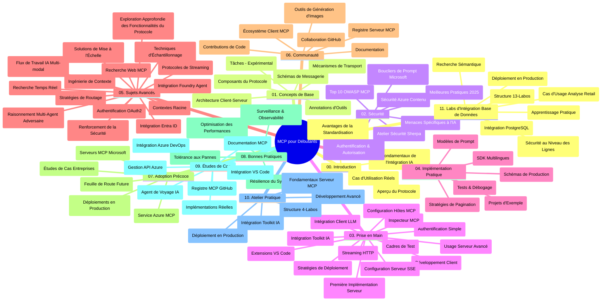

# Protocole de Contexte de Modèle (MCP) pour Débutants - Guide d'Étude

Ce guide d'étude fournit une vue d'ensemble de la structure et du contenu du dépôt pour le programme "Protocole de Contexte de Modèle (MCP) pour Débutants". Utilisez ce guide pour naviguer efficacement dans le dépôt et tirer le meilleur parti des ressources disponibles.

## Vue d'ensemble du dépôt

Le Protocole de Contexte de Modèle (MCP) est un cadre standardisé pour les interactions entre les modèles d'IA et les applications clientes. Initialement créé par Anthropic, le MCP est désormais maintenu par la communauté MCP plus large via l'organisation officielle GitHub. Ce dépôt propose un programme complet avec des exemples pratiques en C#, Java, JavaScript, Python et TypeScript, conçu pour les développeurs IA, les architectes système et les ingénieurs logiciels.

## Carte visuelle du programme

## Structure du dépôt

Le dépôt est organisé en onze sections principales, chacune axée sur différents aspects du MCP :

1. **Introduction (00-Introduction/)**
   - Vue d'ensemble du Protocole de Contexte de Modèle
   - Pourquoi la standardisation est importante dans les chaînes d'IA
   - Cas d'utilisation pratiques et bénéfices

2. **Concepts de Base (01-CoreConcepts/)**
   - Architecture client-serveur
   - Composants clés du protocole
   - Modèles de messagerie dans MCP

3. **Sécurité (02-Security/)**
   - Menaces de sécurité dans les systèmes basés sur MCP
   - Bonnes pratiques pour sécuriser les implémentations
   - Stratégies d'authentification et d'autorisation
   - **Documentation complète sur la sécurité** :
     - Bonnes pratiques de sécurité MCP 2025
     - Guide d'implémentation Azure Content Safety
     - Contrôles et techniques de sécurité MCP
     - Référence rapide des bonnes pratiques MCP
   - **Sujets clés en sécurité** :
     - Attaques d'injection de prompts et d'empoisonnement d'outils
     - Détournement de session et problèmes de représentant confus
     - Vulnérabilités de passage de jetons
     - Permissions excessives et contrôle d'accès
     - Sécurité de la chaîne d'approvisionnement pour les composants IA
     - Intégration des Microsoft Prompt Shields

4. **Mise en route (03-GettingStarted/)**
   - Installation et configuration de l'environnement
   - Création de serveurs et clients MCP basiques
   - Intégration avec des applications existantes
   - Contient des sections pour :
     - Première implémentation de serveur
     - Développement client
     - Intégration client LLM
     - Intégration VS Code
     - Serveur Server-Sent Events (SSE)
     - Utilisation avancée du serveur
     - Streaming HTTP
     - Intégration AI Toolkit
     - Stratégies de test
     - Directives de déploiement

5. **Implémentation pratique (04-PracticalImplementation/)**
   - Utilisation des SDK dans différents langages
   - Techniques de debug, test et validation
   - Élaboration de modèles de prompts réutilisables et workflows
   - Projets d'exemple avec exemples d'implémentation

6. **Sujets avancés (05-AdvancedTopics/)**
   - Techniques d'ingénierie du contexte
   - Intégration de l'agent Foundry
   - Workflows IA multimodaux
   - Démonstrations d'authentification OAuth2
   - Capacités de recherche en temps réel
   - Streaming en temps réel
   - Implémentation des contextes racines
   - Stratégies de routage
   - Techniques d’échantillonnage
   - Approches de montée en charge
   - Considérations de sécurité
   - Intégration sécurité Entra ID
   - Intégration recherche web
   - Raisonnement multi-agent adversarial (modèles de débat)

7. **Contributions communautaires (06-CommunityContributions/)**
   - Comment contribuer au code et à la documentation
   - Collaboration via GitHub
   - Améliorations et retours communautaires
   - Utilisation de divers clients MCP (Claude Desktop, Cline, VSCode)
   - Travail avec des serveurs MCP populaires y compris génération d’images

8. **Leçons de l’adoption précoce (07-LessonsfromEarlyAdoption/)**
   - Implémentations réelles et cas de réussite
   - Construction et déploiement de solutions MCP
   - Tendances et feuille de route future
   - **Guide des serveurs MCP Microsoft** : Guide complet de 10 serveurs MCP Microsoft prêts pour la production comprenant :
     - Microsoft Learn Docs MCP Server
     - Azure MCP Server (plus de 15 connecteurs spécialisés)
     - GitHub MCP Server
     - Azure DevOps MCP Server
     - MarkItDown MCP Server
     - SQL Server MCP Server
     - Playwright MCP Server
     - Dev Box MCP Server
     - Azure AI Foundry MCP Server
     - Microsoft 365 Agents Toolkit MCP Server

9. **Bonnes pratiques (08-BestPractices/)**
   - Optimisation et tuning des performances
   - Conception de systèmes MCP tolérants aux pannes
   - Stratégies de tests et résilience

10. **Études de cas (09-CaseStudy/)**
    - **Sept études de cas complètes** démontrant la polyvalence du MCP dans divers scénarios :
    - **Agents de voyage Azure AI** : Orchestration multi-agent avec Azure OpenAI et AI Search
    - **Intégration Azure DevOps** : Automatisation des workflows avec mises à jour de données YouTube
    - **Récupération documentaire en temps réel** : Client console Python avec HTTP streaming
    - **Générateur interactif de plans d’étude** : Application web Chainlit avec IA conversationnelle
    - **Documentation dans l’éditeur** : Intégration VS Code avec workflows GitHub Copilot
    - **Gestion API Azure** : Intégration API entreprise avec création de serveurs MCP
    - **Registre MCP GitHub** : Développement d’écosystème et plateforme d’intégration agentique
    - Exemples d’implémentation couvrant intégration entreprise, productivité développeur et développement d’écosystème

11. **Atelier pratique (10-StreamliningAIWorkflowsBuildingAnMCPServerWithAIToolkit/)**
    - Atelier pratique complet combinant MCP avec AI Toolkit
    - Création d’applications intelligentes reliant modèles IA et outils réels
    - Modules pratiques couvrant fondamentaux, développement serveur personnalisé et stratégies de déploiement en production
    - **Structure du laboratoire** :
      - Laboratoire 1 : Fondamentaux du serveur MCP
      - Laboratoire 2 : Développement avancé de serveurs MCP
      - Laboratoire 3 : Intégration AI Toolkit
      - Laboratoire 4 : Déploiement en production et montée en charge
    - Approche pédagogique basée sur des laboratoires avec instructions pas à pas

12. **Laboratoires d’intégration base de données pour serveurs MCP (11-MCPServerHandsOnLabs/)**
    - **Parcours d’apprentissage complet de 13 laboratoires** pour construire des serveurs MCP prêts pour la production avec intégration PostgreSQL
    - **Implémentation analytique réelle dans la vente au détail** via le cas d’usage Zava Retail
    - **Patrons entreprise de haut niveau** incluant Row Level Security (RLS), recherche sémantique et accès multi-locataires aux données
    - **Structure complète des laboratoires** :
      - **Laboratoires 00-03 : Fondations** - Introduction, architecture, sécurité, configuration environnement
      - **Laboratoires 04-06 : Construction du serveur MCP** - Conception base de données, implémentation serveur MCP, développement d’outil
      - **Laboratoires 07-09 : Fonctionnalités avancées** - Recherche sémantique, test & debug, intégration VS Code
      - **Laboratoires 10-12 : Production & bonnes pratiques** - Déploiement, surveillance, optimisation
    - **Technologies couvertes** : framework FastMCP, PostgreSQL, Azure OpenAI, Azure Container Apps, Application Insights
    - **Résultats d’apprentissage** : serveurs MCP prêts pour la production, patrons d’intégration base de données, analyses alimentées par IA, sécurité entreprise

## Ressources supplémentaires

Le dépôt inclut des ressources de support :

- **Dossier Images** : Contient diagrammes et illustrations utilisés dans le programme
- **Traductions** : Support multilingue avec traductions automatisées de la documentation
- **Ressources officielles MCP** :
  - [Documentation MCP](https://modelcontextprotocol.io/)
  - [Spécification MCP](https://spec.modelcontextprotocol.io/)
  - [Répertoire GitHub MCP](https://github.com/modelcontextprotocol)

## Comment utiliser ce dépôt

1. **Apprentissage séquentiel** : Suivez les chapitres dans l’ordre (00 à 11) pour une expérience d’apprentissage structurée.
2. **Focus par langage** : Si vous vous intéressez à un langage de programmation particulier, explorez les répertoires d’exemples pour des implémentations dans votre langage préféré.
3. **Implémentation pratique** : Commencez par la section "Mise en route" pour configurer votre environnement et créer votre premier serveur et client MCP.
4. **Exploration avancée** : Une fois les bases maîtrisées, plongez dans les sujets avancés pour élargir vos connaissances.
5. **Engagement communautaire** : Rejoignez la communauté MCP via les discussions GitHub et les salons Discord pour échanger avec des experts et d’autres développeurs.

## Clients et outils MCP

Le programme couvre divers clients et outils MCP :

1. **Clients officiels** :
   - Visual Studio Code
   - MCP dans Visual Studio Code
   - Claude Desktop
   - Claude dans VSCode
   - Claude API

2. **Clients communautaires** :
   - Cline (terminal)
   - Cursor (éditeur de code)
   - ChatMCP
   - Windsurf

3. **Outils de gestion MCP** :
   - MCP CLI
   - MCP Manager
   - MCP Linker
   - MCP Router

## Serveurs MCP populaires

Le dépôt présente divers serveurs MCP, notamment :

1. **Serveurs MCP officiels Microsoft** :
   - Microsoft Learn Docs MCP Server
   - Azure MCP Server (plus de 15 connecteurs spécialisés)
   - GitHub MCP Server
   - Azure DevOps MCP Server
   - MarkItDown MCP Server
   - SQL Server MCP Server
   - Playwright MCP Server
   - Dev Box MCP Server
   - Azure AI Foundry MCP Server
   - Microsoft 365 Agents Toolkit MCP Server

2. **Serveurs de référence officiels** :
   - Filesystem
   - Fetch
   - Memory
   - Sequential Thinking

3. **Génération d’images** :
   - Azure OpenAI DALL-E 3
   - Stable Diffusion WebUI
   - Replicate

4. **Outils de développement** :
   - Git MCP
   - Terminal Control
   - Code Assistant

5. **Serveurs spécialisés** :
   - Salesforce
   - Microsoft Teams
   - Jira & Confluence

## Contribution

Ce dépôt accueille les contributions de la communauté. Consultez la section Contributions communautaires pour des conseils sur comment contribuer efficacement à l’écosystème MCP.

----

*Ce guide d'étude a été mis à jour pour la dernière fois le 5 février 2026, reflétant la dernière Spécification MCP 2025-11-25 et fournit une vue d'ensemble du dépôt à cette date. Le contenu du dépôt peut être mis à jour après cette date.*

---

<!-- CO-OP TRANSLATOR DISCLAIMER START -->
**Clause de non-responsabilité** :  
Ce document a été traduit à l'aide du service de traduction automatique [Co-op Translator](https://github.com/Azure/co-op-translator). Bien que nous nous efforcions d'assurer l'exactitude, veuillez noter que les traductions automatiques peuvent contenir des erreurs ou des inexactitudes. Le document original dans sa langue d'origine doit être considéré comme la source faisant autorité. Pour les informations critiques, une traduction professionnelle humaine est recommandée. Nous déclinons toute responsabilité en cas de malentendus ou d'interprétations erronées résultant de l'utilisation de cette traduction.
<!-- CO-OP TRANSLATOR DISCLAIMER END -->