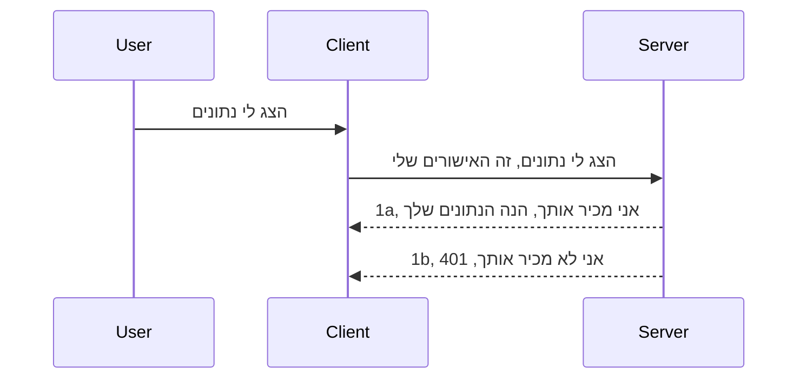

# אימות פשוט

MCP SDKs תומכות בשימוש ב-OAuth 2.1 שבעצם הוא תהליך די מורכב שכולל מושגים כמו שרת אימות, שרת משאבים, שליחת אישורים, קבלת קוד, המרת הקוד לסימן נושא (Bearer Token) עד שניתן סוף סוף לקבל את נתוני המשאבים. אם אינכם רגילים ל-OAuth שהוא דבר נהדר ליישום, כדאי להתחיל באיזשהו רמת אימות בסיסית ולבנות בהדרגה לאבטחה טובה וטובה יותר. לכן הפרק הזה קיים, כדי לבנות אתכם לאימות מתקדם יותר.

## אימות, למה הכוונה?

אימות הוא קיצור של אימות זהות והרשאה. הרעיון הוא שעלינו לבצע שני דברים:

- **אימות זהות**, שזה התהליך לקביעת אם אנו מאפשרים לאדם להיכנס לבית שלנו, שיש לו את הזכות להיות "כאן" כלומר יש לו גישה לשרת המשאבים שבו פועלים הפיצ'רים של שרת MCP שלנו.
- **הרשאה**, זה התהליך של בדיקת האם המשתמש אמור לקבל גישה למשאבים הספציפיים שהוא מבקש, לדוגמה ההזמנות האלו או המוצרים האלו או האם הוא מורשה לקרוא את התוכן אך לא למחוק אותו כדוגמה נוספת.

## אישורים: איך אנו אומרים למערכת מי אנחנו

ובכן, מרבית מפתחי האינטרנט מתחילים לחשוב במונחים של מתן אישור לשרת, לרוב סוד שאומר אם מותר להם להיות כאן "אימות זהות". אישור זה בדרך כלל הוא גרסה מוצפנת ב-base64 של שם משתמש וסיסמה או מפתח API שמזוהה יחידני של משתמש ספציפי.

זה כרוך בשליחתו דרך כותרת שנקראת "Authorization" כך:

```json
{ "Authorization": "secret123" }
```

זה בדרך כלל נקרא אימות בסיסי. איך הזרימה הכללית עובדת אז היא כך:


כעת כשאנחנו מבינים איך זה עובד מבחינת הזרימה, איך מיישמים את זה? ובכן, לרוב שרתי האינטרנט יש מושג שנקרא middleware, חתיכת קוד שרצה כחלק מהבקשה שיכולה לאמת אישורים, ואם האישורים תקינים היא מאפשרת לבקשה לעבור. אם בבקשה אין אישורים תקינים תקבלו שגיאת אימות. נראה איך אפשר ליישם את זה:

**Python**

```python
class AuthMiddleware(BaseHTTPMiddleware):
    async def dispatch(self, request, call_next):

        has_header = request.headers.get("Authorization")
        if not has_header:
            print("-> Missing Authorization header!")
            return Response(status_code=401, content="Unauthorized")

        if not valid_token(has_header):
            print("-> Invalid token!")
            return Response(status_code=403, content="Forbidden")

        print("Valid token, proceeding...")
       
        response = await call_next(request)
        # הוסף כל כותרות לקוח או שינוי בתגובה בדרך כלשהי
        return response


starlette_app.add_middleware(CustomHeaderMiddleware)
```

כאן יש לנו:

- יצרנו middleware בשם `AuthMiddleware` שבו מתודה `dispatch` נקראת על ידי שרת האינטרנט.
- הוספנו את ה-middleware לשרת האינטרנט:

    ```python
    starlette_app.add_middleware(AuthMiddleware)
    ```

- כתבנו לוגיקה של אימות שבודקת אם כותרת Authorization קיימת ואם הסוד שנשלח תקין:

    ```python
    has_header = request.headers.get("Authorization")
    if not has_header:
        print("-> Missing Authorization header!")
        return Response(status_code=401, content="Unauthorized")

    if not valid_token(has_header):
        print("-> Invalid token!")
        return Response(status_code=403, content="Forbidden")
    ```

    אם הסוד קיים ותקין, אז אנו מאפשרים לבקשה לעבור על ידי קריאה ל-`call_next` ומחזירים את התגובה.

    ```python
    response = await call_next(request)
    # הוסף כותרות מותאמות אישית או שנה את התגובה בצורה כלשהי
    return response
    ```

איך זה עובד הוא שכאשר מבוצעת בקשת רשת כלפי השרת, ה-middleware יופעל וביישום שלו הוא או יאפשר לבקשה לעבור או יחזיר שגיאה שמציינת שללקוח אין אישור להמשיך.

**TypeScript**

כאן אנו יוצרים middleware עם המסגרת הפופולרית Express ומנתבים את הבקשה לפני שהיא מגיעה לשרת MCP. הנה הקוד לכך:

```typescript
function isValid(secret) {
    return secret === "secret123";
}

app.use((req, res, next) => {
    // 1. כותרת האישור קיימת?
    if(!req.headers["Authorization"]) {
        res.status(401).send('Unauthorized');
    }
    
    let token = req.headers["Authorization"];

    // 2. בדוק תקפות.
    if(!isValid(token)) {
        res.status(403).send('Forbidden');
    }

   
    console.log('Middleware executed');
    // 3. מעביר את הבקשה לשלב הבא בצנרת הבקשות.
    next();
});
```

בקוד זה:

1. אנו בודקים אם כותרת Authorization קיימת מראש, אם לא, שולחים שגיאה 401.
2. מאמתים את האישורים / הטוקן, אם לא תקין, שולחים שגיאה 403.
3. בסוף מעבירים את הבקשה בצינור הבקשות ומחזירים את המשאב המבוקש.

## תרגיל: יישום אימות

בואו ניקח את הידע שלנו ונתנסה ביישום. הנה התוכנית:

שרת

- צור שרת אינטרנט ואינסטנס של MCP.
- יישם middleware לשרת.

לקוח

- שלח בקשת רשת, עם אישור, דרך כותרת.

### -1- צור שרת אינטרנט ואינסטנס MCP

בשלב הראשון, עלינו ליצור את האינסטנס של שרת האינטרנט ושל שרת MCP.

**Python**

כאן אנו יוצרים אינסטנס של שרת MCP, יוצרים אפליקציית starlette ומארחים אותה עם uvicorn.

```python
# יצירת שרת MCP

app = FastMCP(
    name="MCP Resource Server",
    instructions="Resource Server that validates tokens via Authorization Server introspection",
    host=settings["host"],
    port=settings["port"],
    debug=True
)

# יצירת אפליקציית ווב starlette
starlette_app = app.streamable_http_app()

# הפצת האפליקציה דרך uvicorn
async def run(starlette_app):
    import uvicorn
    config = uvicorn.Config(
            starlette_app,
            host=app.settings.host,
            port=app.settings.port,
            log_level=app.settings.log_level.lower(),
        )
    server = uvicorn.Server(config)
    await server.serve()

run(starlette_app)
```

בקוד זה אנו:

- יוצרים את שרת ה-MCP.
- בונים את אפליקציית starlette מתוך שרת ה-MCP, `app.streamable_http_app()`.
- מארחים ומפעילים את האפליקציה עם uvicorn `server.serve()`.

**TypeScript**

כאן אנו יוצרים אינסטנס של שרת MCP.

```typescript
const server = new McpServer({
      name: "example-server",
      version: "1.0.0"
    });

    // ... הקמת משאבי שרת, כלים והנחיות ...
```

יצירת שרת MCP זו תצטרך להתבצע בתוך הגדרת הנתיב POST /mcp, אז ניקח את הקוד למעלה ונעביר כך:

```typescript
import express from "express";
import { randomUUID } from "node:crypto";
import { McpServer } from "@modelcontextprotocol/sdk/server/mcp.js";
import { StreamableHTTPServerTransport } from "@modelcontextprotocol/sdk/server/streamableHttp.js";
import { isInitializeRequest } from "@modelcontextprotocol/sdk/types.js"

const app = express();
app.use(express.json());

// מפה לאחסון תחבורה לפי מזהה סשן
const transports: { [sessionId: string]: StreamableHTTPServerTransport } = {};

// טיפול בבקשות POST לתקשורת לקוח-לשרת
app.post('/mcp', async (req, res) => {
  // בדוק האם קיים מזהה סשן
  const sessionId = req.headers['mcp-session-id'] as string | undefined;
  let transport: StreamableHTTPServerTransport;

  if (sessionId && transports[sessionId]) {
    // שימוש חוזר בתחבורה קיימת
    transport = transports[sessionId];
  } else if (!sessionId && isInitializeRequest(req.body)) {
    // בקשת אתחול חדשה
    transport = new StreamableHTTPServerTransport({
      sessionIdGenerator: () => randomUUID(),
      onsessioninitialized: (sessionId) => {
        // אחסן את התחבורה לפי מזהה סשן
        transports[sessionId] = transport;
      },
      // הגנת DNS rebinding מושבתת כברירת מחדל לתאימות לאחור. אם אתה מריץ את השרת הזה
      // באופן מקומי, ודא להגדיר:
      // enableDnsRebindingProtection: true,
      // allowedHosts: ['127.0.0.1'],
    });

    // נקה את התחבורה כאשר היא סגורה
    transport.onclose = () => {
      if (transport.sessionId) {
        delete transports[transport.sessionId];
      }
    };
    const server = new McpServer({
      name: "example-server",
      version: "1.0.0"
    });

    // ... הגדר משאבי שרת, כלים והנחיות ...

    // התחבר לשרת MCP
    await server.connect(transport);
  } else {
    // בקשה לא תקינה
    res.status(400).json({
      jsonrpc: '2.0',
      error: {
        code: -32000,
        message: 'Bad Request: No valid session ID provided',
      },
      id: null,
    });
    return;
  }

  // טפל בבקשה
  await transport.handleRequest(req, res, req.body);
});

// מטפל רב שימושי לבקשות GET ו-DELETE
const handleSessionRequest = async (req: express.Request, res: express.Response) => {
  const sessionId = req.headers['mcp-session-id'] as string | undefined;
  if (!sessionId || !transports[sessionId]) {
    res.status(400).send('Invalid or missing session ID');
    return;
  }
  
  const transport = transports[sessionId];
  await transport.handleRequest(req, res);
};

// טיפול בבקשות GET להודעות יזומות מהשרת ללקוח באמצעות SSE
app.get('/mcp', handleSessionRequest);

// טיפול בבקשות DELETE לסיום סשן
app.delete('/mcp', handleSessionRequest);

app.listen(3000);
```

כעת אתם רואים כיצד יצירת שרת MCP הועברה לתוך `app.post("/mcp")`.

נעבור לשלב הבא ביצירת ה-middleware כדי שנוכל לאמת את האישורים הנכנסים.

### -2- יישום middleware לשרת

נעבור לקטע של middleware עכשיו. כאן ניצור middleware שמחפש אישור בכותרת `Authorization` ומאמת אותו. אם הוא תקין, הבקשה תמשיך לבצע את מה שצריך (למשל: רשימת כלים, קריאת משאב או כל פונקציונליות MCP שהלקוח ביקש).

**Python**

כדי ליצור את ה-middleware, עלינו ליצור מחלקה שיורשת מ-`BaseHTTPMiddleware`. יש שני חלקים מעניינים:

- הבקשה `request` שממנה נקרא את פרטי הכותרות.
- `call_next` הקריאה חזרה (callback) שצריך להפעיל אם הלקוח הביא אישור שאנו מקבלים.

קודם, צריך לטפל במקרה של היעדר כותרת `Authorization`:

```python
has_header = request.headers.get("Authorization")

# אין כותרת קיימת, כשל עם 401, אחרת להמשיך.
if not has_header:
    print("-> Missing Authorization header!")
    return Response(status_code=401, content="Unauthorized")
```

כאן אנו שולחים הודעת 401 ללא הרשאה, כי הלקוח נכשל באימות.

אחר כך, אם אישור הוגש, צריך לבדוק את תקינותו כך:

```python
 if not valid_token(has_header):
    print("-> Invalid token!")
    return Response(status_code=403, content="Forbidden")
```

שימו לב שאנו שולחים כאן הודעת 403 אסור. נראה את ה-middleware המלא למטה שמיישם את כל מה שהזכרנו למעלה:

```python
class AuthMiddleware(BaseHTTPMiddleware):
    async def dispatch(self, request, call_next):

        has_header = request.headers.get("Authorization")
        if not has_header:
            print("-> Missing Authorization header!")
            return Response(status_code=401, content="Unauthorized")

        if not valid_token(has_header):
            print("-> Invalid token!")
            return Response(status_code=403, content="Forbidden")

        print("Valid token, proceeding...")
        print(f"-> Received {request.method} {request.url}")
        response = await call_next(request)
        response.headers['Custom'] = 'Example'
        return response

```

מעולה, אבל מה עם הפונקציה `valid_token`? הנה היא למטה:

```python
# אל תשתמש בזה בייצור - שפר את זה !!
def valid_token(token: str) -> bool:
    # הסר את הקידומת "Bearer "
    if token.startswith("Bearer "):
        token = token[7:]
        return token == "secret-token"
    return False
```

כמובן שזו צריכה להשתפר.

חשוב: אסור לכם לעולם לשמור סודות כאלה בקוד. אידיאלית יש לשלוף את הערך להשוואה ממקור נתונים או מספק זהויות (IDP) או אפילו עדיף לתת ל-IDP לבצע את האימות.

**TypeScript**

כדי ליישם זאת עם Express, צריך לקרוא ל-metod `use` שלוקח פונקציות middleware.

צריך:

- לגשת למשתנה הבקשה (request) כדי לבדוק את האישור שהועבר בפרופרטי `Authorization`.
- לאמת את האישור ואם תקין, לאפשר לבקשה להמשיך ולהשלים את בקשת ה-MCP.

כאן אנו בודקים אם כותרת Authorization קיימת ואם לא, אנחנו עוצרים את הבקשה:

```typescript
if(!req.headers["authorization"]) {
    res.status(401).send('Unauthorized');
    return;
}
```

אם הכותרת לא נשלחה מלכתחילה תקבלו 401.

לאחר מכן, נבדוק אם האישורים תקינים ואם לא, נעצור את הבקשה שוב אך עם הודעה שונה מעט:

```typescript
if(!isValid(token)) {
    res.status(403).send('Forbidden');
    return;
} 
```

כעת תקבלו שגיאה 403.

הנה הקוד המלא:

```typescript
app.use((req, res, next) => {
    console.log('Request received:', req.method, req.url, req.headers);
    console.log('Headers:', req.headers["authorization"]);
    if(!req.headers["authorization"]) {
        res.status(401).send('Unauthorized');
        return;
    }
    
    let token = req.headers["authorization"];

    if(!isValid(token)) {
        res.status(403).send('Forbidden');
        return;
    }  

    console.log('Middleware executed');
    next();
});
```

הגדרנו את שרת האינטרנט לקבל middleware שבודק את האישורים שהלקוח מקווה לשלוח לנו. מה עם הלקוח עצמו?

### -3- שליחת בקשת רשת עם אישור דרך כותרת

צריך לוודא שהלקוח מעביר את האישורים דרך הכותרת. מאחר שאנו הולכים להשתמש בלקוח MCP לעשות זאת, צריך להבין איך עושים זאת.

**Python**

ללקוח צריך להעביר כותרת עם האישורים כך:

```python
# אל תקודד את הערך בקשיחה, יש לשמור אותו לפחות במשתנה סביבה או באחסון מאובטח יותר
token = "secret-token"

async with streamablehttp_client(
        url = f"http://localhost:{port}/mcp",
        headers = {"Authorization": f"Bearer {token}"}
    ) as (
        read_stream,
        write_stream,
        session_callback,
    ):
        async with ClientSession(
            read_stream,
            write_stream
        ) as session:
            await session.initialize()
      
            # TODO, מה שתרצה שיקרה בצד הלקוח, לדוגמה רשימת כלים, קריאת כלים וכו'.
```

שימו לב איך ממלאים את המאפיין `headers` כך ` headers = {"Authorization": f"Bearer {token}"}`.

**TypeScript**

ניתן לפתור זאת בשני שלבים:

1. למלא אובייקט תצורה עם האישורים שלנו.
2. להעביר את אובייקט התצורה לתחבורה (transport).

```typescript

// אל תקבע את הערך בקוד באופן קשה כפי שמוצג כאן. לפחות תשמור אותו כמשתנה סביבה ותשתמש במשהו כמו dotenv (במצב פיתוח).
let token = "secret123"

// הגדר אובייקט אפשרויות לשירות הלקוח
let options: StreamableHTTPClientTransportOptions = {
  sessionId: sessionId,
  requestInit: {
    headers: {
      "Authorization": "secret123"
    }
  }
};

// העבר את אובייקט האפשרויות לשירות
async function main() {
   const transport = new StreamableHTTPClientTransport(
      new URL(serverUrl),
      options
   );
```

כאן אתם רואים למעלה איך יצרנו אובייקט `options` ומכניסים את הכותרות תחת `requestInit`.

חשוב: איך משפרים את זה מכאן? ובכן, ליישום הנוכחי יש בעיות. ראשית, שליחת אישור כך היא די מסוכנת אלא אם כן יש לכם לפחות HTTPS. גם אז, האישורים יכולים להיגנב ולכן צריך מערכת שבה ניתן לבטל טוקנים בקלות ולהוסיף בדיקות נוספות כמו מאיפה בעולם זה מגיע, האם הבקשה מתבצעת תדירות גבוהה מדי (התנהגות של בוט), בקיצור יש הרבה דאגות.

עם זאת, צריך לומר שזה התחלה טובה עבור API פשוטים שבהם לא רוצים שאף אחד יקרא ל-API שלכם ללא אימות.

עם זאת, בואו ננסה לחזק את האבטחה קצת על ידי שימוש בפורמט מאוחד כמו JSON Web Token, הנקרא גם JWT או "JOT".

## JSON Web Tokens, JWT

אז, אנו מנסים לשפר את הדברים מעבר למתן אישורים פשוטים מאוד. מהן השיפורים המידיים שנקבל מאימוץ JWT?

- **שיפורי אבטחה**. באימות בסיסי, אתם שולחים שם משתמש וסיסמה כטוקן מקודד ב-base64 (או מפתח API) שוב ושוב, מה שמגדיל את הסיכון. עם JWT, אתם שולחים את שם המשתמש והסיסמה ומקבלים טוקן בתמורה שגם מוגבל בזמן כלומר שפג תוקפו. JWT מאפשר לכם בקלות להשתמש בשליטה על גישה מדויקת באמצעות תפקידים (roles), טווחים (scopes) והרשאות.
- **א-מדינותיות וסקלביליות**. JWT הם עצמאים, נושאים את כל פרטי המשתמש ומבטלים את הצורך באחסון סשן בשרת. הטוקן גם ניתן לאימות מקומי.
- **אינטגרציה ופדרציה**. JWT הוא מרכזי ב-Open ID Connect ומשמש עם ספקי זהות מוכרים כמו Entra ID, Google Identity ו-Auth0. הם מאפשרים גם שימוש ב-single sign on והרבה יותר, מה שהופך אותם לסטנדרט ארגוני.
- **מודולריות וגמישות**. JWT ניתן להשתמש גם עם שערי API כמו Azure API Management, NGINX ועוד. הוא תומך בתרחישי אימות ושיחה בין שרתים כולל ייפוי כוח והאצלה.
- **ביצועים וזיכרון מטמון**. JWT ניתן לשמור בזיכרון מטמון לאחר דקוד, מה שמפחית את הצורך בפענוח מחדש. זה עוזר במיוחד לאפליקציות עם תעבורה גבוהה כי משפר תפוקה ומפחית עומס על התשתית.
- **תכונות מתקדמות**. הוא גם תומך באינטראוספציה (בדיקת תוקף בשרת) ובקיזוז (ביטול טוקן).

עם כל היתרונות האלה, נבחין איך ניתן לקחת את היישום שלנו לרמה הבאה.

## הפיכת אימות בסיסי ל-JWT

אז, השינויים שעלינו לעשות ברמת המבט הכולל הם:

- **ללמוד לבנות טוקן JWT** ולהכין אותו לשליחה מהלקוח לשרת.
- **לאמת טוקן JWT**, ואם תקין, לאפשר ללקוח לקבל את המשאבים שלנו.
- **אחסון בטוח של הטוקן**. איך אנו מאחסנים את הטוקן.
- **לשמור על מסלולים מוגנים**. צריכים להגן על המסלולים, אצלנו, להגן על מסלולים ופיצ'רים ספציפיים של MCP.
- **להוסיף טוקני רענון**. לוודא שאנו יוצרים טוקנים בעלי חיי מדף קצרים אך גם טוקני רענון ארוכי חיים שניתן להשתמש בהם כדי לקבל טוקנים חדשים אם פגו. גם לוודא שיש נקודת רענון ואסטרטגיית סיבוב.

### -1- לייצר טוקן JWT

קודם כל, לטוקן JWT יש את החלקים הבאים:

- **header**, האלגוריתם והסוג של הטוקן.
- **payload**, התביעות (claims), כמו sub (המשתמש או הישות שהטוקן מייצג. בתרחיש אימות זה בדרך כלל מזהה המשתמש), exp (מתי פג תוקפו), role (התפקיד).
- **signature**, חתום עם סוד או מפתח פרטי.

לשם כך, נצטרך לבנות את ה-header, ה-payload והטוקן המקודד.

**Python**

```python

import jwt
import jwt
from jwt.exceptions import ExpiredSignatureError, InvalidTokenError
import datetime

# מפתח סודי המשמש לחתימת JWT
secret_key = 'your-secret-key'

header = {
    "alg": "HS256",
    "typ": "JWT"
}

# מידע המשתמש, הטענות שלו וזמן התפוגה
payload = {
    "sub": "1234567890",               # נושא (מזהה משתמש)
    "name": "User Userson",                # טענה מותאמת אישית
    "admin": True,                     # טענה מותאמת אישית
    "iat": datetime.datetime.utcnow(),# הופק ב
    "exp": datetime.datetime.utcnow() + datetime.timedelta(hours=1)  # פג תוקף
}

# קודד אותו
encoded_jwt = jwt.encode(payload, secret_key, algorithm="HS256", headers=header)
```

בקוד שלמעלה:

- הגדירו header עם אלגוריתם HS256 והגדרה שהוא JWT.
- בנו payload שכולל נושא או מזהה משתמש, שם משתמש, תפקיד, מתי הונפק ומתי צפוי לפוג, ובכך מיישם את ההגבלה בזמן שהזכרנו קודם.

**TypeScript**

כאן נזדקק לתלויות (dependencies) שיעזרו לנו לבנות את טוקן ה-JWT.

תלויות

```sh

npm install jsonwebtoken
npm install --save-dev @types/jsonwebtoken
```

עכשיו כשיש לנו את זה במקום, נעשה את ה-header, ה-payload ועל דרך זה ניצור את הטוקן המקודד.

```typescript
import jwt from 'jsonwebtoken';

const secretKey = 'your-secret-key'; // השתמש במשתני סביבה בייצור

// הגדר את המטען
const payload = {
  sub: '1234567890',
  name: 'User usersson',
  admin: true,
  iat: Math.floor(Date.now() / 1000), // הופק ב
  exp: Math.floor(Date.now() / 1000) + 60 * 60 // פג תוקף תוך שעה
};

// הגדר את הכותרת (אופציונלי, jsonwebtoken מגדיר ברירות מחדל)
const header = {
  alg: 'HS256',
  typ: 'JWT'
};

// צור את הטוקן
const token = jwt.sign(payload, secretKey, {
  algorithm: 'HS256',
  header: header
});

console.log('JWT:', token);
```

הטוקן הזה:

חתום עם HS256
תקף לשעה אחת
כולל claims כגון sub, name, admin, iat, ו-exp.

### -2- לאמת טוקן

נזדקק גם לאמת טוקן, דבר שצריך לעשות בצד השרת כדי לוודא שהלקוח באמת שולח טוקן תקין. יש הרבה בדיקות שיש לבצע כאן מהאימות של המבנה ועד תקינות הטוקן. מומלץ גם להוסיף בדיקות נוספות כמו לוודא שהמשתמש קיים במערכת ושהמשתמש אכן מורשה.

כדי לאמת טוקן, יש לפענח אותו כדי שנוכל לקרוא אותו ואז להתחיל לבדוק תקפות:

**Python**

```python

# פענח ואמת את ה-JWT
try:
    decoded = jwt.decode(token, secret_key, algorithms=["HS256"])
    print("✅ Token is valid.")
    print("Decoded claims:")
    for key, value in decoded.items():
        print(f"  {key}: {value}")
except ExpiredSignatureError:
    print("❌ Token has expired.")
except InvalidTokenError as e:
    print(f"❌ Invalid token: {e}")

```

בקוד זה, קוראים ל-`jwt.decode` עם הטוקן, מפתח הסוד והאלגוריתם שנבחר. שימו לב לשימוש ב-try-catch כי אימות כושל יגרום לשגיאה.

**TypeScript**

כאן צורך לקרוא ל-`jwt.verify` כדי לקבל גרסה מפוענחת של הטוקן שנוכל לנתח. אם הקריאה נכשלת, פירוש הדבר שמבנה הטוקן שגוי או שפג תוקפו.

```typescript

try {
  const decoded = jwt.verify(token, secretKey);
  console.log('Decoded Payload:', decoded);
} catch (err) {
  console.error('Token verification failed:', err);
}
```

הערה: כפי שנאמר קודם, יש לבצע בדיקות נוספות לוודא שהטוקן מתייחס למשתמש במערכת שלכם ולהבטיח שהמשתמש אכן מורשה כפי שטוען.

כעת נעבור לבדוק בקרת גישה מבוססת תפקידים, הידועה גם כ-RBAC.
## הוספת בקרת גישה מבוססת תפקידי משתמש

הרעיון הוא שאנחנו רוצים לבטא שתפקידים שונים מקבלים הרשאות שונות. לדוגמה, אנו מניחים שמנהל יכול לעשות הכל, שמשתמש רגיל יכול לקרוא ולכתוב, ואורח יכול רק לקרוא. לכן, הנה כמה דרגות הרשאה אפשריות:

- Admin.Write 
- User.Read
- Guest.Read

בואו נבחן איך ניתן ליישם בקרה כזו באמצעות middleware. ניתן להוסיף middleware לכל מסלול בנפרד וכן לכל המסלולים.

**Python**

```python
from starlette.middleware.base import BaseHTTPMiddleware
from starlette.responses import JSONResponse
import jwt

# אל תשמור את הסוד בקוד, זה רק לצורכי הדגמה. קרא אותו ממקום בטוח.
SECRET_KEY = "your-secret-key" # שים את זה במשתנה סביבה
REQUIRED_PERMISSION = "User.Read"

class JWTPermissionMiddleware(BaseHTTPMiddleware):
    async def dispatch(self, request, call_next):
        auth_header = request.headers.get("Authorization")
        if not auth_header or not auth_header.startswith("Bearer "):
            return JSONResponse({"error": "Missing or invalid Authorization header"}, status_code=401)

        token = auth_header.split(" ")[1]
        try:
            decoded = jwt.decode(token, SECRET_KEY, algorithms=["HS256"])
        except jwt.ExpiredSignatureError:
            return JSONResponse({"error": "Token expired"}, status_code=401)
        except jwt.InvalidTokenError:
            return JSONResponse({"error": "Invalid token"}, status_code=401)

        permissions = decoded.get("permissions", [])
        if REQUIRED_PERMISSION not in permissions:
            return JSONResponse({"error": "Permission denied"}, status_code=403)

        request.state.user = decoded
        return await call_next(request)


```

ישנן כמה דרכים שונות להוספת ה-middleware כמו למטה:

```python

# אפשרות 1: הוסף מידלוור בזמן בניית אפליקציית starlette
middleware = [
    Middleware(JWTPermissionMiddleware)
]

app = Starlette(routes=routes, middleware=middleware)

# אפשרות 2: הוסף מידלוור לאחר שהאפליקציה של starlette נבנתה כבר
starlette_app.add_middleware(JWTPermissionMiddleware)

# אפשרות 3: הוסף מידלוור לכל נתיב
routes = [
    Route(
        "/mcp",
        endpoint=..., # מטפל
        middleware=[Middleware(JWTPermissionMiddleware)]
    )
]
```

**TypeScript**

ניתן להשתמש ב-`app.use` וב-middleware שירוץ עבור כל הבקשות.

```typescript
app.use((req, res, next) => {
    console.log('Request received:', req.method, req.url, req.headers);
    console.log('Headers:', req.headers["authorization"]);

    // 1. בדוק אם הכותרת האישור נשלחה

    if(!req.headers["authorization"]) {
        res.status(401).send('Unauthorized');
        return;
    }
    
    let token = req.headers["authorization"];

    // 2. בדוק אם הטוקן תקף
    if(!isValid(token)) {
        res.status(403).send('Forbidden');
        return;
    }  

    // 3. בדוק אם משתמש הטוקן קיים במערכת שלנו
    if(!isExistingUser(token)) {
        res.status(403).send('Forbidden');
        console.log("User does not exist");
        return;
    }
    console.log("User exists");

    // 4. אמת שהטוקן מכיל את ההרשאות הנכונות
    if(!hasScopes(token, ["User.Read"])){
        res.status(403).send('Forbidden - insufficient scopes');
    }

    console.log("User has required scopes");

    console.log('Middleware executed');
    next();
});

```

יש כמה דברים שנוכל לאפשר ל-middleware שלנו וכן ש- middleware שלנו חייב לעשות, כלומר:

1. לבדוק אם כותרת האישור קיימת
2. לבדוק אם הטוקן תקף, אנו קוראים ל-`isValid` שהוא שיטה שכתבנו שבודקת את השלמות והתקפות של טוקן JWT.
3. לוודא שהמשתמש קיים במערכת שלנו, עלינו לבדוק זאת.

   ```typescript
    // משתמשים בבסיס הנתונים
   const users = [
     "user1",
     "User usersson",
   ]

   function isExistingUser(token) {
     let decodedToken = verifyToken(token);

     // TODO, לבדוק אם המשתמש קיים בבסיס הנתונים
     return users.includes(decodedToken?.name || "");
   }
   ```

  למעלה, יצרנו רשימת `users` פשוטה מאוד, שצריכה להיות כמובן במסד נתונים.

4. בנוסף, עלינו לוודא שהטוקן מכיל את ההרשאות הנכונות.

   ```typescript
   if(!hasScopes(token, ["User.Read"])){
        res.status(403).send('Forbidden - insufficient scopes');
   }
   ```

  בקוד למעלה מה-middleware אנו בודקים שהטוקן מכיל את ההרשאה User.Read, אם לא נשלח שגיאה 403. למטה מופיעה שיטת העזר `hasScopes`.

   ```typescript
   function hasScopes(scope: string, requiredScopes: string[]) {
     let decodedToken = verifyToken(scope);
    return requiredScopes.every(scope => decodedToken?.scopes.includes(scope));
  }
   ```

Have a think which additional checks you should be doing, but these are the absolute minimum of checks you should be doing.

Using Express as a web framework is a common choice. There are helpers library when you use JWT so you can write less code.

- `express-jwt`, helper library that provides a middleware that helps decode your token.
- `express-jwt-permissions`, this provides a middleware `guard` that helps check if a certain permission is on the token.

Here's what these libraries can look like when used:

```typescript
const express = require('express');
const jwt = require('express-jwt');
const guard = require('express-jwt-permissions')();

const app = express();
const secretKey = 'your-secret-key'; // put this in env variable

// Decode JWT and attach to req.user
app.use(jwt({ secret: secretKey, algorithms: ['HS256'] }));

// Check for User.Read permission
app.use(guard.check('User.Read'));

// multiple permissions
// app.use(guard.check(['User.Read', 'Admin.Access']));

app.get('/protected', (req, res) => {
  res.json({ message: `Welcome ${req.user.name}` });
});

// Error handler
app.use((err, req, res, next) => {
  if (err.code === 'permission_denied') {
    return res.status(403).send('Forbidden');
  }
  next(err);
});

```

כעת ראיתם איך ניתן להשתמש ב-middleware הן לאימות והן להרשאת גישה, אז מה עם MCP? האם זה משנה את אופן האימות שלנו? נגלה זאת בסעיף הבא.

### -3- הוספת RBAC ל-MCP

עד כה ראיתם איך אפשר להוסיף RBAC באמצעות middleware, אך ל-MCP אין דרך פשוטה להוסיף RBAC לכל תכונה, אז מה עושים? פשוט מוסיפים קוד כזה שבמקרה הזה בודק האם ללקוח יש את הזכויות לקרוא לכלי מסוים:

יש לכם כמה אפשרויות כיצד להשיג RBAC לכל תכונה, הנה כמה מהן:

- הוספת בדיקה עבור כל כלי, משאב, prompt בו צריך לבדוק רמת הרשאה.

   **python**

   ```python
   @tool()
   def delete_product(id: int):
      try:
          check_permissions(role="Admin.Write", request)
      catch:
        pass # הלקוח נכשל באימות, להעלות שגיאת אימות
   ```

   **typescript**

   ```typescript
   server.registerTool(
    "delete-product",
    {
      title: Delete a product",
      description: "Deletes a product",
      inputSchema: { id: z.number() }
    },
    async ({ id }) => {
      
      try {
        checkPermissions("Admin.Write", request);
        // לעשות, לשלוח מזהה ל-productService וכניסה מרוחקת
      } catch(Exception e) {
        console.log("Authorization error, you're not allowed");  
      }

      return {
        content: [{ type: "text", text: `Deletected product with id ${id}` }]
      };
    }
   );
   ```


- שימוש בגישה מתקדמת של השרת ובמנהל הבקשות כך שתצמצמו את כמות המקומות שיש לבצע בהם את הבדיקה.

   **Python**

   ```python
   
   tool_permission = {
      "create_product": ["User.Write", "Admin.Write"],
      "delete_product": ["Admin.Write"]
   }

   def has_permission(user_permissions, required_permissions) -> bool:
      # user_permissions: רשימת ההרשאות שיש למשתמש
      # required_permissions: רשימת ההרשאות הנדרשות לכלי
      return any(perm in user_permissions for perm in required_permissions)

   @server.call_tool()
   async def handle_call_tool(
     name: str, arguments: dict[str, str] | None
   ) -> list[types.TextContent]:
    # הנח ש-request.user.permissions היא רשימת ההרשאות של המשתמש
     user_permissions = request.user.permissions
     required_permissions = tool_permission.get(name, [])
     if not has_permission(user_permissions, required_permissions):
        # לעורר שגיאה "אין לך הרשאה להפעיל את הכלי {name}"
        raise Exception(f"You don't have permission to call tool {name}")
     # להמשיך ולהפעיל את הכלי
     # ...
   ```   
   

   **TypeScript**

   ```typescript
   function hasPermission(userPermissions: string[], requiredPermissions: string[]): boolean {
       if (!Array.isArray(userPermissions) || !Array.isArray(requiredPermissions)) return false;
       // החזר אמת אם למשתמש יש לפחות הרשאה אחת נדרשת
       
       return requiredPermissions.some(perm => userPermissions.includes(perm));
   }
  
   server.setRequestHandler(CallToolRequestSchema, async (request) => {
      const { params: { name } } = request;
  
      let permissions = request.user.permissions;
  
      if (!hasPermission(permissions, toolPermissions[name])) {
         return new Error(`You don't have permission to call ${name}`);
      }
  
      // תמשיך..
   });
   ```

   שימו לב, תצטרכו לוודא שה-middleware שלכם מייחס טוקן מפוענח לשדה user בבקשה כך שהקוד למעלה יהיה פשוט.

### לסיכום

כעת שדיברנו איך להוסיף תמיכה ב-RBAC בכלל ול-MCP בפרט, הגיע הזמן לנסות ליישם אבטחה בעצמכם כדי לוודא שהבנתם את המושגים שהוצגו.

## מטלה 1: בניית שרת MCP ולקוח MCP תוך שימוש באימות בסיסי

כאן תיישמו את מה שלמדתם לגבי שליחת אישורים דרך כותרות.

## פתרון 1

[פתרון 1](./code/basic/README.md)

## מטלה 2: שדרוג הפתרון ממטלה 1 לשימוש ב-JWT

קחו את הפתרון הראשון אך הפעם, נשפר אותו.

במקום להשתמש ב-Basic Auth, נשתמש ב-JWT.

## פתרון 2

[פתרון 2](./solution/jwt-solution/README.md)

## אתגר

הוסיפו RBAC לכל כלי כפי שתואר בסעיף "הוספת RBAC ל-MCP".

## סיכום

כעת התקווה היא שלמדתם הרבה בפרק זה, מאבטחה חסרה, לאבטחה בסיסית, ל-JWT ואיך ניתן להוסיף אותו ל-MCP.

בנינו בסיס מוצק עם JWT מותאם אישית, אך ככל שאנו מתרחבים, אנו נעים לעבר מודל זהות מבוסס סטנדרטים. אימוץ ספק זהויות כגון Entra או Keycloak מאפשר לנו להעביר את האחריות להנפקת הטוקנים, אימותם, וניהול מחזור החיים לפלטפורמה מהימנה - וכך להתמקד בלוגיקה של האפליקציה ובחוויית המשתמש.

לשם כך, יש לנו פרק [מתקדם יותר על Entra](../../05-AdvancedTopics/mcp-security-entra/README.md)

## מה הלאה

- הבא: [הגדרת מארחי MCP](../12-mcp-hosts/README.md)

---

<!-- CO-OP TRANSLATOR DISCLAIMER START -->
**כתב ויתור אחריות**:  
מסמך זה תורגם באמצעות שירות תרגום מבוסס בינה מלאכותית [Co-op Translator](https://github.com/Azure/co-op-translator). אף שאנו שואפים לדייק, יש לקחת בחשבון כי תרגומים אוטומטיים עלולים להכיל שגיאות או אי דיוקים. המסמך המקורי בשפת המקור נחשב למקור הסמכותי. עבור מידע קריטי, מומלץ להיעזר בתרגום מקצועי של אדם. אנו לא נושאים באחריות לכל אי הבנה או פרשנות שגויה הנובעת משימוש בתרגום זה.
<!-- CO-OP TRANSLATOR DISCLAIMER END -->