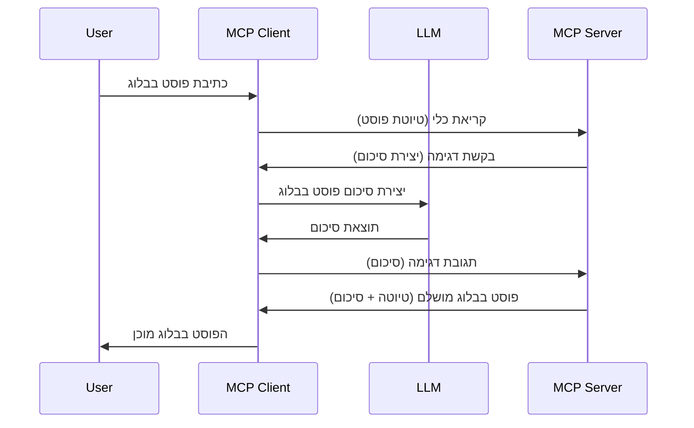

# דגימה - להאציל תכונות ללקוח

לפעמים, אתה צריך שהלקוח של MCP והשרת של MCP ישתפו פעולה כדי להשיג מטרה משותפת. ייתכן שיש מקרה שבו השרת זקוק לעזרת מודל שפה גדול (LLM) שיושב על הלקוח. עבור מצב כזה, דגימה היא מה שעליך להשתמש בו.

בואו נחקור כמה מקרים של שימוש ואיך לבנות פתרון הכולל דגימה.

## סקירה כללית

בפרק זה נתמקד בהסבר מתי והיכן להשתמש בדגימה ואיך להגדיר אותה.

## מטרות הלמידה

בפרק זה אנו נלמד:

- להסביר מהי דגימה ומתי להשתמש בה.
- להראות איך להגדיר דגימה ב-MCP.
- לספק דוגמאות לדגימה בפעולה.

## מהי דגימה ולמה להשתמש בה?

דגימה היא תכונה מתקדמת שפועלת בדרך הבאה:


### בקשת דגימה

טוב, עכשיו שיש לנו תמונה כללית של תרחיש אמין, בוא נדבר על בקשת הדגימה שהשרת שולח ללקוח. כך יכולה להיראות בקשה כזו בפורמט JSON-RPC:

```json
{
  "jsonrpc": "2.0",
  "id": 1,
  "method": "sampling/createMessage",
  "params": {
    "messages": [
      {
        "role": "user",
        "content": {
          "type": "text",
          "text": "Create a blog post summary of the following blog post: <BLOG POST>"
        }
      }
    ],
    "modelPreferences": {
      "hints": [
        {
          "name": "claude-3-sonnet"
        }
      ],
      "intelligencePriority": 0.8,
      "speedPriority": 0.5
    },
    "systemPrompt": "You are a helpful assistant.",
    "maxTokens": 100
  }
}
```

יש כמה דברים שכדאי לציין כאן:

- הפרומפט, תחת content -> text, הוא הפרומפט שלנו שהוא הוראה ל-LLM לסכם תוכן פוסט בלוג.

- **modelPreferences**. בחלק זה מדובר פשוט בהעדפה, המלצה לגבי תצורה להשתמש בה עם ה-LLM. המשתמש יכול לבחור אם ללכת עם ההמלצות האלה או לשנות אותן. במקרה זה יש המלצות על דגם לשימוש ועל סדר עדיפויות של מהירות ואינטיליגנציה.
- **systemPrompt**, זה הפרומפט המערכת הרגיל שלך שנותן ל-LLM שלך אישיות ומכיל הנחיות והוראות.
- **maxTokens**, זוהי תכונה נוספת המשמשת לציין כמה טוקנים מומלץ להשתמש למשימה זו.

### תגובת דגימה

תגובה זו היא מה שהלקוח של MCP בסופו של דבר שולח בחזרה לשרת של MCP והיא תוצאה של קריאת ה-LLM על ידי הלקוח, המתנה לתגובה ואז בניית הודעה זו. כך יכולה להיראות תגובה כזו ב-JSON-RPC:

```json
{
  "jsonrpc": "2.0",
  "id": 1,
  "result": {
    "role": "assistant",
    "content": {
      "type": "text",
      "text": "Here's your abstract <ABSTRACT>"
    },
    "model": "gpt-5",
    "stopReason": "endTurn"
  }
}
```

שים לב כיצד התגובה היא תקציר של פוסט הבלוג בדיוק כפי שביקשנו. שים לב גם שהדגם שבו השתמשו איננו זה שביקשנו אלא "gpt-5" במקום "claude-3-sonnet". זה המדגים שהמשתמש יכול לשנות את דעתו לגבי מה להשתמש ושהבקשה שלך לדגימה היא המלצה.

טוב, עכשיו כשאנחנו מבינים את הזרימה הראשית, ומשימה שימושית להשתמש בה היא "יצירת פוסט בלוג + תקציר", בוא נראה מה נדרש לעשות כדי לגרום לזה לעבוד.

### סוגי הודעות

הודעות דגימה אינן מוגבלות לטקסט בלבד אלא ניתן גם לשלוח תמונות ואודיו. כך נראית הפורמט השונה של JSON-RPC:

**טקסט**

```json
{
  "type": "text",
  "text": "The message content"
}
```

**תוכן תמונה**

```json
{
  "type": "image",
  "data": "base64-encoded-image-data",
  "mimeType": "image/jpeg"
}
```

**תוכן אודיו**

```json
{
  "type": "audio",
  "data": "base64-encoded-audio-data",
  "mimeType": "audio/wav"
}
```

> הערה: למידע מפורט יותר על דגימה, עיין ב[התיעוד הרשמי](https://modelcontextprotocol.io/specification/2025-06-18/client/sampling)

## כיצד להגדיר דגימה בלקוח

> הערה: אם אתה בונה רק שרת, אין צורך לעשות הרבה כאן.

בלקוח, עליך לציין את התכונה הבאה כך:

```json
{
  "capabilities": {
    "sampling": {}
  }
}
```

לאחר מכן זה ייתפס כאשר הלקוח שבחרת מאתחל את השרת.

## דוגמה לדגימה בפעולה - יצירת פוסט בלוג

בוא נקודד יחד שרת דגימה, נצטרך לעשות את הדברים הבאים:

1. ליצור כלי בשרת.
1. הכלי יוצר בקשת דגימה.
1. הכלי מחכה לתשובה של בקשת הדגימה מהלקוח.
1. ואז מייצרים את תוצאת הכלי.

בוא נראה את הקוד שלב אחר שלב:

### -1- יצירת הכלי

**python**

```python
@mcp.tool()
async def create_blog(title: str, content: str, ctx: Context[ServerSession, None]) -> str:
    """Create a blog post and generate a summary"""

```

### -2- יצירת בקשת דגימה

הרחב את הכלי שלך עם הקוד הבא:

**python**

```python
post = BlogPost(
        id=len(posts) + 1,
        title=title,
        content=content,
        abstract=""
    )

prompt = f"Create an abstract of the following blog post: title: {title} and draft: {content} "

result = await ctx.session.create_message(
        messages=[
            SamplingMessage(
                role="user",
                content=TextContent(type="text", text=prompt),
            )
        ],
        max_tokens=100,
)

```

### -3- המתן לתגובה והחזר אותה

**python**

```python
post.abstract = result.content.text

posts.append(post)

# החזר את המוצר המלא
return json.dumps({
    "id": post.title,
    "abstract": post.abstract
})
```

### -4- קוד מלא

**python**

```python
from starlette.applications import Starlette
from starlette.routing import Mount, Host

from mcp.server.fastmcp import Context, FastMCP

from mcp.server.session import ServerSession
from mcp.types import SamplingMessage, TextContent

import json


from uuid import uuid4
from typing import List
from pydantic import BaseModel


mcp = FastMCP("Blog post generator")

# אפליקציה = FastAPI()

posts = []

class BlogPost(BaseModel):
    id: int
    title: str
    content: str
    abstract: str

posts: List[BlogPost] = []

@mcp.tool()
async def create_blog(title: str, content: str, ctx: Context[ServerSession, None]) -> str:
    """Create a blog post and generate a summary"""

    post = BlogPost(
        id=len(posts) + 1,
        title=title,
        content=content,
        abstract=""
    )

    prompt = f"Create an abstract of the following blog post: title: {title} and draft: {content} "

    result = await ctx.session.create_message(
        messages=[
            SamplingMessage(
                role="user",
                content=TextContent(type="text", text=prompt),
            )
        ],
        max_tokens=100,
    )

    post.abstract = result.content.text

    posts.append(post)

    # מחזיר את הפוסט המלא של הבלוג
    return json.dumps({
        "id": post.title,
        "abstract": post.abstract
    })

if __name__ == "__main__":
    print("Starting server...")
    # mcp.הפעל()
    mcp.run(transport="streamable-http")

# הרץ את האפליקציה עם: python server.py
```

### -5- בדיקה ב-Visual Studio Code

כדי לבדוק זאת ב-Visual Studio Code, בצע את הפעולות הבאות:

1. הפעל את השרת בטרמינל
1. הוסף אותו ל-*mcp.json* (והבטח שהוא פועל) לדוגמה כך:

   ```json
   "servers": {
      "blog-server": {
        "type": "http",
        "url": "http://localhost:8000/mcp"
      }
   }
   ```

1. הקלד פרומפט:

   ```text
   create a blog post named "Where Python comes from", the content is "Python is actually named after Monty Python Flying Circus"
   ```

1. אפשר לדגימה להתבצע. בפעם הראשונה שתבדוק זאת יוצג לך דו-שיח נוסף שעליך לאשר, אז תראה את הדו-שיח הרגיל שמבקש ממך להפעיל את הכלי.

1. בדוק את התוצאות. תראה את התוצאות מוצגות יפה בשיחה של GitHub Copilot אך ניתן גם לבדוק את תגובת ה-JSON הגולמית.

**בונוס**. לכלי Visual Studio Code יש תמיכה מצוינת לדגימה. ניתן להגדיר גישה לדגימה על השרת המותקן שלך על ידי ניווט כך:

1. עבור לכרטיסיית ההרחבות.
1. בחר באייקון ההגדרות לשרת שהתקנת בקטגוריית "MCP SERVERS - INSTALLED".
1. בחר "Configure Model Access", כאן תוכל לבחור אילו דגמים GitHub Copilot מורשה להשתמש בהם בעת ביצוע דגימה. ניתן גם לראות את כל בקשות הדגימה שהתקיימו לאחרונה על ידי בחירה ב-"Show Sampling requests".

## מטלה

במטלה זו תבנה דגימה שונה במקצת, כלומר אינטגרציית דגימה שתומכת ביצירת תיאור מוצר. הנה התרחיש שלך:

**תרחיש**: עובד המשרד האחורי באתר מסחר אלקטרוני זקוק לעזרה, לוקח יותר מדי זמן ליצור תיאורי מוצרים. לכן, עליך לבנות פתרון שבו ניתן לקרוא לכלי בשם "create_product" עם פרמטרים "title" ו-"keywords" והוא יפיק מוצר מלא הכולל שדה "description" שיש למלא על ידי LLM של הלקוח.

טיפ: השתמש במה שלמדת מקודם כדי לבנות את השרת וכליו באמצעות בקשת דגימה.

## פתרון

[פתרון](./solution/README.md)

## נקודות מפתח

דגימה היא תכונה חזקה המאפשרת לשרת לאצול משימות ללקוח כאשר הוא זקוק לעזרת LLM.

## מה הלאה

- [פרק 4 - יישום מעשי](../../04-PracticalImplementation/README.md)

---

<!-- CO-OP TRANSLATOR DISCLAIMER START -->
**הצהרת אי-אחריות**:  
מסמך זה תורגם באמצעות שירות תרגום מבוסס בינה מלאכותית [Co-op Translator](https://github.com/Azure/co-op-translator). למרות שאנו שואפים לדיוק, יש לקחת בחשבון כי תרגומים אוטומטיים עלולים להכיל שגיאות או אי-דיוקים. המסמך המקורי בשפת המקור שלו צריך להיחשב כמקור הסמכות. למידע חשוב, מומלץ להיעזר בתרגום מקצועי של אדם. אנו לא אחראים לכל הבנה מוטעית או פרשנות שגויה הנובעות משימוש בתרגום זה.
<!-- CO-OP TRANSLATOR DISCLAIMER END -->