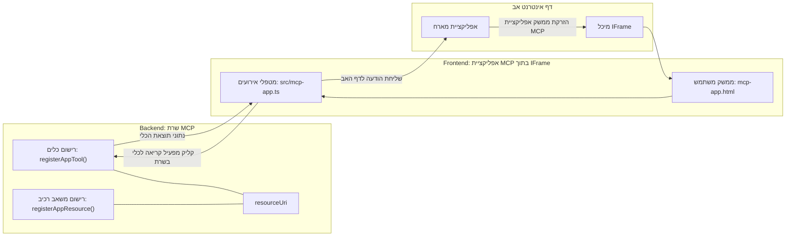

# אפליקציות MCP

אפליקציות MCP הן פרדיגמה חדשה ב-MCP. הרעיון הוא שלא רק מחזירים נתונים מתגובה לקריאת כלי, אלא שגם מספקים מידע לגבי איך יש להתייחס למידע הזה. משמעות הדבר היא שתוצאות כלי כעת יכולות לכלול מידע ממשק משתמש. למה נרצה את זה? ובכן, שקלו איך אתם פועלים היום. סביר להניח שאתם צורכים את התוצאות של שרת MCP על ידי הצבת קידמת-קצה כלשהי מולו, זה קוד שאתם צריכים לכתוב ולתחזק. לפעמים זה מה שאתם רוצים, אבל לפעמים זה יהיה נהדר אם תוכלו פשוט להביא קטע קוד קטן שמכיל את הכל - מהנתונים ועד לממשק המשתמש.

## סקירה כללית

השיעור הזה מספק הדרכה מעשית על אפליקציות MCP, איך להתחיל איתן ואיך לשלב אותן באפליקציות הרשת הקיימות שלכם. אפליקציות MCP הן תוספת חדשה מאוד לתקן MCP.

## מטרות הלמידה

בסוף שיעור זה, תוכלו:

- להסביר מהן אפליקציות MCP.
- מתי להשתמש באפליקציות MCP.
- לבנות ולשלב אפליקציות MCP משלכם.

## אפליקציות MCP - איך זה עובד

הרעיון באפליקציות MCP הוא לספק תגובה שהיא למעשה רכיב להצגה. רכיב כזה יכול לכלול הן תצוגות והן אינטראקטיביות, למשל, לחיצות כפתור, קלט משתמש ועוד. נתחיל עם צד השרת ושרת ה-MCP שלנו. ליצירת רכיב אפליקציית MCP צריך ליצור כלי וגם את משאב האפליקציה. שני חלקים אלו מתחברים באמצעות resourceUri.

הנה דוגמה. בואו ננסה לדמיין מה מעורב ואילו חלקים עושים כל דבר:

```text
server.ts -- responsible for registering tools and the component as a UI component
src/
  mcp-app.ts -- wiring up event handlers
mcp-app.html -- the user interface
```

תצוגה זו מתארת את הארכיטקטורה ליצירת רכיב ולוגיקתו.


ננסה לתאר אחר כך את תחומי האחריות עבור ה-backend וה-frontend בהתאמה.

### ה-backend

יש שתי משימות שעלינו להשלים כאן:

- רישום הכלים שאנו רוצים לתקשר איתם.
- הגדרת הרכיב.

**רישום הכלי**

```typescript
registerAppTool(
    server,
    "get-time",
    {
      title: "Get Time",
      description: "Returns the current server time.",
      inputSchema: {},
      _meta: { ui: { resourceUri } }, // מקשר את הכלי הזה למשאב הממשק הגרפי שלו
    },
    async () => {
      const time = new Date().toISOString();
      return { content: [{ type: "text", text: time }] };
    },
  );

```

הקוד שלמעלה מתאר את ההתנהגות, שם הוא חושף כלי בשם `get-time`. הוא לא מקבל קלטים אך בסופו של דבר מייצר את השעה הנוכחית. יש לנו אפשרות להגדיר `inputSchema` לכלים שבהם אנחנו צריכים לקבל קלט ממשתמש.

**רישום הרכיב**

בקובץ עצמו, אנחנו גם צריכים לרשום את הרכיב:

```typescript
const resourceUri = "ui://get-time/mcp-app.html";

// רשום את המשאב, שמחזיר את ה-HTML/JavaScript המאוחד לממשק המשתמש.
registerAppResource(
  server,
  resourceUri,
  resourceUri,
  { mimeType: RESOURCE_MIME_TYPE },
  async () => {
    const html = await fs.readFile(path.join(DIST_DIR, "mcp-app.html"), "utf-8");

    return {
    contents: [
        { uri: resourceUri, mimeType: RESOURCE_MIME_TYPE, text: html },
    ],
    };
  },
);
```

שימו לב איך מציינים את `resourceUri` כדי לחבר את הרכיב עם הכלים שלו. מעניין גם הקריאות שבהן אנחנו טוענים את קובץ הממשק ומחזירים את הרכיב.

### ה-frontend של הרכיב

כמו ב-backend, יש כאן שני חלקים:

- frontend שנכתב ב-HTML טהור.
- קוד המטפל באירועים ומה לעשות, למשל קריאת כלים או שליחת הודעות לחלון האב.

**ממשק משתמש**

בואו נעיף מבט בממשק המשתמש.

```html
<!-- mcp-app.html -->
<!DOCTYPE html>
<html lang="en">
  <head>
    <meta charset="UTF-8" />
    <title>Get Time App</title>
  </head>
  <body>
    <p>
      <strong>Server Time:</strong> <code id="server-time">Loading...</code>
    </p>
    <button id="get-time-btn">Get Server Time</button>
    <script type="module" src="/src/mcp-app.ts"></script>
  </body>
</html>
```

**חיבור אירועים**

החלק האחרון הוא חיבור האירועים. זאת אומרת אנחנו מזהים איזה חלק בממשק שלנו צריך מאזיני אירועים ומה לעשות כאשר האירועים מתרחשים:

```typescript
// mcp-app.ts

import { App } from "@modelcontextprotocol/ext-apps";

// קבל הפניות לאלמנטים
const serverTimeEl = document.getElementById("server-time")!;
const getTimeBtn = document.getElementById("get-time-btn")!;

// צור מופע אפליקציה
const app = new App({ name: "Get Time App", version: "1.0.0" });

// טיפול בתוצאות הכלי מהשרת. הגדר לפני `app.connect()` כדי להימנע מ-
// החמצת תוצאת הכלי ההתחלתית.
app.ontoolresult = (result) => {
  const time = result.content?.find((c) => c.type === "text")?.text;
  serverTimeEl.textContent = time ?? "[ERROR]";
};

// חבר לחצן ללחיצה
getTimeBtn.addEventListener("click", async () => {
  // `app.callServerTool()` מאפשר ל-UI לבקש נתונים חדשים מהשרת
  const result = await app.callServerTool({ name: "get-time", arguments: {} });
  const time = result.content?.find((c) => c.type === "text")?.text;
  serverTimeEl.textContent = time ?? "[ERROR]";
});

// התחבר למארח
app.connect();
```

כפי שניתן לראות מהדוגמה, זה קוד רגיל לחיבור אלמנטים ב-DOM לאירועים. שווה לציין את הקריאה ל-`callServerTool` שמביאה בסופו של דבר לקריאה לכלי ב-backend.

## התמודדות עם קלט משתמש

עד כה, ראינו רכיב עם כפתור שלחיצה עליו מפעילה כלי. בואו נראה אם נוכל להוסיף עוד אלמנטים לממשק כמו שדה קלט ולראות אם נוכל לשלוח ארגומנטים לכלי. ניישם פונקציונליות של שאלות נפוצות (FAQ). כך זה אמור לעבוד:

- יהיה כפתור ואלמנט קלט שבו המשתמש מקליד מילה לחיפוש, למשל "משלוח". זה יקרא לכלי ב-backend שעושה חיפוש בנתוני השאלות הנפוצות.
- כלי שתומך בחיפוש ה-FAQ שהוזכר.

בואו נוסיף את התמיכה הנדרשת ב-backend קודם:

```typescript
const faq: { [key: string]: string } = {
    "shipping": "Our standard shipping time is 3-5 business days.",
    "return policy": "You can return any item within 30 days of purchase.",
    "warranty": "All products come with a 1-year warranty covering manufacturing defects.",
  }

registerAppTool(
    server,
    "get-faq",
    {
      title: "Search FAQ",
      description: "Searches the FAQ for relevant answers.",
      inputSchema: zod.object({
        query: zod.string().default("shipping"),
      }),
      _meta: { ui: { resourceUri: faqResourceUri } }, // מקשר את הכלי הזה למשאב ממשק המשתמש שלו
    },
    async ({ query }) => {
      const answer: string = faq[query.toLowerCase()] || "Sorry, I don't have an answer for that.";
      return { content: [{ type: "text", text: answer }] };
    },
  );
```

מה שאנו רואים כאן זה איך ממלאים את `inputSchema` ונותנים לו סכמת `zod` כך:

```typescript
inputSchema: zod.object({
  query: zod.string().default("shipping"),
})
```

בסכימה למעלה מצהירים שיש לנו פרמטר קלט בשם `query` שהוא אופציונלי עם ערך ברירת מחדל "shipping".

אוקיי, נמשיך ל-*mcp-app.html* לראות איזה ממשק משתמש צריך ליצור:

```html
<div class="faq">
    <h1>FAQ response</h1>
    <p>FAQ Response: <code id="faq-response">Loading...</code></p>
    <input type="text" id="faq-query" placeholder="Enter FAQ query" />
    <button id="get-faq-btn">Get FAQ Response</button>
  </div>
```

מצוין, עכשיו יש לנו אלמנט קלט וכפתור. בואו נעבור ל-*mcp-app.ts* כדי לחבר את האירועים האלה:

```typescript
const getFaqBtn = document.getElementById("get-faq-btn")!;
const faqQueryInput = document.getElementById("faq-query") as HTMLInputElement;

getFaqBtn.addEventListener("click", async () => {
  const query = faqQueryInput.value;
  const result = await app.callServerTool({ name: "get-faq", arguments: { query } });
  const faq = result.content?.find((c) => c.type === "text")?.text;
  faqResponseEl.textContent = faq ?? "[ERROR]";
});
```

בקוד שלמעלה:

- יוצרים הפניות לאלמנטים האינטראקטיביים בממשק.
- מטפלים בלחיצה על כפתור כדי לנתח את ערך השדה ומבצעים קריאה ל-`app.callServerTool()` עם `name` ו-`arguments` כאשר האחרון מעביר את `query` כערך.

מה שבאמת קורה בלחיצה על `callServerTool` הוא שהוא שולח הודעה לחלון האב והחלון הזה בסופו של דבר קורא לשרת ה-MCP.

### נסו את זה

כשננסה את זה, כעת נוכל לראות את הדברים הבאים:


וכאן ננסה עם קלט כמו "אחריות"


להריץ את הקוד, עברו ל-[Code section](./code/README.md)

## בדיקות ב-Visual Studio Code

Visual Studio Code מספק תמיכה מצוינת באפליקציות MCP וכנראה שהיא אחת מהשיטות הקלות ביותר לבדוק את אפליקציות ה-MCP שלכם. לשימוש ב-Visual Studio Code, הוסיפו רשומת שרת ל-*mcp.json* כך:

```json
"my-mcp-server-7178eca7": {
    "url": "http://localhost:3001/mcp",
    "type": "http"
  }
```

ואז התחילו את השרת, אמורה להיות לכם אפשרות לתקשר עם אפליקציית ה-MCP שלכם דרך חלון הצ'אט כל עוד מותקן לכם GitHub Copilot.

ניתן להפעיל זאת באמצעות פקודה, לדוגמה "#get-faq":


ובדיוק כמו כשהרצתם דרך דפדפן, זה מציג באותה הצורה:


## מטלה

צרו משחק אבן נייר ומספריים. הוא צריך לכלול את הדברים הבאים:

ממשק משתמש:

- רשימת בחירה נפתחת עם אפשרויות
- כפתור לשליחת הבחירה
- תווית המציגה מי בחר מה ומי ניצח

שרת:

- כלי אבן נייר ומספריים שמקבל "בחירה" כקלט. אמור גם להציג את בחירת המחשב ולקבוע מנצח.

## פתרון

[פתרון](./assignment/README.md)

## סיכום

למדנו על פרדיגמה חדשה זו של אפליקציות MCP. זוהי פרדיגמה חדשה המאפשרת לשרתי MCP להביע דעה לא רק לגבי הנתונים אלא גם על איך להציג את הנתונים האלה.

בנוסף, למדנו שאפליקציות MCP מתארחות בתוך IFrame ולתקשר עם שרתי MCP הן צריכות לשלוח הודעות לאפליקציית האינטרנט האב. קיימות מספר ספריות, גם לג'אווהסקריפט רגיל וגם ל-React ועוד, שמקלות על התקשורת הזו.

## נקודות עיקריות

הנה מה שלמדתם:

- אפליקציות MCP הן תקן חדש שיכול להיות שימושי כשאתם רוצים לשלוח גם נתונים וגם תכונות ממשק משתמש.
- אפליקציות מסוג זה רצות בתוך IFrame מטעמי אבטחה.

## מה הלאה

- [פרק 4](../../04-PracticalImplementation/README.md)

---

<!-- CO-OP TRANSLATOR DISCLAIMER START -->
**כתב ויתור**:
מסמך זה תורגם באמצעות שירות תרגום מבוסס בינה מלאכותית [Co-op Translator](https://github.com/Azure/co-op-translator). למרות שאנו שואפים לדיוק, יש לקחת בחשבון כי תרגומים אוטומטיים עלולים לכלול שגיאות או אי-דיוקים. המסמך המקורי בשפה המקורית נחשב למקור הסמכותי. עבור מידע קריטי, מומלץ להשתמש בתרגום מקצועי אנושי. אנו לא אחראים לכל הבנה מוטעית או פרשנות שגויה הנובעת משימוש בתרגום זה.
<!-- CO-OP TRANSLATOR DISCLAIMER END -->