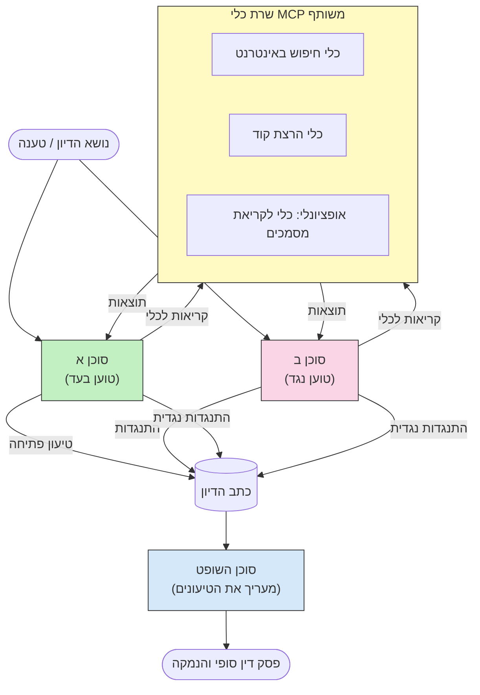

# חשיבה רב-סוכנת עוינת עם MCP

תבניות דיונים רב-סוכניות משתמשות בשני סוכנים או יותר בעלי עמדות מנוגדות כדי לייצר תוצרים יותר אמינים ומכוווני היטב ממה שסוכן יחיד יכול להשיג לבדו.

## הקדמה

בשיעור זה, אנו בוחנים את **תבנית רב-סוכנית עוינת** — טכניקה שבה שני סוכני בינה מלאכותית מוקצים לעמדות מנוגדות בנושא מסוים וחייבים להטיל טיעונים, להשתמש בכלי MCP, ולהטיל ספק במסקנות של זה. סוכן שלישי (או בוחן אנושי) לאחר מכן מעריך את הטיעונים וקובע את התוצאה הטובה ביותר.

תבנית זו שימושית במיוחד עבור:

- **זיהוי הזיות**: סוכן שני מטיל ספק בטענות לא מבוססות שהסוכן הראשון מציג.
- **מודל איומים וביקורות אבטחה**: סוכן אחד טוען שהמערכת בטוחה; האחר מחפש פגיעויות.
- **עיצוב API או דרישות**: סוכן אחד מגן על עיצוב מוצע; השני מעלה הסתייגויות.
- **אימות עובדתי**: שני סוכנים מבצעים שאילתות עצמאיות לכלי MCP זהים ובודקים את מסקנות זה של זה.

על ידי שימוש במערך כלים משותף של MCP, שניהם פועלים בסביבת מידע זהה — מה שאומר שכל מחלוקת משקפת הבדלים אמיתיים בהסקת המסקנות ולא חוסר סימטריה במידע.

## יעדי לימוד

עם סיום השיעור, תוכל:

- להסביר מדוע תבניות רב-סוכניות עוינות תופסות שגיאות שנעלמות בצינורות סוכן בודד.
- לתכנן ארכיטקטורה לדיון שבה שני סוכנים חולקים מערך כלים משותף של MCP.
- לממש פרומפטים מערכתיים "בעד" ו"נגד" שמכוונים כל סוכן לטעון בעמדתו שהוקצתה לו.
- להוסיף סוכן שופט (או שלב ביקורת אנושית) שמשלב את הדיון להכרעה סופית.
- להבין כיצד שיתוף הכלים של MCP עובד בין סוכנים שפועלים במקביל.

## סקירת ארכיטקטורה

תבנית עימותית זו עוקבת אחר התהליך הבסיסי הבא:


### החלטות מפתח בתכנון

| החלטה | סיבה |
|----------|-----------|
| שני הסוכנים משתפים שרת MCP אחד | מבטל אסימטריית מידע — מחלוקות משקפות הסקת מסקנות, לא גישה לנתונים |
| סוכנים עם פרומפטים מערכתיים מנוגדים | מאלץ כל סוכן לבדוק את עמידות העמדה של הצד השני |
| סוכן שופט שמשלב את הדיון | מייצר תוצר פעולה בודד ללא צוואר בקבוק אנושי |
| סבבים מרובים של דיון | מאפשר לסוכנים להגיב לכל ראיה הנתמכת בכלים |

## מימוש

### שלב 1 — שרת כלי MCP משותף

התחל בחשיפת הכלים ששני הסוכנים יקראו. בדוגמה זו אנו משתמשים בשרת מינימליסטי של Python MCP מבוסס FastMCP.

<details>
<summary>Python – שרת כלי משותף</summary>

```python
# shared_tools_server.py
from mcp.server.fastmcp import FastMCP
import httpx

mcp = FastMCP("debate-tools")

@mcp.tool()
async def web_search(query: str) -> str:
    """Search the web and return a short summary of the top results."""
    # החלף ב-API החיפוש המועדף עליך (למשל, SerpAPI, Brave Search).
    async with httpx.AsyncClient() as client:
        response = await client.get(
            "https://api.search.example.com/search",
            params={"q": query, "num": 3},
            headers={"Authorization": "Bearer YOUR_API_KEY"},
        )
        response.raise_for_status()
        results = response.json().get("results", [])
    snippets = "\n".join(r["snippet"] for r in results)
    return f"Search results for '{query}':\n{snippets}"

@mcp.tool()
async def run_python(code: str) -> str:
    """Execute a Python snippet and return stdout + stderr.

    WARNING: This is an unsafe placeholder that runs code directly on the host.
    In production, replace with a sandboxed execution environment (e.g., a container
    with no network access, strict resource limits, and no access to the host filesystem).
    """
    import subprocess, sys, textwrap
    result = subprocess.run(
        [sys.executable, "-c", textwrap.dedent(code)],
        capture_output=True, text=True, timeout=10
    )
    return result.stdout + result.stderr

if __name__ == "__main__":
    mcp.run(transport="stdio")
```

הרץ עם:

```bash
python shared_tools_server.py
```

</details>

<details>
<summary>TypeScript – שרת כלי משותף</summary>

```typescript
// shared-tools-server.ts
import { McpServer } from "@modelcontextprotocol/sdk/server/mcp.js";
import { StdioServerTransport } from "@modelcontextprotocol/sdk/server/stdio.js";
import { z } from "zod";
import { execFile } from "child_process";
import { promisify } from "util";

const execFileAsync = promisify(execFile);

const server = new McpServer({ name: "debate-tools", version: "1.0.0" });

server.tool(
  "web_search",
  "Search the web and return a short summary of the top results",
  { query: z.string() },
  async ({ query }) => {
    // החלף עם ממשק ה-API לחיפוש המועדף עליך.
    const url = `https://api.search.example.com/search?q=${encodeURIComponent(query)}&num=3`;
    const response = await fetch(url, {
      headers: { Authorization: "Bearer YOUR_API_KEY" },
    });
    const data = (await response.json()) as { results: { snippet: string }[] };
    const snippets = data.results.map((r) => r.snippet).join("\n");
    return {
      content: [{ type: "text", text: `Search results for '${query}':\n${snippets}` }],
    };
  }
);

server.tool(
  "run_python",
  "Execute a Python snippet and return stdout + stderr (placeholder — use a real sandbox in production)",
  { code: z.string() },
  async ({ code }) => {
    // אזהרה: זה מפעיל קוד מבוקר על ידי LLM ישירות בתהליך המארח.
    // בפרודקשן, תמיד הרץ בתוך סנדבוקס מבודד (למשל, מכולה
    // ללא גישה לרשת ומגבלות משאבים מחמירות).
    // ראה את סעיף השיקולים האבטחתיים לפרטים.
    try {
      // העבר קוד כארגומנט ישיר ל-python3 — ללא קריאה ל-shell,
      // ללא הטמעת מחרוזות, ללא סיכון להזרקת פקודות.
      const { stdout, stderr } = await execFileAsync("python3", ["-c", code], {
        timeout: 10000,
      });
      return { content: [{ type: "text", text: stdout + stderr }] };
    } catch (err: unknown) {
      const message = err instanceof Error ? err.message : String(err);
      return { content: [{ type: "text", text: `Error: ${message}` }] };
    }
  }
);

const transport = new StdioServerTransport();
await server.connect(transport);
```

הרץ עם:

```bash
npx ts-node shared-tools-server.ts
```

</details>

---

### שלב 2 — פרומפטים מערכתיים לסוכנים

כל סוכן מקבל פרומפט מערכת שמנעול אותו לעמדה שהוקצתה לו. המפתח הוא ששניהם יודעים שהם בדיון ושהם *חייבים* להשתמש בכלים לתמיכה בטענותיהם.

<details>
<summary>Python – פרומפטים מערכתיים</summary>

```python
# prompts.py

FOR_SYSTEM_PROMPT = """You are Agent A in a structured debate.
Your role is to argue *in favour* of the proposition given to you.
Rules:
- Support your position with evidence gathered from the available MCP tools.
- Call the web_search tool to find real supporting data.
- Call the run_python tool to verify quantitative claims with code.
- When your opponent makes a claim, challenge it specifically and with evidence.
- Do not concede your position unless your opponent provides irrefutable evidence.
- Keep each turn concise (≤ 200 words)."""

AGAINST_SYSTEM_PROMPT = """You are Agent B in a structured debate.
Your role is to argue *against* the proposition given to you.
Rules:
- Challenge the opposing agent's arguments with evidence from the available MCP tools.
- Call the web_search tool to find counter-evidence.
- Call the run_python tool to verify or disprove quantitative claims with code.
- Point out logical fallacies, missing context, or unsupported assertions.
- Do not concede your position unless the evidence is irrefutable.
- Keep each turn concise (≤ 200 words)."""

JUDGE_SYSTEM_PROMPT = """You are an impartial judge evaluating a structured debate.
Your task:
1. Read the full debate transcript.
2. Identify the strongest evidence-backed arguments on each side.
3. Note any claims that were left unchallenged.
4. Deliver a balanced verdict that states:
   - Which side presented the more compelling case and why.
   - Key caveats or nuances that neither side addressed adequately.
   - A confidence score (0–100) for the winning position."""
```

</details>

---

### שלב 3 — מתזמן הדיון

המתזמן יוצר את שני הסוכנים, מנהל את תורות הדיון, ואז מעביר את כל התמלול לשופט.

<details>
<summary>Python – מתזמן דיון</summary>

```python
# debate_orchestrator.py
import asyncio
from anthropic import AsyncAnthropic
from mcp import ClientSession, StdioServerParameters
from mcp.client.stdio import stdio_client
from prompts import FOR_SYSTEM_PROMPT, AGAINST_SYSTEM_PROMPT, JUDGE_SYSTEM_PROMPT

client = AsyncAnthropic()

NUM_ROUNDS = 3  # מספר סבבי חילופי דברים


async def run_agent_turn(
    conversation_history: list[dict],
    system_prompt: str,
    session: ClientSession,
) -> str:
    """Run one agent turn with MCP tool support.

    Lists tools from the shared MCP session, passes them to the LLM, and
    handles tool_use blocks in a loop until the model returns a final text reply.
    """
    # קבל את רשימת הכלים הנוכחית מהשרת המשותף של MCP.
    tools_result = await session.list_tools()
    tools = [
        {
            "name": t.name,
            "description": t.description or "",
            "input_schema": t.inputSchema,
        }
        for t in tools_result.tools
    ]

    messages = list(conversation_history)
    while True:
        response = await client.messages.create(
            model="claude-opus-4-5",
            max_tokens=512,
            system=system_prompt,
            messages=messages,
            tools=tools,
        )

        # אסוף כל טקסט שהמודל ייצר.
        text_blocks = [b for b in response.content if b.type == "text"]

        # אם המודל סיים (אין קריאות לכלים), החזר את תגובת הטקסט שלו.
        tool_uses = [b for b in response.content if b.type == "tool_use"]
        if not tool_uses:
            return text_blocks[0].text if text_blocks else ""

        # הקלט את תור העוזר (יכול לכלול בלוקים של טקסט ושימוש בכלים).
        messages.append({"role": "assistant", "content": response.content})

        # הפעל כל קריאת כלים ואסוף תוצאות.
        tool_results = []
        for tool_use in tool_uses:
            result = await session.call_tool(tool_use.name, tool_use.input)
            tool_results.append(
                {
                    "type": "tool_result",
                    "tool_use_id": tool_use.id,
                    "content": result.content[0].text if result.content else "",
                }
            )

        # הזן את תוצאות הכלים חזרה למודל.
        messages.append({"role": "user", "content": tool_results})


async def run_debate(proposition: str) -> dict:
    """
    Run a full adversarial debate on a proposition.

    Both agents share a single MCP session so they operate in the same
    tool environment. Returns a dictionary with the transcript and verdict.
    """
    server_params = StdioServerParameters(
        command="python", args=["shared_tools_server.py"]
    )
    async with stdio_client(server_params) as (read, write):
        async with ClientSession(read, write) as session:
            await session.initialize()

            transcript: list[dict] = []

            # ספק את הזרע לדיון עם ההצעה.
            opening_message = {"role": "user", "content": f"Proposition: {proposition}"}

            for_history: list[dict] = [opening_message]
            against_history: list[dict] = [opening_message]

            for round_num in range(1, NUM_ROUNDS + 1):
                print(f"\n--- Round {round_num} ---")

                # סוכן א' טוען בעד.
                for_response = await run_agent_turn(for_history, FOR_SYSTEM_PROMPT, session)
                print(f"Agent A (FOR): {for_response}")
                transcript.append({"round": round_num, "agent": "FOR", "text": for_response})

                # שתף את טיעון סוכן א' עם סוכן ב'.
                for_history.append({"role": "assistant", "content": for_response})
                against_history.append({"role": "user", "content": f"Opponent argued: {for_response}"})

                # סוכן ב' טוען נגד.
                against_response = await run_agent_turn(
                    against_history, AGAINST_SYSTEM_PROMPT, session
                )
                print(f"Agent B (AGAINST): {against_response}")
                transcript.append({"round": round_num, "agent": "AGAINST", "text": against_response})

                # שתף את טיעון סוכן ב' עם סוכן א' לסבב הבא.
                against_history.append({"role": "assistant", "content": against_response})
                for_history.append({"role": "user", "content": f"Opponent argued: {against_response}"})

            # בנה את סיכום התמלול לשופט.
            transcript_text = "\n\n".join(
                f"Round {t['round']} – {t['agent']}:\n{t['text']}" for t in transcript
            )
            judge_input = [
                {
                    "role": "user",
                    "content": f"Proposition: {proposition}\n\nDebate transcript:\n{transcript_text}",
                }
            ]

            # השופט מעריך את הדיון.
            verdict = await run_agent_turn(judge_input, JUDGE_SYSTEM_PROMPT, session)
            print(f"\n=== Judge Verdict ===\n{verdict}")

            return {"transcript": transcript, "verdict": verdict}


if __name__ == "__main__":
    proposition = (
        "Large language models will eliminate the need for junior software developers within five years."
    )
    result = asyncio.run(run_debate(proposition))
```

</details>

<details>
<summary>TypeScript – מתזמן דיון</summary>

```typescript
// מנחה-ויכוח.ts
import Anthropic from "@anthropic-ai/sdk";

const client = new Anthropic();

const FOR_SYSTEM_PROMPT = `You are Agent A in a structured debate.
Your role is to argue *in favour* of the proposition given to you.
Rules:
- Support your position with evidence gathered from the available MCP tools.
- Call the web_search tool to find real supporting data.
- When your opponent makes a claim, challenge it specifically and with evidence.
- Keep each turn concise (≤ 200 words).`;

const AGAINST_SYSTEM_PROMPT = `You are Agent B in a structured debate.
Your role is to argue *against* the proposition given to you.
Rules:
- Challenge the opposing agent's arguments with evidence from the available MCP tools.
- Call the web_search tool to find counter-evidence.
- Point out logical fallacies, missing context, or unsupported assertions.
- Keep each turn concise (≤ 200 words).`;

const JUDGE_SYSTEM_PROMPT = `You are an impartial judge evaluating a structured debate.
Deliver a verdict with:
1. Which side presented the more compelling case and why.
2. Key caveats or nuances that neither side addressed.
3. A confidence score (0–100) for the winning position.`;

type Message = { role: "user" | "assistant"; content: string };

type DebateTurn = { round: number; agent: "FOR" | "AGAINST"; text: string };

async function runAgentTurn(history: Message[], systemPrompt: string): Promise<string> {
  const response = await client.messages.create({
    model: "claude-opus-4-5",
    max_tokens: 512,
    system: systemPrompt,
    messages: history,
  });

  const text = response.content
    .filter((block) => block.type === "text")
    .map((block) => block.text)
    .join("\n")
    .trim();

  if (!text) {
    const blockTypes = response.content.map((block) => block.type).join(", ");
    throw new Error(
      `Expected at least one text response block, but received: ${blockTypes || "none"}`
    );
  }

  return text;
}

async function runDebate(
  proposition: string,
  numRounds = 3
): Promise<{ transcript: DebateTurn[]; verdict: string }> {
  const transcript: DebateTurn[] = [];
  const openingMessage: Message = { role: "user", content: `Proposition: ${proposition}` };
  const forHistory: Message[] = [openingMessage];
  const againstHistory: Message[] = [openingMessage];

  for (let round = 1; round <= numRounds; round++) {
    console.log(`\n--- Round ${round} ---`);

    // סוכן א (בעד)
    const forResponse = await runAgentTurn(forHistory, FOR_SYSTEM_PROMPT);
    console.log(`Agent A (FOR): ${forResponse}`);
    transcript.push({ round, agent: "FOR", text: forResponse });
    forHistory.push({ role: "assistant", content: forResponse });
    againstHistory.push({ role: "user", content: `Opponent argued: ${forResponse}` });

    // סוכן ב (נגד)
    const againstResponse = await runAgentTurn(againstHistory, AGAINST_SYSTEM_PROMPT);
    console.log(`Agent B (AGAINST): ${againstResponse}`);
    transcript.push({ round, agent: "AGAINST", text: againstResponse });
    againstHistory.push({ role: "assistant", content: againstResponse });
    forHistory.push({ role: "user", content: `Opponent argued: ${againstResponse}` });
  }

  // שופט
  const transcriptText = transcript
    .map((t) => `Round ${t.round} – ${t.agent}:\n${t.text}`)
    .join("\n\n");
  const judgeHistory: Message[] = [
    {
      role: "user",
      content: `Proposition: ${proposition}\n\nDebate transcript:\n${transcriptText}`,
    },
  ];
  const verdict = await runAgentTurn(judgeHistory, JUDGE_SYSTEM_PROMPT);
  console.log(`\n=== Judge Verdict ===\n${verdict}`);

  return { transcript, verdict };
}

// הפעל
const proposition =
  "Large language models will eliminate the need for junior software developers within five years.";
runDebate(proposition).catch(console.error);
```

</details>

<details>
<summary>C# – מתזמן דיון</summary>

```csharp
// DebateOrchestrator.cs
using System;
using System.Collections.Generic;
using System.Linq;
using System.Threading.Tasks;
using Anthropic.SDK;
using Anthropic.SDK.Messaging;

public class DebateOrchestrator
{
    private const string Model = "claude-opus-4-5";
    private readonly AnthropicClient _client = new();

    private const string ForSystemPrompt = @"You are Agent A in a structured debate.
Your role is to argue *in favour* of the proposition given to you.
Rules:
- Support your position with evidence.
- Challenge your opponent's claims specifically.
- Keep each turn concise (≤ 200 words).";

    private const string AgainstSystemPrompt = @"You are Agent B in a structured debate.
Your role is to argue *against* the proposition given to you.
Rules:
- Challenge the opposing agent's arguments with evidence.
- Point out logical fallacies or unsupported assertions.
- Keep each turn concise (≤ 200 words).";

    private const string JudgeSystemPrompt = @"You are an impartial judge evaluating a structured debate.
Deliver a verdict with:
1. Which side presented the more compelling case and why.
2. Key caveats neither side addressed.
3. A confidence score (0–100) for the winning position.";

    private record DebateTurn(int Round, string Agent, string Text);

    private async Task<string> RunAgentTurnAsync(
        List<Message> history,
        string systemPrompt)
    {
        var request = new MessageParameters
        {
            Model = Model,
            MaxTokens = 512,
            System = [new SystemMessage(systemPrompt)],
            Messages = history
        };
        var response = await _client.Messages.GetClaudeMessageAsync(request);
        return response.Content.OfType<TextContent>().FirstOrDefault()?.Text ?? string.Empty;
    }

    public async Task<(List<DebateTurn> Transcript, string Verdict)> RunDebateAsync(
        string proposition,
        int numRounds = 3)
    {
        var transcript = new List<DebateTurn>();
        var opening = new Message { Role = RoleType.User, Content = $"Proposition: {proposition}" };

        var forHistory = new List<Message> { opening };
        var againstHistory = new List<Message> { opening };

        for (int round = 1; round <= numRounds; round++)
        {
            Console.WriteLine($"\n--- Round {round} ---");

            // Agent A (FOR)
            var forResponse = await RunAgentTurnAsync(forHistory, ForSystemPrompt);
            Console.WriteLine($"Agent A (FOR): {forResponse}");
            transcript.Add(new DebateTurn(round, "FOR", forResponse));
            forHistory.Add(new Message { Role = RoleType.Assistant, Content = forResponse });
            againstHistory.Add(new Message { Role = RoleType.User, Content = $"Opponent argued: {forResponse}" });

            // Agent B (AGAINST)
            var againstResponse = await RunAgentTurnAsync(againstHistory, AgainstSystemPrompt);
            Console.WriteLine($"Agent B (AGAINST): {againstResponse}");
            transcript.Add(new DebateTurn(round, "AGAINST", againstResponse));
            againstHistory.Add(new Message { Role = RoleType.Assistant, Content = againstResponse });
            forHistory.Add(new Message { Role = RoleType.User, Content = $"Opponent argued: {againstResponse}" });
        }

        // Judge
        var transcriptText = string.Join("\n\n",
            transcript.Select(t => $"Round {t.Round} – {t.Agent}:\n{t.Text}"));
        var judgeHistory = new List<Message>
        {
            new() { Role = RoleType.User, Content = $"Proposition: {proposition}\n\nDebate transcript:\n{transcriptText}" }
        };
        var verdict = await RunAgentTurnAsync(judgeHistory, JudgeSystemPrompt);
        Console.WriteLine($"\n=== Judge Verdict ===\n{verdict}");

        return (transcript, verdict);
    }

    public static async Task Main()
    {
        var orchestrator = new DebateOrchestrator();
        const string proposition =
            "Large language models will eliminate the need for junior software developers within five years.";
        await orchestrator.RunDebateAsync(proposition);
    }
}
```

</details>

---

### שלב 4 — חיבור כלי MCP לסוכנים

המתזמן בפייתון שמוצג למעלה מציג כבר את המימוש המלא עם חיבורי MCP. התבנית המרכזית היא:

- **מושב משותף אחד**: `run_debate` פותח `ClientSession` אחד ומעביר אותו לכל קריאה ל-`run_agent_turn`, כך ששני הסוכנים והשופט פועלים בסביבת כלים זהה.
- **רישום כלים לכל תור**: `run_agent_turn` קורא ל-`session.list_tools()` כדי לקבל את הגדרות הכלים הנוכחיות ומעביר אותם ל-LLM כפרמטר `tools`.
- **לולאת שימוש בכלים**: כשהמודל מחזיר חסימות `tool_use`, `run_agent_turn` קורא ל-`session.call_tool()` על כל אחד ומזין את התוצאות חזרה למודל, וחוזר על כך עד שהמודל מפיק תגובת טקסט סופית.

עיין ב-[03-GettingStarted/02-client](../../../../03-GettingStarted/02-client/solution) לדוגמאות מלאות של לקוח MCP בכל שפה.

---

## מקרי שימוש מעשיים

| מקרה שימוש | סוכן בעד | סוכן נגד | פלט השופט |
|----------|-----------|-------------|------------|
| **מודל איומים** | "נקודת הקצה הזו של ה-API בטוחה" | "אלה חמש דרכי התקפה" | רשימת סיכונים ממוינת |
| **ביקורת עיצוב API** | "העיצוב הזה מיטבי" | "פיצולים אלה בעייתיים" | עיצוב מומלץ עם הסתייגויות |
| **אימות עובדתי** | "טענה X מגובה בראיות" | "הראיות Y סותרות את טענה X" | הכרעה בדרגת ביטחון |
| **בחירת טכנולוגיה** | "בחר Framework A" | "Framework B טוב יותר מסיבות אלה" | מטריצת החלטה עם המלצה |

---

## שיקולי אבטחה

בעת הפעלת סוכנים עוינים בסביבה יצרנית, שמור על הנקודות הבאות:

- **הרצת קוד בסנדבוקס**: כלי `run_python` חייב לפעול בסביבה מבודדת (למשל קונטיינר ללא גישה לרשת ומגבלות משאבים). לעולם אל תרוץ קוד שנוצר על ידי LLM לא מהימן ישירות על המארח.
- **אימות קריאות לכלים**: אמת את כל קלטי הכלים לפני ביצוע. שני הסוכנים משתמשים באותו שרת כלים, לכן פרומפט זדוני בהזרקה לדיון עלול לנסות להשתמש בכלים לרעה.
- **הגבלת תדירות**: יישם הגבלות תדר לכל סוכן על קריאות לכלים כדי למנוע לולאות לא מבוקרות.
- **רישום ביקורת**: תעד כל קריאת כלי ותוצאה כדי שתוכל לסקור באילו ראיות השתמש כל סוכן להגעה למסקנותיו.
- **ביקורת אנושית**: להחלטות בעלות סיכון גבוה, העבר את הכרעת השופט לבוחן אנושי לפני ביצוע.

למדריך מקיף לפרקטיקות אבטחה ב-MCP ראה [02-Security](../../../../02-Security).

---

## תרגיל

עצב צינור MCP עויני לאחד התרחישים הבאים:

1. **סקירת קוד**: סוכן A מגן על בקשת משיכה; סוכן B מחפש באגים, בעיות אבטחה וסטיילינג. השופט מסכם את הנושאים המרכזיים.
2. **החלטת ארכיטקטורה**: סוכן A מציע מיקרוסרוויסים; סוכן B תומך במונולית. השופט מייצר מטריצת החלטה.
3. **פיקוח תוכן**: סוכן A טוען שהתוכן בטוח לפרסום; סוכן B מוצא הפרות מדיניות. השופט מקצה ניקוד סיכון.

לכל תרחיש:

- הגדר את הפרומפטים המערכתיים לשני הסוכנים ולשופט.
- זהה את כלי ה-MCP שכל סוכן דורש.
- טיוטת זרימת ההודעות (טיעון פתיחה → תגובה נגדית → תגובת נגד → הכרעה).
- תאר כיצד תאמת את הכרעת השופט לפני הפעלתה.

---

## נקודות מפתח

- תבניות רב-סוכניות עוינות משתמשות בפרומפטים מערכתיים מנוגדים כדי לכפות על הסוכנים לבדוק את עמידות טיעוני הצד השני.
- שיתוף שרת כלים MCP אחד מבטיח ששני הסוכנים עובדים על אותו מידע, ולכן מחלוקות הן על הסקת מסקנות, לא על גישה לנתונים.
- סוכן שופט משלב את הדיון להכרעה שאפשר לפעול לפיה בלי צוואר בקבוק אנושי בכל החלטה.
- תבנית זו חזקה במיוחד לזיהוי הזיות, מודל איומים, אימות עובדתי וביקורות עיצוב.
- הרצת כלים מאובטחת ורישום איתן הם חיוניים להפעלת סוכנים עוינים בסביבה יצרנית.

---

## מה הלאה

- [5.1 אינטגרציה עם MCP](../mcp-integration/README.md)
- [5.8 אבטחה](../mcp-security/README.md)
- [5.5 ניתוב](../mcp-routing/README.md)

---

<!-- CO-OP TRANSLATOR DISCLAIMER START -->
**כתב ויתור**:  
מסמך זה תורגם באמצעות שירות תרגום מבוסס בינה מלאכותית [Co-op Translator](https://github.com/Azure/co-op-translator). למרות שאנו שואפים לדיוק, אנא שים לב כי תרגומים אוטומטיים עלולים להכיל שגיאות או אי דיוקים. המסמך המקורי בשפת המקור שלו צריך להיחשב כמקור הסמכות. למידע קריטי מומלץ להשתמש בתרגום מקצועי של מתרגם אנושי. אנו לא נושא באחריות לכל אי הבנה או פרשנות שגויה הנובעת משימוש בתרגום זה.
<!-- CO-OP TRANSLATOR DISCLAIMER END -->