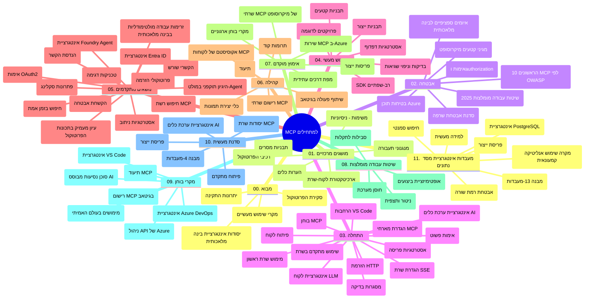

# פרוטוקול הקשר דגם (MCP) למתחילים - מדריך לימוד

מדריך לימוד זה מציג סקירה של מבנה ותוכן מאגר הקוד של תכנית הלימודים "פרוטוקול הקשר דגם (MCP) למתחילים". השתמש במדריך זה כדי לנווט במאגר בצורה יעילה ולהפיק את המרב מהמשאבים הזמינים.

## סקירת המאגר

פרוטוקול הקשר דגם (MCP) הוא מסגרת סטנדרטית לאינטראקציות בין דגמי AI ליישומי לקוח. נוצר במקור על ידי Anthropic, MCP מנוהל כיום על ידי קהילת MCP הרחבה דרך הארגון הרשמי ב-GitHub. מאגר זה מספק תכנית לימודים מקיפה עם דוגמאות קוד מעשיות בשפות C#, Java, JavaScript, Python ו-TypeScript, המיועדת למפתחי AI, אדריכלי מערכות ומהנדסי תוכנה.

## מפת תכנית לימודים ויזואלית

## מבנה המאגר

המאגר מאורגן לאחד עשר חלקים עיקריים, שכל אחד מהם מתמקד בהיבטים שונים של MCP:

1. **מבוא (00-Introduction/)**
   - סקירה של פרוטוקול הקשר דגם
   - מדוע תקינה חשובה בצינורות AI
   - מקרי שימוש מעשיים ויתרונות

2. **מושגים מרכזיים (01-CoreConcepts/)**
   - ארכיטקטורת לקוח-שרת
   - רכיבי הפרוטוקול המרכזיים
   - תבניות הודעות ב-MCP

3. **אבטחה (02-Security/)**
   - איומי אבטחה במערכות מבוססות MCP
   - שיטות עבודה מומלצות לאבטחת מימושים
   - אסטרטגיות אימות והרשאה
   - **תיעוד אבטחה מקיף**:
     - שיטות עבודה מומלצות לאבטחת MCP 2025
     - מדריך יישום Azure Content Safety
     - בקרות וטכניקות אבטחה ב-MCP
     - עזר מהיר לשיטות עבודה מומלצות ב-MCP
   - **נושאי אבטחה מרכזיים**:
     - התקפות הזרקת פרומפט ותרכובות כלים
     - חטיפת סשן ובעיות confused deputy
     - פרצות מעבר אסימונים
     - הרשאות מופרזות ובקרת גישה
     - אבטחת שרשרת אספקה לרכיבי AI
     - אינטגרציית Microsoft Prompt Shields

4. **התחלה מהירה (03-GettingStarted/)**
   - התקנת הסביבה וקונפיגורציה
   - יצירת שרתי ולקוחות MCP בסיסיים
   - אינטגרציה עם יישומים קיימים
   - כולל חלקים ל:
     - מימוש שרת ראשוני
     - פיתוח לקוח
     - אינטגרציית לקוח LLM
     - אינטגרציה עם VS Code
     - שרת SSE (Server-Sent Events)
     - שימוש מתקדם בשרת
     - סטרימינג HTTP
     - אינטגרציית AI Toolkit
     - אסטרטגיות בדיקות
     - הנחיות לפריסה

5. **מימוש מעשי (04-PracticalImplementation/)**
   - שימוש ב-SDK בשפות תכנות שונות
   - טכניקות דיבוג, בדיקה ואימות
   - יצירת תבניות פרומפט וזרימות עבודה לשימוש חוזר
   - פרויקטים לדוגמה עם מימושים

6. **נושאים מתקדמים (05-AdvancedTopics/)**
   - טכניקות הנדסת הקשר
   - אינטגרציית Foundry agent
   - זרימות עבודה רב-מודאליות ב-AI
   - הדגמות OAuth2 לאימות
   - יכולות חיפוש בזמן אמת
   - סטרימינג בזמן אמת
   - מימוש הקשרים שורשיים
   - אסטרטגיות ניתוב
   - טכניקות דגימה
   - גישות סקיילינג
   - שיקולי אבטחה
   - אינטגרציית אבטחת Entra ID
   - אינטגרציית חיפוש באינטרנט
   - חשיבה רב-סוכנית עוינת (תבניות דיון)

7. **תרומות קהילתיות (06-CommunityContributions/)**
   - איך לתרום קוד ותיעוד
   - שיתופי פעולה דרך GitHub
   - שיפורים ומשוב מונחי קהילה
   - שימוש בלקוחות MCP שונים (Claude Desktop, Cline, VSCode)
   - עבודה עם שרתי MCP פופולריים כולל יצירת תמונות

8. **לקחים מאימוץ ראשוני (07-LessonsfromEarlyAdoption/)**
   - מימושים אמיתיים וסיפורי הצלחה
   - בנייה ופריסה של פתרונות מבוססי MCP
   - מגמות ומפת דרכים עתידית
   - **מדריך שרתי MCP של Microsoft**: מדריך מקיף ל-10 שרתי Microsoft MCP מוכנים לייצור כולל:
     - שרת Microsoft Learn Docs MCP
     - שרת Azure MCP (מעל 15 מחברים מיוחדים)
     - שרת GitHub MCP
     - שרת Azure DevOps MCP
     - שרת MarkItDown MCP
     - שרת SQL Server MCP
     - שרת Playwright MCP
     - שרת Dev Box MCP
     - שרת Azure AI Foundry MCP
     - שרת Microsoft 365 Agents Toolkit MCP

9. **שיטות עבודה מומלצות (08-BestPractices/)**
   - כוונון ביצועים ואופטימיזציה
   - עיצוב מערכות MCP חסינות לתקלות
   - אסטרטגיות בדיקה וחוסן

10. **מקרים לדוגמה (09-CaseStudy/)**
    - **שבעה מקרים לדוגמה מקיפים** המדגימים את גמישות MCP בתרחישים שונים:
    - **Azure AI Travel Agents**: אורקסטרציה רב-סוכנית עם Azure OpenAI ו-AI Search
    - **אינטגרציית Azure DevOps**: אוטומציה של תהליכי עבודה עם עדכונים מנתוני YouTube
    - **שליפת תיעוד בזמן אמת**: לקוח קונסול ב-Python עם סטרימינג HTTP
    - **מחולל תוכנית לימודים אינטראקטיבי**: אפליקציית ווב Chainlit עם AI שיחתי
    - **תיעוד בתוך עורך**: אינטגרציה ל-VS Code עם זרימות עבודה GitHub Copilot
    - **ניהול API ב-Azure**: אינטגרציית API ארגונית עם יצירת שרת MCP
    - **מאגד MCP של GitHub**: פיתוח אקוסיסטם ופלטפורמת אינטגרציה סוכנית
    - דוגמאות למימוש הכוללים אינטגרציה ארגונית, פרודוקטיביות מפתחים, ופיתוח אקוסיסטם

11. **סדנת יישום מעשית (10-StreamliningAIWorkflowsBuildingAnMCPServerWithAIToolkit/)**
    - סדנה מעשית מקיפה המשולבת עם AI Toolkit
    - בניית יישומים אינטיליגנטיים שמקשרים דגמי AI עם כלים אמיתיים
    - מודולים מעשיים המכסים יסודות, פיתוח שרת מותאם, ואסטרטגיות פריסה
    - **מבנה המעבדה**:
      - מעבדה 1: יסודות שרת MCP
      - מעבדה 2: פיתוח שרת MCP מתקדם
      - מעבדה 3: אינטגרציית AI Toolkit
      - מעבדה 4: פריסה בסביבה יצרנית וסקיילינג
    - גישת לימוד מבוססת מעבדות עם הוראות שלב-אחר-שלב

12. **מעבדות אינטגרציית מסדי נתונים לשרת MCP (11-MCPServerHandsOnLabs/)**
    - **מסלול לימוד מקיף של 13 מעבדות** לבניית שרתי MCP מוכנים לייצור עם אינטגרציית PostgreSQL
    - **יישום אנליטיקה למסחר קמעונאי בעולם האמיתי** באמצעות מקרה השימוש Zava Retail
    - **דפוסי ארגוני** כולל Row Level Security (RLS), חיפוש סמנטי, וגישה לרב-דיירקטוריות
    - **מבנה מלא של המעבדות**:
      - **מעבדות 00-03: יסודות** - מבוא, ארכיטקטורה, אבטחה, התקנת סביבה
      - **מעבדות 04-06: בניית שרת MCP** - תכנון מסד נתונים, מימוש שרת MCP, פיתוח כלים
      - **מעבדות 07-09: תכונות מתקדמות** - חיפוש סמנטי, בדיקות ודיבוג, אינטגרציית VS Code
      - **מעבדות 10-12: ייצור ושיטות עבודה מומלצות** - פריסה, ניטור, אופטימיזציה
    - **טכנולוגיות המכוסות**: מסגרת FastMCP, PostgreSQL, Azure OpenAI, Azure Container Apps, Application Insights
    - **תוצאות לימוד**: שרתי MCP מוכנים לייצור, דפוסי אינטגרציית מסדי נתונים, אנליטיקה מונעת AI, אבטחה ארגונית

## משאבים נוספים

המאגר כולל משאבים משלימים:

- **תיקיית תמונות**: מכילה דיאגרמות ואיורים לאורך כל תכנית הלימודים
- **תרגומים**: תמיכה רב-לשונית עם תרגומים אוטומטיים של התיעוד
- **משאבים רשמיים של MCP**:
  - [תיעוד MCP](https://modelcontextprotocol.io/)
  - [מפרט MCP](https://spec.modelcontextprotocol.io/)
  - [מאגר GitHub של MCP](https://github.com/modelcontextprotocol)

## איך להשתמש במאגר זה

1. **למידה סדרתית**: עקוב אחר הפרקים בסדר (00 עד 11) לחוויית למידה מובנית.
2. **מיקוד בשפה ספציפית**: אם אתה מעוניין בשפת תכנות מסוימת, חקור את ספריות הדוגמאות למימושים בשפה המועדפת עליך.
3. **מימוש מעשי**: התחל עם הסעיף "התחלה מהירה" להכנת הסביבה שלך ויצירת שרת ולקוח MCP ראשוניים.
4. **חקירה מתקדמת**: לאחר שמכירים את היסודות, העמק בנושאים המתקדמים להרחבת הידע.
5. **מעורבות קהילתית**: הצטרף לקהילת MCP דרך דיונים ב-GitHub וערוצי Discord כדי להתחבר למומחים ומפתחים נוספים.

## לקוחות וכלי MCP

תכנית הלימודים כוללת מבט על לקוחות וכלי MCP שונים:

1. **לקוחות רשמיים**:
   - Visual Studio Code 
   - MCP בתוך Visual Studio Code
   - Claude Desktop
   - Claude ב-VSCode 
   - Claude API

2. **לקוחות קהילה**:
   - Cline (ממשק טורמינל)
   - Cursor (עורך קוד)
   - ChatMCP
   - Windsurf

3. **כלים לניהול MCP**:
   - MCP CLI
   - MCP Manager
   - MCP Linker
   - MCP Router

## שרתי MCP פופולריים

המאגר מציג שרתי MCP שונים, כולל:

1. **שרתי MCP רשמיים של Microsoft**:
   - שרת Microsoft Learn Docs MCP
   - שרת Azure MCP (מעל 15 מחברים מקצועיים)
   - שרת GitHub MCP
   - שרת Azure DevOps MCP
   - שרת MarkItDown MCP
   - שרת SQL Server MCP
   - שרת Playwright MCP
   - שרת Dev Box MCP
   - שרת Azure AI Foundry MCP
   - שרת Microsoft 365 Agents Toolkit MCP

2. **שרתי ייחוס רשמיים**:
   - מערכת קבצים
   - Fetch
   - זיכרון
   - חשיבה סדרתית

3. **יצירת תמונות**:
   - Azure OpenAI DALL-E 3
   - Stable Diffusion WebUI
   - Replicate

4. **כלי פיתוח**:
   - Git MCP
   - שליטה בטורמינל
   - עוזר קוד

5. **שרתי ייעודיים**:
   - Salesforce
   - Microsoft Teams
   - Jira & Confluence

## תרומה

מאגר זה מקבל בברכה תרומות מהקהילה. עיין בסעיף תרומות קהילתיות לקבלת הדרכה כיצד לתרום ביעילות לאקוסיסטם של MCP.

----

*מדריך לימוד זה עודכן לאחרונה ב-5 בפברואר 2026, ומשקף את המפרט העדכני של MCP מ-25 בנובמבר 2025, ומספק סקירה של המאגר נכון לתאריך זה. תוכן המאגר עשוי להתעדכן לאחר תאריך זה.*

---

<!-- CO-OP TRANSLATOR DISCLAIMER START -->
**הצהרת ניכוי אחריות**:  
מסמך זה תורגם באמצעות שירות תרגום מבוסס בינה מלאכותית [Co-op Translator](https://github.com/Azure/co-op-translator). בעוד שאנו שואפים לדיוק, יש לקחת בחשבון כי תרגומים אוטומטיים עלולים להכיל שגיאות או אי-דיוקים. יש להתייחס למסמך המקורי בשפת המקור כמקור הסמכותי. עבור מידע קריטי מומלץ תרגום מקצועי על ידי אדם. אנו לא אחראים על אי-הבנות או פרשנויות שגויות הנובעות מהשימוש בתרגום זה.
<!-- CO-OP TRANSLATOR DISCLAIMER END -->