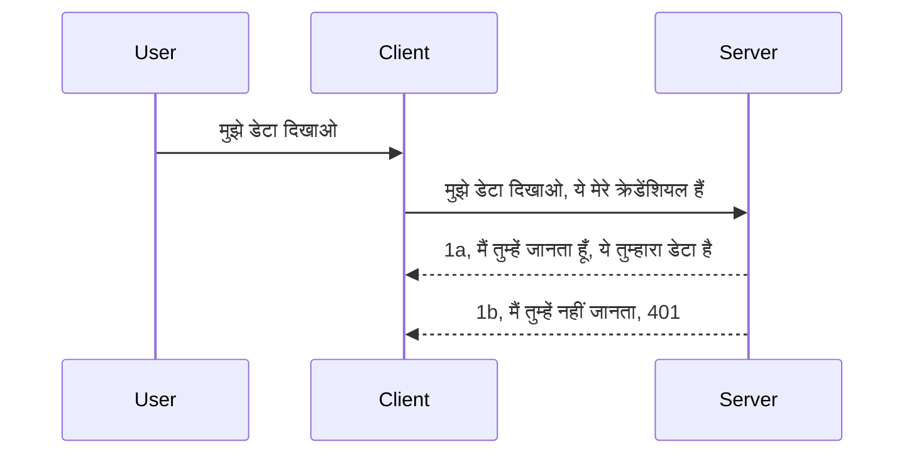

# सरल प्रामाणिकरण

MCP SDKs OAuth 2.1 के उपयोग का समर्थन करते हैं जो कि सही मायने में एक काफी जटिल प्रक्रिया है जिसमें ऑथ सर्वर, रिसोर्स सर्वर, क्रेडेंशियल पोस्ट करना, कोड प्राप्त करना, कोड को बीयरर टोकन में बदलना शामिल है जब तक कि आप अंततः अपना रिसोर्स डेटा प्राप्त न कर सकें। अगर आप OAuth के लिए अनजान हैं जो लागू करने के लिए एक शानदार चीज है, तो यह एक अच्छी बात है कि आप कुछ बुनियादी स्तर के ऑथ के साथ शुरू करें और बेहतर और बेहतर सुरक्षा तक बढ़ें। इसलिए यह अध्याय मौजूद है, ताकि आपको अधिक उन्नत ऑथ की ओर बढ़ाया जा सके।

## ऑथ, हमारा मतलब क्या है?

ऑथ ऑथेंटिकेशन और ऑथराइज़ेशन का संक्षिप्त रूप है। विचार यह है कि हमें दो चीजें करनी हैं:

- **ऑथेंटिकेशन**, जो यह पता लगाने की प्रक्रिया है कि क्या हम किसी व्यक्ति को हमारे घर में प्रवेश करने दें, कि उन्हें "यहाँ" होने का अधिकार है यानी हमारे रिसोर्स सर्वर तक पहुँच की अनुमति है जहाँ हमारे MCP सर्वर फीचर्स रहते हैं।
- **ऑथराइज़ेशन**, यह पता लगाने की प्रक्रिया है कि एक उपयोगकर्ता को उन विशिष्ट संसाधनों तक पहुँच होनी चाहिए जिनकी वे मांग कर रहे हैं, उदाहरण के लिए ये ऑर्डर या ये प्रोडक्ट्स या क्या उन्हें सामग्री पढ़ने की अनुमति है लेकिन हटाने की नहीं जैसे एक अन्य उदाहरण।

## क्रेडेंशियल्स: हम सिस्टम को कैसे बताएं कि हम कौन हैं

अधिकांश वेब डेवलपर्स आमतौर पर क्रेडेंशियल्स देने के संदर्भ में सोचते हैं, आमतौर पर एक सीक्रेट जो बताता है कि उन्हें यहाँ रहने की अनुमति है "ऑथेंटिकेशन"। यह क्रेडेंशियल आमतौर पर यूजरनेम और पासवर्ड का बेस64 एन्कोडेड संस्करण या एक API कुंजी होती है जो विशिष्ट उपयोगकर्ता की पहचान करती है।

यह 'Authorization' नामक हैडर के माध्यम से भेजा जाता है, इस तरह:

```json
{ "Authorization": "secret123" }
```

इसे आमतौर पर बेसिक ऑथेंटिकेशन कहा जाता है। कुल मिलाकर फ्लो इस प्रकार काम करता है:


अब जब हमें फ्लो के दृष्टिकोण से समझ आ गया है कि यह कैसे काम करता है, इसे कैसे लागू करें? अधिकांश वेब सर्वरों में 'मिडलवेयर' की एक अवधारणा होती है, जो अनुरोध का ऐसा हिस्सा होता है जो क्रेडेंशियल्स को सत्यापित कर सकता है, और यदि क्रेडेंशियल्स वैध हैं तो अनुरोध को आगे जाने देता है। यदि अनुरोध में वैध क्रेडेंशियल्स नहीं हैं तो आपको एक ऑथ त्रुटि मिलती है। आइए देखें कि इसे कैसे लागू किया जा सकता है:

**पायथन**

```python
class AuthMiddleware(BaseHTTPMiddleware):
    async def dispatch(self, request, call_next):

        has_header = request.headers.get("Authorization")
        if not has_header:
            print("-> Missing Authorization header!")
            return Response(status_code=401, content="Unauthorized")

        if not valid_token(has_header):
            print("-> Invalid token!")
            return Response(status_code=403, content="Forbidden")

        print("Valid token, proceeding...")
       
        response = await call_next(request)
        # किसी भी ग्राहक हेडर को जोड़ें या प्रतिक्रिया में किसी प्रकार का परिवर्तन करें
        return response


starlette_app.add_middleware(CustomHeaderMiddleware)
```

यहाँ हमने:

- एक मिडलवेयर `AuthMiddleware` बनाया है जहाँ उसकी `dispatch` मेथड वेब सर्वर द्वारा कॉल की जाती है।
- मिडलवेयर को वेब सर्वर में जोड़ा गया है:

    ```python
    starlette_app.add_middleware(AuthMiddleware)
    ```

- सत्यापन लॉजिक लिखा है जो जांचता है कि Authorization हेडर मौजूद है या नहीं और भेजी गई सीक्रेट वैध है या नहीं:

    ```python
    has_header = request.headers.get("Authorization")
    if not has_header:
        print("-> Missing Authorization header!")
        return Response(status_code=401, content="Unauthorized")

    if not valid_token(has_header):
        print("-> Invalid token!")
        return Response(status_code=403, content="Forbidden")
    ```

यदि सीक्रेट मौजूद और वैध है तो हम `call_next` को कॉल करके अनुरोध को अनुमति देते हैं और प्रतिक्रिया लौटाते हैं।

    ```python
    response = await call_next(request)
    # किसी भी कस्टमर हेडर को जोड़ें या प्रतिक्रिया में किसी प्रकार का परिवर्तन करें
    return response
    ```

जैसे ही एक वेब अनुरोध सर्वर की ओर जाता है मिडलवेयर को कॉल किया जाएगा और उसकी इम्प्लीमेंटेशन के आधार पर यह या तो अनुरोध को अनुमति देगा या एक त्रुटि लौटाएगा जो संकेत देती है कि क्लाइंट को आगे बढ़ने की अनुमति नहीं है।

**टाइपस्क्रिप्ट**

यहाँ हम लोकप्रिय फ्रेमवर्क Express के साथ एक मिडलवेयर बनाते हैं और MCP Server तक पहुँचने से पहले अनुरोध को इंटरसेप्ट करते हैं। इसका कोड यहाँ है:

```typescript
function isValid(secret) {
    return secret === "secret123";
}

app.use((req, res, next) => {
    // 1. प्राधिकरण हेडर मौजूद है?
    if(!req.headers["Authorization"]) {
        res.status(401).send('Unauthorized');
    }
    
    let token = req.headers["Authorization"];

    // 2. वैधता जांचें।
    if(!isValid(token)) {
        res.status(403).send('Forbidden');
    }

   
    console.log('Middleware executed');
    // 3. अनुरोध पाइपलाइन में अगले चरण को अनुरोध भेजें।
    next();
});
```

इस कोड में हम:

1. जांचते हैं कि Authorization हेडर मौजूद है या नहीं, अगर नहीं है तो 401 त्रुटि भेजते हैं।
2. क्रेडेंशियल/टोकन वैध है या नहीं इसके लिए सत्यापित करते हैं, अगर नहीं तो 403 त्रुटि भेजते हैं।
3. अंत में अनुरोध को आगे पाइपलाइन में पास करते हैं और मांगे गए संसाधन को लौटाते हैं।

## अभ्यास: ऑथेंटिकेशन लागू करें

आइए अपने ज्ञान का इस्तेमाल करें और इसे लागू करने की कोशिश करें। योजना इस प्रकार है:

सर्वर

- एक वेब सर्वर और MCP इंस्टेंस बनाएँ।
- सर्वर के लिए मिडलवेयर लागू करें।

क्लाइंट

- क्रेडेंशियल के साथ वेब अनुरोध भेजें, हेडर के माध्यम से।

### -1- वेब सर्वर और MCP इंस्टेंस बनाएं

हमारे पहले चरण में, हमें वेब सर्वर इंस्टेंस और MCP Server बनाना होगा।

**पायथन**

यहाँ हम एक MCP सर्वर इंस्टेंस बनाते हैं, एक Starlette वेब ऐप बनाते हैं और उसे uvicorn के साथ होस्ट करते हैं।

```python
# MCP सर्वर बना रहे हैं

app = FastMCP(
    name="MCP Resource Server",
    instructions="Resource Server that validates tokens via Authorization Server introspection",
    host=settings["host"],
    port=settings["port"],
    debug=True
)

# स्टारलेट वेब ऐप बना रहे हैं
starlette_app = app.streamable_http_app()

# uvicorn के माध्यम से ऐप को सर्व कर रहे हैं
async def run(starlette_app):
    import uvicorn
    config = uvicorn.Config(
            starlette_app,
            host=app.settings.host,
            port=app.settings.port,
            log_level=app.settings.log_level.lower(),
        )
    server = uvicorn.Server(config)
    await server.serve()

run(starlette_app)
```

इस कोड में हम:

- MCP Server बनाते हैं।
- MCP Server से starlette वेब ऐप का निर्माण करते हैं, `app.streamable_http_app()`।
- uvicorn `server.serve()` का उपयोग करके वेब ऐप को होस्ट करते हैं।

**टाइपस्क्रिप्ट**

यहाँ हम MCP Server इंस्टेंस बनाते हैं।

```typescript
const server = new McpServer({
      name: "example-server",
      version: "1.0.0"
    });

    // ... सर्वर संसाधनों, उपकरणों, और प्रॉम्प्ट्स को सेटअप करें ...
```

यह MCP Server निर्माण हमारी POST /mcp रूट डिफिनिशन के भीतर होना चाहिए, तो ऊपर दिए गए कोड को इस प्रकार ले जाएँ:

```typescript
import express from "express";
import { randomUUID } from "node:crypto";
import { McpServer } from "@modelcontextprotocol/sdk/server/mcp.js";
import { StreamableHTTPServerTransport } from "@modelcontextprotocol/sdk/server/streamableHttp.js";
import { isInitializeRequest } from "@modelcontextprotocol/sdk/types.js"

const app = express();
app.use(express.json());

// सत्र आईडी के द्वारा ट्रांसपोर्ट स्टोर करने का नक्शा
const transports: { [sessionId: string]: StreamableHTTPServerTransport } = {};

// क्लाइंट-से-सर्वर कम्युनिकेशन के लिए POST अनुरोधों को हैंडल करें
app.post('/mcp', async (req, res) => {
  // मौजूदा सत्र आईडी की जांच करें
  const sessionId = req.headers['mcp-session-id'] as string | undefined;
  let transport: StreamableHTTPServerTransport;

  if (sessionId && transports[sessionId]) {
    // मौजूदा ट्रांसपोर्ट का पुन: उपयोग करें
    transport = transports[sessionId];
  } else if (!sessionId && isInitializeRequest(req.body)) {
    // नया शुरूआती अनुरोध
    transport = new StreamableHTTPServerTransport({
      sessionIdGenerator: () => randomUUID(),
      onsessioninitialized: (sessionId) => {
        // सत्र आईडी के द्वारा ट्रांसपोर्ट स्टोर करें
        transports[sessionId] = transport;
      },
      // DNS रीबाइंडिंग सुरक्षा पिछली संगतता के लिए डिफ़ॉल्ट रूप से अक्षम है। यदि आप यह सर्वर
      // स्थानीय रूप से चला रहे हैं, तो सुनिश्चित करें कि आप सेट करें:
      // enableDnsRebindingProtection: true,
      // allowedHosts: ['127.0.0.1'],
    });

    // बंद होने पर ट्रांसपोर्ट की सफाई करें
    transport.onclose = () => {
      if (transport.sessionId) {
        delete transports[transport.sessionId];
      }
    };
    const server = new McpServer({
      name: "example-server",
      version: "1.0.0"
    });

    // ... सर्वर संसाधन, टूल्स, और प्रॉम्प्ट्स सेट करें ...

    // MCP सर्वर से कनेक्ट करें
    await server.connect(transport);
  } else {
    // अमान्य अनुरोध
    res.status(400).json({
      jsonrpc: '2.0',
      error: {
        code: -32000,
        message: 'Bad Request: No valid session ID provided',
      },
      id: null,
    });
    return;
  }

  // अनुरोध को हैंडल करें
  await transport.handleRequest(req, res, req.body);
});

// GET और DELETE अनुरोधों के लिए पुन: प्रयोज्य हैंडलर
const handleSessionRequest = async (req: express.Request, res: express.Response) => {
  const sessionId = req.headers['mcp-session-id'] as string | undefined;
  if (!sessionId || !transports[sessionId]) {
    res.status(400).send('Invalid or missing session ID');
    return;
  }
  
  const transport = transports[sessionId];
  await transport.handleRequest(req, res);
};

// SSE के माध्यम से सर्वर-से-क्लाइंट नोटिफिकेशन के लिए GET अनुरोधों को हैंडल करें
app.get('/mcp', handleSessionRequest);

// सत्र समाप्ति के लिए DELETE अनुरोधों को हैंडल करें
app.delete('/mcp', handleSessionRequest);

app.listen(3000);
```

अब आप देख सकते हैं कि MCP Server निर्माण `app.post("/mcp")` के भीतर ले जाया गया है।

आइए अगले चरण पर चलते हैं, मिडलवेयर बनाने के लिए ताकि हम इनकमिंग क्रेडेंशियल की जांच कर सकें।

### -2- सर्वर के लिए मिडलवेयर लागू करें

अब हम मिडलवेयर भाग की ओर बढ़ते हैं। यहाँ हम ऐसा मिडलवेयर बनाएंगे जो `Authorization` हेडर में क्रेडेंशियल की तलाश करेगा और उसे सत्यापित करेगा। यदि यह स्वीकार्य है तो अनुरोध आगे बढ़ेगा और आवश्यक कार्य करेगा (जैसे टूल सूचीबद्ध करना, संसाधन पढ़ना या जो भी MCP कार्यक्षमता क्लाइंट मांग रहा हो)।

**पायथन**

मिडलवेयर बनाने के लिए, हमें एक क्लास बनानी होगी जो `BaseHTTPMiddleware` से विरासत में हो। दो महत्वपूर्ण भाग हैं:

- अनुरोध `request`, जिससे हम हेडर जानकारी पढ़ते हैं।
- `call_next` वह कॉलबैक है जिसे हमें तब कॉल करना होता है जब क्लाइंट ने हमारे स्वीकार्य क्रेडेंशियल के साथ आना होता है।

पहले, हमें उस स्थिति को संभालना होगा जब `Authorization` हेडर मिसिंग हो:

```python
has_header = request.headers.get("Authorization")

# कोई हेडर मौजूद नहीं है, 401 के साथ असफल, अन्यथा आगे बढ़ें।
if not has_header:
    print("-> Missing Authorization header!")
    return Response(status_code=401, content="Unauthorized")
```

यहाँ हम 401 अनधिकृत संदेश भेजते हैं क्योंकि क्लाइंट ऑथेंटिकेशन में विफल हो रहा है।

अगला, यदि क्रेडेंशियल सबमिट किया गया है, तो हमें इसकी वैधता की जांच करनी होगी इस तरह:

```python
 if not valid_token(has_header):
    print("-> Invalid token!")
    return Response(status_code=403, content="Forbidden")
```

ध्यान दें कि ऊपर हम 403 फॉरबिडन संदेश भेजते हैं। नीचे पूरा मिडलवेयर है जो हमने ऊपर बताया सब लागू करता है:

```python
class AuthMiddleware(BaseHTTPMiddleware):
    async def dispatch(self, request, call_next):

        has_header = request.headers.get("Authorization")
        if not has_header:
            print("-> Missing Authorization header!")
            return Response(status_code=401, content="Unauthorized")

        if not valid_token(has_header):
            print("-> Invalid token!")
            return Response(status_code=403, content="Forbidden")

        print("Valid token, proceeding...")
        print(f"-> Received {request.method} {request.url}")
        response = await call_next(request)
        response.headers['Custom'] = 'Example'
        return response

```

बहुत अच्छा, लेकिन `valid_token` फ़ंक्शन क्या है? यहाँ वह नीचे है:

```python
# प्रोडक्शन के लिए उपयोग न करें - इसे बेहतर बनाएं !!
def valid_token(token: str) -> bool:
    # "Bearer " उपसर्ग को हटा दें
    if token.startswith("Bearer "):
        token = token[7:]
        return token == "secret-token"
    return False
```

यह स्पष्ट रूप से बेहतर किया जाना चाहिए।

महत्वपूर्ण: आपके कोड में इस तरह के सीक्रेट्स कभी नहीं होने चाहिए। आपको आदर्श रूप से तुलना के लिए मान किसी डेटा स्रोत या IDP (पहचान सेवा प्रदाता) से प्राप्त करना चाहिए या बेहतर यह कि IDP ही वैधता की जांच करे।

**टाइपस्क्रिप्ट**

Express के साथ इसे लागू करने के लिए, हमें `use` मेथड को कॉल करना होगा जो मिडलवेयर फ़ंक्शंस लेता है।

हमें ज़रूरी है कि:

- `Authorization` प्रॉपर्टी में पास किए गए क्रेडेंशियल की जाँच के लिए अनुरोध वेरिएबल के साथ इंटरैक्ट करें।
- क्रेडेंशियल को वैध करें, और यदि वैध हो तो अनुरोध जारी रहने दें और क्लाइंट की MCP रिक्वेस्ट को उसके अनुसार कार्य करने दें (जैसे टूल सूचीबद्ध करना, संसाधन पढ़ना या MCP से संबंधित कोई भी अन्य कार्य)।

यहाँ हम जांच रहे हैं कि क्या `Authorization` हेडर मौजूद है और अगर नहीं, तो हम अनुरोध को आगे जाने से रोक देते हैं:

```typescript
if(!req.headers["authorization"]) {
    res.status(401).send('Unauthorized');
    return;
}
```

अगर हेडर शुरुआत में नहीं भेजा गया है, तो आपको 401 मिलता है।

अगला, हम जांचते हैं कि क्रेडेंशियल वैध है या नहीं, यदि नहीं, तो हम फिर से अनुरोध रोक देते हैं लेकिन थोड़े अलग संदेश के साथ:

```typescript
if(!isValid(token)) {
    res.status(403).send('Forbidden');
    return;
} 
```

ध्यान दें यह आपको अब 403 त्रुटि देता है।

पूरा कोड यहाँ है:

```typescript
app.use((req, res, next) => {
    console.log('Request received:', req.method, req.url, req.headers);
    console.log('Headers:', req.headers["authorization"]);
    if(!req.headers["authorization"]) {
        res.status(401).send('Unauthorized');
        return;
    }
    
    let token = req.headers["authorization"];

    if(!isValid(token)) {
        res.status(403).send('Forbidden');
        return;
    }  

    console.log('Middleware executed');
    next();
});
```

हमने वेब सर्वर को सेटअप किया है ताकि वह मिडलवेयर को एक्सेप्ट करे जो क्लाइंट द्वारा भेजे जा रहे क्रेडेंशियल्स की जांच करता है। क्लाइंट का क्या?

### -3- क्रेडेंशियल के साथ हेडर के माध्यम से वेब अनुरोध भेजें

हमें सुनिश्चित करना होगा कि क्लाइंट क्रेडेंशियल को हेडर के माध्यम से भेज रहा है। जैसा कि हम MCP क्लाइंट इस्तेमाल करेंगे, हमें पता लगाना होगा कि यह कैसे किया जाता है।

**पायथन**

क्लाइंट के लिए, हमें क्रेडेंशियल के साथ हेडर पास करना होगा, इस तरह:

```python
# मान को हार्डकोड न करें, इसे कम से कम एक पर्यावरण चर या अधिक सुरक्षित संग्रहण में रखें
token = "secret-token"

async with streamablehttp_client(
        url = f"http://localhost:{port}/mcp",
        headers = {"Authorization": f"Bearer {token}"}
    ) as (
        read_stream,
        write_stream,
        session_callback,
    ):
        async with ClientSession(
            read_stream,
            write_stream
        ) as session:
            await session.initialize()
      
            # TODO, क्लाइंट में आप क्या करना चाहते हैं, जैसे टूल्स सूचीबद्ध करना, टूल्स कॉल करना आदि।
```

ध्यान दें कि हम `headers` प्रॉपर्टी को इस तरह भर रहे हैं `headers = {"Authorization": f"Bearer {token}"}`।

**टाइपस्क्रिप्ट**

इसे हम दो चरणों में कर सकते हैं:

1. अपनी क्रेडेंशियल के साथ एक कॉन्फ़िगरेशन ऑब्जेक्ट भरें।
2. कॉन्फ़िगरेशन ऑब्जेक्ट को ट्रांसपोर्ट को पास करें।

```typescript

// यहाँ दिखाए गए अनुसार मान को हार्डकोड न करें। कम से कम इसे एक पर्यावरण चर के रूप में रखें और विकास मोड में dotenv जैसा कुछ उपयोग करें।
let token = "secret123"

// एक क्लाइंट ट्रांसपोर्ट विकल्प ऑब्जेक्ट परिभाषित करें
let options: StreamableHTTPClientTransportOptions = {
  sessionId: sessionId,
  requestInit: {
    headers: {
      "Authorization": "secret123"
    }
  }
};

// विकल्प ऑब्जेक्ट को ट्रांसपोर्ट में पास करें
async function main() {
   const transport = new StreamableHTTPClientTransport(
      new URL(serverUrl),
      options
   );
```

यहाँ आप देख सकते हैं कि हमें पहले `options` ऑब्जेक्ट बनाना पड़ा और हमारे हेडर्स को `requestInit` प्रॉपर्टी के अंतर्गत रखना पड़ा।

महत्वपूर्ण: अब इसे कैसे बेहतर बनाएं? वर्तमान इम्प्लीमेंटेशन में कुछ समस्याएं हैं। सबसे पहले, इस प्रकार क्रेडेंशियल भेजना काफी जोखिम भरा है बशर्ते आपके पास कम से कम HTTPS हो। इसके बाद भी, क्रेडेंशियल चोरी हो सकता है इसलिए आपको एक ऐसी प्रणाली चाहिए जहाँ आप टोकन को आसानी से रद्द कर सकें और अतिरिक्त जांचें जोड़ सकें जैसे कि यह दुनिया के किस भाग से आ रहा है, क्या अनुरोध बहुत बार हो रहे हैं (बॉट जैसा व्यवहार), संक्षेप में बहुत सारी चिंताएँ हैं।

यह कहा जाना चाहिए कि सरल APIs के लिए जहाँ आप नहीं चाहते कि कोई भी आपके API को बिना प्रमाणन के कॉल करे, यहाँ जो हमने किया है वह एक अच्छा प्रारंभिक बिंदु है।

इस बात को ध्यान में रखते हुए, चलिए सुरक्षा को थोड़ा सख्त बनाएं एक मानकीकृत फॉर्मेट JSON वेब टोकन (JWT) का उपयोग करके जिसे JOT टोकन भी कहा जाता है।

## JSON वेब टोकन्स, JWT

तो, हम बहुत सरल क्रेडेंशियल भेजने से बेहतर करना चाहते हैं। JWT अपनाने से हमें क्या तत्काल सुधार मिलते हैं?

- **सुरक्षा सुधार**। बेसिक ऑथ में, आप यूजरनेम और पासवर्ड को बेस64 एन्कोडेड टोकन के रूप में (या API कुंजी भेजते हैं) बार-बार भेजते हैं जिससे जोखिम बढ़ता है। JWT में, आप अपना यूजरनेम और पासवर्ड भेजते हैं और बदले में टोकन प्राप्त करते हैं जो समय सीमा बंधित होता है अर्थात समाप्त हो जाएगा। JWT आपको रोल, स्कोप और परमिशन का उपयोग कर बारीक नियंत्रण वाली एक्सेस आसानी से प्रदान करता है।
- **स्टेटलेसनेस और विस्तार**। JWTs स्व-निहित होते हैं, वे सभी उपयोगकर्ता जानकारी लेकर चलते हैं और सर्वर-साइड सेशन स्टोरेज की आवश्यकता समाप्त करते हैं। टोकन को स्थानीय स्तर पर भी सत्यापित किया जा सकता है।
- **इंटरऑपरेबिलिटी और फेडरेशन**। JWT Open ID Connect का केंद्र है और ज्ञात पहचान प्रदाताओं जैसे Entra ID, Google Identity और Auth0 के साथ उपयोग किया जाता है। वे सिंगल साइन ऑन जैसी सुविधाएं भी प्रदान करते हैं जो इसे एंटरप्राइज़ ग्रेड बनाता है।
- **मॉड्यूलैरिटी और लचीलेपन**। JWTs API गेटवे जैसे Azure API Management, NGINX आदि के साथ भी उपयोग किए जा सकते हैं। यह उपयोगकर्ता ऑथेंटिकेशन परिदृश्यों और सर्वर-से-सर्विस संचार सहित इम्पर्सोनेशन और डेलीगेशन स्केनारियो का भी समर्थन करता है।
- **प्रदर्शन और कैशिंग**। JWTs डिकोडिंग के बाद कैश किए जा सकते हैं जो पार्सिंग की आवश्यकता को कम करता है। यह विशेष रूप से हाई-ट्रैफिक ऐप्स में सहायक होता है क्योंकि यह थ्रूपुट बढ़ाता है और आपके चुने हुए इन्फ्रास्ट्रक्चर का लोड कम करता है।
- **उन्नत फीचर्स**। यह इंट्रोस्पेक्शन (सर्वर पर वैधता जांच) और रद्दीकरण (टोकन को अमान्य बनाना) का भी समर्थन करता है।

इन सब लाभों के साथ, आइए देखें कि हम अपनी इम्प्लीमेंटेशन को अगले स्तर तक कैसे ले जा सकते हैं।

## बेसिक ऑथ को JWT में बदलना

तो, हमारे उच्च स्तरीय बदलाव हैं:

- **JWT टोकन बनाना सीखना** और इसे क्लाइंट से सर्वर भेजने के लिए तैयार करना।
- **JWT टोकन को सत्यापित करना**, और यदि वैध है, तो क्लाइंट को हमारे संसाधन प्रदान करना।
- **टोकन स्टोरेज सुरक्षित करना**। हम इस टोकन को कैसे संग्रहीत करते हैं।
- **रूट्स की रक्षा करना**। हमें रूट्स और विशेष MCP फीचर्स की रक्षा करनी होगी।
- **रिफ्रेश टोकन्स जोड़ना**। यह सुनिश्चित करना कि हम शॉर्ट-लाइव्ड टोकन बनाएं लेकिन साथ में लांग-लाइव्ड रिफ्रेश टोकन भी जो समाप्त होने पर नए टोकन पाने के लिए इस्तेमाल हो सकें। साथ ही यह सुनिश्चित करें कि एक रिफ्रेश एंडपॉइंट और रोटेशन स्ट्रैटेजी हो।

### -1- JWT टोकन बनाना

सबसे पहले, JWT टोकन में ये भाग होते हैं:

- **हेडर**, प्रयुक्त एल्गोरिथ्म और टोकन का प्रकार।
- **पेलोड**, क्लेम्स, जैसे sub (जो उपयोगकर्ता या इकाई टोकन का प्रतिनिधित्व करती है। ऑथ परिदृश्य में यह सामान्यतः userid होता है), exp (समाप्ति तिथि), role (भूमिका)
- **सिग्नेचर**, एक सीक्रेट या प्राइवेट की के साथ साइन किया गया।

इसके लिए, हमें हेडर, पेलोड और एन्कोडेड टोकन का निर्माण करना होगा।

**पायथन**

```python

import jwt
import jwt
from jwt.exceptions import ExpiredSignatureError, InvalidTokenError
import datetime

# JWT को साइन करने के लिए उपयोग किया गया गुप्त कुंजी
secret_key = 'your-secret-key'

header = {
    "alg": "HS256",
    "typ": "JWT"
}

# उपयोगकर्ता जानकारी उसकी दावे और समाप्ति समय
payload = {
    "sub": "1234567890",               # विषय (उपयोगकर्ता आईडी)
    "name": "User Userson",                # कस्टम दावा
    "admin": True,                     # कस्टम दावा
    "iat": datetime.datetime.utcnow(),# जारी किया गया
    "exp": datetime.datetime.utcnow() + datetime.timedelta(hours=1)  # समाप्ति
}

# इसे एन्कोड करें
encoded_jwt = jwt.encode(payload, secret_key, algorithm="HS256", headers=header)
```

ऊपर दिए कोड में हमने:

- HS256 एल्गोरिथ्म और JWT प्रकार के साथ एक हेडर डिफाइन किया है।
- एक पेलोड बनाया है जिसमें subject या user id, username, role, कब जारी किया गया और कब समाप्त होगा शामिल हैं, जो समय-सीमा बंधित पहलू को लागू करता है।

**टाइपस्क्रिप्ट**

यहाँ हमें कुछ डिपेंडेंसी चाहिए जो JWT टोकन बनाने में मदद करेंगी।

डिपेंडेंसिस

```sh

npm install jsonwebtoken
npm install --save-dev @types/jsonwebtoken
```

अब जब हमारे पास ये हैं, तो चलिए हेडर, पेलोड बनाएं और इसके माध्यम से एन्कोडेड टोकन बनाएं।

```typescript
import jwt from 'jsonwebtoken';

const secretKey = 'your-secret-key'; // उत्पादन में env vars का उपयोग करें

// पेलोड को परिभाषित करें
const payload = {
  sub: '1234567890',
  name: 'User usersson',
  admin: true,
  iat: Math.floor(Date.now() / 1000), // जारी किया गया
  exp: Math.floor(Date.now() / 1000) + 60 * 60 // 1 घंटे में समाप्त होता है
};

// हेडर को परिभाषित करें (वैकल्पिक, jsonwebtoken डिफ़ॉल्ट सेट करता है)
const header = {
  alg: 'HS256',
  typ: 'JWT'
};

// टोकन बनाएं
const token = jwt.sign(payload, secretKey, {
  algorithm: 'HS256',
  header: header
});

console.log('JWT:', token);
```

यह टोकन:

HS256 के साथ साइन किया गया है
1 घंटे के लिए वैध है
क्लेम्स जैसे sub, name, admin, iat, और exp शामिल करता है।

### -2- टोकन को सत्यापित करें

हमें टोकन को सत्यापित भी करना होगा, यह कुछ ऐसा है जो हमें सर्वर पर करना चाहिए ताकि यह सुनिश्चित हो सके कि क्लाइंट जो भेज रहा है वह वास्तव में वैध है। हमें कई जांचें करनी चाहिए जैसे इसकी संरचना और वैधता। आपको यह भी प्रोत्साहित किया जाता है कि आप यह जांचें कि उपयोगकर्ता आपकी प्रणाली में मौजूद है या नहीं।

टोकन सत्यापित करने के लिए, हमें इसे डीकोड करना होगा ताकि हम इसे पढ़ सकें और फिर उसकी वैधता की जांच शुरू कर सकें:

**पायथन**

```python

# JWT को डिकोड और सत्यापित करें
try:
    decoded = jwt.decode(token, secret_key, algorithms=["HS256"])
    print("✅ Token is valid.")
    print("Decoded claims:")
    for key, value in decoded.items():
        print(f"  {key}: {value}")
except ExpiredSignatureError:
    print("❌ Token has expired.")
except InvalidTokenError as e:
    print(f"❌ Invalid token: {e}")

```

इस कोड में, हम `jwt.decode` को टोकन, सीक्रेट की और चुने गए एल्गोरिथ्म के साथ कॉल करते हैं। ध्यान दें कि हम try-catch ब्लॉक का उपयोग करते हैं क्योंकि असफल सत्यापन पर त्रुटि उठाई जाती है।

**टाइपस्क्रिप्ट**

यहाँ हमें `jwt.verify` कॉल करना होगा ताकि हमें टोकन का डिकोडेड संस्करण मिल सके जिसे हम और जांच सकें। यदि यह कॉल विफल होती है, तो इसका अर्थ है कि टोकन की संरचना गलत है या यह अब वैध नहीं है।

```typescript

try {
  const decoded = jwt.verify(token, secretKey);
  console.log('Decoded Payload:', decoded);
} catch (err) {
  console.error('Token verification failed:', err);
}
```

ध्यान दें: जैसा कि पहले बताया गया, हमें अतिरिक्त जांच करनी चाहिए ताकि यह सुनिश्चित हो सके कि यह टोकन हमारे सिस्टम में किसी उपयोगकर्ता की ओर संकेत करता है और यह जांच करें कि उपयोगकर्ता के पास वह अधिकार हैं जो वह दावा करता है।

अगला, आइए रोल आधारित एक्सेस नियंत्रण (RBAC) देखें।
## भूमिका आधारित पहुंच नियंत्रण जोड़ना

विचार यह है कि हम यह व्यक्त करना चाहते हैं कि विभिन्न भूमिकाओं के पास विभिन्न अनुमतियाँ हैं। उदाहरण के लिए, हम मानते हैं कि एक एडमिन सब कुछ कर सकता है और एक सामान्य उपयोगकर्ता पढ़/लिख सकता है और एक अतिथि केवल पढ़ सकता है। इसलिए, यहाँ कुछ संभावित अनुमति स्तर हैं:

- Admin.Write  
- User.Read  
- Guest.Read  

आइए देखें कि हम ऐसे नियंत्रण को मिडलवेयर के साथ कैसे लागू कर सकते हैं। मिडलवेयर को प्रति रास्ता जोड़ा जा सकता है साथ ही सभी रास्तों के लिए भी।

**Python**

```python
from starlette.middleware.base import BaseHTTPMiddleware
from starlette.responses import JSONResponse
import jwt

# कोड में सीक्रेट न रखें, यह केवल प्रदर्शन उद्देश्यों के लिए है। इसे किसी सुरक्षित स्थान से पढ़ें।
SECRET_KEY = "your-secret-key" # इसे env वेरिएबल में डालें।
REQUIRED_PERMISSION = "User.Read"

class JWTPermissionMiddleware(BaseHTTPMiddleware):
    async def dispatch(self, request, call_next):
        auth_header = request.headers.get("Authorization")
        if not auth_header or not auth_header.startswith("Bearer "):
            return JSONResponse({"error": "Missing or invalid Authorization header"}, status_code=401)

        token = auth_header.split(" ")[1]
        try:
            decoded = jwt.decode(token, SECRET_KEY, algorithms=["HS256"])
        except jwt.ExpiredSignatureError:
            return JSONResponse({"error": "Token expired"}, status_code=401)
        except jwt.InvalidTokenError:
            return JSONResponse({"error": "Invalid token"}, status_code=401)

        permissions = decoded.get("permissions", [])
        if REQUIRED_PERMISSION not in permissions:
            return JSONResponse({"error": "Permission denied"}, status_code=403)

        request.state.user = decoded
        return await call_next(request)


```
  
मिडलवेयर जोड़ने के कुछ अलग तरीके नीचे दिए गए हैं:

```python

# विकल्प 1: स्टारलेट ऐप बनाते समय मिडलवेयर जोड़ें
middleware = [
    Middleware(JWTPermissionMiddleware)
]

app = Starlette(routes=routes, middleware=middleware)

# विकल्प 2: स्टारलेट ऐप पहले से बना होने के बाद मिडलवेयर जोड़ें
starlette_app.add_middleware(JWTPermissionMiddleware)

# विकल्प 3: प्रति रूट मिडलवेयर जोड़ें
routes = [
    Route(
        "/mcp",
        endpoint=..., # हैंडलर
        middleware=[Middleware(JWTPermissionMiddleware)]
    )
]
```
  
**TypeScript**

हम `app.use` और एक मिडलवेयर का उपयोग कर सकते हैं जो सभी अनुरोधों के लिए चलेगा।

```typescript
app.use((req, res, next) => {
    console.log('Request received:', req.method, req.url, req.headers);
    console.log('Headers:', req.headers["authorization"]);

    // 1. जांचें कि क्या प्राधिकरण हेडर भेजा गया है

    if(!req.headers["authorization"]) {
        res.status(401).send('Unauthorized');
        return;
    }
    
    let token = req.headers["authorization"];

    // 2. जांचें कि टोकन मान्य है या नहीं
    if(!isValid(token)) {
        res.status(403).send('Forbidden');
        return;
    }  

    // 3. जांचें कि टोकन उपयोगकर्ता हमारे सिस्टम में मौजूद है या नहीं
    if(!isExistingUser(token)) {
        res.status(403).send('Forbidden');
        console.log("User does not exist");
        return;
    }
    console.log("User exists");

    // 4. सत्यापित करें कि टोकन के पास सही अनुमतियाँ हैं
    if(!hasScopes(token, ["User.Read"])){
        res.status(403).send('Forbidden - insufficient scopes');
    }

    console.log("User has required scopes");

    console.log('Middleware executed');
    next();
});

```
  
हमारी मिडलवेयर को अनुमति देने और करना चाहिए कुछ महत्वपूर्ण बातें हैं, विशेष रूप से:

1. जांचना कि प्राधिकरण हेडर मौजूद है या नहीं  
2. जांचना कि टोकन वैध है या नहीं, हम `isValid` कॉल करते हैं जो एक विधि है जिसे हमने JWT टोकन की अखंडता और वैधता जांचने के लिए लिखा है।  
3. सत्यापित करना कि उपयोगकर्ता हमारे सिस्टम में मौजूद है, हमें यह जांच करनी चाहिए।

   ```typescript
    // DB में उपयोगकर्ता
   const users = [
     "user1",
     "User usersson",
   ]

   function isExistingUser(token) {
     let decodedToken = verifyToken(token);

     // TODO, जांचें कि उपयोगकर्ता DB में मौजूद है या नहीं
     return users.includes(decodedToken?.name || "");
   }
   ```
  
ऊपर, हमने एक बहुत सरल `users` सूची बनाई है, जो जाहिर तौर पर डेटाबेस में होनी चाहिए।

4. इसके अतिरिक्त, हमें यह भी जांचना चाहिए कि टोकन के पास सही अनुमतियाँ हैं।

   ```typescript
   if(!hasScopes(token, ["User.Read"])){
        res.status(403).send('Forbidden - insufficient scopes');
   }
   ```
  
ऊपर के मिडलवेयर कोड में, हम जांचते हैं कि टोकन में User.Read अनुमति मौजूद है, अगर नहीं तो हम 403 त्रुटि भेजते हैं। नीचे `hasScopes` सहायक विधि है।

   ```typescript
   function hasScopes(scope: string, requiredScopes: string[]) {
     let decodedToken = verifyToken(scope);
    return requiredScopes.every(scope => decodedToken?.scopes.includes(scope));
  }  
   ```

Have a think which additional checks you should be doing, but these are the absolute minimum of checks you should be doing.

Using Express as a web framework is a common choice. There are helpers library when you use JWT so you can write less code.

- `express-jwt`, helper library that provides a middleware that helps decode your token.
- `express-jwt-permissions`, this provides a middleware `guard` that helps check if a certain permission is on the token.

Here's what these libraries can look like when used:

```typescript
const express = require('express');
const jwt = require('express-jwt');
const guard = require('express-jwt-permissions')();

const app = express();
const secretKey = 'your-secret-key'; // put this in env variable

// Decode JWT and attach to req.user
app.use(jwt({ secret: secretKey, algorithms: ['HS256'] }));

// Check for User.Read permission
app.use(guard.check('User.Read'));

// multiple permissions
// app.use(guard.check(['User.Read', 'Admin.Access']));

app.get('/protected', (req, res) => {
  res.json({ message: `Welcome ${req.user.name}` });
});

// Error handler
app.use((err, req, res, next) => {
  if (err.code === 'permission_denied') {
    return res.status(403).send('Forbidden');
  }
  next(err);
});

```
  
अब आपने देखा कि मिडलवेयर का उपयोग प्रमाणीकरण और प्राधिकरण दोनों के लिए कैसे किया जा सकता है, लेकिन MCP के बारे में क्या, क्या यह हमारी प्रमाणीकरण प्रक्रिया को बदलता है? आइए अगले अनुभाग में पता करें।

### -3- MCP में RBAC जोड़ना

आपने अब तक देखा कि आप मिडलवेयर के माध्यम से RBAC कैसे जोड़ सकते हैं, हालांकि MCP के लिए प्रति MCP फीचर RBAC जोड़ने का आसान तरीका नहीं है, तो हम क्या करते हैं? खैर, हमें ऐसी कोड जोड़नी होगी जो यह जांचे कि क्लाइंट के पास किसी विशिष्ट टूल को कॉल करने के अधिकार हैं या नहीं:

आपके पास प्रति फीचर RBAC लागू करने के कई विकल्प हैं, इनमें से कुछ हैं:

- प्रत्येक टूल, संसाधन, प्रॉम्प्ट के लिए एक जांच जोड़ें जहाँ आपको अनुमति स्तर जांचना हो।

   **python**

   ```python
   @tool()
   def delete_product(id: int):
      try:
          check_permissions(role="Admin.Write", request)
      catch:
        pass # क्लाइंट प्रमाणीकरण में असफल, प्रमाणीकरण त्रुटि उठाएं
   ```
  
   **typescript**

   ```typescript
   server.registerTool(
    "delete-product",
    {
      title: Delete a product",
      description: "Deletes a product",
      inputSchema: { id: z.number() }
    },
    async ({ id }) => {
      
      try {
        checkPermissions("Admin.Write", request);
        // करने के लिए, productService और remote entry को आईडी भेजें
      } catch(Exception e) {
        console.log("Authorization error, you're not allowed");  
      }

      return {
        content: [{ type: "text", text: `Deletected product with id ${id}` }]
      };
    }
   );
   ```


- उन्नत सर्वर दृष्टिकोण और अनुरोध हैंडलर्स का उपयोग करें ताकि आपको जांच कितने स्थानों पर करनी है यह कम से कम हो।

   **Python**

   ```python
   
   tool_permission = {
      "create_product": ["User.Write", "Admin.Write"],
      "delete_product": ["Admin.Write"]
   }

   def has_permission(user_permissions, required_permissions) -> bool:
      # user_permissions: उपयोगकर्ता के पास अनुमतियों की सूची
      # required_permissions: टूल के लिए आवश्यक अनुमतियों की सूची
      return any(perm in user_permissions for perm in required_permissions)

   @server.call_tool()
   async def handle_call_tool(
     name: str, arguments: dict[str, str] | None
   ) -> list[types.TextContent]:
    # मान लें कि request.user.permissions उपयोगकर्ता के लिए अनुमतियों की एक सूची है
     user_permissions = request.user.permissions
     required_permissions = tool_permission.get(name, [])
     if not has_permission(user_permissions, required_permissions):
        # त्रुटि उत्पन्न करें "आपके पास टूल {name} को कॉल करने की अनुमति नहीं है"
        raise Exception(f"You don't have permission to call tool {name}")
     # जारी रखें और टूल को कॉल करें
     # ...
   ```   
    

   **TypeScript**

   ```typescript
   function hasPermission(userPermissions: string[], requiredPermissions: string[]): boolean {
       if (!Array.isArray(userPermissions) || !Array.isArray(requiredPermissions)) return false;
       // यदि उपयोगकर्ता के पास कम से कम एक आवश्यक अनुमति है तो सत्य लौटाएं
       
       return requiredPermissions.some(perm => userPermissions.includes(perm));
   }
  
   server.setRequestHandler(CallToolRequestSchema, async (request) => {
      const { params: { name } } = request;
  
      let permissions = request.user.permissions;
  
      if (!hasPermission(permissions, toolPermissions[name])) {
         return new Error(`You don't have permission to call ${name}`);
      }
  
      // जारी रखें..
   });
   ```
  
   ध्यान दें, आपको यह सुनिश्चित करना होगा कि आपका मिडलवेयर अनुरोध के उपयोगकर्ता गुण में डिकोड किया हुआ टोकन सौंपता है ताकि ऊपर दिया गया कोड सरल बनाया जा सके।

### सारांश

अब जब हमने सामान्य रूप से और विशेष रूप से MCP के लिए RBAC जोड़ने के तरीके पर चर्चा कर ली है, तो यह आपके लिए खुद सुरक्षा लागू करने का समय है ताकि यह सुनिश्चित हो सके कि आपने प्रस्तुत अवधारणाओं को समझ लिया है।

## असाइनमेंट 1: बेसिक प्रमाणीकरण का उपयोग करके एक mcp सर्वर और mcp क्लाइंट बनाएं

यहाँ आप हेडर के माध्यम से प्रमाण-पत्र भेजने के संदर्भ में जो सीखा है उसे लागू करेंगे।

## समाधान 1

[Solution 1](./code/basic/README.md)

## असाइनमेंट 2: असाइनमेंट 1 के समाधान को JWT का उपयोग करने के लिए अपग्रेड करें

पहले समाधान को लें लेकिन इस बार, इसे बेहतर बनाएं।

बेसिक ऑथ का उपयोग करने के बजाय, चलिए JWT का उपयोग करते हैं।

## समाधान 2

[Solution 2](./solution/jwt-solution/README.md)

## चुनौती

उस RBAC को प्रत्येक टूल पर जोड़ें जैसा कि अनुभाग "Add RBAC to MCP" में वर्णित है।

## सारांश

उम्मीद है इस अध्याय में आपने बहुत कुछ सीखा है, बिलकुल सुरक्षा न होने से लेकर, बेसिक सुरक्षा, JWT और इसे MCP में कैसे जोड़ा जाता है।

हमने कस्टम JWTs के साथ एक मजबूत आधार बनाया है, लेकिन जैसे-जैसे हम विस्तार कर रहे हैं, हम मानक-आधारित पहचान मॉडल की ओर बढ़ रहे हैं। Entra या Keycloak जैसे IdP को अपनाने से हम टोकन जारी करना, सत्यापन और जीवनचक्र प्रबंधन एक भरोसेमंद प्लेटफ़ॉर्म को सौंप सकते हैं — जिससे हम ऐप लॉजिक और उपयोगकर्ता अनुभव पर ध्यान केंद्रित कर सकें।

इसके लिए, हमारे पास [Entra पर एक अधिक उन्नत अध्याय](../../05-AdvancedTopics/mcp-security-entra/README.md) है।

## अगले चरण

- अगले: [MCP होस्ट सेट करना](../12-mcp-hosts/README.md)

---

<!-- CO-OP TRANSLATOR DISCLAIMER START -->
**अस्वीकरण**:  
इस दस्तावेज़ का अनुवाद एआई अनुवाद सेवा [Co-op Translator](https://github.com/Azure/co-op-translator) का उपयोग करके किया गया है। जबकि हम सटीकता के लिए प्रयास करते हैं, कृपया ध्यान दें कि स्वचालित अनुवादों में त्रुटियाँ या अशुद्धियाँ हो सकती हैं। मूल दस्तावेज़ अपनी मूल भाषा में ही अधिकृत स्रोत माना जाना चाहिए। महत्वपूर्ण जानकारी के लिए, पेशेवर मानव अनुवाद की सलाह दी जाती है। इस अनुवाद के उपयोग से उत्पन्न किसी भी गलतफ़हमी या गलत व्याख्या के लिए हम उत्तरदायी नहीं हैं।
<!-- CO-OP TRANSLATOR DISCLAIMER END -->