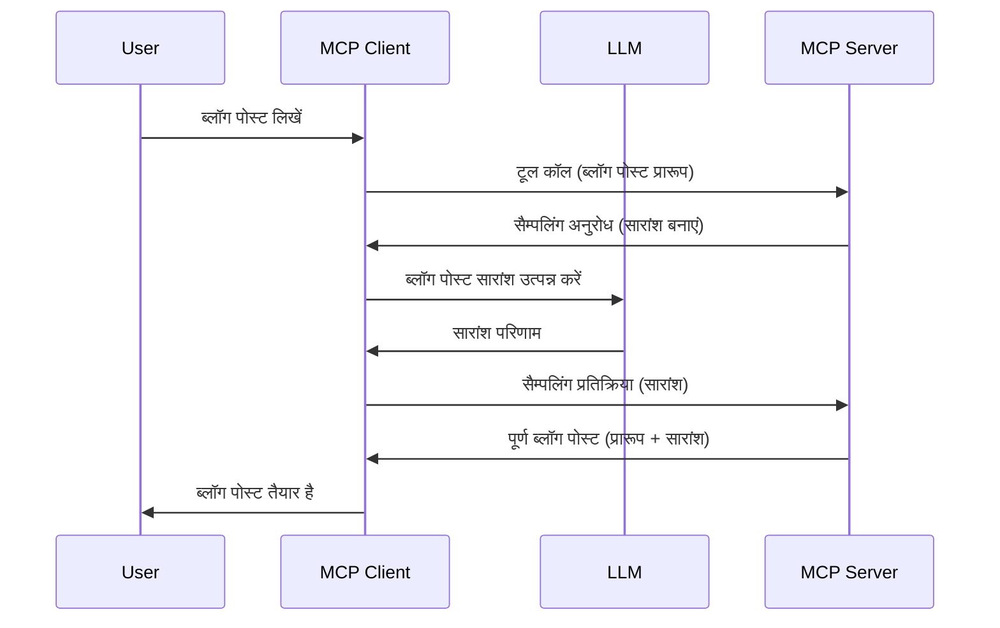

# सैंपलिंग - क्लाइंट को फीचर्स सौंपना

कभी-कभी, आपको MCP क्लाइंट और MCP सर्वर को मिलकर काम करना होता है ताकि एक सामान्य लक्ष्य प्राप्त किया जा सके। ऐसा मामला हो सकता है जहां सर्वर को क्लाइंट पर स्थित एक LLM की मदद चाहिए। इस स्थिति के लिए, सैंपलिंग का उपयोग करना चाहिए।

आइए कुछ उपयोग मामलों और सैंपलिंग से जुड़ा समाधान बनाने के तरीके को देखें।

## अवलोकन

इस लेसन में, हम इस बात पर ध्यान केंद्रित करेंगे कि सैंपलिंग कब और कहां उपयोग करनी है और इसे कैसे कॉन्फ़िगर करना है।

## सीखने के उद्देश्य

इस अध्याय में, हम:

- समझाएंगे कि सैंपलिंग क्या है और इसे कब उपयोग करना है।
- MCP में सैंपलिंग को कैसे कॉन्फ़िगर करें दिखाएंगे।
- क्रियान्वयन में सैंपलिंग के उदाहरण प्रदान करेंगे।

## सैंपलिंग क्या है और इसे क्यों उपयोग करें?

सैंपलिंग एक उन्नत फीचर है जो निम्नलिखित तरीके से काम करता है:


### सैंपलिंग अनुरोध

ठीक है, अब हमारे पास एक विश्वसनीय स्थिति की एक उच्च स्तरीय झलक है, आइए उस सैंपलिंग अनुरोध की बात करें जो सर्वर क्लाइंट को वापस भेजता है। JSON-RPC प्रारूप में ऐसा अनुरोध इस तरह दिख सकता है:

```json
{
  "jsonrpc": "2.0",
  "id": 1,
  "method": "sampling/createMessage",
  "params": {
    "messages": [
      {
        "role": "user",
        "content": {
          "type": "text",
          "text": "Create a blog post summary of the following blog post: <BLOG POST>"
        }
      }
    ],
    "modelPreferences": {
      "hints": [
        {
          "name": "claude-3-sonnet"
        }
      ],
      "intelligencePriority": 0.8,
      "speedPriority": 0.5
    },
    "systemPrompt": "You are a helpful assistant.",
    "maxTokens": 100
  }
}
```

यहां कुछ बातें उल्लेखनीय हैं:

- कंटेंट -> टेक्स्ट के अंतर्गत प्रॉम्प्ट, हमारा प्रॉम्प्ट है जो LLM को ब्लॉग पोस्ट सामग्री का सारांश बनाने के लिए निर्देश देता है।

- **modelPreferences**। यह हिस्सा एक प्राथमिकता है, यह सुझाव देता है कि LLM के साथ कौन सा कॉन्फ़िगरेशन उपयोग किया जाना चाहिए। उपयोगकर्ता यह चुन सकता है कि वे इन सुझावों का पालन करें या उन्हें बदलें। इस मामले में, मॉडल, गति, और बुद्धिमत्ता प्राथमिकता पर सिफारिशें हैं।  
- **systemPrompt**, यह आपका सामान्य सिस्टम प्रॉम्प्ट है जो आपके LLM को एक व्यक्तित्व देता है और मार्गदर्शन निर्देश शामिल करता है।  
- **maxTokens**, यह एक और गुण है जो बताता है कि इस कार्य के लिए कितने टोकन उपयोग करने की सिफारिश की गई है।

### सैंपलिंग प्रतिक्रिया

यह प्रतिक्रिया वह है जो MCP क्लाइंट अंत में MCP सर्वर को भेजता है और यह क्लाइंट के LLM को कॉल करने, प्रतिक्रिया का इंतजार करने और फिर यह संदेश बनाने का परिणाम है। JSON-RPC में ऐसा दिख सकता है:

```json
{
  "jsonrpc": "2.0",
  "id": 1,
  "result": {
    "role": "assistant",
    "content": {
      "type": "text",
      "text": "Here's your abstract <ABSTRACT>"
    },
    "model": "gpt-5",
    "stopReason": "endTurn"
  }
}
```

ध्यान दें कि प्रतिक्रिया ब्लॉग पोस्ट का सारांश है जैसा हमने मांगा था। साथ ही ध्यान दें कि उपयोग किया गया `model` वह नहीं है जिसे हमने मांगा था बल्कि "gpt-5" है "claude-3-sonnet" के बजाय। यह यह दिखाने के लिए है कि उपयोगकर्ता अपनी पसंद बदल सकता है और आपकी सैंपलिंग अनुरोध एक सिफारिश है।

ठीक है, अब जब हम मुख्य प्रवाह और उपयोगी कार्य "ब्लॉग पोस्ट निर्माण + सारांश" को समझ गए हैं, तो देखते हैं कि इसे काम करने के लिए क्या करना होगा।

### संदेश प्रकार

सैंपलिंग संदेश केवल टेक्स्ट तक सीमित नहीं हैं, बल्कि आप छवियां और ऑडियो भी भेज सकते हैं। JSON-RPC इस प्रकार अलग दिखता है:

**टेक्स्ट**

```json
{
  "type": "text",
  "text": "The message content"
}
```

**छवि सामग्री**

```json
{
  "type": "image",
  "data": "base64-encoded-image-data",
  "mimeType": "image/jpeg"
}
```

**ऑडियो सामग्री**

```json
{
  "type": "audio",
  "data": "base64-encoded-audio-data",
  "mimeType": "audio/wav"
}
```

> NOTE: सैंपलिंग के बारे में अधिक विस्तृत जानकारी के लिए, [आधिकारिक दस्तावेज़](https://modelcontextprotocol.io/specification/2025-06-18/client/sampling) देखें।

## क्लाइंट में सैंपलिंग कॉन्फ़िगर करने का तरीका

> नोट: यदि आप केवल एक सर्वर बना रहे हैं, तो आपको यहां ज्यादा करना नहीं है।

एक क्लाइंट में, आपको निम्नलिखित फीचर इस तरह निर्दिष्ट करना होगा:

```json
{
  "capabilities": {
    "sampling": {}
  }
}
```

जब आपका चयनित क्लाइंट सर्वर के साथ इनिशियलाइज होता है तो इसे पहचान लिया जाएगा।

## सैंपलिंग के उदाहरण - ब्लॉग पोस्ट बनाएँ

आइए एक साथ सैंपलिंग सर्वर को कोड करें, इसके लिए हमें निम्न करना होगा:

1. सर्वर पर एक टूल बनाएं।  
2. उस टूल को एक सैंपलिंग अनुरोध बनाना चाहिए।  
3. टूल क्लाइंट की सैंपलिंग अनुरोध के जवाब का इंतजार करे।  
4. फिर टूल का परिणाम उत्पन्न करें।  

आइए कोड को चरण दर चरण देखें:

### -1- टूल बनाएं

**python**

```python
@mcp.tool()
async def create_blog(title: str, content: str, ctx: Context[ServerSession, None]) -> str:
    """Create a blog post and generate a summary"""

```

### -2- सैंपलिंग अनुरोध बनाएँ

अपने टूल का विस्तार निम्नलिखित कोड के साथ करें:

**python**

```python
post = BlogPost(
        id=len(posts) + 1,
        title=title,
        content=content,
        abstract=""
    )

prompt = f"Create an abstract of the following blog post: title: {title} and draft: {content} "

result = await ctx.session.create_message(
        messages=[
            SamplingMessage(
                role="user",
                content=TextContent(type="text", text=prompt),
            )
        ],
        max_tokens=100,
)

```

### -3- प्रतिक्रिया का इंतजार करें और प्रतिक्रिया लौटाएं

**python**

```python
post.abstract = result.content.text

posts.append(post)

# पूर्ण उत्पाद लौटाएं
return json.dumps({
    "id": post.title,
    "abstract": post.abstract
})
```

### -4- पूरा कोड

**python**

```python
from starlette.applications import Starlette
from starlette.routing import Mount, Host

from mcp.server.fastmcp import Context, FastMCP

from mcp.server.session import ServerSession
from mcp.types import SamplingMessage, TextContent

import json


from uuid import uuid4
from typing import List
from pydantic import BaseModel


mcp = FastMCP("Blog post generator")

# ऐप = FastAPI()

posts = []

class BlogPost(BaseModel):
    id: int
    title: str
    content: str
    abstract: str

posts: List[BlogPost] = []

@mcp.tool()
async def create_blog(title: str, content: str, ctx: Context[ServerSession, None]) -> str:
    """Create a blog post and generate a summary"""

    post = BlogPost(
        id=len(posts) + 1,
        title=title,
        content=content,
        abstract=""
    )

    prompt = f"Create an abstract of the following blog post: title: {title} and draft: {content} "

    result = await ctx.session.create_message(
        messages=[
            SamplingMessage(
                role="user",
                content=TextContent(type="text", text=prompt),
            )
        ],
        max_tokens=100,
    )

    post.abstract = result.content.text

    posts.append(post)

    # पूरे ब्लॉग पोस्ट को लौटाएं
    return json.dumps({
        "id": post.title,
        "abstract": post.abstract
    })

if __name__ == "__main__":
    print("Starting server...")
    # mcp चलाएं()
    mcp.run(transport="streamable-http")

# ऐप चलाएँ: python server.py
```

### -5- Visual Studio Code में परीक्षण

इसे Visual Studio Code में टेस्ट करने के लिए, निम्न करें:

1. टर्मिनल में सर्वर शुरू करें  
2. इसे *mcp.json* में जोड़ें (और सुनिश्चित करें कि यह शुरू है) जैसे:

   ```json
   "servers": {
      "blog-server": {
        "type": "http",
        "url": "http://localhost:8000/mcp"
      }
   }
   ```

3. एक प्रॉम्प्ट टाइप करें:

   ```text
   create a blog post named "Where Python comes from", the content is "Python is actually named after Monty Python Flying Circus"
   ```

4. सैंपलिंग को होने दें। पहली बार इसे टेस्ट करते समय, आपको एक अतिरिक्त संवाद दिखेगा जिसे आपको स्वीकार करना होगा, फिर आप सामान्य संवाद देखेंगे जो आपसे टूल चलाने के लिए कहेगा।

5. परिणामों का निरीक्षण करें। आप परिणाम GitHub Copilot Chat में सुंदर रूप से प्रस्तुत होते देखेंगे, साथ ही आप कच्ची JSON प्रतिक्रिया भी देख सकते हैं।

**बोनस**। Visual Studio Code टूलिंग सैंपलिंग के लिए बढ़िया समर्थन है। आप इंस्टॉल किए गए सर्वर के लिए सैंपलिंग एक्सेस इस तरह कॉन्फ़िगर कर सकते हैं:

1. एक्सटेंशन सेक्शन पर जाएं।  
2. "MCP SERVERS - INSTALLED" सेक्शन में अपने इंस्टॉल किए गए सर्वर के लिए गियर आइकन चुनें।  
3. "Configure Model Access" चुनें, यहां आप चुन सकते हैं कि GitHub Copilot को सैंपलिंग करते समय कौन से मॉडल उपयोग करने की अनुमति है। आप हाल ही में हुई सभी सैंपलिंग अनुरोधों को "Show Sampling requests" चुनकर भी देख सकते हैं।

## असाइनमेंट

इस असाइनमेंट में, आप एक थोड़ा अलग सैंपलिंग बनाएंगे, यानी एक सैंपलिंग इंटीग्रेशन जो उत्पाद विवरण उत्पन्न करने का समर्थन करता है। आपकी स्थिति इस प्रकार है:

**स्थिति**: ई-कॉमर्स के बैक ऑफिस कर्मचारी को उत्पाद विवरण उत्पन्न करने में बहुत अधिक समय लगता है। इसलिए, आपको एक समाधान बनाना है जिसमें एक टूल "create_product" को "title" और "keywords" तर्कों के साथ कॉल किया जाए और यह एक पूरा उत्पाद उत्पन्न करे जिसमें एक "description" फ़ील्ड हो जो क्लाइंट के LLM द्वारा भरा जाए।

टीप: पहले सीखी गई बातें उपयोग करें और इस सर्वर और इसके टूल को एक सैंपलिंग अनुरोध का उपयोग करके बनाएं।

## समाधान

[Solution](./solution/README.md)

## मुख्य निष्कर्ष

सैंपलिंग एक शक्तिशाली फीचर है जो तब सर्वर को क्लाइंट को कार्य सौंपने की अनुमति देता है जब उसे LLM की मदद चाहिए होती है।

## आगे क्या

- [अध्याय 4 - व्यावहारिक कार्यान्वयन](../../04-PracticalImplementation/README.md)

---

<!-- CO-OP TRANSLATOR DISCLAIMER START -->
**अस्वीकरण**:  
यह दस्तावेज़ AI अनुवाद सेवा [Co-op Translator](https://github.com/Azure/co-op-translator) का उपयोग करके अनुवादित किया गया है। जबकि हम सटीकता के लिए प्रयासरत हैं, कृपया ध्यान दें कि स्वचालित अनुवादों में त्रुटियाँ या अशुद्धियाँ हो सकती हैं। मूल भाषा में मूल दस्तावेज़ को प्राधिकृत स्रोत माना जाना चाहिए। महत्वपूर्ण जानकारी के लिए, पेशेवर मानव अनुवाद की सिफारिश की जाती है। इस अनुवाद के उपयोग से उत्पन्न किसी भी गलतफहमी या गलत व्याख्या के लिए हम उत्तरदायी नहीं हैं।
<!-- CO-OP TRANSLATOR DISCLAIMER END -->