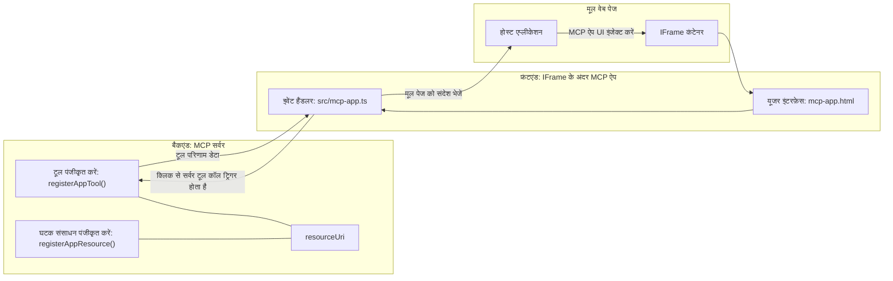

# MCP एप्स

MCP एप्स MCP में एक नया दृष्टिकोण है। विचार यह है कि आप केवल एक टूल कॉल से डेटा वापस प्रतिक्रिया नहीं करते हैं, बल्कि यह भी बताते हैं कि इस जानकारी के साथ कैसे इंटरैक्ट किया जाना चाहिए। इसका मतलब है कि टूल के परिणाम अब UI जानकारी भी शामिल कर सकते हैं। हालांकि हम ऐसा क्यों चाहेंगे? खैर, विचार करें कि आप आज कैसे काम करते हैं। आप संभवतः MCP सर्वर के परिणामों का उपयोग किसी प्रकार के फ्रंटेंड को उसके सामने रखकर करते हैं, वह कोड है जिसे आपको लिखना और बनाए रखना पड़ता है। कभी-कभी यही आप चाहते हैं, लेकिन कभी-कभी यह अच्छा होगा अगर आप केवल जानकारी का एक स्निपेट ला सकें जो स्व-संयुक्त हो, जिसमें डेटा से लेकर उपयोगकर्ता इंटरफ़ेस तक सब कुछ हो।

## अवलोकन

यह पाठ MCP एप्स पर व्यावहारिक मार्गदर्शन प्रदान करता है, इसके साथ कैसे शुरू करें और इसे अपने मौजूदा वेब एप्स में कैसे एकीकृत करें। MCP एप्स MCP मानक में एक बहुत नया जोड़ है।

## सीखने के उद्देश्य

इस पाठ के अंत तक, आप सक्षम होंगे:

- समझाएं कि MCP एप्स क्या हैं।
- कब MCP एप्स का उपयोग करें।
- अपने स्वयं के MCP एप्स बनाएं और एकीकृत करें।

## MCP एप्स - यह कैसे काम करता है

MCP एप्स का विचार एक ऐसी प्रतिक्रिया प्रदान करना है जो मूल रूप से एक घटक हो जिसे रेंडर किया जाना है। ऐसा घटक दोनों दृश्य और इंटरैक्टिविटी दोनों हो सकता है, जैसे बटन क्लिक, उपयोगकर्ता इनपुट और अधिक। चलिए सर्वर साइड से शुरू करते हैं और हमारे MCP सर्वर से। एक MCP एप घटक बनाने के लिए आपको एक टूल बनाना होगा, लेकिन साथ ही एप्लिकेशन संसाधन भी बनाना होगा। ये दो आधे resourceUri द्वारा जुड़े होते हैं।

यहाँ एक उदाहरण है। चलिए देखें कि इसमें क्या शामिल है और कौन से हिस्से क्या करते हैं:

```text
server.ts -- responsible for registering tools and the component as a UI component
src/
  mcp-app.ts -- wiring up event handlers
mcp-app.html -- the user interface
```

यह दृश्य दिखाता है कि एक घटक और इसकी लॉजिक बनाने के लिए वास्तुकला क्या है।


चलिये अब बैकएंड और फ्रंटएंड की जिम्मेदारियों का वर्णन करते हैं क्रमशः।

### बैकएंड

हमें यहाँ दो चीजें पूरी करनी हैं:

- टूल्स को पंजीकृत करना जिनके साथ हम इंटरैक्ट करना चाहते हैं।
- घटक को परिभाषित करना।

**टूल पंजीकृत करना**

```typescript
registerAppTool(
    server,
    "get-time",
    {
      title: "Get Time",
      description: "Returns the current server time.",
      inputSchema: {},
      _meta: { ui: { resourceUri } }, // इस टूल को इसके UI संसाधन से जोड़ता है
    },
    async () => {
      const time = new Date().toISOString();
      return { content: [{ type: "text", text: time }] };
    },
  );

```

ऊपर दिया गया कोड व्यवहार को वर्णित करता है, जहाँ यह `get-time` नामक एक टूल को एक्सपोज़ करता है। इसमें कोई इनपुट नहीं लिया जाता लेकिन अंत में वर्तमान समय प्रदान किया जाता है। हमारे पास उन टूल्स के लिए `inputSchema` परिभाषित करने की क्षमता है जहाँ हमें उपयोगकर्ता इनपुट स्वीकार करने की आवश्यकता होती है।

**घटक पंजीकृत करना**

इसी फ़ाइल में, हमें घटक भी पंजीकृत करना होगा:

```typescript
const resourceUri = "ui://get-time/mcp-app.html";

// संसाधन को पंजीकृत करें, जो UI के लिए बंडल किए गए HTML/JavaScript को वापस करता है।
registerAppResource(
  server,
  resourceUri,
  resourceUri,
  { mimeType: RESOURCE_MIME_TYPE },
  async () => {
    const html = await fs.readFile(path.join(DIST_DIR, "mcp-app.html"), "utf-8");

    return {
    contents: [
        { uri: resourceUri, mimeType: RESOURCE_MIME_TYPE, text: html },
    ],
    };
  },
);
```

ध्यान दें कि हम `resourceUri` का उल्लेख करके घटक को उसके टूल्स से कनेक्ट करते हैं। दिलचस्प बात यह भी है कि कॉलबैक जहां हम UI फ़ाइल लोड करते हैं और घटक लौटाते हैं।

### घटक फ्रंटएंड

बैकएंड की तरह, यहां भी दो हिस्से हैं:

- शुद्ध HTML में लिखा गया फ्रंटएंड।
- कोड जो इवेंट्स को संभालता है और क्या करना है, जैसे टूल कॉल करना या पैरेंट विंडो को संदेश भेजना।

**उपयोगकर्ता इंटरफ़ेस**

आइए उपयोगकर्ता इंटरफ़ेस पर नज़र डालते हैं।

```html
<!-- mcp-app.html -->
<!DOCTYPE html>
<html lang="en">
  <head>
    <meta charset="UTF-8" />
    <title>Get Time App</title>
  </head>
  <body>
    <p>
      <strong>Server Time:</strong> <code id="server-time">Loading...</code>
    </p>
    <button id="get-time-btn">Get Server Time</button>
    <script type="module" src="/src/mcp-app.ts"></script>
  </body>
</html>
```

**इवेंट वायरअप**

अंतिम हिस्सा इवेंट वायरअप है। इसका मतलब है कि हम पहचानते हैं कि हमारी UI में किस हिस्से को इवेंट हैंडलर्स की जरूरत है और यदि इवेंट्स उठाए जाते हैं तो क्या करना है:

```typescript
// mcp-app.ts

import { App } from "@modelcontextprotocol/ext-apps";

// तत्व संदर्भ प्राप्त करें
const serverTimeEl = document.getElementById("server-time")!;
const getTimeBtn = document.getElementById("get-time-btn")!;

// ऐप उदाहरण बनाएं
const app = new App({ name: "Get Time App", version: "1.0.0" });

// सर्वर से टूल परिणामों को संभालें। इसे `app.connect()` से पहले सेट करें ताकि
// प्रारंभिक टूल परिणाम गायब न हो।
app.ontoolresult = (result) => {
  const time = result.content?.find((c) => c.type === "text")?.text;
  serverTimeEl.textContent = time ?? "[ERROR]";
};

// बटन क्लिक जोड़ें
getTimeBtn.addEventListener("click", async () => {
  // `app.callServerTool()` UI को सर्वर से ताजा डेटा अनुरोध करने देता है
  const result = await app.callServerTool({ name: "get-time", arguments: {} });
  const time = result.content?.find((c) => c.type === "text")?.text;
  serverTimeEl.textContent = time ?? "[ERROR]";
});

// होस्ट से कनेक्ट करें
app.connect();
```

जैसा कि ऊपर देखा जा सकता है, यह सामान्य कोड है जो DOM एलिमेंट्स को इवेंट्स से जोड़ता है। उल्लेखनीय है `callServerTool` कॉल जो अंत में बैकएंड पर किसी टूल को कॉल करती है।

## उपयोगकर्ता इनपुट से निपटना

अब तक, हमने एक घटक देखा है जिसमें एक बटन है जो क्लिक करने पर एक टूल को कॉल करता है। चलिए देखते हैं अगर हम अधिक UI एलिमेंट्स जोड़ सकें जैसे एक इनपुट फ़ील्ड और देख सकें कि क्या हम टूल को आर्गुमेंट्स भेज सकते हैं। चलिए एक FAQ फ़ंक्शनलिटी लागू करते हैं। इसका काम इस प्रकार होना चाहिए:

- एक बटन और एक इनपुट एलिमेंट होना चाहिए जहां उपयोगकर्ता खोजने के लिए एक कीवर्ड टाइप करता है जैसे "Shipping"। यह बैकएंड पर एक टूल को कॉल करेगा जो FAQ डेटा में खोज करता है।
- एक टूल जो उल्लेखित FAQ खोज का समर्थन करता हो।

सबसे पहले बैकएंड में आवश्यक समर्थन जोड़ते हैं:

```typescript
const faq: { [key: string]: string } = {
    "shipping": "Our standard shipping time is 3-5 business days.",
    "return policy": "You can return any item within 30 days of purchase.",
    "warranty": "All products come with a 1-year warranty covering manufacturing defects.",
  }

registerAppTool(
    server,
    "get-faq",
    {
      title: "Search FAQ",
      description: "Searches the FAQ for relevant answers.",
      inputSchema: zod.object({
        query: zod.string().default("shipping"),
      }),
      _meta: { ui: { resourceUri: faqResourceUri } }, // इस उपकरण को इसके UI संसाधन से जोड़ता है
    },
    async ({ query }) => {
      const answer: string = faq[query.toLowerCase()] || "Sorry, I don't have an answer for that.";
      return { content: [{ type: "text", text: answer }] };
    },
  );
```

यहाँ हम देख रहे हैं कि हम `inputSchema` को कैसे पॉप्युलेट करते हैं और उसे `zod` स्कीमा देते हैं जैसे:

```typescript
inputSchema: zod.object({
  query: zod.string().default("shipping"),
})
```

ऊपर दिए गए स्कीमा में हम घोषणा करते हैं कि हमारे पास `query` नामक एक इनपुट पैरामीटर है और यह वैकल्पिक है जिसकी डिफ़ॉल्ट वैल्यू "shipping" है।

ठीक है, अब *mcp-app.html* पर चलते हैं यह देखने के लिए कि हमें कौन सा UI बनाना है:

```html
<div class="faq">
    <h1>FAQ response</h1>
    <p>FAQ Response: <code id="faq-response">Loading...</code></p>
    <input type="text" id="faq-query" placeholder="Enter FAQ query" />
    <button id="get-faq-btn">Get FAQ Response</button>
  </div>
```

बहुत बढ़िया, अब हमारे पास एक इनपुट एलिमेंट और बटन है। इसके बाद *mcp-app.ts* पर जाते हैं ताकि इन इवेंट्स को कनेक्ट किया जा सके:

```typescript
const getFaqBtn = document.getElementById("get-faq-btn")!;
const faqQueryInput = document.getElementById("faq-query") as HTMLInputElement;

getFaqBtn.addEventListener("click", async () => {
  const query = faqQueryInput.value;
  const result = await app.callServerTool({ name: "get-faq", arguments: { query } });
  const faq = result.content?.find((c) => c.type === "text")?.text;
  faqResponseEl.textContent = faq ?? "[ERROR]";
});
```

ऊपर कोड में हमने:

- इंटरऐक्टिव UI एलिमेंट्स के रेफरेन्स बनाए।
- बटन क्लिक को संभाला जहां इनपुट एलिमेंट का मान निकाला गया और हमने `app.callServerTool()` को `name` और `arguments` के साथ कॉल किया, जहां बाद वाला `query` के रूप में मान भेज रहा है।

असल में जब आप `callServerTool` कॉल करते हैं तो यह एक संदेश पैरेंट विंडो को भेजता है और वह विंडो अंत में MCP सर्वर को कॉल करती है।

### इसे आज़माएँ

इसे आज़माने पर हमें निम्नलिखित देखना चाहिए:


और यहाँ हम इसे "warranty" जैसे इनपुट के साथ आज़माते हैं


इस कोड को चलाने के लिए, [Code section](./code/README.md) पर जाएं

## Visual Studio Code में परीक्षण

Visual Studio Code MCP एप्स के लिए बहुत अच्छा समर्थन प्रदान करता है और संभवतः आपके MCP एप्स का परीक्षण करने के सबसे आसान तरीकों में से एक है। Visual Studio Code का उपयोग करने के लिए, *mcp.json* में इस प्रकार एक सर्वर एंट्री जोड़ें:

```json
"my-mcp-server-7178eca7": {
    "url": "http://localhost:3001/mcp",
    "type": "http"
  }
```

फिर सर्वर शुरू करें, आपको इस बात में सक्षम होना चाहिए कि आप अपनी MCP एप के साथ Chat Window के माध्यम से संवाद कर सकें बशर्ते आपके पास GitHub Copilot इंस्टॉल हो।

आप इसे एक प्रॉम्प्ट के माध्यम से ट्रिगर कर सकते हैं, उदाहरण के लिए "#get-faq":


और जैसे ही आपने इसे वेब ब्राउज़र से चलाया था, यह उसी तरह रेंडर करता है:


## असाइनमेंट

एक रॉक पेपर सिज़र गेम बनाएं। इसमें निम्न होना चाहिए:

UI:

- विकल्पों के साथ एक ड्रॉप डाउन सूची
- एक विकल्प सबमिट करने के लिए बटन
- एक लेबल जो दिखाए कि किसने क्या चुना और कौन जीता

सर्वर:

- एक रॉक पेपर सिज़र टूल होना चाहिए जो "choice" को इनपुट के रूप में लेता है। इसे कंप्यूटर का विकल्प भी रेंडर करना चाहिए और विजेता का निर्धारण करना चाहिए।

## समाधान

[Solution](./assignment/README.md)

## सारांश

हमने इस नए दृष्टिकोण MCP Apps के बारे में जाना। यह एक नया दृष्टिकोण है जो MCP सर्वरों को केवल डेटा ही नहीं बल्कि यह भी बताने की अनुमति देता है कि यह डेटा कैसे प्रस्तुत किया जाना चाहिए।

इसके अतिरिक्त, हमने जाना कि ये MCP Apps एक IFrame में होस्ट किए जाते हैं और MCP सर्वरों के साथ संवाद करने के लिए उन्हें पैरेंट वेब ऐप को संदेश भेजने की आवश्यकता होती है। इसके लिए कई पुस्तकालय उपलब्ध हैं जो सादे जावास्क्रिप्ट, React और अन्य के लिए इस संचार को आसान बनाते हैं।

## मुख्य बिंदु

यहाँ आपने क्या सीखा:

- MCP ऐप्स एक नया मानक है जो तब उपयोगी हो सकता है जब आप डेटा और UI फीचर्स दोनों भेजना चाहते हैं।
- ये प्रकार के ऐप्स सुरक्षा कारणों से IFrame में चलते हैं।

## आगे क्या

- [Chapter 4](../../04-PracticalImplementation/README.md)

---

<!-- CO-OP TRANSLATOR DISCLAIMER START -->
**अस्वीकरण**:  
यह दस्तावेज़ AI अनुवाद सेवा [Co-op Translator](https://github.com/Azure/co-op-translator) का उपयोग करके अनुवादित किया गया है। जबकि हम सटीकता के लिए प्रयासरत हैं, कृपया ध्यान दें कि स्वचालित अनुवादों में त्रुटियाँ या गलतियाँ हो सकती हैं। मूल दस्तावेज़ अपने मौलिक भाषा में प्राधिकृत स्रोत माना जाना चाहिए। महत्वपूर्ण जानकारी के लिए, पेशेवर मानवीय अनुवाद की सिफारिश की जाती है। इस अनुवाद के उपयोग से उत्पन्न किसी भी गलतफहमी या गलत व्याख्या के लिए हम जिम्मेदार नहीं हैं।
<!-- CO-OP TRANSLATOR DISCLAIMER END -->