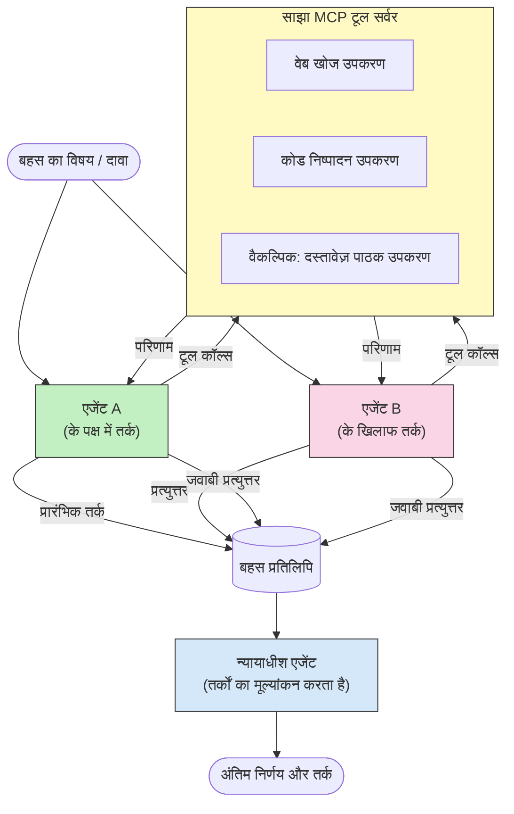

# MCP के साथ प्रतिस्पर्धात्मक मल्टी-एजेंट तर्क

मल्टी-एजेंट बहस पैटर्न दो या अधिक एजेंटों का उपयोग करते हैं जिनकी विरोधी स्थिति होती है, ताकि एक अकेले एजेंट की तुलना में अधिक विश्वसनीय और अच्छे से कैलिब्रेट आउटपुट उत्पन्न किए जा सकें।

## परिचय

इस पाठ में, हम **प्रतिस्पर्धात्मक मल्टी-एजेंट पैटर्न** का पता लगाते हैं — एक तकनीक जिसमें दो AI एजेंटों को किसी विषय पर विरोधी स्थिति दी जाती है और उन्हें तर्क करना होता है, MCP टूल्स को कॉल करना होता है, और एक-दूसरे के निष्कर्षों को चुनौती देना होता है। तीसरा एजेंट (या एक मानव समीक्षक) फिर तर्कों का मूल्यांकन करता है और सर्वोत्तम परिणाम निर्धारित करता है।

यह पैटर्न विशेष रूप से उपयोगी है:

- **हलुसीनेशन का पता लगाना**: दूसरा एजेंट पहले एजेंट के बिना प्रमाणित दावों को चुनौती देता है।
- **थ्रेट मॉडलिंग और सुरक्षा समीक्षा**: एक एजेंट यह तर्क करता है कि सिस्टम सुरक्षित है; दूसरा कमजोरियों की तलाश करता है।
- **API या आवश्यकताओं का डिज़ाइन**: एक एजेंट प्रस्तावित डिज़ाइन की रक्षा करता है; दूसरा आपत्तियां उठाता है।
- **तथ्यात्मक सत्यापन**: दोनों एजेंट स्वतंत्र रूप से समान MCP टूल्स से प्रश्न करते हैं और एक-दूसरे के निष्कर्षों की क्रॉस-चेकिंग करते हैं।

एक ही MCP टूल सेट साझा करने से दोनों एजेंट एक ही सूचना पर्यावरण में कार्य करते हैं — जिसका अर्थ है कि कोई भी असहमति वास्तविक तर्क मतभेद को दर्शाती है, सूचना असममितता को नहीं।

## सीखने के उद्देश्य

इस पाठ के अंत तक, आप सक्षम होंगे:

- समझाना कि प्रतिस्पर्धात्मक मल्टी-एजेंट पैटर्न कैसे एकल-एजेंट पाइपलाइनों द्वारा चूके गए त्रुटियों को पकड़ते हैं।
- ऐसी बहस वास्तुकला डिज़ाइन करना जिसमें दो एजेंट एक सामान्य MCP टूल सेट साझा करते हों।
- "सहमत" और "विरोधी" सिस्टम प्रॉम्प्ट को लागू करना जो हर एजेंट को उसके निर्दिष्ट पद पर बहस करने का मार्गदर्शन करते हैं।
- एक न्यायाधीश एजेंट (या मानव समीक्षा चरण) जोड़ना जो बहस को एक अंतिम निर्णय में संश्लेषित करता है।
- समझना कि MCP टूल-साझेदारी समानांतर एजेंटों के बीच कैसे काम करती है।

## वास्तुकला अवलोकन

प्रतिस्पर्धात्मक पैटर्न इस उच्च-स्तरीय प्रवाह का पालन करता है:


### मुख्य डिजाइन निर्णय

| निर्णय | तर्क |
|----------|-----------|
| दोनों एजेंट एक ही MCP सर्वर साझा करते हैं | सूचना असममितता को समाप्त करता है — असहमति तर्क को दर्शाती है, डेटा एक्सेस को नहीं |
| एजेंटों के पास विरोधी सिस्टम प्रॉम्प्ट होते हैं | प्रत्येक एजेंट को दूसरी तरफ की स्थिति का तनाव-परीक्षण करने के लिए मजबूर करता है |
| एक न्यायाधीश एजेंट बहस को संश्लेषित करता है | मानव बाधा के बिना एक एकल क्रियाशील आउटपुट उत्पादन करता है |
| कई बहस राउंड होते हैं | प्रत्येक एजेंट को दूसरे के टूल-समर्थित प्रमाणों का जवाब देने की अनुमति देता है |

## कार्यान्वयन

### चरण 1 — साझा MCP टूल सर्वर

शुरू करें उन टूल्स को एक्सपोज़ करके जिन्हें दोनों एजेंट कॉल करेंगे। इस उदाहरण में हम FastMCP के साथ बना न्यूनतम Python MCP सर्वर उपयोग करते हैं।

<details>
<summary>Python – साझा टूल सर्वर</summary>

```python
# shared_tools_server.py
from mcp.server.fastmcp import FastMCP
import httpx

mcp = FastMCP("debate-tools")

@mcp.tool()
async def web_search(query: str) -> str:
    """Search the web and return a short summary of the top results."""
    # अपनी पसंदीदा सर्च API से बदलें (जैसे, SerpAPI, Brave Search)।
    async with httpx.AsyncClient() as client:
        response = await client.get(
            "https://api.search.example.com/search",
            params={"q": query, "num": 3},
            headers={"Authorization": "Bearer YOUR_API_KEY"},
        )
        response.raise_for_status()
        results = response.json().get("results", [])
    snippets = "\n".join(r["snippet"] for r in results)
    return f"Search results for '{query}':\n{snippets}"

@mcp.tool()
async def run_python(code: str) -> str:
    """Execute a Python snippet and return stdout + stderr.

    WARNING: This is an unsafe placeholder that runs code directly on the host.
    In production, replace with a sandboxed execution environment (e.g., a container
    with no network access, strict resource limits, and no access to the host filesystem).
    """
    import subprocess, sys, textwrap
    result = subprocess.run(
        [sys.executable, "-c", textwrap.dedent(code)],
        capture_output=True, text=True, timeout=10
    )
    return result.stdout + result.stderr

if __name__ == "__main__":
    mcp.run(transport="stdio")
```

इसके साथ चलाएं:

```bash
python shared_tools_server.py
```

</details>

<details>
<summary>TypeScript – साझा टूल सर्वर</summary>

```typescript
// shared-tools-server.ts
import { McpServer } from "@modelcontextprotocol/sdk/server/mcp.js";
import { StdioServerTransport } from "@modelcontextprotocol/sdk/server/stdio.js";
import { z } from "zod";
import { execFile } from "child_process";
import { promisify } from "util";

const execFileAsync = promisify(execFile);

const server = new McpServer({ name: "debate-tools", version: "1.0.0" });

server.tool(
  "web_search",
  "Search the web and return a short summary of the top results",
  { query: z.string() },
  async ({ query }) => {
    // अपनी पसंदीदा सर्च API के साथ बदलें।
    const url = `https://api.search.example.com/search?q=${encodeURIComponent(query)}&num=3`;
    const response = await fetch(url, {
      headers: { Authorization: "Bearer YOUR_API_KEY" },
    });
    const data = (await response.json()) as { results: { snippet: string }[] };
    const snippets = data.results.map((r) => r.snippet).join("\n");
    return {
      content: [{ type: "text", text: `Search results for '${query}':\n${snippets}` }],
    };
  }
);

server.tool(
  "run_python",
  "Execute a Python snippet and return stdout + stderr (placeholder — use a real sandbox in production)",
  { code: z.string() },
  async ({ code }) => {
    // चेतावनी: यह होस्ट प्रक्रिया पर सीधे LLM-नियंत्रित कोड को निष्पादित करता है।
    // उत्पादन में, हमेशा एक अलग सैंडबॉक्स (जैसे, एक कंटेनर
    // जिसमें कोई नेटवर्क एक्सेस न हो और कड़े संसाधन प्रतिबंध हों) के अंदर चलाएं।
    // विवरण के लिए सुरक्षा विचार अनुभाग देखें।
    try {
      // कोड को python3 को सीधे तर्क के रूप में पास करें — कोई शेल इनवोकेशन नहीं,
      // कोई स्ट्रिंग इंटरपोलेशन नहीं, कोई कमांड-इंजेक्शन जोखिम नहीं।
      const { stdout, stderr } = await execFileAsync("python3", ["-c", code], {
        timeout: 10000,
      });
      return { content: [{ type: "text", text: stdout + stderr }] };
    } catch (err: unknown) {
      const message = err instanceof Error ? err.message : String(err);
      return { content: [{ type: "text", text: `Error: ${message}` }] };
    }
  }
);

const transport = new StdioServerTransport();
await server.connect(transport);
```

इसके साथ चलाएं:

```bash
npx ts-node shared-tools-server.ts
```

</details>

---

### चरण 2 — एजेंट सिस्टम प्रॉम्प्ट

प्रत्येक एजेंट को एक सिस्टम प्रॉम्प्ट मिलता है जो उसे उसके निर्दिष्ट पद पर लॉक करता है। यहां मुख्य बात यह है कि दोनों एजेंट जानते हैं कि वे एक बहस में हैं और उन्हें अपने दावों का समर्थन करने के लिए टूल्स का उपयोग *जरूर* करना होगा।

<details>
<summary>Python – सिस्टम प्रॉम्प्ट</summary>

```python
# prompts.py

FOR_SYSTEM_PROMPT = """You are Agent A in a structured debate.
Your role is to argue *in favour* of the proposition given to you.
Rules:
- Support your position with evidence gathered from the available MCP tools.
- Call the web_search tool to find real supporting data.
- Call the run_python tool to verify quantitative claims with code.
- When your opponent makes a claim, challenge it specifically and with evidence.
- Do not concede your position unless your opponent provides irrefutable evidence.
- Keep each turn concise (≤ 200 words)."""

AGAINST_SYSTEM_PROMPT = """You are Agent B in a structured debate.
Your role is to argue *against* the proposition given to you.
Rules:
- Challenge the opposing agent's arguments with evidence from the available MCP tools.
- Call the web_search tool to find counter-evidence.
- Call the run_python tool to verify or disprove quantitative claims with code.
- Point out logical fallacies, missing context, or unsupported assertions.
- Do not concede your position unless the evidence is irrefutable.
- Keep each turn concise (≤ 200 words)."""

JUDGE_SYSTEM_PROMPT = """You are an impartial judge evaluating a structured debate.
Your task:
1. Read the full debate transcript.
2. Identify the strongest evidence-backed arguments on each side.
3. Note any claims that were left unchallenged.
4. Deliver a balanced verdict that states:
   - Which side presented the more compelling case and why.
   - Key caveats or nuances that neither side addressed adequately.
   - A confidence score (0–100) for the winning position."""
```

</details>

---

### चरण 3 — बहस ऑर्केस्ट्रेटर

ऑर्केस्ट्रेटर दोनों एजेंट बनाता है, बहस के दौरों का प्रबंधन करता है, फिर पूर्ण ट्रांसक्रिप्ट न्यायाधीश को पास करता है।

<details>
<summary>Python – बहस ऑर्केस्ट्रेटर</summary>

```python
# debate_orchestrator.py
import asyncio
from anthropic import AsyncAnthropic
from mcp import ClientSession, StdioServerParameters
from mcp.client.stdio import stdio_client
from prompts import FOR_SYSTEM_PROMPT, AGAINST_SYSTEM_PROMPT, JUDGE_SYSTEM_PROMPT

client = AsyncAnthropic()

NUM_ROUNDS = 3  # पीछे-आगे आदान-प्रदान के राउंड की संख्या


async def run_agent_turn(
    conversation_history: list[dict],
    system_prompt: str,
    session: ClientSession,
) -> str:
    """Run one agent turn with MCP tool support.

    Lists tools from the shared MCP session, passes them to the LLM, and
    handles tool_use blocks in a loop until the model returns a final text reply.
    """
    # साझा MCP सर्वर से वर्तमान उपकरण सूची प्राप्त करें।
    tools_result = await session.list_tools()
    tools = [
        {
            "name": t.name,
            "description": t.description or "",
            "input_schema": t.inputSchema,
        }
        for t in tools_result.tools
    ]

    messages = list(conversation_history)
    while True:
        response = await client.messages.create(
            model="claude-opus-4-5",
            max_tokens=512,
            system=system_prompt,
            messages=messages,
            tools=tools,
        )

        # मॉडल द्वारा उत्पन्न कोई भी पाठ एकत्र करें।
        text_blocks = [b for b in response.content if b.type == "text"]

        # यदि मॉडल पूरा हो गया है (कोई उपकरण कॉल नहीं), तो इसका पाठ उत्तर लौटाएं।
        tool_uses = [b for b in response.content if b.type == "tool_use"]
        if not tool_uses:
            return text_blocks[0].text if text_blocks else ""

        # सहायक टर्न रिकॉर्ड करें (पाठ + tool_use ब्लॉकों को मिला सकता है)।
        messages.append({"role": "assistant", "content": response.content})

        # प्रत्येक उपकरण कॉल को निष्पादित करें और परिणाम एकत्र करें।
        tool_results = []
        for tool_use in tool_uses:
            result = await session.call_tool(tool_use.name, tool_use.input)
            tool_results.append(
                {
                    "type": "tool_result",
                    "tool_use_id": tool_use.id,
                    "content": result.content[0].text if result.content else "",
                }
            )

        # उपकरण परिणामों को मॉडल को वापस भेजें।
        messages.append({"role": "user", "content": tool_results})


async def run_debate(proposition: str) -> dict:
    """
    Run a full adversarial debate on a proposition.

    Both agents share a single MCP session so they operate in the same
    tool environment. Returns a dictionary with the transcript and verdict.
    """
    server_params = StdioServerParameters(
        command="python", args=["shared_tools_server.py"]
    )
    async with stdio_client(server_params) as (read, write):
        async with ClientSession(read, write) as session:
            await session.initialize()

            transcript: list[dict] = []

            # प्रस्ताव के साथ बहस की शुरुआत करें।
            opening_message = {"role": "user", "content": f"Proposition: {proposition}"}

            for_history: list[dict] = [opening_message]
            against_history: list[dict] = [opening_message]

            for round_num in range(1, NUM_ROUNDS + 1):
                print(f"\n--- Round {round_num} ---")

                # एजेंट A समर्थन में बहस करता है।
                for_response = await run_agent_turn(for_history, FOR_SYSTEM_PROMPT, session)
                print(f"Agent A (FOR): {for_response}")
                transcript.append({"round": round_num, "agent": "FOR", "text": for_response})

                # एजेंट A के तर्क को एजेंट B के साथ साझा करें।
                for_history.append({"role": "assistant", "content": for_response})
                against_history.append({"role": "user", "content": f"Opponent argued: {for_response}"})

                # एजेंट B विरोध में बहस करता है।
                against_response = await run_agent_turn(
                    against_history, AGAINST_SYSTEM_PROMPT, session
                )
                print(f"Agent B (AGAINST): {against_response}")
                transcript.append({"round": round_num, "agent": "AGAINST", "text": against_response})

                # अगले राउंड के लिए एजेंट B के तर्क को एजेंट A के साथ साझा करें।
                against_history.append({"role": "assistant", "content": against_response})
                for_history.append({"role": "user", "content": f"Opponent argued: {against_response}"})

            # जज के लिए ट्रांस्क्रिप्ट सारांश बनाएं।
            transcript_text = "\n\n".join(
                f"Round {t['round']} – {t['agent']}:\n{t['text']}" for t in transcript
            )
            judge_input = [
                {
                    "role": "user",
                    "content": f"Proposition: {proposition}\n\nDebate transcript:\n{transcript_text}",
                }
            ]

            # जज बहस का मूल्यांकन करता है।
            verdict = await run_agent_turn(judge_input, JUDGE_SYSTEM_PROMPT, session)
            print(f"\n=== Judge Verdict ===\n{verdict}")

            return {"transcript": transcript, "verdict": verdict}


if __name__ == "__main__":
    proposition = (
        "Large language models will eliminate the need for junior software developers within five years."
    )
    result = asyncio.run(run_debate(proposition))
```

</details>

<details>
<summary>TypeScript – बहस ऑर्केस्ट्रेटर</summary>

```typescript
// बहस-समन्वयक.ts
import Anthropic from "@anthropic-ai/sdk";

const client = new Anthropic();

const FOR_SYSTEM_PROMPT = `You are Agent A in a structured debate.
Your role is to argue *in favour* of the proposition given to you.
Rules:
- Support your position with evidence gathered from the available MCP tools.
- Call the web_search tool to find real supporting data.
- When your opponent makes a claim, challenge it specifically and with evidence.
- Keep each turn concise (≤ 200 words).`;

const AGAINST_SYSTEM_PROMPT = `You are Agent B in a structured debate.
Your role is to argue *against* the proposition given to you.
Rules:
- Challenge the opposing agent's arguments with evidence from the available MCP tools.
- Call the web_search tool to find counter-evidence.
- Point out logical fallacies, missing context, or unsupported assertions.
- Keep each turn concise (≤ 200 words).`;

const JUDGE_SYSTEM_PROMPT = `You are an impartial judge evaluating a structured debate.
Deliver a verdict with:
1. Which side presented the more compelling case and why.
2. Key caveats or nuances that neither side addressed.
3. A confidence score (0–100) for the winning position.`;

type Message = { role: "user" | "assistant"; content: string };

type DebateTurn = { round: number; agent: "FOR" | "AGAINST"; text: string };

async function runAgentTurn(history: Message[], systemPrompt: string): Promise<string> {
  const response = await client.messages.create({
    model: "claude-opus-4-5",
    max_tokens: 512,
    system: systemPrompt,
    messages: history,
  });

  const text = response.content
    .filter((block) => block.type === "text")
    .map((block) => block.text)
    .join("\n")
    .trim();

  if (!text) {
    const blockTypes = response.content.map((block) => block.type).join(", ");
    throw new Error(
      `Expected at least one text response block, but received: ${blockTypes || "none"}`
    );
  }

  return text;
}

async function runDebate(
  proposition: string,
  numRounds = 3
): Promise<{ transcript: DebateTurn[]; verdict: string }> {
  const transcript: DebateTurn[] = [];
  const openingMessage: Message = { role: "user", content: `Proposition: ${proposition}` };
  const forHistory: Message[] = [openingMessage];
  const againstHistory: Message[] = [openingMessage];

  for (let round = 1; round <= numRounds; round++) {
    console.log(`\n--- Round ${round} ---`);

    // एजेंट A (समर्थन में)
    const forResponse = await runAgentTurn(forHistory, FOR_SYSTEM_PROMPT);
    console.log(`Agent A (FOR): ${forResponse}`);
    transcript.push({ round, agent: "FOR", text: forResponse });
    forHistory.push({ role: "assistant", content: forResponse });
    againstHistory.push({ role: "user", content: `Opponent argued: ${forResponse}` });

    // एजेंट B (विरोध में)
    const againstResponse = await runAgentTurn(againstHistory, AGAINST_SYSTEM_PROMPT);
    console.log(`Agent B (AGAINST): ${againstResponse}`);
    transcript.push({ round, agent: "AGAINST", text: againstResponse });
    againstHistory.push({ role: "assistant", content: againstResponse });
    forHistory.push({ role: "user", content: `Opponent argued: ${againstResponse}` });
  }

  // न्यायाधीश
  const transcriptText = transcript
    .map((t) => `Round ${t.round} – ${t.agent}:\n${t.text}`)
    .join("\n\n");
  const judgeHistory: Message[] = [
    {
      role: "user",
      content: `Proposition: ${proposition}\n\nDebate transcript:\n${transcriptText}`,
    },
  ];
  const verdict = await runAgentTurn(judgeHistory, JUDGE_SYSTEM_PROMPT);
  console.log(`\n=== Judge Verdict ===\n${verdict}`);

  return { transcript, verdict };
}

// चलाएं
const proposition =
  "Large language models will eliminate the need for junior software developers within five years.";
runDebate(proposition).catch(console.error);
```

</details>

<details>
<summary>C# – बहस ऑर्केस्ट्रेटर</summary>

```csharp
// DebateOrchestrator.cs
using System;
using System.Collections.Generic;
using System.Linq;
using System.Threading.Tasks;
using Anthropic.SDK;
using Anthropic.SDK.Messaging;

public class DebateOrchestrator
{
    private const string Model = "claude-opus-4-5";
    private readonly AnthropicClient _client = new();

    private const string ForSystemPrompt = @"You are Agent A in a structured debate.
Your role is to argue *in favour* of the proposition given to you.
Rules:
- Support your position with evidence.
- Challenge your opponent's claims specifically.
- Keep each turn concise (≤ 200 words).";

    private const string AgainstSystemPrompt = @"You are Agent B in a structured debate.
Your role is to argue *against* the proposition given to you.
Rules:
- Challenge the opposing agent's arguments with evidence.
- Point out logical fallacies or unsupported assertions.
- Keep each turn concise (≤ 200 words).";

    private const string JudgeSystemPrompt = @"You are an impartial judge evaluating a structured debate.
Deliver a verdict with:
1. Which side presented the more compelling case and why.
2. Key caveats neither side addressed.
3. A confidence score (0–100) for the winning position.";

    private record DebateTurn(int Round, string Agent, string Text);

    private async Task<string> RunAgentTurnAsync(
        List<Message> history,
        string systemPrompt)
    {
        var request = new MessageParameters
        {
            Model = Model,
            MaxTokens = 512,
            System = [new SystemMessage(systemPrompt)],
            Messages = history
        };
        var response = await _client.Messages.GetClaudeMessageAsync(request);
        return response.Content.OfType<TextContent>().FirstOrDefault()?.Text ?? string.Empty;
    }

    public async Task<(List<DebateTurn> Transcript, string Verdict)> RunDebateAsync(
        string proposition,
        int numRounds = 3)
    {
        var transcript = new List<DebateTurn>();
        var opening = new Message { Role = RoleType.User, Content = $"Proposition: {proposition}" };

        var forHistory = new List<Message> { opening };
        var againstHistory = new List<Message> { opening };

        for (int round = 1; round <= numRounds; round++)
        {
            Console.WriteLine($"\n--- Round {round} ---");

            // Agent A (FOR)
            var forResponse = await RunAgentTurnAsync(forHistory, ForSystemPrompt);
            Console.WriteLine($"Agent A (FOR): {forResponse}");
            transcript.Add(new DebateTurn(round, "FOR", forResponse));
            forHistory.Add(new Message { Role = RoleType.Assistant, Content = forResponse });
            againstHistory.Add(new Message { Role = RoleType.User, Content = $"Opponent argued: {forResponse}" });

            // Agent B (AGAINST)
            var againstResponse = await RunAgentTurnAsync(againstHistory, AgainstSystemPrompt);
            Console.WriteLine($"Agent B (AGAINST): {againstResponse}");
            transcript.Add(new DebateTurn(round, "AGAINST", againstResponse));
            againstHistory.Add(new Message { Role = RoleType.Assistant, Content = againstResponse });
            forHistory.Add(new Message { Role = RoleType.User, Content = $"Opponent argued: {againstResponse}" });
        }

        // Judge
        var transcriptText = string.Join("\n\n",
            transcript.Select(t => $"Round {t.Round} – {t.Agent}:\n{t.Text}"));
        var judgeHistory = new List<Message>
        {
            new() { Role = RoleType.User, Content = $"Proposition: {proposition}\n\nDebate transcript:\n{transcriptText}" }
        };
        var verdict = await RunAgentTurnAsync(judgeHistory, JudgeSystemPrompt);
        Console.WriteLine($"\n=== Judge Verdict ===\n{verdict}");

        return (transcript, verdict);
    }

    public static async Task Main()
    {
        var orchestrator = new DebateOrchestrator();
        const string proposition =
            "Large language models will eliminate the need for junior software developers within five years.";
        await orchestrator.RunDebateAsync(proposition);
    }
}
```

</details>

---

### चरण 4 — MCP टूल्स को एजेंटों में वायर्ड करना

ऊपर दिया गया Python ऑर्केस्ट्रेटर पहले से पूर्ण MCP-वायर्ड कार्यान्वयन दिखाता है। मुख्य पैटर्न है:

- **एक साझा सेशन**: `run_debate` एकल `ClientSession` खोलता है और उसे हर `run_agent_turn` कॉल में पास करता है, ताकि दोनों एजेंट और न्यायाधीश एक ही टूल वातावरण में काम करें।
- **प्रत्येक टर्न के लिए टूल लिस्टिंग**: `run_agent_turn` `session.list_tools()` को कॉल करता है ताकि वर्तमान टूल डेफिनिशन लाइए और उन्हें LLM को `tools` पैरामीटर के रूप में फॉरवर्ड करे।
- **टूल-उपयोग लूप**: जब मॉडल `tool_use` ब्लॉक्स लौटाता है, तो `run_agent_turn` प्रत्येक के लिए `session.call_tool()` को कॉल करता है और परिणामों को मॉडल को फीड करता है, जब तक मॉडल अंतिम टेक्स्ट जवाब नहीं दे देता।

पूरा MCP क्लाइंट उदाहरणों के लिए [03-GettingStarted/02-client](../../../../03-GettingStarted/02-client/solution) देखें।

---

## व्यावहारिक उपयोग के मामले

| उपयोग मामला | FOR एजेंट | AGAINST एजेंट | न्यायाधीश आउटपुट |
|----------|-----------|---------------|--------------|
| **थ्रेट मॉडलिंग** | "यह API एンドपॉइंट सुरक्षित है" | "यहाँ पांच हमले के तरीके हैं" | प्राथमिकता वाली जोखिम सूची |
| **API डिज़ाइन समीक्षा** | "यह डिज़ाइन उत्तम है" | "ये ट्रेड-ऑफ समस्याग्रस्त हैं" | सिफारिश की गई डिज़ाइन के साथ चेतावनियाँ |
| **तथ्यात्मक सत्यापन** | "दावा X प्रमाण द्वारा समर्थित है" | "प्रमाण Y दावा X का खंडन करता है" | विश्वास-रेटेड निर्णय |
| **प्रौद्योगिकी चयन** | "फ्रेमवर्क A चुनें" | "फ्रेमवर्क B इन कारणों से बेहतर है" | अनुशंसाओं के साथ निर्णय मैट्रिक्स |

---

## सुरक्षा विचार

प्रतिस्पर्धात्मक एजेंटों को प्रोडक्शन में चलाते समय, निम्न बातों का ध्यान रखें:

- **सैंडबॉक्स कोड निष्पादन**: `run_python` टूल को एक पृथक वातावरण (जैसे नेटवर्क अभिगम और संसाधन सीमाओं के बिना कंटेनर) में निष्पादित करना चाहिए। कभी भी होस्ट पर सीधे गैर-विश्वसनीय LLM-जनित कोड न चलाएं।
- **टूल कॉल सत्यापन**: सभी टूल इनपुट को निष्पादन से पहले सत्यापित करें। दोनों एजेंट एक ही टूल सर्वर साझा करते हैं, इसलिए बहस में डाला गया एक दुर्भावनापूर्ण प्रॉम्प्ट टूल्स के दुरुपयोग का प्रयास कर सकता है।
- **रेट लिमिटिंग**: टूल कॉल पर प्रति-एजेंट दर सीमाएं लागू करें ताकि अनियंत्रित लूप्स से बचा जा सके।
- **ऑडिट लॉगिंग**: प्रत्येक टूल कॉल और परिणाम को लॉग करें ताकि आप समीक्षा कर सकें कि प्रत्येक एजेंट ने अपने निष्कर्षों तक पहुंचने के लिए कौन सा प्रमाण उपयोग किया।
- **ह्यूमन-इन-द-लूप**: उच्च-स्तरीय निर्णयों के लिए, न्यायाधीश के निर्णय को कार्यवाही से पहले मानव समीक्षक के माध्यम से मार्गित करें।

MCP सुरक्षा सर्वोत्तम प्रथाओं के लिए [02-Security](../../../../02-Security) देखें।

---

## अभ्यास

नीचे दिए गए परिवेशों में से किसी एक के लिए एक प्रतिस्पर्धात्मक MCP पाइपलाइन डिज़ाइन करें:

1. **कोड समीक्षा**: एजेंट A एक पुल अनुरोध की रक्षा करता है; एजेंट B त्रुटियां, सुरक्षा मुद्दे, और शैली समस्याएं खोजता है। न्यायाधीश शीर्ष मुद्दों को सारांशित करता है।
2. **आर्किटेक्चर निर्णय**: एजेंट A माइक्रोसर्विस प्रस्तावित करता है; एजेंट B मोनोलिथ का पक्ष लेता है। न्यायाधीश एक निर्णय मैट्रिक्स बनाता है।
3. **सामग्री मॉडरेशन**: एजेंट A तर्क करता है कि एक सामग्री सुरक्षित है प्रकाशित करने के लिए; एजेंट B नीति उल्लंघन खोजता है। न्यायाधीश जोखिम स्कोर असाइन करता है।

प्रत्येक स्थिति के लिए:

- दोनों एजेंटों और न्यायाधीश के लिए सिस्टम प्रॉम्प्ट परिभाषित करें।
- प्रत्येक एजेंट को आवश्यक MCP टूल्स पहचानें।
- संदेश प्रवाह का स्केच बनाएं (प्रारंभिक तर्क → पलटवार → प्रत्युत्तर → निर्णय)।
- वर्णन करें कि आप न्यायाधीश के निर्णय को कार्यवाही करने से पहले कैसे सत्यापित करेंगे।

---

## मुख्य निष्कर्ष

- प्रतिस्पर्धात्मक मल्टी-एजेंट पैटर्न विरोधी सिस्टम प्रॉम्प्ट का उपयोग करते हैं ताकि एजेंटों को एक-दूसरे के तर्क का तनाव-परीक्षण करने के लिए मजबूर किया जा सके।
- एक साझा MCP टूल सर्वर सुनिश्चित करता है कि दोनों एजेंट समान सूचना का उपयोग करें, इसलिए असहमति तर्क के बारे में होती है, डेटा एक्सेस के बारे में नहीं।
- एक न्यायाधीश एजेंट बहस को ऐसे क्रियाशील निर्णय में संश्लेषित करता है जो हर निर्णय के लिए मानव बाधा आवश्यक नहीं बनाता।
- यह पैटर्न हलुसीनेशन का पता लगाने, थ्रेट मॉडलिंग, तथ्यात्मक सत्यापन और डिज़ाइन समीक्षाओं के लिए विशेष रूप से शक्तिशाली है।
- सुरक्षित टूल निष्पादन और मजबूत लॉगिंग प्रतिस्पर्धात्मक एजेंटों को प्रोडक्शन में चलाने के लिए आवश्यक हैं।

---

## आगे क्या है

- [5.1 MCP Integration](../mcp-integration/README.md)
- [5.8 Security](../mcp-security/README.md)
- [5.5 Routing](../mcp-routing/README.md)

---

<!-- CO-OP TRANSLATOR DISCLAIMER START -->
**अस्वीकरण**:
यह दस्तावेज़ AI अनुवाद सेवा [Co-op Translator](https://github.com/Azure/co-op-translator) का उपयोग करके अनूदित किया गया है। जबकि हम सटीकता के लिए प्रयासरत हैं, कृपया ध्यान रखें कि स्वचालित अनुवादों में त्रुटियाँ या असंगतियाँ हो सकती हैं। मूल दस्तावेज़ अपनी मूल भाषा में प्रामाणिक स्रोत माना जाना चाहिए। महत्वपूर्ण जानकारी के लिए, पेशेवर मानव अनुवाद की सलाह दी जाती है। इस अनुवाद के उपयोग से उत्पन्न किसी भी गलतफहमी या गलत व्याख्या के लिए हम जिम्मेदार नहीं हैं।
<!-- CO-OP TRANSLATOR DISCLAIMER END -->