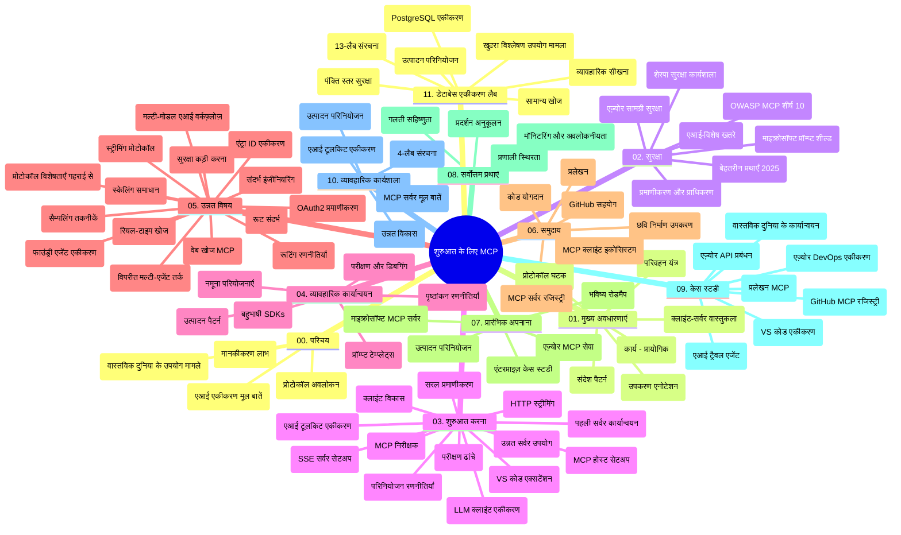

# शुरुआती लोगों के लिए मॉडल कॉन्टेक्स्ट प्रोटोकॉल (MCP) - अध्ययन गाइड

यह अध्ययन गाइड "शुरुआती लोगों के लिए मॉडल कॉन्टेक्स्ट प्रोटोकॉल (MCP)" पाठ्यक्रम के लिए रिपॉजिटरी संरचना और सामग्री का विवरण प्रदान करता है। इस गाइड का उपयोग करके आप रिपॉजिटरी में कुशलतापूर्वक नेविगेट कर सकते हैं और उपलब्ध संसाधनों का अधिकतम लाभ उठा सकते हैं।

## रिपॉजिटरी अवलोकन

मॉडल कॉन्टेक्स्ट प्रोटोकॉल (MCP) एक मानकीकृत फ्रेमवर्क है जो एआई मॉडल और क्लाइंट एप्लिकेशन के बीच इंटरैक्शन के लिए है। शुरुआती तौर पर इसे Anthropic द्वारा बनाया गया था, लेकिन अब MCP समुदाय के माध्यम से आधिकारिक GitHub संगठन द्वारा इसका रखरखाव किया जाता है। यह रिपॉजिटरी C#, Java, JavaScript, Python, और TypeScript में हैंड्स-ऑन कोड उदाहरणों के साथ एक व्यापक पाठ्यक्रम प्रदान करती है, जो एआई डेवलपर्स, सिस्टम आर्किटेक्ट्स, और सॉफ्टवेयर इंजीनियरों के लिए डिज़ाइन किया गया है।

## दृश्य पाठ्यक्रम मानचित्र

## रिपॉजिटरी संरचना

रिपॉजिटरी को ग्यारह मुख्य अनुभागों में व्यवस्थित किया गया है, प्रत्येक MCP के विभिन्न पहलुओं पर केंद्रित है:

1. **परिचय (00-Introduction/)**
   - मॉडल कॉन्टेक्स्ट प्रोटोकॉल का अवलोकन
   - AI पाइपलाइनों में मानकीकरण का महत्व
   - व्यावहारिक उपयोग के मामले और लाभ

2. **कोर अवधारणाएं (01-CoreConcepts/)**
   - क्लाइंट-सर्वर वास्तुकला
   - प्रमुख प्रोटोकॉल घटक
   - MCP में मैसेजिंग पैटर्न

3. **सुरक्षा (02-Security/)**
   - MCP-आधारित सिस्टम में सुरक्षा खतरें
   - कार्यान्वयन की सुरक्षा के लिए सर्वोत्तम प्रथाएँ
   - प्रमाणीकरण और प्राधिकरण रणनीतियाँ
   - **व्यापक सुरक्षा दस्तावेज़ीकरण**:
     - MCP सुरक्षा सर्वोत्तम प्रथाएँ 2025
     - Azure कंटेंट सेफ्टी कार्यान्वयन गाइड
     - MCP सुरक्षा नियंत्रण और तकनीकें
     - MCP सर्वोत्तम प्रथाएँ त्वरित संदर्भ
   - **प्रमुख सुरक्षा विषय**:
     - प्रॉम्प्ट इंजेक्शन और टूल पॉइज़निंग हमले
     - सत्र हाइजैकिंग और कन्फ्यूज़्ड डेप्युटी समस्याएं
     - टोकन पासथ्रू कमजोरियाँ
     - अत्यधिक अनुमतियाँ और एक्सेस नियंत्रण
     - AI घटकों के लिए सप्लाई चैन सुरक्षा
     - Microsoft प्रॉम्प्ट शील्ड्स एकीकरण

4. **शुरुआत करना (03-GettingStarted/)**
   - पर्यावरण सेटअप और विन्यास
   - बुनियादी MCP सर्वर और क्लाइंट बनाना
   - मौजूदा अनुप्रयोगों के साथ एकीकरण
   - निम्नलिखित अनुभाग शामिल:
     - पहला सर्वर कार्यान्वयन
     - क्लाइंट विकास
     - LLM क्लाइंट एकीकरण
     - VS कोड एकीकरण
     - सर्वर-सेंट इवेंट्स (SSE) सर्वर
     - उन्नत सर्वर उपयोग
     - HTTP स्ट्रीमिंग
     - AI टूलकिट एकीकरण
     - परीक्षण रणनीतियाँ
     - परिनियोजन दिशानिर्देश

5. **व्यावहारिक कार्यान्वयन (04-PracticalImplementation/)**
   - विभिन्न प्रोग्रामिंग भाषाओं में SDK का उपयोग
   - डीबगिंग, परीक्षण, और सत्यापन तकनीकें
   - पुन: उपयोग योग्य प्रॉम्प्ट टेम्पलेट्स और वर्कफ़्लोज़ बनाना
   - कार्यान्वयन उदाहरणों के साथ नमूना परियोजनाएं

6. **उन्नत विषय (05-AdvancedTopics/)**
   - कॉन्टेक्स्ट इंजीनियरिंग तकनीकें
   - फाउंड्री एजेंट एकीकरण
   - मल्टी-मॉडल AI वर्कफ़्लोज़
   - OAuth2 प्रमाणीकरण डेमो
   - रीयल-टाइम खोज क्षमताएं
   - रीयल-टाइम स्ट्रीमिंग
   - रूट कॉन्टेक्स्ट का कार्यान्वयन
   - रूटिंग रणनीतियाँ
   - सैंपलिंग तकनीकें
   - स्केलिंग दृष्टिकोण
   - सुरक्षा विचार
   - Entra ID सुरक्षा एकीकरण
   - वेब खोज एकीकरण
   - विरोधी बहु-एजेंट तर्क (बहस पैटर्न)

7. **समुदाय योगदान (06-CommunityContributions/)**
   - कोड और दस्तावेज़ीकरण में योगदान कैसे करें
   - GitHub के माध्यम से सहयोग
   - समुदाय-चालित सुधार और प्रतिक्रिया
   - विभिन्न MCP क्लाइंट्स (Claude Desktop, Cline, VSCode) का उपयोग
   - लोकप्रिय MCP सर्वर्स के साथ काम करना जिसमें इमेज जनरेशन शामिल है

8. **प्रारंभिक अपनाने से सीख (07-LessonsfromEarlyAdoption/)**
   - वास्तविक दुनिया के कार्यान्वयन और सफलता कहानियां
   - MCP-आधारित समाधानों का निर्माण और परिनियोजन
   - रुझान और भविष्य की रोडमैप
   - **Microsoft MCP सर्वर गाइड**: 10 उत्पादन-तैयार Microsoft MCP सर्वर्स के लिए व्यापक मार्गदर्शिका जिसमें शामिल हैं:
     - Microsoft Learn Docs MCP सर्वर
     - Azure MCP सर्वर (15+ विशेष कनेक्टर्स)
     - GitHub MCP सर्वर
     - Azure DevOps MCP सर्वर
     - MarkItDown MCP सर्वर
     - SQL Server MCP सर्वर
     - Playwright MCP सर्वर
     - Dev Box MCP सर्वर
     - Azure AI Foundry MCP सर्वर
     - Microsoft 365 Agents Toolkit MCP सर्वर

9. **सर्वोत्तम प्रथाएँ (08-BestPractices/)**
   - प्रदर्शन ट्यूनिंग और अनुकूलन
   - दोष-सहिष्णु MCP सिस्टम डिजाइन करना
   - परीक्षण और लचीलापन रणनीतियाँ

10. **केस स्टडीज (09-CaseStudy/)**
    - **सात व्यापक केस स्टडीज** जो विभिन्न परिदृश्यों में MCP की बहुमुखी प्रतिभा प्रदर्शित करती हैं:
    - **Azure AI ट्रैवल एजेंट्स**: Azure OpenAI और AI Search के साथ बहु-एजेंट ऑर्केस्ट्रेशन
    - **Azure DevOps एकीकरण**: YouTube डेटा अपडेट के साथ वर्कफ़्लो प्रक्रियाओं का स्वचालन
    - **रीयल-टाइम दस्तावेज़ पुनः प्राप्ति**: Python कंसोल क्लाइंट के साथ HTTP स्ट्रीमिंग
    - **इंटरैक्टिव अध्ययन योजना जनरेटर**: Chainlit वेब ऐप के साथ वार्तालापात्मक AI
    - **एडिटर-में दस्तावेज़ीकरण**: VS Code एकीकरण के साथ GitHub Copilot वर्कफ़्लोज़
    - **Azure API प्रबंधन**: MCP सर्वर निर्माण के साथ एंटरप्राइज API एकीकरण
    - **GitHub MCP रजिस्ट्री**: इकोसिस्टम विकास और एजेंटिक एकीकरण प्लेटफ़ॉर्म
    - एंटरप्राइज एकीकरण, डेवलपर उत्पादकता, और इकोसिस्टम विकास को कवर करते कार्यान्वयन उदाहरण

11. **प्रायोगिक वर्कशॉप (10-StreamliningAIWorkflowsBuildingAnMCPServerWithAIToolkit/)**
    - MCP को AI टूलकिट के साथ संयोजित करता हुआ व्यापक प्रायोगिक वर्कशॉप
    - एआई मॉडल्स को वास्तविक उपकरणों के साथ जोड़ते हुए बुद्धिमान एप्लिकेशन बनाना
    - मूल बातें, कस्टम सर्वर विकास, और उत्पादन परिनियोजन रणनीतियों को कवर करने वाले व्यावहारिक मॉड्यूल
    - **लैब संरचना**:
      - लैब 1: MCP सर्वर मूल बातें
      - लैब 2: उन्नत MCP सर्वर विकास
      - लैब 3: AI टूलकिट एकीकरण
      - लैब 4: उत्पादन परिनियोजन और स्केलिंग
    - चरण-दर-चरण निर्देशों के साथ लैब-आधारित शिक्षण तरीका

12. **MCP सर्वर डेटाबेस एकीकरण लैब्स (11-MCPServerHandsOnLabs/)**
    - पोस्टग्रेएसक्यूएल एकीकरण के साथ उत्पादन-तैयार MCP सर्वर बनाने के लिए **व्यापक 13-लैब शिक्षण पथ**
    - ज़ावा रिटेल उपयोग मामले का उपयोग करते हुए वास्तविक दुनिया की रिटेल एनालिटिक्स कार्यान्वयन
    - एंटरप्राइज-ग्रेड पैटर्न्स जिनमें शामिल हैं: रो लेवल सुरक्षा (RLS), सेमांटिक सर्च, और मल्टी-टेनेंट डेटा एक्सेस
    - **पूर्ण लैब संरचना**:
      - **लैब्स 00-03: बुनियादी बातें** - परिचय, वास्तुकला, सुरक्षा, पर्यावरण सेटअप
      - **लैब्स 04-06: MCP सर्वर का निर्माण** - डेटाबेस डिज़ाइन, MCP सर्वर कार्यान्वयन, टूल विकास
      - **लैब्स 07-09: उन्नत फीचर्स** - सेमांटिक सर्च, परीक्षण और डीबगिंग, VS कोड एकीकरण
      - **लैब्स 10-12: उत्पादन और सर्वोत्तम प्रथाएँ** - परिनियोजन, निगरानी, अनुकूलन
    - **कवर की गई तकनीकें**: FastMCP फ्रेमवर्क, PostgreSQL, Azure OpenAI, Azure Container Apps, Application Insights
    - **सीखने के परिणाम**: उत्पादन-तैयार MCP सर्वर, डेटाबेस एकीकरण पैटर्न, AI-संचालित एनालिटिक्स, एंटरप्राइज सुरक्षा

## अतिरिक्त संसाधन

रिपॉजिटरी में सहायक संसाधन शामिल हैं:

- **Images फोल्डर**: पूरे पाठ्यक्रम में उपयोग किए गए आरेख और चित्र
- **अनुवाद**: दस्तावेज़ीकरण के स्वचालित बहुभाषी अनुवाद
- **आधिकारिक MCP संसाधन**:
  - [MCP Documentation](https://modelcontextprotocol.io/)
  - [MCP Specification](https://spec.modelcontextprotocol.io/)
  - [MCP GitHub Repository](https://github.com/modelcontextprotocol)

## इस रिपॉजिटरी का उपयोग कैसे करें

1. **क्रमिक अधिगम**: संरचित अधिगम के लिए अध्यायों (00 से 11 तक) का क्रमबद्ध पालन करें।
2. **भाषा-विशिष्ट फोकस**: यदि आप किसी विशिष्ट प्रोग्रामिंग भाषा में रुचि रखते हैं, तो अपने पसंदीदा भाषा में कार्यान्वयन के लिए samples डायरेक्टरी देखें।
3. **व्यावहारिक कार्यान्वयन**: अपनी पर्यावरण सेटअप करने और पहला MCP सर्वर और क्लाइंट बनाने के लिए "शुरुआत करना" अनुभाग से शुरू करें।
4. **उन्नत अन्वेषण**: जब मूल बातें पर पकड़ हो जाए, तो ज्ञान बढ़ाने के लिए उन्नत विषयों में गोता लगाएँ।
5. **समुदाय सहभागिता**: GitHub चर्चाओं और Discord चैनलों के माध्यम से MCP समुदाय से जुड़ें ताकि विशेषज्ञों और अन्य डेवलपर्स के साथ संपर्क स्थापित किया जा सके।

## MCP क्लाइंट्स और टूल्स

पाठ्यक्रम विभिन्न MCP क्लाइंट्स और टूल्स से संबंधित है:

1. **आधिकारिक क्लाइंट्स**:
   - Visual Studio Code
   - MCP इन Visual Studio Code
   - Claude Desktop
   - VSCode में Claude
   - Claude API

2. **समुदाय क्लाइंट्स**:
   - Cline (टर्मिनल-आधारित)
   - Cursor (कोड संपादक)
   - ChatMCP
   - Windsurf

3. **MCP प्रबंधन टूल्स**:
   - MCP CLI
   - MCP Manager
   - MCP Linker
   - MCP Router

## लोकप्रिय MCP सर्वर्स

रिपॉजिटरी विभिन्न MCP सर्वर्स प्रस्तुत करती है, जिनमें शामिल हैं:

1. **आधिकारिक Microsoft MCP सर्वर्स**:
   - Microsoft Learn Docs MCP सर्वर
   - Azure MCP सर्वर (15+ विशेष कनेक्टर्स)
   - GitHub MCP सर्वर
   - Azure DevOps MCP सर्वर
   - MarkItDown MCP सर्वर
   - SQL Server MCP सर्वर
   - Playwright MCP सर्वर
   - Dev Box MCP सर्वर
   - Azure AI Foundry MCP सर्वर
   - Microsoft 365 Agents Toolkit MCP सर्वर

2. **आधिकारिक संदर्भ सर्वर्स**:
   - फाइलसिस्टम
   - Fetch
   - मेमोरी
   - साक्षर सोच

3. **छवि निर्माण**:
   - Azure OpenAI DALL-E 3
   - Stable Diffusion WebUI
   - Replicate

4. **विकास उपकरण**:
   - Git MCP
   - Terminal Control
   - Code Assistant

5. **विशेषीकृत सर्वर्स**:
   - Salesforce
   - Microsoft Teams
   - Jira & Confluence

## योगदान करना

यह रिपॉजिटरी समुदाय से योगदानों का स्वागत करती है। MCP पारिस्थितिकी तंत्र में प्रभावी योगदान कैसे करें, इसके लिए समुदाय योगदान अनुभाग देखें।

----

*यह अध्ययन गाइड अंतिम बार 5 फरवरी, 2026 को अपडेट किया गया था, जो नवीनतम MCP विनिर्देशन 2025-11-25 को प्रतिबिंबित करता है और उसके अनुसार रिपॉजिटरी का अवलोकन प्रदान करता है। इस तारीख के बाद रिपॉजिटरी सामग्री अपडेट हो सकती है।*

---

<!-- CO-OP TRANSLATOR DISCLAIMER START -->
**अस्वीकरण**:  
यह दस्तावेज़ AI अनुवाद सेवा [Co-op Translator](https://github.com/Azure/co-op-translator) का उपयोग करके अनुवादित किया गया है। जबकि हम शुद्धता के लिए प्रयासरत हैं, कृपया ध्यान दें कि स्वचालित अनुवाद में त्रुटियाँ या गलतियाँ हो सकती हैं। मूल दस्तावेज़ अपनी मूल भाषा में आधिकारिक स्रोत माना जाना चाहिए। महत्वपूर्ण जानकारी के लिए, पेशेवर मानव अनुवाद की सलाह दी जाती है। इस अनुवाद के उपयोग से उत्पन्न किसी भी गलतफहमी या गलत व्याख्या के लिए हम उत्तरदायी नहीं हैं।
<!-- CO-OP TRANSLATOR DISCLAIMER END -->