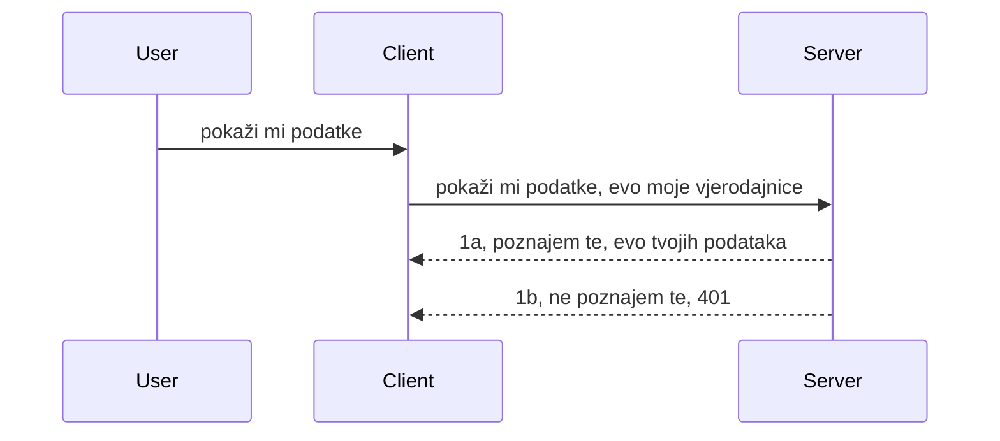

# Jednostavna autentikacija

MCP SDK-ovi podržavaju upotrebu OAuth 2.1 koji je, da budemo iskreni, prilično složen proces koji uključuje koncepte poput auth servera, resource servera, slanja vjerodajnica, dobivanja koda, zamjene koda za bearer token dok napokon ne dobijete podatke s resursa. Ako niste navikli na OAuth, što je sjajna stvar za implementirati, dobra je ideja početi s nekim osnovnim nivoom autentikacije i graditi prema boljoj i boljoj sigurnosti. Zato ovo poglavlje postoji, da vas vodi do naprednije autentikacije.

## Autentikacija, što pod time mislimo?

Autentikacija je skraćeno od authentication i authorization. Ideja je da trebamo napraviti dvije stvari:

- **Authentication** (autentikacija), što je proces utvrđivanja dopuštamo li osobi ulazak u naš dom, da li ima pravo biti "tu", tj. pristupiti našem resource serveru gdje se nalaze značajke našeg MCP Servera.
- **Authorization** (autorizacija), je proces utvrđivanja treba li korisniku omogućiti pristup ovim specifičnim resursima za koje traži pristup, na primjer tim narudžbama ili tim proizvodima ili je li mu dopušteno pročitati sadržaj ali ne i izbrisati kao drugi primjer.

## Vjerodajnice: kako sustavu govorimo tko smo

Pa, većina web programera najprije razmišlja u smislu davanja vjerodajnice serveru, obično tajne koja kaže jesu li dopušteni ovdje biti "Authentication". Ta vjerodajnica je obično base64 kodirana verzija korisničkog imena i lozinke ili API ključ koji jedinstveno identificira određenog korisnika.

To uključuje slanje putem zaglavlja nazvanog "Authorization" ovako:

```json
{ "Authorization": "secret123" }
```

Ovo se obično naziva osnovna autentikacija (basic authentication). Kako ukupni tok tada funkcionira je na sljedeći način:


Sad kad razumijemo kako to funkcionira s aspekta toka, kako to implementirati? Pa, većina web servera ima koncept zvan middleware, dio koda koji se pokreće kao dio zahtjeva i može provjeriti vjerodajnice, a ako su vjerodajnice važeće može dopustiti da zahtjev prođe. Ako zahtjev nema važeće vjerodajnice, dobijete auth error. Pogledajmo kako se to može implementirati:

**Python**

```python
class AuthMiddleware(BaseHTTPMiddleware):
    async def dispatch(self, request, call_next):

        has_header = request.headers.get("Authorization")
        if not has_header:
            print("-> Missing Authorization header!")
            return Response(status_code=401, content="Unauthorized")

        if not valid_token(has_header):
            print("-> Invalid token!")
            return Response(status_code=403, content="Forbidden")

        print("Valid token, proceeding...")
       
        response = await call_next(request)
        # dodajte bilo koje korisničke zaglavlja ili na neki način izmijenite odgovor
        return response


starlette_app.add_middleware(CustomHeaderMiddleware)
```

Ovdje imamo:

- Kreiran middleware nazvan `AuthMiddleware` gdje se njegova `dispatch` metoda poziva od strane web servera.
- Dodan middleware web serveru:

    ```python
    starlette_app.add_middleware(AuthMiddleware)
    ```

- Napisan logiku validacije koja provjerava postoji li Authorization zaglavlje i je li poslani tajni ključ valjan:

    ```python
    has_header = request.headers.get("Authorization")
    if not has_header:
        print("-> Missing Authorization header!")
        return Response(status_code=401, content="Unauthorized")

    if not valid_token(has_header):
        print("-> Invalid token!")
        return Response(status_code=403, content="Forbidden")
    ```

    ako je tajni ključ prisutan i valjan, dopuštamo zahtjevu da prođe pozivajući `call_next` i vratimo odgovor.

    ```python
    response = await call_next(request)
    # dodajte bilo koje korisničke zaglavlja ili na neki način promijenite odgovor
    return response
    ```

Kako to funkcionira jest da se u slučaju da web zahtjev pristigne serveru middleware poziva i s obzirom na njegovu implementaciju either dozvoljava prolaz zahtjevu ili vraća grešku koja pokazuje da klijent nema pravo nastaviti.

**TypeScript**

Ovdje stvaramo middleware s popularnim frameworkom Express i presrećemo zahtjev prije nego dođe do MCP Servera. Evo koda za to:

```typescript
function isValid(secret) {
    return secret === "secret123";
}

app.use((req, res, next) => {
    // 1. Je li zaglavlje autorizacije prisutno?
    if(!req.headers["Authorization"]) {
        res.status(401).send('Unauthorized');
    }
    
    let token = req.headers["Authorization"];

    // 2. Provjeri valjanost.
    if(!isValid(token)) {
        res.status(403).send('Forbidden');
    }

   
    console.log('Middleware executed');
    // 3. Prosljeđuje zahtjev na sljedeći korak u lancu zahtjeva.
    next();
});
```

U ovom kodu:

1. Provjeravamo postoji li prvo Authorization zaglavlje, ako ne postoji, šaljemo 401 grešku.
2. Provjeravamo je li vjerodajnica/token valjan, ako nije, šaljemo 403 grešku.
3. Na kraju prosljeđuje zahtjev kroz pipeline zahtjeva i vraća traženi resurs.

## Vježba: Implementirajte autentikaciju

Iskoristimo naše znanje i pokušajmo je implementirati. Evo plana:

Server

- Kreirati web server i MCP instancu.
- Implementirati middleware za server.

Klijent

- Slati web zahtjev, s vjerodajnicom, preko zaglavlja.

### -1- Kreirajte web server i MCP instancu

U prvom koraku trebamo kreirati instancu web servera i MCP Server.

**Python**

Ovdje kreiramo MCP server instancu, kreiramo starlette web aplikaciju i hostamo je s uvicornom.

```python
# kreiranje MCP servera

app = FastMCP(
    name="MCP Resource Server",
    instructions="Resource Server that validates tokens via Authorization Server introspection",
    host=settings["host"],
    port=settings["port"],
    debug=True
)

# kreiranje starlette web aplikacije
starlette_app = app.streamable_http_app()

# posluživanje aplikacije putem uvicorn-a
async def run(starlette_app):
    import uvicorn
    config = uvicorn.Config(
            starlette_app,
            host=app.settings.host,
            port=app.settings.port,
            log_level=app.settings.log_level.lower(),
        )
    server = uvicorn.Server(config)
    await server.serve()

run(starlette_app)
```

U ovom kodu:

- Kreiramo MCP Server.
- Konstrukcija starlette web aplikacije iz MCP Servera, `app.streamable_http_app()`.
- Hostamo i servisiramo web aplikaciju pomoću uvicorn `server.serve()`.

**TypeScript**

Ovdje stvaramo MCP Server instancu.

```typescript
const server = new McpServer({
      name: "example-server",
      version: "1.0.0"
    });

    // ... postavljanje resursa poslužitelja, alata i upita ...
```

Ova kreacija MCP Servera mora se dogoditi unutar naše definicije POST /mcp rute, stoga uzmimo gornji kod i premjestimo ga ovako:

```typescript
import express from "express";
import { randomUUID } from "node:crypto";
import { McpServer } from "@modelcontextprotocol/sdk/server/mcp.js";
import { StreamableHTTPServerTransport } from "@modelcontextprotocol/sdk/server/streamableHttp.js";
import { isInitializeRequest } from "@modelcontextprotocol/sdk/types.js"

const app = express();
app.use(express.json());

// Mapa za pohranu transporta po ID-u sesije
const transports: { [sessionId: string]: StreamableHTTPServerTransport } = {};

// Obradi POST zahtjeve za komunikaciju klijent-poslužitelj
app.post('/mcp', async (req, res) => {
  // Provjeri postoji li ID sesije
  const sessionId = req.headers['mcp-session-id'] as string | undefined;
  let transport: StreamableHTTPServerTransport;

  if (sessionId && transports[sessionId]) {
    // Ponovno koristi postojeći transport
    transport = transports[sessionId];
  } else if (!sessionId && isInitializeRequest(req.body)) {
    // Novi zahtjev za inicijalizaciju
    transport = new StreamableHTTPServerTransport({
      sessionIdGenerator: () => randomUUID(),
      onsessioninitialized: (sessionId) => {
        // Pohrani transport po ID-u sesije
        transports[sessionId] = transport;
      },
      // Zaštita od DNS ponovnog vezanja je prema zadanim postavkama onemogućena radi unazadne kompatibilnosti. Ako ovaj poslužitelj pokrećeš
      // lokalno, obavezno postavi:
      // enableDnsRebindingProtection: true,
      // allowedHosts: ['127.0.0.1'],
    });

    // Očisti transport kada se zatvori
    transport.onclose = () => {
      if (transport.sessionId) {
        delete transports[transport.sessionId];
      }
    };
    const server = new McpServer({
      name: "example-server",
      version: "1.0.0"
    });

    // ... postavi resurse poslužitelja, alate i upute ...

    // Spoji se na MCP poslužitelj
    await server.connect(transport);
  } else {
    // Neispravan zahtjev
    res.status(400).json({
      jsonrpc: '2.0',
      error: {
        code: -32000,
        message: 'Bad Request: No valid session ID provided',
      },
      id: null,
    });
    return;
  }

  // Obradi zahtjev
  await transport.handleRequest(req, res, req.body);
});

// Ponovno iskoristiv handler za GET i DELETE zahtjeve
const handleSessionRequest = async (req: express.Request, res: express.Response) => {
  const sessionId = req.headers['mcp-session-id'] as string | undefined;
  if (!sessionId || !transports[sessionId]) {
    res.status(400).send('Invalid or missing session ID');
    return;
  }
  
  const transport = transports[sessionId];
  await transport.handleRequest(req, res);
};

// Obradi GET zahtjeve za obavijesti poslužitelj-klijent putem SSE
app.get('/mcp', handleSessionRequest);

// Obradi DELETE zahtjeve za prekid sesije
app.delete('/mcp', handleSessionRequest);

app.listen(3000);
```

Sada vidite kako je kreacija MCP Servera premještena unutar `app.post("/mcp")`.

Nastavimo na sljedeći korak - kreiranje middlewarea za validaciju pristiglih vjerodajnica.

### -2- Implementirajte middleware za server

Sada idemo na dio middlewarea. Ovdje ćemo kreirati middleware koji traži vjerodajnicu u `Authorization` zaglavlju i validira ju. Ako je prihvatljiva, zahtjev nastavlja dalje raditi što treba (npr. listati alate, čitati resurs ili bilo koju MCP funkcionalnost koju klijent traži).

**Python**

Za kreiranje middlewarea, trebamo napraviti klasu koja nasljeđuje `BaseHTTPMiddleware`. Dvije su zanimljive stvari:

- Zahtjev `request`, iz kojeg čitamo info iz zaglavlja.
- `call_next`, callback koji trebamo pozvati ako klijent donese vjerodajnicu koju prihvaćamo.

Prvo, moramo obraditi slučaj ako `Authorization` zaglavlje nedostaje:

```python
has_header = request.headers.get("Authorization")

# nema zaglavlja, neuspjeh s 401, inače nastavi dalje.
if not has_header:
    print("-> Missing Authorization header!")
    return Response(status_code=401, content="Unauthorized")
```

Ovdje šaljemo poruku 401 unauthorized jer klijent nije prošao autentikaciju.

Zatim, ako je vjerodajnica poslata, trebamo provjeriti njenu valjanost ovako:

```python
 if not valid_token(has_header):
    print("-> Invalid token!")
    return Response(status_code=403, content="Forbidden")
```

Primijetite kako šaljemo poruku 403 forbidden. Pogledajmo potpuni middleware koji implementira sve gore navedeno:

```python
class AuthMiddleware(BaseHTTPMiddleware):
    async def dispatch(self, request, call_next):

        has_header = request.headers.get("Authorization")
        if not has_header:
            print("-> Missing Authorization header!")
            return Response(status_code=401, content="Unauthorized")

        if not valid_token(has_header):
            print("-> Invalid token!")
            return Response(status_code=403, content="Forbidden")

        print("Valid token, proceeding...")
        print(f"-> Received {request.method} {request.url}")
        response = await call_next(request)
        response.headers['Custom'] = 'Example'
        return response

```

Super, ali što je s funkcijom `valid_token`? Evo ju dolje:

```python
# NE koristite za produkciju - poboljšajte to !!
def valid_token(token: str) -> bool:
    # uklonite prefiks "Bearer "
    if token.startswith("Bearer "):
        token = token[7:]
        return token == "secret-token"
    return False
```

Ovo naravno treba unaprijediti.

VAŽNO: Nikada NE biste trebali imati tajne ovako hardkodirane u kodu. Idealno je da vrijednost za usporedbu dohvatite iz izvora podataka ili od IDP-a (identity service providera) ili još bolje, da validaciju obavlja sam IDP.

**TypeScript**

Za implementaciju s Expressom, trebamo pozvati metodu `use` koja prima middleware funkcije.

Trebamo:

- Interaktirati sa zahtjevom i provjeriti predane vjerodajnice u `Authorization` svojstvu.
- Validirati vjerodajnicu, i ako je valjana dopustiti nastavak zahtjeva da MCP klijent može raditi što treba (npr. listati alate, čitati resurse ili nešto drugo MCP povezano).

Ovdje provjeravamo postoji li `Authorization` zaglavlje i ako ne postoji, zaustavljamo zahtjev:

```typescript
if(!req.headers["authorization"]) {
    res.status(401).send('Unauthorized');
    return;
}
```

Ako nije poslano zaglavlje, dobijete 401.

Zatim provjeravamo je li vjerodajnica valjana, ako nije opet zaustavljamo zahtjev ali s malo drugačijom porukom:

```typescript
if(!isValid(token)) {
    res.status(403).send('Forbidden');
    return;
} 
```

Primijetite da sada dobijete 403 grešku.

Evo cijelog koda:

```typescript
app.use((req, res, next) => {
    console.log('Request received:', req.method, req.url, req.headers);
    console.log('Headers:', req.headers["authorization"]);
    if(!req.headers["authorization"]) {
        res.status(401).send('Unauthorized');
        return;
    }
    
    let token = req.headers["authorization"];

    if(!isValid(token)) {
        res.status(403).send('Forbidden');
        return;
    }  

    console.log('Middleware executed');
    next();
});
```

Postavili smo web server da prihvati middleware za provjeru vjerodajnice koju bi nam klijent trebao slati. A što s samim klijentom?

### -3- Pošaljite web zahtjev s vjerodajnicom preko zaglavlja

Moramo osigurati da klijent šalje vjerodajnicu kroz zaglavlje. Kako ćemo koristiti MCP klijenta, trebamo saznati kako se to radi.

**Python**

Za klijenta, potrebno je poslati zaglavlje s vjerodajnicom ovako:

```python
# NEMOJTE hardkodirati vrijednost, držite ju barem u varijabli okoline ili nekom sigurnijem skladištu
token = "secret-token"

async with streamablehttp_client(
        url = f"http://localhost:{port}/mcp",
        headers = {"Authorization": f"Bearer {token}"}
    ) as (
        read_stream,
        write_stream,
        session_callback,
    ):
        async with ClientSession(
            read_stream,
            write_stream
        ) as session:
            await session.initialize()
      
            # TODO, što želite da se napravi u klijentu, npr. popis alata, pozivanje alata itd.
```

Primijetite kako punimo `headers` property ovako `headers = {"Authorization": f"Bearer {token}"}`.

**TypeScript**

Ovo možemo riješiti u dva koraka:

1. Popuniti objekt konfiguracije našom vjerodajnicom.
2. Proslijediti konfiguracijski objekt transportu.

```typescript

// NEMOJ tvrdo kodirati vrijednost kao što je ovdje prikazano. Najmanje ju postavi kao varijablu okoline i koristi nešto poput dotenv (u razvojnom načinu).
let token = "secret123"

// definiraj objekt opcija za klijentski transport
let options: StreamableHTTPClientTransportOptions = {
  sessionId: sessionId,
  requestInit: {
    headers: {
      "Authorization": "secret123"
    }
  }
};

// proslijedi objekt opcija transportu
async function main() {
   const transport = new StreamableHTTPClientTransport(
      new URL(serverUrl),
      options
   );
```

Ovdje vidite kako smo morali kreirati `options` objekt i smjestiti naše zaglavlje pod `requestInit` property.

VAŽNO: Kako unaprijediti ovo dalje? Trenutna implementacija ima problema. Prvo, slanje vjerodajnice ovako je prilično rizično osim ako barem imate HTTPS. Čak i tada, vjerodajnica može biti ukradena, pa vam treba sustav gdje možete lako opozvati token i dodati dodatne provjere poput odakle na svijetu dolazi, događa li se zahtjev prečesto (ponašanje poput bota), ukratko, postoji čitav niz problema.

Međutim, treba reći, za vrlo jednostavne API-je gdje ne želite da netko koristi vaš API bez autentikacije, ovo je dobar početak.

S time rečeno, pokušajmo malo pojačati sigurnost koristeći standardizirani format poput JSON Web Tokena, poznatih kao JWT ili "JOT" tokeni.

## JSON Web Tokeni, JWT

Dakle, pokušavamo poboljšati stvari u odnosu na slanje vrlo jednostavnih vjerodajnica. Koje su neposredne prednosti usvajanja JWT-a?

- **Poboljšanja sigurnosti**. U basic auth šaljete korisničko ime i lozinku kao base64 kodirani token (ili API ključ) iznova i iznova što povećava rizik. Uz JWT šaljete korisničko ime i lozinku i dobivate token zauzvrat koji je vremenski ograničen i istječe. JWT omogućuje jednostavnu uporabu finog granularnog upravljanja pristupom koristeći uloge, scopeove i dozvole.
- **Bezustavnost i skalabilnost**. JWT-ovi su samodostatni, nose sve informacije o korisniku te eliminiraju potrebu pohrane sesije na serveru. Token se također može lokalno validirati.
- **Interoperabilnost i federacija**. JWT je srž Open ID Connecta i koristi se s poznatim pružateljima identiteta poput Entra ID, Google Identity i Auth0. Omogućuje i jedinstvenu prijavu (single sign on) i još mnogo toga što ga čini enterprise razinom.
- **Modularnost i fleksibilnost**. JWT se može koristiti i s API Gatewayima poput Azure API Management, NGINX i drugo. Također podržava scenarije autentikacije i komunikacije server-na-server uključujući impersonaciju i delegaciju.
- **Performanse i keširanje**. JWT-ovi se mogu keširati nakon dekodiranja što smanjuje potrebu za parsiranjem. Ovo pomaže posebno kod aplikacija s velikim prometom jer poboljšava protok i smanjuje opterećenje infrastrukture.
- **Napredne značajke**. Također podržava introspekciju (provjeru valjanosti na serveru) i opoziv (deaktivaciju tokena).

S obzirom na sve ove prednosti, pogledajmo kako možemo podići našu implementaciju na višu razinu.

## Pretvaranje osnovne autentikacije u JWT

Dakle, promjene koje trebamo napraviti na visokoj razini su:

- **Naučiti kako konstruirati JWT token** i pripremiti ga za slanje s klijenta na server.
- **Validirati JWT token** i ako je valjan, dati klijentu pristup resursima.
- **Sigurno spremanje tokena**. Kako spremamo ovaj token.
- **Zaštititi rute**. Trebamo zaštititi rute, u našem slučaju određene rute i specifične MCP značajke.
- **Dodati refresh tokene**. Osigurati da stvaramo tokene s kratkim trajanjem, ali i refresh tokene s dugim trajanjem koji se mogu koristiti za dohvat novih tokena ako isteknu. Također osigurati refresh endpoint i strategiju rotacije.

### -1- Konstruirajte JWT token

Prvo, JWT token ima sljedeće dijelove:

- **header**, algoritam koji se koristi i tip tokena.
- **payload**, tvrdnje (claims), poput sub (korisnik ili entitet koji token predstavlja, u auth scenariju obično korisnički ID), exp (vrijeme do kada vrijedi), role (uloga)
- **signature**, potpisano s tajnim ključem ili privatnim ključem.

Za ovo ćemo trebati konstruirati header, payload i kodirani token.

**Python**

```python

import jwt
import jwt
from jwt.exceptions import ExpiredSignatureError, InvalidTokenError
import datetime

# Tajni ključ koji se koristi za potpisivanje JWT-a
secret_key = 'your-secret-key'

header = {
    "alg": "HS256",
    "typ": "JWT"
}

# informacije o korisniku, njegove tvrdnje i vrijeme isteka
payload = {
    "sub": "1234567890",               # Subjekt (ID korisnika)
    "name": "User Userson",                # Prilagođena tvrdnja
    "admin": True,                     # Prilagođena tvrdnja
    "iat": datetime.datetime.utcnow(),# Vrijeme izdavanja
    "exp": datetime.datetime.utcnow() + datetime.timedelta(hours=1)  # Vrijeme isteka
}

# kodiraj to
encoded_jwt = jwt.encode(payload, secret_key, algorithm="HS256", headers=header)
```

U gornjem kodu:

- Definirali smo header koristeći HS256 kao algoritam i tip JWT.
- Konstrukcija payloada koji sadrži subject ili user id, korisničko ime, ulogu, kada je izdan i kada istječe, čime se implementira vremensko ograničenje o kojem smo ranije govorili.

**TypeScript**

Ovdje ćemo trebati neke ovisnosti koje će nam pomoći konstruirati JWT token.

Ovisnosti

```sh

npm install jsonwebtoken
npm install --save-dev @types/jsonwebtoken
```

Sad kad smo to postavili, kreirajmo header, payload i kroz to kreirajmo kodirani token.

```typescript
import jwt from 'jsonwebtoken';

const secretKey = 'your-secret-key'; // Koristite varijable okoline u produkciji

// Definirajte podatke tereta
const payload = {
  sub: '1234567890',
  name: 'User usersson',
  admin: true,
  iat: Math.floor(Date.now() / 1000), // Izdano u
  exp: Math.floor(Date.now() / 1000) + 60 * 60 // Istječe za 1 sat
};

// Definirajte zaglavlje (opcionalno, jsonwebtoken postavlja zadane vrijednosti)
const header = {
  alg: 'HS256',
  typ: 'JWT'
};

// Kreirajte token
const token = jwt.sign(payload, secretKey, {
  algorithm: 'HS256',
  header: header
});

console.log('JWT:', token);
```

Ovaj token je:

Potpisan pomoću HS256
Važi 1 sat
Uključuje tvrdnje kao sub, name, admin, iat i exp.

### -2- Validirajte token

Trebamo također validirati token, to je nešto što bismo trebali raditi na serverskoj strani kako bismo osigurali da je ono što nam klijent šalje doista valjano. Postoji mnogo provjera koje trebamo napraviti od validacije strukture do valjanosti. Također se potiče da dodate dodatne provjere da vidite postoji li korisnik u vašem sustavu i slično.

Za validaciju tokena, trebamo ga dekodirati da ga možemo pročitati i početi provjeravati valjanost:

**Python**

```python

# Dekodirajte i provjerite JWT
try:
    decoded = jwt.decode(token, secret_key, algorithms=["HS256"])
    print("✅ Token is valid.")
    print("Decoded claims:")
    for key, value in decoded.items():
        print(f"  {key}: {value}")
except ExpiredSignatureError:
    print("❌ Token has expired.")
except InvalidTokenError as e:
    print(f"❌ Invalid token: {e}")

```

U ovom kodu pozivamo `jwt.decode` koristeći token, tajni ključ i odabrani algoritam kao ulaz. Primijetite da koristimo try-catch konstrukciju jer neuspjela validacija vodi do podizanja greške.

**TypeScript**

Ovdje trebamo pozvati `jwt.verify` da dobijemo dekodiranu verziju tokena koju možemo dalje analizirati. Ako poziv ne uspije, to znači da je struktura tokena neispravna ili više nije valjan.

```typescript

try {
  const decoded = jwt.verify(token, secretKey);
  console.log('Decoded Payload:', decoded);
} catch (err) {
  console.error('Token verification failed:', err);
}
```

NAPOMENA: kao što je ranije spomenuto, trebali bismo napraviti dodatne provjere da se uvjerimo da token pokazuje na korisnika u našem sustavu i da koristi ima prava koje tvrdi da ima.

Sljedeće, pogledajmo u kontrolu pristupa temeljem uloga, poznatu kao RBAC.
## Dodavanje kontrole pristupa temeljene na ulozi

Ideja je da želimo izraziti da različite uloge imaju različite dozvole. Na primjer, pretpostavljamo da admin može sve, običan korisnik može čitati/pisati, a gost može samo čitati. Stoga, ovdje su neke moguće razine dozvola:

- Admin.Write 
- User.Read
- Guest.Read

Pogledajmo kako možemo implementirati takvu kontrolu putem middleware-a. Middleware može biti dodan po ruti kao i za sve rute.

**Python**

```python
from starlette.middleware.base import BaseHTTPMiddleware
from starlette.responses import JSONResponse
import jwt

# NEMOJ imati tajnu u kodu kao ovdje, ovo je samo za demonstracijske svrhe. Pročitaj je s sigurnog mjesta.
SECRET_KEY = "your-secret-key" # stavi ovo u env varijablu
REQUIRED_PERMISSION = "User.Read"

class JWTPermissionMiddleware(BaseHTTPMiddleware):
    async def dispatch(self, request, call_next):
        auth_header = request.headers.get("Authorization")
        if not auth_header or not auth_header.startswith("Bearer "):
            return JSONResponse({"error": "Missing or invalid Authorization header"}, status_code=401)

        token = auth_header.split(" ")[1]
        try:
            decoded = jwt.decode(token, SECRET_KEY, algorithms=["HS256"])
        except jwt.ExpiredSignatureError:
            return JSONResponse({"error": "Token expired"}, status_code=401)
        except jwt.InvalidTokenError:
            return JSONResponse({"error": "Invalid token"}, status_code=401)

        permissions = decoded.get("permissions", [])
        if REQUIRED_PERMISSION not in permissions:
            return JSONResponse({"error": "Permission denied"}, status_code=403)

        request.state.user = decoded
        return await call_next(request)


```

Postoji nekoliko različitih načina za dodavanje middleware-a kao dolje:

```python

# Alt 1: dodajte middleware prilikom kreiranja starlette aplikacije
middleware = [
    Middleware(JWTPermissionMiddleware)
]

app = Starlette(routes=routes, middleware=middleware)

# Alt 2: dodajte middleware nakon što je starlette aplikacija već kreirana
starlette_app.add_middleware(JWTPermissionMiddleware)

# Alt 3: dodajte middleware po ruti
routes = [
    Route(
        "/mcp",
        endpoint=..., # handler
        middleware=[Middleware(JWTPermissionMiddleware)]
    )
]
```

**TypeScript**

Možemo koristiti `app.use` i middleware koji će se izvršavati za sve zahtjeve.

```typescript
app.use((req, res, next) => {
    console.log('Request received:', req.method, req.url, req.headers);
    console.log('Headers:', req.headers["authorization"]);

    // 1. Provjerite je li zaglavlje autorizacije poslano

    if(!req.headers["authorization"]) {
        res.status(401).send('Unauthorized');
        return;
    }
    
    let token = req.headers["authorization"];

    // 2. Provjerite je li token valjan
    if(!isValid(token)) {
        res.status(403).send('Forbidden');
        return;
    }  

    // 3. Provjerite postoji li korisnik tokena u našem sustavu
    if(!isExistingUser(token)) {
        res.status(403).send('Forbidden');
        console.log("User does not exist");
        return;
    }
    console.log("User exists");

    // 4. Potvrdite ima li token ispravne dozvole
    if(!hasScopes(token, ["User.Read"])){
        res.status(403).send('Forbidden - insufficient scopes');
    }

    console.log("User has required scopes");

    console.log('Middleware executed');
    next();
});

```

Postoji dosta stvari koje naš middleware MOŽE, a TREBA raditi, naime:

1. Provjeriti je li prisutan authorization header
2. Provjeriti je li token valjan, pozivamo `isValid` što je metoda koju smo napisali za provjeru integriteta i valjanosti JWT tokena.
3. Provjeriti postoji li korisnik u našem sustavu, to bismo trebali napraviti.

   ```typescript
    // korisnici u bazi podataka
   const users = [
     "user1",
     "User usersson",
   ]

   function isExistingUser(token) {
     let decodedToken = verifyToken(token);

     // TODO, provjeriti postoji li korisnik u bazi podataka
     return users.includes(decodedToken?.name || "");
   }
   ```

   Gore smo stvorili vrlo jednostavnu listu `users`, koja bi naravno trebala biti u bazi podataka.

4. Dodatno, trebali bismo također provjeriti ima li token prave dozvole.

   ```typescript
   if(!hasScopes(token, ["User.Read"])){
        res.status(403).send('Forbidden - insufficient scopes');
   }
   ```

   U ovom kodu gore iz middleware-a, provjeravamo da token sadrži dozvolu User.Read, ako ne, šaljemo grešku 403. Dolje je pomoćna metoda `hasScopes`.

   ```typescript
   function hasScopes(scope: string, requiredScopes: string[]) {
     let decodedToken = verifyToken(scope);
    return requiredScopes.every(scope => decodedToken?.scopes.includes(scope));
  }
   ```

Have a think which additional checks you should be doing, but these are the absolute minimum of checks you should be doing.

Using Express as a web framework is a common choice. There are helpers library when you use JWT so you can write less code.

- `express-jwt`, helper library that provides a middleware that helps decode your token.
- `express-jwt-permissions`, this provides a middleware `guard` that helps check if a certain permission is on the token.

Here's what these libraries can look like when used:

```typescript
const express = require('express');
const jwt = require('express-jwt');
const guard = require('express-jwt-permissions')();

const app = express();
const secretKey = 'your-secret-key'; // put this in env variable

// Decode JWT and attach to req.user
app.use(jwt({ secret: secretKey, algorithms: ['HS256'] }));

// Check for User.Read permission
app.use(guard.check('User.Read'));

// multiple permissions
// app.use(guard.check(['User.Read', 'Admin.Access']));

app.get('/protected', (req, res) => {
  res.json({ message: `Welcome ${req.user.name}` });
});

// Error handler
app.use((err, req, res, next) => {
  if (err.code === 'permission_denied') {
    return res.status(403).send('Forbidden');
  }
  next(err);
});

```

Sada ste vidjeli kako middleware može biti korišten i za autentikaciju i za autorizaciju, a što je s MCP-om, mijenja li on način na koji radimo auth? Saznajmo u sljedećem odjeljku.

### -3- Dodavanje RBAC-a u MCP

Do sada ste vidjeli kako možete dodati RBAC putem middleware-a, međutim, za MCP ne postoji jednostavan način za dodavanje RBAC-a po pojedinoj značajci MCP-a, pa što napraviti? Pa, jednostavno moramo dodati kod poput ovoga koji provjerava u ovom slučaju ima li klijent pravo pozvati određeni alat:

Imate nekoliko različitih mogućnosti kako ostvariti RBAC po značajci, evo nekih:

- Dodajte provjeru za svaki alat, resurs, prompt gdje trebate provjeriti razinu dozvole.

   **python**

   ```python
   @tool()
   def delete_product(id: int):
      try:
          check_permissions(role="Admin.Write", request)
      catch:
        pass # klijent nije prošao autorizaciju, podignite grešku autorizacije
   ```

   **typescript**

   ```typescript
   server.registerTool(
    "delete-product",
    {
      title: Delete a product",
      description: "Deletes a product",
      inputSchema: { id: z.number() }
    },
    async ({ id }) => {
      
      try {
        checkPermissions("Admin.Write", request);
        // za napraviti, poslati id u productService i udaljeni unos
      } catch(Exception e) {
        console.log("Authorization error, you're not allowed");  
      }

      return {
        content: [{ type: "text", text: `Deletected product with id ${id}` }]
      };
    }
   );
   ```


- Koristite napredni server pristup i request handle-ere kako biste minimizirali koliko mjesta trebate provjeravati dozvole.

   **Python**

   ```python
   
   tool_permission = {
      "create_product": ["User.Write", "Admin.Write"],
      "delete_product": ["Admin.Write"]
   }

   def has_permission(user_permissions, required_permissions) -> bool:
      # user_permissions: popis dozvola koje korisnik ima
      # required_permissions: popis dozvola potrebnih za alat
      return any(perm in user_permissions for perm in required_permissions)

   @server.call_tool()
   async def handle_call_tool(
     name: str, arguments: dict[str, str] | None
   ) -> list[types.TextContent]:
    # Pretpostavi da je request.user.permissions popis dozvola za korisnika
     user_permissions = request.user.permissions
     required_permissions = tool_permission.get(name, [])
     if not has_permission(user_permissions, required_permissions):
        # Izbaci grešku "Nemate dozvolu za pozivanje alata {name}"
        raise Exception(f"You don't have permission to call tool {name}")
     # nastavi i pozovi alat
     # ...
   ```   
   

   **TypeScript**

   ```typescript
   function hasPermission(userPermissions: string[], requiredPermissions: string[]): boolean {
       if (!Array.isArray(userPermissions) || !Array.isArray(requiredPermissions)) return false;
       // Vrati istinu ako korisnik ima barem jednu potrebnu dozvolu
       
       return requiredPermissions.some(perm => userPermissions.includes(perm));
   }
  
   server.setRequestHandler(CallToolRequestSchema, async (request) => {
      const { params: { name } } = request;
  
      let permissions = request.user.permissions;
  
      if (!hasPermission(permissions, toolPermissions[name])) {
         return new Error(`You don't have permission to call ${name}`);
      }
  
      // nastavi..
   });
   ```

   Napomena, morate osigurati da vaš middleware dodijeli dekodirani token na user property u zahtjevu tako da je kod gore pojednostavljen.

### Zaključno

Sada kada smo razgovarali o tome kako dodati podršku za RBAC općenito, a posebice za MCP, vrijeme je da pokušate sami implementirati sigurnost kako biste bili sigurni da ste shvatili predstavljene koncepte.

## Zadatak 1: Izgradite MCP server i MCP klijent koristeći osnovnu autentikaciju

Ovdje ćete primijeniti ono što ste naučili o slanju vjerodajnica putem headera.

## Rješenje 1

[Rješenje 1](./code/basic/README.md)

## Zadatak 2: Nadogradite rješenje iz Zadatka 1 za korištenje JWT-a

Uzmite prvo rješenje, ali ovaj put ga unaprijedimo.

Umjesto Basic Auth koristite JWT.

## Rješenje 2

[Rješenje 2](./solution/jwt-solution/README.md)

## Izazov

Dodajte RBAC po alatu koji smo opisali u odjeljku "Dodavanje RBAC-a u MCP".

## Sažetak

Nadamo se da ste naučili mnogo u ovom poglavlju, od potpune odsutnosti sigurnosti, preko osnovne sigurnosti, do JWT-a i kako ga se može dodati u MCP.

Izgradili smo čvrst temelj s prilagođenim JWT-ovima, ali kako rastemo, usmjeravamo se prema modelu identiteta temeljenom na standardima. Usvajanje IdP-a poput Entra ili Keycloak omogućuje nam da izdavanje, provjeru i upravljanje životnim ciklusom tokena prepustimo pouzdanoj platformi — oslobađajući nas da se fokusiramo na logiku aplikacije i korisničko iskustvo.

Za to imamo naprednije [poglavlje o Entri](../../05-AdvancedTopics/mcp-security-entra/README.md)

## Što slijedi

- Sljedeće: [Postavljanje MCP Hostova](../12-mcp-hosts/README.md)

---

<!-- CO-OP TRANSLATOR DISCLAIMER START -->
**Odricanje od odgovornosti**:  
Ovaj dokument preveden je korištenjem AI usluge za prevođenje [Co-op Translator](https://github.com/Azure/co-op-translator). Iako nastojimo biti točni, imajte na umu da automatski prijevodi mogu sadržavati pogreške ili netočnosti. Izvorni dokument na njegovom izvornom jeziku treba smatrati autoritativnim izvorom. Za ključne informacije preporučuje se profesionalni ljudski prijevod. Ne snosimo odgovornost za bilo kakva nesporazuma ili pogrešna tumačenja proizašla iz korištenja ovog prijevoda.
<!-- CO-OP TRANSLATOR DISCLAIMER END -->