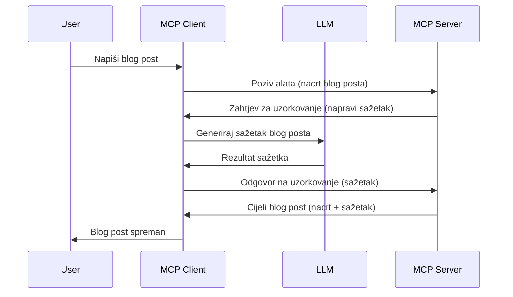

# Uzimanje uzorka - delegiranje značajki Klijentu

Ponekad je potrebno da MCP Klijent i MCP Poslužitelj surađuju kako bi postigli zajednički cilj. Možda imate situaciju u kojoj poslužitelj zahtijeva pomoć LLM-a koji se nalazi na klijentu. Za ovu situaciju, uzimanje uzorka je ono što biste trebali koristiti.

Istražimo neke slučajeve upotrebe i kako izgraditi rješenje koje uključuje uzimanje uzorka.

## Pregled

U ovoj lekciji fokusiramo se na objašnjenje kada i gdje koristiti uzimanje uzorka i kako ga konfigurirati.

## Ciljevi učenja

U ovom poglavlju ćemo:

- Objasniti što je uzimanje uzorka i kada ga koristiti.
- Pokazati kako konfigurirati uzimanje uzorka u MCP-u.
- Pružiti primjere uzimanja uzorka u praksi.

## Što je uzimanje uzorka i zašto ga koristiti?

Uzimanje uzorka je napredna značajka koja funkcionira na sljedeći način:


### Zahtjev za uzimanje uzorka

Ok, sada imamo pregled scenarija na velikoj razini, razgovarajmo o zahtjevu za uzimanje uzorka koji poslužitelj šalje natrag klijentu. Evo kako takav zahtjev može izgledati u JSON-RPC formatu:

```json
{
  "jsonrpc": "2.0",
  "id": 1,
  "method": "sampling/createMessage",
  "params": {
    "messages": [
      {
        "role": "user",
        "content": {
          "type": "text",
          "text": "Create a blog post summary of the following blog post: <BLOG POST>"
        }
      }
    ],
    "modelPreferences": {
      "hints": [
        {
          "name": "claude-3-sonnet"
        }
      ],
      "intelligencePriority": 0.8,
      "speedPriority": 0.5
    },
    "systemPrompt": "You are a helpful assistant.",
    "maxTokens": 100
  }
}
```

Ovdje je nekoliko stvari vrijednih isticanja:

- Prompt, pod content -> text, je naš prompt koji je uputa LLM-u da sažme sadržaj blog posta.

- **modelPreferences**. Ovaj odjeljak je upravo to, preferencija, preporuka o kojoj konfiguraciji koristiti s LLM-om. Korisnik može odlučiti želi li slijediti ove preporuke ili ih promijeniti. U ovom slučaju postoje preporuke o modelu koji treba koristiti te prioritetu brzine i inteligencije.
- **systemPrompt**, ovo je vaš uobičajeni sustavni prompt koji daje LLM-u osobnost i sadrži upute za vođenje.
- **maxTokens**, ovo je još jedno svojstvo koje se koristi da kaže koliko tokena se preporučuje koristiti za ovaj zadatak.

### Odgovor na uzimanje uzorka

Ovaj odgovor je ono što MCP Klijent na kraju šalje natrag MCP Poslužitelju i rezultat je poziva LLM-a od strane klijenta, čekanja tog odgovora te konstruiranja ove poruke. Evo kako to može izgledati u JSON-RPC:

```json
{
  "jsonrpc": "2.0",
  "id": 1,
  "result": {
    "role": "assistant",
    "content": {
      "type": "text",
      "text": "Here's your abstract <ABSTRACT>"
    },
    "model": "gpt-5",
    "stopReason": "endTurn"
  }
}
```

Primijetite kako je odgovor sažetak blog posta upravo kao što smo tražili. Također primijetite kako korišteni `model` nije onaj koji smo tražili već "gpt-5" umjesto "claude-3-sonnet". Ovo ilustrira da korisnik može promijeniti mišljenje o tome što koristiti i da je vaš zahtjev za uzimanje uzorka samo preporuka.

Ok, sada kada razumijemo glavni tijek i koristan zadatak za korištenje "kreiranje blog posta + sažetak", pogledajmo što trebamo učiniti da bi to funkcioniralo.

### Tipovi poruka

Poruke za uzimanje uzorka nisu ograničene samo na tekst, nego možete slati i slike i zvuk. Evo kako JSON-RPC izgleda drugačije:

**Tekst**

```json
{
  "type": "text",
  "text": "The message content"
}
```

**Sadržaj slike**

```json
{
  "type": "image",
  "data": "base64-encoded-image-data",
  "mimeType": "image/jpeg"
}
```

**Sadržaj zvuka**

```json
{
  "type": "audio",
  "data": "base64-encoded-audio-data",
  "mimeType": "audio/wav"
}
```

> NAPOMENA: za detaljnije informacije o uzimanju uzorka, pogledajte [službenu dokumentaciju](https://modelcontextprotocol.io/specification/2025-06-18/client/sampling)

## Kako konfigurirati uzimanje uzorka u Klijentu

> Napomena: ako samo gradite poslužitelj, ovdje ne trebate puno raditi.

U klijentu trebate specificirati sljedeću značajku ovako:

```json
{
  "capabilities": {
    "sampling": {}
  }
}
```

Ona će zatim biti preuzeta kada se vaš odabrani klijent inicijalizira s poslužiteljem.

## Primjer uzimanja uzorka u praksi - Kreiranje blog posta

Kreirajmo zajedno sampling poslužitelj, moramo učiniti sljedeće:

1. Kreirati alat na Poslužitelju.
1. Taj alat treba kreirati zahtjev za uzimanje uzorka.
1. Alat treba čekati da zahtjev za uzimanje uzorka klijenta bude odgovor.
1. Zatim treba proizvesti rezultat alata.

Pogledajmo kod korak po korak:

### -1- Kreiraj alat

**python**

```python
@mcp.tool()
async def create_blog(title: str, content: str, ctx: Context[ServerSession, None]) -> str:
    """Create a blog post and generate a summary"""

```

### -2- Kreiraj zahtjev za uzimanje uzorka

Proširite svoj alat sljedećim kodom:

**python**

```python
post = BlogPost(
        id=len(posts) + 1,
        title=title,
        content=content,
        abstract=""
    )

prompt = f"Create an abstract of the following blog post: title: {title} and draft: {content} "

result = await ctx.session.create_message(
        messages=[
            SamplingMessage(
                role="user",
                content=TextContent(type="text", text=prompt),
            )
        ],
        max_tokens=100,
)

```

### -3- Čekaj odgovor i vrati odgovor

**python**

```python
post.abstract = result.content.text

posts.append(post)

# vrati kompletan proizvod
return json.dumps({
    "id": post.title,
    "abstract": post.abstract
})
```

### -4- Cijeli kod

**python**

```python
from starlette.applications import Starlette
from starlette.routing import Mount, Host

from mcp.server.fastmcp import Context, FastMCP

from mcp.server.session import ServerSession
from mcp.types import SamplingMessage, TextContent

import json


from uuid import uuid4
from typing import List
from pydantic import BaseModel


mcp = FastMCP("Blog post generator")

# app = FastAPI()

posts = []

class BlogPost(BaseModel):
    id: int
    title: str
    content: str
    abstract: str

posts: List[BlogPost] = []

@mcp.tool()
async def create_blog(title: str, content: str, ctx: Context[ServerSession, None]) -> str:
    """Create a blog post and generate a summary"""

    post = BlogPost(
        id=len(posts) + 1,
        title=title,
        content=content,
        abstract=""
    )

    prompt = f"Create an abstract of the following blog post: title: {title} and draft: {content} "

    result = await ctx.session.create_message(
        messages=[
            SamplingMessage(
                role="user",
                content=TextContent(type="text", text=prompt),
            )
        ],
        max_tokens=100,
    )

    post.abstract = result.content.text

    posts.append(post)

    # vrati kompletan blog post
    return json.dumps({
        "id": post.title,
        "abstract": post.abstract
    })

if __name__ == "__main__":
    print("Starting server...")
    # mcp.run()
    mcp.run(transport="streamable-http")

# pokreni aplikaciju sa: python server.py
```

### -5- Testiranje u Visual Studio Code

Da biste ovo testirali u Visual Studio Code-u, učinite sljedeće:

1. Pokrenite poslužitelj u terminalu
1. Dodajte ga u *mcp.json* (i osigurajte da je pokrenut), nešto poput:

   ```json
   "servers": {
      "blog-server": {
        "type": "http",
        "url": "http://localhost:8000/mcp"
      }
   }
   ```

1. Unesite prompt:

   ```text
   create a blog post named "Where Python comes from", the content is "Python is actually named after Monty Python Flying Circus"
   ```

1. Dopustite uzimanje uzorka. Prvi put kad ovo testirate, bit će vam prikazan dodatni dijalog koji morate prihvatiti, zatim ćete vidjeti uobičajeni dijalog da pokrenete alat.

1. Pregledajte rezultate. Vidjet ćete rezultate lijepo prikazane u GitHub Copilot Chatu, ali također možete pregledati sirovi JSON odgovor.

**Bonus**. Visual Studio Code alat ima izvrsnu podršku za uzimanje uzorka. Možete konfigurirati pristup uzimanju uzorka na vašem instaliranom poslužitelju tako što ćete:

1. Navigirati do sekcije ekstenzija.
1. Odabrati ikonu zupčanika za vaš instalirani poslužitelj u odjeljku "MCP SERVERS - INSTALLED".
1. Odabrati "Configure Model Access", ovdje možete odabrati koje modele GitHub Copilot smije koristiti prilikom uzimanja uzorka. Također možete vidjeti sve nedavne zahtjeve za uzimanje uzorka odabirom "Show Sampling requests".

## Zadatak

U ovom zadatku izgradit ćete malo drugačije uzimanje uzorka, odnosno integraciju uzimanja uzorka koja podržava generiranje opisa proizvoda. Evo vašeg scenarija:

**Scenarij**: Radnik u back officeu e-trgovine treba pomoć jer generiranje opisa proizvoda traje previše vremena. Stoga trebate izgraditi rješenje gdje možete pozvati alat "create_product" s argumentima "title" i "keywords", te alat treba proizvesti kompletan proizvod uključujući polje "description" koje treba popuniti LLM klijenta.

SAVJET: iskoristite ono što ste ranije naučili za konstrukciju ovog poslužitelja i njegovog alata koristeći zahtjev za uzimanje uzorka.

## Rješenje

[Rješenje](./solution/README.md)

## Ključni zaključci

Uzimanje uzorka je moćna značajka koja omogućuje poslužitelju da delegira zadatke klijentu kada mu treba pomoć LLM-a.

## Što slijedi

- [Poglavlje 4 - Praktična implementacija](../../04-PracticalImplementation/README.md)

---

<!-- CO-OP TRANSLATOR DISCLAIMER START -->
**Odricanje od odgovornosti**:
Ovaj dokument je preveden pomoću AI usluge prevođenja [Co-op Translator](https://github.com/Azure/co-op-translator). Iako težimo točnosti, molimo imajte na umu da automatizirani prijevodi mogu sadržavati pogreške ili netočnosti. Izvorni dokument na njegovom izvornom jeziku treba se smatrati autoritativnim izvorom. Za kritične informacije preporučuje se profesionalni ljudski prijevod. Ne snosimo odgovornost za bilo kakve nesporazume ili kriva tumačenja koja proizlaze iz upotrebe ovog prijevoda.
<!-- CO-OP TRANSLATOR DISCLAIMER END -->