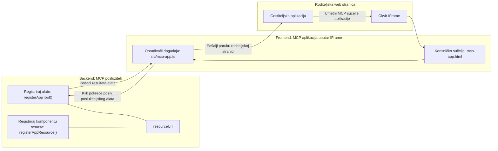

# MCP aplikacije

MCP aplikacije predstavljaju novi paradigma u MCP-u. Ideja je da ne samo što odgovarate s podacima iz poziva alata, već i pružate informacije o tome kako se s tim informacijama treba interaktivno rukovati. To znači da rezultati alata sada mogu sadržavati informacije o korisničkom sučelju. Zašto bismo to željeli? Pa, razmislite kako stvari radite danas. Vjerojatno koristite rezultate MCP poslužitelja tako da ispred njega postavite neki oblik frontend-a, što je kod koji trebate napisati i održavati. Ponekad je to ono što želite, ali ponekad bi bilo sjajno ako biste mogli samo donijeti komadić informacije koji je samostalan i ima sve, od podataka do korisničkog sučelja.

## Pregled

Ova lekcija pruža praktične smjernice o MCP aplikacijama, kako započeti s njima i kako ih integrirati u vaše postojeće web aplikacije. MCP aplikacije su vrlo nov dodatak MCP standardu.

## Ciljevi učenja

Do kraja ove lekcije moći ćete:

- Objasniti što su MCP aplikacije.
- Kada koristiti MCP aplikacije.
- Izraditi i integrirati vlastite MCP aplikacije.

## MCP aplikacije - kako to funkcionira

Ideja MCP aplikacija je pružiti odgovor koji je u biti komponenta za prikazivanje. Takva komponenta može imati i vizualni i interaktivni dio, npr. klikove na tipke, unos korisnika i slično. Počnimo sa serverskom stranom i našim MCP poslužiteljem. Da biste stvorili MCP App komponentu, morate napraviti alat, ali i aplikacijski resurs. Ova dva dijela povezana su putem resourceUri.

Evo primjera. Pokušajmo vizualizirati što je uključeno i koje dijelove što radi:

```text
server.ts -- responsible for registering tools and the component as a UI component
src/
  mcp-app.ts -- wiring up event handlers
mcp-app.html -- the user interface
```

Ova vizualizacija opisuje arhitekturu za stvaranje komponente i njezine logike.


Pokušajmo sada opisati odgovornosti za backend i frontend respektivno.

### Backend

Ovdje trebamo ostvariti dvije stvari:

- Registrirati alate s kojima želimo komunicirati.
- Definirati komponentu.

**Registracija alata**

```typescript
registerAppTool(
    server,
    "get-time",
    {
      title: "Get Time",
      description: "Returns the current server time.",
      inputSchema: {},
      _meta: { ui: { resourceUri } }, // Povezuje ovaj alat s njegovim UI resursom
    },
    async () => {
      const time = new Date().toISOString();
      return { content: [{ type: "text", text: time }] };
    },
  );

```

Prethodni kod opisuje ponašanje, gdje izlaže alat naziva `get-time`. Ne prima ulaze, ali proizvodi trenutno vrijeme. Imamo mogućnost definirati `inputSchema` za alate kod kojih moramo primati unos korisnika.

**Registracija komponente**

U istoj datoteci trebamo također registrirati komponentu:

```typescript
const resourceUri = "ui://get-time/mcp-app.html";

// Registrirajte resurs, koji vraća ugrađeni HTML/JavaScript za korisničko sučelje.
registerAppResource(
  server,
  resourceUri,
  resourceUri,
  { mimeType: RESOURCE_MIME_TYPE },
  async () => {
    const html = await fs.readFile(path.join(DIST_DIR, "mcp-app.html"), "utf-8");

    return {
    contents: [
        { uri: resourceUri, mimeType: RESOURCE_MIME_TYPE, text: html },
    ],
    };
  },
);
```

Primijetite kako spominjemo `resourceUri` da povežemo komponentu s njezinim alatima. Zanimljiv je i callback u kojem učitavamo UI datoteku i vraćamo komponentu.

### Frontend komponente

Kao i na backendu, i ovdje postoje dva dijela:

- Frontend napisan u čistom HTML-u.
- Kod koji obrađuje događaje i što napraviti, npr. pozivati alate ili slati poruke roditeljskom prozoru.

**Korisničko sučelje**

Pogledajmo korisničko sučelje.

```html
<!-- mcp-app.html -->
<!DOCTYPE html>
<html lang="en">
  <head>
    <meta charset="UTF-8" />
    <title>Get Time App</title>
  </head>
  <body>
    <p>
      <strong>Server Time:</strong> <code id="server-time">Loading...</code>
    </p>
    <button id="get-time-btn">Get Server Time</button>
    <script type="module" src="/src/mcp-app.ts"></script>
  </body>
</html>
```

**Povezivanje događaja**

Posljednji dio je povezivanje događaja. To znači da identificiramo koji dio našeg UI treba event handlere i što raditi kada se događaji jave:

```typescript
// mcp-app.ts

import { App } from "@modelcontextprotocol/ext-apps";

// Dohvati reference elemenata
const serverTimeEl = document.getElementById("server-time")!;
const getTimeBtn = document.getElementById("get-time-btn")!;

// Kreiraj instancu aplikacije
const app = new App({ name: "Get Time App", version: "1.0.0" });

// Obradi rezultate alata sa servera. Postavi prije `app.connect()` da bi izbjegao
// propuštanje početnog rezultata alata.
app.ontoolresult = (result) => {
  const time = result.content?.find((c) => c.type === "text")?.text;
  serverTimeEl.textContent = time ?? "[ERROR]";
};

// Poveži klik gumba
getTimeBtn.addEventListener("click", async () => {
  // `app.callServerTool()` omogućuje korisničkom sučelju da zatraži svježe podatke sa servera
  const result = await app.callServerTool({ name: "get-time", arguments: {} });
  const time = result.content?.find((c) => c.type === "text")?.text;
  serverTimeEl.textContent = time ?? "[ERROR]";
});

// Spoji se na host
app.connect();
```

Kao što vidite iz gore navedenog, ovo je uobičajeni kod za povezivanje DOM elemenata s događajima. Vrijedi istaknuti poziv `callServerTool` koji poziva alat na backendu.

## Rukovanje unosom korisnika

Do sada smo vidjeli komponentu koja ima gumb koji, kad se klikne, poziva alat. Pogledajmo možemo li dodati još UI elemenata poput polja za unos i vidjeti možemo li poslati argumente alatu. Implementirajmo funkcionalnost FAQ-a. Evo kako bi to trebalo funkcionirati:

- Trebao bi postojati gumb i element unosa gdje korisnik upisuje ključnu riječ za pretraživanje, na primjer "Shipping" (Dostava). To bi trebalo pozvati alat na backendu koji pretražuje podatke FAQ-a.
- Alat koji podržava navedenu FAQ pretragu.

Najprije dodajmo potrebnu podršku na backend:

```typescript
const faq: { [key: string]: string } = {
    "shipping": "Our standard shipping time is 3-5 business days.",
    "return policy": "You can return any item within 30 days of purchase.",
    "warranty": "All products come with a 1-year warranty covering manufacturing defects.",
  }

registerAppTool(
    server,
    "get-faq",
    {
      title: "Search FAQ",
      description: "Searches the FAQ for relevant answers.",
      inputSchema: zod.object({
        query: zod.string().default("shipping"),
      }),
      _meta: { ui: { resourceUri: faqResourceUri } }, // Povezuje ovaj alat s njegovim UI resursom
    },
    async ({ query }) => {
      const answer: string = faq[query.toLowerCase()] || "Sorry, I don't have an answer for that.";
      return { content: [{ type: "text", text: answer }] };
    },
  );
```

Ono što ovdje vidimo jest kako popunjavamo `inputSchema` i dajemo mu `zod` shemu ovako:

```typescript
inputSchema: zod.object({
  query: zod.string().default("shipping"),
})
```

U gornjoj shemi deklariramo da imamo ulazni parametar naziva `query` koji je opcionalan s zadanim vrijednostima "shipping".

Dobro, prijeđimo sada na *mcp-app.html* da vidimo koje UI trebamo napraviti za ovo:

```html
<div class="faq">
    <h1>FAQ response</h1>
    <p>FAQ Response: <code id="faq-response">Loading...</code></p>
    <input type="text" id="faq-query" placeholder="Enter FAQ query" />
    <button id="get-faq-btn">Get FAQ Response</button>
  </div>
```

Super, sada imamo element unosa i gumb. Idemo dalje na *mcp-app.ts* kako bismo povezali ove događaje:

```typescript
const getFaqBtn = document.getElementById("get-faq-btn")!;
const faqQueryInput = document.getElementById("faq-query") as HTMLInputElement;

getFaqBtn.addEventListener("click", async () => {
  const query = faqQueryInput.value;
  const result = await app.callServerTool({ name: "get-faq", arguments: { query } });
  const faq = result.content?.find((c) => c.type === "text")?.text;
  faqResponseEl.textContent = faq ?? "[ERROR]";
});
```

U gornjem kodu:

- Kreiramo reference na interaktivne UI elemente.
- Obradjujemo klik na gumb kako bismo dohvatili vrijednost iz unosa, te također pozivamo `app.callServerTool()` s `name` i `arguments`, pri čemu zadnji prosljeđuje `query` kao vrijednost.

Što se zapravo događa kada pozovete `callServerTool` jest da se šalje poruka roditeljskom prozoru, a taj prozor na kraju poziva MCP poslužitelj.

### Isprobajte

Isprobavajući ovo trebali bismo vidjeti sljedeće:


a ovdje ga isprobavamo s unosom poput "warranty" (jamstvo)


Za pokretanje ovog koda, pogledajte [Odjeljak s kodom](./code/README.md)

## Testiranje u Visual Studio Code

Visual Studio Code ima izvrsnu podršku za MCP aplikacije i vjerojatno je jedan od najjednostavnijih načina za testiranje vaših MCP aplikacija. Da biste koristili Visual Studio Code, dodajte zapis poslužitelja u *mcp.json* ovako:

```json
"my-mcp-server-7178eca7": {
    "url": "http://localhost:3001/mcp",
    "type": "http"
  }
```

Zatim pokrenite poslužitelj, trebali biste moći komunicirati s vašom MCP aplikacijom preko prozora za chat, pod uvjetom da imate instaliran GitHub Copilot.

Možete ga aktivirati putem prompta, primjerice "#get-faq":


i kao što ste ga pokrenuli kroz web preglednik, prikazuje se na isti način ovako:


## Zadatak

Napravite igru kamen, papir, škare. Trebala bi imati sljedeće:

UI:

- padajući popis s opcijama
- gumb za potvrdu izbora
- oznaku koja prikazuje tko je što odabrao i tko je pobijedio

Server:

- trebao bi imati alat za kamen, papir, škare koji prima "choice" (izbor) kao ulaz. Također treba izabrati izbor računala i odrediti pobjednika

## Rješenje

[Rješenje](./assignment/README.md)

## Sažetak

Naučili smo o ovom novom paradigmu MCP aplikacija. To je novi način koji omogućuje MCP poslužiteljima da imaju stav ne samo o podacima, nego i o načinu na koji se ti podaci prikazuju.

Također smo naučili da se MCP aplikacije hostaju u okviru (IFrame) i da za komunikaciju s MCP poslužiteljima moraju slati poruke roditeljskoj web aplikaciji. Postoji nekoliko biblioteka dostupnih za čisti JavaScript, React i druge, što olakšava tu komunikaciju.

## Ključni zaključci

Evo što ste naučili:

- MCP aplikacije su novi standard koji može biti koristan kada želite isporučiti i podatke i značajke korisničkog sučelja.
- Ove aplikacije rade u IFrame-u iz sigurnosnih razloga.

## Što slijedi

- [Poglavlje 4](../../04-PracticalImplementation/README.md)

---

<!-- CO-OP TRANSLATOR DISCLAIMER START -->
**Odricanje od odgovornosti**:
Ovaj dokument je preveden korištenjem AI usluge za prijevod [Co-op Translator](https://github.com/Azure/co-op-translator). Iako nastojimo postići točnost, imajte na umu da automatski prijevodi mogu sadržavati pogreške ili netočnosti. Izvorni dokument na izvornom jeziku treba smatrati autoritativnim izvorom. Za kritične informacije preporučuje se profesionalni ljudski prijevod. Nismo odgovorni za bilo kakva nesporazuma ili pogrešna tumačenja koja proizlaze iz korištenja ovog prijevoda.
<!-- CO-OP TRANSLATOR DISCLAIMER END -->