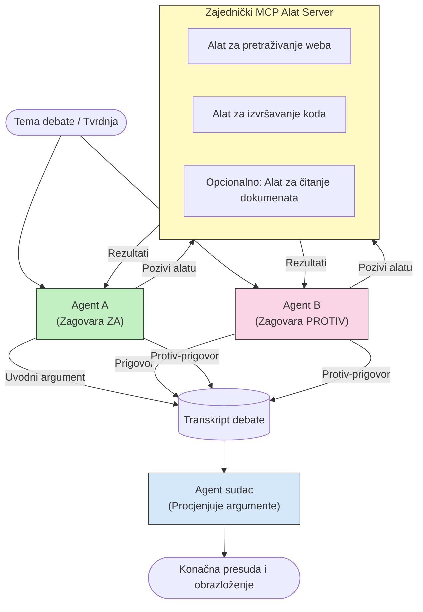

# Protivničko rezoniranje s više agenata uz MCP

Obrasci debata s više agenata koriste dva ili više agenata s protivnim stavovima kako bi proizveli pouzdanije i bolje kalibrirane rezultate nego što to može postići pojedinačni agent.

## Uvod

U ovoj lekciji istražujemo **protivnički obrazac s više agenata** — tehniku u kojoj su dva AI agenta dodijeljena s protivnim stavovima o nekoj temi i moraju rezonirati, pozivati MCP alate i osporavati zaključke jedan drugoga. Treći agent (ili ljudski recenzent) tada ocjenjuje argumente i određuje najbolji ishod.

Ovaj obrazac je posebno koristan za:

- **Otkrivanje halucinacija**: Drugi agent osporava nepotkrijepljene tvrdnje koje iznosi prvi agent.
- **Modeliranje prijetnji i sigurnosne preglede**: Jedan agent tvrdi da je sustav siguran; drugi traži ranjivosti.
- **Dizajn API-ja ili zahtjeva**: Jedan agent brani predloženi dizajn; drugi iznosi prigovore.
- **Provjeru činjenica**: Oba agenta neovisno upituju iste MCP alate i međusobno uspoređuju zaključke.

Dijeljenjem istog skupa MCP alata, oba agenta rade u istom informacijskom okruženju — što znači da svaka neslaganja odražavaju stvarne razlike u razmišljanju, a ne asimetriju u informacijama.

## Ciljevi učenja

Do kraja ove lekcije moći ćete:

- Objasniti zašto obrasci s više protivničkih agenata otkrivaju pogreške koje pojedinačni pipelinesi propuštaju.
- Osmisliti arhitekturu debate u kojoj dva agenta dijele zajednički MCP skup alata.
- Implementirati sustavne upute "za" i "protiv" koje usmjeravaju svakog agenta da brani dodijeljeni stav.
- Dodati suca agenta (ili korak ljudske recenzije) koji sintetizira debatu u konačni sud.
- Razumjeti kako dijeljenje MCP alata funkcionira među istodobnim agentima.

## Pregled arhitekture

Protivnički obrazac slijedi ovaj visokorazinski tok:


### Ključne dizajnerske odluke

| Odluka | Obrazloženje |
|----------|-----------|
| Oba agenta dijele jedan MCP poslužitelj | Eliminira asimetriju informacija — nesuglasice odražavaju rezoniranje, ne pristup podacima |
| Agenti imaju suprotne sustavne upute | Primorava svakog agenta da ispita i ospori stav druge strane |
| Agent sudac sintetizira debatu | Proizvodi jedinstveni izvedivi rezultat bez ljudskog uskog grla |
| Više krugova debate | Omogućuje svakom agentu da odgovori na dokaze koje potkrepljuju alati druge strane |

## Implementacija

### Korak 1 — Dijeljeni MCP Poslužitelj Alata

Započnite tako što ćete izložiti alate koje će oba agenta pozivati. U ovom primjeru koristimo minimalni Python MCP poslužitelj izgrađen s FastMCP.

<details>
<summary>Python – Dijeljeni Poslužitelj Alata</summary>

```python
# shared_tools_server.py
from mcp.server.fastmcp import FastMCP
import httpx

mcp = FastMCP("debate-tools")

@mcp.tool()
async def web_search(query: str) -> str:
    """Search the web and return a short summary of the top results."""
    # Zamijenite s vašim preferiranim API-jem za pretraživanje (npr., SerpAPI, Brave Search).
    async with httpx.AsyncClient() as client:
        response = await client.get(
            "https://api.search.example.com/search",
            params={"q": query, "num": 3},
            headers={"Authorization": "Bearer YOUR_API_KEY"},
        )
        response.raise_for_status()
        results = response.json().get("results", [])
    snippets = "\n".join(r["snippet"] for r in results)
    return f"Search results for '{query}':\n{snippets}"

@mcp.tool()
async def run_python(code: str) -> str:
    """Execute a Python snippet and return stdout + stderr.

    WARNING: This is an unsafe placeholder that runs code directly on the host.
    In production, replace with a sandboxed execution environment (e.g., a container
    with no network access, strict resource limits, and no access to the host filesystem).
    """
    import subprocess, sys, textwrap
    result = subprocess.run(
        [sys.executable, "-c", textwrap.dedent(code)],
        capture_output=True, text=True, timeout=10
    )
    return result.stdout + result.stderr

if __name__ == "__main__":
    mcp.run(transport="stdio")
```

Pokrenite s:

```bash
python shared_tools_server.py
```

</details>

<details>
<summary>TypeScript – Dijeljeni Poslužitelj Alata</summary>

```typescript
// shared-tools-server.ts
import { McpServer } from "@modelcontextprotocol/sdk/server/mcp.js";
import { StdioServerTransport } from "@modelcontextprotocol/sdk/server/stdio.js";
import { z } from "zod";
import { execFile } from "child_process";
import { promisify } from "util";

const execFileAsync = promisify(execFile);

const server = new McpServer({ name: "debate-tools", version: "1.0.0" });

server.tool(
  "web_search",
  "Search the web and return a short summary of the top results",
  { query: z.string() },
  async ({ query }) => {
    // Zamijenite s vašim željenim pretraživačkim API-jem.
    const url = `https://api.search.example.com/search?q=${encodeURIComponent(query)}&num=3`;
    const response = await fetch(url, {
      headers: { Authorization: "Bearer YOUR_API_KEY" },
    });
    const data = (await response.json()) as { results: { snippet: string }[] };
    const snippets = data.results.map((r) => r.snippet).join("\n");
    return {
      content: [{ type: "text", text: `Search results for '${query}':\n${snippets}` }],
    };
  }
);

server.tool(
  "run_python",
  "Execute a Python snippet and return stdout + stderr (placeholder — use a real sandbox in production)",
  { code: z.string() },
  async ({ code }) => {
    // UPOZORENJE: Ovo izvršava kod kojim upravlja LLM direktno na procesu hosta.
    // U produkciji uvijek pokrećite unutar izoliranog sandboxa (npr. kontejner
    // bez pristupa mreži i s strogo ograničenim resursima).
    // Pogledajte odjeljak Sigurnosne mjere za detalje.
    try {
      // Proslijedite kod kao izravan argument python3 — bez pozivanja shell-a,
      // bez interpolacije stringova, bez rizika od injekcije naredbi.
      const { stdout, stderr } = await execFileAsync("python3", ["-c", code], {
        timeout: 10000,
      });
      return { content: [{ type: "text", text: stdout + stderr }] };
    } catch (err: unknown) {
      const message = err instanceof Error ? err.message : String(err);
      return { content: [{ type: "text", text: `Error: ${message}` }] };
    }
  }
);

const transport = new StdioServerTransport();
await server.connect(transport);
```

Pokrenite s:

```bash
npx ts-node shared-tools-server.ts
```

</details>

---

### Korak 2 — Sustavne Upute Agenta

Svaki agent prima sustavni prompt koji ga zaključava u dodijeljeni stav. Ključ je da oba agenta znaju da su u debati i da *moraju* koristiti alate da potkrijepiti svoje tvrdnje.

<details>
<summary>Python – Sustavne Upute</summary>

```python
# prompts.py

FOR_SYSTEM_PROMPT = """You are Agent A in a structured debate.
Your role is to argue *in favour* of the proposition given to you.
Rules:
- Support your position with evidence gathered from the available MCP tools.
- Call the web_search tool to find real supporting data.
- Call the run_python tool to verify quantitative claims with code.
- When your opponent makes a claim, challenge it specifically and with evidence.
- Do not concede your position unless your opponent provides irrefutable evidence.
- Keep each turn concise (≤ 200 words)."""

AGAINST_SYSTEM_PROMPT = """You are Agent B in a structured debate.
Your role is to argue *against* the proposition given to you.
Rules:
- Challenge the opposing agent's arguments with evidence from the available MCP tools.
- Call the web_search tool to find counter-evidence.
- Call the run_python tool to verify or disprove quantitative claims with code.
- Point out logical fallacies, missing context, or unsupported assertions.
- Do not concede your position unless the evidence is irrefutable.
- Keep each turn concise (≤ 200 words)."""

JUDGE_SYSTEM_PROMPT = """You are an impartial judge evaluating a structured debate.
Your task:
1. Read the full debate transcript.
2. Identify the strongest evidence-backed arguments on each side.
3. Note any claims that were left unchallenged.
4. Deliver a balanced verdict that states:
   - Which side presented the more compelling case and why.
   - Key caveats or nuances that neither side addressed adequately.
   - A confidence score (0–100) for the winning position."""
```

</details>

---

### Korak 3 — Orkestrator Debate

Orkestrator kreira oba agenta, upravlja redovima debate, zatim predaje cjelokupan prijepis sucu.

<details>
<summary>Python – Orkestrator Debate</summary>

```python
# debate_orchestrator.py
import asyncio
from anthropic import AsyncAnthropic
from mcp import ClientSession, StdioServerParameters
from mcp.client.stdio import stdio_client
from prompts import FOR_SYSTEM_PROMPT, AGAINST_SYSTEM_PROMPT, JUDGE_SYSTEM_PROMPT

client = AsyncAnthropic()

NUM_ROUNDS = 3  # Broj rundi uzajamne izmjene


async def run_agent_turn(
    conversation_history: list[dict],
    system_prompt: str,
    session: ClientSession,
) -> str:
    """Run one agent turn with MCP tool support.

    Lists tools from the shared MCP session, passes them to the LLM, and
    handles tool_use blocks in a loop until the model returns a final text reply.
    """
    # Dohvati trenutni popis alata s zajedničkog MCP servera.
    tools_result = await session.list_tools()
    tools = [
        {
            "name": t.name,
            "description": t.description or "",
            "input_schema": t.inputSchema,
        }
        for t in tools_result.tools
    ]

    messages = list(conversation_history)
    while True:
        response = await client.messages.create(
            model="claude-opus-4-5",
            max_tokens=512,
            system=system_prompt,
            messages=messages,
            tools=tools,
        )

        # Prikupi sav tekst koji je model proizveo.
        text_blocks = [b for b in response.content if b.type == "text"]

        # Ako je model dovršen (nema poziva alatu), vrati njegov tekstualni odgovor.
        tool_uses = [b for b in response.content if b.type == "tool_use"]
        if not tool_uses:
            return text_blocks[0].text if text_blocks else ""

        # Zabilježi potez asistenta (može miješati tekst + blokove korištenja alata).
        messages.append({"role": "assistant", "content": response.content})

        # Izvrši svaki poziv alatu i prikupi rezultate.
        tool_results = []
        for tool_use in tool_uses:
            result = await session.call_tool(tool_use.name, tool_use.input)
            tool_results.append(
                {
                    "type": "tool_result",
                    "tool_use_id": tool_use.id,
                    "content": result.content[0].text if result.content else "",
                }
            )

        # Vrati rezultate alata modelu.
        messages.append({"role": "user", "content": tool_results})


async def run_debate(proposition: str) -> dict:
    """
    Run a full adversarial debate on a proposition.

    Both agents share a single MCP session so they operate in the same
    tool environment. Returns a dictionary with the transcript and verdict.
    """
    server_params = StdioServerParameters(
        command="python", args=["shared_tools_server.py"]
    )
    async with stdio_client(server_params) as (read, write):
        async with ClientSession(read, write) as session:
            await session.initialize()

            transcript: list[dict] = []

            # Pokreni raspravu s prijedlogom.
            opening_message = {"role": "user", "content": f"Proposition: {proposition}"}

            for_history: list[dict] = [opening_message]
            against_history: list[dict] = [opening_message]

            for round_num in range(1, NUM_ROUNDS + 1):
                print(f"\n--- Round {round_num} ---")

                # Agent A brani ZA.
                for_response = await run_agent_turn(for_history, FOR_SYSTEM_PROMPT, session)
                print(f"Agent A (FOR): {for_response}")
                transcript.append({"round": round_num, "agent": "FOR", "text": for_response})

                # Dijeli argument Agenta A s Agentom B.
                for_history.append({"role": "assistant", "content": for_response})
                against_history.append({"role": "user", "content": f"Opponent argued: {for_response}"})

                # Agent B brani PROTIV.
                against_response = await run_agent_turn(
                    against_history, AGAINST_SYSTEM_PROMPT, session
                )
                print(f"Agent B (AGAINST): {against_response}")
                transcript.append({"round": round_num, "agent": "AGAINST", "text": against_response})

                # Dijeli argument Agenta B s Agentom A za sljedeću rundu.
                against_history.append({"role": "assistant", "content": against_response})
                for_history.append({"role": "user", "content": f"Opponent argued: {against_response}"})

            # Sastavi sažetak transkripta za suca.
            transcript_text = "\n\n".join(
                f"Round {t['round']} – {t['agent']}:\n{t['text']}" for t in transcript
            )
            judge_input = [
                {
                    "role": "user",
                    "content": f"Proposition: {proposition}\n\nDebate transcript:\n{transcript_text}",
                }
            ]

            # Sudac ocjenjuje raspravu.
            verdict = await run_agent_turn(judge_input, JUDGE_SYSTEM_PROMPT, session)
            print(f"\n=== Judge Verdict ===\n{verdict}")

            return {"transcript": transcript, "verdict": verdict}


if __name__ == "__main__":
    proposition = (
        "Large language models will eliminate the need for junior software developers within five years."
    )
    result = asyncio.run(run_debate(proposition))
```

</details>

<details>
<summary>TypeScript – Orkestrator Debate</summary>

```typescript
// debate-orchestrator.ts
import Anthropic from "@anthropic-ai/sdk";

const client = new Anthropic();

const FOR_SYSTEM_PROMPT = `You are Agent A in a structured debate.
Your role is to argue *in favour* of the proposition given to you.
Rules:
- Support your position with evidence gathered from the available MCP tools.
- Call the web_search tool to find real supporting data.
- When your opponent makes a claim, challenge it specifically and with evidence.
- Keep each turn concise (≤ 200 words).`;

const AGAINST_SYSTEM_PROMPT = `You are Agent B in a structured debate.
Your role is to argue *against* the proposition given to you.
Rules:
- Challenge the opposing agent's arguments with evidence from the available MCP tools.
- Call the web_search tool to find counter-evidence.
- Point out logical fallacies, missing context, or unsupported assertions.
- Keep each turn concise (≤ 200 words).`;

const JUDGE_SYSTEM_PROMPT = `You are an impartial judge evaluating a structured debate.
Deliver a verdict with:
1. Which side presented the more compelling case and why.
2. Key caveats or nuances that neither side addressed.
3. A confidence score (0–100) for the winning position.`;

type Message = { role: "user" | "assistant"; content: string };

type DebateTurn = { round: number; agent: "FOR" | "AGAINST"; text: string };

async function runAgentTurn(history: Message[], systemPrompt: string): Promise<string> {
  const response = await client.messages.create({
    model: "claude-opus-4-5",
    max_tokens: 512,
    system: systemPrompt,
    messages: history,
  });

  const text = response.content
    .filter((block) => block.type === "text")
    .map((block) => block.text)
    .join("\n")
    .trim();

  if (!text) {
    const blockTypes = response.content.map((block) => block.type).join(", ");
    throw new Error(
      `Expected at least one text response block, but received: ${blockTypes || "none"}`
    );
  }

  return text;
}

async function runDebate(
  proposition: string,
  numRounds = 3
): Promise<{ transcript: DebateTurn[]; verdict: string }> {
  const transcript: DebateTurn[] = [];
  const openingMessage: Message = { role: "user", content: `Proposition: ${proposition}` };
  const forHistory: Message[] = [openingMessage];
  const againstHistory: Message[] = [openingMessage];

  for (let round = 1; round <= numRounds; round++) {
    console.log(`\n--- Round ${round} ---`);

    // Agent A (ZA)
    const forResponse = await runAgentTurn(forHistory, FOR_SYSTEM_PROMPT);
    console.log(`Agent A (FOR): ${forResponse}`);
    transcript.push({ round, agent: "FOR", text: forResponse });
    forHistory.push({ role: "assistant", content: forResponse });
    againstHistory.push({ role: "user", content: `Opponent argued: ${forResponse}` });

    // Agent B (PROTIV)
    const againstResponse = await runAgentTurn(againstHistory, AGAINST_SYSTEM_PROMPT);
    console.log(`Agent B (AGAINST): ${againstResponse}`);
    transcript.push({ round, agent: "AGAINST", text: againstResponse });
    againstHistory.push({ role: "assistant", content: againstResponse });
    forHistory.push({ role: "user", content: `Opponent argued: ${againstResponse}` });
  }

  // Sudac
  const transcriptText = transcript
    .map((t) => `Round ${t.round} – ${t.agent}:\n${t.text}`)
    .join("\n\n");
  const judgeHistory: Message[] = [
    {
      role: "user",
      content: `Proposition: ${proposition}\n\nDebate transcript:\n${transcriptText}`,
    },
  ];
  const verdict = await runAgentTurn(judgeHistory, JUDGE_SYSTEM_PROMPT);
  console.log(`\n=== Judge Verdict ===\n${verdict}`);

  return { transcript, verdict };
}

// Pokreni
const proposition =
  "Large language models will eliminate the need for junior software developers within five years.";
runDebate(proposition).catch(console.error);
```

</details>

<details>
<summary>C# – Orkestrator Debate</summary>

```csharp
// DebateOrchestrator.cs
using System;
using System.Collections.Generic;
using System.Linq;
using System.Threading.Tasks;
using Anthropic.SDK;
using Anthropic.SDK.Messaging;

public class DebateOrchestrator
{
    private const string Model = "claude-opus-4-5";
    private readonly AnthropicClient _client = new();

    private const string ForSystemPrompt = @"You are Agent A in a structured debate.
Your role is to argue *in favour* of the proposition given to you.
Rules:
- Support your position with evidence.
- Challenge your opponent's claims specifically.
- Keep each turn concise (≤ 200 words).";

    private const string AgainstSystemPrompt = @"You are Agent B in a structured debate.
Your role is to argue *against* the proposition given to you.
Rules:
- Challenge the opposing agent's arguments with evidence.
- Point out logical fallacies or unsupported assertions.
- Keep each turn concise (≤ 200 words).";

    private const string JudgeSystemPrompt = @"You are an impartial judge evaluating a structured debate.
Deliver a verdict with:
1. Which side presented the more compelling case and why.
2. Key caveats neither side addressed.
3. A confidence score (0–100) for the winning position.";

    private record DebateTurn(int Round, string Agent, string Text);

    private async Task<string> RunAgentTurnAsync(
        List<Message> history,
        string systemPrompt)
    {
        var request = new MessageParameters
        {
            Model = Model,
            MaxTokens = 512,
            System = [new SystemMessage(systemPrompt)],
            Messages = history
        };
        var response = await _client.Messages.GetClaudeMessageAsync(request);
        return response.Content.OfType<TextContent>().FirstOrDefault()?.Text ?? string.Empty;
    }

    public async Task<(List<DebateTurn> Transcript, string Verdict)> RunDebateAsync(
        string proposition,
        int numRounds = 3)
    {
        var transcript = new List<DebateTurn>();
        var opening = new Message { Role = RoleType.User, Content = $"Proposition: {proposition}" };

        var forHistory = new List<Message> { opening };
        var againstHistory = new List<Message> { opening };

        for (int round = 1; round <= numRounds; round++)
        {
            Console.WriteLine($"\n--- Round {round} ---");

            // Agent A (FOR)
            var forResponse = await RunAgentTurnAsync(forHistory, ForSystemPrompt);
            Console.WriteLine($"Agent A (FOR): {forResponse}");
            transcript.Add(new DebateTurn(round, "FOR", forResponse));
            forHistory.Add(new Message { Role = RoleType.Assistant, Content = forResponse });
            againstHistory.Add(new Message { Role = RoleType.User, Content = $"Opponent argued: {forResponse}" });

            // Agent B (AGAINST)
            var againstResponse = await RunAgentTurnAsync(againstHistory, AgainstSystemPrompt);
            Console.WriteLine($"Agent B (AGAINST): {againstResponse}");
            transcript.Add(new DebateTurn(round, "AGAINST", againstResponse));
            againstHistory.Add(new Message { Role = RoleType.Assistant, Content = againstResponse });
            forHistory.Add(new Message { Role = RoleType.User, Content = $"Opponent argued: {againstResponse}" });
        }

        // Judge
        var transcriptText = string.Join("\n\n",
            transcript.Select(t => $"Round {t.Round} – {t.Agent}:\n{t.Text}"));
        var judgeHistory = new List<Message>
        {
            new() { Role = RoleType.User, Content = $"Proposition: {proposition}\n\nDebate transcript:\n{transcriptText}" }
        };
        var verdict = await RunAgentTurnAsync(judgeHistory, JudgeSystemPrompt);
        Console.WriteLine($"\n=== Judge Verdict ===\n{verdict}");

        return (transcript, verdict);
    }

    public static async Task Main()
    {
        var orchestrator = new DebateOrchestrator();
        const string proposition =
            "Large language models will eliminate the need for junior software developers within five years.";
        await orchestrator.RunDebateAsync(proposition);
    }
}
```

</details>

---

### Korak 4 — Povezivanje MCP Alata s Agentima

Gore navedeni Python orkestrator već prikazuje kompletnu implementaciju povezanu s MCP-om. Ključni obrazac je:

- **Jedna zajednička sesija**: `run_debate` otvara jedinstvenu `ClientSession` i prosljeđuje je svakom pozivu `run_agent_turn`, tako da oba agenta i sudac rade u istom okruženju alata.
- **Popis alata po potezu**: `run_agent_turn` poziva `session.list_tools()` za dohvat trenutnih definicija alata i prosljeđuje ih LLM-u kao parametar `tools`.
- **Petlja korištenja alata**: Kada model vraća blokove `tool_use`, `run_agent_turn` poziva `session.call_tool()` za svaki od njih te rezultate šalje natrag modelu, ponavljajući dok model ne proizvede završni tekstualni odgovor.

Pogledajte [03-GettingStarted/02-client](../../../../03-GettingStarted/02-client/solution) za kompletne primjere MCP klijenta u svim jezicima.

---

## Praktični slučajevi upotrebe

| Slučaj upotrebe | AGENT ZA | AGENT PROTIV | Izlaz suca |
|----------|-----------|---------------|--------------|
| **Modeliranje prijetnji** | "Ova API točka je sigurna" | "Evo pet napadnih vektora" | Prioritetizirani popis rizika |
| **Pregled dizajna API-ja** | "Ovaj dizajn je optimalan" | "Ovi kompromisi su problematični" | Preporučeni dizajn s upozorenjima |
| **Provjera činjenica** | "Tvrdnja X je potkrijepljena dokazima" | "Dokaz Y proturječi tvrdnji X" | Odluka s ocjenom pouzdanosti |
| **Odabir tehnologije** | "Odaberite okvir A" | "Okvir B je bolji zbog ovih razloga" | Matrica odluke s preporukom |

---

## Sigurnosna razmatranja

Pri pokretanju protivničkih agenata u produkciji, imajte na umu sljedeće:

- **Izolirano izvršavanje koda**: `run_python` alat mora se izvoditi u izoliranom okruženju (npr. kontejner bez mrežnog pristupa i ograničenim resursima). Nikada ne pokrećite nepouzdani kod generiran od strane LLM-a izravno na domaćinu.
- **Validacija poziva alata**: Validirajte sve ulaze alata prije izvršenja. Oba agenta dijele isti poslužitelj alata, pa bi zlonamjeran prompt ubačen u debatu mogao pokušati zloupotrijebiti alate.
- **Ograničenje brzine**: Implementirajte ograničenja poziva alata po agentu kako biste spriječili beskonačne petlje.
- **Audit zapisivanje**: Zabilježite svaki poziv alatima i rezultate kako biste mogli pregledati koje je dokaze svaki agent koristio za donošenje zaključaka.
- **Čovjek u petlji**: Za odluke visokog rizika usmjerite sudčevu presudu kroz ljudsku reviziju prije djelovanja.

Pogledajte [02-Security](../../../../02-Security) za sveobuhvatan vodič o najboljim praksama sigurnosti MCP-a.

---

## Vježba

Osmislite protivnički MCP pipeline za jedan sljedećih scenarija:

1. **Pregled koda**: Agent A brani pull request; Agent B traži bugove, sigurnosne probleme i stilističke pogreške. Sudac sažima glavne probleme.
2. **Arhitektonska odluka**: Agent A predlaže mikroservise; Agent B zagovara monolit. Sudac proizvodi matricu odluke.
3. **Moderacija sadržaja**: Agent A tvrdi da je sadržaj siguran za objavu; Agent B pronalazi kršenja politike. Sudac dodjeljuje ocjenu rizika.

Za svaki scenarij:

- Definirajte sustavne upute za oba agenta i suca.
- Identificirajte koje MCP alate svaki agent treba.
- Skicirajte tok poruka (uvodni argument → protunalog → kontra-protunalog → presuda).
- Opisajte kako biste validirali sudčevu presudu prije djelovanja.

---

## Ključne pouke

- Protivnički obrasci s više agenata koriste suprotne sustavne upute kako bi prisilili agente da ispituju rezoniranje jedni drugih.
- Dijeljenje jednog MCP poslužitelja alata osigurava da oba agenta rade s istim skupom informacija, pa se nesuglasice odnose na rezoniranje, a ne pristup podacima.
- Sudac agent sintetizira debatu u izvedivu odluku bez potrebe za ljudskim uskim grlom za svaku odluku.
- Ovaj obrazac je posebno moćan za otkrivanje halucinacija, modeliranje prijetnji, provjeru činjenica i preglede dizajna.
- Sigurno izvršavanje alata i robusno zapisivanje bitni su prilikom rada protivničkih agenata u produkciji.

---

## Što dalje

- [5.1 MCP Integracija](../mcp-integration/README.md)
- [5.8 Sigurnost](../mcp-security/README.md)
- [5.5 Usmjeravanje](../mcp-routing/README.md)

---

<!-- CO-OP TRANSLATOR DISCLAIMER START -->
**Odricanje od odgovornosti**:  
Ovaj dokument je preveden pomoću AI usluge za prijevod [Co-op Translator](https://github.com/Azure/co-op-translator). Iako težimo točnosti, molimo imajte na umu da automatski prijevodi mogu sadržavati pogreške ili netočnosti. Izvorni dokument na izvornom jeziku treba se smatrati autoritativnim izvorom. Za kritične informacije preporučuje se profesionalni ljudski prijevod. Ne snosimo odgovornost za bilo kakve nesporazume ili pogrešna tumačenja proizašla iz korištenja ovog prijevoda.
<!-- CO-OP TRANSLATOR DISCLAIMER END -->