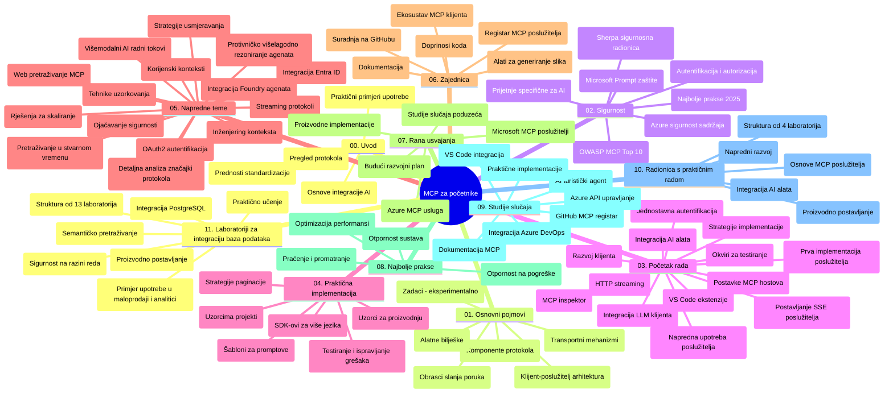

# Protokol konteksta modela (MCP) za početnike - Vodič za učenje

Ovaj vodič za učenje pruža pregled strukture i sadržaja repozitorija za kurikulum "Protokol konteksta modela (MCP) za početnike". Koristite ovaj vodič za učinkovitu navigaciju repozitorijem i najbolje iskorištavanje dostupnih resursa.

## Pregled repozitorija

Protokol konteksta modela (MCP) je standardizirani okvir za interakcije između AI modela i klijentskih aplikacija. Izvorno ga je stvorio Anthropic, a MCP sada održava šira MCP zajednica putem službene GitHub organizacije. Ovaj repozitorij pruža sveobuhvatan kurikulum s praktičnim primjerima koda u C#, Javi, JavaScriptu, Pythonu i TypeScriptu, namijenjen AI programerima, sistemskim arhitektima i softverskim inženjerima.

## Vizualna karta kurikuluma

## Struktura repozitorija

Repozitorij je organiziran u jedanaest glavnih odjeljaka, od kojih se svaki fokusira na različite aspekte MCP-a:

1. **Uvod (00-Introduction/)**
   - Pregled protokola konteksta modela
   - Zašto je standardizacija važna u AI procesima
   - Praktični primjeri upotrebe i prednosti

2. **Osnovni koncepti (01-CoreConcepts/)**
   - Klijent-poslužitelj arhitektura
   - Ključne komponente protokola
   - Obrasci poruka u MCP-u

3. **Sigurnost (02-Security/)**
   - Sigurnosni prijetnje u sustavima baziranim na MCP-u
   - Najbolje prakse za sigurno implementiranje
   - Strategije autentikacije i autorizacije
   - **Sveobuhvatna dokumentacija o sigurnosti**:
     - MCP Sigurnosne najbolje prakse 2025
     - Vodič za implementaciju Azure Content Safety
     - MCP sigurnosne kontrole i tehnike
     - Brzi pregled MCP najboljih praksi
   - **Ključne sigurnosne teme**:
     - Napadi ubrizgavanja prompta i trovanja alata
     - Otimačina sesije i problem zbunjenog zastupnika
     - Ranljivosti pri prosljeđivanju tokena
     - Pretjerane dozvole i kontrola pristupa
     - Sigurnost opskrbnog lanca za AI komponente
     - Integracija Microsoft Prompt Shields

4. **Početak rada (03-GettingStarted/)**
   - Postavljanje i konfiguracija okruženja
   - Kreiranje osnovnih MCP poslužitelja i klijenata
   - Integracija s postojećim aplikacijama
   - Uključuje odjeljke za:
     - Prvu implementaciju poslužitelja
     - Razvoj klijenta
     - Integraciju LLM klijenta
     - Integraciju u VS Code
     - Server-Sent Events (SSE) poslužitelj
     - Naprednu uporabu poslužitelja
     - HTTP streamanje
     - Integraciju AI Toolkit-a
     - Strategije testiranja
     - Smjernice za distribuciju

5. **Praktična implementacija (04-PracticalImplementation/)**
   - Korištenje SDK-ova u različitim programskim jezicima
   - Tehnike otklanjanja pogrešaka, testiranja i validacije
   - Izrada ponovnih predložaka prompta i tijekova rada
   - Primjeri projekata s implementacijama

6. **Napredne teme (05-AdvancedTopics/)**
   - Tehnike inženjeringa konteksta
   - Integracija Foundry agenata
   - Multi-modalni AI tijekovi rada
   - Demonstracije OAuth2 autentikacije
   - Mogućnosti pretraživanja u stvarnom vremenu
   - Streamanje u stvarnom vremenu
   - Implementacija root konteksta
   - Strategije usmjeravanja
   - Tehnike uzorkovanja
   - Pristupi skaliranju
   - Sigurnosna razmatranja
   - Integracija sigurnosti Entra ID-a
   - Integracija web pretraživanja
   - Adversarialni multi-agentni rezonacijski obrasci (debata)

7. **Doprinosi zajednice (06-CommunityContributions/)**
   - Kako doprinijeti kodu i dokumentaciji
   - Suradnja putem GitHuba
   - Unapređenja i povratne informacije vođene zajednicom
   - Korištenje različitih MCP klijenata (Claude Desktop, Cline, VSCode)
   - Rad s popularnim MCP poslužiteljima uključujući generiranje slika

8. **Lekcije iz ranih usvajanja (07-LessonsfromEarlyAdoption/)**
   - Implementacije u stvarnom svijetu i uspješne priče
   - Izgradnja i implementacija rješenja baziranih na MCP-u
   - Trendovi i buduća mapa puta
   - **Vodič za Microsoft MCP poslužitelje**: Sveobuhvatan vodič za 10 Microsoft MCP poslužitelja spremnih za produkciju uključujući:
     - Microsoft Learn Docs MCP Server
     - Azure MCP Server (15+ specijaliziranih konektora)
     - GitHub MCP Server
     - Azure DevOps MCP Server
     - MarkItDown MCP Server
     - SQL Server MCP Server
     - Playwright MCP Server
     - Dev Box MCP Server
     - Azure AI Foundry MCP Server
     - Microsoft 365 Agents Toolkit MCP Server

9. **Najbolje prakse (08-BestPractices/)**
   - Dorada performansi i optimizacija
   - Projektiranje otpornog MCP sustava
   - Strategije testiranja i otpornosti

10. **Studije slučaja (09-CaseStudy/)**
    - **Sedam sveobuhvatnih studija slučaja** koje demonstriraju svestranost MCP-a u različitim scenarijima:
    - **Azure AI Travel Agents**: Multi-agentna orkestracija s Azure OpenAI i AI Search
    - **Azure DevOps integracija**: Automatizacija procesa s YouTube podacima
    - **Preuzimanje dokumenata u stvarnom vremenu**: Python konzolni klijent s HTTP streamanjem
    - **Interaktivni generator plana učenja**: Chainlit web aplikacija s konverzacijskim AI-jem
    - **Dokumentacija u uređivaču**: Integracija VS Code-a s GitHub Copilot tijekovima rada
    - **Azure API upravljanje**: Integracija poduzeća API-ja s kreacijom MCP poslužitelja
    - **GitHub MCP registar**: Razvijanje ekosustava i platforma za agentsku integraciju
    - Implementacijski primjeri koji uključuju poduzećnu integraciju, produktivnost programera i razvoj ekosustava

11. **Praktična radionica (10-StreamliningAIWorkflowsBuildingAnMCPServerWithAIToolkit/)**
    - Sveobuhvatna praktična radionica koja kombinira MCP s AI Toolkit-om
    - Izgradnja inteligentnih aplikacija koje povezuju AI modele sa stvarnim alatima
    - Praktični moduli koji pokrivaju osnove, prilagođeni razvoj poslužitelja i strategije produkcijske distribucije
    - **Struktura laboratorija**:
      - Laboratorij 1: Osnove MCP poslužitelja
      - Laboratorij 2: Napredni razvoj MCP poslužitelja
      - Laboratorij 3: Integracija AI Toolkit-a
      - Laboratorij 4: Produkcijska distribucija i skaliranje
    - Pristup učenju temeljen na laboratorijima sa uputama korak po korak

12. **MCP poslužiteljski laboratoriji za integraciju baza podataka (11-MCPServerHandsOnLabs/)**
    - **Sveobuhvatan program od 13 laboratorija** za izgradnju produkcijski spremnih MCP poslužitelja s integracijom PostgreSQL-a
    - **Implementacija analitike maloprodaje u stvarnom svijetu** koristeći slučaj Zava Retail
    - **Obrasci za poduzeća** uključujući sigurnost na razini reda (RLS), semantičko pretraživanje i višekorisnički pristup podacima
    - **Potpuna struktura laboratorija**:
      - **Laboratoriji 00-03: Osnove** - Uvod, arhitektura, sigurnost, postavljanje okruženja
      - **Laboratoriji 04-06: Izgradnja MCP poslužitelja** - Dizajn baze podataka, implementacija MCP poslužitelja, razvoj alata
      - **Laboratoriji 07-09: Napredne značajke** - Semantičko pretraživanje, testiranje i otklanjanje pogrešaka, integracija u VS Code
      - **Laboratoriji 10-12: Produkcija i najbolje prakse** - Distribucija, nadzor, optimizacija
    - **Obuhvaćene tehnologije**: FastMCP okvir, PostgreSQL, Azure OpenAI, Azure Container Apps, Application Insights
    - **Ishodi učenja**: Produkcijski spremni MCP poslužitelji, obrasci integracije baza podataka, analitika s potporom AI, sigurnost za poduzeća

## Dodatni resursi

Repozitorij uključuje prateće resurse:

- **Mapa slika**: Sadrži dijagrame i ilustracije korištene kroz kurikulum
- **Prijevodi**: Višejezična podrška s automatiziranim prijevodima dokumentacije
- **Službeni MCP resursi**:
  - [MCP Dokumentacija](https://modelcontextprotocol.io/)
  - [MCP Specifikacija](https://spec.modelcontextprotocol.io/)
  - [MCP GitHub repozitorij](https://github.com/modelcontextprotocol)

## Kako koristiti ovaj repozitorij

1. **Sekvencijalno učenje**: Slijedite poglavlja redom (00 do 11) za strukturirano učenje.
2. **Fokus na specifični jezik**: Ako vas zanima određeni programski jezik, istražite direktorije uzoraka za implementacije na željenom jeziku.
3. **Praktična implementacija**: Počnite s odjeljkom "Početak rada" kako biste postavili svoje okruženje i kreirali svoj prvi MCP poslužitelj i klijenta.
4. **Napredno istraživanje**: Kada steknete osnovno znanje, uronite u napredne teme za proširenje stručnosti.
5. **Sudjelovanje u zajednici**: Pridružite se MCP zajednici putem GitHub diskusija i Discord kanala za povezivanje s ekspertima i kolegama programerima.

## MCP klijenti i alati

Kurikulum pokriva različite MCP klijente i alate:

1. **Službeni klijenti**:
   - Visual Studio Code
   - MCP u Visual Studio Codeu
   - Claude Desktop
   - Claude u VSCodeu
   - Claude API

2. **Zajednički klijenti**:
   - Cline (terminalni)
   - Cursor (uređivač koda)
   - ChatMCP
   - Windsurf

3. **Alati za upravljanje MCP-om**:
   - MCP CLI
   - MCP Manager
   - MCP Linker
   - MCP Router

## Popularni MCP poslužitelji

Repozitorij predstavlja razne MCP poslužitelje, uključujući:

1. **Službeni Microsoft MCP poslužitelji**:
   - Microsoft Learn Docs MCP Server
   - Azure MCP Server (15+ specijaliziranih konektora)
   - GitHub MCP Server
   - Azure DevOps MCP Server
   - MarkItDown MCP Server
   - SQL Server MCP Server
   - Playwright MCP Server
   - Dev Box MCP Server
   - Azure AI Foundry MCP Server
   - Microsoft 365 Agents Toolkit MCP Server

2. **Službeni referentni poslužitelji**:
   - Datotečni sustav
   - Fetch
   - Memorija
   - Sekvencijsko razmišljanje

3. **Generiranje slika**:
   - Azure OpenAI DALL-E 3
   - Stable Diffusion WebUI
   - Replicate

4. **Razvojni alati**:
   - Git MCP
   - Kontrola terminala
   - Asistent za kod

5. **Specijalizirani poslužitelji**:
   - Salesforce
   - Microsoft Teams
   - Jira & Confluence

## Doprinosi

Ovaj repozitorij poziva zajednicu da doprinese. Pogledajte odjeljak Doprinosi zajednice za upute kako učinkovito doprinijeti MCP ekosustavu.

----

*Ovaj vodič za učenje zadnji je put ažuriran 5. veljače 2026., u skladu s najnovijom MCP Specifikacijom 2025-11-25, i daje pregled repozitorija na taj datum. Sadržaj repozitorija može biti ažuriran nakon tog datuma.*

---

<!-- CO-OP TRANSLATOR DISCLAIMER START -->
**Odricanje od odgovornosti**:
Ovaj dokument je preveden pomoću AI usluge prevođenja [Co-op Translator](https://github.com/Azure/co-op-translator). Iako se trudimo postići točnost, imajte na umu da automatski prijevodi mogu sadržavati pogreške ili netočnosti. Izvorni dokument na izvornom jeziku treba smatrati autoritativnim izvorom. Za kritične informacije preporučuje se profesionalni ljudski prijevod. Nismo odgovorni za bilo kakva nesporazuma ili pogrešna tumačenja koja proizlaze iz uporabe ovog prijevoda.
<!-- CO-OP TRANSLATOR DISCLAIMER END -->