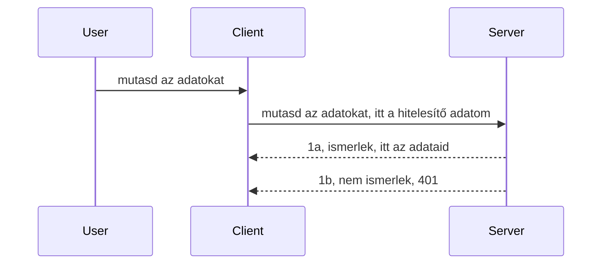

# Egyszerű hitelesítés

Az MCP SDK-k támogatják az OAuth 2.1 használatát, ami elég összetett folyamat, amely olyan fogalmakat foglal magában, mint hitelesítési szerver, erőforrás szerver, hitelesítő adatok beküldése, kód megszerzése, a kód cseréje egy hordozó tokenre, míg végül hozzáférést kapunk az erőforrásokhoz. Ha nem vagy hozzászokva az OAuth használatához, ami egy nagyszerű dolog a bevezetéshez, érdemes alap szintű hitelesítéssel kezdeni, és fokozatosan erősebb biztonságot építeni. Ezért létezik ez a fejezet, hogy segítsen egyre fejlettebb hitelesítéshez eljutni.

## Hitelesítés, mit értünk alatta?

A hitelesítés (auth) az authentication és authorization rövidítése. A gondolat az, hogy két dolgot kell csinálnunk:

- **Authentication**, ami annak a folyamata, hogy kiderítsük, beengedünk-e egy személyt a házunkba, vagyis van-e joga "itt lenni", azaz hozzáféréssel bír-e erőforrás szerverünkhöz, ahol az MCP szerver funkciók működnek.
- **Authorization**, ami annak a folyamata, hogy megállapítsuk, az adott felhasználónak van-e jogosultsága a kért konkrét erőforrásokhoz, például ezekhez a rendelésekhez vagy termékekhez, vagy csak olvasási jogot kap, de például nem törölhet.

## Hitelesítő adatok: hogyan mutatjuk meg a rendszernek, kik vagyunk

A legtöbb webfejlesztő először arra gondol, hogy biztosítania kell egy hitelesítő adatot a szerver felé, általában egy titkot, amely elmondja, hogy beengedhetik-e ("Authentication"). Ez az adat általában a felhasználónév és jelszó base64 kódolt változata vagy egy egyedi API kulcs, amely azonosít egy konkrét felhasználót.

Ezt egy "Authorization" nevű fejlécen keresztül küldjük, így:

```json
{ "Authorization": "secret123" }
```

Ezt általában alapvető hitelesítésnek (basic authentication) hívják. A folyamat általában így néz ki:


Most, hogy értjük a folyamatot, hogyan valósítjuk meg? A legtöbb webszervernek van egy ún. middleware fogalma, egy kódrészlet, amely a kérés részeként fut le, ellenőrzi a hitelesítő adatokat, és ha azok érvényesek, átengedi a kérést. Ha érvénytelen hitelesítő adat érkezik, hatástalanítja a kérést és hitelesítési hibát ad vissza. Nézzük meg, hogyan valósítható ez meg:

**Python**

```python
class AuthMiddleware(BaseHTTPMiddleware):
    async def dispatch(self, request, call_next):

        has_header = request.headers.get("Authorization")
        if not has_header:
            print("-> Missing Authorization header!")
            return Response(status_code=401, content="Unauthorized")

        if not valid_token(has_header):
            print("-> Invalid token!")
            return Response(status_code=403, content="Forbidden")

        print("Valid token, proceeding...")
       
        response = await call_next(request)
        # adj hozzá bármilyen ügyfél fejlécet vagy módosíts valamit a válaszban
        return response


starlette_app.add_middleware(CustomHeaderMiddleware)
```

Itt:

- Létrehoztunk egy `AuthMiddleware` nevű middleware-t, amelynek `dispatch` metódusát a webszerver hívja meg.
- Hozzáadtuk ezt a middleware-t a webszerverhez:

    ```python
    starlette_app.add_middleware(AuthMiddleware)
    ```

- Megírtuk az ellenőrző logikát, amely megnézi, hogy az Authorization fejléc jelen van-e, és hogy a küldött titok érvényes-e:

    ```python
    has_header = request.headers.get("Authorization")
    if not has_header:
        print("-> Missing Authorization header!")
        return Response(status_code=401, content="Unauthorized")

    if not valid_token(has_header):
        print("-> Invalid token!")
        return Response(status_code=403, content="Forbidden")
    ```

    Ha a titok jelen van és érvényes, akkor a `call_next` meghívásával átengedjük a kérést és visszaadjuk a választ.

    ```python
    response = await call_next(request)
    # adj hozzá bármilyen ügyfélfejléceket vagy módosítsd a választ valamilyen módon
    return response
    ```

A működése abból áll, hogy ha egy webes kérés érkezik a szerverhez, a middleware lefut, és implementációjától függően vagy átengedi a kérést, vagy hibát jelez, ami a kliens számára jelzi, hogy nincs jogosultsága továbbhaladni.

**TypeScript**

Itt az Express népszerű keretrendszerrel készítünk egy middleware-t, amely elfogja a kérést, mielőtt az eljut az MCP szerverhez. A kód így néz ki:

```typescript
function isValid(secret) {
    return secret === "secret123";
}

app.use((req, res, next) => {
    // 1. Engedélyezési fejléc jelen van?
    if(!req.headers["Authorization"]) {
        res.status(401).send('Unauthorized');
    }
    
    let token = req.headers["Authorization"];

    // 2. Érvényesség ellenőrzése.
    if(!isValid(token)) {
        res.status(403).send('Forbidden');
    }

   
    console.log('Middleware executed');
    // 3. Továbbítja a kérést a kérési csővezeték következő lépéséhez.
    next();
});
```

Ebben a kódban:

1. Először megnézzük, hogy az Authorization fejléc jelen van-e, ha nincs, akkor 401-es hibát küldünk.
2. Ellenőrizzük, hogy a hitelesítő adat/token érvényes-e, ha nem, 403-as hibát küldünk.
3. Végül átengedjük a kérést a kéréspipeline-on és visszaküldjük a kért erőforrást.

## Gyakorlat: Hitelesítés megvalósítása

Vegyük a tudásunkat és próbáljuk megvalósítani. Íme a terv:

Szerver

- Hozzunk létre egy webszervert és egy MCP példányt.
- Valósítsunk meg egy middleware-t a szerverhez.

Kliens

- Küldjünk webes kérést hitelesítő adattal a fejlécen keresztül.

### -1- Hozz létre webszervert és MCP példányt

Az első lépésünk, hogy létrehozzuk a webszerver példányt és az MCP szervert.

**Python**

Itt létrehozunk egy MCP szerver példányt, egy starlette webalkalmazást, és egy uvicorn segítségével futtatjuk.

```python
# MCP szerver létrehozása

app = FastMCP(
    name="MCP Resource Server",
    instructions="Resource Server that validates tokens via Authorization Server introspection",
    host=settings["host"],
    port=settings["port"],
    debug=True
)

# starlette webalkalmazás létrehozása
starlette_app = app.streamable_http_app()

# alkalmazás kiszolgálása uvicorn segítségével
async def run(starlette_app):
    import uvicorn
    config = uvicorn.Config(
            starlette_app,
            host=app.settings.host,
            port=app.settings.port,
            log_level=app.settings.log_level.lower(),
        )
    server = uvicorn.Server(config)
    await server.serve()

run(starlette_app)
```

Ebben a kódban:

- Létrehozzuk az MCP szervert.
- Elkészítjük a starlette web appot az MCP szerverből, `app.streamable_http_app()`.
- Uvicorn-nal futtatjuk és szolgáltatjuk a webappot `server.serve()`.

**TypeScript**

Itt létrehozunk egy MCP szerver példányt.

```typescript
const server = new McpServer({
      name: "example-server",
      version: "1.0.0"
    });

    // ... szerver erőforrások, eszközök és parancsok beállítása ...
```

Az MCP szerver létrehozását a POST /mcp útvonal definíciójába kell helyeznünk, tehát vegyük az előző kódot és helyezzük át így:

```typescript
import express from "express";
import { randomUUID } from "node:crypto";
import { McpServer } from "@modelcontextprotocol/sdk/server/mcp.js";
import { StreamableHTTPServerTransport } from "@modelcontextprotocol/sdk/server/streamableHttp.js";
import { isInitializeRequest } from "@modelcontextprotocol/sdk/types.js"

const app = express();
app.use(express.json());

// Térkép a szállítások tárolására munkamenet azonosító szerint
const transports: { [sessionId: string]: StreamableHTTPServerTransport } = {};

// POST kérések kezelése kliens-szerver kommunikációhoz
app.post('/mcp', async (req, res) => {
  // Ellenőrizze a meglévő munkamenet azonosítót
  const sessionId = req.headers['mcp-session-id'] as string | undefined;
  let transport: StreamableHTTPServerTransport;

  if (sessionId && transports[sessionId]) {
    // Meglévő szállítás újrafelhasználása
    transport = transports[sessionId];
  } else if (!sessionId && isInitializeRequest(req.body)) {
    // Új inicializációs kérés
    transport = new StreamableHTTPServerTransport({
      sessionIdGenerator: () => randomUUID(),
      onsessioninitialized: (sessionId) => {
        // Szállítás tárolása munkamenet azonosító szerint
        transports[sessionId] = transport;
      },
      // A DNS átirányítás elleni védelem alapértelmezés szerint le van tiltva a visszafelé kompatibilitás miatt. Ha ezt a szervert helyben futtatja
      // győződjön meg róla, hogy beállítja:
      // enableDnsRebindingProtection: true,
      // allowedHosts: ['127.0.0.1'],
    });

    // Szállítás törlése bezáráskor
    transport.onclose = () => {
      if (transport.sessionId) {
        delete transports[transport.sessionId];
      }
    };
    const server = new McpServer({
      name: "example-server",
      version: "1.0.0"
    });

    // ... szerver erőforrásainak, eszközeinek és kérdéseinek beállítása ...

    // Csatlakozás az MCP szerverhez
    await server.connect(transport);
  } else {
    // Érvénytelen kérés
    res.status(400).json({
      jsonrpc: '2.0',
      error: {
        code: -32000,
        message: 'Bad Request: No valid session ID provided',
      },
      id: null,
    });
    return;
  }

  // Kérés kezelése
  await transport.handleRequest(req, res, req.body);
});

// Újrafelhasználható kezelő GET és DELETE kérésekhez
const handleSessionRequest = async (req: express.Request, res: express.Response) => {
  const sessionId = req.headers['mcp-session-id'] as string | undefined;
  if (!sessionId || !transports[sessionId]) {
    res.status(400).send('Invalid or missing session ID');
    return;
  }
  
  const transport = transports[sessionId];
  await transport.handleRequest(req, res);
};

// GET kérések kezelése szerver-kliens értesítésekhez SSE-n keresztül
app.get('/mcp', handleSessionRequest);

// DELETE kérések kezelése munkamenet lezárásához
app.delete('/mcp', handleSessionRequest);

app.listen(3000);
```

Most láthatod, hogy az MCP szerver létrehozása átkerült az `app.post("/mcp")` belsejébe.

Lépjünk tovább a middleware elkészítésére, hogy ellenőrizni tudjuk a beérkező hitelesítő adatot.

### -2- Middleware implementálása a szerverhez

Következő lépésként készítsünk egy middleware-t, amely az `Authorization` fejlécben keres hitelesítő adatot és validálja azt. Ha elfogadható, a kérés továbbhaladhat (például eszközök listázása, erőforrás olvasása, vagy bármely MCP funkció végrehajtása).

**Python**

Middleware elkészítéséhez hozzunk létre egy osztályt, amely öröklődik a `BaseHTTPMiddleware`-ből. Két fontos dolog van:

- A `request`, amiből olvassuk a fejlécet.
- A `call_next`, az a callback, amit meg kell hívnunk, ha a kliens elfogadott hitelesítő adatot hozott.

Először kezeljük az esetet, ha hiányzik az `Authorization` fejléc:

```python
has_header = request.headers.get("Authorization")

# nincs fejléc, 401-es hibával meghiúsul, különben folytatódik.
if not has_header:
    print("-> Missing Authorization header!")
    return Response(status_code=401, content="Unauthorized")
```

Itt egy 401-es "nem jogosult" üzenetet küldünk, mert a kliens nem sikeresen hitelesített.

Ha elküldtek hitelesítő adatot, meg kell vizsgálnunk annak érvényességét így:

```python
 if not valid_token(has_header):
    print("-> Invalid token!")
    return Response(status_code=403, content="Forbidden")
```

Láthatod, hogy itt 403-as "tiltott" üzenetet küldünk. Nézzük az egész middleware-t, amely mindent megvalósít, amit eddig említettünk:

```python
class AuthMiddleware(BaseHTTPMiddleware):
    async def dispatch(self, request, call_next):

        has_header = request.headers.get("Authorization")
        if not has_header:
            print("-> Missing Authorization header!")
            return Response(status_code=401, content="Unauthorized")

        if not valid_token(has_header):
            print("-> Invalid token!")
            return Response(status_code=403, content="Forbidden")

        print("Valid token, proceeding...")
        print(f"-> Received {request.method} {request.url}")
        response = await call_next(request)
        response.headers['Custom'] = 'Example'
        return response

```

Jó, de mi a helyzet a `valid_token` függvénnyel? Íme alább:

```python
# NE használd éles környezetben - fejleszd tovább !!
def valid_token(token: str) -> bool:
    # távolítsd el a "Bearer " előtagot
    if token.startswith("Bearer "):
        token = token[7:]
        return token == "secret-token"
    return False
```

Természetesen ezt érdemes továbbfejleszteni.

FONTOS: Sose legyenek ilyen titkos adatok a kódban! Ideális esetben az összehasonlításhoz szükséges értéket adatforrásból vagy identitás szolgáltatótól (IDP) kell lekérni, vagy még jobb, ha maga az IDP végzi az ellenőrzést.

**TypeScript**

Express esetén a `use` metódust használjuk middleware függvények hozzáadására.

Ehhez:

- A kérés objektummal lépünk interakcióba, hogy ellenőrizzük az `Authorization` tulajdonságban átadott hitelesítő adatot.
- Érvényesítjük a hitelesítő adatot, ha az rendben van, engedjük tovább a kérést, hogy a kliens MCP kérése végrehajtódjon (pl. eszközlista, erőforrás olvasás vagy más MCP funkció).

Itt megnézzük, hogy megvan-e az `Authorization` fejléc, ha nem, megállítjuk a kérést:

```typescript
if(!req.headers["authorization"]) {
    res.status(401).send('Unauthorized');
    return;
}
```

Ha hiányzik a fejléc, 401-es hibát kapunk.

Ezután ellenőrizzük a hitelesítő adat érvényességét, ha nem jó, szintén megállítjuk, de más üzenettel:

```typescript
if(!isValid(token)) {
    res.status(403).send('Forbidden');
    return;
} 
```

Itt látható, hogy 403-as hibát kaptunk.

Íme a teljes kód:

```typescript
app.use((req, res, next) => {
    console.log('Request received:', req.method, req.url, req.headers);
    console.log('Headers:', req.headers["authorization"]);
    if(!req.headers["authorization"]) {
        res.status(401).send('Unauthorized');
        return;
    }
    
    let token = req.headers["authorization"];

    if(!isValid(token)) {
        res.status(403).send('Forbidden');
        return;
    }  

    console.log('Middleware executed');
    next();
});
```

Beállítottuk a webszervert, hogy fogadjon egy middleware-t a kliens által küldött hitelesítő adat ellenőrzésére. És a kliens maga?

### -3- Küldj webkérést hitelesítő adattal a fejlécen

Ellenőrizzük, hogy a kliens a fejlécben továbbítja-e a hitelesítő adatot. Mivel MCP klienst használunk, meg kell néznünk, hogyan kell ezt megtenni.

**Python**

A kliens esetén egy fejlécet kell átadnunk a hitelesítő adattal, így:

```python
# NE kódold be az értéket, helyette legyen legalább egy környezeti változóban vagy egy biztonságosabb tárolóban
token = "secret-token"

async with streamablehttp_client(
        url = f"http://localhost:{port}/mcp",
        headers = {"Authorization": f"Bearer {token}"}
    ) as (
        read_stream,
        write_stream,
        session_callback,
    ):
        async with ClientSession(
            read_stream,
            write_stream
        ) as session:
            await session.initialize()
      
            # TODO, mit szeretnél a kliensben megvalósítani, pl. eszközök listázása, eszközök hívása stb.
```

Itt látható, hogy a `headers` tulajdonságot így töltjük fel: ` headers = {"Authorization": f"Bearer {token}"}`.

**TypeScript**

Ezt két lépésben oldhatjuk meg:

1. Feltöltünk egy konfigurációs objektumot a hitelesítő adatunkkal.
2. Átadjuk a konfigurációt a transportnak.

```typescript

// NE keménykódolja az értéket, mint itt látható. Legalább tegye környezeti változóvá, és használjon valami hasonlót, mint a dotenv (fejlesztési módban).
let token = "secret123"

// definiáljon egy kliens szállítási opció objektumot
let options: StreamableHTTPClientTransportOptions = {
  sessionId: sessionId,
  requestInit: {
    headers: {
      "Authorization": "secret123"
    }
  }
};

// adja át az opció objektumot a szállításnak
async function main() {
   const transport = new StreamableHTTPClientTransport(
      new URL(serverUrl),
      options
   );
```

Itt láthatod, hogy létrehoztunk egy `options` objektumot, és a fejlécet a `requestInit` tulajdonság alá helyeztük.

FONTOS: Hogyan fejlesszük tovább innen? Jelenleg ez a megvalósítás kockázatos, ha nincs legalább HTTPS. Még akkor is ellopható a hitelesítő adat, ezért szükséges egy olyan rendszer, ahol könnyen visszavonható a token, illetve további ellenőrzéseket alkalmazunk, például a földrajzi eredetet, a túl gyakori kéréseket (bot-viselkedés), vagyis számos aggály van.

Viszont egyszerű API-knál, ahol nem szeretnénk hitelesítés nélküli hívásokat engedni, ez egy jó kezdés.

Most próbáljuk meg javítani a biztonságot egy szabványosított formátummal, például a JSON Web Token-nel, azaz JWT-vel (más néven "JOT" tokenekkel).

## JSON Web Tokenek, JWT

Tehát javítani szeretnénk a nagyon egyszerű hitelesítő adatok küldésén. Milyen azonnali előnyöket ad a JWT?

- **Biztonsági fejlesztések**. Basic auth esetén a felhasználónevet és jelszót base64 kódolt tokenként (vagy API kulcsként) ismétlődően küldöd, ami növeli a kockázatot. JWT-vel a felhasználóneved és jelszavad megadása után kapsz egy token-t, amely időben korlátozott, vagyis lejár. JWT lehetővé teszi a finomhangolt hozzáférés-vezérlést szerepkörökkel, hatókörökkel és jogosultságokkal.
- **Állapotmentesség és skálázhatóság**. A JWT-k önállóak, magukban hordozzák az összes felhasználói információt, így nincs szükség szerveroldali munkamenet tárhelyre. A tokenek helyileg is érvényesíthetők.
- **Interoperabilitás és federáció**. A JWT az Open ID Connect alapja, és ismert identitásszolgáltatókkal, mint az Entra ID, Google Identity vagy Auth0 együtt használatos. Lehetővé teszi az egypontos bejelentkezést és számos vállalati szintű funkciót.
- **Modularitás és rugalmasság**. JWT-k használhatók API átjárókkal (Azure API Management, NGINX stb.), autentikációs forgatókönyvekhez és szolgáltatás-szolgáltatás közötti kommunikációhoz, beleértve képviselet és delegálás eseteket is.
- **Teljesítmény és gyorsítótárazás**. A JWT-k dekódolás után gyorsítótárazhatók, így csökkenthető a folyamatos elemzés szükségessége. Ez különösen hasznos nagy forgalmú alkalmazásoknál, növeli az áteresztőképességet és csökkenti az infrastruktúra terhelését.
- **Fejlett funkciók**. Támogatja az introspektív (szerver oldali érvényesítés) és visszavonási (token érvénytelenné tétel) képességeket is.

Ezekkel az előnyökkel nézzük meg, hogyan tehetjük jobbá a megvalósításunkat.

## Az alapvető hitelesítés JWT-re váltása

Nagy vonalakban a következő változtatásokra van szükség:

- **Tanuljuk meg a JWT token felépítését**, hogy készen álljon a kliensből a szerver felé küldésre.
- **Token érvényesítés**, és ha érvényes, engedjük a kliens hozzáférését az erőforrásokhoz.
- **Biztonságos token tárolás**. Hogyan tároljuk biztonságosan ezt a tokent.
- **Útvonalak védelme**. Védjük az útvonalakat, nálunk azt, hogy az MCP funkciókat csak jogosultak használhassák.
- **Frissítő tokenek hozzáadása**. Győződjünk meg róla, hogy rövid életű tokeneket hozunk létre, valamint hosszú életű frissítő tokeneket, amelyekkel új tokenek szerezhetők be lejárat után. Biztosítsunk frissítő végpontot és forgatási stratégiát.

### -1- JWT token felépítése

Egy JWT token a következő részekből áll:

- **header** (fejléc), algoritmus és token típus.
- **payload** (hasznos teher), olyan állításokkal, mint pl. sub (a token által képviselt felhasználó vagy entitás, autentikációs forgatókönyvben tipikusan a felhasználó azonosítója), exp (lejárat), role (szerepkör).
- **signature** (aláírás), amely titkos kulccsal vagy privát kulccsal van aláírva.

Ehhez létre kell hozni a fejlécet, a payload-ot és az enkódolt tokent.

**Python**

```python

import jwt
import jwt
from jwt.exceptions import ExpiredSignatureError, InvalidTokenError
import datetime

# Titkos kulcs a JWT aláírásához
secret_key = 'your-secret-key'

header = {
    "alg": "HS256",
    "typ": "JWT"
}

# a felhasználói információk, igények és lejárati idő
payload = {
    "sub": "1234567890",               # Alany (felhasználói azonosító)
    "name": "User Userson",                # Egyedi igény
    "admin": True,                     # Egyedi igény
    "iat": datetime.datetime.utcnow(),# Kiadva
    "exp": datetime.datetime.utcnow() + datetime.timedelta(hours=1)  # Lejárat
}

# kódold le
encoded_jwt = jwt.encode(payload, secret_key, algorithm="HS256", headers=header)
```

A fenti kódban:

- Meghatároztuk a fejlécet HS256 algoritmussal és JWT típussal.
- Összeállítottuk a payload-ot, amely tartalmaz egy alanyt vagy felhasználói azonosítót, egy felhasználónevet, szerepkört, kiadási dátumot és lejárati időt, így megvalósítva az időkorlátot.

**TypeScript**

Ehhez szükségünk lesz néhány függőségre, amelyek segítenek a JWT token létrehozásában.

Függőségek

```sh

npm install jsonwebtoken
npm install --save-dev @types/jsonwebtoken
```

Most, hogy megvannak ezek, készítsük el a fejlécet, payload-ot, és ezen keresztül az enkódolt tokent.

```typescript
import jwt from 'jsonwebtoken';

const secretKey = 'your-secret-key'; // Használjon környezeti változókat éles környezetben

// Definiáld a terhelést
const payload = {
  sub: '1234567890',
  name: 'User usersson',
  admin: true,
  iat: Math.floor(Date.now() / 1000), // Kiadva
  exp: Math.floor(Date.now() / 1000) + 60 * 60 // Lejár 1 óra múlva
};

// Fejléc definiálása (opcionális, a jsonwebtoken alapértelmezetten beállít)
const header = {
  alg: 'HS256',
  typ: 'JWT'
};

// Token létrehozása
const token = jwt.sign(payload, secretKey, {
  algorithm: 'HS256',
  header: header
});

console.log('JWT:', token);
```

Ez a token:

HS256-tal van aláírva
1 óráig érvényes
Tartalmaz olyan állításokat, mint sub, name, admin, iat, és exp.

### -2- Token érvényesítése

Ellenőriznünk is kell a tokent, ezt a szerveren kell megtennünk, hogy biztosak legyünk, amit a kliens küld, az valóban érvényes. Sokféle ellenőrzést kell végezni, például a struktúra helyességét vagy az érvényességet. Ajánlott további ellenőrzéseket is végrehajtani, például, hogy a felhasználó szerepel-e a rendszerünkben, és jogosultságai megfelelnek-e.

A token érvényesítéséhez dekódolni kell, hogy leolvashassuk és megkezdjük az ellenőrzést:

**Python**

```python

# Dekódolja és ellenőrzi a JWT-t
try:
    decoded = jwt.decode(token, secret_key, algorithms=["HS256"])
    print("✅ Token is valid.")
    print("Decoded claims:")
    for key, value in decoded.items():
        print(f"  {key}: {value}")
except ExpiredSignatureError:
    print("❌ Token has expired.")
except InvalidTokenError as e:
    print(f"❌ Invalid token: {e}")

```

Ebben a kódban a `jwt.decode` hívást végezzük el a tokennel, titkos kulccsal és az elfogadott algoritmussal. Észrevehető a try-except blokk használata, mert hibás érvényesítésnél kivételt dob.

**TypeScript**

Itt a `jwt.verify` metódust kell hívni, hogy dekódolt változatot kapjunk, amit tovább elemezhetünk. Ha ez hibát dob, akkor a token szerkezete hibás vagy lejárt.

```typescript

try {
  const decoded = jwt.verify(token, secretKey);
  console.log('Decoded Payload:', decoded);
} catch (err) {
  console.error('Token verification failed:', err);
}
```

MEGJEGYZÉS: Ahogy korábban említve, további ellenőrzéseket is végre kell hajtani, hogy a token valóban egy létező felhasználóra mutasson rá, és hogy a jogosultságai megfeleljenek.

Most nézzünk meg egy szerepkör-alapú hozzáférésvezérlést, más néven RBAC-ot.
## Hozzáadás szerepkör alapú jogosultságkezelés

Az az elképzelés, hogy különböző szerepkörök különböző jogosultságokat kapnak. Például feltételezzük, hogy egy admin mindent megtehet, egy normál felhasználó olvashat/írhat, egy vendég pedig csak olvashat. Ezért itt vannak néhány lehetséges jogosultsági szint:

- Admin.Write 
- User.Read
- Guest.Read

Nézzük meg, hogyan tudunk ilyen jogosultság-ellenőrzést megvalósítani middleware-rel. Middleware-eket hozzá lehet adni egyes útvonalakhoz, vagy az összes útvonalhoz is.

**Python**

```python
from starlette.middleware.base import BaseHTTPMiddleware
from starlette.responses import JSONResponse
import jwt

# NE legyen a titok a kódban, ez csak bemutató célt szolgál. Olvasd biztonságos helyről.
SECRET_KEY = "your-secret-key" # tedd környezeti változóba
REQUIRED_PERMISSION = "User.Read"

class JWTPermissionMiddleware(BaseHTTPMiddleware):
    async def dispatch(self, request, call_next):
        auth_header = request.headers.get("Authorization")
        if not auth_header or not auth_header.startswith("Bearer "):
            return JSONResponse({"error": "Missing or invalid Authorization header"}, status_code=401)

        token = auth_header.split(" ")[1]
        try:
            decoded = jwt.decode(token, SECRET_KEY, algorithms=["HS256"])
        except jwt.ExpiredSignatureError:
            return JSONResponse({"error": "Token expired"}, status_code=401)
        except jwt.InvalidTokenError:
            return JSONResponse({"error": "Invalid token"}, status_code=401)

        permissions = decoded.get("permissions", [])
        if REQUIRED_PERMISSION not in permissions:
            return JSONResponse({"error": "Permission denied"}, status_code=403)

        request.state.user = decoded
        return await call_next(request)


```

Néhány különböző mód van arra, hogy hozzáadjuk a middleware-t a következőhöz hasonlóan:

```python

# Alt 1: köztes szoftver hozzáadása a starlette alkalmazás építése közben
middleware = [
    Middleware(JWTPermissionMiddleware)
]

app = Starlette(routes=routes, middleware=middleware)

# Alt 2: köztes szoftver hozzáadása a starlette alkalmazás megépítése után
starlette_app.add_middleware(JWTPermissionMiddleware)

# Alt 3: köztes szoftver hozzáadása útvonalanként
routes = [
    Route(
        "/mcp",
        endpoint=..., # kezelő
        middleware=[Middleware(JWTPermissionMiddleware)]
    )
]
```

**TypeScript**

Használhatjuk az `app.use`-t és egy olyan middleware-t, ami minden kérésnél lefut.

```typescript
app.use((req, res, next) => {
    console.log('Request received:', req.method, req.url, req.headers);
    console.log('Headers:', req.headers["authorization"]);

    // 1. Ellenőrizze, hogy az engedélyezési fejléc elküldésre került-e

    if(!req.headers["authorization"]) {
        res.status(401).send('Unauthorized');
        return;
    }
    
    let token = req.headers["authorization"];

    // 2. Ellenőrizze, hogy a token érvényes-e
    if(!isValid(token)) {
        res.status(403).send('Forbidden');
        return;
    }  

    // 3. Ellenőrizze, hogy a token felhasználó létezik-e a rendszerünkben
    if(!isExistingUser(token)) {
        res.status(403).send('Forbidden');
        console.log("User does not exist");
        return;
    }
    console.log("User exists");

    // 4. Ellenőrizze, hogy a token rendelkezik-e a megfelelő engedélyekkel
    if(!hasScopes(token, ["User.Read"])){
        res.status(403).send('Forbidden - insufficient scopes');
    }

    console.log("User has required scopes");

    console.log('Middleware executed');
    next();
});

```

Sok dolgot engedhetünk meg a middleware-nek és amit a middleware-nek KELL is tennie, nevezetesen:

1. Ellenőrizze, hogy van-e engedélyezési fejléc (authorization header)
2. Ellenőrizze, hogy a token érvényes-e, meghívjuk az `isValid` metódust, melyet mi írtunk és amely a JWT token integritását és érvényességét ellenőrzi.
3. Ellenőrizze, hogy a felhasználó létezik-e a rendszerünkben, ezt is ellenőriznünk kell.

   ```typescript
    // felhasználók az adatbázisban
   const users = [
     "user1",
     "User usersson",
   ]

   function isExistingUser(token) {
     let decodedToken = verifyToken(token);

     // TODO, ellenőrizni, hogy a felhasználó létezik-e az adatbázisban
     return users.includes(decodedToken?.name || "");
   }
   ```

   Fent egy nagyon egyszerű `users` listát hoztunk létre, ami nyilvánvalóan egy adatbázisban kell hogy legyen.

4. Emellett ellenőriznünk kell, hogy a token rendelkezik-e a megfelelő jogosultságokkal.

   ```typescript
   if(!hasScopes(token, ["User.Read"])){
        res.status(403).send('Forbidden - insufficient scopes');
   }
   ```

   Ebben a fenti middleware kódban azt ellenőrizzük, hogy a token tartalmazza-e a User.Read jogosultságot, ha nem, akkor 403 hibát küldünk. Lent látható a `hasScopes` segédfüggvény.

   ```typescript
   function hasScopes(scope: string, requiredScopes: string[]) {
     let decodedToken = verifyToken(scope);
    return requiredScopes.every(scope => decodedToken?.scopes.includes(scope));
  }
   ```

Have a think which additional checks you should be doing, but these are the absolute minimum of checks you should be doing.

Using Express as a web framework is a common choice. There are helpers library when you use JWT so you can write less code.

- `express-jwt`, helper library that provides a middleware that helps decode your token.
- `express-jwt-permissions`, this provides a middleware `guard` that helps check if a certain permission is on the token.

Here's what these libraries can look like when used:

```typescript
const express = require('express');
const jwt = require('express-jwt');
const guard = require('express-jwt-permissions')();

const app = express();
const secretKey = 'your-secret-key'; // put this in env variable

// Decode JWT and attach to req.user
app.use(jwt({ secret: secretKey, algorithms: ['HS256'] }));

// Check for User.Read permission
app.use(guard.check('User.Read'));

// multiple permissions
// app.use(guard.check(['User.Read', 'Admin.Access']));

app.get('/protected', (req, res) => {
  res.json({ message: `Welcome ${req.user.name}` });
});

// Error handler
app.use((err, req, res, next) => {
  if (err.code === 'permission_denied') {
    return res.status(403).send('Forbidden');
  }
  next(err);
});

```

Most, hogy láttad, hogyan lehet a middleware-t mind hitelesítésre, mind jogosultságkezelésre használni, mi a helyzet az MCP-vel, megváltoztatja-e az auth megvalósítását? Nézzük meg a következő részben.

### -3- Szerepkör alapú jogosultságok hozzáadása MCP-hez

Eddig láttad, hogyan lehet middleware-rel RBAC-ot hozzáadni, azonban MCP esetén nincs egyszerű mód, hogy MCP funkciónként külön RBAC-ot adjunk hozzá, akkor mit tegyünk? Egyszerűen csak hozzá kell adnunk ilyen kódot, ami ebben az esetben ellenőrzi, hogy az ügyfél jogosult-e egy adott eszköz meghívására:

Többféle mód van arra, hogy funkciónkénti RBAC-ot valósítsunk meg, íme néhány:

- Adj hozzá jogosultság ellenőrzést minden egyes eszközhöz, erőforráshoz, prompthoz, ahol ellenőrizni kell a jogosultsági szintet.

   **python**

   ```python
   @tool()
   def delete_product(id: int):
      try:
          check_permissions(role="Admin.Write", request)
      catch:
        pass # a kliens nem sikerült azonosítás, engedélyezési hiba kiváltása
   ```

   **typescript**

   ```typescript
   server.registerTool(
    "delete-product",
    {
      title: Delete a product",
      description: "Deletes a product",
      inputSchema: { id: z.number() }
    },
    async ({ id }) => {
      
      try {
        checkPermissions("Admin.Write", request);
        // teendő, küldd el az azonosítót a productService-nek és a távoli bejegyzésnek
      } catch(Exception e) {
        console.log("Authorization error, you're not allowed");  
      }

      return {
        content: [{ type: "text", text: `Deletected product with id ${id}` }]
      };
    }
   );
   ```


- Használj fejlett szerver megközelítést és kéréskezelőket, hogy minimalizáld, hány helyen kell ellenőrzést végezni.

   **Python**

   ```python
   
   tool_permission = {
      "create_product": ["User.Write", "Admin.Write"],
      "delete_product": ["Admin.Write"]
   }

   def has_permission(user_permissions, required_permissions) -> bool:
      # user_permissions: a felhasználó jogosultságainak listája
      # required_permissions: az eszközhöz szükséges jogosultságok listája
      return any(perm in user_permissions for perm in required_permissions)

   @server.call_tool()
   async def handle_call_tool(
     name: str, arguments: dict[str, str] | None
   ) -> list[types.TextContent]:
    # Tegyük fel, hogy a request.user.permissions a felhasználó jogosultságainak listája
     user_permissions = request.user.permissions
     required_permissions = tool_permission.get(name, [])
     if not has_permission(user_permissions, required_permissions):
        # Dobj hibát "Nincs jogosultságod a(z) {name} eszköz hívásához"
        raise Exception(f"You don't have permission to call tool {name}")
     # folytasd és hívd meg az eszközt
     # ...
   ```   
   

   **TypeScript**

   ```typescript
   function hasPermission(userPermissions: string[], requiredPermissions: string[]): boolean {
       if (!Array.isArray(userPermissions) || !Array.isArray(requiredPermissions)) return false;
       // Adjon vissza igaz értéket, ha a felhasználónak legalább egy szükséges engedélye van
       
       return requiredPermissions.some(perm => userPermissions.includes(perm));
   }
  
   server.setRequestHandler(CallToolRequestSchema, async (request) => {
      const { params: { name } } = request;
  
      let permissions = request.user.permissions;
  
      if (!hasPermission(permissions, toolPermissions[name])) {
         return new Error(`You don't have permission to call ${name}`);
      }
  
      // folytassa tovább..
   });
   ```

   Fontos, hogy middleware-d biztosítsa, hogy egy dekódolt token legyen hozzárendelve a kérés user property-jéhez, hogy a fenti kód egyszerű legyen.

### Összefoglalás

Most, hogy megvitattuk, hogyan lehet általánosan és MCP esetén támogatni az RBAC-ot, ideje megpróbálni a biztonságot magad megvalósítani, hogy igazold, megértetted a bemutatott fogalmakat.

## Feladat 1: Építs egy mcp szervert és mcp klienset alap hitelesítéssel

Itt azt használod, amit tanultál a hitelesítő adatok fejlécben való továbbításáról.

## Megoldás 1

[Solution 1](./code/basic/README.md)

## Feladat 2: Fejleszd tovább az 1. feladat megoldását JWT alapúra

Vedd az első megoldást, de most fejlesszük tovább.

Basic Auth helyett használjuk a JWT-t.

## Megoldás 2

[Solution 2](./solution/jwt-solution/README.md)

## Kihívás

Add hozzá a szakaszban "Add RBAC to MCP" leírt eszközönkénti RBAC-ot.

## Összefoglalás

Remélhetőleg sokat tanultál ebben a fejezetben, a teljes biztonság hiányától kezdve az alapbiztonságon át a JWT-ig és annak MCP-hez való hozzáadásáig.

Már építettünk egy szilárd alapot egyedi JWT-kkel, de ahogy nő a méretünk, átállunk egy szabványosított identitás modellre. Egy IdP, mint az Entra vagy Keycloak alkalmazásával átháríthatjuk a token kibocsátás, érvényesítés és életciklus-kezelés feladatát egy megbízható platformra — így mi az alkalmazás logikára és a felhasználói élményre koncentrálhatunk.

Ehhez van egy haladóbb [fejezet az Entráról](../../05-AdvancedTopics/mcp-security-entra/README.md)

## Mi következik

- Következő: [MCP hosztok beállítása](../12-mcp-hosts/README.md)

---

<!-- CO-OP TRANSLATOR DISCLAIMER START -->
**Jogi Nyilatkozat**:  
Ez a dokumentum az AI fordító szolgáltatás [Co-op Translator](https://github.com/Azure/co-op-translator) használatával készült. Bár a pontosságra törekszünk, kérjük, vegye figyelembe, hogy az automatikus fordítások hibákat vagy pontatlanságokat tartalmazhatnak. Az eredeti dokumentum az anyanyelvén tekintendő hiteles forrásnak. Kritikus információk esetén professzionális emberi fordítás ajánlott. Nem vállalunk felelősséget az e fordítás használatából eredő félreértésekért vagy félreértelmezésekért.
<!-- CO-OP TRANSLATOR DISCLAIMER END -->