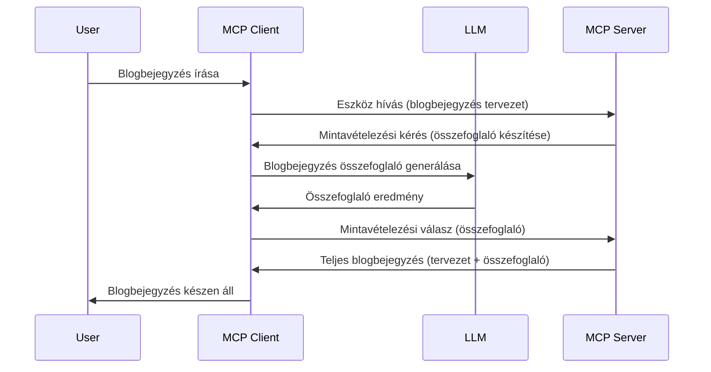

# Mintavételezés – funkciók átruházása az ügyfélre

Néha szükség van arra, hogy az MCP kliens és az MCP szerver együttműködve érjenek el egy közös célt. Előfordulhat olyan eset, amikor a szervernek egy az ügyfélen futó LLM segítségére van szüksége. Ilyen helyzetben a mintavételezés az, amit használnod kell.

Vizsgáljunk meg néhány felhasználási esetet és egy mintavételezést magában foglaló megoldás felépítését.

## Áttekintés

Ebben a leckében arra koncentrálunk, hogy mikor és hol érdemes használni a mintavételezést, és hogyan kell konfigurálni.

## Tanulási célok

Ebben a fejezetben:

- Elmagyarázzuk, mi az a mintavételezés és mikor használjuk.
- Megmutatjuk, hogyan konfiguráld a mintavételezést az MCP-ben.
- Példákat adunk a mintavételezés működésére.

## Mi az a mintavételezés és miért használjuk?

A mintavételezés egy fejlett funkció, amely a következőképpen működik:


### Mintavételezési kérés

Rendben, most, hogy van egy madártávlatból nézett hiteles forgatókönyvünk, beszéljünk a mintavételezési kérésről, amelyet a szerver küld vissza az ügyfélnek. Így nézhet ki egy ilyen kérés JSON-RPC formátumban:

```json
{
  "jsonrpc": "2.0",
  "id": 1,
  "method": "sampling/createMessage",
  "params": {
    "messages": [
      {
        "role": "user",
        "content": {
          "type": "text",
          "text": "Create a blog post summary of the following blog post: <BLOG POST>"
        }
      }
    ],
    "modelPreferences": {
      "hints": [
        {
          "name": "claude-3-sonnet"
        }
      ],
      "intelligencePriority": 0.8,
      "speedPriority": 0.5
    },
    "systemPrompt": "You are a helpful assistant.",
    "maxTokens": 100
  }
}
```

Itt van néhány dolog, amit érdemes kiemelni:

- A prompt, a content -> text alatt, az az utasítás az LLM számára, hogy foglalja össze a blogbejegyzés tartalmát.

- **modelPreferences**. Ez a rész csupán egy preferencia, egy ajánlás arra nézve, hogy milyen beállításokat érdemes használni az LLM-mel. A felhasználó eldöntheti, elfogadja-e ezeket az ajánlásokat vagy megváltoztatja azokat. Ebben az esetben vannak ajánlások arra, hogy melyik modellt használja és milyen a sebesség/intelligencia prioritása.
- **systemPrompt**, ez a normál rendszerüzeneted, amely személyiséget ad az LLM-nek és tartalmaz irányelveket.
- **maxTokens**, ez egy másik tulajdonság, amely megmondja, hogy hány token használatát javasolják a feladathoz.

### Mintavételezési válasz

Ez a válasz az, amit az MCP kliens végül visszaküld az MCP szervernek, és amely a kliens LLM-hívásának eredménye, megvárja a választ, majd összeállítja ezt az üzenetet. Így nézhet ki JSON-RPC-ben:

```json
{
  "jsonrpc": "2.0",
  "id": 1,
  "result": {
    "role": "assistant",
    "content": {
      "type": "text",
      "text": "Here's your abstract <ABSTRACT>"
    },
    "model": "gpt-5",
    "stopReason": "endTurn"
  }
}
```

Figyeld meg, hogy a válasz egy absztrakt a blogbejegyzésről, pont ahogy kértük. Figyeld meg azt is, hogy a használt `model` nem az, amit kértünk, hanem a "gpt-5" a "claude-3-sonnet" helyett. Ez illusztrálja, hogy a felhasználó megváltoztathatja a választását, és hogy a mintavételezési kérés mindössze egy ajánlás.

Rendben, most, hogy értjük a fő folyamatot, és hogy milyen hasznos feladatokra használhatjuk, mint például "blogbejegyzés készítés + absztrakt", nézzük meg, mit kell tennünk a működéshez.

### Üzenet típusok

A mintavételezési üzenetek nem csak szövegre korlátozódnak, hanem képeket és hanganyagot is küldhetsz. Így néz ki a JSON-RPC különböző esetekben:

**Szöveg**

```json
{
  "type": "text",
  "text": "The message content"
}
```

**Kép tartalom**

```json
{
  "type": "image",
  "data": "base64-encoded-image-data",
  "mimeType": "image/jpeg"
}
```

**Hang tartalom**

```json
{
  "type": "audio",
  "data": "base64-encoded-audio-data",
  "mimeType": "audio/wav"
}
```

> MEGJEGYZÉS: a mintavételezés részletesebb információiért lásd az [hivatalos dokumentációt](https://modelcontextprotocol.io/specification/2025-06-18/client/sampling)

## Hogyan konfiguráljuk a mintavételezést az ügyfélen

> Megjegyzés: ha csak szervert építesz, itt nem kell sokat tenned.

Egy ügyfélben a következő funkciót kell megadnod így:

```json
{
  "capabilities": {
    "sampling": {}
  }
}
```

Ezt a kiválasztott kliens akkor veszi figyelembe, amikor elindul a szerverrel való kommunikációban.

## Példa mintavételezésre – blogbejegyzés létrehozása

Kódoljunk egy mintavételező szervert együtt, ehhez a következőket kell megtennünk:

1. Hozzunk létre egy eszközt a szerveren.
2. Az eszköznek létre kell hoznia egy mintavételezési kérést.
3. Az eszköznek várnia kell az ügyfél által adott válaszra.
4. Ezután az eszköz eredményét kell előállítania.

Lássuk lépésről lépésre a kódot:

### -1- Az eszköz létrehozása

**python**

```python
@mcp.tool()
async def create_blog(title: str, content: str, ctx: Context[ServerSession, None]) -> str:
    """Create a blog post and generate a summary"""

```

### -2- Mintavételezési kérés létrehozása

Bővítsd az eszközt a következő kóddal:

**python**

```python
post = BlogPost(
        id=len(posts) + 1,
        title=title,
        content=content,
        abstract=""
    )

prompt = f"Create an abstract of the following blog post: title: {title} and draft: {content} "

result = await ctx.session.create_message(
        messages=[
            SamplingMessage(
                role="user",
                content=TextContent(type="text", text=prompt),
            )
        ],
        max_tokens=100,
)

```

### -3- Várakozás a válaszra és válasz visszaadása

**python**

```python
post.abstract = result.content.text

posts.append(post)

# adja vissza a teljes terméket
return json.dumps({
    "id": post.title,
    "abstract": post.abstract
})
```

### -4- Teljes kód

**python**

```python
from starlette.applications import Starlette
from starlette.routing import Mount, Host

from mcp.server.fastmcp import Context, FastMCP

from mcp.server.session import ServerSession
from mcp.types import SamplingMessage, TextContent

import json


from uuid import uuid4
from typing import List
from pydantic import BaseModel


mcp = FastMCP("Blog post generator")

# app = FastAPI()

posts = []

class BlogPost(BaseModel):
    id: int
    title: str
    content: str
    abstract: str

posts: List[BlogPost] = []

@mcp.tool()
async def create_blog(title: str, content: str, ctx: Context[ServerSession, None]) -> str:
    """Create a blog post and generate a summary"""

    post = BlogPost(
        id=len(posts) + 1,
        title=title,
        content=content,
        abstract=""
    )

    prompt = f"Create an abstract of the following blog post: title: {title} and draft: {content} "

    result = await ctx.session.create_message(
        messages=[
            SamplingMessage(
                role="user",
                content=TextContent(type="text", text=prompt),
            )
        ],
        max_tokens=100,
    )

    post.abstract = result.content.text

    posts.append(post)

    # térjen vissza a teljes blogbejegyzéssel
    return json.dumps({
        "id": post.title,
        "abstract": post.abstract
    })

if __name__ == "__main__":
    print("Starting server...")
    # mcp.run()
    mcp.run(transport="streamable-http")

# futtassa az alkalmazást ezzel: python server.py
```

### -5- Tesztelés Visual Studio Code-ban

A Visual Studio Code-ban való teszteléshez tedd a következőket:

1. Indítsd el a szervert a terminálban
2. Add hozzá a *mcp.json*-hez (és győződj meg róla, hogy fut) pl. így:

   ```json
   "servers": {
      "blog-server": {
        "type": "http",
        "url": "http://localhost:8000/mcp"
      }
   }
   ```

3. Gépelj be egy promptot:

   ```text
   create a blog post named "Where Python comes from", the content is "Python is actually named after Monty Python Flying Circus"
   ```

4. Engedélyezd a mintavételezést. Először, amikor ezt először teszteled, megjelenik egy extra párbeszéd, amelyet el kell fogadnod, majd megjelenik a normál párbeszéd, amelyben a futtatandó eszközt kérik.

5. Nézd meg az eredményeket. Az eredményt szépen megjeleníti a GitHub Copilot Chat, de megtekintheted a nyers JSON választ is.

**Bónusz**. A Visual Studio Code eszközei nagyszerű támogatást nyújtanak a mintavételezéshez. A telepített szervereden úgy konfigurálhatod a mintavételezési hozzáférést, hogy a következőt teszed:

1. Navigálj a bővítmény szekcióra.
2. Válaszd a fogaskerék ikont a telepített szerveredhez az „MCP SERVERS – TELEPÍTVE” szakaszban.
3. Válaszd a "Modell hozzáférés konfigurálása" menüpontot, ahol kiválaszthatod, hogy mely modelleket használhatja a GitHub Copilot a mintavételezés során. Megtekintheted az utóbbi időben történt mintavételezési kéréseket is a „Mintavételezési kérések megjelenítése” kiválasztásával.

## Feladat

Ebben a feladatban egy kicsit más mintavételezést építesz, mégpedig egy olyan mintavételezési integrációt, amely termékleírás generálást támogat. Íme a forgatókönyved:

**Forgatókönyv**: Egy e-kereskedelmi háttéri dolgozónak segítségre van szüksége, mert túl sok időt vesz igénybe termékleírásokat készíteni. Tehát olyan megoldást kell készítened, ahol egy "create_product" nevű eszközt hívhatsz "title" és "keywords" argumentumokkal, ami egy komplett terméket állít elő, beleértve egy "description" mezőt, amelyet az ügyfél LLM-je tölti ki.

TIPP: Használd, amit korábban tanultál, hogy megépítsd ezt a szervert és az eszközt mintavételezési kérés segítségével.

## Megoldás

[Solution](./solution/README.md)

## Főbb tanulságok

A mintavételezés egy erőteljes funkció, amely lehetővé teszi, hogy a szerver feladatokat ruházzon át az ügyfélnek, amikor LLM segítségére van szüksége.

## Mi következik

- [4. fejezet – Gyakorlati megvalósítás](../../04-PracticalImplementation/README.md)

---

<!-- CO-OP TRANSLATOR DISCLAIMER START -->
**Jogi nyilatkozat**:  
Ezt a dokumentumot az [Co-op Translator](https://github.com/Azure/co-op-translator) AI fordító szolgáltatás segítségével fordítottuk. Míg az pontosságra törekszünk, kérjük, vegye figyelembe, hogy az automatikus fordítások hibákat vagy pontatlanságokat tartalmazhatnak. Az eredeti dokumentum anyanyelvén tekintendő a hiteles forrásnak. Kritikus információk esetén ajánlott szakmai, emberi fordítást igénybe venni. Nem vállalunk felelősséget a fordítás használatából eredő félreértésekért vagy téves értelmezésekért.
<!-- CO-OP TRANSLATOR DISCLAIMER END -->