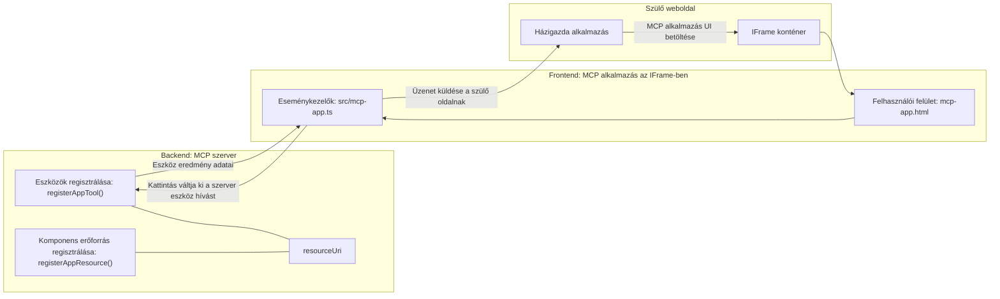

# MCP Alkalmazások

A MCP Apps egy új paradigma az MCP-ben. Az ötlet az, hogy nemcsak adatokat szolgáltatunk vissza egy eszköz hívásából, hanem információt is adunk arról, hogyan kell ezekkel az adatokkal interakcióba lépni. Ez azt jelenti, hogy az eszköz eredményei most már tartalmazhatnak UI információt is. De miért akarnánk ezt? Nos, fontolja meg, hogyan csinálja ma a dolgokat. Valószínűleg egy MCP Server eredményeit úgy használja, hogy valamilyen frontend kerül elé, amit Önnek kell megírnia és karbantartania. Ez néha épp így jó, de néha nagyszerű lenne, ha egy olyan önálló információdarabot hozhatna be, amely mindent tartalmaz az adatoktól a felhasználói felületig.

## Áttekintés

Ez a lecke gyakorlati útmutatást nyújt a MCP Apps-ről, arról, hogyan kezdje el használni és hogyan integrálja meglévő Webalkalmazásaiba. A MCP Apps egy nagyon új kiegészítés a MCP Standardhoz.

## Tanulási célok

A lecke végére képes lesz:

- Megmagyarázni, mik azok a MCP Apps.
- Mikor érdemes MCP Apps-t használni.
- Saját MCP Apps készítése és integrálása.

## MCP Apps - hogyan működik

Az MCP Apps ötlete az, hogy egy választ adjunk vissza, ami lényegében egy megjelenítendő komponens. Egy ilyen komponens rendelkezhet vizuális elemekkel és interaktivitással, például gombkattintásokkal, felhasználói bevitel feldolgozásával és még sok mással. Kezdjük a szerver oldallal és az MCP Serverrel. Egy MCP App komponens létrehozásához létre kell hoznia egy eszközt, illetve az alkalmazás erőforrást is. Ezt a két részt egy resourceUri köti össze.

Íme egy példa. Próbáljuk meg ábrázolni, mi tartozik ide és az egyes részek mit csinálnak:

```text
server.ts -- responsible for registering tools and the component as a UI component
src/
  mcp-app.ts -- wiring up event handlers
mcp-app.html -- the user interface
```

Ez a vizuális ábra az alkotórész létrehozásának architektúráját mutatja.


Próbáljuk meg ezután leírni a backend és a frontend felelősségeit külön-külön.

### A backend

Két dolgot kell itt megvalósítanunk:

- Regisztrálni azokat az eszközöket, amelyekkel interakcióba akarunk lépni.
- Meghatározni a komponenst.

**Az eszköz regisztrálása**

```typescript
registerAppTool(
    server,
    "get-time",
    {
      title: "Get Time",
      description: "Returns the current server time.",
      inputSchema: {},
      _meta: { ui: { resourceUri } }, // Összekapcsolja ezt az eszközt a hozzá tartozó UI erőforrással
    },
    async () => {
      const time = new Date().toISOString();
      return { content: [{ type: "text", text: time }] };
    },
  );

```

A fent látható kód a viselkedést írja le, ahol egy `get-time` nevű eszközt tesz elérhetővé. Ez nem vesz be bemenetet, de visszaadja az aktuális időt. Van lehetőségünk `inputSchema`-t definiálni olyan eszközökhöz, ahol felhasználói bemenetet kell fogadnunk.

**A komponens regisztrálása**

Ugyanabban a fájlban a komponenst is regisztrálnunk kell:

```typescript
const resourceUri = "ui://get-time/mcp-app.html";

// Regisztrálja az erőforrást, amely visszaadja az UI-hoz csomagolt HTML/JavaScript fájlt.
registerAppResource(
  server,
  resourceUri,
  resourceUri,
  { mimeType: RESOURCE_MIME_TYPE },
  async () => {
    const html = await fs.readFile(path.join(DIST_DIR, "mcp-app.html"), "utf-8");

    return {
    contents: [
        { uri: resourceUri, mimeType: RESOURCE_MIME_TYPE, text: html },
    ],
    };
  },
);
```

Vegye észre, hogy megemlítjük a `resourceUri`-t, amivel összekötjük a komponenst az eszközével. Érdekes még a callback rész, ahol betöltjük az UI fájlt és visszaadjuk a komponenst.

### A komponens frontend

Ahogy a backendnél, itt is két rész van:

- Egy frontend, amely tiszta HTML-ben íródott.
- Kód, amely kezeli az eseményeket és hogy mi történjen, pl. eszközök hívása vagy üzenetküldés a szülő ablaknak.

**Felhasználói felület**

Nézzük meg a felhasználói felületet.

```html
<!-- mcp-app.html -->
<!DOCTYPE html>
<html lang="en">
  <head>
    <meta charset="UTF-8" />
    <title>Get Time App</title>
  </head>
  <body>
    <p>
      <strong>Server Time:</strong> <code id="server-time">Loading...</code>
    </p>
    <button id="get-time-btn">Get Server Time</button>
    <script type="module" src="/src/mcp-app.ts"></script>
  </body>
</html>
```

**Eseménykezelés**

Az utolsó elem az eseménykezelés bekötése. Ez azt jelenti, hogy azonosítjuk, a UI mely részén kell eseménykezelőt rendelni, és mit tegyünk, ha esemény történik:

```typescript
// mcp-app.ts

import { App } from "@modelcontextprotocol/ext-apps";

// Elem referenciák lekérése
const serverTimeEl = document.getElementById("server-time")!;
const getTimeBtn = document.getElementById("get-time-btn")!;

// Alkalmazás példány létrehozása
const app = new App({ name: "Get Time App", version: "1.0.0" });

// A szerverről érkező eszköz eredmények kezelése. Állítsd be az `app.connect()` előtt, hogy elkerüld
// az első eszköz eredmény elvesztését.
app.ontoolresult = (result) => {
  const time = result.content?.find((c) => c.type === "text")?.text;
  serverTimeEl.textContent = time ?? "[ERROR]";
};

// Gomb kattintás bekötése
getTimeBtn.addEventListener("click", async () => {
  // Az `app.callServerTool()` lehetővé teszi a felület számára, hogy friss adatokat kérjen a szerverről
  const result = await app.callServerTool({ name: "get-time", arguments: {} });
  const time = result.content?.find((c) => c.type === "text")?.text;
  serverTimeEl.textContent = time ?? "[ERROR]";
});

// Kapcsolódás a hoszthoz
app.connect();
```

Ahogy az fent látható, ez normál kód arra, hogy DOM elemeket kapcsoljunk eseményekhez. Érdemes kiemelni a `callServerTool` hívást, ami végül egy eszközt hív meg a backend oldalon.

## Felhasználói bevitel kezelése

Eddig egy olyan komponenst láttunk, amelynek van egy gombja, ami kattintásra hív egy eszközt. Nézzük meg, tudunk-e több UI elemet hozzáadni, például egy input mezőt, és tudunk-e argumentumokat küldeni az eszköznek. Implementáljunk egy GYIK (FAQ) funkciót. Így kell működnie:

- Legyen egy gomb és egy input elem, ahova a felhasználó egy kulcsszót gépel, például "Szállítás", erre hív egy backend oldali eszközt, ami keres a GYIK adatbázisban.
- Egy olyan eszköz, ami támogatja a fent említett GYIK keresést.

Először adjuk hozzá a szükséges támogatást a backendhez:

```typescript
const faq: { [key: string]: string } = {
    "shipping": "Our standard shipping time is 3-5 business days.",
    "return policy": "You can return any item within 30 days of purchase.",
    "warranty": "All products come with a 1-year warranty covering manufacturing defects.",
  }

registerAppTool(
    server,
    "get-faq",
    {
      title: "Search FAQ",
      description: "Searches the FAQ for relevant answers.",
      inputSchema: zod.object({
        query: zod.string().default("shipping"),
      }),
      _meta: { ui: { resourceUri: faqResourceUri } }, // Összekapcsolja ezt az eszközt a felhasználói felület erőforrásával
    },
    async ({ query }) => {
      const answer: string = faq[query.toLowerCase()] || "Sorry, I don't have an answer for that.";
      return { content: [{ type: "text", text: answer }] };
    },
  );
```

Itt azt látjuk, hogyan töltjük ki az `inputSchema`-t és adunk neki egy `zod` séma például így:

```typescript
inputSchema: zod.object({
  query: zod.string().default("shipping"),
})
```

Ebben a sémában megjelöljük, hogy van egy bemeneti paraméterünk `query` névvel, amely opcionális, alapértelmezett értéke "shipping".

OK, lépjünk tovább a *mcp-app.html* fájlba, hogy megnézzük, milyen UI elemeket kell létrehoznunk:

```html
<div class="faq">
    <h1>FAQ response</h1>
    <p>FAQ Response: <code id="faq-response">Loading...</code></p>
    <input type="text" id="faq-query" placeholder="Enter FAQ query" />
    <button id="get-faq-btn">Get FAQ Response</button>
  </div>
```

Remek, most van input elemünk és gombunk. Nézzük meg a *mcp-app.ts* fájlt, hogy bekössük az eseményeket:

```typescript
const getFaqBtn = document.getElementById("get-faq-btn")!;
const faqQueryInput = document.getElementById("faq-query") as HTMLInputElement;

getFaqBtn.addEventListener("click", async () => {
  const query = faqQueryInput.value;
  const result = await app.callServerTool({ name: "get-faq", arguments: { query } });
  const faq = result.content?.find((c) => c.type === "text")?.text;
  faqResponseEl.textContent = faq ?? "[ERROR]";
});
```

A fenti kódban:

- Referenciákat hozunk létre az interaktív UI elemekhez.
- Kezeljük a gombkattintást, hogy kinyerjük az input mező értékét, és meghívjuk az `app.callServerTool()` metódust `name` és `arguments` paraméterekkel, ahol az utóbbi a `query` érték továbbítását jelenti.

Amikor a `callServerTool` hívás történik, egy üzenetet küld a szülő ablaknak, amely végül meghívja az MCP Servert.

### Próbálja ki

Ha kipróbáljuk, a következőt kell látnunk:


És itt például "warranty" inputtal:


A kód futtatásához látogasson el a [Kód részhez](./code/README.md)

## Tesztelés a Visual Studio Code-ban

A Visual Studio Code kiváló támogatást nyújt az MCP Apps-hez, és valószínűleg egyik legegyszerűbb módja az MCP Apps tesztelésének. A Visual Studio Code használatához adjon hozzá egy szerver bejegyzést a *mcp.json* fájlhoz így:

```json
"my-mcp-server-7178eca7": {
    "url": "http://localhost:3001/mcp",
    "type": "http"
  }
```

Indítsa el a szervert, és képes lesz kommunikálni az MCP App-jával a Chat Ablakon keresztül, feltéve, hogy telepítve van a GitHub Copilot.

Ezt triggerelheti prompttal, például "#get-faq":


És ugyanúgy, ahogy böngészőből futtatta, ugyanígy megjelenik:


## Feladat

Készítsen egy kő-papír-olló játékot, amely a következőkből áll:

UI:

- egy legördülő lista választható opciókkal
- egy gomb a választás elküldéséhez
- egy címke, ami megmutatja, ki mit választott és ki nyert

Szerver:

- legyen egy kő-papír-olló eszköz, amely bemenetként megkapja a "choice"-t. Renderelnie kell a számítógép választását is, és meg kell határoznia a győztest.

## Megoldás

[Megoldás](./assignment/README.md)

## Összefoglalás

Megismertük az MCP Apps új paradigmáját. Ez egy új megközelítés, amely lehetővé teszi, hogy az MCP Szerverek ne csak az adatokról, hanem azok megjelenítéséről is véleményt alkossanak.

Emellett megtanultuk, hogy ezek az MCP Apps IFrame-ben futnak, és az MCP Szerverekkel való kommunikációhoz üzeneteket kell küldeniük a szülő webalkalmazásnak. Számos könyvtár létezik sima JavaScripthez, Reacthez és másokhoz, amelyek megkönnyítik ezt a kommunikációt.

## Főbb tanulságok

Ezt tanulta meg:

- Az MCP Apps egy új szabvány, amely hasznos lehet, ha adatokat és UI funkciókat szeretne egyszerre szállítani.
- Ezek az alkalmazások biztonsági okokból IFrame-ben futnak.

## Mi következik

- [4. fejezet](../../04-PracticalImplementation/README.md)

---

<!-- CO-OP TRANSLATOR DISCLAIMER START -->
**Nyilatkozat**:  
Ez a dokumentum az AI fordítási szolgáltatás, a [Co-op Translator](https://github.com/Azure/co-op-translator) segítségével készült. Bár a pontosságra törekszünk, kérjük, vegye figyelembe, hogy az automatikus fordítások tartalmazhatnak hibákat vagy pontatlanságokat. Az eredeti dokumentum anyanyelvén tekintendő hiteles forrásnak. Fontos információk esetén professzionális emberi fordítást javaslunk. Nem vállalunk felelősséget a fordítás használatából eredő félreértésekért vagy félreértelmezésekért.
<!-- CO-OP TRANSLATOR DISCLAIMER END -->