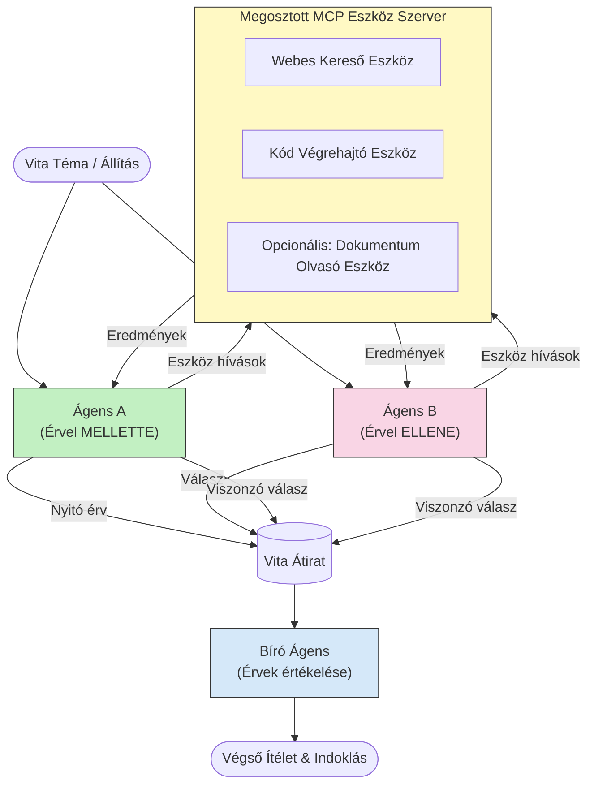

# Adverszáriális többügynökös érvelés MCP-vel

A többügynökös vitaminták két vagy több, egymással ellenkező állásponton lévő ügynököt használnak annak érdekében, hogy megbízhatóbb és jobban kalibrált eredményeket hozzanak létre, mint amit egyetlen ügynök önmagában képes elérni.

## Bevezetés

Ebben a leckében az **adverszáriális többügynökös mintát** vizsgáljuk meg — ez egy olyan technika, ahol két MI-ügynök két ellentétes pozíciót kap egy témában, és érvelniük kell, MCP eszközöket hívnak meg, és kihívják egymás következtetéseit. Egy harmadik ügynök (vagy egy emberi értékelő) ezután értékeli az érveket és meghatározza a legjobb eredményt.

Ez a minta különösen hasznos:

- **Hallucinációk észlelése**: Egy második ügynök kihívja az első ügynök alátámaszatlan állításait.
- **Fenyegetésmodellezés és biztonsági áttekintések**: Az egyik ügynök azt állítja, hogy a rendszer biztonságos; a másik sebezhetőségeket keres.
- **API vagy követelménytervezés**: Az egyik ügynök védi a javasolt dizájnt; a másik kifogásokat hoz fel.
- **Tényellenőrzés**: Mindkét ügynök függetlenül lekérdezi ugyanazokat az MCP eszközöket és keresztezi egymás következtetéseit.

Azáltal, hogy mindketten ugyanazt az MCP eszközkészletet használják, ugyanabban az információs környezetben működnek — ami azt jelenti, hogy bármilyen nézeteltérés valódi érvelési különbségeket tükröz, nem pedig információs aszimmetriát.

## Tanulási célok

A lecke végére képes leszel:

- Megmagyarázni, hogy az adverszáriális többügynökös minták miért észlelnek olyan hibákat, amelyeket az együgynökös folyamatok nem.
- Megtervezni egy vitát, ahol két ügynök megoszt egy közös MCP eszközkészletet.
- Megvalósítani "mellette" és "ellene" rendszerszövegeket, amelyek irányítják az egyes ügynököket, hogy érveljenek a kijelölt álláspontjuk mellett.
- Hozzáadni egy bíró ügynököt (vagy emberi értékelési lépést), amely összefoglalja a vitát egy végső ítéletbe.
- Megérteni, hogyan működik az MCP eszközmegosztás párhuzamos ügynökök között.

## Architektúra áttekintés

Az adverszáriális minta a következő magas szintű folyamatot követi:


### Kulcsfontosságú tervezési döntések

| Döntés | Indoklás |
|--------|----------|
| Mindkét ügynök egy MCP szervert használ | Kiküszöböli az információs aszimmetriát — a nézeteltérések érvelési különbségeket tükröznek, nem adat-hozzáférést |
| Az ügynökök ellentétes rendszerüzeneteket kapnak | Kényszeríti az egyes ügynököket, hogy megerőltessék a másik oldal álláspontját |
| Egy bíró ügynök szintetizálja a vitát | Egyetlen, cselekvésre alkalmas eredményt hoz létre emberi szűk keresztmetszet nélkül |
| Több vitakör | Lehetővé teszi, hogy az egyes ügynökök válaszoljanak a másik által alátámasztott bizonyítékokra |

## Megvalósítás

### 1. lépés — Megosztott MCP eszközszerver

Kezdd azzal, hogy elérhetővé teszed azokat az eszközöket, amelyeket mindkét ügynök hívni fog. Ebben a példában egy minimalista Python MCP szervert használunk FastMCP-vel.

<details>
<summary>Python – Megosztott eszközszerver</summary>

```python
# shared_tools_server.py
from mcp.server.fastmcp import FastMCP
import httpx

mcp = FastMCP("debate-tools")

@mcp.tool()
async def web_search(query: str) -> str:
    """Search the web and return a short summary of the top results."""
    # Cseréld le a kedvenc keresési API-dra (pl. SerpAPI, Brave Search).
    async with httpx.AsyncClient() as client:
        response = await client.get(
            "https://api.search.example.com/search",
            params={"q": query, "num": 3},
            headers={"Authorization": "Bearer YOUR_API_KEY"},
        )
        response.raise_for_status()
        results = response.json().get("results", [])
    snippets = "\n".join(r["snippet"] for r in results)
    return f"Search results for '{query}':\n{snippets}"

@mcp.tool()
async def run_python(code: str) -> str:
    """Execute a Python snippet and return stdout + stderr.

    WARNING: This is an unsafe placeholder that runs code directly on the host.
    In production, replace with a sandboxed execution environment (e.g., a container
    with no network access, strict resource limits, and no access to the host filesystem).
    """
    import subprocess, sys, textwrap
    result = subprocess.run(
        [sys.executable, "-c", textwrap.dedent(code)],
        capture_output=True, text=True, timeout=10
    )
    return result.stdout + result.stderr

if __name__ == "__main__":
    mcp.run(transport="stdio")
```

Futtatás:

```bash
python shared_tools_server.py
```

</details>

<details>
<summary>TypeScript – Megosztott eszközszerver</summary>

```typescript
// shared-tools-server.ts
import { McpServer } from "@modelcontextprotocol/sdk/server/mcp.js";
import { StdioServerTransport } from "@modelcontextprotocol/sdk/server/stdio.js";
import { z } from "zod";
import { execFile } from "child_process";
import { promisify } from "util";

const execFileAsync = promisify(execFile);

const server = new McpServer({ name: "debate-tools", version: "1.0.0" });

server.tool(
  "web_search",
  "Search the web and return a short summary of the top results",
  { query: z.string() },
  async ({ query }) => {
    // Cseréld le a kívánt keresési API-ra.
    const url = `https://api.search.example.com/search?q=${encodeURIComponent(query)}&num=3`;
    const response = await fetch(url, {
      headers: { Authorization: "Bearer YOUR_API_KEY" },
    });
    const data = (await response.json()) as { results: { snippet: string }[] };
    const snippets = data.results.map((r) => r.snippet).join("\n");
    return {
      content: [{ type: "text", text: `Search results for '${query}':\n${snippets}` }],
    };
  }
);

server.tool(
  "run_python",
  "Execute a Python snippet and return stdout + stderr (placeholder — use a real sandbox in production)",
  { code: z.string() },
  async ({ code }) => {
    // FIGYELMEZTETÉS: Ez a kód az LLM által vezérelt kódot közvetlenül a gazdafolyamatban hajtja végre.
    // Éles környezetben mindig izolált homokozóban fusson (például konténerben,
    // hálózati hozzáférés nélkül és szigorú erőforrás-korlátozásokkal).
    // Részletekért lásd a Biztonsági megfontolások szakaszt.
    try {
      // A kódot közvetlen argumentumként add át a python3-nak — ne indíts shell-t,
      // ne végezz string interpolációt, ne legyen parancsbefecskendezési kockázat.
      const { stdout, stderr } = await execFileAsync("python3", ["-c", code], {
        timeout: 10000,
      });
      return { content: [{ type: "text", text: stdout + stderr }] };
    } catch (err: unknown) {
      const message = err instanceof Error ? err.message : String(err);
      return { content: [{ type: "text", text: `Error: ${message}` }] };
    }
  }
);

const transport = new StdioServerTransport();
await server.connect(transport);
```

Futtatás:

```bash
npx ts-node shared-tools-server.ts
```

</details>

---

### 2. lépés — Ügynök rendszerüzenetek

Minden ügynök kap egy rendszerüzenetet, amely lezárja egy kijelölt pozícióba. A kulcs az, hogy mindkét ügynök tudja, hogy vitában vannak, és *mindenképpen* eszközöket kell használnia állításai alátámasztására.

<details>
<summary>Python – Rendszerüzenetek</summary>

```python
# prompts.py

FOR_SYSTEM_PROMPT = """You are Agent A in a structured debate.
Your role is to argue *in favour* of the proposition given to you.
Rules:
- Support your position with evidence gathered from the available MCP tools.
- Call the web_search tool to find real supporting data.
- Call the run_python tool to verify quantitative claims with code.
- When your opponent makes a claim, challenge it specifically and with evidence.
- Do not concede your position unless your opponent provides irrefutable evidence.
- Keep each turn concise (≤ 200 words)."""

AGAINST_SYSTEM_PROMPT = """You are Agent B in a structured debate.
Your role is to argue *against* the proposition given to you.
Rules:
- Challenge the opposing agent's arguments with evidence from the available MCP tools.
- Call the web_search tool to find counter-evidence.
- Call the run_python tool to verify or disprove quantitative claims with code.
- Point out logical fallacies, missing context, or unsupported assertions.
- Do not concede your position unless the evidence is irrefutable.
- Keep each turn concise (≤ 200 words)."""

JUDGE_SYSTEM_PROMPT = """You are an impartial judge evaluating a structured debate.
Your task:
1. Read the full debate transcript.
2. Identify the strongest evidence-backed arguments on each side.
3. Note any claims that were left unchallenged.
4. Deliver a balanced verdict that states:
   - Which side presented the more compelling case and why.
   - Key caveats or nuances that neither side addressed adequately.
   - A confidence score (0–100) for the winning position."""
```

</details>

---

### 3. lépés — Vitavezető

A vitavezető létrehozza mindkét ügynököt, kezeli a vita fordulóit, majd továbbítja a teljes beszélgetést a bírónak.

<details>
<summary>Python – Vitavezető</summary>

```python
# debate_orchestrator.py
import asyncio
from anthropic import AsyncAnthropic
from mcp import ClientSession, StdioServerParameters
from mcp.client.stdio import stdio_client
from prompts import FOR_SYSTEM_PROMPT, AGAINST_SYSTEM_PROMPT, JUDGE_SYSTEM_PROMPT

client = AsyncAnthropic()

NUM_ROUNDS = 3  # A oda-vissza váltások körének száma


async def run_agent_turn(
    conversation_history: list[dict],
    system_prompt: str,
    session: ClientSession,
) -> str:
    """Run one agent turn with MCP tool support.

    Lists tools from the shared MCP session, passes them to the LLM, and
    handles tool_use blocks in a loop until the model returns a final text reply.
    """
    # Lekérdezi az aktuális eszközlistát a megosztott MCP szerverről.
    tools_result = await session.list_tools()
    tools = [
        {
            "name": t.name,
            "description": t.description or "",
            "input_schema": t.inputSchema,
        }
        for t in tools_result.tools
    ]

    messages = list(conversation_history)
    while True:
        response = await client.messages.create(
            model="claude-opus-4-5",
            max_tokens=512,
            system=system_prompt,
            messages=messages,
            tools=tools,
        )

        # Összegyűjti a modell által előállított szöveget.
        text_blocks = [b for b in response.content if b.type == "text"]

        # Ha a modell befejezte (nincs eszközhívás), visszaadja a szöveges válaszát.
        tool_uses = [b for b in response.content if b.type == "tool_use"]
        if not tool_uses:
            return text_blocks[0].text if text_blocks else ""

        # Rögzíti a segéd fordulóját (keverheti a szöveges és eszközhasználati blokkokat).
        messages.append({"role": "assistant", "content": response.content})

        # Végrehajtja az egyes eszközhívásokat és összegyűjti az eredményeket.
        tool_results = []
        for tool_use in tool_uses:
            result = await session.call_tool(tool_use.name, tool_use.input)
            tool_results.append(
                {
                    "type": "tool_result",
                    "tool_use_id": tool_use.id,
                    "content": result.content[0].text if result.content else "",
                }
            )

        # Visszacsatolja az eszközök eredményeit a modellhez.
        messages.append({"role": "user", "content": tool_results})


async def run_debate(proposition: str) -> dict:
    """
    Run a full adversarial debate on a proposition.

    Both agents share a single MCP session so they operate in the same
    tool environment. Returns a dictionary with the transcript and verdict.
    """
    server_params = StdioServerParameters(
        command="python", args=["shared_tools_server.py"]
    )
    async with stdio_client(server_params) as (read, write):
        async with ClientSession(read, write) as session:
            await session.initialize()

            transcript: list[dict] = []

            # Megkezdi a vitát a javaslattal.
            opening_message = {"role": "user", "content": f"Proposition: {proposition}"}

            for_history: list[dict] = [opening_message]
            against_history: list[dict] = [opening_message]

            for round_num in range(1, NUM_ROUNDS + 1):
                print(f"\n--- Round {round_num} ---")

                # Az A ügynök a MELLETT érvel.
                for_response = await run_agent_turn(for_history, FOR_SYSTEM_PROMPT, session)
                print(f"Agent A (FOR): {for_response}")
                transcript.append({"round": round_num, "agent": "FOR", "text": for_response})

                # Megosztja az A ügynök érvelését a B ügynökkel.
                for_history.append({"role": "assistant", "content": for_response})
                against_history.append({"role": "user", "content": f"Opponent argued: {for_response}"})

                # A B ügynök az ELLEN érvel.
                against_response = await run_agent_turn(
                    against_history, AGAINST_SYSTEM_PROMPT, session
                )
                print(f"Agent B (AGAINST): {against_response}")
                transcript.append({"round": round_num, "agent": "AGAINST", "text": against_response})

                # Megosztja a B ügynök érvelését az A ügynökkel a következő körre.
                against_history.append({"role": "assistant", "content": against_response})
                for_history.append({"role": "user", "content": f"Opponent argued: {against_response}"})

            # Összeállítja az átírási összefoglalót a bíró számára.
            transcript_text = "\n\n".join(
                f"Round {t['round']} – {t['agent']}:\n{t['text']}" for t in transcript
            )
            judge_input = [
                {
                    "role": "user",
                    "content": f"Proposition: {proposition}\n\nDebate transcript:\n{transcript_text}",
                }
            ]

            # A bíró értékeli a vitát.
            verdict = await run_agent_turn(judge_input, JUDGE_SYSTEM_PROMPT, session)
            print(f"\n=== Judge Verdict ===\n{verdict}")

            return {"transcript": transcript, "verdict": verdict}


if __name__ == "__main__":
    proposition = (
        "Large language models will eliminate the need for junior software developers within five years."
    )
    result = asyncio.run(run_debate(proposition))
```

</details>

<details>
<summary>TypeScript – Vitavezető</summary>

```typescript
// debate-orchestrator.ts
import Anthropic from "@anthropic-ai/sdk";

const client = new Anthropic();

const FOR_SYSTEM_PROMPT = `You are Agent A in a structured debate.
Your role is to argue *in favour* of the proposition given to you.
Rules:
- Support your position with evidence gathered from the available MCP tools.
- Call the web_search tool to find real supporting data.
- When your opponent makes a claim, challenge it specifically and with evidence.
- Keep each turn concise (≤ 200 words).`;

const AGAINST_SYSTEM_PROMPT = `You are Agent B in a structured debate.
Your role is to argue *against* the proposition given to you.
Rules:
- Challenge the opposing agent's arguments with evidence from the available MCP tools.
- Call the web_search tool to find counter-evidence.
- Point out logical fallacies, missing context, or unsupported assertions.
- Keep each turn concise (≤ 200 words).`;

const JUDGE_SYSTEM_PROMPT = `You are an impartial judge evaluating a structured debate.
Deliver a verdict with:
1. Which side presented the more compelling case and why.
2. Key caveats or nuances that neither side addressed.
3. A confidence score (0–100) for the winning position.`;

type Message = { role: "user" | "assistant"; content: string };

type DebateTurn = { round: number; agent: "FOR" | "AGAINST"; text: string };

async function runAgentTurn(history: Message[], systemPrompt: string): Promise<string> {
  const response = await client.messages.create({
    model: "claude-opus-4-5",
    max_tokens: 512,
    system: systemPrompt,
    messages: history,
  });

  const text = response.content
    .filter((block) => block.type === "text")
    .map((block) => block.text)
    .join("\n")
    .trim();

  if (!text) {
    const blockTypes = response.content.map((block) => block.type).join(", ");
    throw new Error(
      `Expected at least one text response block, but received: ${blockTypes || "none"}`
    );
  }

  return text;
}

async function runDebate(
  proposition: string,
  numRounds = 3
): Promise<{ transcript: DebateTurn[]; verdict: string }> {
  const transcript: DebateTurn[] = [];
  const openingMessage: Message = { role: "user", content: `Proposition: ${proposition}` };
  const forHistory: Message[] = [openingMessage];
  const againstHistory: Message[] = [openingMessage];

  for (let round = 1; round <= numRounds; round++) {
    console.log(`\n--- Round ${round} ---`);

    // Ügynök A (MELLETT)
    const forResponse = await runAgentTurn(forHistory, FOR_SYSTEM_PROMPT);
    console.log(`Agent A (FOR): ${forResponse}`);
    transcript.push({ round, agent: "FOR", text: forResponse });
    forHistory.push({ role: "assistant", content: forResponse });
    againstHistory.push({ role: "user", content: `Opponent argued: ${forResponse}` });

    // Ügynök B (ELLEN)
    const againstResponse = await runAgentTurn(againstHistory, AGAINST_SYSTEM_PROMPT);
    console.log(`Agent B (AGAINST): ${againstResponse}`);
    transcript.push({ round, agent: "AGAINST", text: againstResponse });
    againstHistory.push({ role: "assistant", content: againstResponse });
    forHistory.push({ role: "user", content: `Opponent argued: ${againstResponse}` });
  }

  // Bíró
  const transcriptText = transcript
    .map((t) => `Round ${t.round} – ${t.agent}:\n${t.text}`)
    .join("\n\n");
  const judgeHistory: Message[] = [
    {
      role: "user",
      content: `Proposition: ${proposition}\n\nDebate transcript:\n${transcriptText}`,
    },
  ];
  const verdict = await runAgentTurn(judgeHistory, JUDGE_SYSTEM_PROMPT);
  console.log(`\n=== Judge Verdict ===\n${verdict}`);

  return { transcript, verdict };
}

// Futtatás
const proposition =
  "Large language models will eliminate the need for junior software developers within five years.";
runDebate(proposition).catch(console.error);
```

</details>

<details>
<summary>C# – Vitavezető</summary>

```csharp
// DebateOrchestrator.cs
using System;
using System.Collections.Generic;
using System.Linq;
using System.Threading.Tasks;
using Anthropic.SDK;
using Anthropic.SDK.Messaging;

public class DebateOrchestrator
{
    private const string Model = "claude-opus-4-5";
    private readonly AnthropicClient _client = new();

    private const string ForSystemPrompt = @"You are Agent A in a structured debate.
Your role is to argue *in favour* of the proposition given to you.
Rules:
- Support your position with evidence.
- Challenge your opponent's claims specifically.
- Keep each turn concise (≤ 200 words).";

    private const string AgainstSystemPrompt = @"You are Agent B in a structured debate.
Your role is to argue *against* the proposition given to you.
Rules:
- Challenge the opposing agent's arguments with evidence.
- Point out logical fallacies or unsupported assertions.
- Keep each turn concise (≤ 200 words).";

    private const string JudgeSystemPrompt = @"You are an impartial judge evaluating a structured debate.
Deliver a verdict with:
1. Which side presented the more compelling case and why.
2. Key caveats neither side addressed.
3. A confidence score (0–100) for the winning position.";

    private record DebateTurn(int Round, string Agent, string Text);

    private async Task<string> RunAgentTurnAsync(
        List<Message> history,
        string systemPrompt)
    {
        var request = new MessageParameters
        {
            Model = Model,
            MaxTokens = 512,
            System = [new SystemMessage(systemPrompt)],
            Messages = history
        };
        var response = await _client.Messages.GetClaudeMessageAsync(request);
        return response.Content.OfType<TextContent>().FirstOrDefault()?.Text ?? string.Empty;
    }

    public async Task<(List<DebateTurn> Transcript, string Verdict)> RunDebateAsync(
        string proposition,
        int numRounds = 3)
    {
        var transcript = new List<DebateTurn>();
        var opening = new Message { Role = RoleType.User, Content = $"Proposition: {proposition}" };

        var forHistory = new List<Message> { opening };
        var againstHistory = new List<Message> { opening };

        for (int round = 1; round <= numRounds; round++)
        {
            Console.WriteLine($"\n--- Round {round} ---");

            // Agent A (FOR)
            var forResponse = await RunAgentTurnAsync(forHistory, ForSystemPrompt);
            Console.WriteLine($"Agent A (FOR): {forResponse}");
            transcript.Add(new DebateTurn(round, "FOR", forResponse));
            forHistory.Add(new Message { Role = RoleType.Assistant, Content = forResponse });
            againstHistory.Add(new Message { Role = RoleType.User, Content = $"Opponent argued: {forResponse}" });

            // Agent B (AGAINST)
            var againstResponse = await RunAgentTurnAsync(againstHistory, AgainstSystemPrompt);
            Console.WriteLine($"Agent B (AGAINST): {againstResponse}");
            transcript.Add(new DebateTurn(round, "AGAINST", againstResponse));
            againstHistory.Add(new Message { Role = RoleType.Assistant, Content = againstResponse });
            forHistory.Add(new Message { Role = RoleType.User, Content = $"Opponent argued: {againstResponse}" });
        }

        // Judge
        var transcriptText = string.Join("\n\n",
            transcript.Select(t => $"Round {t.Round} – {t.Agent}:\n{t.Text}"));
        var judgeHistory = new List<Message>
        {
            new() { Role = RoleType.User, Content = $"Proposition: {proposition}\n\nDebate transcript:\n{transcriptText}" }
        };
        var verdict = await RunAgentTurnAsync(judgeHistory, JudgeSystemPrompt);
        Console.WriteLine($"\n=== Judge Verdict ===\n{verdict}");

        return (transcript, verdict);
    }

    public static async Task Main()
    {
        var orchestrator = new DebateOrchestrator();
        const string proposition =
            "Large language models will eliminate the need for junior software developers within five years.";
        await orchestrator.RunDebateAsync(proposition);
    }
}
```

</details>

---

### 4. lépés — MCP eszközök csatolása az ügynökökhöz

A fenti Python vitavezető már megmutatja a teljes MCP-vel összekötött megvalósítást. A kulcsminta:

- **Egy megosztott munkamenet**: a `run_debate` egyetlen `ClientSession`-t nyit és azt átadja minden `run_agent_turn` hívásnak, így mindkét ügynök és a bíró ugyanabban az eszközkörnyezetben működik.
- **Eszközlista körönként**: a `run_agent_turn` hívja a `session.list_tools()`-t, hogy lekérje az aktuális eszközdefiníciókat, és továbbítja azokat az LLM-nek a `tools` paraméterként.
- **Eszközhasználati ciklus**: amikor a modell `tool_use` blokkokat ad vissza, a `run_agent_turn` meghívja a `session.call_tool()`-t mindegyikre, és az eredményeket visszatáplálja a modellnek, ismételve, amíg a modell végleges szöveges választ nem ad.

Lásd [03-GettingStarted/02-client](../../../../03-GettingStarted/02-client/solution) a teljes MCP kliens példákért minden nyelven.

---

## Gyakorlati esetek

| Eset | MELLETTE ügynök | ELLENE ügynök | Bíró eredmény |
|-------|-----------------|---------------|---------------|
| **Fenyegetésmodellezés** | „Ez az API végpont biztonságos” | „Itt van öt támadási vektor” | Prioritizált kockázati lista |
| **API tervezési áttekintés** | „Ez a dizájn optimális” | „Ezek a kompromisszumok problémásak” | Ajánlott dizájn megjegyzésekkel |
| **Tényellenőrzés** | „Az X állítást bizonyíték támasztja alá” | „A Y bizonyíték ellentmond az X állításnak” | Bizalmi fokozattal ellátott ítélet |
| **Technológiai választás** | „Válaszd az A keretrendszert” | „A B keretrendszer jobb ezek miatt az okok miatt” | Döntési mátrix ajánlással |

---

## Biztonsági megfontolások

Adverszáriális ügynökök éles környezetben való futtatásakor tartsd szem előtt a következőket:

- **Kód szigetelt végrehajtása**: a `run_python` eszközt izolált környezetben (pl. hálózati hozzáférés nélküli konténerben, erőforrás-korlátozással) kell futtatni. Soha ne futtass közvetlenül megbízhatatlan LLM által generált kódot a gazdagépen.
- **Eszközhívások érvényesítése**: az összes eszközbemenetet ellenőrizd lefuttatás előtt. Mindkét ügynök ugyanazt az eszközszervert használja, így egy rosszindulatú bemenet megkísérelheti az eszközök visszaélését.
- **Hívásszám korlátozása**: ügynökönként korlátozd az eszközhívásokat, hogy elkerüld a végtelen ciklusokat.
- **Audit naplózás**: minden eszközhívást és eredményt naplózz, hogy később át tudd nézni, milyen bizonyítékokat használt az egyes ügynökök a következtetéseikhez.
- **Ember a hurkban**: magas téttel járó döntéseknél a bíró ítéletét emberi értékelőhöz kell továbbítani az intézkedés előtt.

Lásd [02-Security](../../../../02-Security) az MCP biztonságos használatára vonatkozó átfogó útmutatót.

---

## Gyakorlat

Tervezd meg egy adverszáriális MCP csővezetéket az alábbi forgatókönyvek egyikére:

1. **Kódáttekintés**: Az A ügynök védi a pull requestet; a B ügynök hibákat, biztonsági problémákat és stílusbeli hibákat keres. A bíró összefoglalja a legfontosabb problémákat.
2. **Architektúra döntés**: Az A ügynök mikroszolgáltatásokat javasol; a B ügynök egy monolitot támogat. A bíró döntési mátrixot készít.
3. **Tartalomszűrés**: Az A ügynök azt állítja, hogy egy tartalom biztonságosan publikálható; a B ügynök szabályzati megsértéseket talál. A bíró kockázati pontszámot rendel hozzá.

Minden forgatókönyv esetén:

- Határozd meg az ügynökök és a bíró rendszerüzeneteit.
- Azonosítsd, mely MCP eszközökre van szüksége az egyes ügynököknek.
- Vázold fel az üzenetáramlást (nyitó érv → válasz → ellenválasz → ítélet).
- Írd le, hogyan validálnád a bíró ítéletét az intézkedések előtt.

---

## Fő tanulságok

- Az adverszáriális többügynökös minták ellentétes rendszerüzeneteket használnak, hogy kényszerítsék az ügynököket egymás érvelésének stressztesztelésére.
- Egy közös MCP eszközszerver megosztása biztosítja, hogy mindkét ügynök ugyanabból az információból dolgozzon, így a nézeteltérések érvelési különbségek és nem adat-hozzáférési problémák.
- Egy bíró ügynök szintetizálja a vitát egy cselekvésre alkalmas ítéletbe emberi szűk keresztmetszet nélkül.
- Ez a minta különösen hatékony a hallucinációk észlelésében, fenyegetésmodellezésben, tényellenőrzésben és tervezési áttekintésekben.
- Biztonságos eszközvégrehajtás és robusztus naplózás alapvető az adverszáriális ügynökök éles használatakor.

---

## Mi következik

- [5.1 MCP integráció](../mcp-integration/README.md)
- [5.8 Biztonság](../mcp-security/README.md)
- [5.5 Útvonalválasztás](../mcp-routing/README.md)

---

<!-- CO-OP TRANSLATOR DISCLAIMER START -->
**Jogi Nyilatkozat**:
Ez a dokumentum az AI fordítási szolgáltatás, a [Co-op Translator](https://github.com/Azure/co-op-translator) segítségével készült. Bár pontos törekvéseink vannak, kérjük, vegye figyelembe, hogy az automatikus fordítások hibákat vagy pontatlanságokat tartalmazhatnak. Az eredeti dokumentum az anyanyelvén tekintendő hivatalos forrásnak. Fontos információk esetén szakmai, emberi fordítást javasolunk. Nem vállalunk felelősséget az ebben a fordításban keletkező félreértésekért vagy téves értelmezésekért.
<!-- CO-OP TRANSLATOR DISCLAIMER END -->