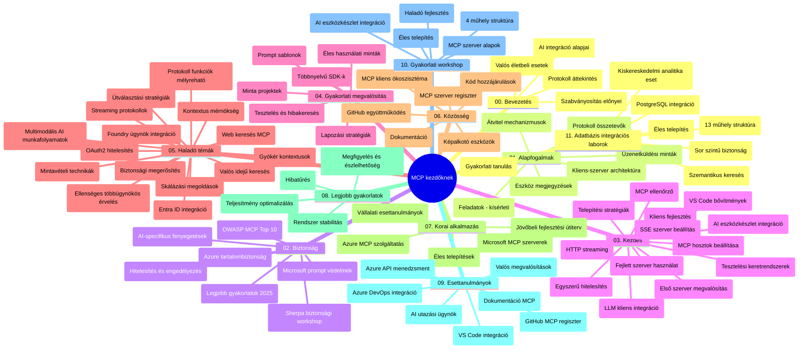

# Model Context Protocol (MCP) kezdőknek - Tanulmányi útmutató

Ez a tanulmányi útmutató áttekintést nyújt a "Model Context Protocol (MCP) kezdőknek" tananyag tárházának felépítéséről és tartalmáról. Használd ezt az útmutatót a tárház hatékony böngészéséhez és a rendelkezésre álló erőforrások maximális kihasználásához.

## Tárház áttekintése

A Model Context Protocol (MCP) egy szabványosított keretrendszer az AI modellek és kliensalkalmazások közötti interakciókhoz. Eredetileg az Anthropic hozta létre, az MCP-t most a szélesebb MCP közösség tartja karban az hivatalos GitHub szervezet révén. Ez a tárház átfogó tananyagot kínál kézzel fogható kódpéldákkal C#, Java, JavaScript, Python és TypeScript nyelveken, amelyek AI fejlesztőknek, rendszertervezőknek és szoftvermérnököknek szólnak.

## Vizuális tananyagtérkép

## Tárház szerkezete

A tárház tizenegy fő részre van tagolva, amelyek mindegyike az MCP különböző aspektusaira fókuszál:

1. **Bevezetés (00-Introduction/)**
   - A Model Context Protocol áttekintése
   - Miért fontos a szabványosítás az AI folyamatokban
   - Gyakorlati felhasználási esetek és előnyök

2. **Alapfogalmak (01-CoreConcepts/)**
   - Kliens-szerver architektúra
   - Fő protokollelemek
   - Üzenetküldési minták az MCP-ben

3. **Biztonság (02-Security/)**
   - MCP-alapú rendszerek biztonsági fenyegetései
   - Legjobb gyakorlatok a biztonságos megvalósításokhoz
   - Hitelesítési és jogosultságkezelési stratégiák
   - **Átfogó biztonsági dokumentáció**:
     - MCP Biztonsági Legjobb Gyakorlatok 2025
     - Azure Tartalombiztonsági Megvalósítási Útmutató
     - MCP Biztonsági Ellenőrzések és Technikák
     - MCP Legjobb Gyakorlatok Gyorsreferencia
   - **Kulcsfontosságú biztonsági témák**:
     - Prompt injekció és eszközmérgezéses támadások
     - Munkamenet eltérítés és zavart helyettesítő problémák
     - Token átjáró sérülékenységek
     - Túlzott jogosultságok és hozzáférés-vezérlés
     - AI komponensek ellátási láncának biztonsága
     - Microsoft Prompt Shields integráció

4. **Első lépések (03-GettingStarted/)**
   - Környezet beállítása és konfigurálása
   - Alapvető MCP szerverek és kliensek létrehozása
   - Integráció meglévő alkalmazásokkal
   - Tartalmazza a következő szakaszokat:
     - Első szerver implementáció
     - Kliens fejlesztés
     - LLM kliens integráció
     - VS Code integráció
     - Server-Sent Events (SSE) szerver
     - Haladó szerver használat
     - HTTP streaming
     - AI Toolkit integráció
     - Tesztelési stratégiák
     - Telepítési irányelvek

5. **Gyakorlati megvalósítás (04-PracticalImplementation/)**
   - SDK-k használata különböző programozási nyelveken
   - Hibakeresési, tesztelési és validációs technikák
   - Újrahasználható prompt sablonok és munkafolyamatok készítése
   - Minta projektek megvalósítási példákkal

6. **Haladó témák (05-AdvancedTopics/)**
   - Kontextus mérnöki technikák
   - Foundry ügynök integráció
   - Többmodalitású AI munkafolyamatok
   - OAuth2 hitelesítési demók
   - Valós idejű keresési képességek
   - Valós idejű streaming
   - Gyökér kontextusok megvalósítása
   - Routing stratégiák
   - Mintavételezési technikák
   - Skálázási megközelítések
   - Biztonsági szempontok
   - Entra ID biztonsági integráció
   - Webes keresési integráció
   - Ellenséges többügynökös érvelés (vita-mintázatok)

7. **Közösségi hozzájárulások (06-CommunityContributions/)**
   - Hogyan járulhatsz hozzá kód és dokumentáció formájában
   - Együttműködés GitHub-on keresztül
   - Közösség-vezérelt fejlesztések és visszajelzések
   - Különféle MCP kliensek használata (Claude Desktop, Cline, VSCode)
   - Népszerű MCP szerverekkel való munka, beleértve képgenerálást is

8. **Korai bevezetés tapasztalatai (07-LessonsfromEarlyAdoption/)**
   - Valós világban megvalósított példák és sikertörténetek
   - MCP-alapú megoldások építése és telepítése
   - Trendek és jövőbeli útiterv
   - **Microsoft MCP Szerverek Útmutatója**: Átfogó ismertető 10 éles Microsoft MCP szerverhez, beleértve:
     - Microsoft Learn Docs MCP Szerver
     - Azure MCP Szerver (15+ speciális csatlakozó)
     - GitHub MCP Szerver
     - Azure DevOps MCP Szerver
     - MarkItDown MCP Szerver
     - SQL Server MCP Szerver
     - Playwright MCP Szerver
     - Dev Box MCP Szerver
     - Azure AI Foundry MCP Szerver
     - Microsoft 365 Agents Toolkit MCP Szerver

9. **Legjobb gyakorlatok (08-BestPractices/)**
   - Teljesítményhangolás és optimalizáció
   - Hibabiztos MCP rendszerek tervezése
   - Tesztelési és ellenálló képesség stratégiák

10. **Esettanulmányok (09-CaseStudy/)**
    - **Hét átfogó esettanulmány** az MCP sokoldalúságának bemutatására különböző helyzetekben:
    - **Azure AI Utazási Ügynökök**: Többügynökös koordináció Azure OpenAI és AI kereséssel
    - **Azure DevOps Integráció**: Munkafolyamat automatizálás YouTube adatfrissítésekkel
    - **Valós idejű dokumentum lekérdezés**: Python konzol kliens HTTP streaminggel
    - **Interaktív tanulási terv generátor**: Chainlit webalkalmazás konverzációs AI-val
    - **Szerkesztőn belüli dokumentáció**: VS Code integráció GitHub Copilot munkafolyamatokkal
    - **Azure API Menedzsment**: Vállalati API integráció MCP szerver létrehozással
    - **GitHub MCP Regiszter**: Ökoszisztéma fejlesztés és ügynöki integrációs platform
    - Megvalósítási példák vállalati integrációról, fejlesztői hatékonyságról és ökoszisztéma fejlesztésről

11. **Gyakorlati workshop (10-StreamliningAIWorkflowsBuildingAnMCPServerWithAIToolkit/)**
    - Átfogó gyakorlati workshop az MCP és AI Toolkit kombinációjával
    - Intelligens alkalmazások építése az AI modellek és valós eszközök között
    - Gyakorlati modulok az alapoktól, egyedi szerverfejlesztésen át az üzembe helyezési stratégiákig
    - **Lab felépítés**:
      - Lab 1: MCP szerver alapjai
      - Lab 2: Haladó MCP szerver fejlesztés
      - Lab 3: AI Toolkit integráció
      - Lab 4: Üzembe helyezés és skálázás
    - Labor-alapú tanulási megközelítés lépésenkénti utasításokkal

12. **MCP szerver adatbázisintegrációs laborok (11-MCPServerHandsOnLabs/)**
    - **Átfogó 13-laboros tanulási útvonal** produkcióra kész MCP szerverek építéséhez PostgreSQL integrációval
    - **Valós kereskedelmi elemzés megvalósítás** a Zava Retail esettanulmány alapján
    - **Vállalati szintű minták**, beleértve Row Level Security (RLS), szemantikus keresést és több bérlős adat-hozzáférést
    - **Teljes labor felépítés**:
      - **Lab 00-03: Alapok** - Bevezetés, Architektúra, Biztonság, Környezet beállítása
      - **Lab 04-06: MCP szerver építése** - Adatbázis tervezés, MCP szerver megvalósítás, eszközfejlesztés
      - **Lab 07-09: Haladó funkciók** - Szemantikus keresés, tesztelés és hibakeresés, VS Code integráció
      - **Lab 10-12: Termelés és legjobb gyakorlatok** - Telepítés, monitorozás, optimalizáció
    - **Foglalt technológiák**: FastMCP keretrendszer, PostgreSQL, Azure OpenAI, Azure Container Apps, Application Insights
    - **Tanulási eredmények**: Produkcióra kész MCP szerverek, adatbázis integrációs minták, AI-alapú elemzés, vállalati biztonság

## További források

A tárház tartalmaz támogató erőforrásokat:

- **Képek mappa**: Diagramok és illusztrációk a teljes tananyag során
- **Fordítások**: Többnyelvű támogatás automatikus dokumentációfordításokkal
- **Hivatalos MCP források**:
  - [MCP Dokumentáció](https://modelcontextprotocol.io/)
  - [MCP Specifikáció](https://spec.modelcontextprotocol.io/)
  - [MCP GitHub tárhely](https://github.com/modelcontextprotocol)

## Hogyan használd ezt a tárházat

1. **Sorrendi tanulás**: Kövesd a fejezeteket sorrendben (00-tól 11-ig) a strukturált tanuláshoz.
2. **Nyelv szerinti fókusz**: Ha egy adott programozási nyelv érdekel, fedezd fel a mintakönyvtárakat a preferált nyelv implementációiért.
3. **Gyakorlati megvalósítás**: Kezdd az "Első lépések" résszel a környezet beállításához és az első MCP szerver és kliens létrehozásához.
4. **Haladó felfedezés**: Miután megszilárdítottad az alapokat, merülj el a haladó témákban a tudásod bővítéséhez.
5. **Közösségi részvétel**: Csatlakozz az MCP közösséghez GitHub beszélgetéseken és Discord csatornákon keresztül szakértőkkel és fejlesztőtársakkal való kapcsolatteremtéshez.

## MCP kliensek és eszközök

A tananyag lefedi különféle MCP klienseket és eszközöket:

1. **Hivatalos kliensek**:
   - Visual Studio Code
   - MCP a Visual Studio Code-ban
   - Claude Desktop
   - Claude VSCode-ban
   - Claude API

2. **Közösségi kliensek**:
   - Cline (terminál alapú)
   - Cursor (kódszerkesztő)
   - ChatMCP
   - Windsurf

3. **MCP menedzsment eszközök**:
   - MCP CLI
   - MCP Manager
   - MCP Linker
   - MCP Router

## Népszerű MCP szerverek

A tárház számos MCP szervert mutat be, többek között:

1. **Hivatalos Microsoft MCP szerverek**:
   - Microsoft Learn Docs MCP szerver
   - Azure MCP szerver (15+ speciális csatlakozó)
   - GitHub MCP szerver
   - Azure DevOps MCP szerver
   - MarkItDown MCP szerver
   - SQL Server MCP szerver
   - Playwright MCP szerver
   - Dev Box MCP szerver
   - Azure AI Foundry MCP szerver
   - Microsoft 365 Agents Toolkit MCP szerver

2. **Hivatalos referencia szerverek**:
   - Fájlrendszer
   - Fetch
   - Memória
   - Sorozatos gondolkodás

3. **Képgenerálás**:
   - Azure OpenAI DALL-E 3
   - Stable Diffusion WebUI
   - Replicate

4. **Fejlesztői eszközök**:
   - Git MCP
   - Terminálvezérlés
   - Kódtámogató

5. **Speciális szerverek**:
   - Salesforce
   - Microsoft Teams
   - Jira és Confluence

## Hozzájárulás

Ez a tárház várja a közösség hozzájárulásait. Lásd a Közösségi hozzájárulások részt az MCP ökoszisztéma hatékony támogatásának útmutatójáért.

----

*Ez a tanulmányi útmutató legutóbb 2026. február 5-én frissült, tükrözve a legfrissebb MCP Specifikációt 2025-11-25, és bemutatja a tárház aktuális állapotát ezen dátum szerint. A tárház tartalma a későbbiekben frissülhet.*

---

<!-- CO-OP TRANSLATOR DISCLAIMER START -->
**Jogi nyilatkozat**:
Ezt a dokumentumot az AI fordítási szolgáltatás, a [Co-op Translator](https://github.com/Azure/co-op-translator) használatával fordítottuk. Bár igyekszünk pontos fordítást biztosítani, kérjük, vegye figyelembe, hogy az automatikus fordítások hibákat vagy pontatlanságokat tartalmazhatnak. Az eredeti, anyanyelvi dokumentum tekintendő hiteles forrásnak. Fontos információk esetén szakmai, emberi fordítás ajánlott. Nem vállalunk felelősséget a fordítás használatából eredő félreértésekért vagy téves értelmezésekért.
<!-- CO-OP TRANSLATOR DISCLAIMER END -->