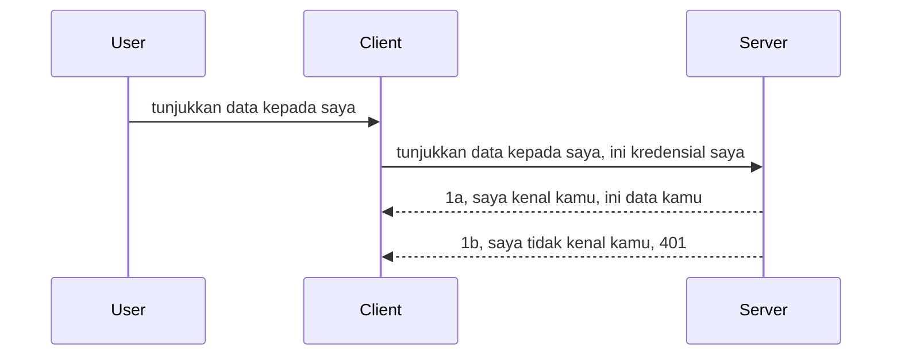

# Simple auth

SDK MCP mendukung penggunaan OAuth 2.1 yang sebenarnya adalah proses yang cukup kompleks yang melibatkan konsep seperti auth server, resource server, posting kredensial, mendapatkan kode, menukar kode dengan token bearer sampai akhirnya Anda bisa mendapatkan data resource Anda. Jika Anda belum terbiasa dengan OAuth yang merupakan hal bagus untuk diimplementasikan, ada baiknya memulai dengan tingkat dasar autentikasi dan membangun menuju keamanan yang lebih baik dan lebih baik. Itulah mengapa bab ini ada, untuk membangun Anda ke autentikasi yang lebih maju.

## Auth, maksud kita apa?

Auth adalah singkatan dari authentication dan authorization. Idemnya adalah kita perlu melakukan dua hal:

- **Authentication**, yaitu proses mengetahui apakah kita membiarkan seseorang masuk ke rumah kita, bahwa mereka memiliki hak untuk "di sini" yaitu memiliki akses ke resource server kita di mana fitur MCP Server kita hidup.
- **Authorization**, adalah proses mencari tahu apakah pengguna harus memiliki akses ke resource spesifik yang mereka minta, misalnya pesanan ini atau produk ini atau apakah mereka diizinkan membaca konten tapi tidak menghapus sebagai contoh lainnya.

## Kredensial: bagaimana kita memberi tahu sistem siapa kita

Nah, kebanyakan pengembang web di luar sana mulai berpikir dalam hal memberikan kredensial ke server, biasanya sebuah rahasia yang mengatakan apakah mereka diizinkan untuk berada di sini "Authentication". Kredensial ini biasanya berupa versi base64 dari username dan password atau sebuah API key yang secara unik mengidentifikasi pengguna tertentu.

Ini melibatkan mengirimkannya melalui header bernama "Authorization" seperti ini:

```json
{ "Authorization": "secret123" }
```

Ini biasanya disebut sebagai basic authentication. Cara alur keseluruhan kemudian bekerja adalah seperti berikut:


Sekarang setelah kita memahami bagaimana cara kerjanya dari sudut pandang alur, bagaimana kita mengimplementasikannya? Nah, kebanyakan web server memiliki konsep yang disebut middleware, sepotong kode yang berjalan sebagai bagian dari permintaan yang bisa memverifikasi kredensial, dan jika kredensial valid bisa membiarkan permintaan lewat. Jika permintaan tidak memiliki kredensial yang valid maka Anda akan mendapatkan error auth. Mari kita lihat bagaimana ini dapat diimplementasikan:

**Python**

```python
class AuthMiddleware(BaseHTTPMiddleware):
    async def dispatch(self, request, call_next):

        has_header = request.headers.get("Authorization")
        if not has_header:
            print("-> Missing Authorization header!")
            return Response(status_code=401, content="Unauthorized")

        if not valid_token(has_header):
            print("-> Invalid token!")
            return Response(status_code=403, content="Forbidden")

        print("Valid token, proceeding...")
       
        response = await call_next(request)
        # tambahkan header pelanggan apa pun atau ubah respons dengan cara tertentu
        return response


starlette_app.add_middleware(CustomHeaderMiddleware)
```

Di sini kita memiliki:

- Membuat middleware bernama `AuthMiddleware` di mana metode `dispatch`-nya dipanggil oleh web server.
- Menambahkan middleware ke web server:

    ```python
    starlette_app.add_middleware(AuthMiddleware)
    ```

- Menulis logika validasi yang memeriksa apakah header Authorization ada dan jika rahasia yang dikirim valid:

    ```python
    has_header = request.headers.get("Authorization")
    if not has_header:
        print("-> Missing Authorization header!")
        return Response(status_code=401, content="Unauthorized")

    if not valid_token(has_header):
        print("-> Invalid token!")
        return Response(status_code=403, content="Forbidden")
    ```

    jika rahasia ada dan valid maka kita membiarkan permintaan melewati dengan memanggil `call_next` dan mengembalikan respons.

    ```python
    response = await call_next(request)
    # tambahkan header pelanggan apa pun atau ubah respons dengan cara tertentu
    return response
    ```

Cara kerjanya adalah jika ada permintaan web yang dibuat ke server, middleware akan dipanggil dan dengan implementasinya akan membiarkan permintaan lewat atau akhirnya mengembalikan error yang menunjukkan bahwa klien tidak diizinkan untuk melanjutkan.

**TypeScript**

Di sini kita buat middleware dengan framework populer Express dan mencegat permintaan sebelum mencapai MCP Server. Berikut kode untuk itu:

```typescript
function isValid(secret) {
    return secret === "secret123";
}

app.use((req, res, next) => {
    // 1. Header otorisasi ada?
    if(!req.headers["Authorization"]) {
        res.status(401).send('Unauthorized');
    }
    
    let token = req.headers["Authorization"];

    // 2. Periksa keabsahan.
    if(!isValid(token)) {
        res.status(403).send('Forbidden');
    }

   
    console.log('Middleware executed');
    // 3. Teruskan permintaan ke langkah berikutnya dalam jalur permintaan.
    next();
});
```

Dalam kode ini kita:

1. Memeriksa apakah header Authorization ada, jika tidak, kita kirim error 401.
2. Memastikan kredensial/token valid, jika tidak, kita kirim error 403.
3. Tapi akhirnya melewatkan permintaan dalam pipeline permintaan dan mengembalikan resource yang diminta.

## Latihan: Implementasi autentikasi

Mari kita gunakan pengetahuan kita dan coba implementasikan. Berikut rencananya:

Server

- Buat server web dan instance MCP.
- Implementasikan middleware untuk server.

Client

- Kirim permintaan web dengan kredensial lewat header.

### -1- Buat server web dan instance MCP

Di langkah pertama, kita perlu membuat instance web server dan MCP Server.

**Python**

Di sini kita buat instance MCP server, buat aplikasi starlette web dan jalankan menggunakan uvicorn.

```python
# membuat Server MCP

app = FastMCP(
    name="MCP Resource Server",
    instructions="Resource Server that validates tokens via Authorization Server introspection",
    host=settings["host"],
    port=settings["port"],
    debug=True
)

# membuat aplikasi web starlette
starlette_app = app.streamable_http_app()

# menyajikan aplikasi melalui uvicorn
async def run(starlette_app):
    import uvicorn
    config = uvicorn.Config(
            starlette_app,
            host=app.settings.host,
            port=app.settings.port,
            log_level=app.settings.log_level.lower(),
        )
    server = uvicorn.Server(config)
    await server.serve()

run(starlette_app)
```

Dalam kode ini kita:

- Membuat MCP Server.
- Membangun aplikasi starlette web dari MCP Server, `app.streamable_http_app()`.
- Menjalankan dan melayani aplikasi web menggunakan uvicorn `server.serve()`.

**TypeScript**

Di sini kita buat instance MCP Server.

```typescript
const server = new McpServer({
      name: "example-server",
      version: "1.0.0"
    });

    // ... siapkan sumber daya server, alat, dan prompt ...
```

Pembuatan MCP Server ini harus terjadi dalam definisi route POST /mcp kita, jadi mari kita ambil kode di atas dan pindahkan seperti ini:

```typescript
import express from "express";
import { randomUUID } from "node:crypto";
import { McpServer } from "@modelcontextprotocol/sdk/server/mcp.js";
import { StreamableHTTPServerTransport } from "@modelcontextprotocol/sdk/server/streamableHttp.js";
import { isInitializeRequest } from "@modelcontextprotocol/sdk/types.js"

const app = express();
app.use(express.json());

// Peta untuk menyimpan transport berdasarkan ID sesi
const transports: { [sessionId: string]: StreamableHTTPServerTransport } = {};

// Menangani permintaan POST untuk komunikasi klien-ke-server
app.post('/mcp', async (req, res) => {
  // Periksa apakah ada ID sesi yang sudah ada
  const sessionId = req.headers['mcp-session-id'] as string | undefined;
  let transport: StreamableHTTPServerTransport;

  if (sessionId && transports[sessionId]) {
    // Gunakan kembali transport yang sudah ada
    transport = transports[sessionId];
  } else if (!sessionId && isInitializeRequest(req.body)) {
    // Permintaan inisialisasi baru
    transport = new StreamableHTTPServerTransport({
      sessionIdGenerator: () => randomUUID(),
      onsessioninitialized: (sessionId) => {
        // Simpan transport berdasarkan ID sesi
        transports[sessionId] = transport;
      },
      // Proteksi DNS rebinding dinonaktifkan secara default untuk kompatibilitas mundur. Jika Anda menjalankan server ini
      // secara lokal, pastikan untuk mengatur:
      // enableDnsRebindingProtection: true,
      // allowedHosts: ['127.0.0.1'],
    });

    // Bersihkan transport saat ditutup
    transport.onclose = () => {
      if (transport.sessionId) {
        delete transports[transport.sessionId];
      }
    };
    const server = new McpServer({
      name: "example-server",
      version: "1.0.0"
    });

    // ... siapkan sumber daya server, alat, dan prompt ...

    // Hubungkan ke server MCP
    await server.connect(transport);
  } else {
    // Permintaan tidak valid
    res.status(400).json({
      jsonrpc: '2.0',
      error: {
        code: -32000,
        message: 'Bad Request: No valid session ID provided',
      },
      id: null,
    });
    return;
  }

  // Tangani permintaan
  await transport.handleRequest(req, res, req.body);
});

// Handler yang dapat digunakan ulang untuk permintaan GET dan DELETE
const handleSessionRequest = async (req: express.Request, res: express.Response) => {
  const sessionId = req.headers['mcp-session-id'] as string | undefined;
  if (!sessionId || !transports[sessionId]) {
    res.status(400).send('Invalid or missing session ID');
    return;
  }
  
  const transport = transports[sessionId];
  await transport.handleRequest(req, res);
};

// Tangani permintaan GET untuk notifikasi server-ke-klien melalui SSE
app.get('/mcp', handleSessionRequest);

// Tangani permintaan DELETE untuk pengakhiran sesi
app.delete('/mcp', handleSessionRequest);

app.listen(3000);
```

Sekarang Anda lihat bagaimana pembuatan MCP Server dipindahkan ke dalam `app.post("/mcp")`.

Mari lanjut ke langkah berikutnya membuat middleware sehingga kita bisa memvalidasi kredensial yang masuk.

### -2- Implementasi middleware untuk server

Mari kita terus ke bagian middleware berikutnya. Di sini kita akan membuat middleware yang mencari kredensial di header `Authorization` dan memvalidasinya. Jika diterima maka permintaan akan dilanjutkan untuk melakukan apa yang diperlukan (misalnya daftar tools, baca resource atau apapun fungsi MCP yang diminta klien).

**Python**

Untuk membuat middleware, kita perlu membuat kelas yang mewarisi dari `BaseHTTPMiddleware`. Ada dua bagian penting:

- Permintaan `request`, yang kita baca informasi header-nya.
- `call_next` callback yang perlu kita panggil jika klien membawa kredensial yang kita terima.

Pertama, kita perlu menangani kasus jika header `Authorization` tidak ada:

```python
has_header = request.headers.get("Authorization")

# tidak ada header yang hadir, gagal dengan 401, jika tidak lanjutkan.
if not has_header:
    print("-> Missing Authorization header!")
    return Response(status_code=401, content="Unauthorized")
```

Di sini kita kirim pesan 401 unauthorized karena klien gagal autentikasi.

Selanjutnya, jika kredensial diajukan, kita perlu memeriksa validitasnya seperti ini:

```python
 if not valid_token(has_header):
    print("-> Invalid token!")
    return Response(status_code=403, content="Forbidden")
```

Perhatikan bagaimana kita mengirim pesan 403 forbidden di atas. Berikut adalah middleware lengkap yang mengimplementasikan semuanya yang kita sebutkan di atas:

```python
class AuthMiddleware(BaseHTTPMiddleware):
    async def dispatch(self, request, call_next):

        has_header = request.headers.get("Authorization")
        if not has_header:
            print("-> Missing Authorization header!")
            return Response(status_code=401, content="Unauthorized")

        if not valid_token(has_header):
            print("-> Invalid token!")
            return Response(status_code=403, content="Forbidden")

        print("Valid token, proceeding...")
        print(f"-> Received {request.method} {request.url}")
        response = await call_next(request)
        response.headers['Custom'] = 'Example'
        return response

```

Bagus, tapi bagaimana dengan fungsi `valid_token`? Ini dia di bawah ini:

```python
# JANGAN digunakan untuk produksi - tingkatkan !!
def valid_token(token: str) -> bool:
    # hapus prefix "Bearer "
    if token.startswith("Bearer "):
        token = token[7:]
        return token == "secret-token"
    return False
```

Tentu ini harus diperbaiki lagi.

PENTING: Anda SEHARUSNYA TIDAK PERNAH memiliki rahasia seperti ini di kode. Idealnya Anda mengambil nilai untuk dibandingkan dari sumber data atau dari IDP (identity service provider) atau lebih baik biarkan IDP yang melakukan validasi.

**TypeScript**

Untuk mengimplementasikan ini dengan Express, kita perlu memanggil metode `use` yang menerima fungsi middleware.

Kita perlu:

- Berinteraksi dengan variabel permintaan untuk memeriksa kredensial yang dikirim di properti `Authorization`.
- Validasi kredensial, dan jika valid biarkan permintaan terus berlanjut dan buat permintaan MCP klien melakukan apa yang seharusnya (misalnya daftar tools, baca resource atau yang terkait MCP lainnya).

Di sini, kita memeriksa apakah header `Authorization` ada dan jika tidak, kita hentikan permintaan agar tidak diteruskan:

```typescript
if(!req.headers["authorization"]) {
    res.status(401).send('Unauthorized');
    return;
}
```

Jika header tidak dikirim sejak awal, Anda menerima 401.

Selanjutnya, kita periksa apakah kredensial valid, jika tidak kita juga hentikan permintaan tapi dengan pesan yang agak berbeda:

```typescript
if(!isValid(token)) {
    res.status(403).send('Forbidden');
    return;
} 
```

Perhatikan sekarang Anda mendapat error 403.

Berikut kode lengkapnya:

```typescript
app.use((req, res, next) => {
    console.log('Request received:', req.method, req.url, req.headers);
    console.log('Headers:', req.headers["authorization"]);
    if(!req.headers["authorization"]) {
        res.status(401).send('Unauthorized');
        return;
    }
    
    let token = req.headers["authorization"];

    if(!isValid(token)) {
        res.status(403).send('Forbidden');
        return;
    }  

    console.log('Middleware executed');
    next();
});
```

Kita sudah siapkan web server untuk menerima middleware yang memeriksa kredensial yang klien semoga kirimkan. Bagaimana dengan klien itu sendiri?

### -3- Kirim permintaan web dengan kredensial lewat header

Kita perlu memastikan klien mengirim kredensial melalui header. Karena kita akan menggunakan klien MCP untuk itu, kita perlu tahu bagaimana caranya.

**Python**

Untuk klien, kita perlu mengirim header dengan kredensial kita seperti ini:

```python
# JANGAN menetapkan nilai secara langsung, setidaknya simpan dalam variabel lingkungan atau penyimpanan yang lebih aman
token = "secret-token"

async with streamablehttp_client(
        url = f"http://localhost:{port}/mcp",
        headers = {"Authorization": f"Bearer {token}"}
    ) as (
        read_stream,
        write_stream,
        session_callback,
    ):
        async with ClientSession(
            read_stream,
            write_stream
        ) as session:
            await session.initialize()
      
            # TODO, apa yang ingin Anda lakukan di klien, misalnya daftar alat, panggil alat, dll.
```

Perhatikan bagaimana kita mengisi properti `headers` seperti ini ` headers = {"Authorization": f"Bearer {token}"}`.

**TypeScript**

Kita dapat menyelesaikan ini dalam dua langkah:

1. Mengisi objek konfigurasi dengan kredensial kita.
2. Mengirim objek konfigurasi itu ke transport.

```typescript

// JANGAN mengkodekan nilai secara langsung seperti yang ditunjukkan di sini. Setidaknya buat sebagai variabel lingkungan dan gunakan sesuatu seperti dotenv (dalam mode pengembangan).
let token = "secret123"

// definisikan objek opsi transport klien
let options: StreamableHTTPClientTransportOptions = {
  sessionId: sessionId,
  requestInit: {
    headers: {
      "Authorization": "secret123"
    }
  }
};

// lewati objek opsi ke transportasi
async function main() {
   const transport = new StreamableHTTPClientTransport(
      new URL(serverUrl),
      options
   );
```

Di sini Anda lihat bagaimana kita harus membuat objek `options` dan menempatkan headers di bawah properti `requestInit`.

PENTING: Bagaimana kita memperbaikinya dari sini? Implementasi saat ini memiliki beberapa masalah. Pertama, mengirimkan kredensial seperti ini cukup berisiko kecuali Anda setidaknya menggunakan HTTPS. Bahkan demikian, kredensial bisa dicuri jadi Anda membutuhkan sistem di mana token mudah dicabut dan ditambahkan pemeriksaan tambahan seperti dari mana asalnya di dunia ini, apakah permintaan terlalu sering (perilaku bot), singkatnya, ada banyak perhatian.

Namun perlu dikatakan, untuk API yang sangat sederhana di mana Anda tidak ingin siapapun memanggil API Anda tanpa autentikasi, apa yang kita punya di sini adalah awal yang bagus.

Dengan begitu, mari kita coba perkuat keamanannya sedikit dengan menggunakan format standar seperti JSON Web Token, juga dikenal sebagai JWT atau token "JOT".

## JSON Web Tokens, JWT

Jadi, kita mencoba memperbaiki dari mengirim kredensial yang sangat sederhana. Apa perbaikan langsung yang kita dapat dengan mengadopsi JWT?

- **Perbaikan keamanan**. Di basic auth, Anda mengirim username dan password sebagai token base64 (atau API key) berulang-ulang yang meningkatkan risiko. Dengan JWT, Anda mengirim username dan password lalu mendapatkan token sebagai pengganti dan token ini juga berbatas waktu artinya akan kedaluwarsa. JWT memungkinkan penggunaan kontrol akses dengan granularitas halus menggunakan peran, lingkup dan izin.
- **Stateless dan skalabilitas**. JWT bersifat self-contained, mereka membawa semua info pengguna dan menghilangkan kebutuhan menyimpan sesi server-side. Token juga dapat divalidasi secara lokal.
- **Interoperabilitas dan federasi**. JWT adalah pusat dari Open ID Connect dan digunakan dengan penyedia identitas terkenal seperti Entra ID, Google Identity dan Auth0. Mereka juga memungkinkan penggunaan single sign on dan banyak lagi sehingga menjadi tingkat enterprise.
- **Modularitas dan fleksibilitas**. JWT juga dapat digunakan dengan API Gateway seperti Azure API Management, NGINX dan lainnya. Ini juga mendukung skenario autentikasi pengguna dan komunikasi server-ke-server termasuk impersonasi dan delegasi.
- **Kinerja dan caching**. JWT dapat dicache setelah didekode yang mengurangi kebutuhan parsing. Ini sangat membantu aplikasi lalu lintas tinggi karena meningkatkan throughput dan mengurangi beban infrastruktur pilihan Anda.
- **Fitur lanjutan**. JWT juga mendukung introspeksi (memeriksa validitas di server) dan pencabutan (membuat token tidak valid).

Dengan semua manfaat ini, mari kita lihat bagaimana kita bisa membawa implementasi kita ke tingkat berikutnya.

## Mengubah basic auth menjadi JWT

Jadi, perubahan yang perlu kita lakukan secara garis besar adalah:

- **Belajar membangun token JWT** dan membuatnya siap untuk dikirim dari klien ke server.
- **Memvalidasi token JWT**, dan jika valid, biarkan klien memiliki resource kita.
- **Penyimpanan token yang aman**. Cara kita menyimpan token ini.
- **Melindungi rute**. Kita perlu melindungi rute, dalam kasus kita, melindungi rute dan fitur MCP tertentu.
- **Menambahkan refresh token**. Pastikan kita membuat token yang berumur pendek tapi ada refresh token yang berumur panjang yang dapat digunakan untuk mendapatkan token baru jika sudah kedaluwarsa. Juga pastikan ada endpoint refresh dan strategi rotasi.

### -1- Membangun token JWT

Pertama-tama, token JWT memiliki bagian berikut ini:

- **header**, algoritma yang digunakan dan tipe token.
- **payload**, klaim, seperti sub (pengguna atau entitas yang direpresentasikan token. Dalam skenario auth ini biasanya userid), exp (kapan kedaluwarsa) role (peran)
- **signature**, ditandatangani dengan secret atau private key.

Untuk ini, kita perlu membangun header, payload dan token yang sudah dienkode.

**Python**

```python

import jwt
import jwt
from jwt.exceptions import ExpiredSignatureError, InvalidTokenError
import datetime

# Kunci rahasia yang digunakan untuk menandatangani JWT
secret_key = 'your-secret-key'

header = {
    "alg": "HS256",
    "typ": "JWT"
}

# info pengguna serta klaim dan waktu kadaluarsanya
payload = {
    "sub": "1234567890",               # Subjek (ID pengguna)
    "name": "User Userson",                # Klaim kustom
    "admin": True,                     # Klaim kustom
    "iat": datetime.datetime.utcnow(),# Diterbitkan pada
    "exp": datetime.datetime.utcnow() + datetime.timedelta(hours=1)  # Kadaluarsa
}

# enkode itu
encoded_jwt = jwt.encode(payload, secret_key, algorithm="HS256", headers=header)
```

Dalam kode di atas kita telah:

- Mendefinisikan header menggunakan HS256 sebagai algoritma dan tipe yaitu JWT.
- Membangun payload yang berisi subject atau user id, sebuah username, peran, kapan dikeluarkan dan kapan akan kedaluwarsa sehingga mengimplementasikan aspek berbatas waktu yang kita sebutkan sebelumnya.

**TypeScript**

Di sini kita akan membutuhkan beberapa dependensi yang akan membantu kita membangun token JWT.

Dependensi

```sh

npm install jsonwebtoken
npm install --save-dev @types/jsonwebtoken
```

Setelah itu siap, mari buat header, payload dan dari situ buat token yang dienkode.

```typescript
import jwt from 'jsonwebtoken';

const secretKey = 'your-secret-key'; // Gunakan variabel lingkungan di produksi

// Definisikan payload
const payload = {
  sub: '1234567890',
  name: 'User usersson',
  admin: true,
  iat: Math.floor(Date.now() / 1000), // Dikeluarkan pada
  exp: Math.floor(Date.now() / 1000) + 60 * 60 // Kadaluwarsa dalam 1 jam
};

// Definisikan header (opsional, jsonwebtoken mengatur default)
const header = {
  alg: 'HS256',
  typ: 'JWT'
};

// Buat token
const token = jwt.sign(payload, secretKey, {
  algorithm: 'HS256',
  header: header
});

console.log('JWT:', token);
```

Token ini:

Ditandatangani dengan HS256
Berlaku selama 1 jam
Termasuk klaim seperti sub, name, admin, iat, dan exp.

### -2- Memvalidasi token

Kita juga perlu memvalidasi token, ini sesuatu yang harus kita lakukan di server untuk memastikan apa yang klien kirim benar-benar valid. Ada banyak pemeriksaan yang harus dilakukan mulai dari memvalidasi strukturnya sampai validitasnya. Anda juga didorong untuk menambahkan pemeriksaan lain untuk melihat apakah pengguna ada di sistem Anda dan lain-lain.

Untuk memvalidasi token, kita perlu mendekodenya supaya bisa membacanya dan mulai memeriksa validitasnya:

**Python**

```python

# Dekode dan verifikasi JWT
try:
    decoded = jwt.decode(token, secret_key, algorithms=["HS256"])
    print("✅ Token is valid.")
    print("Decoded claims:")
    for key, value in decoded.items():
        print(f"  {key}: {value}")
except ExpiredSignatureError:
    print("❌ Token has expired.")
except InvalidTokenError as e:
    print(f"❌ Invalid token: {e}")

```

Dalam kode ini, kita memanggil `jwt.decode` menggunakan token, secret key dan algoritma yang dipilih sebagai input. Perhatikan bagaimana kita menggunakan konstruksi try-catch karena validasi gagal akan memunculkan error.

**TypeScript**

Di sini kita perlu memanggil `jwt.verify` untuk mendapatkan versi token yang didekode yang bisa kita analisa lebih jauh. Jika panggilan ini gagal, berarti struktur token salah atau sudah tidak valid lagi.

```typescript

try {
  const decoded = jwt.verify(token, secretKey);
  console.log('Decoded Payload:', decoded);
} catch (err) {
  console.error('Token verification failed:', err);
}
```

CATATAN: seperti disebut sebelumnya, kita harus melakukan pemeriksaan tambahan untuk memastikan token ini menunjuk ke pengguna di sistem kita dan memastikan pengguna memiliki hak yang diklaim.

Selanjutnya, mari kita lihat kontrol akses berbasis peran, juga dikenal sebagai RBAC.
## Menambahkan kontrol akses berbasis peran

Idenya adalah kita ingin menyatakan bahwa peran yang berbeda memiliki izin yang berbeda. Misalnya, kami mengasumsikan admin bisa melakukan segalanya dan pengguna biasa hanya bisa membaca/menulis dan tamu hanya bisa membaca. Oleh karena itu, berikut beberapa tingkat izin yang mungkin:

- Admin.Write 
- User.Read
- Guest.Read

Mari kita lihat bagaimana kita dapat mengimplementasikan kontrol tersebut dengan middleware. Middleware dapat ditambahkan per rute maupun untuk semua rute.

**Python**

```python
from starlette.middleware.base import BaseHTTPMiddleware
from starlette.responses import JSONResponse
import jwt

# JANGAN menyimpan rahasia dalam kode seperti ini, ini hanya untuk tujuan demonstrasi. Bacalah dari tempat yang aman.
SECRET_KEY = "your-secret-key" # letakkan ini dalam variabel lingkungan
REQUIRED_PERMISSION = "User.Read"

class JWTPermissionMiddleware(BaseHTTPMiddleware):
    async def dispatch(self, request, call_next):
        auth_header = request.headers.get("Authorization")
        if not auth_header or not auth_header.startswith("Bearer "):
            return JSONResponse({"error": "Missing or invalid Authorization header"}, status_code=401)

        token = auth_header.split(" ")[1]
        try:
            decoded = jwt.decode(token, SECRET_KEY, algorithms=["HS256"])
        except jwt.ExpiredSignatureError:
            return JSONResponse({"error": "Token expired"}, status_code=401)
        except jwt.InvalidTokenError:
            return JSONResponse({"error": "Invalid token"}, status_code=401)

        permissions = decoded.get("permissions", [])
        if REQUIRED_PERMISSION not in permissions:
            return JSONResponse({"error": "Permission denied"}, status_code=403)

        request.state.user = decoded
        return await call_next(request)


```

Ada beberapa cara berbeda untuk menambahkan middleware seperti di bawah ini:

```python

# Alt 1: tambahkan middleware saat membuat aplikasi starlette
middleware = [
    Middleware(JWTPermissionMiddleware)
]

app = Starlette(routes=routes, middleware=middleware)

# Alt 2: tambahkan middleware setelah aplikasi starlette selesai dibuat
starlette_app.add_middleware(JWTPermissionMiddleware)

# Alt 3: tambahkan middleware per rute
routes = [
    Route(
        "/mcp",
        endpoint=..., # penangan
        middleware=[Middleware(JWTPermissionMiddleware)]
    )
]
```

**TypeScript**

Kita dapat menggunakan `app.use` dan middleware yang akan dijalankan untuk semua permintaan.

```typescript
app.use((req, res, next) => {
    console.log('Request received:', req.method, req.url, req.headers);
    console.log('Headers:', req.headers["authorization"]);

    // 1. Periksa apakah header otorisasi telah dikirim

    if(!req.headers["authorization"]) {
        res.status(401).send('Unauthorized');
        return;
    }
    
    let token = req.headers["authorization"];

    // 2. Periksa apakah token valid
    if(!isValid(token)) {
        res.status(403).send('Forbidden');
        return;
    }  

    // 3. Periksa apakah pengguna token ada dalam sistem kami
    if(!isExistingUser(token)) {
        res.status(403).send('Forbidden');
        console.log("User does not exist");
        return;
    }
    console.log("User exists");

    // 4. Verifikasi token memiliki izin yang benar
    if(!hasScopes(token, ["User.Read"])){
        res.status(403).send('Forbidden - insufficient scopes');
    }

    console.log("User has required scopes");

    console.log('Middleware executed');
    next();
});

```

Ada beberapa hal yang dapat kita biarkan middleware lakukan dan middleware HARUS lakukan, yaitu:

1. Memeriksa apakah header otorisasi ada
2. Memeriksa apakah token valid, kita memanggil `isValid` yang merupakan metode yang kita buat untuk mengecek integritas dan validitas token JWT.
3. Memverifikasi pengguna ada dalam sistem kita, kita harus memeriksa ini.

   ```typescript
    // pengguna di DB
   const users = [
     "user1",
     "User usersson",
   ]

   function isExistingUser(token) {
     let decodedToken = verifyToken(token);

     // TODO, periksa apakah pengguna ada di DB
     return users.includes(decodedToken?.name || "");
   }
   ```

   Di atas, kita telah membuat daftar `users` yang sangat sederhana, yang tentunya seharusnya berada di database.

4. Selain itu, kita juga harus memeriksa token memiliki izin yang benar.

   ```typescript
   if(!hasScopes(token, ["User.Read"])){
        res.status(403).send('Forbidden - insufficient scopes');
   }
   ```

   Dalam kode di atas dari middleware, kita memeriksa bahwa token mengandung izin User.Read, jika tidak kita mengirimkan error 403. Di bawah ini adalah metode pembantu `hasScopes`.

   ```typescript
   function hasScopes(scope: string, requiredScopes: string[]) {
     let decodedToken = verifyToken(scope);
    return requiredScopes.every(scope => decodedToken?.scopes.includes(scope));
  }
   ```

Have a think which additional checks you should be doing, but these are the absolute minimum of checks you should be doing.

Using Express as a web framework is a common choice. There are helpers library when you use JWT so you can write less code.

- `express-jwt`, helper library that provides a middleware that helps decode your token.
- `express-jwt-permissions`, this provides a middleware `guard` that helps check if a certain permission is on the token.

Here's what these libraries can look like when used:

```typescript
const express = require('express');
const jwt = require('express-jwt');
const guard = require('express-jwt-permissions')();

const app = express();
const secretKey = 'your-secret-key'; // put this in env variable

// Decode JWT and attach to req.user
app.use(jwt({ secret: secretKey, algorithms: ['HS256'] }));

// Check for User.Read permission
app.use(guard.check('User.Read'));

// multiple permissions
// app.use(guard.check(['User.Read', 'Admin.Access']));

app.get('/protected', (req, res) => {
  res.json({ message: `Welcome ${req.user.name}` });
});

// Error handler
app.use((err, req, res, next) => {
  if (err.code === 'permission_denied') {
    return res.status(403).send('Forbidden');
  }
  next(err);
});

```

Sekarang Anda telah melihat bagaimana middleware dapat digunakan untuk otentikasi dan otorisasi, bagaimana dengan MCP? Apakah itu mengubah cara kita melakukan otentikasi? Mari kita cari tahu di bagian berikutnya.

### -3- Tambahkan RBAC ke MCP

Anda sudah lihat sejauh ini bagaimana Anda dapat menambahkan RBAC melalui middleware, namun untuk MCP tidak ada cara mudah untuk menambahkan RBAC per fitur MCP, jadi apa yang kita lakukan? Nah, kita cukup menambahkan kode seperti ini yang memeriksa dalam kasus ini apakah klien memiliki hak untuk memanggil alat spesifik:

Anda memiliki beberapa pilihan berbeda tentang cara melakukan RBAC per fitur, berikut beberapa:

- Tambahkan pemeriksaan untuk setiap alat, sumber daya, prompt di mana Anda perlu memeriksa tingkat izin.

   **python**

   ```python
   @tool()
   def delete_product(id: int):
      try:
          check_permissions(role="Admin.Write", request)
      catch:
        pass # klien gagal otorisasi, angkat kesalahan otorisasi
   ```

   **typescript**

   ```typescript
   server.registerTool(
    "delete-product",
    {
      title: Delete a product",
      description: "Deletes a product",
      inputSchema: { id: z.number() }
    },
    async ({ id }) => {
      
      try {
        checkPermissions("Admin.Write", request);
        // todo, kirim id ke productService dan remote entry
      } catch(Exception e) {
        console.log("Authorization error, you're not allowed");  
      }

      return {
        content: [{ type: "text", text: `Deletected product with id ${id}` }]
      };
    }
   );
   ```


- Gunakan pendekatan server lanjutan dan penangan permintaan sehingga Anda meminimalkan berapa banyak tempat Anda perlu melakukan pemeriksaan.

   **Python**

   ```python
   
   tool_permission = {
      "create_product": ["User.Write", "Admin.Write"],
      "delete_product": ["Admin.Write"]
   }

   def has_permission(user_permissions, required_permissions) -> bool:
      # user_permissions: daftar izin yang dimiliki pengguna
      # required_permissions: daftar izin yang diperlukan untuk alat
      return any(perm in user_permissions for perm in required_permissions)

   @server.call_tool()
   async def handle_call_tool(
     name: str, arguments: dict[str, str] | None
   ) -> list[types.TextContent]:
    # Asumsikan request.user.permissions adalah daftar izin untuk pengguna
     user_permissions = request.user.permissions
     required_permissions = tool_permission.get(name, [])
     if not has_permission(user_permissions, required_permissions):
        # Angkat kesalahan "Anda tidak memiliki izin untuk memanggil alat {name}"
        raise Exception(f"You don't have permission to call tool {name}")
     # lanjutkan dan panggil alat
     # ...
   ```   
   

   **TypeScript**

   ```typescript
   function hasPermission(userPermissions: string[], requiredPermissions: string[]): boolean {
       if (!Array.isArray(userPermissions) || !Array.isArray(requiredPermissions)) return false;
       // Kembalikan true jika pengguna memiliki setidaknya satu izin yang diperlukan
       
       return requiredPermissions.some(perm => userPermissions.includes(perm));
   }
  
   server.setRequestHandler(CallToolRequestSchema, async (request) => {
      const { params: { name } } = request;
  
      let permissions = request.user.permissions;
  
      if (!hasPermission(permissions, toolPermissions[name])) {
         return new Error(`You don't have permission to call ${name}`);
      }
  
      // teruskan..
   });
   ```

   Catatan, Anda perlu memastikan middleware Anda menetapkan token yang sudah didekode ke properti user pada permintaan sehingga kode di atas menjadi sederhana.

### Ringkasan

Sekarang setelah kita membahas bagaimana menambahkan dukungan RBAC secara umum dan untuk MCP secara khusus, saatnya mencoba mengimplementasikan keamanan sendiri untuk memastikan Anda memahami konsep-konsep yang disajikan kepada Anda.

## Tugas 1: Bangun server mcp dan klien mcp menggunakan otentikasi dasar

Di sini Anda akan mengambil apa yang telah Anda pelajari dalam hal mengirim kredensial melalui header.

## Solusi 1

[Solusi 1](./code/basic/README.md)

## Tugas 2: Tingkatkan solusi dari Tugas 1 untuk menggunakan JWT

Ambil solusi pertama tapi kali ini, mari kita perbaiki.

Alih-alih menggunakan Otentikasi Dasar, mari gunakan JWT.

## Solusi 2

[Solusi 2](./solution/jwt-solution/README.md)

## Tantangan

Tambahkan RBAC per alat seperti yang kami jelaskan di bagian "Tambahkan RBAC ke MCP".

## Ringkasan

Semoga Anda telah banyak belajar di bab ini, dari tanpa keamanan sama sekali, ke keamanan dasar, ke JWT dan bagaimana ini dapat ditambahkan ke MCP.

Kita telah membangun fondasi yang solid dengan JWT kustom, tetapi saat kita berkembang, kita bergerak menuju model identitas berbasis standar. Mengadopsi IdP seperti Entra atau Keycloak memungkinkan kita memindahkan penerbitan token, validasi, dan manajemen siklus hidup ke platform terpercaya — membebaskan kita untuk fokus pada logika aplikasi dan pengalaman pengguna.

Untuk itu, kami memiliki bab yang lebih [lanjutan tentang Entra](../../05-AdvancedTopics/mcp-security-entra/README.md)

## Apa Selanjutnya

- Berikutnya: [Menyiapkan Host MCP](../12-mcp-hosts/README.md)

---

<!-- CO-OP TRANSLATOR DISCLAIMER START -->
**Penafian**:  
Dokumen ini telah diterjemahkan menggunakan layanan terjemahan AI [Co-op Translator](https://github.com/Azure/co-op-translator). Meskipun kami berusaha untuk akurasi, harap diketahui bahwa terjemahan otomatis mungkin mengandung kesalahan atau ketidakakuratan. Dokumen asli dalam bahasa aslinya harus dianggap sebagai sumber yang otoritatif. Untuk informasi penting, disarankan menggunakan terjemahan profesional oleh manusia. Kami tidak bertanggung jawab atas kesalahpahaman atau kesalahan interpretasi yang timbul dari penggunaan terjemahan ini.
<!-- CO-OP TRANSLATOR DISCLAIMER END -->