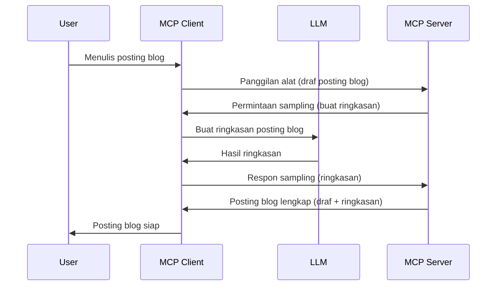

# Sampling - mendelegasikan fitur ke Klien

Terkadang, Anda membutuhkan kolaborasi antara MCP Client dan MCP Server untuk mencapai tujuan bersama. Anda mungkin memiliki kasus di mana Server membutuhkan bantuan dari LLM yang berada di klien. Untuk situasi ini, sampling adalah yang sebaiknya Anda gunakan.

Mari kita jelajahi beberapa kasus penggunaan dan cara membangun solusi yang melibatkan sampling.

## Gambaran Umum

Dalam pelajaran ini, kita akan fokus menjelaskan kapan dan di mana menggunakan Sampling serta bagaimana cara mengonfigurasinya.

## Tujuan Pembelajaran

Dalam bab ini, kita akan:

- Menjelaskan apa itu Sampling dan kapan menggunakannya.
- Menunjukkan cara mengonfigurasi Sampling di MCP.
- Memberikan contoh Sampling dalam praktik.

## Apa itu Sampling dan mengapa menggunakannya?

Sampling adalah fitur lanjutan yang bekerja dengan cara berikut:


### Permintaan Sampling

Oke, sekarang kita punya gambaran besar tentang skenario yang kredibel, mari kita bahas permintaan sampling yang dikirimkan server ke klien. Berikut contoh permintaan seperti ini dalam format JSON-RPC:

```json
{
  "jsonrpc": "2.0",
  "id": 1,
  "method": "sampling/createMessage",
  "params": {
    "messages": [
      {
        "role": "user",
        "content": {
          "type": "text",
          "text": "Create a blog post summary of the following blog post: <BLOG POST>"
        }
      }
    ],
    "modelPreferences": {
      "hints": [
        {
          "name": "claude-3-sonnet"
        }
      ],
      "intelligencePriority": 0.8,
      "speedPriority": 0.5
    },
    "systemPrompt": "You are a helpful assistant.",
    "maxTokens": 100
  }
}
```

Ada beberapa hal yang perlu diperhatikan di sini:

- Prompt, di bawah content -> text, adalah prompt kita yang merupakan instruksi bagi LLM untuk meringkas isi posting blog.

- **modelPreferences**. Bagian ini hanyalah preferensi, sebuah rekomendasi konfigurasi yang digunakan dengan LLM. Pengguna dapat memilih apakah mengikuti rekomendasi ini atau mengubahnya. Dalam kasus ini ada rekomendasi model yang digunakan serta prioritas kecepatan dan kecerdasan.
- **systemPrompt**, ini adalah system prompt biasa Anda yang memberi LLM Anda kepribadian dan berisi instruksi panduan.
- **maxTokens**, ini adalah properti lain yang digunakan untuk menyatakan berapa banyak token yang direkomendasikan untuk tugas ini.

### Respon Sampling

Respon ini adalah apa yang akhirnya dikirim oleh MCP Client kembali ke MCP Server dan merupakan hasil dari klien yang memanggil LLM, menunggu respon tersebut, kemudian menyusun pesan ini. Berikut contoh dalam JSON-RPC:

```json
{
  "jsonrpc": "2.0",
  "id": 1,
  "result": {
    "role": "assistant",
    "content": {
      "type": "text",
      "text": "Here's your abstract <ABSTRACT>"
    },
    "model": "gpt-5",
    "stopReason": "endTurn"
  }
}
```

Perhatikan bagaimana respon tersebut adalah abstrak dari posting blog, sesuai dengan permintaan kita. Juga perhatikan model yang digunakan bukan yang kita minta tapi "gpt-5" menggantikan "claude-3-sonnet". Ini untuk mengilustrasikan bahwa pengguna bisa berubah pikiran tentang apa yang akan digunakan dan bahwa permintaan sampling Anda hanyalah rekomendasi.

Oke, sekarang kita sudah mengerti alur utama dan tugas berguna untuk digunakan yaitu "pembuatan posting blog + abstrak", mari kita lihat apa yang perlu dilakukan agar ini bekerja.

### Jenis pesan

Pesan sampling tidak terbatas hanya pada teks tetapi Anda juga bisa mengirim gambar dan audio. Berikut ini bagaimana JSON-RPC terlihat berbeda:

**Teks**

```json
{
  "type": "text",
  "text": "The message content"
}
```

**Konten gambar**

```json
{
  "type": "image",
  "data": "base64-encoded-image-data",
  "mimeType": "image/jpeg"
}
```

**Konten audio**

```json
{
  "type": "audio",
  "data": "base64-encoded-audio-data",
  "mimeType": "audio/wav"
}
```

> CATATAN: untuk info lebih detail tentang Sampling, lihat [dokumentasi resmi](https://modelcontextprotocol.io/specification/2025-06-18/client/sampling)

## Cara Mengonfigurasi Sampling di Klien

> Catatan: jika Anda hanya membuat server, Anda tidak perlu melakukan banyak hal di sini.

Di klien, Anda perlu menentukan fitur berikut seperti ini:

```json
{
  "capabilities": {
    "sampling": {}
  }
}
```

Ini kemudian akan diambil saat klien pilihan Anda melakukan inisialisasi dengan server.

## Contoh Sampling dalam Praktik - Membuat Posting Blog

Mari kita buat server sampling bersama-sama, kita perlu melakukan hal berikut:

1. Buat sebuah tool di Server.
1. Tool tersebut harus membuat permintaan sampling.
1. Tool harus menunggu jawaban permintaan sampling dari klien.
1. Setelah itu, hasil tool harus dihasilkan.

Mari lihat kode langkah demi langkah:

### -1- Buat tool

**python**

```python
@mcp.tool()
async def create_blog(title: str, content: str, ctx: Context[ServerSession, None]) -> str:
    """Create a blog post and generate a summary"""

```

### -2- Buat permintaan sampling

Perluas tool Anda dengan kode berikut:

**python**

```python
post = BlogPost(
        id=len(posts) + 1,
        title=title,
        content=content,
        abstract=""
    )

prompt = f"Create an abstract of the following blog post: title: {title} and draft: {content} "

result = await ctx.session.create_message(
        messages=[
            SamplingMessage(
                role="user",
                content=TextContent(type="text", text=prompt),
            )
        ],
        max_tokens=100,
)

```

### -3- Tunggu respon dan kembalikan respon

**python**

```python
post.abstract = result.content.text

posts.append(post)

# kembalikan produk lengkap
return json.dumps({
    "id": post.title,
    "abstract": post.abstract
})
```

### -4- Kode lengkap

**python**

```python
from starlette.applications import Starlette
from starlette.routing import Mount, Host

from mcp.server.fastmcp import Context, FastMCP

from mcp.server.session import ServerSession
from mcp.types import SamplingMessage, TextContent

import json


from uuid import uuid4
from typing import List
from pydantic import BaseModel


mcp = FastMCP("Blog post generator")

# app = FastAPI()

posts = []

class BlogPost(BaseModel):
    id: int
    title: str
    content: str
    abstract: str

posts: List[BlogPost] = []

@mcp.tool()
async def create_blog(title: str, content: str, ctx: Context[ServerSession, None]) -> str:
    """Create a blog post and generate a summary"""

    post = BlogPost(
        id=len(posts) + 1,
        title=title,
        content=content,
        abstract=""
    )

    prompt = f"Create an abstract of the following blog post: title: {title} and draft: {content} "

    result = await ctx.session.create_message(
        messages=[
            SamplingMessage(
                role="user",
                content=TextContent(type="text", text=prompt),
            )
        ],
        max_tokens=100,
    )

    post.abstract = result.content.text

    posts.append(post)

    # mengembalikan postingan blog lengkap
    return json.dumps({
        "id": post.title,
        "abstract": post.abstract
    })

if __name__ == "__main__":
    print("Starting server...")
    # mcp.run()
    mcp.run(transport="streamable-http")

# jalankan aplikasi dengan: python server.py
```

### -5- Mengujinya di Visual Studio Code

Untuk menguji ini di Visual Studio Code, lakukan hal berikut:

1. Mulai server di terminal
1. Tambahkan ke *mcp.json* (dan pastikan sudah berjalan) misalnya seperti ini:

   ```json
   "servers": {
      "blog-server": {
        "type": "http",
        "url": "http://localhost:8000/mcp"
      }
   }
   ```

1. Ketik sebuah prompt:

   ```text
   create a blog post named "Where Python comes from", the content is "Python is actually named after Monty Python Flying Circus"
   ```

1. Izinkan sampling berjalan. Pertama kali Anda menguji ini, Anda akan disajikan dialog tambahan yang perlu Anda setujui, lalu Anda akan melihat dialog normal untuk meminta Anda menjalankan sebuah tool.

1. Periksa hasil. Anda akan melihat hasilnya dirender dengan baik di GitHub Copilot Chat namun Anda juga bisa memeriksa respon JSON mentahnya.

**Bonus**. Alat Visual Studio Code sangat mendukung sampling. Anda dapat mengonfigurasi akses Sampling di server yang sudah terpasang dengan cara berikut:

1. Navigasi ke bagian ekstensi.
1. Pilih ikon roda gigi untuk server yang terpasang di bagian "MCP SERVERS - INSTALLED".
1 Pilih "Configure Model Access", di sini Anda dapat memilih model apa saja yang diizinkan GitHub Copilot gunakan saat melakukan sampling. Anda juga dapat melihat semua permintaan sampling yang terjadi baru-baru ini dengan memilih "Show Sampling requests".

## Tugas

Dalam tugas ini, Anda akan membuat Sampling yang sedikit berbeda yakni integrasi sampling yang mendukung pembuatan deskripsi produk. Berikut skenario Anda:

**Skenario**: Petugas back office di e-commerce membutuhkan bantuan, karena membuat deskripsi produk memakan terlalu banyak waktu. Oleh karena itu, Anda harus membuat solusi di mana Anda bisa memanggil tool "create_product" dengan argumen "title" dan "keywords" dan tool tersebut harus menghasilkan produk lengkap termasuk field "description" yang harus diisi oleh LLM klien.

TIP: gunakan apa yang sudah Anda pelajari sebelumnya untuk membangun server dan tool-nya menggunakan permintaan sampling.

## Solusi

[Solusi](./solution/README.md)

## Hal-hal yang Dipelajari

Sampling adalah fitur kuat yang memungkinkan server mendelegasikan tugas kepada klien ketika memerlukan bantuan LLM.

## Selanjutnya

- [Bab 4 - Implementasi praktis](../../04-PracticalImplementation/README.md)

---

<!-- CO-OP TRANSLATOR DISCLAIMER START -->
**Penafian**:  
Dokumen ini telah diterjemahkan menggunakan layanan terjemahan AI [Co-op Translator](https://github.com/Azure/co-op-translator). Meskipun kami berusaha untuk akurasi, harap diperhatikan bahwa terjemahan otomatis mungkin mengandung kesalahan atau ketidakakuratan. Dokumen asli dalam bahasa aslinya harus dianggap sebagai sumber yang otoritatif. Untuk informasi penting, disarankan menggunakan terjemahan profesional oleh manusia. Kami tidak bertanggung jawab atas kesalahpahaman atau penafsiran yang keliru yang timbul dari penggunaan terjemahan ini.
<!-- CO-OP TRANSLATOR DISCLAIMER END -->