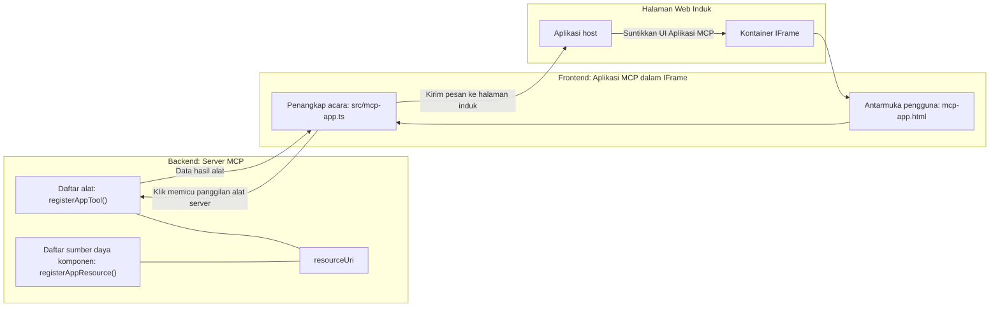

# MCP Apps

MCP Apps adalah paradigma baru dalam MCP. Idenya adalah bahwa Anda tidak hanya merespons dengan data kembali dari panggilan alat, tetapi juga menyediakan informasi tentang bagaimana informasi ini harus diinteraksikan. Itu berarti hasil alat sekarang dapat berisi informasi UI. Mengapa kita menginginkan itu? Nah, pertimbangkan bagaimana Anda melakukan sesuatu hari ini. Anda kemungkinan mengonsumsi hasil dari MCP Server dengan menempatkan semacam frontend di depannya, itu adalah kode yang perlu Anda tulis dan pelihara. Kadang-kadang itulah yang Anda inginkan, tetapi kadang-kadang akan sangat bagus jika Anda hanya bisa membawa potongan informasi yang mandiri yang memiliki semuanya mulai dari data hingga antarmuka pengguna.

## Ikhtisar

Pelajaran ini memberikan panduan praktis tentang MCP Apps, cara memulai dengan itu dan cara mengintegrasikannya dalam Aplikasi Web Anda yang sudah ada. MCP Apps adalah tambahan yang sangat baru untuk Standar MCP.

## Tujuan Pembelajaran

Pada akhir pelajaran ini, Anda akan dapat:

- Menjelaskan apa itu MCP Apps.
- Kapan menggunakan MCP Apps.
- Membangun dan mengintegrasikan MCP Apps Anda sendiri.

## MCP Apps - bagaimana cara kerjanya

Idenya dengan MCP Apps adalah menyediakan respons yang pada dasarnya adalah sebuah komponen untuk dirender. Komponen seperti itu dapat memiliki visual dan interaktivitas, misalnya, klik tombol, input pengguna, dan lainnya. Mari mulai dari sisi server dan MCP Server kita. Untuk membuat komponen MCP App Anda perlu membuat alat sekaligus sumber daya aplikasi. Kedua bagian ini dihubungkan dengan resourceUri.

Berikut contoh. Mari coba memvisualisasikan apa yang terlibat dan bagian mana melakukan apa:

```text
server.ts -- responsible for registering tools and the component as a UI component
src/
  mcp-app.ts -- wiring up event handlers
mcp-app.html -- the user interface
```

Visual ini menggambarkan arsitektur untuk membuat komponen dan logikanya.


Mari coba jelaskan tanggung jawab selanjutnya untuk backend dan frontend secara berurutan.

### Backend

Ada dua hal yang perlu kita capai di sini:

- Mendaftarkan alat yang ingin kita interaksikan.
- Mendefinisikan komponen.

**Mendaftarkan alat**

```typescript
registerAppTool(
    server,
    "get-time",
    {
      title: "Get Time",
      description: "Returns the current server time.",
      inputSchema: {},
      _meta: { ui: { resourceUri } }, // Menghubungkan alat ini ke sumber daya UI-nya
    },
    async () => {
      const time = new Date().toISOString();
      return { content: [{ type: "text", text: time }] };
    },
  );

```

Kode di atas menggambarkan perilaku, di mana ia membuka alat yang disebut `get-time`. Alat ini tidak memerlukan input tetapi menghasilkan waktu saat ini. Kita memiliki kemampuan untuk mendefinisikan `inputSchema` untuk alat di mana kita perlu bisa menerima input pengguna.

**Mendaftarkan komponen**

Di file yang sama, kita juga perlu mendaftarkan komponen:

```typescript
const resourceUri = "ui://get-time/mcp-app.html";

// Mendaftarkan sumber daya, yang mengembalikan HTML/JavaScript yang digabungkan untuk UI.
registerAppResource(
  server,
  resourceUri,
  resourceUri,
  { mimeType: RESOURCE_MIME_TYPE },
  async () => {
    const html = await fs.readFile(path.join(DIST_DIR, "mcp-app.html"), "utf-8");

    return {
    contents: [
        { uri: resourceUri, mimeType: RESOURCE_MIME_TYPE, text: html },
    ],
    };
  },
);
```

Perhatikan bagaimana kita menyebut `resourceUri` untuk menghubungkan komponen dengan alatnya. Yang menarik juga adalah callback di mana kita memuat file UI dan mengembalikan komponen.

### Frontend komponen

Sama seperti backend, ada dua bagian di sini:

- Frontend yang ditulis dalam HTML murni.
- Kode yang menangani acara dan apa yang harus dilakukan, misalnya memanggil alat atau mengirim pesan ke jendela induk.

**Antarmuka pengguna**

Mari lihat antarmuka pengguna.

```html
<!-- mcp-app.html -->
<!DOCTYPE html>
<html lang="en">
  <head>
    <meta charset="UTF-8" />
    <title>Get Time App</title>
  </head>
  <body>
    <p>
      <strong>Server Time:</strong> <code id="server-time">Loading...</code>
    </p>
    <button id="get-time-btn">Get Server Time</button>
    <script type="module" src="/src/mcp-app.ts"></script>
  </body>
</html>
```

**Pengkabelan acara**

Bagian terakhir adalah pengkabelan acara. Itu berarti kita mengidentifikasi bagian mana dalam UI kita yang membutuhkan pengelola acara dan apa yang harus dilakukan jika acara itu dipicu:

```typescript
// mcp-app.ts

import { App } from "@modelcontextprotocol/ext-apps";

// Mengambil referensi elemen
const serverTimeEl = document.getElementById("server-time")!;
const getTimeBtn = document.getElementById("get-time-btn")!;

// Membuat instance aplikasi
const app = new App({ name: "Get Time App", version: "1.0.0" });

// Menangani hasil alat dari server. Setel sebelum `app.connect()` untuk menghindari
// kehilangan hasil alat awal.
app.ontoolresult = (result) => {
  const time = result.content?.find((c) => c.type === "text")?.text;
  serverTimeEl.textContent = time ?? "[ERROR]";
};

// Menghubungkan klik tombol
getTimeBtn.addEventListener("click", async () => {
  // `app.callServerTool()` membiarkan UI meminta data baru dari server
  const result = await app.callServerTool({ name: "get-time", arguments: {} });
  const time = result.content?.find((c) => c.type === "text")?.text;
  serverTimeEl.textContent = time ?? "[ERROR]";
});

// Terhubung ke host
app.connect();
```

Seperti yang Anda lihat dari atas, ini adalah kode biasa untuk menghubungkan elemen DOM ke acara. Yang patut disebutkan adalah panggilan ke `callServerTool` yang akhirnya memanggil alat di backend.

## Menangani input pengguna

Sejauh ini, kita telah melihat komponen yang memiliki tombol yang ketika diklik memanggil alat. Mari kita lihat apakah kita bisa menambahkan elemen UI lain seperti bidang input dan melihat apakah kita bisa mengirim argumen ke alat. Mari implementasikan fungsi FAQ. Berikut cara kerjanya:

- Harus ada tombol dan elemen input di mana pengguna mengetik kata kunci untuk pencarian misalnya "Shipping". Ini harus memanggil alat di backend yang melakukan pencarian dalam data FAQ.
- Alat yang mendukung pencarian FAQ seperti yang disebutkan.

Mari tambahkan dukungan yang diperlukan ke backend terlebih dahulu:

```typescript
const faq: { [key: string]: string } = {
    "shipping": "Our standard shipping time is 3-5 business days.",
    "return policy": "You can return any item within 30 days of purchase.",
    "warranty": "All products come with a 1-year warranty covering manufacturing defects.",
  }

registerAppTool(
    server,
    "get-faq",
    {
      title: "Search FAQ",
      description: "Searches the FAQ for relevant answers.",
      inputSchema: zod.object({
        query: zod.string().default("shipping"),
      }),
      _meta: { ui: { resourceUri: faqResourceUri } }, // Menghubungkan alat ini ke sumber daya UI-nya
    },
    async ({ query }) => {
      const answer: string = faq[query.toLowerCase()] || "Sorry, I don't have an answer for that.";
      return { content: [{ type: "text", text: answer }] };
    },
  );
```

Apa yang kita lihat di sini adalah bagaimana kita mengisi `inputSchema` dan memberinya skema `zod` seperti berikut:

```typescript
inputSchema: zod.object({
  query: zod.string().default("shipping"),
})
```

Dalam skema di atas kita menyatakan memiliki parameter input bernama `query` dan bahwa itu opsional dengan nilai default "shipping".

Baik, mari lanjut ke *mcp-app.html* untuk melihat UI apa yang perlu kita buat untuk ini:

```html
<div class="faq">
    <h1>FAQ response</h1>
    <p>FAQ Response: <code id="faq-response">Loading...</code></p>
    <input type="text" id="faq-query" placeholder="Enter FAQ query" />
    <button id="get-faq-btn">Get FAQ Response</button>
  </div>
```

Bagus, sekarang kita memiliki elemen input dan tombol. Selanjutnya mari ke *mcp-app.ts* untuk menghubungkan acara ini:

```typescript
const getFaqBtn = document.getElementById("get-faq-btn")!;
const faqQueryInput = document.getElementById("faq-query") as HTMLInputElement;

getFaqBtn.addEventListener("click", async () => {
  const query = faqQueryInput.value;
  const result = await app.callServerTool({ name: "get-faq", arguments: { query } });
  const faq = result.content?.find((c) => c.type === "text")?.text;
  faqResponseEl.textContent = faq ?? "[ERROR]";
});
```

Dalam kode di atas kita:

- Membuat referensi untuk elemen UI interaktif.
- Menangani klik tombol untuk mengambil nilai elemen input dan kita juga memanggil `app.callServerTool()` dengan `name` dan `arguments` di mana yang terakhir mengirim `query` sebagai nilainya.

Apa yang sebenarnya terjadi saat Anda memanggil `callServerTool` adalah bahwa itu mengirim pesan ke jendela induk dan jendela itu kemudian memanggil MCP Server.

### Coba sendiri

Mencobanya kita sekarang harus melihat hal berikut:


dan ini adalah ketika kita coba dengan input seperti "warranty"


Untuk menjalankan kode ini, buka [Bagian Kode](./code/README.md)

## Pengujian di Visual Studio Code

Visual Studio Code memiliki dukungan hebat untuk MCP Apps dan mungkin adalah salah satu cara termudah untuk menguji MCP Apps Anda. Untuk menggunakan Visual Studio Code, tambahkan entri server ke *mcp.json* seperti berikut:

```json
"my-mcp-server-7178eca7": {
    "url": "http://localhost:3001/mcp",
    "type": "http"
  }
```

Kemudian mulai server, Anda harus bisa berkomunikasi dengan MCP App Anda melalui Jendela Obrolan asalkan Anda sudah menginstal GitHub Copilot.

Anda dapat memicunya melalui prompt, misalnya "#get-faq":


dan sama seperti saat Anda menjalankannya melalui browser web, ia merender dengan cara yang sama seperti ini:


## Tugas

Buat permainan gunting batu kertas. Harus terdiri dari yang berikut:

UI:

- daftar dropdown dengan opsi
- tombol untuk mengirim pilihan
- label yang menunjukkan siapa memilih apa dan siapa yang menang

Server:

- harus memiliki alat gunting batu kertas yang menerima "choice" sebagai input. Juga harus merender pilihan komputer dan menentukan pemenang

## Solusi

[Solusi](./assignment/README.md)

## Ringkasan

Kita telah belajar tentang paradigma baru MCP Apps ini. Ini adalah paradigma baru yang memungkinkan MCP Servers memiliki pendapat tidak hanya tentang data tapi juga bagaimana data ini harus disajikan.

Selain itu, kita belajar bahwa MCP Apps ini dihosting dalam IFrame dan untuk berkomunikasi dengan MCP Servers mereka perlu mengirim pesan ke aplikasi web induk. Ada beberapa pustaka di luar sana untuk JavaScript biasa, React, dan lainnya yang mempermudah komunikasi ini.

## Poin Penting

Berikut yang Anda pelajari:

- MCP Apps adalah standar baru yang bisa berguna ketika Anda ingin mengirimkan data dan fitur UI sekaligus.
- Jenis aplikasi ini berjalan dalam IFrame untuk alasan keamanan.

## Selanjutnya

- [Bab 4](../../04-PracticalImplementation/README.md)

---

<!-- CO-OP TRANSLATOR DISCLAIMER START -->
**Penafian**:  
Dokumen ini telah diterjemahkan menggunakan layanan terjemahan AI [Co-op Translator](https://github.com/Azure/co-op-translator). Meskipun kami berupaya mencapai akurasi, harap diingat bahwa terjemahan otomatis mungkin mengandung kesalahan atau ketidakakuratan. Dokumen asli dalam bahasa aslinya harus dianggap sebagai sumber yang otoritatif. Untuk informasi penting, disarankan menggunakan terjemahan profesional oleh manusia. Kami tidak bertanggung jawab atas kesalahpahaman atau salah tafsir yang timbul dari penggunaan terjemahan ini.
<!-- CO-OP TRANSLATOR DISCLAIMER END -->