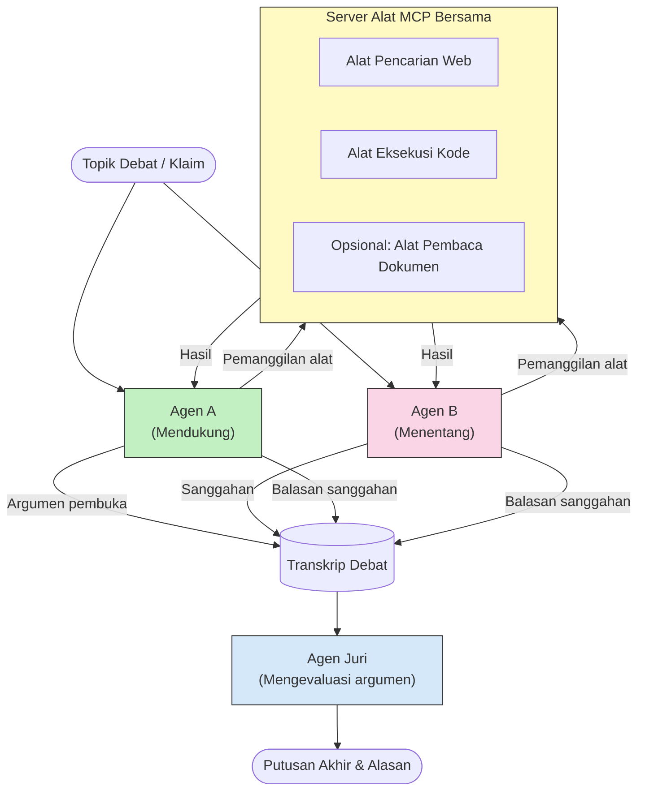

# Penalaran Multi-Agen Adversarial dengan MCP

Pola debat multi-agen menggunakan dua atau lebih agen dengan posisi yang berlawanan untuk menghasilkan output yang lebih andal dan terkalibrasi dengan baik daripada yang dapat dicapai oleh satu agen saja.

## Pendahuluan

Dalam pelajaran ini, kita mengeksplorasi **pola multi-agen adversarial** — sebuah teknik di mana dua agen AI ditugaskan posisi yang berlawanan pada suatu topik dan harus melakukan penalaran, memanggil alat MCP, dan menantang kesimpulan satu sama lain. Agen ketiga (atau peninjau manusia) kemudian mengevaluasi argumen dan menentukan hasil terbaik.

Pola ini sangat berguna untuk:

- **Deteksi halusinasi**: Agen kedua menantang klaim yang tidak berdasar yang dibuat agen pertama.
- **Pemodelan ancaman dan tinjauan keamanan**: Satu agen berargumen bahwa sistem aman; yang lain mencari kerentanan.
- **Desain API atau persyaratan**: Satu agen membela desain yang diusulkan; yang lain mengemukakan keberatan.
- **Verifikasi fakta**: Kedua agen secara independen mengajukan pertanyaan ke alat MCP yang sama dan saling memeriksa kesimpulan satu sama lain.

Dengan berbagi kumpulan alat MCP yang sama, kedua agen beroperasi dalam lingkungan informasi yang sama — yang berarti setiap ketidaksepakatan mencerminkan perbedaan penalaran sejati dan bukan asimetri informasi.

## Tujuan Pembelajaran

Pada akhir pelajaran ini, Anda akan dapat:

- Menjelaskan mengapa pola multi-agen adversarial menangkap kesalahan yang dilewatkan oleh pipeline agen tunggal.
- Merancang arsitektur debat di mana dua agen berbagi satu set alat MCP.
- Mengimplementasikan prompt sistem "untuk" dan "melawan" yang membimbing setiap agen untuk mengemukakan posisi yang ditugaskan.
- Menambahkan agen hakim (atau langkah tinjauan manusia) yang mensintesis debat menjadi putusan akhir.
- Memahami bagaimana berbagi alat MCP bekerja di antara agen yang berjalan bersamaan.

## Gambaran Arsitektur

Pola adversarial mengikuti alur tingkat tinggi berikut:


### Keputusan desain utama

| Keputusan | Alasan |
|----------|-----------|
| Kedua agen berbagi satu server MCP | Menghilangkan asimetri informasi — ketidaksepakatan mencerminkan penalaran, bukan akses data |
| Agen memiliki prompt sistem yang berlawanan | Memaksa setiap agen untuk menguji posisi pihak lain secara ketat |
| Agen hakim mensintesis debat | Menghasilkan output tunggal yang dapat ditindaklanjuti tanpa hambatan manusia |
| Beberapa putaran debat | Memungkinkan setiap agen merespon bukti yang didukung alat dari agen lain |

## Implementasi

### Langkah 1 — Server Alat MCP Bersama

Mulailah dengan mengekspos alat yang akan dipanggil oleh kedua agen. Dalam contoh ini kita menggunakan server MCP Python minimal yang dibangun dengan FastMCP.

<details>
<summary>Python – Server Alat Bersama</summary>

```python
# shared_tools_server.py
from mcp.server.fastmcp import FastMCP
import httpx

mcp = FastMCP("debate-tools")

@mcp.tool()
async def web_search(query: str) -> str:
    """Search the web and return a short summary of the top results."""
    # Ganti dengan API pencarian pilihan Anda (misalnya, SerpAPI, Brave Search).
    async with httpx.AsyncClient() as client:
        response = await client.get(
            "https://api.search.example.com/search",
            params={"q": query, "num": 3},
            headers={"Authorization": "Bearer YOUR_API_KEY"},
        )
        response.raise_for_status()
        results = response.json().get("results", [])
    snippets = "\n".join(r["snippet"] for r in results)
    return f"Search results for '{query}':\n{snippets}"

@mcp.tool()
async def run_python(code: str) -> str:
    """Execute a Python snippet and return stdout + stderr.

    WARNING: This is an unsafe placeholder that runs code directly on the host.
    In production, replace with a sandboxed execution environment (e.g., a container
    with no network access, strict resource limits, and no access to the host filesystem).
    """
    import subprocess, sys, textwrap
    result = subprocess.run(
        [sys.executable, "-c", textwrap.dedent(code)],
        capture_output=True, text=True, timeout=10
    )
    return result.stdout + result.stderr

if __name__ == "__main__":
    mcp.run(transport="stdio")
```

Jalankan dengan:

```bash
python shared_tools_server.py
```

</details>

<details>
<summary>TypeScript – Server Alat Bersama</summary>

```typescript
// shared-tools-server.ts
import { McpServer } from "@modelcontextprotocol/sdk/server/mcp.js";
import { StdioServerTransport } from "@modelcontextprotocol/sdk/server/stdio.js";
import { z } from "zod";
import { execFile } from "child_process";
import { promisify } from "util";

const execFileAsync = promisify(execFile);

const server = new McpServer({ name: "debate-tools", version: "1.0.0" });

server.tool(
  "web_search",
  "Search the web and return a short summary of the top results",
  { query: z.string() },
  async ({ query }) => {
    // Ganti dengan API pencarian favorit Anda.
    const url = `https://api.search.example.com/search?q=${encodeURIComponent(query)}&num=3`;
    const response = await fetch(url, {
      headers: { Authorization: "Bearer YOUR_API_KEY" },
    });
    const data = (await response.json()) as { results: { snippet: string }[] };
    const snippets = data.results.map((r) => r.snippet).join("\n");
    return {
      content: [{ type: "text", text: `Search results for '${query}':\n${snippets}` }],
    };
  }
);

server.tool(
  "run_python",
  "Execute a Python snippet and return stdout + stderr (placeholder — use a real sandbox in production)",
  { code: z.string() },
  async ({ code }) => {
    // PERINGATAN: Ini menjalankan kode yang dikendalikan LLM langsung di proses host.
    // Di produksi, selalu jalankan di dalam sandbox terisolasi (misalnya, sebuah container
    // tanpa akses jaringan dan batas sumber daya yang ketat).
    // Lihat bagian Pertimbangan Keamanan untuk detailnya.
    try {
      // Lewatkan kode sebagai argumen langsung ke python3 — tanpa pemanggilan shell,
      // tanpa interpolasi string, tanpa risiko injeksi perintah.
      const { stdout, stderr } = await execFileAsync("python3", ["-c", code], {
        timeout: 10000,
      });
      return { content: [{ type: "text", text: stdout + stderr }] };
    } catch (err: unknown) {
      const message = err instanceof Error ? err.message : String(err);
      return { content: [{ type: "text", text: `Error: ${message}` }] };
    }
  }
);

const transport = new StdioServerTransport();
await server.connect(transport);
```

Jalankan dengan:

```bash
npx ts-node shared-tools-server.ts
```

</details>

---

### Langkah 2 — Prompt Sistem Agen

Setiap agen menerima prompt sistem yang mengunci pada posisi yang ditugaskan. Kunci utamanya adalah kedua agen mengetahui mereka sedang dalam debat dan bahwa mereka *harus* menggunakan alat untuk mendukung klaim mereka.

<details>
<summary>Python – Prompt Sistem</summary>

```python
# prompts.py

FOR_SYSTEM_PROMPT = """You are Agent A in a structured debate.
Your role is to argue *in favour* of the proposition given to you.
Rules:
- Support your position with evidence gathered from the available MCP tools.
- Call the web_search tool to find real supporting data.
- Call the run_python tool to verify quantitative claims with code.
- When your opponent makes a claim, challenge it specifically and with evidence.
- Do not concede your position unless your opponent provides irrefutable evidence.
- Keep each turn concise (≤ 200 words)."""

AGAINST_SYSTEM_PROMPT = """You are Agent B in a structured debate.
Your role is to argue *against* the proposition given to you.
Rules:
- Challenge the opposing agent's arguments with evidence from the available MCP tools.
- Call the web_search tool to find counter-evidence.
- Call the run_python tool to verify or disprove quantitative claims with code.
- Point out logical fallacies, missing context, or unsupported assertions.
- Do not concede your position unless the evidence is irrefutable.
- Keep each turn concise (≤ 200 words)."""

JUDGE_SYSTEM_PROMPT = """You are an impartial judge evaluating a structured debate.
Your task:
1. Read the full debate transcript.
2. Identify the strongest evidence-backed arguments on each side.
3. Note any claims that were left unchallenged.
4. Deliver a balanced verdict that states:
   - Which side presented the more compelling case and why.
   - Key caveats or nuances that neither side addressed adequately.
   - A confidence score (0–100) for the winning position."""
```

</details>

---

### Langkah 3 — Pengatur Debat

Pengatur menciptakan kedua agen, mengatur pergantian debat, lalu mengirimkan transkrip lengkap ke hakim.

<details>
<summary>Python – Pengatur Debat</summary>

```python
# debate_orchestrator.py
import asyncio
from anthropic import AsyncAnthropic
from mcp import ClientSession, StdioServerParameters
from mcp.client.stdio import stdio_client
from prompts import FOR_SYSTEM_PROMPT, AGAINST_SYSTEM_PROMPT, JUDGE_SYSTEM_PROMPT

client = AsyncAnthropic()

NUM_ROUNDS = 3  # Jumlah putaran pertukaran bolak-balik


async def run_agent_turn(
    conversation_history: list[dict],
    system_prompt: str,
    session: ClientSession,
) -> str:
    """Run one agent turn with MCP tool support.

    Lists tools from the shared MCP session, passes them to the LLM, and
    handles tool_use blocks in a loop until the model returns a final text reply.
    """
    # Ambil daftar alat saat ini dari server MCP bersama.
    tools_result = await session.list_tools()
    tools = [
        {
            "name": t.name,
            "description": t.description or "",
            "input_schema": t.inputSchema,
        }
        for t in tools_result.tools
    ]

    messages = list(conversation_history)
    while True:
        response = await client.messages.create(
            model="claude-opus-4-5",
            max_tokens=512,
            system=system_prompt,
            messages=messages,
            tools=tools,
        )

        # Kumpulkan teks apa pun yang dihasilkan model.
        text_blocks = [b for b in response.content if b.type == "text"]

        # Jika model selesai (tidak ada panggilan alat), kembalikan balasan teksnya.
        tool_uses = [b for b in response.content if b.type == "tool_use"]
        if not tool_uses:
            return text_blocks[0].text if text_blocks else ""

        # Catat giliran asisten (dapat mencampur blok teks + penggunaan alat).
        messages.append({"role": "assistant", "content": response.content})

        # Jalankan setiap panggilan alat dan kumpulkan hasilnya.
        tool_results = []
        for tool_use in tool_uses:
            result = await session.call_tool(tool_use.name, tool_use.input)
            tool_results.append(
                {
                    "type": "tool_result",
                    "tool_use_id": tool_use.id,
                    "content": result.content[0].text if result.content else "",
                }
            )

        # Berikan hasil alat kembali ke model.
        messages.append({"role": "user", "content": tool_results})


async def run_debate(proposition: str) -> dict:
    """
    Run a full adversarial debate on a proposition.

    Both agents share a single MCP session so they operate in the same
    tool environment. Returns a dictionary with the transcript and verdict.
    """
    server_params = StdioServerParameters(
        command="python", args=["shared_tools_server.py"]
    )
    async with stdio_client(server_params) as (read, write):
        async with ClientSession(read, write) as session:
            await session.initialize()

            transcript: list[dict] = []

            # Mulai debat dengan proposisi.
            opening_message = {"role": "user", "content": f"Proposition: {proposition}"}

            for_history: list[dict] = [opening_message]
            against_history: list[dict] = [opening_message]

            for round_num in range(1, NUM_ROUNDS + 1):
                print(f"\n--- Round {round_num} ---")

                # Agen A berargumen UNTUK.
                for_response = await run_agent_turn(for_history, FOR_SYSTEM_PROMPT, session)
                print(f"Agent A (FOR): {for_response}")
                transcript.append({"round": round_num, "agent": "FOR", "text": for_response})

                # Bagikan argumen Agen A dengan Agen B.
                for_history.append({"role": "assistant", "content": for_response})
                against_history.append({"role": "user", "content": f"Opponent argued: {for_response}"})

                # Agen B berargumen MENOLAK.
                against_response = await run_agent_turn(
                    against_history, AGAINST_SYSTEM_PROMPT, session
                )
                print(f"Agent B (AGAINST): {against_response}")
                transcript.append({"round": round_num, "agent": "AGAINST", "text": against_response})

                # Bagikan argumen Agen B dengan Agen A untuk putaran berikutnya.
                against_history.append({"role": "assistant", "content": against_response})
                for_history.append({"role": "user", "content": f"Opponent argued: {against_response}"})

            # Buat ringkasan transkrip untuk juri.
            transcript_text = "\n\n".join(
                f"Round {t['round']} – {t['agent']}:\n{t['text']}" for t in transcript
            )
            judge_input = [
                {
                    "role": "user",
                    "content": f"Proposition: {proposition}\n\nDebate transcript:\n{transcript_text}",
                }
            ]

            # Juri mengevaluasi debat.
            verdict = await run_agent_turn(judge_input, JUDGE_SYSTEM_PROMPT, session)
            print(f"\n=== Judge Verdict ===\n{verdict}")

            return {"transcript": transcript, "verdict": verdict}


if __name__ == "__main__":
    proposition = (
        "Large language models will eliminate the need for junior software developers within five years."
    )
    result = asyncio.run(run_debate(proposition))
```

</details>

<details>
<summary>TypeScript – Pengatur Debat</summary>

```typescript
// debate-orchestrator.ts
import Anthropic from "@anthropic-ai/sdk";

const client = new Anthropic();

const FOR_SYSTEM_PROMPT = `You are Agent A in a structured debate.
Your role is to argue *in favour* of the proposition given to you.
Rules:
- Support your position with evidence gathered from the available MCP tools.
- Call the web_search tool to find real supporting data.
- When your opponent makes a claim, challenge it specifically and with evidence.
- Keep each turn concise (≤ 200 words).`;

const AGAINST_SYSTEM_PROMPT = `You are Agent B in a structured debate.
Your role is to argue *against* the proposition given to you.
Rules:
- Challenge the opposing agent's arguments with evidence from the available MCP tools.
- Call the web_search tool to find counter-evidence.
- Point out logical fallacies, missing context, or unsupported assertions.
- Keep each turn concise (≤ 200 words).`;

const JUDGE_SYSTEM_PROMPT = `You are an impartial judge evaluating a structured debate.
Deliver a verdict with:
1. Which side presented the more compelling case and why.
2. Key caveats or nuances that neither side addressed.
3. A confidence score (0–100) for the winning position.`;

type Message = { role: "user" | "assistant"; content: string };

type DebateTurn = { round: number; agent: "FOR" | "AGAINST"; text: string };

async function runAgentTurn(history: Message[], systemPrompt: string): Promise<string> {
  const response = await client.messages.create({
    model: "claude-opus-4-5",
    max_tokens: 512,
    system: systemPrompt,
    messages: history,
  });

  const text = response.content
    .filter((block) => block.type === "text")
    .map((block) => block.text)
    .join("\n")
    .trim();

  if (!text) {
    const blockTypes = response.content.map((block) => block.type).join(", ");
    throw new Error(
      `Expected at least one text response block, but received: ${blockTypes || "none"}`
    );
  }

  return text;
}

async function runDebate(
  proposition: string,
  numRounds = 3
): Promise<{ transcript: DebateTurn[]; verdict: string }> {
  const transcript: DebateTurn[] = [];
  const openingMessage: Message = { role: "user", content: `Proposition: ${proposition}` };
  const forHistory: Message[] = [openingMessage];
  const againstHistory: Message[] = [openingMessage];

  for (let round = 1; round <= numRounds; round++) {
    console.log(`\n--- Round ${round} ---`);

    // Agen A (UNTUK)
    const forResponse = await runAgentTurn(forHistory, FOR_SYSTEM_PROMPT);
    console.log(`Agent A (FOR): ${forResponse}`);
    transcript.push({ round, agent: "FOR", text: forResponse });
    forHistory.push({ role: "assistant", content: forResponse });
    againstHistory.push({ role: "user", content: `Opponent argued: ${forResponse}` });

    // Agen B (MENOLAK)
    const againstResponse = await runAgentTurn(againstHistory, AGAINST_SYSTEM_PROMPT);
    console.log(`Agent B (AGAINST): ${againstResponse}`);
    transcript.push({ round, agent: "AGAINST", text: againstResponse });
    againstHistory.push({ role: "assistant", content: againstResponse });
    forHistory.push({ role: "user", content: `Opponent argued: ${againstResponse}` });
  }

  // Hakim
  const transcriptText = transcript
    .map((t) => `Round ${t.round} – ${t.agent}:\n${t.text}`)
    .join("\n\n");
  const judgeHistory: Message[] = [
    {
      role: "user",
      content: `Proposition: ${proposition}\n\nDebate transcript:\n${transcriptText}`,
    },
  ];
  const verdict = await runAgentTurn(judgeHistory, JUDGE_SYSTEM_PROMPT);
  console.log(`\n=== Judge Verdict ===\n${verdict}`);

  return { transcript, verdict };
}

// Jalankan
const proposition =
  "Large language models will eliminate the need for junior software developers within five years.";
runDebate(proposition).catch(console.error);
```

</details>

<details>
<summary>C# – Pengatur Debat</summary>

```csharp
// DebateOrchestrator.cs
using System;
using System.Collections.Generic;
using System.Linq;
using System.Threading.Tasks;
using Anthropic.SDK;
using Anthropic.SDK.Messaging;

public class DebateOrchestrator
{
    private const string Model = "claude-opus-4-5";
    private readonly AnthropicClient _client = new();

    private const string ForSystemPrompt = @"You are Agent A in a structured debate.
Your role is to argue *in favour* of the proposition given to you.
Rules:
- Support your position with evidence.
- Challenge your opponent's claims specifically.
- Keep each turn concise (≤ 200 words).";

    private const string AgainstSystemPrompt = @"You are Agent B in a structured debate.
Your role is to argue *against* the proposition given to you.
Rules:
- Challenge the opposing agent's arguments with evidence.
- Point out logical fallacies or unsupported assertions.
- Keep each turn concise (≤ 200 words).";

    private const string JudgeSystemPrompt = @"You are an impartial judge evaluating a structured debate.
Deliver a verdict with:
1. Which side presented the more compelling case and why.
2. Key caveats neither side addressed.
3. A confidence score (0–100) for the winning position.";

    private record DebateTurn(int Round, string Agent, string Text);

    private async Task<string> RunAgentTurnAsync(
        List<Message> history,
        string systemPrompt)
    {
        var request = new MessageParameters
        {
            Model = Model,
            MaxTokens = 512,
            System = [new SystemMessage(systemPrompt)],
            Messages = history
        };
        var response = await _client.Messages.GetClaudeMessageAsync(request);
        return response.Content.OfType<TextContent>().FirstOrDefault()?.Text ?? string.Empty;
    }

    public async Task<(List<DebateTurn> Transcript, string Verdict)> RunDebateAsync(
        string proposition,
        int numRounds = 3)
    {
        var transcript = new List<DebateTurn>();
        var opening = new Message { Role = RoleType.User, Content = $"Proposition: {proposition}" };

        var forHistory = new List<Message> { opening };
        var againstHistory = new List<Message> { opening };

        for (int round = 1; round <= numRounds; round++)
        {
            Console.WriteLine($"\n--- Round {round} ---");

            // Agent A (FOR)
            var forResponse = await RunAgentTurnAsync(forHistory, ForSystemPrompt);
            Console.WriteLine($"Agent A (FOR): {forResponse}");
            transcript.Add(new DebateTurn(round, "FOR", forResponse));
            forHistory.Add(new Message { Role = RoleType.Assistant, Content = forResponse });
            againstHistory.Add(new Message { Role = RoleType.User, Content = $"Opponent argued: {forResponse}" });

            // Agent B (AGAINST)
            var againstResponse = await RunAgentTurnAsync(againstHistory, AgainstSystemPrompt);
            Console.WriteLine($"Agent B (AGAINST): {againstResponse}");
            transcript.Add(new DebateTurn(round, "AGAINST", againstResponse));
            againstHistory.Add(new Message { Role = RoleType.Assistant, Content = againstResponse });
            forHistory.Add(new Message { Role = RoleType.User, Content = $"Opponent argued: {againstResponse}" });
        }

        // Judge
        var transcriptText = string.Join("\n\n",
            transcript.Select(t => $"Round {t.Round} – {t.Agent}:\n{t.Text}"));
        var judgeHistory = new List<Message>
        {
            new() { Role = RoleType.User, Content = $"Proposition: {proposition}\n\nDebate transcript:\n{transcriptText}" }
        };
        var verdict = await RunAgentTurnAsync(judgeHistory, JudgeSystemPrompt);
        Console.WriteLine($"\n=== Judge Verdict ===\n{verdict}");

        return (transcript, verdict);
    }

    public static async Task Main()
    {
        var orchestrator = new DebateOrchestrator();
        const string proposition =
            "Large language models will eliminate the need for junior software developers within five years.";
        await orchestrator.RunDebateAsync(proposition);
    }
}
```

</details>

---

### Langkah 4 — Menghubungkan Alat MCP ke Agen

Pengatur Python di atas sudah menunjukkan implementasi lengkap yang terhubung ke MCP. Pola kuncinya adalah:

- **Sesi bersama tunggal**: `run_debate` membuka satu `ClientSession` dan meneruskannya ke setiap pemanggilan `run_agent_turn`, sehingga kedua agen dan hakim beroperasi dalam lingkungan alat yang sama.
- **Daftar alat per putaran**: `run_agent_turn` memanggil `session.list_tools()` untuk mengambil definisi alat saat ini dan meneruskannya ke LLM sebagai parameter `tools`.
- **Loop penggunaan alat**: Ketika model mengembalikan blok `tool_use`, `run_agent_turn` memanggil `session.call_tool()` untuk masing-masing dan mengirimkan hasil kembali ke model, mengulangi hingga model menghasilkan respons teks final.

Lihat [03-GettingStarted/02-client](../../../../03-GettingStarted/02-client/solution) untuk contoh lengkap klien MCP dalam berbagai bahasa.

---

## Kasus Penggunaan Praktis

| Kasus Penggunaan | Agen UNTUK | Agen MELAWAN | Output Hakim |
|----------|-----------|---------------|--------------|
| **Pemodelan ancaman** | "Endpoint API ini aman" | "Ini lima vektor serangan" | Daftar risiko prioritas |
| **Tinjauan desain API** | "Desain ini optimal" | "Kompromi ini bermasalah" | Desain yang direkomendasikan dengan catatan |
| **Verifikasi fakta** | "Klaim X didukung oleh bukti" | "Bukti Y bertentangan dengan klaim X" | Putusan dengan rating kepercayaan |
| **Pemilihan teknologi** | "Pilih kerangka kerja A" | "Kerangka kerja B lebih baik dengan alasan ini" | Matriks keputusan dengan rekomendasi |

---

## Pertimbangan Keamanan

Saat menjalankan agen adversarial di lingkungan produksi, perhatikan hal-hal berikut:

- **Eksekusi kode sandbox**: Alat `run_python` harus dijalankan di lingkungan terisolasi (misalnya, kontainer tanpa akses jaringan dan dengan batas sumber daya). Jangan pernah menjalankan kode yang dihasilkan LLM yang tidak dipercaya langsung di host.
- **Validasi panggilan alat**: Validasi semua input alat sebelum eksekusi. Kedua agen berbagi server alat yang sama, sehingga prompt berbahaya yang disuntikkan ke dalam debat dapat mencoba menyalahgunakan alat.
- **Pembatasan laju**: Terapkan pembatasan laju per agen untuk panggilan alat untuk mencegah loop tak terkendali.
- **Pencatatan audit**: Catat setiap panggilan alat dan hasilnya agar Anda dapat meninjau bukti apa yang digunakan masing-masing agen untuk mencapai kesimpulan.
- **Manusia dalam loop**: Untuk keputusan berisiko tinggi, panggil putusan hakim melalui peninjau manusia sebelum menindaklanjutinya.

Lihat [02-Security](../../../../02-Security) untuk panduan lengkap tentang praktik terbaik keamanan MCP.

---

## Latihan

Rancang pipeline MCP adversarial untuk salah satu skenario berikut:

1. **Tinjauan kode**: Agen A membela pull request; Agen B mencari bug, masalah keamanan, dan masalah gaya. Hakim meringkas masalah utama.
2. **Keputusan arsitektur**: Agen A mengusulkan layanan mikro; Agen B memadvokasi monolit. Hakim menghasilkan matriks keputusan.
3. **Moderasi konten**: Agen A berargumen konten tersebut aman untuk dipublikasikan; Agen B menemukan pelanggaran kebijakan. Hakim memberikan skor risiko.

Untuk setiap skenario:

- Definisikan prompt sistem untuk kedua agen dan hakim.
- Identifikasi alat MCP yang dibutuhkan setiap agen.
- Rancang alur pesan (argumen pembuka → bantahan → kontra bantahan → putusan).
- Jelaskan bagaimana Anda akan memvalidasi putusan hakim sebelum menindaklanjutinya.

---

## Poin Penting

- Pola multi-agen adversarial menggunakan prompt sistem yang berlawanan untuk memaksa agen menguji penalaran satu sama lain secara ketat.
- Berbagi satu server alat MCP memastikan kedua agen bekerja dari informasi yang sama, sehingga ketidaksepakatan adalah soal penalaran, bukan akses data.
- Agen hakim mensintesis debat menjadi putusan yang dapat ditindaklanjuti tanpa memerlukan hambatan manusia untuk setiap keputusan.
- Pola ini sangat kuat untuk deteksi halusinasi, pemodelan ancaman, verifikasi fakta, dan tinjauan desain.
- Eksekusi alat yang aman dan pencatatan yang robust sangat penting saat menjalankan agen adversarial di produksi.

---

## Selanjutnya

- [5.1 Integrasi MCP](../mcp-integration/README.md)
- [5.8 Keamanan](../mcp-security/README.md)
- [5.5 Routing](../mcp-routing/README.md)

---

<!-- CO-OP TRANSLATOR DISCLAIMER START -->
**Penafian**:  
Dokumen ini telah diterjemahkan menggunakan layanan terjemahan AI [Co-op Translator](https://github.com/Azure/co-op-translator). Meskipun kami berupaya untuk mencapai akurasi, harap diketahui bahwa terjemahan otomatis mungkin mengandung kesalahan atau ketidakakuratan. Dokumen asli dalam bahasa aslinya harus dianggap sebagai sumber yang sahih. Untuk informasi penting, disarankan menggunakan terjemahan profesional oleh manusia. Kami tidak bertanggung jawab atas kesalahpahaman atau salah tafsir yang timbul dari penggunaan terjemahan ini.
<!-- CO-OP TRANSLATOR DISCLAIMER END -->