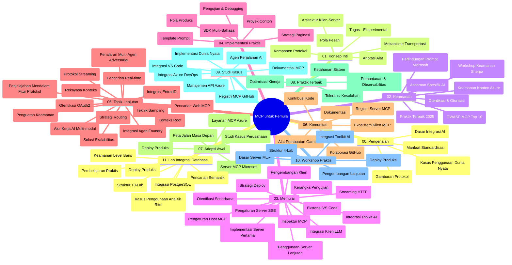

# Model Context Protocol (MCP) untuk Pemula - Panduan Studi

Panduan studi ini memberikan gambaran tentang struktur dan isi repositori untuk kurikulum "Model Context Protocol (MCP) untuk Pemula". Gunakan panduan ini untuk menavigasi repositori secara efisien dan memanfaatkan sumber daya yang tersedia secara maksimal.

## Ikhtisar Repositori

Model Context Protocol (MCP) adalah kerangka kerja standar untuk interaksi antara model AI dan aplikasi klien. Awalnya dibuat oleh Anthropic, MCP kini dipelihara oleh komunitas MCP yang lebih luas melalui organisasi resmi GitHub. Repositori ini menyediakan kurikulum komprehensif dengan contoh kode langsung dalam C#, Java, JavaScript, Python, dan TypeScript, yang dirancang untuk pengembang AI, arsitek sistem, dan insinyur perangkat lunak.

## Peta Kurikulum Visual

## Struktur Repositori

Repositori diorganisasikan ke dalam sebelas bagian utama, masing-masing fokus pada aspek berbeda dari MCP:

1. **Pengenalan (00-Introduction/)**
   - Gambaran umum Model Context Protocol
   - Mengapa standardisasi penting dalam pipeline AI
   - Kasus penggunaan praktis dan manfaat

2. **Konsep Inti (01-CoreConcepts/)**
   - Arsitektur klien-server
   - Komponen protokol kunci
   - Pola pesan dalam MCP

3. **Keamanan (02-Security/)**
   - Ancaman keamanan dalam sistem berbasis MCP
   - Praktik terbaik untuk mengamankan implementasi
   - Strategi autentikasi dan otorisasi
   - **Dokumentasi Keamanan Komprehensif**:
     - Praktik Terbaik Keamanan MCP 2025
     - Panduan Implementasi Azure Content Safety
     - Kontrol dan Teknik Keamanan MCP
     - Referensi Cepat Praktik Terbaik MCP
   - **Topik Keamanan Utama**:
     - Serangan injeksi prompt dan keracunan alat
     - Pembajakan sesi dan masalah confused deputy
     - Kerentanan token passthrough
     - Izin berlebihan dan kontrol akses
     - Keamanan rantai pasokan untuk komponen AI
     - Integrasi Microsoft Prompt Shields

4. **Memulai (03-GettingStarted/)**
   - Penyiapan dan konfigurasi lingkungan
   - Membuat server dan klien MCP dasar
   - Integrasi dengan aplikasi yang sudah ada
   - Termasuk bagian untuk:
     - Implementasi server pertama
     - Pengembangan klien
     - Integrasi klien LLM
     - Integrasi VS Code
     - Server Server-Sent Events (SSE)
     - Penggunaan server tingkat lanjut
     - Streaming HTTP
     - Integrasi AI Toolkit
     - Strategi pengujian
     - Pedoman deployment

5. **Implementasi Praktis (04-PracticalImplementation/)**
   - Menggunakan SDK di berbagai bahasa pemrograman
   - Teknik debugging, pengujian, dan validasi
   - Membuat template prompt dan workflow yang dapat digunakan ulang
   - Proyek contoh dengan contoh implementasi

6. **Topik Lanjutan (05-AdvancedTopics/)**
   - Teknik rekayasa konteks
   - Integrasi agen Foundry
   - Workflow AI multi-modal
   - Demo autentikasi OAuth2
   - Kemampuan pencarian real-time
   - Streaming real-time
   - Implementasi root contexts
   - Strategi routing
   - Teknik sampling
   - Pendekatan scaling
   - Pertimbangan keamanan
   - Integrasi keamanan Entra ID
   - Integrasi pencarian web
   - Penalaran multi-agen adversarial (pola debat)

7. **Kontribusi Komunitas (06-CommunityContributions/)**
   - Cara berkontribusi kode dan dokumentasi
   - Kolaborasi melalui GitHub
   - Peningkatan dan masukan yang digerakkan komunitas
   - Menggunakan berbagai klien MCP (Claude Desktop, Cline, VSCode)
   - Bekerja dengan berbagai server MCP populer termasuk generasi gambar

8. **Pelajaran dari Adopsi Dini (07-LessonsfromEarlyAdoption/)**
   - Implementasi dunia nyata dan kisah sukses
   - Membangun dan menerapkan solusi berbasis MCP
   - Tren dan roadmap masa depan
   - **Panduan Server MCP Microsoft**: Panduan komprehensif untuk 10 server MCP Microsoft siap produksi termasuk:
     - Microsoft Learn Docs MCP Server
     - Azure MCP Server (15+ konektor khusus)
     - GitHub MCP Server
     - Azure DevOps MCP Server
     - MarkItDown MCP Server
     - SQL Server MCP Server
     - Playwright MCP Server
     - Dev Box MCP Server
     - Azure AI Foundry MCP Server
     - Microsoft 365 Agents Toolkit MCP Server

9. **Praktik Terbaik (08-BestPractices/)**
   - Penyempurnaan kinerja dan optimasi
   - Merancang sistem MCP yang tahan kesalahan
   - Strategi pengujian dan ketahanan

10. **Studi Kasus (09-CaseStudy/)**
    - **Tujuh studi kasus komprehensif** yang menunjukkan fleksibilitas MCP dalam berbagai skenario:
    - **Azure AI Travel Agents**: Orkestrasi multi-agen dengan Azure OpenAI dan AI Search
    - **Integrasi Azure DevOps**: Otomasi proses workflow dengan pembaruan data YouTube
    - **Pengambilan Dokumentasi Real-Time**: Klien konsol Python dengan streaming HTTP
    - **Generator Rencana Studi Interaktif**: Aplikasi web Chainlit dengan AI percakapan
    - **Dokumentasi Dalam Editor**: Integrasi VS Code dengan workflow GitHub Copilot
    - **Azure API Management**: Integrasi API perusahaan dengan pembuatan server MCP
    - **GitHub MCP Registry**: Pengembangan ekosistem dan platform integrasi agen
    - Contoh implementasi mencakup integrasi perusahaan, produktivitas pengembang, dan pengembangan ekosistem

11. **Workshop Praktis (10-StreamliningAIWorkflowsBuildingAnMCPServerWithAIToolkit/)**
    - Workshop praktis komprehensif menggabungkan MCP dengan AI Toolkit
    - Membangun aplikasi cerdas yang menjembatani model AI dengan alat dunia nyata
    - Modul praktis mencakup dasar-dasar, pengembangan server kustom, dan strategi deployment produksi
    - **Struktur Lab**:
      - Lab 1: Dasar-dasar Server MCP
      - Lab 2: Pengembangan Server MCP Tingkat Lanjut
      - Lab 3: Integrasi AI Toolkit
      - Lab 4: Deployment dan Scaling Produksi
    - Pendekatan pembelajaran berbasis lab dengan instruksi langkah demi langkah

12. **Lab Integrasi Database Server MCP (11-MCPServerHandsOnLabs/)**
    - **Jalur pembelajaran 13 lab komprehensif** untuk membangun server MCP siap produksi dengan integrasi PostgreSQL
    - **Implementasi analitik ritel dunia nyata** menggunakan kasus penggunaan Zava Retail
    - **Pola tingkat perusahaan** termasuk Row Level Security (RLS), pencarian semantik, dan akses data multi-tenant
    - **Struktur Lab Lengkap**:
      - **Lab 00-03: Dasar-Dasar** - Pengenalan, Arsitektur, Keamanan, Penyiapan Lingkungan
      - **Lab 04-06: Membangun Server MCP** - Desain Database, Implementasi Server MCP, Pengembangan Alat
      - **Lab 07-09: Fitur Tingkat Lanjut** - Pencarian Semantik, Pengujian & Debugging, Integrasi VS Code
      - **Lab 10-12: Produksi & Praktik Terbaik** - Deployment, Monitoring, Optimasi
    - **Teknologi yang Dicakup**: Kerangka kerja FastMCP, PostgreSQL, Azure OpenAI, Azure Container Apps, Application Insights
    - **Hasil Pembelajaran**: Server MCP siap produksi, pola integrasi database, analitik bertenaga AI, keamanan tingkat perusahaan

## Sumber Daya Tambahan

Repositori mencakup sumber daya pendukung:

- **Folder Gambar**: Berisi diagram dan ilustrasi yang digunakan sepanjang kurikulum
- **Terjemahan**: Dukungan multi-bahasa dengan terjemahan otomatis dokumentasi
- **Sumber Daya Resmi MCP**:
  - [Dokumentasi MCP](https://modelcontextprotocol.io/)
  - [Spesifikasi MCP](https://spec.modelcontextprotocol.io/)
  - [Repositori MCP GitHub](https://github.com/modelcontextprotocol)

## Cara Menggunakan Repositori Ini

1. **Pembelajaran Berurutan**: Ikuti bab secara berurutan (00 hingga 11) untuk pengalaman belajar terstruktur.
2. **Fokus Bahasa Spesifik**: Jika tertarik pada bahasa pemrograman tertentu, telusuri direktori contoh untuk implementasi dalam bahasa pilihan Anda.
3. **Implementasi Praktis**: Mulailah dengan bagian "Memulai" untuk menyiapkan lingkungan Anda dan membuat server serta klien MCP pertama Anda.
4. **Eksplorasi Lanjutan**: Setelah nyaman dengan dasar, selami topik lanjutan untuk memperluas pengetahuan Anda.
5. **Keterlibatan Komunitas**: Bergabunglah dengan komunitas MCP melalui diskusi GitHub dan saluran Discord untuk terhubung dengan para ahli dan pengembang lain.

## Klien dan Alat MCP

Kurikulum mencakup berbagai klien dan alat MCP:

1. **Klien Resmi**:
   - Visual Studio Code
   - MCP di Visual Studio Code
   - Claude Desktop
   - Claude di VSCode
   - Claude API

2. **Klien Komunitas**:
   - Cline (berbasis terminal)
   - Cursor (editor kode)
   - ChatMCP
   - Windsurf

3. **Alat Manajemen MCP**:
   - MCP CLI
   - MCP Manager
   - MCP Linker
   - MCP Router

## Server MCP Populer

Repositori memperkenalkan berbagai server MCP, termasuk:

1. **Server MCP Microsoft Resmi**:
   - Microsoft Learn Docs MCP Server
   - Azure MCP Server (15+ konektor khusus)
   - GitHub MCP Server
   - Azure DevOps MCP Server
   - MarkItDown MCP Server
   - SQL Server MCP Server
   - Playwright MCP Server
   - Dev Box MCP Server
   - Azure AI Foundry MCP Server
   - Microsoft 365 Agents Toolkit MCP Server

2. **Server Referensi Resmi**:
   - Filesystem
   - Fetch
   - Memory
   - Sequential Thinking

3. **Generasi Gambar**:
   - Azure OpenAI DALL-E 3
   - Stable Diffusion WebUI
   - Replicate

4. **Alat Pengembangan**:
   - Git MCP
   - Terminal Control
   - Code Assistant

5. **Server Khusus**:
   - Salesforce
   - Microsoft Teams
   - Jira & Confluence

## Kontribusi

Repositori ini menyambut kontribusi dari komunitas. Lihat bagian Kontribusi Komunitas untuk panduan cara berkontribusi secara efektif ke ekosistem MCP.

----

*Panduan studi ini terakhir diperbarui pada 5 Februari 2026, mencerminkan Spesifikasi MCP terbaru 2025-11-25 dan memberikan gambaran isi repositori hingga tanggal tersebut. Isi repositori dapat diperbarui setelah tanggal ini.*

---

<!-- CO-OP TRANSLATOR DISCLAIMER START -->
**Penafian**:  
Dokumen ini telah diterjemahkan menggunakan layanan penerjemahan AI [Co-op Translator](https://github.com/Azure/co-op-translator). Meskipun kami berusaha untuk akurat, harap diperhatikan bahwa terjemahan otomatis mungkin mengandung kesalahan atau ketidakakuratan. Dokumen asli dalam bahasa aslinya harus dianggap sebagai sumber otoritatif. Untuk informasi penting, disarankan menggunakan terjemahan profesional oleh manusia. Kami tidak bertanggung jawab atas kesalahpahaman atau kesalahan interpretasi yang timbul dari penggunaan terjemahan ini.
<!-- CO-OP TRANSLATOR DISCLAIMER END -->