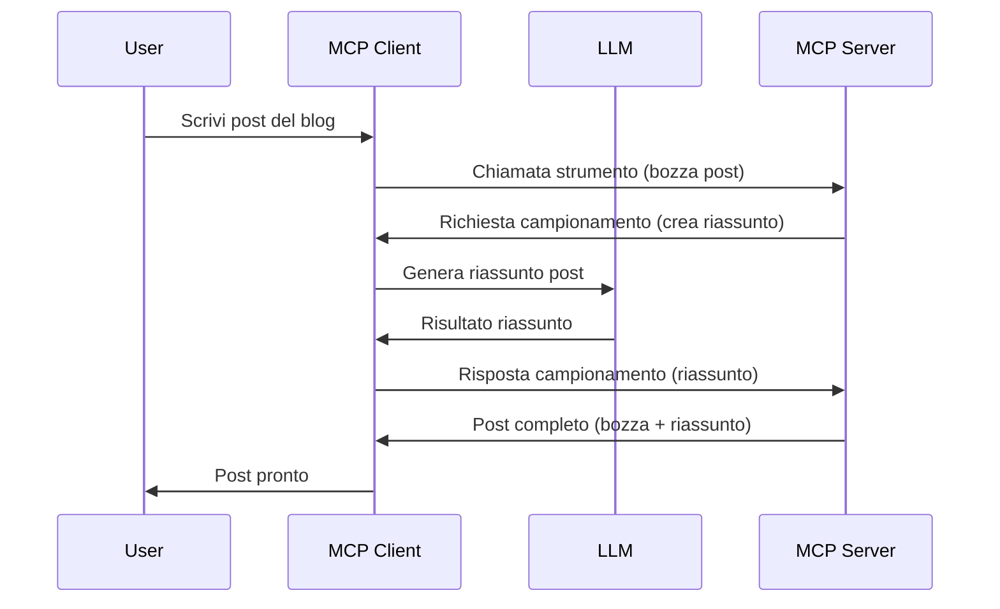

# Sampling - delegare le funzionalità al Client

A volte, è necessario che il Client MCP e il Server MCP collaborino per raggiungere un obiettivo comune. Potresti avere un caso in cui il Server richiede l'aiuto di un LLM che si trova sul client. Per questa situazione, lo sampling è ciò che dovresti usare.

Esploriamo alcuni casi d'uso e come costruire una soluzione che coinvolge lo sampling.

## Panoramica

In questa lezione, ci concentriamo sul spiegare quando e dove utilizzare lo Sampling e come configurarlo.

## Obiettivi di apprendimento

In questo capitolo, faremo:

- Spiegare cos'è lo Sampling e quando usarlo.
- Mostrare come configurare lo Sampling in MCP.
- Fornire esempi di Sampling in azione.

## Cos'è lo Sampling e perché usarlo?

Lo Sampling è una funzionalità avanzata che funziona nel seguente modo:


### Richiesta di Sampling

Ok, ora abbiamo una panoramica ampia di uno scenario credibile, parliamo della richiesta di sampling che il server invia al client. Ecco come può apparire una tale richiesta in formato JSON-RPC:

```json
{
  "jsonrpc": "2.0",
  "id": 1,
  "method": "sampling/createMessage",
  "params": {
    "messages": [
      {
        "role": "user",
        "content": {
          "type": "text",
          "text": "Create a blog post summary of the following blog post: <BLOG POST>"
        }
      }
    ],
    "modelPreferences": {
      "hints": [
        {
          "name": "claude-3-sonnet"
        }
      ],
      "intelligencePriority": 0.8,
      "speedPriority": 0.5
    },
    "systemPrompt": "You are a helpful assistant.",
    "maxTokens": 100
  }
}
```

Ci sono alcune cose che meritano di essere evidenziate:

- Prompt, sotto content -> text, è il nostro prompt che è un'istruzione per l'LLM per riassumere il contenuto del blog post.

- **modelPreferences**. Questa sezione è proprio questo, una preferenza, una raccomandazione su quale configurazione utilizzare con l'LLM. L'utente può scegliere se seguire queste raccomandazioni o modificarle. In questo caso ci sono raccomandazioni su quale modello usare e priorità su velocità e intelligenza.
- **systemPrompt**, questo è il tuo normale prompt di sistema che dà all'LLM una personalità e contiene istruzioni guida.
- **maxTokens**, questa è un'altra proprietà usata per indicare quanti token sono raccomandati per questo compito.

### Risposta di Sampling

Questa risposta è ciò che il Client MCP finisce per inviare indietro al Server MCP ed è il risultato della chiamata del client all'LLM, attesa per quella risposta e poi costruzione di questo messaggio. Ecco come può apparire in JSON-RPC:

```json
{
  "jsonrpc": "2.0",
  "id": 1,
  "result": {
    "role": "assistant",
    "content": {
      "type": "text",
      "text": "Here's your abstract <ABSTRACT>"
    },
    "model": "gpt-5",
    "stopReason": "endTurn"
  }
}
```

Nota come la risposta sia un abstract del blog post proprio come abbiamo chiesto. Nota anche come il `model` usato non sia quello che abbiamo chiesto ma "gpt-5" invece di "claude-3-sonnet". Questo per illustrare che l'utente può cambiare idea su cosa usare e che la tua richiesta di sampling è una raccomandazione.

Ok, ora che abbiamo capito il flusso principale, e un compito utile per usarlo "creazione + abstract di blog post", vediamo cosa dobbiamo fare per farlo funzionare.

### Tipi di messaggi

I messaggi di sampling non sono limitati solo al testo ma puoi anche inviare immagini e audio. Ecco come appare differentemente il JSON-RPC:

**Testo**

```json
{
  "type": "text",
  "text": "The message content"
}
```

**Contenuto immagine**

```json
{
  "type": "image",
  "data": "base64-encoded-image-data",
  "mimeType": "image/jpeg"
}
```

**Contenuto audio**

```json
{
  "type": "audio",
  "data": "base64-encoded-audio-data",
  "mimeType": "audio/wav"
}
```

> NOTE: per informazioni più dettagliate sullo Sampling, consulta la [documentazione ufficiale](https://modelcontextprotocol.io/specification/2025-06-18/client/sampling)

## Come configurare lo Sampling nel Client

> Nota: se stai costruendo solo un server, non devi fare molto qui.

In un client, devi specificare la seguente funzionalità in questo modo:

```json
{
  "capabilities": {
    "sampling": {}
  }
}
```

Questa verrà poi rilevata quando il client selezionato si inizializza con il server.

## Esempio di Sampling in Azione - Creare un Blog Post

Creiamo insieme un server di sampling, dovremo fare quanto segue:

1. Creare uno strumento sul Server.
2. Questo strumento dovrebbe creare una richiesta di sampling.
3. Lo strumento dovrebbe attendere che la richiesta di sampling del client venga risposta.
4. Poi lo strumento dovrebbe produrre il risultato.

Vediamo il codice passo per passo:

### -1- Creare lo strumento

**python**

```python
@mcp.tool()
async def create_blog(title: str, content: str, ctx: Context[ServerSession, None]) -> str:
    """Create a blog post and generate a summary"""

```

### -2- Creare una richiesta di sampling

Estendi il tuo strumento con il codice seguente:

**python**

```python
post = BlogPost(
        id=len(posts) + 1,
        title=title,
        content=content,
        abstract=""
    )

prompt = f"Create an abstract of the following blog post: title: {title} and draft: {content} "

result = await ctx.session.create_message(
        messages=[
            SamplingMessage(
                role="user",
                content=TextContent(type="text", text=prompt),
            )
        ],
        max_tokens=100,
)

```

### -3- Attendere la risposta e restituirla

**python**

```python
post.abstract = result.content.text

posts.append(post)

# restituisci il prodotto completo
return json.dumps({
    "id": post.title,
    "abstract": post.abstract
})
```

### -4- Codice completo

**python**

```python
from starlette.applications import Starlette
from starlette.routing import Mount, Host

from mcp.server.fastmcp import Context, FastMCP

from mcp.server.session import ServerSession
from mcp.types import SamplingMessage, TextContent

import json


from uuid import uuid4
from typing import List
from pydantic import BaseModel


mcp = FastMCP("Blog post generator")

# app = FastAPI()

posts = []

class BlogPost(BaseModel):
    id: int
    title: str
    content: str
    abstract: str

posts: List[BlogPost] = []

@mcp.tool()
async def create_blog(title: str, content: str, ctx: Context[ServerSession, None]) -> str:
    """Create a blog post and generate a summary"""

    post = BlogPost(
        id=len(posts) + 1,
        title=title,
        content=content,
        abstract=""
    )

    prompt = f"Create an abstract of the following blog post: title: {title} and draft: {content} "

    result = await ctx.session.create_message(
        messages=[
            SamplingMessage(
                role="user",
                content=TextContent(type="text", text=prompt),
            )
        ],
        max_tokens=100,
    )

    post.abstract = result.content.text

    posts.append(post)

    # restituisci il post completo del blog
    return json.dumps({
        "id": post.title,
        "abstract": post.abstract
    })

if __name__ == "__main__":
    print("Starting server...")
    # mcp.run()
    mcp.run(transport="streamable-http")

# esegui l'app con: python server.py
```

### -5- Testare in Visual Studio Code

Per testare questo in Visual Studio Code, fai quanto segue:

1. Avvia il server nel terminale
2. Aggiungilo a *mcp.json* (e assicurati che sia avviato) ad esempio qualcosa del genere:

   ```json
   "servers": {
      "blog-server": {
        "type": "http",
        "url": "http://localhost:8000/mcp"
      }
   }
   ```

3. Digita un prompt:

   ```text
   create a blog post named "Where Python comes from", the content is "Python is actually named after Monty Python Flying Circus"
   ```

4. Permetti che il sampling avvenga. La prima volta che testi questo ti verrà presentata una finestra aggiuntiva che dovrai accettare, poi vedrai la finestra normale per chiederti di eseguire uno strumento

5. Ispeziona i risultati. Vedrai i risultati sia ben resi in GitHub Copilot Chat ma puoi anche ispezionare la risposta JSON grezza.

**Bonus**. Gli strumenti di Visual Studio Code hanno un ottimo supporto per lo sampling. Puoi configurare l’accesso allo Sampling sul server installato navigando così:

1. Vai alla sezione delle estensioni.
2. Seleziona l’icona dell’ingranaggio per il server installato nella sezione "MCP SERVERS - INSTALLED".
3. Seleziona "Configure Model Access", qui puoi scegliere quali modelli GitHub Copilot è autorizzato a usare quando esegue lo sampling. Puoi anche vedere tutte le richieste di sampling recenti selezionando "Show Sampling requests".

## Compito

In questo compito, costruirai uno sampling leggermente diverso, cioè un’integrazione di sampling che supporta la generazione di una descrizione prodotto. Ecco il tuo scenario:

**Scenario**: L’addetto del back office di un e-commerce ha bisogno di aiuto, ci vuole troppo tempo per generare descrizioni prodotto. Pertanto, devi costruire una soluzione dove puoi chiamare uno strumento "create_product" con "title" e "keywords" come argomenti e dovrebbe produrre un prodotto completo inclusivo di un campo "description" che viene popolato dall’LLM del client.

TIP: usa ciò che hai imparato prima per costruire questo server e il suo strumento usando una richiesta di sampling.

## Soluzione

[Soluzione](./solution/README.md)

## Conclusioni chiave

Lo Sampling è una funzionalità potente che permette al server di delegare compiti al client quando ha bisogno dell’aiuto di un LLM.

## Cosa c’è dopo

- [Capitolo 4 - Implementazione pratica](../../04-PracticalImplementation/README.md)

---

<!-- CO-OP TRANSLATOR DISCLAIMER START -->
**Disclaimer**:  
Questo documento è stato tradotto utilizzando il servizio di traduzione automatica [Co-op Translator](https://github.com/Azure/co-op-translator). Pur impegnandoci per garantire accuratezza, si prega di considerare che le traduzioni automatiche possono contenere errori o imprecisioni. Il documento originale nella sua lingua originaria deve essere considerato la fonte autorevole. Per informazioni critiche, si consiglia la traduzione professionale effettuata da un umano. Non siamo responsabili per incomprensioni o interpretazioni errate derivanti dall’uso di questa traduzione.
<!-- CO-OP TRANSLATOR DISCLAIMER END -->