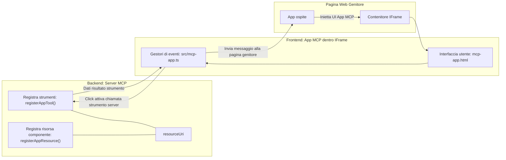

# MCP Apps

MCP Apps è un nuovo paradigma in MCP. L'idea è che non solo si risponde con i dati da una chiamata a uno strumento, ma si fornisce anche informazioni su come questi dati dovrebbero essere interagiti. Ciò significa che i risultati degli strumenti ora possono contenere informazioni sull'interfaccia utente. Perché dovremmo volerlo? Bene, considera come fai le cose oggi. Probabilmente stai consumando i risultati di un MCP Server mettendo un qualche tipo di frontend davanti ad esso, e quel codice devi scriverlo e mantenerlo. A volte è quello che vuoi, ma a volte sarebbe fantastico poter semplicemente portare un frammento di informazioni che è autonomo e che ha tutto, dai dati all'interfaccia utente.

## Panoramica

Questa lezione fornisce una guida pratica su MCP Apps, come iniziare e come integrarlo nelle tue Web App esistenti. MCP Apps è una aggiunta molto recente allo Standard MCP.

## Obiettivi di apprendimento

Al termine di questa lezione, sarai in grado di:

- Spiegare cosa sono gli MCP Apps.
- Quando usare gli MCP Apps.
- Costruire e integrare i tuoi MCP Apps.

## MCP Apps - come funziona

L'idea con MCP Apps è fornire una risposta che essenzialmente è un componente da rendere. Tale componente può avere sia elementi visivi che interattivi, ad esempio clic su pulsanti, input dell'utente e altro. Iniziamo con il lato server e il nostro MCP Server. Per creare un componente MCP App devi creare un tool ma anche la risorsa applicativa. Queste due parti sono connesse da un resourceUri. 

Ecco un esempio. Proviamo a visualizzare cosa è coinvolto e quali parti fanno cosa:

```text
server.ts -- responsible for registering tools and the component as a UI component
src/
  mcp-app.ts -- wiring up event handlers
mcp-app.html -- the user interface
```

Questo visual descrive l'architettura per creare un componente e la sua logica.


Proviamo a descrivere di seguito le responsabilità rispettivamente per backend e frontend.

### Il backend

Ci sono due cose che dobbiamo realizzare qui:

- Registrare gli strumenti con cui vogliamo interagire.
- Definire il componente.

**Registrare lo strumento**

```typescript
registerAppTool(
    server,
    "get-time",
    {
      title: "Get Time",
      description: "Returns the current server time.",
      inputSchema: {},
      _meta: { ui: { resourceUri } }, // Collega questo strumento alla sua risorsa UI
    },
    async () => {
      const time = new Date().toISOString();
      return { content: [{ type: "text", text: time }] };
    },
  );

```

Il codice precedente descrive il comportamento, dove espone uno strumento chiamato `get-time`. Non prende input ma produce l'ora corrente. Abbiamo la possibilità di definire uno `inputSchema` per gli strumenti dove dobbiamo poter accettare input dall'utente.

**Registrare il componente**

Nel medesimo file, dobbiamo anche registrare il componente:

```typescript
const resourceUri = "ui://get-time/mcp-app.html";

// Registra la risorsa, che restituisce l'HTML/JavaScript pacchettizzato per l'interfaccia utente.
registerAppResource(
  server,
  resourceUri,
  resourceUri,
  { mimeType: RESOURCE_MIME_TYPE },
  async () => {
    const html = await fs.readFile(path.join(DIST_DIR, "mcp-app.html"), "utf-8");

    return {
    contents: [
        { uri: resourceUri, mimeType: RESOURCE_MIME_TYPE, text: html },
    ],
    };
  },
);
```

Nota come menzioniamo `resourceUri` per connettere il componente ai suoi strumenti. Di interesse è anche la callback dove carichiamo il file UI e ritorniamo il componente.

### Il frontend del componente

Come per il backend, ci sono due parti qui:

- Un frontend scritto in puro HTML.
- Codice che gestisce eventi e cosa fare, ad esempio chiamare strumenti o mandare messaggi alla finestra genitore.

**Interfaccia utente**

Diamo un'occhiata all'interfaccia utente.

```html
<!-- mcp-app.html -->
<!DOCTYPE html>
<html lang="en">
  <head>
    <meta charset="UTF-8" />
    <title>Get Time App</title>
  </head>
  <body>
    <p>
      <strong>Server Time:</strong> <code id="server-time">Loading...</code>
    </p>
    <button id="get-time-btn">Get Server Time</button>
    <script type="module" src="/src/mcp-app.ts"></script>
  </body>
</html>
```

**Collegamento eventi**

L'ultima parte è il collegamento degli eventi. Ciò significa identificare quale parte della UI necessita di gestori di eventi e cosa fare se gli eventi vengono attivati:

```typescript
// mcp-app.ts

import { App } from "@modelcontextprotocol/ext-apps";

// Ottieni riferimenti agli elementi
const serverTimeEl = document.getElementById("server-time")!;
const getTimeBtn = document.getElementById("get-time-btn")!;

// Crea l'istanza dell'app
const app = new App({ name: "Get Time App", version: "1.0.0" });

// Gestisci i risultati degli strumenti dal server. Impostalo prima di `app.connect()` per evitare
// di perdere il risultato iniziale dello strumento.
app.ontoolresult = (result) => {
  const time = result.content?.find((c) => c.type === "text")?.text;
  serverTimeEl.textContent = time ?? "[ERROR]";
};

// Collega il click del pulsante
getTimeBtn.addEventListener("click", async () => {
  // `app.callServerTool()` permette all'interfaccia utente di richiedere dati aggiornati dal server
  const result = await app.callServerTool({ name: "get-time", arguments: {} });
  const time = result.content?.find((c) => c.type === "text")?.text;
  serverTimeEl.textContent = time ?? "[ERROR]";
});

// Connetti all'host
app.connect();
```

Come si può vedere da quanto sopra, questo è codice normale per collegare elementi del DOM agli eventi. Vale la pena evidenziare la chiamata a `callServerTool` che alla fine chiama uno strumento sul backend.

## Gestire l'input dell'utente

Finora, abbiamo visto un componente con un pulsante che quando cliccato chiama uno strumento. Vediamo se possiamo aggiungere più elementi UI come un campo input e vedere se possiamo mandare argomenti a uno strumento. Implementiamo una funzionalità FAQ. Ecco come dovrebbe funzionare:

- Dovrebbe esserci un pulsante e un elemento input dove l'utente scrive una parola chiave da cercare, ad esempio "Shipping" (spedizione). Questo dovrebbe chiamare uno strumento sul backend che fa una ricerca nei dati FAQ.
- Uno strumento che supporta la ricerca FAQ menzionata.

Aggiungiamo il supporto necessario al backend prima:

```typescript
const faq: { [key: string]: string } = {
    "shipping": "Our standard shipping time is 3-5 business days.",
    "return policy": "You can return any item within 30 days of purchase.",
    "warranty": "All products come with a 1-year warranty covering manufacturing defects.",
  }

registerAppTool(
    server,
    "get-faq",
    {
      title: "Search FAQ",
      description: "Searches the FAQ for relevant answers.",
      inputSchema: zod.object({
        query: zod.string().default("shipping"),
      }),
      _meta: { ui: { resourceUri: faqResourceUri } }, // Collega questo strumento alla sua risorsa UI
    },
    async ({ query }) => {
      const answer: string = faq[query.toLowerCase()] || "Sorry, I don't have an answer for that.";
      return { content: [{ type: "text", text: answer }] };
    },
  );
```

Quello che vediamo qui è come popolare `inputSchema` e dargli uno schema `zod` come segue:

```typescript
inputSchema: zod.object({
  query: zod.string().default("shipping"),
})
```

Nello schema sopra dichiariamo di avere un parametro di input chiamato `query` e che è opzionale con un valore di default "shipping".

Ok, passiamo a *mcp-app.html* per vedere quale UI dobbiamo creare per questo:

```html
<div class="faq">
    <h1>FAQ response</h1>
    <p>FAQ Response: <code id="faq-response">Loading...</code></p>
    <input type="text" id="faq-query" placeholder="Enter FAQ query" />
    <button id="get-faq-btn">Get FAQ Response</button>
  </div>
```

Ottimo, ora abbiamo un elemento input e un pulsante. Passiamo a *mcp-app.ts* per collegare questi eventi:

```typescript
const getFaqBtn = document.getElementById("get-faq-btn")!;
const faqQueryInput = document.getElementById("faq-query") as HTMLInputElement;

getFaqBtn.addEventListener("click", async () => {
  const query = faqQueryInput.value;
  const result = await app.callServerTool({ name: "get-faq", arguments: { query } });
  const faq = result.content?.find((c) => c.type === "text")?.text;
  faqResponseEl.textContent = faq ?? "[ERROR]";
});
```

Nel codice sopra:

- Creiamo riferimenti agli elementi UI interattivi.
- Gestiamo il click del pulsante per leggere il valore dell'elemento input e chiamiamo anche `app.callServerTool()` con `name` e `arguments` dove quest’ultimo passa `query` come valore.

Quello che succede effettivamente quando chiami `callServerTool` è che invia un messaggio alla finestra genitore e quella finestra finisce col chiamare l'MCP Server.

### Provalo

Provando questo dovremmo ora vedere quanto segue:


e qui lo proviamo con input come "warranty" (garanzia)


Per eseguire questo codice, vai alla [sezione Codice](./code/README.md)

## Test in Visual Studio Code

Visual Studio Code ha un ottimo supporto per MCP Apps ed è probabilmente uno dei modi più semplici per testare i tuoi MCP Apps. Per usare Visual Studio Code, aggiungi una voce server in *mcp.json* come segue:

```json
"my-mcp-server-7178eca7": {
    "url": "http://localhost:3001/mcp",
    "type": "http"
  }
```

Quindi avvia il server, dovresti poter comunicare con il tuo MCP App tramite la Finestra Chat a condizione che tu abbia installato GitHub Copilot.

Puoi lanciarlo tramite un prompt, ad esempio "#get-faq":


e proprio come quando lo hai eseguito tramite browser, viene renderizzato allo stesso modo così:


## Compito

Crea un gioco carta, forbice, sasso. Dovrebbe consistere in:

UI:

- una lista a discesa con opzioni
- un pulsante per inviare la scelta
- un'etichetta che mostra chi ha scelto cosa e chi ha vinto

Server:

- dovrebbe avere uno strumento carta forbice sasso che prende "choice" come input. Dovrebbe anche generare una scelta del computer e determinare il vincitore

## Soluzione

[Soluzione](./assignment/README.md)

## Riepilogo

Abbiamo appreso questo nuovo paradigma MCP Apps. È un nuovo paradigma che permette agli MCP Server di avere un'opinione non solo sui dati ma anche su come questi dati dovrebbero essere presentati.

Inoltre, abbiamo imparato che questi MCP Apps sono ospitati in un IFrame e per comunicare con gli MCP Server devono mandare messaggi all'app web genitore. Ci sono diverse librerie disponibili sia per JavaScript puro che per React e altro che rendono questa comunicazione più semplice.

## Punti chiave

Ecco cosa hai imparato:

- MCP Apps è un nuovo standard che può essere utile quando vuoi spedire sia dati che funzionalità UI.
- Questi tipi di app girano in un IFrame per motivi di sicurezza.

## Cosa c’è dopo

- [Capitolo 4](../../04-PracticalImplementation/README.md)

---

<!-- CO-OP TRANSLATOR DISCLAIMER START -->
**Disclaimer**:  
Questo documento è stato tradotto utilizzando il servizio di traduzione automatica [Co-op Translator](https://github.com/Azure/co-op-translator). Sebbene ci impegniamo per l’accuratezza, si prega di notare che le traduzioni automatiche possono contenere errori o inesattezze. Il documento originale nella sua lingua madre deve essere considerato la fonte autorevole. Per informazioni critiche, si raccomanda una traduzione professionale effettuata da un traduttore umano. Non siamo responsabili per eventuali malintesi o interpretazioni errate derivanti dall’uso di questa traduzione.
<!-- CO-OP TRANSLATOR DISCLAIMER END -->