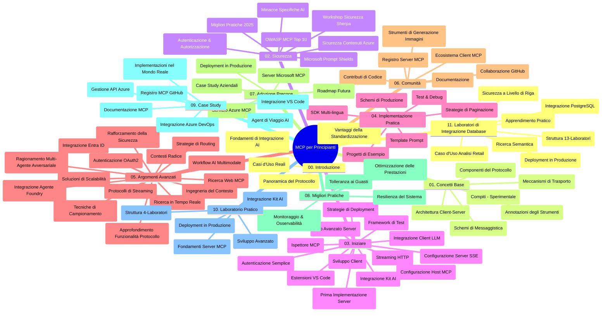

# Model Context Protocol (MCP) per Principianti - Guida di Studio

Questa guida di studio fornisce una panoramica della struttura e del contenuto del repository per il curriculum "Model Context Protocol (MCP) per Principianti". Usa questa guida per navigare nel repository in modo efficiente e sfruttare al meglio le risorse disponibili.

## Panoramica del Repository

Il Model Context Protocol (MCP) è un framework standardizzato per le interazioni tra modelli AI e applicazioni client. Inizialmente creato da Anthropic, MCP è ora mantenuto dalla più ampia comunità MCP tramite l'organizzazione ufficiale su GitHub. Questo repository offre un curriculum completo con esempi pratici di codice in C#, Java, JavaScript, Python e TypeScript, progettato per sviluppatori AI, architetti di sistema e ingegneri del software.

## Mappa Visiva del Curriculum

## Struttura del Repository

Il repository è organizzato in undici sezioni principali, ciascuna focalizzata su diversi aspetti del MCP:

1. **Introduzione (00-Introduction/)**
   - Panoramica del Model Context Protocol
   - Perché la standardizzazione è importante nelle pipeline AI
   - Casi d'uso pratici e vantaggi

2. **Concetti Base (01-CoreConcepts/)**
   - Architettura client-server
   - Componenti chiave del protocollo
   - Pattern di messaggistica in MCP

3. **Sicurezza (02-Security/)**
   - Minacce alla sicurezza in sistemi basati su MCP
   - Best practice per mettere in sicurezza le implementazioni
   - Strategie di autenticazione e autorizzazione
   - **Documentazione Completa sulla Sicurezza**:
     - Best Practice di Sicurezza MCP 2025
     - Guida all’implementazione di Azure Content Safety
     - Controlli e tecniche di sicurezza MCP
     - Riferimento rapido sulle Best Practice MCP
   - **Argomenti Chiave di Sicurezza**:
     - Attacchi di prompt injection e avvelenamento degli strumenti
     - Hijacking di sessione e problemi di confused deputy
     - Vulnerabilità di token passthrough
     - Permessi e controllo accessi eccessivi
     - Sicurezza della supply chain per componenti AI
     - Integrazione con Microsoft Prompt Shields

4. **Primi Passi (03-GettingStarted/)**
   - Configurazione e setup dell'ambiente
   - Creazione di server e client MCP di base
   - Integrazione con applicazioni esistenti
   - Include sezioni per:
     - Prima implementazione del server
     - Sviluppo client
     - Integrazione client LLM
     - Integrazione con VS Code
     - Server con Server-Sent Events (SSE)
     - Uso avanzato del server
     - Streaming HTTP
     - Integrazione con AI Toolkit
     - Strategie di testing
     - Linee guida per il deployment

5. **Implementazione Pratica (04-PracticalImplementation/)**
   - Uso di SDK in diversi linguaggi di programmazione
   - Tecniche di debug, test e validazione
   - Creazione di template e workflow riutilizzabili per prompt
   - Progetti di esempio con implementazioni

6. **Argomenti Avanzati (05-AdvancedTopics/)**
   - Tecniche di ingegneria del contesto
   - Integrazione con agenti Foundry
   - Workflow AI multimodali
   - Demo di autenticazione OAuth2
   - Capacità di ricerca in tempo reale
   - Streaming in tempo reale
   - Implementazione di root context
   - Strategie di routing
   - Tecniche di sampling
   - Approcci di scalabilità
   - Considerazioni di sicurezza
   - Integrazione di sicurezza Entra ID
   - Integrazione con web search
   - Ragionamento multi-agente avversariale (pattern di dibattito)

7. **Contributi della Comunità (06-CommunityContributions/)**
   - Come contribuire con codice e documentazione
   - Collaborazione tramite GitHub
   - Miglioramenti e feedback guidati dalla comunità
   - Uso di vari client MCP (Claude Desktop, Cline, VSCode)
   - Lavorare con popolari server MCP inclusa generazione di immagini

8. **Lezioni dall’Adozione Precoce (07-LessonsfromEarlyAdoption/)**
   - Implementazioni reali e storie di successo
   - Costruzione e deploy di soluzioni basate su MCP
   - Tendenze e roadmap futura
   - **Guida ai Server MCP Microsoft**: Guida completa a 10 server Microsoft MCP pronti per la produzione tra cui:
     - Microsoft Learn Docs MCP Server
     - Azure MCP Server (15+ connettori specializzati)
     - GitHub MCP Server
     - Azure DevOps MCP Server
     - MarkItDown MCP Server
     - SQL Server MCP Server
     - Playwright MCP Server
     - Dev Box MCP Server
     - Azure AI Foundry MCP Server
     - Microsoft 365 Agents Toolkit MCP Server

9. **Best Practice (08-BestPractices/)**
   - Ottimizzazione e tuning delle prestazioni
   - Progettazione di sistemi MCP fault-tolerant
   - Strategie di testing e resilienza

10. **Casi di Studio (09-CaseStudy/)**
    - **Sette casi di studio approfonditi** che dimostrano la versatilità di MCP in diversi scenari:
    - **Azure AI Travel Agents**: orchestrazione multi-agente con Azure OpenAI e AI Search
    - **Integrazione Azure DevOps**: automazione di workflow con aggiornamenti dati YouTube
    - **Recupero documentazione in tempo reale**: client console Python con HTTP streaming
    - **Generatore interattivo di piani di studio**: app web Chainlit con AI conversazionale
    - **Documentazione in editor**: integrazione VS Code con workflow GitHub Copilot
    - **Azure API Management**: integrazione API aziendale e creazione server MCP
    - **Registro MCP GitHub**: sviluppo ecosistema e piattaforma di integrazione agentica
    - Esempi di implementazione che spaziano dall’integrazione enterprise, produttività sviluppatori e sviluppo ecosistemi

11. **Workshop Pratico (10-StreamliningAIWorkflowsBuildingAnMCPServerWithAIToolkit/)**
    - Workshop pratico completo che unisce MCP e AI Toolkit
    - Costruzione di applicazioni intelligenti che collegano modelli AI e strumenti reali
    - Moduli pratici che coprono fondamenti, sviluppo server personalizzati e strategie di deploy in produzione
    - **Struttura del Lab**:
      - Lab 1: Fondamenti MCP Server
      - Lab 2: Sviluppo Avanzato MCP Server
      - Lab 3: Integrazione AI Toolkit
      - Lab 4: Deploy e Scalabilità in Produzione
    - Approccio di apprendimento basato su lab con istruzioni passo passo

12. **Lab di Integrazione Database MCP Server (11-MCPServerHandsOnLabs/)**
    - **Percorso di apprendimento completo con 13 lab** per costruire server MCP pronti per la produzione con integrazione PostgreSQL
    - **Implementazione reale per analytics al dettaglio** con il caso d’uso Zava Retail
    - **Pattern enterprise** inclusi Row Level Security (RLS), ricerca semantica e accesso dati multi-tenant
    - **Struttura completa dei lab**:
      - **Lab 00-03: Fondamenti** - Introduzione, Architettura, Sicurezza, Setup Ambiente
      - **Lab 04-06: Costruzione MCP Server** - Design DB, Implementazione MCP Server, Sviluppo Strumenti
      - **Lab 07-09: Funzionalità Avanzate** - Ricerca Semantica, Test & Debug, Integrazione VS Code
      - **Lab 10-12: Produzione & Best Practice** - Deploy, Monitoraggio, Ottimizzazione
    - **Tecnologie Trattate**: framework FastMCP, PostgreSQL, Azure OpenAI, Azure Container Apps, Application Insights
    - **Risultati di Apprendimento**: server MCP pronti per produzione, pattern di integrazione database, analytics AI-powered, sicurezza enterprise

## Risorse Addizionali

Il repository include risorse di supporto:

- **Cartella Immagini**: contiene diagrammi e illustrazioni usate nel curriculum
- **Traduzioni**: supporto multilingua con traduzioni automatiche della documentazione
- **Risorse Ufficiali MCP**:
  - [Documentazione MCP](https://modelcontextprotocol.io/)
  - [Specifiche MCP](https://spec.modelcontextprotocol.io/)
  - [Repository GitHub MCP](https://github.com/modelcontextprotocol)

## Come Usare Questo Repository

1. **Apprendimento Sequenziale**: Segui i capitoli in ordine (da 00 a 11) per un’esperienza didattica strutturata.
2. **Focus su Linguaggi Specifici**: Se sei interessato a un linguaggio di programmazione particolare, esplora le directory dei sample per implementazioni nella tua lingua preferita.
3. **Implementazione Pratica**: Inizia dalla sezione "Primi Passi" per configurare l’ambiente e creare il tuo primo server e client MCP.
4. **Esplorazione Avanzata**: Una volta acquisiti i fondamenti, approfondisci gli argomenti avanzati per espandere le conoscenze.
5. **Coinvolgimento Comunitario**: Unisciti alla comunità MCP tramite discussioni GitHub e canali Discord per connetterti con esperti e altri sviluppatori.

## Client e Strumenti MCP

Il curriculum copre vari client e strumenti MCP:

1. **Client Ufficiali**:
   - Visual Studio Code 
   - MCP in Visual Studio Code
   - Claude Desktop
   - Claude in VSCode 
   - Claude API

2. **Client della Comunità**:
   - Cline (basato su terminale)
   - Cursor (editor di codice)
   - ChatMCP
   - Windsurf

3. **Strumenti di Gestione MCP**:
   - MCP CLI
   - MCP Manager
   - MCP Linker
   - MCP Router

## Server MCP Popolari

Il repository presenta diversi server MCP, tra cui:

1. **Server MCP Ufficiali Microsoft**:
   - Microsoft Learn Docs MCP Server
   - Azure MCP Server (15+ connettori specializzati)
   - GitHub MCP Server
   - Azure DevOps MCP Server
   - MarkItDown MCP Server
   - SQL Server MCP Server
   - Playwright MCP Server
   - Dev Box MCP Server
   - Azure AI Foundry MCP Server
   - Microsoft 365 Agents Toolkit MCP Server

2. **Server di Riferimento Ufficiali**:
   - Filesystem
   - Fetch
   - Memory
   - Sequential Thinking

3. **Generazione Immagini**:
   - Azure OpenAI DALL-E 3
   - Stable Diffusion WebUI
   - Replicate

4. **Strumenti per lo Sviluppo**:
   - Git MCP
   - Terminal Control
   - Code Assistant

5. **Server Specializzati**:
   - Salesforce
   - Microsoft Teams
   - Jira & Confluence

## Contribuire

Questo repository accoglie contributi dalla comunità. Consulta la sezione Contributi della Comunità per indicazioni su come contribuire efficacemente all’ecosistema MCP.

----

*Questa guida di studio è stata aggiornata l’ultima volta il 5 febbraio 2026, riflettendo le ultime Specifiche MCP del 2025-11-25 e fornisce una panoramica del repository a quella data. Il contenuto del repository potrebbe essere aggiornato successivamente a tale data.*

---

<!-- CO-OP TRANSLATOR DISCLAIMER START -->
**Disclaimer**:  
Questo documento è stato tradotto utilizzando il servizio di traduzione AI [Co-op Translator](https://github.com/Azure/co-op-translator). Pur impegnandoci per l’accuratezza, si prega di notare che le traduzioni automatiche possono contenere errori o imprecisioni. Il documento originale nella sua lingua nativa deve essere considerato la fonte autorevole. Per informazioni critiche si raccomanda la traduzione professionale umana. Non siamo responsabili per eventuali malintesi o errori di interpretazione derivanti dall’uso di questa traduzione.
<!-- CO-OP TRANSLATOR DISCLAIMER END -->