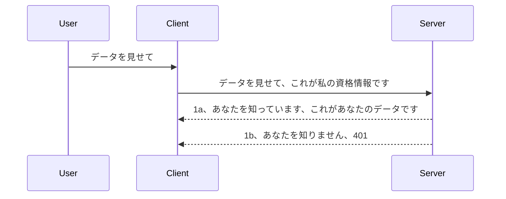

# Simple auth

MCP SDKはOAuth 2.1の使用をサポートしており、正直かなり複雑なプロセスで、認証サーバー、リソースサーバー、認証情報の送信、コード取得、コードとベアラートークンの交換、そして最終的にリソースデータの取得といった概念が含まれます。OAuthに慣れていない場合は、良い実装ですが、まずは基本的なレベルの認証から始めて、より良いセキュリティへと段階的に構築するのが良いでしょう。この章はそのために存在し、より高度な認証へと導きます。

## 認証とは何か？

認証はauthentication（認証）とauthorization（認可）の短縮系です。やるべきことは二つあります：

- **Authentication（認証）** は、誰かが私たちの家に入ることを許可するかどうか、その人が「ここにいる」権利があるかどうか—つまり、MCPサーバーの機能があるリソースサーバーにアクセスできるかどうかを見極めるプロセスです。
- **Authorization（認可）** は、ユーザーがリクエストしている特定のリソース（例えば注文情報や商品など）にアクセス権があるかどうか、読み取りはできても削除はできないといった範囲で許可するかを判断するプロセスです。

## 認証情報：システムに自分が誰かを伝える方法

多くのウェブ開発者は、サーバーに認証情報を提供すると考えます。通常、それは「ここにいても良い」という秘密情報です。これは一般的にユーザー名とパスワードのbase64エンコード版、または特定のユーザーを一意に識別するAPIキーです。

これは「Authorization」というヘッダーで送信されます：

```json
{ "Authorization": "secret123" }
```

これは基本認証として知られています。全体の流れは次のように動作します：


仕組みを理解したので実装はどうするのでしょうか？多くのウェブサーバーにはミドルウェアと呼ばれる仕組みがあり、これはリクエストの一部として動作し、認証情報を検証し、有効な場合はリクエスト通過を許可します。無効な認証情報の場合は認証エラーとなります。実装例を見てみましょう：

**Python**

```python
class AuthMiddleware(BaseHTTPMiddleware):
    async def dispatch(self, request, call_next):

        has_header = request.headers.get("Authorization")
        if not has_header:
            print("-> Missing Authorization header!")
            return Response(status_code=401, content="Unauthorized")

        if not valid_token(has_header):
            print("-> Invalid token!")
            return Response(status_code=403, content="Forbidden")

        print("Valid token, proceeding...")
       
        response = await call_next(request)
        # レスポンスに任意のカスタマーヘッダーを追加するか、何らかの方法で変更する
        return response


starlette_app.add_middleware(CustomHeaderMiddleware)
```

ここでは：

- `AuthMiddleware` というミドルウェアを作成し、その `dispatch` メソッドはウェブサーバーから呼び出されます。
- ミドルウェアをウェブサーバーに追加しました：

    ```python
    starlette_app.add_middleware(AuthMiddleware)
    ```

- Authorizationヘッダーが存在し、送られてきた秘密情報が有効かどうかを検証するロジックを書きました：

    ```python
    has_header = request.headers.get("Authorization")
    if not has_header:
        print("-> Missing Authorization header!")
        return Response(status_code=401, content="Unauthorized")

    if not valid_token(has_header):
        print("-> Invalid token!")
        return Response(status_code=403, content="Forbidden")
    ```

    秘密情報が存在し有効なら、`call_next`を呼び出してリクエストの通過を許可しレスポンスを返します。

    ```python
    response = await call_next(request)
    # カスタマーヘッダーを追加するか、何らかの方法でレスポンスを変更する
    return response
    ```

動作としては、ウェブリクエストがサーバーに到達するとミドルウェアが呼ばれ、その実装によってリクエスト通過かクライアントが進行許可されないことを示すエラーの返却となります。

**TypeScript**

ここでは人気のフレームワークExpressでミドルウェアを作成し、リクエストがMCPサーバーに到達する前にインターセプトします。コードは以下の通りです：

```typescript
function isValid(secret) {
    return secret === "secret123";
}

app.use((req, res, next) => {
    // 1. 認証ヘッダーは存在しますか？
    if(!req.headers["Authorization"]) {
        res.status(401).send('Unauthorized');
    }
    
    let token = req.headers["Authorization"];

    // 2. 有効性を確認します。
    if(!isValid(token)) {
        res.status(403).send('Forbidden');
    }

   
    console.log('Middleware executed');
    // 3. リクエストを次の処理ステップに渡します。
    next();
});
```

このコードでは：

1. 最初にAuthorizationヘッダーが存在するかチェックし、なければ401エラーを送ります。
2. 認証情報／トークンが有効か確認し、無効なら403エラーを返します。
3. 最後にリクエストをパイプラインで通過させ、要求されたリソースを返します。

## 演習: 認証を実装しよう

知識を生かして実装してみましょう。プランは以下：

サーバー

- ウェブサーバーとMCPインスタンスを作成。
- サーバーのためにミドルウェアを実装。

クライアント

- 認証情報を含むヘッダー付きでウェブリクエスト送信。

### -1- ウェブサーバーとMCPインスタンスの作成

最初のステップは、ウェブサーバーインスタンスとMCPサーバーの作成です。

**Python**

ここでMCPサーバーのインスタンスを生成し、starletteのウェブアプリを作り、uvicornでホスティングします。

```python
# MCPサーバーを作成しています

app = FastMCP(
    name="MCP Resource Server",
    instructions="Resource Server that validates tokens via Authorization Server introspection",
    host=settings["host"],
    port=settings["port"],
    debug=True
)

# starletteウェブアプリを作成しています
starlette_app = app.streamable_http_app()

# uvicorn経由でアプリを提供しています
async def run(starlette_app):
    import uvicorn
    config = uvicorn.Config(
            starlette_app,
            host=app.settings.host,
            port=app.settings.port,
            log_level=app.settings.log_level.lower(),
        )
    server = uvicorn.Server(config)
    await server.serve()

run(starlette_app)
```

このコードでは：

- MCPサーバーを作成。
- MCPサーバーからstarletteウェブアプリを構築、`app.streamable_http_app()`。
- uvicornでウェブアプリをホストしサーブ、`server.serve()`。

**TypeScript**

こちらではMCPサーバーインスタンスを作成しています。

```typescript
const server = new McpServer({
      name: "example-server",
      version: "1.0.0"
    });

    // ... サーバーのリソース、ツール、およびプロンプトを設定します ...
```

MCPサーバーの生成はPOST /mcpルートの定義内で行う必要があるので、先のコードを移動させた例がこちら：

```typescript
import express from "express";
import { randomUUID } from "node:crypto";
import { McpServer } from "@modelcontextprotocol/sdk/server/mcp.js";
import { StreamableHTTPServerTransport } from "@modelcontextprotocol/sdk/server/streamableHttp.js";
import { isInitializeRequest } from "@modelcontextprotocol/sdk/types.js"

const app = express();
app.use(express.json());

// セッションIDごとにトランスポートを格納するマップ
const transports: { [sessionId: string]: StreamableHTTPServerTransport } = {};

// クライアントからサーバーへの通信のためのPOSTリクエストを処理する
app.post('/mcp', async (req, res) => {
  // 既存のセッションIDを確認する
  const sessionId = req.headers['mcp-session-id'] as string | undefined;
  let transport: StreamableHTTPServerTransport;

  if (sessionId && transports[sessionId]) {
    // 既存のトランスポートを再利用する
    transport = transports[sessionId];
  } else if (!sessionId && isInitializeRequest(req.body)) {
    // 新しい初期化リクエスト
    transport = new StreamableHTTPServerTransport({
      sessionIdGenerator: () => randomUUID(),
      onsessioninitialized: (sessionId) => {
        // セッションIDごとにトランスポートを格納する
        transports[sessionId] = transport;
      },
      // DNSリバインディング保護は後方互換性のためデフォルトで無効になっています。このサーバーを
      // ローカルで実行している場合は、次の設定を必ず行ってください:
      // enableDnsRebindingProtection: true,
      // allowedHosts: ['127.0.0.1'],
    });

    // 閉じられた時にトランスポートをクリーンアップする
    transport.onclose = () => {
      if (transport.sessionId) {
        delete transports[transport.sessionId];
      }
    };
    const server = new McpServer({
      name: "example-server",
      version: "1.0.0"
    });

    // ... サーバーリソース、ツール、プロンプトをセットアップする ...

    // MCPサーバーへ接続する
    await server.connect(transport);
  } else {
    // 無効なリクエスト
    res.status(400).json({
      jsonrpc: '2.0',
      error: {
        code: -32000,
        message: 'Bad Request: No valid session ID provided',
      },
      id: null,
    });
    return;
  }

  // リクエストを処理する
  await transport.handleRequest(req, res, req.body);
});

// GETおよびDELETEリクエスト用の再利用可能なハンドラー
const handleSessionRequest = async (req: express.Request, res: express.Response) => {
  const sessionId = req.headers['mcp-session-id'] as string | undefined;
  if (!sessionId || !transports[sessionId]) {
    res.status(400).send('Invalid or missing session ID');
    return;
  }
  
  const transport = transports[sessionId];
  await transport.handleRequest(req, res);
};

// SSEを通じたサーバーからクライアントへの通知のためのGETリクエストを処理する
app.get('/mcp', handleSessionRequest);

// セッション終了のためのDELETEリクエストを処理する
app.delete('/mcp', handleSessionRequest);

app.listen(3000);
```

`app.post("/mcp")`内にMCPサーバー生成が移動したのが分かります。

次はミドルウェアを作り、受信認証情報の検証を行います。

### -2- サーバー用ミドルウェアの実装

ミドルウェア部分に進みましょう。ここでは`Authorization`ヘッダーにある認証情報を探し検証し、問題なければリクエストを継続させます（ツール一覧取得、リソース読み取りやその他MCP機能の処理）。

**Python**

ミドルウェアを作るためには`BaseHTTPMiddleware`を継承したクラスを作成します。ポイントは：

- `request` でヘッダー情報を読み取ること。
- `call_next` でクライアントが持つ認証情報を許可する場合に呼び出すコールバック。

まずは`Authorization`ヘッダーがない場合の対処：

```python
has_header = request.headers.get("Authorization")

# ヘッダーが存在しない場合は401で失敗し、そうでなければ続行する。
if not has_header:
    print("-> Missing Authorization header!")
    return Response(status_code=401, content="Unauthorized")
```

クライアントが認証に失敗したため401 unauthorizedを返します。

次に認証情報があればその有効性を確認：

```python
 if not valid_token(has_header):
    print("-> Invalid token!")
    return Response(status_code=403, content="Forbidden")
```

上記で403 forbiddenを返していることに注目。これまで述べたことを全て盛り込んだミドルウェアを以下に示します：

```python
class AuthMiddleware(BaseHTTPMiddleware):
    async def dispatch(self, request, call_next):

        has_header = request.headers.get("Authorization")
        if not has_header:
            print("-> Missing Authorization header!")
            return Response(status_code=401, content="Unauthorized")

        if not valid_token(has_header):
            print("-> Invalid token!")
            return Response(status_code=403, content="Forbidden")

        print("Valid token, proceeding...")
        print(f"-> Received {request.method} {request.url}")
        response = await call_next(request)
        response.headers['Custom'] = 'Example'
        return response

```

素晴らしいですが`valid_token`関数はどうなっているのでしょうか？こちらです：

```python
# 本番環境で使用しないでください - 改善してください！！
def valid_token(token: str) -> bool:
    # 「Bearer 」プレフィックスを削除してください
    if token.startswith("Bearer "):
        token = token[7:]
        return token == "secret-token"
    return False
```

これは明らかに改善が必要です。

重要: こうした秘密情報をソースコード中に直接書くべきではありません。理想的には比較すべき値はデータソースやIDP（アイデンティティサービスプロバイダー）から取得したり、できればIDPに検証を委ねるべきです。

**TypeScript**

Expressで実装するには、`use`メソッドでミドルウェア関数を登録します。

すべきことは：

- リクエスト変数から`Authorization`プロパティで渡された認証情報を確認。
- 認証情報を検証し、許可された場合にリクエスト通過でクライアントのMCPリクエスト処理を行う（ツール一覧取得、リソース読み込みなど）。

ここでは`Authorization`ヘッダーがあるか確認し、なければリクエストを止めます：

```typescript
if(!req.headers["authorization"]) {
    res.status(401).send('Unauthorized');
    return;
}
```

ヘッダーが無ければ401が返されます。

次に認証情報の有効性をチェックし、無効ならリクエストは止めメッセージを変えます：

```typescript
if(!isValid(token)) {
    res.status(403).send('Forbidden');
    return;
} 
```

403エラーが返されるのが分かります。

フルコードはこちら：

```typescript
app.use((req, res, next) => {
    console.log('Request received:', req.method, req.url, req.headers);
    console.log('Headers:', req.headers["authorization"]);
    if(!req.headers["authorization"]) {
        res.status(401).send('Unauthorized');
        return;
    }
    
    let token = req.headers["authorization"];

    if(!isValid(token)) {
        res.status(403).send('Forbidden');
        return;
    }  

    console.log('Middleware executed');
    next();
});
```

こちらでクライアントが送る認証情報をチェックするミドルウェアを受け付けるウェブサーバーを構築しました。ではクライアントはどうでしょう？

### -3- 認証情報含むヘッダー付きでウェブリクエスト送信

クライアントが認証情報をヘッダーで送信することを確認する必要があります。MCPクライアントを使うので、その方法を確認。

**Python**

クライアント側では認証情報をヘッダーで渡します：

```python
# 値をハードコーディングしないでください。最低でも環境変数やより安全なストレージに保持してください
token = "secret-token"

async with streamablehttp_client(
        url = f"http://localhost:{port}/mcp",
        headers = {"Authorization": f"Bearer {token}"}
    ) as (
        read_stream,
        write_stream,
        session_callback,
    ):
        async with ClientSession(
            read_stream,
            write_stream
        ) as session:
            await session.initialize()
      
            # TODO、クライアントで何を行いたいか、例：ツールの一覧表示、ツールの呼び出しなど
```

`headers` を `{"Authorization": f"Bearer {token}"}` のように設定しているのに注目。

**TypeScript**

2ステップで解決可能です：

1. 設定オブジェクトに認証情報を格納。
2. トランスポートに設定オブジェクトを渡す。

```typescript

// ここに示したように値をハードコードしないでください。最低限、環境変数として持ち、開発モードでは dotenv のようなものを使いましょう。
let token = "secret123"

// クライアントのトランスポートオプションオブジェクトを定義する
let options: StreamableHTTPClientTransportOptions = {
  sessionId: sessionId,
  requestInit: {
    headers: {
      "Authorization": "secret123"
    }
  }
};

// オプションオブジェクトをトランスポートに渡す
async function main() {
   const transport = new StreamableHTTPClientTransport(
      new URL(serverUrl),
      options
   );
```

上では`options`オブジェクトを作り、その中の `requestInit` プロパティにヘッダーを入れているのが分かります。

重要: ここからどう改良するか？ 現状は認証情報を平文で渡すためリスクがあります。せめてHTTPSを使うべきです。それでも盗難リスクがあるので、トークンを簡単に無効化できる仕組みや、発信元の地理的場所チェックやボットっぽい頻度チェックなどの追加検証が必要です。

しかし非常にシンプルなAPIで、認証なく誰でも呼べないようにしたいだけなら、今の仕組みは良い入り口です。

次にJWT（JSON Web Token、"JOT"トークン）と呼ばれる標準化フォーマットを用いてセキュリティを強化しましょう。

## JSON Web Tokens, JWT

簡単な認証情報送信からの改善を目指すと、JWTを採用すると即効性のある利点は何でしょう？

- <strong>セキュリティの向上</strong>。基本認証ではユーザー名とパスワードをbase64トークンで繰り返し送ります（APIキーも同様）でリスクが高いです。JWTでは一度ユーザー名とパスワードを送れば有効期限があるトークンが返されます。JWTはロール、スコープ、権限といった細かなアクセス制御を容易に実現します。
- **ステートレス＆スケーラビリティ**。JWTは自己完結型でユーザー情報を内包し、サーバー側のセッションストレージを不要にします。トークンはローカルで検証可能です。
- <strong>相互運用性とフェデレーション</strong>。JWTはOpen ID Connectの中心であり、Entra ID, Google Identity, Auth0などの既知のIDプロバイダーと連携します。シングルサインオンも可能で、エンタープライズ対応です。
- <strong>モジュール性と柔軟性</strong>。JWTはAzure API ManagementやNGINXなどのAPIゲートウェイとも使え、ユーザー認証やサーバー間通信（なりすまし、委任）にも対応します。
- <strong>パフォーマンスとキャッシュ</strong>。JWTはデコード後キャッシュ可能で解析負荷を減らし、高トラフィックなアプリにおいてスループットを改善しインフラ負荷を軽減します。
- <strong>高度な機能</strong>。トークンのインストロスペクション（有効性チェック）や取り消し（無効化）もサポートします。

これらの利点を踏まえ、実装を次のレベルに引き上げましょう。

## Basic AuthからJWTへの変更

大まかな変更点は：

- **JWTトークンの生成方法を学び**、クライアントからサーバーへ送信できるようにする。
- <strong>JWTトークンの検証</strong>を行い、有効ならリソースアクセスを許可する。
- <strong>トークンの安全な保存</strong>方法の検討。
- <strong>ルートの保護</strong>。保護すべきルートと特定のMCP機能にアクセス制御を設ける。
- <strong>リフレッシュトークンの追加</strong>。短期間有効なトークンと、長期間使えるリフレッシュトークンにより期限切れトークンの交換を可能にし、リフレッシュ用エンドポイントとローテーション戦略を実装。

### -1- JWTトークンの生成

JWTトークンは以下の部分で構成されます：

- <strong>ヘッダー</strong>：使われるアルゴリズムとトークンタイプ。
- <strong>ペイロード</strong>：クレーム。sub（トークンが表すユーザーやエンティティ、通常はuserid）、exp（有効期限）、role（ロール）など。
- <strong>署名</strong>：秘密鍵またはプライベートキーで署名。

ヘッダー、ペイロード、エンコードされたトークンを作成します。

**Python**

```python

import jwt
import jwt
from jwt.exceptions import ExpiredSignatureError, InvalidTokenError
import datetime

# JWTに署名するために使用される秘密鍵
secret_key = 'your-secret-key'

header = {
    "alg": "HS256",
    "typ": "JWT"
}

# ユーザー情報およびそのクレームと有効期限
payload = {
    "sub": "1234567890",               # サブジェクト（ユーザーID）
    "name": "User Userson",                # カスタムクレーム
    "admin": True,                     # カスタムクレーム
    "iat": datetime.datetime.utcnow(),# 発行日時
    "exp": datetime.datetime.utcnow() + datetime.timedelta(hours=1)  # 有効期限
}

# エンコードする
encoded_jwt = jwt.encode(payload, secret_key, algorithm="HS256", headers=header)
```

上記コードでは：

- アルゴリズムをHS256、タイプをJWTとしたヘッダーを定義。
- サブジェクト（ユーザーID）、ユーザー名、ロール、発行時刻、期限を含むペイロードを構成し、前述した有効期限を実現。

**TypeScript**

ここではJWTトークン生成を助ける依存パッケージが必要です。

依存パッケージ

```sh

npm install jsonwebtoken
npm install --save-dev @types/jsonwebtoken
```

これらを用いてヘッダーとペイロードを作りエンコード済トークンを生成します。

```typescript
import jwt from 'jsonwebtoken';

const secretKey = 'your-secret-key'; // 本番環境で環境変数を使用する

// ペイロードを定義する
const payload = {
  sub: '1234567890',
  name: 'User usersson',
  admin: true,
  iat: Math.floor(Date.now() / 1000), // 発行日時
  exp: Math.floor(Date.now() / 1000) + 60 * 60 // 1時間で有効期限が切れる
};

// ヘッダーを定義する（オプション、jsonwebtokenがデフォルトを設定）
const header = {
  alg: 'HS256',
  typ: 'JWT'
};

// トークンを作成する
const token = jwt.sign(payload, secretKey, {
  algorithm: 'HS256',
  header: header
});

console.log('JWT:', token);
```

このトークンは：

HS256署名済み
有効期間1時間
sub, name, admin, iat, expなどのクレームを含む

### -2- トークンの検証

トークンはサーバー側で検証する必要があります。構造の検証から有効期限のチェックまで多面的な確認が求められます。追加でユーザーがシステムに存在するか、権利を持つかのチェックも推奨されます。

検証は、まずデコードして中身を読み、様々な妥当性検査を行います。

**Python**

```python

# JWTをデコードして検証する
try:
    decoded = jwt.decode(token, secret_key, algorithms=["HS256"])
    print("✅ Token is valid.")
    print("Decoded claims:")
    for key, value in decoded.items():
        print(f"  {key}: {value}")
except ExpiredSignatureError:
    print("❌ Token has expired.")
except InvalidTokenError as e:
    print(f"❌ Invalid token: {e}")

```

ここでトークン、秘密鍵、アルゴリズムを渡して `jwt.decode` を呼んでいます。try-catch構文は検証失敗時の例外処理のためです。

**TypeScript**

`jwt.verify` を呼んでデコード済みトークンを取得し詳細検査を行います。失敗するとトークンが正しくないか有効期限切れです。

```typescript

try {
  const decoded = jwt.verify(token, secretKey);
  console.log('Decoded Payload:', decoded);
} catch (err) {
  console.error('Token verification failed:', err);
}
```

注記：前述の通り、トークンが指すユーザー存在確認や権限チェックの追加も推奨されます。

次にRBAC（Role Based Access Control、ロールベースアクセス制御）を見ていきましょう。
## 役割ベースのアクセス制御の追加

異なる役割が異なる権限を持つことを表現したいという考え方です。例えば、管理者はすべてを実行でき、通常のユーザーは読み書きができ、ゲストは読み込みのみができると想定します。したがって、以下のような権限レベルが考えられます:

- Admin.Write 
- User.Read
- Guest.Read

このような制御をミドルウェアでどのように実装できるか見てみましょう。ミドルウェアはルートごとに追加できるほか、すべてのルートに対しても追加できます。

**Python**

```python
from starlette.middleware.base import BaseHTTPMiddleware
from starlette.responses import JSONResponse
import jwt

# コード内に秘密情報を含めないでください。これはあくまでデモ目的です。安全な場所から読み取ってください。
SECRET_KEY = "your-secret-key" # これを環境変数に設定してください
REQUIRED_PERMISSION = "User.Read"

class JWTPermissionMiddleware(BaseHTTPMiddleware):
    async def dispatch(self, request, call_next):
        auth_header = request.headers.get("Authorization")
        if not auth_header or not auth_header.startswith("Bearer "):
            return JSONResponse({"error": "Missing or invalid Authorization header"}, status_code=401)

        token = auth_header.split(" ")[1]
        try:
            decoded = jwt.decode(token, SECRET_KEY, algorithms=["HS256"])
        except jwt.ExpiredSignatureError:
            return JSONResponse({"error": "Token expired"}, status_code=401)
        except jwt.InvalidTokenError:
            return JSONResponse({"error": "Invalid token"}, status_code=401)

        permissions = decoded.get("permissions", [])
        if REQUIRED_PERMISSION not in permissions:
            return JSONResponse({"error": "Permission denied"}, status_code=403)

        request.state.user = decoded
        return await call_next(request)


```

ミドルウェアを追加する方法は以下のようにいくつかあります:

```python

# 代替案 1: starlette アプリを構築する際にミドルウェアを追加する
middleware = [
    Middleware(JWTPermissionMiddleware)
]

app = Starlette(routes=routes, middleware=middleware)

# 代替案 2: starlette アプリがすでに構築された後でミドルウェアを追加する
starlette_app.add_middleware(JWTPermissionMiddleware)

# 代替案 3: ルートごとにミドルウェアを追加する
routes = [
    Route(
        "/mcp",
        endpoint=..., # ハンドラー
        middleware=[Middleware(JWTPermissionMiddleware)]
    )
]
```

**TypeScript**

すべてのリクエストに対して実行されるミドルウェアとして `app.use` を使用できます。

```typescript
app.use((req, res, next) => {
    console.log('Request received:', req.method, req.url, req.headers);
    console.log('Headers:', req.headers["authorization"]);

    // 1. 認証ヘッダーが送信されているか確認する

    if(!req.headers["authorization"]) {
        res.status(401).send('Unauthorized');
        return;
    }
    
    let token = req.headers["authorization"];

    // 2. トークンが有効かどうか確認する
    if(!isValid(token)) {
        res.status(403).send('Forbidden');
        return;
    }  

    // 3. トークンのユーザーがシステムに存在するか確認する
    if(!isExistingUser(token)) {
        res.status(403).send('Forbidden');
        console.log("User does not exist");
        return;
    }
    console.log("User exists");

    // 4. トークンに正しい権限があるか検証する
    if(!hasScopes(token, ["User.Read"])){
        res.status(403).send('Forbidden - insufficient scopes');
    }

    console.log("User has required scopes");

    console.log('Middleware executed');
    next();
});

```

ミドルウェアにやらせるべきこと、やらせても良いことはかなりあります。具体的には以下の通りです:

1. 認証ヘッダーが存在するかを確認する
2. トークンが有効かどうかを確認する。ここでは JWT トークンの完全性と有効性をチェックする独自メソッド `isValid` を呼びます。
3. ユーザーがシステム内に存在するかを検証する。この点もチェックすべきです。

   ```typescript
    // DB内のユーザー
   const users = [
     "user1",
     "User usersson",
   ]

   function isExistingUser(token) {
     let decodedToken = verifyToken(token);

     // TODO、ユーザーがDBに存在するか確認する
     return users.includes(decodedToken?.name || "");
   }
   ```

   上記では非常にシンプルな `users` リストを作成していますが、これは本来はデータベースにあるべきです。

4. さらに、トークンが適切な権限を持っているかもチェックする必要があります。

   ```typescript
   if(!hasScopes(token, ["User.Read"])){
        res.status(403).send('Forbidden - insufficient scopes');
   }
   ```

   上記のミドルウェアコードでは、トークンが User.Read 権限を持っているかをチェックし、持っていなければ403エラーを送信しています。以下は `hasScopes` ヘルパーメソッドです。

   ```typescript
   function hasScopes(scope: string, requiredScopes: string[]) {
     let decodedToken = verifyToken(scope);
    return requiredScopes.every(scope => decodedToken?.scopes.includes(scope));
  }
   ```

Have a think which additional checks you should be doing, but these are the absolute minimum of checks you should be doing.

Using Express as a web framework is a common choice. There are helpers library when you use JWT so you can write less code.

- `express-jwt`, helper library that provides a middleware that helps decode your token.
- `express-jwt-permissions`, this provides a middleware `guard` that helps check if a certain permission is on the token.

Here's what these libraries can look like when used:

```typescript
const express = require('express');
const jwt = require('express-jwt');
const guard = require('express-jwt-permissions')();

const app = express();
const secretKey = 'your-secret-key'; // put this in env variable

// Decode JWT and attach to req.user
app.use(jwt({ secret: secretKey, algorithms: ['HS256'] }));

// Check for User.Read permission
app.use(guard.check('User.Read'));

// multiple permissions
// app.use(guard.check(['User.Read', 'Admin.Access']));

app.get('/protected', (req, res) => {
  res.json({ message: `Welcome ${req.user.name}` });
});

// Error handler
app.use((err, req, res, next) => {
  if (err.code === 'permission_denied') {
    return res.status(403).send('Forbidden');
  }
  next(err);
});

```

認証と認可の両方にミドルウェアが使えることを見てきましたが、MCPの場合はどうでしょうか？認証方法が変わるのでしょうか？次のセクションで確認してみましょう。

### -3- MCPにRBACを追加する

これまでミドルウェアを利用してRBACを追加する方法を見てきましたが、MCPの場合、機能ごとにRBACを簡単に追加する方法はありません。ではどうするか？この場合、クライアントが特定のツールを呼び出す権利を持っているかどうかをチェックするコードを追加するしかありません。

機能ごとのRBACを実現するための選択肢はいくつかあります。以下はその例です:

- 権限レベルのチェックが必要な各ツール、リソース、プロンプトに対してチェックを追加する。

   **python**

   ```python
   @tool()
   def delete_product(id: int):
      try:
          check_permissions(role="Admin.Write", request)
      catch:
        pass # クライアントの認証に失敗しました。認証エラーを発生させます。
   ```

   **typescript**

   ```typescript
   server.registerTool(
    "delete-product",
    {
      title: Delete a product",
      description: "Deletes a product",
      inputSchema: { id: z.number() }
    },
    async ({ id }) => {
      
      try {
        checkPermissions("Admin.Write", request);
        // todo、idをproductServiceとリモートエントリに送信すること
      } catch(Exception e) {
        console.log("Authorization error, you're not allowed");  
      }

      return {
        content: [{ type: "text", text: `Deletected product with id ${id}` }]
      };
    }
   );
   ```


- 高度なサーバーアプローチやリクエストハンドラーを利用し、チェックを行う箇所を最小化する。

   **Python**

   ```python
   
   tool_permission = {
      "create_product": ["User.Write", "Admin.Write"],
      "delete_product": ["Admin.Write"]
   }

   def has_permission(user_permissions, required_permissions) -> bool:
      # user_permissions: ユーザーが持っている権限のリスト
      # required_permissions: ツールに必要な権限のリスト
      return any(perm in user_permissions for perm in required_permissions)

   @server.call_tool()
   async def handle_call_tool(
     name: str, arguments: dict[str, str] | None
   ) -> list[types.TextContent]:
    # request.user.permissions はユーザーの権限のリストであると仮定する
     user_permissions = request.user.permissions
     required_permissions = tool_permission.get(name, [])
     if not has_permission(user_permissions, required_permissions):
        # エラーを発生させる「ツール{name}を呼び出す権限がありません」
        raise Exception(f"You don't have permission to call tool {name}")
     # 続行してツールを呼び出す
     # ...
   ```   
   

   **TypeScript**

   ```typescript
   function hasPermission(userPermissions: string[], requiredPermissions: string[]): boolean {
       if (!Array.isArray(userPermissions) || !Array.isArray(requiredPermissions)) return false;
       // ユーザーが少なくとも一つの必要な権限を持っている場合はtrueを返します
       
       return requiredPermissions.some(perm => userPermissions.includes(perm));
   }
  
   server.setRequestHandler(CallToolRequestSchema, async (request) => {
      const { params: { name } } = request;
  
      let permissions = request.user.permissions;
  
      if (!hasPermission(permissions, toolPermissions[name])) {
         return new Error(`You don't have permission to call ${name}`);
      }
  
      // 続けてください..
   });
   ```

   注意: 上記コードをシンプルにするためには、ミドルウェアがリクエストの user プロパティにデコード済みトークンを割り当てている必要があります。

### まとめ

RBACを一般的に、そして特にMCPにどのように追加するかを説明しました。理解を深めるため、実際にセキュリティ実装を試してみましょう。

## 課題1: 基本認証を使ったmcpサーバーとmcpクライアントの構築

ここでは、ヘッダーを通じて資格情報を送信する方法を学んだことを活かします。

## 解答1

[解答1](./code/basic/README.md)

## 課題2: 課題1の解決策をJWTを使うようにアップグレードする

最初の解決策を使いますが、今回は改良しましょう。

Basic認証の代わりにJWTを使いましょう。

## 解答2

[解答2](./solution/jwt-solution/README.md)

## チャレンジ

「MCPにRBACを追加する」セクションで説明したツールごとのRBACを追加してください。

## まとめ

この章では、全くないセキュリティから基本的なセキュリティ、JWT、そしてそれをMCPにどのように適用するかまで学べたと思います。

カスタムJWTで堅牢な基盤を築きましたが、スケールするにつれて標準に基づくアイデンティティモデルへと移行しています。EntraやKeycloakのようなIdPを採用することで、トークンの発行、検証、ライフサイクル管理を信頼できるプラットフォームに委任し、アプリのロジックとユーザー体験に集中できるようになります。

そのためのより高度な章も用意しています：[Entraに関する高度な章](../../05-AdvancedTopics/mcp-security-entra/README.md)

## 次に進む

- 次: [MCPホストのセットアップ](../12-mcp-hosts/README.md)

---

<!-- CO-OP TRANSLATOR DISCLAIMER START -->
**免責事項**：  
本書類は AI 翻訳サービス [Co-op Translator](https://github.com/Azure/co-op-translator) を使用して翻訳されています。正確さを期していますが、自動翻訳には誤りや不正確な部分が含まれる可能性があることをご了承ください。原文の言語によるオリジナル文書が権威ある情報源と見なされます。重要な情報については、専門の人間による翻訳を推奨します。本翻訳の使用により生じた誤解や解釈違いについては、一切の責任を負いかねます。
<!-- CO-OP TRANSLATOR DISCLAIMER END -->