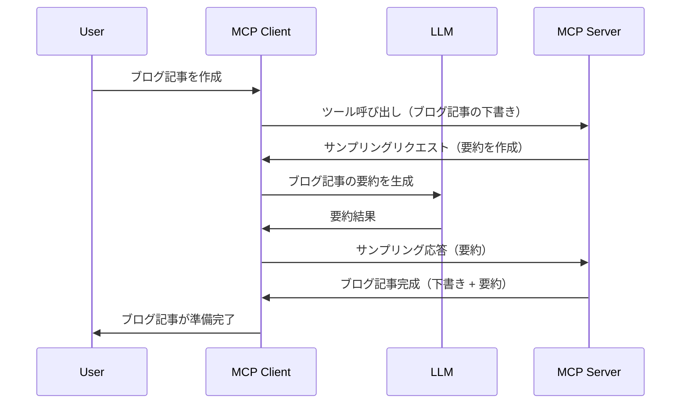

# サンプリング - クライアントに機能を委任する

時には、MCPクライアントとMCPサーバーが協力して共通の目標を達成する必要があります。サーバーがクライアント上にあるLLMの助けを必要とする場合があります。このような状況では、サンプリングを使用するべきです。

いくつかのユースケースとサンプリングを使ったソリューションの構築方法を見てみましょう。

## 概要

このレッスンでは、サンプリングをいつどこで使うべきか、どのように設定するかに焦点を当てて説明します。

## 学習目標

この章では以下を行います：

- サンプリングとは何か、いつ使うべきかを説明する。
- MCPでのサンプリングの設定方法を示す。
- サンプリングの実例を提供する。

## サンプリングとは何か、なぜ使うのか？

サンプリングは次のように動作する高度な機能です：


### サンプリングリクエスト

では、信頼できるシナリオの俯瞰ができたので、サーバーがクライアントに送るサンプリングリクエストについて話しましょう。以下はJSON-RPC形式でのリクエスト例です：

```json
{
  "jsonrpc": "2.0",
  "id": 1,
  "method": "sampling/createMessage",
  "params": {
    "messages": [
      {
        "role": "user",
        "content": {
          "type": "text",
          "text": "Create a blog post summary of the following blog post: <BLOG POST>"
        }
      }
    ],
    "modelPreferences": {
      "hints": [
        {
          "name": "claude-3-sonnet"
        }
      ],
      "intelligencePriority": 0.8,
      "speedPriority": 0.5
    },
    "systemPrompt": "You are a helpful assistant.",
    "maxTokens": 100
  }
}
```

ここで注目すべき点がいくつかあります：

- content -> textの下にあるPromptは、ブログ記事の内容を要約するようLLMに指示するプロンプトです。

- **modelPreferences**。この部分はまさにその名の通り、LLMの設定に関する推奨です。ユーザーはこれらの推奨を使うか、変更するかを選べます。この例では使用するモデルや速度、知能の優先度に関する推奨があります。
- **systemPrompt** は、LLMに性格を与え、ガイダンス指示を含む通常のシステムプロンプトです。
- **maxTokens** は、このタスクに推奨されるトークン数を示す別のプロパティです。

### サンプリングレスポンス

このレスポンスは、MCPクライアントがLLMを呼び出して応答を待ち、その結果を構築してMCPサーバーに返すものです。JSON-RPC形式では以下のようになります：

```json
{
  "jsonrpc": "2.0",
  "id": 1,
  "result": {
    "role": "assistant",
    "content": {
      "type": "text",
      "text": "Here's your abstract <ABSTRACT>"
    },
    "model": "gpt-5",
    "stopReason": "endTurn"
  }
}
```

レスポンスが要求通りブログ記事の要約になっているのに注目してください。また、使用された`model`がリクエストしたものではなく「claude-3-sonnet」ではなく「gpt-5」になっていることに注目してください。これはユーザーが使用モデルを変更でき、サンプリングリクエストは推奨に過ぎないことを示しています。

では、メインの流れと役立つタスク「ブログ記事作成＋要約」がわかったので、これを実現するために必要なことを見てみましょう。

### メッセージタイプ

サンプリングメッセージはテキストだけでなく画像や音声も送ることができます。JSON-RPCの見た目がどのように異なるか、以下に示します：

<strong>テキスト</strong>

```json
{
  "type": "text",
  "text": "The message content"
}
```

<strong>画像コンテンツ</strong>

```json
{
  "type": "image",
  "data": "base64-encoded-image-data",
  "mimeType": "image/jpeg"
}
```

<strong>オーディオコンテンツ</strong>

```json
{
  "type": "audio",
  "data": "base64-encoded-audio-data",
  "mimeType": "audio/wav"
}
```

> NOTE: サンプリングの詳細については[公式ドキュメント](https://modelcontextprotocol.io/specification/2025-06-18/client/sampling)を参照してください。

## クライアントでのサンプリング設定方法

> 注意：サーバーのみを構築する場合は、ここで多くのことはする必要はありません。

クライアントでは次のように機能を指定する必要があります：

```json
{
  "capabilities": {
    "sampling": {}
  }
}
```

これにより、選択したクライアントがサーバーと初期化される際にこの設定が適用されます。

## 実例 - ブログ記事の作成

サンプリングサーバーを一緒にコード化してみましょう。以下のことを行う必要があります：

1. サーバー上にツールを作成する。
2. そのツールはサンプリングリクエストを作成するべき。
3. ツールはクライアントのサンプリングリクエストへの応答を待つべき。
4. その後、ツールの結果が生成されるべき。

コードを段階的に見てみましょう：

### -1- ツールの作成

**python**

```python
@mcp.tool()
async def create_blog(title: str, content: str, ctx: Context[ServerSession, None]) -> str:
    """Create a blog post and generate a summary"""

```

### -2- サンプリングリクエストの作成

ツールに次のコードを追加してください：

**python**

```python
post = BlogPost(
        id=len(posts) + 1,
        title=title,
        content=content,
        abstract=""
    )

prompt = f"Create an abstract of the following blog post: title: {title} and draft: {content} "

result = await ctx.session.create_message(
        messages=[
            SamplingMessage(
                role="user",
                content=TextContent(type="text", text=prompt),
            )
        ],
        max_tokens=100,
)

```

### -3- 応答を待ち、応答を返す

**python**

```python
post.abstract = result.content.text

posts.append(post)

# 完成した製品を返す
return json.dumps({
    "id": post.title,
    "abstract": post.abstract
})
```

### -4- 全コード

**python**

```python
from starlette.applications import Starlette
from starlette.routing import Mount, Host

from mcp.server.fastmcp import Context, FastMCP

from mcp.server.session import ServerSession
from mcp.types import SamplingMessage, TextContent

import json


from uuid import uuid4
from typing import List
from pydantic import BaseModel


mcp = FastMCP("Blog post generator")

# app = FastAPI()

posts = []

class BlogPost(BaseModel):
    id: int
    title: str
    content: str
    abstract: str

posts: List[BlogPost] = []

@mcp.tool()
async def create_blog(title: str, content: str, ctx: Context[ServerSession, None]) -> str:
    """Create a blog post and generate a summary"""

    post = BlogPost(
        id=len(posts) + 1,
        title=title,
        content=content,
        abstract=""
    )

    prompt = f"Create an abstract of the following blog post: title: {title} and draft: {content} "

    result = await ctx.session.create_message(
        messages=[
            SamplingMessage(
                role="user",
                content=TextContent(type="text", text=prompt),
            )
        ],
        max_tokens=100,
    )

    post.abstract = result.content.text

    posts.append(post)

    # 完全なブログ投稿を返す
    return json.dumps({
        "id": post.title,
        "abstract": post.abstract
    })

if __name__ == "__main__":
    print("Starting server...")
    # mcp.run()
    mcp.run(transport="streamable-http")

# 次のコマンドでアプリを実行: python server.py
```

### -5- Visual Studio Codeでのテスト

Visual Studio Codeでこれをテストするには、以下を行います：

1. ターミナルでサーバーを起動する
1. <em>mcp.json</em>に追加し（起動を確認）以下のように設定例：

   ```json
   "servers": {
      "blog-server": {
        "type": "http",
        "url": "http://localhost:8000/mcp"
      }
   }
   ```

1. プロンプトを入力する：

   ```text
   create a blog post named "Where Python comes from", the content is "Python is actually named after Monty Python Flying Circus"
   ```

1. サンプリングを許可する。初回テスト時は追加のダイアログが表示されるので承認し、その後ツール実行の通常ダイアログが表示されます。

1. 結果を確認します。結果はGitHub Copilot Chat上できれいに表示されますが、生のJSONレスポンスも確認できます。

<strong>ボーナス</strong> Visual Studio Codeのツールはサンプリングを非常によくサポートしています。次の手順でインストール済みサーバーのサンプリングアクセスを設定できます：

1. 拡張機能セクションに移動する。
1. 「MCP SERVERS - INSTALLED」セクションにあるインストール済みサーバーの歯車アイコンを選択する。
1. 「Configure Model Access」を選ぶと、GitHub Copilotがサンプリング実行時に使用を許可されるモデルを選択できます。また「Show Sampling requests」を選ぶと最近のすべてのサンプリングリクエストが表示されます。

## 課題

この課題では少し異なるサンプリング、具体的には商品説明の生成に対応するサンプリング統合を構築します。シナリオは以下の通りです：

<strong>シナリオ</strong>：eコマースのバックオフィス担当者が商品説明を生成するのに非常に時間がかかっている。そこで、「create_product」というツールを「title」と「keywords」を引数に呼び出すと、クライアントのLLMが生成した「description」フィールドを含む完全な商品情報を出力する仕組みを構築します。

TIP: 以前学んだ内容を活用して、このサーバーとツールをサンプリングリクエストで構築してください。

## 解答例

[解答例](./solution/README.md)

## まとめ

サンプリングは、サーバーがLLMの助けを求める際にクライアントにタスクを委任できる強力な機能です。

## 次へ

- [第4章 - 実践的な実装](../../04-PracticalImplementation/README.md)

---

<!-- CO-OP TRANSLATOR DISCLAIMER START -->
**免責事項**:  
本書類は AI 翻訳サービス [Co-op Translator](https://github.com/Azure/co-op-translator) を使用して翻訳されています。正確性を期しておりますが、自動翻訳には誤りや不正確な部分が含まれる可能性があることをご了承ください。原文はその言語の正式な情報源としてご参照ください。重要な情報については、専門の人間による翻訳を推奨します。本翻訳の使用により生じる誤解や誤訳について、一切の責任を負いかねます。
<!-- CO-OP TRANSLATOR DISCLAIMER END -->
