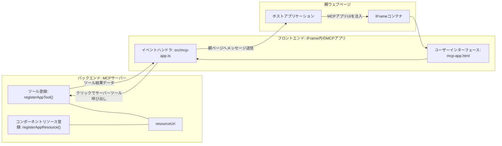

# MCP Apps

MCP Apps は MCP の新しいパラダイムです。これは、ツール呼び出しからデータを返すだけでなく、その情報がどのようにインタラクトされるべきかの情報も提供するという考え方です。つまり、ツールの結果に UI 情報が含まれることができるのです。なぜそれが必要なのでしょうか？今日、どのように作業を行っているか考えてみてください。おそらく MCP Server の結果を消費するために何らかのフロントエンドを用意し、それは自分でコードを書いて保守しなければなりません。それが望む場合もありますが、データからユーザーインターフェースまで全てを含んだ自己完結型の情報のスニペットを持ち込めれば素晴らしい時もあります。

## 概要

このレッスンでは MCP Apps の実践的なガイダンス、始め方、既存の Web Apps への統合方法を提供します。MCP Apps は MCP Standard の非常に新しい追加です。

## 学習目標

このレッスンの終わりまでに以下ができるようになります：

- MCP Apps が何か説明できる。
- MCP Apps を使うタイミングを理解する。
- 独自の MCP Apps を構築し統合する。

## MCP Apps - 仕組み

MCP Apps のアイデアは、基本的にレンダリングされるコンポーネントを提供することです。このようなコンポーネントは視覚的要素とインタラクティブ性（例えばボタンクリック、ユーザー入力など）を持つことができます。まずはサーバーサイド、MCP Server から始めましょう。MCP App コンポーネントを作成するにはツールに加え、アプリケーションリソースも作成する必要があります。これら二つは resourceUri で繋がれています。

例を見てみましょう。関わるものや役割は何かを視覚化してみます：

```text
server.ts -- responsible for registering tools and the component as a UI component
src/
  mcp-app.ts -- wiring up event handlers
mcp-app.html -- the user interface
```

この図はコンポーネントとそのロジックを作成するアーキテクチャを示しています。


次にバックエンドとフロントエンドのそれぞれの責務を説明してみます。

### バックエンド

ここで行うべきことは二つあります：

- 連携するツールを登録する。
- コンポーネントを定義する。

<strong>ツールの登録</strong>

```typescript
registerAppTool(
    server,
    "get-time",
    {
      title: "Get Time",
      description: "Returns the current server time.",
      inputSchema: {},
      _meta: { ui: { resourceUri } }, // このツールをそのUIリソースにリンクします
    },
    async () => {
      const time = new Date().toISOString();
      return { content: [{ type: "text", text: time }] };
    },
  );

```

上記コードは `get-time` というツールを公開する動作を示しています。入力を受け取らず現在時刻を生成します。ユーザー入力を受け入れる必要があるツール向けには `inputSchema` を定義できます。

<strong>コンポーネントの登録</strong>

同じファイル内でコンポーネントも登録します：

```typescript
const resourceUri = "ui://get-time/mcp-app.html";

// UIのためのバンドルされたHTML/JavaScriptを返すリソースを登録します。
registerAppResource(
  server,
  resourceUri,
  resourceUri,
  { mimeType: RESOURCE_MIME_TYPE },
  async () => {
    const html = await fs.readFile(path.join(DIST_DIR, "mcp-app.html"), "utf-8");

    return {
    contents: [
        { uri: resourceUri, mimeType: RESOURCE_MIME_TYPE, text: html },
    ],
    };
  },
);
```

`resourceUri` を使ってコンポーネントとツールを紐付けている点に注目してください。UI ファイルを読み込んでコンポーネントを返すコールバックも重要です。

### コンポーネントフロントエンド

バックエンド同様、二つのパーツがあります：

- 純粋な HTML で書かれたフロントエンド。
- イベント処理やツール呼び出し、親ウィンドウへのメッセージ送信などを行うコード。

<strong>ユーザーインターフェース</strong>

ユーザーインターフェースを見てみましょう。

```html
<!-- mcp-app.html -->
<!DOCTYPE html>
<html lang="en">
  <head>
    <meta charset="UTF-8" />
    <title>Get Time App</title>
  </head>
  <body>
    <p>
      <strong>Server Time:</strong> <code id="server-time">Loading...</code>
    </p>
    <button id="get-time-btn">Get Server Time</button>
    <script type="module" src="/src/mcp-app.ts"></script>
  </body>
</html>
```

<strong>イベントの紐付け</strong>

最後のパーツはイベントの紐付けです。UI のどの部分にイベントハンドラを付けるか、イベント発生時に何をするか決めます：

```typescript
// mcp-app.ts

import { App } from "@modelcontextprotocol/ext-apps";

// 要素の参照を取得
const serverTimeEl = document.getElementById("server-time")!;
const getTimeBtn = document.getElementById("get-time-btn")!;

// アプリインスタンスを作成
const app = new App({ name: "Get Time App", version: "1.0.0" });

// サーバーからのツール結果を処理。初期ツール結果の見逃しを防ぐために`app.connect()`の前に設定
// 初期ツール結果の見逃しを防ぐために設定
app.ontoolresult = (result) => {
  const time = result.content?.find((c) => c.type === "text")?.text;
  serverTimeEl.textContent = time ?? "[ERROR]";
};

// ボタンクリックを接続
getTimeBtn.addEventListener("click", async () => {
  // `app.callServerTool()`はUIがサーバーから新しいデータを要求できるようにする
  const result = await app.callServerTool({ name: "get-time", arguments: {} });
  const time = result.content?.find((c) => c.type === "text")?.text;
  serverTimeEl.textContent = time ?? "[ERROR]";
});

// ホストに接続
app.connect();
```

上記のように、これは DOM 要素をイベントに接続する通常のコードです。特に `callServerTool` の呼び出しはバックエンドのツールを呼び出すところです。

## ユーザー入力の取り扱い

これまではクリックでツールを呼び出すボタンだけのコンポーネントを見ました。次に入力フィールドなど UI 要素を増やし、ツールに引数を送れるか試します。FAQ 機能を実装してみましょう。動作は以下です：

- キーワードを入力する入力要素とボタンがあり、例えば「Shipping」を検索します。これはバックエンドのツールを呼び出して FAQ データを検索します。
- その FAQ 検索をサポートするツール。

まずバックエンドに必要なサポートを追加します：

```typescript
const faq: { [key: string]: string } = {
    "shipping": "Our standard shipping time is 3-5 business days.",
    "return policy": "You can return any item within 30 days of purchase.",
    "warranty": "All products come with a 1-year warranty covering manufacturing defects.",
  }

registerAppTool(
    server,
    "get-faq",
    {
      title: "Search FAQ",
      description: "Searches the FAQ for relevant answers.",
      inputSchema: zod.object({
        query: zod.string().default("shipping"),
      }),
      _meta: { ui: { resourceUri: faqResourceUri } }, // このツールをそのUIリソースにリンクします
    },
    async ({ query }) => {
      const answer: string = faq[query.toLowerCase()] || "Sorry, I don't have an answer for that.";
      return { content: [{ type: "text", text: answer }] };
    },
  );
```

ここでは `inputSchema` を `zod` スキーマで設定する方法が示されています：

```typescript
inputSchema: zod.object({
  query: zod.string().default("shipping"),
})
```

上記スキーマでは `query` という入力パラメータがあり、省略可能でデフォルト値は "shipping" です。

では *mcp-app.html* に進み、この UI を作成しましょう：

```html
<div class="faq">
    <h1>FAQ response</h1>
    <p>FAQ Response: <code id="faq-response">Loading...</code></p>
    <input type="text" id="faq-query" placeholder="Enter FAQ query" />
    <button id="get-faq-btn">Get FAQ Response</button>
  </div>
```

良いですね。入力欄とボタンができました。次に *mcp-app.ts* に行き、イベントを紐付けます：

```typescript
const getFaqBtn = document.getElementById("get-faq-btn")!;
const faqQueryInput = document.getElementById("faq-query") as HTMLInputElement;

getFaqBtn.addEventListener("click", async () => {
  const query = faqQueryInput.value;
  const result = await app.callServerTool({ name: "get-faq", arguments: { query } });
  const faq = result.content?.find((c) => c.type === "text")?.text;
  faqResponseEl.textContent = faq ?? "[ERROR]";
});
```

上記コードでは：

- インタラクティブな UI 要素への参照を作成。
- ボタンのクリックで入力値を解析し、`app.callServerTool()` を `name` と `arguments` （`query` を渡す）で呼び出す。

`callServerTool` は親ウィンドウにメッセージを送り、親が MCP Server を呼ぶ動きをします。

### 動作確認

試してみると以下のようになります：


「warranty」という入力例は以下の通りです：


このコードを実行するには、[コードセクション](./code/README.md) をご覧ください。

## Visual Studio Code でのテスト

Visual Studio Code は MCP Apps に優れたサポートを持ち、MCP Apps をテストする最も簡単な方法の一つです。使用するには *mcp.json* にサーバーエントリを追加します：

```json
"my-mcp-server-7178eca7": {
    "url": "http://localhost:3001/mcp",
    "type": "http"
  }
```

サーバーを起動したら、GitHub Copilot がインストールされていればチャットウィンドウを通じて MCP App と通信できます。

プロンプトで例えば "#get-faq" をトリガーできます：


ブラウザで実行した場合と同様にレンダリングされます：


## 課題

ジャンケンゲームを作成しましょう。以下の構成にしてください：

UI：

- オプション付きドロップダウンリスト
- 選択を送信するボタン
- 誰が何を出して誰が勝ったかを示すラベル

サーバー：

- "choice" を入力としてとり、ジャンケンツールとして機能する。
- コンピュータの選択をレンダリングし勝者を決定する。

## 解答例

[解答例](./assignment/README.md)

## まとめ

新しいパラダイム MCP Apps について学びました。MCP Servers がデータだけでなく、そのデータの提示方法にも意見を持てる新しい考え方です。

さらに MCP Apps は IFrame 内でホストされており、MCP Server と通信するには親の Web アプリにメッセージを送る必要があることもわかりました。プレーン JavaScript や React などで通信を容易にするライブラリも多数あります。

## 重要ポイント

学んだこと：

- MCP Apps はデータと UI 機能の両方を提供したいときに便利な新しい標準。
- セキュリティ上の理由からこれらのアプリは IFrame 内で動作する。

## 次に進むには

- [第4章](../../04-PracticalImplementation/README.md)

---

<!-- CO-OP TRANSLATOR DISCLAIMER START -->
**免責事項**:  
本書類は AI 翻訳サービス [Co-op Translator](https://github.com/Azure/co-op-translator) を使用して翻訳されています。正確性を期していますが、自動翻訳には誤りや不正確な部分が含まれる可能性があることをご了承ください。原文のネイティブ言語の文書が正式な情報源と見なされるべきです。重要な情報については、専門の人間による翻訳を推奨します。本翻訳の利用に起因する誤解や誤訳について、一切の責任を負いかねます。
<!-- CO-OP TRANSLATOR DISCLAIMER END -->