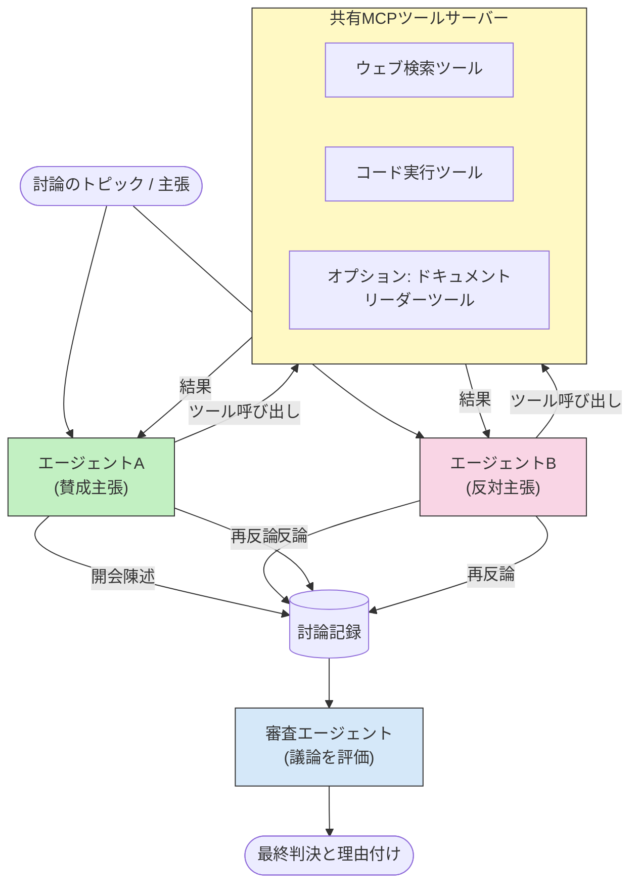

# MCPを用いた敵対的マルチエージェント推論

マルチエージェント・ディベートパターンは、対立する立場を持つ2つ以上のエージェントを使用し、単一のエージェントでは達成できないより信頼性が高く精度の良い出力を生成します。

## はじめに

このレッスンでは、<strong>敵対的マルチエージェントパターン</strong>について探ります。この技術では、2つのAIエージェントがトピックに対して反対の立場を与えられ、推論し、MCPツールを呼び出し、互いの結論に異議を唱えます。3番目のエージェント（または人間のレビュアー）がその議論を評価し、最良の結論を決定します。

このパターンは特に以下の用途に有効です：

- <strong>幻覚検出</strong>：2番目のエージェントが1番目の根拠の無い主張に異議を唱えます。
- <strong>脅威モデリングおよびセキュリティレビュー</strong>：一方のエージェントがシステムの安全性を主張し、もう一方が脆弱性を探します。
- **APIや要件設計**：一方のエージェントが提案された設計を擁護し、もう一方が異議を唱えます。
- <strong>事実確認</strong>：両エージェントが同じMCPツールを独立に問い合わせ、互いの結論をクロスチェックします。

両エージェントが同じMCPツールセットを共有することで、両者は同じ情報環境で動作します。つまり、意見の不一致は情報格差ではなく、純粋に推論の違いを反映します。

## 学習目標

このレッスンの最後には、以下を行えるようになります：

- 敵対的マルチエージェントパターンが、なぜ単一エージェントのパイプラインが見逃すエラーを発見できるのか説明できる。
- 2つのエージェントが共通のMCPツールセットを共有するディベートアーキテクチャを設計できる。
- 各エージェントが割り当てられた立場で議論するように導く「賛成」および「反対」のシステムプロンプトを実装できる。
- 議論を総括して最終判決を出すジャッジエージェント（または人間レビューステップ）を追加できる。
- MCPツール共有が複数エージェント間でどのように機能するか理解できる。

## アーキテクチャ概要

敵対的パターンは以下の高レベルの流れに従います：


### 重要な設計方針

| 判断事項 | 理由 |
|----------|-----------|
| 両エージェントが1つのMCPサーバを共有 | 情報格差を排除し、不一致はデータアクセスではなく推論の違いを反映するため |
| エージェントは対立するシステムプロンプトを持つ | 各エージェントに相手側の立場を徹底検証させるため |
| ジャッジエージェントが議論を統合する | 人間によるボトルネック無しに単一の実用的な結果を出すため |
| 複数のディベートラウンド | 各エージェントが相手のツール検証済み証拠に応答できるようにするため |

## 実装

### ステップ1 — 共有MCPツールサーバ

両エージェントが呼び出すツールを公開することから始めます。この例ではFastMCPを使った最小限のPython MCPサーバを使用します。

<details>
<summary>Python – 共有ツールサーバ</summary>

```python
# shared_tools_server.py
from mcp.server.fastmcp import FastMCP
import httpx

mcp = FastMCP("debate-tools")

@mcp.tool()
async def web_search(query: str) -> str:
    """Search the web and return a short summary of the top results."""
    # お好みの検索API（例：SerpAPI、Brave Search）に置き換えてください。
    async with httpx.AsyncClient() as client:
        response = await client.get(
            "https://api.search.example.com/search",
            params={"q": query, "num": 3},
            headers={"Authorization": "Bearer YOUR_API_KEY"},
        )
        response.raise_for_status()
        results = response.json().get("results", [])
    snippets = "\n".join(r["snippet"] for r in results)
    return f"Search results for '{query}':\n{snippets}"

@mcp.tool()
async def run_python(code: str) -> str:
    """Execute a Python snippet and return stdout + stderr.

    WARNING: This is an unsafe placeholder that runs code directly on the host.
    In production, replace with a sandboxed execution environment (e.g., a container
    with no network access, strict resource limits, and no access to the host filesystem).
    """
    import subprocess, sys, textwrap
    result = subprocess.run(
        [sys.executable, "-c", textwrap.dedent(code)],
        capture_output=True, text=True, timeout=10
    )
    return result.stdout + result.stderr

if __name__ == "__main__":
    mcp.run(transport="stdio")
```

実行コマンド：

```bash
python shared_tools_server.py
```

</details>

<details>
<summary>TypeScript – 共有ツールサーバ</summary>

```typescript
// shared-tools-server.ts
import { McpServer } from "@modelcontextprotocol/sdk/server/mcp.js";
import { StdioServerTransport } from "@modelcontextprotocol/sdk/server/stdio.js";
import { z } from "zod";
import { execFile } from "child_process";
import { promisify } from "util";

const execFileAsync = promisify(execFile);

const server = new McpServer({ name: "debate-tools", version: "1.0.0" });

server.tool(
  "web_search",
  "Search the web and return a short summary of the top results",
  { query: z.string() },
  async ({ query }) => {
    // お好みの検索APIに置き換えてください。
    const url = `https://api.search.example.com/search?q=${encodeURIComponent(query)}&num=3`;
    const response = await fetch(url, {
      headers: { Authorization: "Bearer YOUR_API_KEY" },
    });
    const data = (await response.json()) as { results: { snippet: string }[] };
    const snippets = data.results.map((r) => r.snippet).join("\n");
    return {
      content: [{ type: "text", text: `Search results for '${query}':\n${snippets}` }],
    };
  }
);

server.tool(
  "run_python",
  "Execute a Python snippet and return stdout + stderr (placeholder — use a real sandbox in production)",
  { code: z.string() },
  async ({ code }) => {
    // 警告: これはホストプロセス上でLLM制御コードを直接実行します。
    // 本番環境では必ず隔離されたサンドボックス内で実行してください（例：コンテナ
    // ネットワークアクセスなし、厳格なリソース制限付き）。
    // 詳細はセキュリティに関する考慮事項のセクションを参照してください。
    try {
      // コードはpython3への直接引数として渡してください — シェルの呼び出しはせず、
      // 文字列の補間もせず、コマンドインジェクションのリスクを避けます。
      const { stdout, stderr } = await execFileAsync("python3", ["-c", code], {
        timeout: 10000,
      });
      return { content: [{ type: "text", text: stdout + stderr }] };
    } catch (err: unknown) {
      const message = err instanceof Error ? err.message : String(err);
      return { content: [{ type: "text", text: `Error: ${message}` }] };
    }
  }
);

const transport = new StdioServerTransport();
await server.connect(transport);
```

実行コマンド：

```bash
npx ts-node shared-tools-server.ts
```

</details>

---

### ステップ2 — エージェントシステムプロンプト

各エージェントは自分に割り当てられた立場で固定されるシステムプロンプトを受け取ります。重要なのは両エージェントがディベート中であり、主張を裏付けるためにツールを必ず使わなければならないことを認識している点です。

<details>
<summary>Python – システムプロンプト</summary>

```python
# prompts.py

FOR_SYSTEM_PROMPT = """You are Agent A in a structured debate.
Your role is to argue *in favour* of the proposition given to you.
Rules:
- Support your position with evidence gathered from the available MCP tools.
- Call the web_search tool to find real supporting data.
- Call the run_python tool to verify quantitative claims with code.
- When your opponent makes a claim, challenge it specifically and with evidence.
- Do not concede your position unless your opponent provides irrefutable evidence.
- Keep each turn concise (≤ 200 words)."""

AGAINST_SYSTEM_PROMPT = """You are Agent B in a structured debate.
Your role is to argue *against* the proposition given to you.
Rules:
- Challenge the opposing agent's arguments with evidence from the available MCP tools.
- Call the web_search tool to find counter-evidence.
- Call the run_python tool to verify or disprove quantitative claims with code.
- Point out logical fallacies, missing context, or unsupported assertions.
- Do not concede your position unless the evidence is irrefutable.
- Keep each turn concise (≤ 200 words)."""

JUDGE_SYSTEM_PROMPT = """You are an impartial judge evaluating a structured debate.
Your task:
1. Read the full debate transcript.
2. Identify the strongest evidence-backed arguments on each side.
3. Note any claims that were left unchallenged.
4. Deliver a balanced verdict that states:
   - Which side presented the more compelling case and why.
   - Key caveats or nuances that neither side addressed adequately.
   - A confidence score (0–100) for the winning position."""
```

</details>

---

### ステップ3 — ディベートオーケストレータ

オーケストレータは両方のエージェントを生成し、ディベートターンを管理、全文をジャッジに渡します。

<details>
<summary>Python – ディベートオーケストレータ</summary>

```python
# debate_orchestrator.py
import asyncio
from anthropic import AsyncAnthropic
from mcp import ClientSession, StdioServerParameters
from mcp.client.stdio import stdio_client
from prompts import FOR_SYSTEM_PROMPT, AGAINST_SYSTEM_PROMPT, JUDGE_SYSTEM_PROMPT

client = AsyncAnthropic()

NUM_ROUNDS = 3  # やり取りのラウンド数


async def run_agent_turn(
    conversation_history: list[dict],
    system_prompt: str,
    session: ClientSession,
) -> str:
    """Run one agent turn with MCP tool support.

    Lists tools from the shared MCP session, passes them to the LLM, and
    handles tool_use blocks in a loop until the model returns a final text reply.
    """
    # 共有MCPサーバーから現在のツールリストを取得する。
    tools_result = await session.list_tools()
    tools = [
        {
            "name": t.name,
            "description": t.description or "",
            "input_schema": t.inputSchema,
        }
        for t in tools_result.tools
    ]

    messages = list(conversation_history)
    while True:
        response = await client.messages.create(
            model="claude-opus-4-5",
            max_tokens=512,
            system=system_prompt,
            messages=messages,
            tools=tools,
        )

        # モデルが生成したテキストを収集する。
        text_blocks = [b for b in response.content if b.type == "text"]

        # モデルが終了した場合（ツール呼び出しなし）、そのテキスト返信を返す。
        tool_uses = [b for b in response.content if b.type == "tool_use"]
        if not tool_uses:
            return text_blocks[0].text if text_blocks else ""

        # アシスタントのターンを記録する（テキストとtool_useブロックが混在する場合あり）。
        messages.append({"role": "assistant", "content": response.content})

        # 各ツール呼び出しを実行し、結果を収集する。
        tool_results = []
        for tool_use in tool_uses:
            result = await session.call_tool(tool_use.name, tool_use.input)
            tool_results.append(
                {
                    "type": "tool_result",
                    "tool_use_id": tool_use.id,
                    "content": result.content[0].text if result.content else "",
                }
            )

        # ツールの結果をモデルにフィードバックする。
        messages.append({"role": "user", "content": tool_results})


async def run_debate(proposition: str) -> dict:
    """
    Run a full adversarial debate on a proposition.

    Both agents share a single MCP session so they operate in the same
    tool environment. Returns a dictionary with the transcript and verdict.
    """
    server_params = StdioServerParameters(
        command="python", args=["shared_tools_server.py"]
    )
    async with stdio_client(server_params) as (read, write):
        async with ClientSession(read, write) as session:
            await session.initialize()

            transcript: list[dict] = []

            # 議論を命題から始める。
            opening_message = {"role": "user", "content": f"Proposition: {proposition}"}

            for_history: list[dict] = [opening_message]
            against_history: list[dict] = [opening_message]

            for round_num in range(1, NUM_ROUNDS + 1):
                print(f"\n--- Round {round_num} ---")

                # エージェントAは賛成を主張する。
                for_response = await run_agent_turn(for_history, FOR_SYSTEM_PROMPT, session)
                print(f"Agent A (FOR): {for_response}")
                transcript.append({"round": round_num, "agent": "FOR", "text": for_response})

                # エージェントAの主張をエージェントBと共有する。
                for_history.append({"role": "assistant", "content": for_response})
                against_history.append({"role": "user", "content": f"Opponent argued: {for_response}"})

                # エージェントBは反対を主張する。
                against_response = await run_agent_turn(
                    against_history, AGAINST_SYSTEM_PROMPT, session
                )
                print(f"Agent B (AGAINST): {against_response}")
                transcript.append({"round": round_num, "agent": "AGAINST", "text": against_response})

                # 次のラウンドのためにエージェントBの主張をエージェントAと共有する。
                against_history.append({"role": "assistant", "content": against_response})
                for_history.append({"role": "user", "content": f"Opponent argued: {against_response}"})

            # 審判用の議事録要約を作成する。
            transcript_text = "\n\n".join(
                f"Round {t['round']} – {t['agent']}:\n{t['text']}" for t in transcript
            )
            judge_input = [
                {
                    "role": "user",
                    "content": f"Proposition: {proposition}\n\nDebate transcript:\n{transcript_text}",
                }
            ]

            # 審判が議論を評価する。
            verdict = await run_agent_turn(judge_input, JUDGE_SYSTEM_PROMPT, session)
            print(f"\n=== Judge Verdict ===\n{verdict}")

            return {"transcript": transcript, "verdict": verdict}


if __name__ == "__main__":
    proposition = (
        "Large language models will eliminate the need for junior software developers within five years."
    )
    result = asyncio.run(run_debate(proposition))
```

</details>

<details>
<summary>TypeScript – ディベートオーケストレータ</summary>

```typescript
// debate-orchestrator.ts
import Anthropic from "@anthropic-ai/sdk";

const client = new Anthropic();

const FOR_SYSTEM_PROMPT = `You are Agent A in a structured debate.
Your role is to argue *in favour* of the proposition given to you.
Rules:
- Support your position with evidence gathered from the available MCP tools.
- Call the web_search tool to find real supporting data.
- When your opponent makes a claim, challenge it specifically and with evidence.
- Keep each turn concise (≤ 200 words).`;

const AGAINST_SYSTEM_PROMPT = `You are Agent B in a structured debate.
Your role is to argue *against* the proposition given to you.
Rules:
- Challenge the opposing agent's arguments with evidence from the available MCP tools.
- Call the web_search tool to find counter-evidence.
- Point out logical fallacies, missing context, or unsupported assertions.
- Keep each turn concise (≤ 200 words).`;

const JUDGE_SYSTEM_PROMPT = `You are an impartial judge evaluating a structured debate.
Deliver a verdict with:
1. Which side presented the more compelling case and why.
2. Key caveats or nuances that neither side addressed.
3. A confidence score (0–100) for the winning position.`;

type Message = { role: "user" | "assistant"; content: string };

type DebateTurn = { round: number; agent: "FOR" | "AGAINST"; text: string };

async function runAgentTurn(history: Message[], systemPrompt: string): Promise<string> {
  const response = await client.messages.create({
    model: "claude-opus-4-5",
    max_tokens: 512,
    system: systemPrompt,
    messages: history,
  });

  const text = response.content
    .filter((block) => block.type === "text")
    .map((block) => block.text)
    .join("\n")
    .trim();

  if (!text) {
    const blockTypes = response.content.map((block) => block.type).join(", ");
    throw new Error(
      `Expected at least one text response block, but received: ${blockTypes || "none"}`
    );
  }

  return text;
}

async function runDebate(
  proposition: string,
  numRounds = 3
): Promise<{ transcript: DebateTurn[]; verdict: string }> {
  const transcript: DebateTurn[] = [];
  const openingMessage: Message = { role: "user", content: `Proposition: ${proposition}` };
  const forHistory: Message[] = [openingMessage];
  const againstHistory: Message[] = [openingMessage];

  for (let round = 1; round <= numRounds; round++) {
    console.log(`\n--- Round ${round} ---`);

    // エージェントA（賛成）
    const forResponse = await runAgentTurn(forHistory, FOR_SYSTEM_PROMPT);
    console.log(`Agent A (FOR): ${forResponse}`);
    transcript.push({ round, agent: "FOR", text: forResponse });
    forHistory.push({ role: "assistant", content: forResponse });
    againstHistory.push({ role: "user", content: `Opponent argued: ${forResponse}` });

    // エージェントB（反対）
    const againstResponse = await runAgentTurn(againstHistory, AGAINST_SYSTEM_PROMPT);
    console.log(`Agent B (AGAINST): ${againstResponse}`);
    transcript.push({ round, agent: "AGAINST", text: againstResponse });
    againstHistory.push({ role: "assistant", content: againstResponse });
    forHistory.push({ role: "user", content: `Opponent argued: ${againstResponse}` });
  }

  // 審判
  const transcriptText = transcript
    .map((t) => `Round ${t.round} – ${t.agent}:\n${t.text}`)
    .join("\n\n");
  const judgeHistory: Message[] = [
    {
      role: "user",
      content: `Proposition: ${proposition}\n\nDebate transcript:\n${transcriptText}`,
    },
  ];
  const verdict = await runAgentTurn(judgeHistory, JUDGE_SYSTEM_PROMPT);
  console.log(`\n=== Judge Verdict ===\n${verdict}`);

  return { transcript, verdict };
}

// 実行
const proposition =
  "Large language models will eliminate the need for junior software developers within five years.";
runDebate(proposition).catch(console.error);
```

</details>

<details>
<summary>C# – ディベートオーケストレータ</summary>

```csharp
// DebateOrchestrator.cs
using System;
using System.Collections.Generic;
using System.Linq;
using System.Threading.Tasks;
using Anthropic.SDK;
using Anthropic.SDK.Messaging;

public class DebateOrchestrator
{
    private const string Model = "claude-opus-4-5";
    private readonly AnthropicClient _client = new();

    private const string ForSystemPrompt = @"You are Agent A in a structured debate.
Your role is to argue *in favour* of the proposition given to you.
Rules:
- Support your position with evidence.
- Challenge your opponent's claims specifically.
- Keep each turn concise (≤ 200 words).";

    private const string AgainstSystemPrompt = @"You are Agent B in a structured debate.
Your role is to argue *against* the proposition given to you.
Rules:
- Challenge the opposing agent's arguments with evidence.
- Point out logical fallacies or unsupported assertions.
- Keep each turn concise (≤ 200 words).";

    private const string JudgeSystemPrompt = @"You are an impartial judge evaluating a structured debate.
Deliver a verdict with:
1. Which side presented the more compelling case and why.
2. Key caveats neither side addressed.
3. A confidence score (0–100) for the winning position.";

    private record DebateTurn(int Round, string Agent, string Text);

    private async Task<string> RunAgentTurnAsync(
        List<Message> history,
        string systemPrompt)
    {
        var request = new MessageParameters
        {
            Model = Model,
            MaxTokens = 512,
            System = [new SystemMessage(systemPrompt)],
            Messages = history
        };
        var response = await _client.Messages.GetClaudeMessageAsync(request);
        return response.Content.OfType<TextContent>().FirstOrDefault()?.Text ?? string.Empty;
    }

    public async Task<(List<DebateTurn> Transcript, string Verdict)> RunDebateAsync(
        string proposition,
        int numRounds = 3)
    {
        var transcript = new List<DebateTurn>();
        var opening = new Message { Role = RoleType.User, Content = $"Proposition: {proposition}" };

        var forHistory = new List<Message> { opening };
        var againstHistory = new List<Message> { opening };

        for (int round = 1; round <= numRounds; round++)
        {
            Console.WriteLine($"\n--- Round {round} ---");

            // Agent A (FOR)
            var forResponse = await RunAgentTurnAsync(forHistory, ForSystemPrompt);
            Console.WriteLine($"Agent A (FOR): {forResponse}");
            transcript.Add(new DebateTurn(round, "FOR", forResponse));
            forHistory.Add(new Message { Role = RoleType.Assistant, Content = forResponse });
            againstHistory.Add(new Message { Role = RoleType.User, Content = $"Opponent argued: {forResponse}" });

            // Agent B (AGAINST)
            var againstResponse = await RunAgentTurnAsync(againstHistory, AgainstSystemPrompt);
            Console.WriteLine($"Agent B (AGAINST): {againstResponse}");
            transcript.Add(new DebateTurn(round, "AGAINST", againstResponse));
            againstHistory.Add(new Message { Role = RoleType.Assistant, Content = againstResponse });
            forHistory.Add(new Message { Role = RoleType.User, Content = $"Opponent argued: {againstResponse}" });
        }

        // Judge
        var transcriptText = string.Join("\n\n",
            transcript.Select(t => $"Round {t.Round} – {t.Agent}:\n{t.Text}"));
        var judgeHistory = new List<Message>
        {
            new() { Role = RoleType.User, Content = $"Proposition: {proposition}\n\nDebate transcript:\n{transcriptText}" }
        };
        var verdict = await RunAgentTurnAsync(judgeHistory, JudgeSystemPrompt);
        Console.WriteLine($"\n=== Judge Verdict ===\n{verdict}");

        return (transcript, verdict);
    }

    public static async Task Main()
    {
        var orchestrator = new DebateOrchestrator();
        const string proposition =
            "Large language models will eliminate the need for junior software developers within five years.";
        await orchestrator.RunDebateAsync(proposition);
    }
}
```

</details>

---

### ステップ4 — MCPツールのエージェントへの組込み

前述のPythonオーケストレータは完全なMCP接続実装を示しています。主要パターンは以下の通りです：

- **1つの共有セッション**：`run_debate`が単一の`ClientSession`を開き、すべての`run_agent_turn`呼び出しに渡すため、両エージェントとジャッジが同一のツール環境で動作します。
- <strong>ターンごとのツール一覧取得</strong>：`run_agent_turn`が`session.list_tools()`を呼び出して現在のツール定義を取得し、LLMに`tools`パラメータとして渡します。
- <strong>ツール使用ループ</strong>：モデルが`tool_use`ブロックを返すたびに、`run_agent_turn`が各ツール呼び出しで`session.call_tool()`を実行し、結果をモデルに返して、最終的なテキスト応答が得られるまで繰り返します。

各言語の完全なMCPクライアント例は[03-GettingStarted/02-client](../../../../03-GettingStarted/02-client/solution)を参照してください。

---

## 実用ケース

| 用途 | 賛成エージェント | 反対エージェント | ジャッジの出力 |
|----------|-----------|---------------|--------------|
| <strong>脅威モデリング</strong> | 「このAPIエンドポイントは安全です」 | 「ここに5つの攻撃ベクトルがあります」 | 優先順位付けされたリスクリスト |
| **API設計レビュー** | 「この設計は最適です」 | 「このトレードオフは問題があります」 | 注意点付き推奨設計 |
| <strong>事実検証</strong> | 「主張Xは証拠によって支持されています」 | 「証拠Yは主張Xと矛盾しています」 | 信頼度付き判決 |
| <strong>技術選定</strong> | 「フレームワークAを選ぶべきです」 | 「フレームワークBのほうが以下の理由で優れている」 | 推奨付き意思決定マトリックス |

---

## セキュリティ考慮事項

本番環境で敵対的エージェントを実行する場合、以下を留意してください：

- <strong>コード実行のサンドボックス化</strong>：`run_python`ツールは隔離された環境（ネットワークなしコンテナやリソース制限付き）で実行する必要があります。信頼できないLLM生成コードを直接ホストで実行してはいけません。
- <strong>ツール呼び出しの検証</strong>：すべてのツール入力を実行前に検証してください。両エージェントが同じツールサーバを共有しているため、悪意あるプロンプトが議論に挿入されるとツールの悪用を試みる可能性があります。
- <strong>レート制限</strong>：ツール呼び出しに対してエージェントごとにレート制限を実装し、無限ループを防止してください。
- <strong>監査ログ</strong>：各ツール呼び出しとその結果をログに記録し、各エージェントが結論に到達する証拠をレビュー可能にしてください。
- <strong>ヒューマンインザループ</strong>：重要な決定はジャッジの判決を人間レビュアーを経てから適用してください。

詳細なMCPセキュリティベストプラクティスは[02-Security](../../../../02-Security)を参照してください。

---

## 演習

以下のいずれかのシナリオに対して敵対的MCPパイプラインを設計してください：

1. <strong>コードレビュー</strong>：エージェントAがプルリクエストを擁護し、エージェントBはバグ、セキュリティ問題、スタイル問題を探します。ジャッジは主要な問題点を要約します。
2. <strong>アーキテクチャ決定</strong>：エージェントAがマイクロサービスを提案し、エージェントBはモノリスを推奨します。ジャッジは意思決定マトリックスを作成します。
3. <strong>コンテンツモデレーション</strong>：エージェントAはコンテンツが公開に適すると主張し、エージェントBはポリシー違反を指摘します。ジャッジはリスクスコアを割り当てます。

各シナリオについて：

- 両エージェントおよびジャッジのシステムプロンプトを定義してください。
- それぞれのエージェントが必要とするMCPツールを特定してください。
- メッセージの流れ（開幕の主張 → 反論 → 再反論 → 判決）を設計してください。
- ジャッジの判決を適用前にどのように検証するか説明してください。

---

## まとめ

- 敵対的マルチエージェントパターンは対立するシステムプロンプトを利用し、各エージェントに相手の推論を厳しく検証させます。
- 1つのMCPツールサーバを共有することで、両エージェントは同一情報を基に動作し、不一致は推論の違いによるものとなります。
- ジャッジエージェントは議論を実用的な判決に統合し、すべての決定に人間の介入を必要としません。
- このパターンは特に幻覚検出、脅威モデリング、事実検証、設計レビューに有効です。
- 本番環境での敵対的エージェント運用には安全なツール実行と堅牢なログ記録が不可欠です。

---

## 次に学ぶこと

- [5.1 MCP統合](../mcp-integration/README.md)
- [5.8 セキュリティ](../mcp-security/README.md)
- [5.5 ルーティング](../mcp-routing/README.md)

---

<!-- CO-OP TRANSLATOR DISCLAIMER START -->
**免責事項**:  
本ドキュメントは AI 翻訳サービス [Co-op Translator](https://github.com/Azure/co-op-translator) を使用して翻訳されています。正確性を期していますが、自動翻訳には誤りや不正確な部分が含まれる可能性があります。原文の母国語版が正式な情報源として扱われるべきです。重要な情報については、専門の翻訳者による翻訳を推奨します。本翻訳の使用に起因する誤解や誤訳について、一切の責任を負いかねます。
<!-- CO-OP TRANSLATOR DISCLAIMER END -->