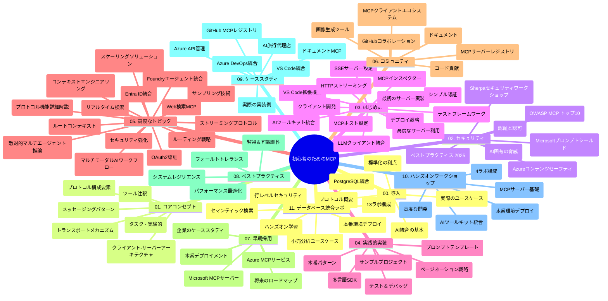

# 初心者のためのモデルコンテキストプロトコル（MCP） - 学習ガイド

この学習ガイドは、「初心者のためのモデルコンテキストプロトコル（MCP）」カリキュラムのリポジトリ構造と内容の概要を提供します。このガイドを使用して、リポジトリを効率的にナビゲートし、利用可能なリソースを最大限に活用してください。

## リポジトリの概要

モデルコンテキストプロトコル（MCP）は、AIモデルとクライアントアプリケーション間の相互作用のための標準化されたフレームワークです。当初Anthropicによって作成されましたが、現在は公式GitHub組織を通じてより広範なMCPコミュニティによって維持されています。このリポジトリは、AI開発者、システムアーキテクト、およびソフトウェアエンジニア向けに設計された、C#、Java、JavaScript、Python、TypeScriptでの実践的なコード例を含む包括的なカリキュラムを提供します。

## 視覚的カリキュラムマップ

## リポジトリ構造

リポジトリは11の主要セクションに分かれており、それぞれがMCPの異なる側面に焦点を当てています。

1. **イントロダクション（00-Introduction/）**
   - モデルコンテキストプロトコルの概要
   - AIパイプラインにおける標準化の重要性
   - 実用的なユースケースと利点

2. **コアコンセプト（01-CoreConcepts/）**
   - クライアントサーバーアーキテクチャ
   - プロトコルの主要コンポーネント
   - MCPにおけるメッセージングパターン

3. **セキュリティ（02-Security/）**
   - MCPベースのシステムにおけるセキュリティ脅威
   - 実装を保護するためのベストプラクティス
   - 認証と認可の戦略
   - <strong>包括的なセキュリティドキュメント</strong>:
     - MCP セキュリティベストプラクティス 2025
     - Azure Content Safety 実装ガイド
     - MCP セキュリティコントロールと技術
     - MCP ベストプラクティス クイックリファレンス
   - <strong>重要なセキュリティトピック</strong>:
     - プロンプトインジェクションとツール毒化攻撃
     - セッションハイジャックと混乱代理問題
     - トークンパススルーの脆弱性
     - 過剰な権限とアクセス制御
     - AIコンポーネントのサプライチェーンセキュリティ
     - Microsoft Prompt Shieldsの統合

4. **はじめに（03-GettingStarted/）**
   - 環境設定と構成
   - 基本的なMCPサーバーとクライアントの作成
   - 既存アプリケーションとの統合
   - 以下のセクションを含む:
     - 初めてのサーバー実装
     - クライアント開発
     - LLMクライアント統合
     - VS Code統合
     - Server-Sent Events (SSE)サーバー
     - 高度なサーバー使用法
     - HTTPストリーミング
     - AIツールキット統合
     - テスト戦略
     - デプロイメントガイドライン

5. **実践的実装（04-PracticalImplementation/）**
   - 異なるプログラミング言語でのSDK利用
   - デバッグ、テスト、検証手法
   - 再利用可能なプロンプトテンプレートとワークフローの作成
   - 実装例を含むサンプルプロジェクト

6. **高度なトピック（05-AdvancedTopics/）**
   - コンテキストエンジニアリング技術
   - Foundryエージェントの統合
   - マルチモーダルAIワークフロー
   - OAuth2認証デモ
   - リアルタイム検索機能
   - リアルタイムストリーミング
   - ルートコンテキストの実装
   - ルーティング戦略
   - サンプリング技術
   - スケーリングアプローチ
   - セキュリティ考慮事項
   - Entra IDセキュリティ統合
   - Web検索統合
   - 逆境的マルチエージェント推論（討論パターン）

7. **コミュニティ貢献（06-CommunityContributions/）**
   - コードおよびドキュメントの貢献方法
   - GitHubを介したコラボレーション
   - コミュニティ駆動の拡張とフィードバック
   - 各種MCPクライアントの使用（Claude Desktop、Cline、VSCode）
   - 画像生成を含む人気MCPサーバーの活用

8. **早期採用からの教訓（07-LessonsfromEarlyAdoption/）**
   - 実世界における実装事例と成功ストーリー
   - MCPベースのソリューションの構築と展開
   - トレンドと将来のロードマップ
   - **Microsoft MCPサーバーガイド**: 以下の10の本番対応Microsoft MCPサーバーの包括的ガイド:
     - Microsoft Learn Docs MCPサーバー
     - Azure MCPサーバー（15以上の専門コネクタ）
     - GitHub MCPサーバー
     - Azure DevOps MCPサーバー
     - MarkItDown MCPサーバー
     - SQL Server MCPサーバー
     - Playwright MCPサーバー
     - Dev Box MCPサーバー
     - Azure AI Foundry MCPサーバー
     - Microsoft 365 Agents Toolkit MCPサーバー

9. **ベストプラクティス（08-BestPractices/）**
   - パフォーマンスチューニングと最適化
   - フォールトトレラントなMCPシステム設計
   - テストおよび耐障害性戦略

10. **ケーススタディ（09-CaseStudy/）**
    - **多様なシナリオを通じてMCPの多用途性を示す7つの包括的なケーススタディ**:
    - **Azure AIトラベルエージェント**: Azure OpenAIとAI検索を用いたマルチエージェントオーケストレーション
    - **Azure DevOps統合**: YouTubeデータ更新によるワークフロー自動化
    - <strong>リアルタイムドキュメント取得</strong>: ストリーミングHTTPを用いたPythonコンソールクライアント
    - <strong>インタラクティブ学習プランジェネレーター</strong>: 会話型AIを使用したChainlitウェブアプリ
    - <strong>エディタ内ドキュメント</strong>: GitHub CopilotワークフローとのVS Code統合
    - **Azure API Management**: MCPサーバー作成を伴う企業API統合
    - **GitHub MCPレジストリ**: エコシステム開発とエージェンティック統合プラットフォーム
    - 企業統合、開発者生産性、エコシステム開発にわたる実装例

11. **実践ワークショップ（10-StreamliningAIWorkflowsBuildingAnMCPServerWithAIToolkit/）**
    - MCPとAIツールキットを組み合わせた包括的な実践ワークショップ
    - AIモデルと現実のツールを架橋するインテリジェントアプリケーションの構築
    - 基礎からカスタムサーバー開発、運用展開戦略までの実践モジュール
    - <strong>ラボ構成</strong>:
      - ラボ1: MCPサーバー基礎
      - ラボ2: 高度なMCPサーバー開発
      - ラボ3: AIツールキット統合
      - ラボ4: 運用展開とスケーリング
    - ステップバイステップのラボ型学習アプローチ

12. **MCPサーバーデータベース統合ラボ（11-MCPServerHandsOnLabs/）**
    - PostgreSQL統合による本番対応MCPサーバービルドのための<strong>包括的な13ラボ学習パス</strong>
    - Zava Retailユースケースを用いたリアルワールド小売分析実装
    - Row Level Security (RLS)、セマンティック検索、マルチテナントデータアクセスを含む企業グレードパターン
    - <strong>完全なラボ構造</strong>:
      - **ラボ00-03: 基礎** - イントロダクション、アーキテクチャ、セキュリティ、環境設定
      - **ラボ04-06: MCPサーバー構築** - データベース設計、MCPサーバー実装、ツール開発
      - **ラボ07-09: 高度な機能** - セマンティック検索、テスト＆デバッグ、VS Code統合
      - **ラボ10-12: 運用＆ベストプラクティス** - デプロイメント、モニタリング、最適化
    - <strong>使用技術</strong>: FastMCPフレームワーク、PostgreSQL、Azure OpenAI、Azure Container Apps、Application Insights
    - <strong>学習成果</strong>: 本番対応MCPサーバー、データベース統合パターン、AI活用分析、エンタープライズセキュリティ

## 追加リソース

リポジトリにはサポートリソースも含まれます:

- **Imagesフォルダ**: カリキュラム全体で使用される図表やイラスト
- <strong>翻訳</strong>: ドキュメントの多言語自動翻訳サポート
- **公式MCPリソース**:
  - [MCP Documentation](https://modelcontextprotocol.io/)
  - [MCP Specification](https://spec.modelcontextprotocol.io/)
  - [MCP GitHub Repository](https://github.com/modelcontextprotocol)

## リポジトリの使い方

1. <strong>順番に学習</strong>: 章を順に（00から11まで）進め、体系的に学ぶ。
2. <strong>言語別フォーカス</strong>: 特定のプログラミング言語に興味がある場合は、samplesディレクトリで該当言語の実装を探索する。
3. <strong>実践的実装</strong>: 「はじめに」セクションから環境を設定し、最初のMCPサーバーとクライアントを作成する。
4. <strong>高度な探求</strong>: 基礎に慣れたら、高度なトピックに進み知識を深める。
5. <strong>コミュニティ参加</strong>: GitHubディスカッションやDiscordチャンネルを通じてMCPコミュニティに参加し、専門家や他の開発者と交流する。

## MCPクライアントとツール

カリキュラムではさまざまなMCPクライアントとツールを扱います:

1. <strong>公式クライアント</strong>:
   - Visual Studio Code
   - Visual Studio CodeのMCP
   - Claude Desktop
   - VSCodeのClaude
   - Claude API

2. <strong>コミュニティクライアント</strong>:
   - Cline（ターミナルベース）
   - Cursor（コードエディタ）
   - ChatMCP
   - Windsurf

3. **MCP管理ツール**:
   - MCP CLI
   - MCP Manager
   - MCP Linker
   - MCP Router

## 人気のMCPサーバー

リポジトリでは以下のようなMCPサーバーを紹介しています:

1. **公式Microsoft MCPサーバー**:
   - Microsoft Learn Docs MCPサーバー
   - Azure MCPサーバー（15以上の専門コネクタ）
   - GitHub MCPサーバー
   - Azure DevOps MCPサーバー
   - MarkItDown MCPサーバー
   - SQL Server MCPサーバー
   - Playwright MCPサーバー
   - Dev Box MCPサーバー
   - Azure AI Foundry MCPサーバー
   - Microsoft 365 Agents Toolkit MCPサーバー

2. <strong>公式リファレンスサーバー</strong>:
   - Filesystem
   - Fetch
   - Memory
   - Sequential Thinking

3. <strong>画像生成</strong>:
   - Azure OpenAI DALL-E 3
   - Stable Diffusion WebUI
   - Replicate

4. <strong>開発ツール</strong>:
   - Git MCP
   - Terminal Control
   - Code Assistant

5. <strong>専門サーバー</strong>:
   - Salesforce
   - Microsoft Teams
   - Jira & Confluence

## 貢献について

このリポジトリはコミュニティからの貢献を歓迎しています。効果的にMCPエコシステムに貢献する方法はコミュニティ貢献セクションをご参照ください。

----

*この学習ガイドは2026年2月5日に最新のMCP Specification 2025-11-25を反映して更新されました。リポジトリの内容はこの日付以降に更新される可能性があります。*

---

<!-- CO-OP TRANSLATOR DISCLAIMER START -->
**免責事項**：  
本書類はAI翻訳サービス [Co-op Translator](https://github.com/Azure/co-op-translator) を使用して翻訳されています。正確性を期していますが、自動翻訳には誤りや不正確な箇所が含まれる場合があります。原文の言語版が正式な情報源とみなされるべきです。重要な情報については、専門の人間による翻訳を推奨します。本翻訳の使用により生じた誤解や解釈違いについては当方は一切責任を負いません。
<!-- CO-OP TRANSLATOR DISCLAIMER END -->