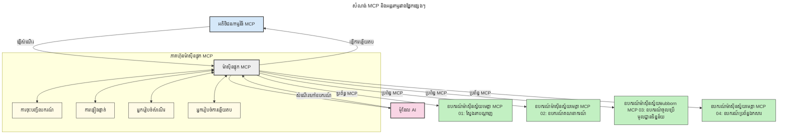

# ការណែនាំអំពី Model Context Protocol (MCP): និយមន័យសម្រាប់កម្មវិធី AI អាចពង្រីកបាន

[](https://youtu.be/agBbdiOPLQA)

_(ចុចរូបភាពខាងលើដើម្បីមើលវីដេអូមេរៀននេះ)_

កម្មវិធី AI ជ генераតឆ្លាតវៃគឺជាជំហានមួយដ៏ល្អក្នុងការរក្សាទំនាក់ទំនងជាមួយកម្មវិធីដោយប្រើការស្នើរសុំភាសាធម្មជាតិ។ ទោះយ៉ាងណា ក្រោយពេលទទួលបានការវិនិយោគពេលវេលានិងធនធានច្រើនលើកម្មវិធីទាំងនេះ អ្នកចង់ប្រាកដថាអ្នកអាចបញ្ចូលមុខងារនិងធនធានបានយ៉ាងងាយស្រួល ដើម្បីអោយមានភាពងាយស្រួលក្នុងការពង្រីក កម្មវិធីរបស់អ្នកអាចគ្រប់គ្រងម៉ូដែលច្រើនជាងមួយ ដែលមានលក្ខណៈពិសេសនានា។ សរុបមក ការបង្កើតកម្មវិធី Gen AI គឺងាយស្រួលនៅដើម ប៉ុន្តែពេលវាទទួលបានការលូតលាស់និងក្លាយជាស្មុគស្មាញ អ្នកត្រូវចាប់ផ្តើមកំណត់រចនាសម្ព័ន្ធហើយពិបាកត្រូវយកលក្ខណៈស្តង់ដារប្រើប្រាស់ដើម្បីធានាថាកម្មវិធីរបស់អ្នកត្រូវបានបង្កើតយ៉ាងរឹងមាំ។ នេះជាកន្លែងដែល MCP ចូលរួមសម្របសម្រួល និងផ្តល់ស្តង់ដារ។

---

## **🔍 តើ Model Context Protocol (MCP) ជាអ្វី?**

**Model Context Protocol (MCP)** គឺជាអន្តរភ្ជាប់ស្តង់ដារបើក ដែលអនុញ្ញាតឲ្យម៉ូឌែលភាសាធំនៅ(Large Language Models - LLMs) អាចធ្វើការទំនាក់ទំនងបានយ៉ាងរលូនជាមួយឧបករណ៍ខាងក្រៅ API និងប្រភពទិន្នន័យផ្សេងៗ។ វាបង្កើតរចនាសម្ព័ន្ធថេរមិនបម្លែង សម្រាប់បង្កើនមុខងារម៉ូឌែល AI ខុសពីទិន្នន័យបណ្តុះបណ្តាល ហើយអាចធ្វើឲ្យប្រព័ន្ធ AI ត្រូវបានគ្រប់គ្រងយ៉ាងឆ្លាតវៃ អាចពង្រីកបាន និងឆាប់ឆ្លើយតប។

---

## **🎯 ហេតុអ្វីបានជា ការស្តង់ដារ សំខាន់សម្រាប់ AI**

ដោយកម្រិតស្មុគស្មាញកាន់តែខ្ពស់នៃកម្មវិធី AI កំណត់ស្តង់ដាសម្រាប់ **ការពង្រីក, ការពង្រឹង, ការថែទាំ និងជៀសវាងការចាក់ដុំសេវាកម្មពីវេនឌ័រ** គឺមានសារៈសំខាន់។ MCP បានចូលមើលបញ្ហានេះដោយ៖

- បញ្ចប់ការរួមបញ្ចូលរវាងម៉ូឌែលនិងឧបករណ៍
- បន្ថយការបង្កើតដំណោះស្រាយផ្ទាល់ខ្លួនដែលងាយខូចខាត
- អនុញ្ញាតឲ្យម៉ូឌែលពីវេនឌ័រផ្សេងគ្នាអាចរស់នៅក្នុងបរិស្ថានเดียวគ្នា

**ដំណឹងជាសំខាន់**៖ ទោះ MCP ត្រូវបានចាត់ថាជាស្តង់ដារបើក ក៏ប៉ុន្តែគ្មានផែនការសម្រាប់កំណត់ស្តង់ដាទៅតាមអង្គភាពស្តង់ដារដូចជា IEEE, IETF, W3C, ISO ឬស្ថាប័នស្តង់ដារផ្សេងទៀតនោះទេ។

---

## **📚 គោលបំណងសិក្សា**

ប៉ុន្មាននាទីចុងនៃអត្ថបទនេះ អ្នកអាច៖

- កំណត់ទ្រង់ទ្រាយនៃ **Model Context Protocol (MCP)** និងករណីប្រើប្រាស់វា
- យល់ពីរបៀបដែល MCP ស្តង់ដារ របៀបធ្វើការទំនាក់ទំនងរវាងម៉ូឌែលនិងឧបករណ៍
- សម្គាល់ផ្នែកសំខាន់ៗនៃរចនាសម្ព័ន្ធ MCP
- ស្វែងយល់ពីកម្មវិធី MCP នៅក្នុងបរិបទសហគ្រាសនិងការអភិវឌ្ឍ

---

## **💡 ហេតុអ្វីបានជា Model Context Protocol (MCP) ជាកម្មវិធីផ្លាស់ប្ដូរប្រាកដ**

### **🔗 MCP ដោះស្រាយបញ្ហាការបែកធ្នែកក្នុងការទំនាក់ទំនង AI**

មុន MCP ការរួមបញ្ចូលម៉ូឌែលជាមួយឧបករណ៍ត្រូវការជំហាន៖

- កូដផ្ទាល់ខ្លួនសម្រាប់គូម៉ូឌែលនិងឧបករណ៍នីមួយៗ
- API មិនស្តង់ដារសម្រាប់វេនឌ័រច្រើន
- ប៉ះពាល់ច្រើនដោយកំណែឆ្នៃ
- មិនអាចពង្រីកបានជាមួយឧបករណ៍ច្រើន

### **✅ អត្ថប្រយោជន៍នៃការស្តង់ដារ MCP**

| **អត្ថប្រយោជន៍**          | **ការពិពណ៌នា**                                                                     |
|--------------------------|---------------------------------------------------------------------------------|
| ការសម្របសម្រួល          | LLMs អាចធ្វើការងារគ្នានឹងឧបករណ៍ពីវេនឌ័រផ្សេងៗបានរលូន                   |
| ភាពសាកសម               | ធ្វើឲ្យមានប្រព័ន្ធចុះតារាងដូចគ្នាក្នុងវេទិកានិងឧបករណ៍                      |
| ចំណាយបន្ដិចក្នុងការប្រើរាន | ឧបករណ៍ដែលបានបង្កើតម្តងអាចប្រើបានក្នុងគម្រោងនិងប្រព័ន្ធផ្សេងៗ             |
| អភិវឌ្ឍមួយល្បឿនលឿន  | កាត់បន្ថយពេលអភិវឌ្ឍដោយប្រើអន្តរភ្ជាប់ស្តង់ដារ មាន plug-and-play               |

---

## **🧱 ទិដ្ឋភាពទូទៅរចនាសម្ព័ន្ធ MCP**

MCP អនុវត្តន៍រចនាសម្ព័ន្ធ **ម៉ូដែលអតិថិជន-ម៉ាស៊ីនបម្រើ**, ដែល៖

- **MCP Hosts** កាន់តំណែងម៉ូឌែល AI
- **MCP Clients** ចាប់ផ្តើមការទាមទារ
- **MCP Servers** ផ្គត់ផ្គង់ context, ឧបករណ៍ និងសមត្ថភាព

### **ផ្នែកសំខាន់ៗ៖**

- **ធនធាន** – ទិន្នន័យថេរឬមានការប្រែប្រួលសម្រាប់ម៉ូឌែល  
- **Prompts** – ប្លង់កម្មវិធីជាមុនសម្រាប់ការបង្កើតដោយដឹកនាំ  
- **ឧបករណ៍** – មុខងារប្រតិបត្តិការ ដូចជា ស្វែងរក គណនាផ្សេងៗ  
- **ការទាញយកតាមប្រព័ន្ធ** – អាកប្បកិរិយាជាភ្នាក់ងារដោយប្រើការទំនាក់ទំនងថតតវិញ  
- **ការអះអាង** – ការទាមទារដោយម៉ាស៊ីនបម្រើសម្រាប់ការបញ្ចូលពីអ្នកប្រើ  
- **ហ្គោល** – ព្រំវាលប្រព័ន្ធទិន្នន័យសម្រាប់ការគ្រប់គ្រងការចូលប្រើម៉ាស៊ីនបម្រើ

### **រចនាសម្ព័ន្ធពិគ្រោះជាមួយអនុគមន៍៖**

MCP ប្រើរចនាសម្ព័ន្ធពីរប្រភេទ៖
- **បន្ទាត់ទិន្នន័យ**: ការទំនាក់ទំនង JSON-RPC 2.0 ជាមួយការគ្រប់គ្រងជីវចលនិងថ្មីៗ
- **បន្ទាត់ដឹកជញ្ជូន**: STDIO (មូលដ្ឋាន) និង Streamable HTTP ជាមួយ SSE (ចម្ងាយ)

---

## របៀបដែល MCP Server ដំណើរការ

ម៉ាស៊ីនបម្រើ MCP ធ្វើការដូចតទៅ៖

- **ដំណាក់កាលសំណើ**៖
    1. សំណើត្រូវបានចាប់ផ្តើមដោយអ្នកប្រើឬកម្មវិធីមួយដែលធ្វើការតំណាងឱ្យខ្លួនវា។
    2. **MCP Client** ផ្ញើសំណើទៅ **MCP Host** ដែលគ្រប់គ្រងម៉ូឌែល AI ។
    3. **ម៉ូឌែល AI** ទទួលយក prompt អ្នកប្រើហើយអាចទាមទារការចូលប្រើឧបករណ៍ក្រៅឬទិន្នន័យតាមរយៈការហៅឧបករណ៍មួយឬច្រើន។
    4. **MCP Host** មិនមែនម៉ូឌែលផ្ទាល់ទេ ត្រូវទំនាក់ទំនងជាមួយ **MCP Server(s)** តាមរបៀបស្តង់ដារ។
- **មុខងារ MCP Host**៖
    - **តារាងឧបករណ៍**៖ រក្សាតាមបញ្ជីឧបករណ៍ដែលមាន និងសមត្ថភាពរបស់វា។
    - **ការផ្ទៀងផ្ទាត់អត្តសញ្ញាណ**៖ ពិនិត្យសិទ្ធិការចូលប្រើឧបករណ៍។
    - **អ្នកដំណើរការសំណើ**៖ ដំណើរការសំណើឧបករណ៍ចូលមកពីម៉ូឌែល។
    - **អ្នករៀបចំប្រតិកម្ម**៖ សម្រង់លទ្ធផលឧបករណ៍ជារបៀបទ្រង់ទ្រាយដែលម៉ូឌែលយល់បាន។
- **របៀបដំណើរការ MCP Server**៖
    - **MCP Host** បញ្ជូនការហៅឧបករណ៍ទៅម្នាក់ឬច្រើន **MCP Servers** ដែលផ្សព្វផ្សាយមុខងារពិសេស (ដូចជាស្វែងរក គណនា សំណួរព័ត៌មាន)។
    - **MCP Servers** ធ្វើប្រតិបត្តិការអនុវត្តន៍ ហើយបញ្ចូនលទ្ធផលត្រឡប់ទៅ **MCP Host** ក្នុងរបៀបសមរម្យ។
    - **MCP Host** រៀបចំរបាយការណ៍និងផ្ញើត្រឡប់ទៅម៉ូឌែល AI។
- **បញ្ចប់ប្រតិកម្ម**៖
    - **ម៉ូឌែល AI** សម្រួលលទ្ធផលឧបករណ៍ចូលក្នុងចម្លើយចុងក្រោយ។
    - **MCP Host** ផ្ញើចម្លើយនេះត្រឡប់ទៅ **MCP Client** ដែលចែកចាយទៅអ្នកប្រើឬកម្មវិធីដែលហៅ។

    


## 👨‍💻 របៀបបង្កើត MCP Server (ជាមួយឧទាហរណ៍)

ម៉ាស៊ីនបម្រើ MCP អនុញ្ញាតឲ្យអ្នកពង្រីកសមត្ថភាព LLM ដោយផ្តល់ទិន្នន័យនិងមុខងារ។

តើអ្នកបានត្រៀមខ្លួនសម្រាប់សាកល្បងទេ? នេះជាកន្លែងផ្តល់SDK ដែលមានភាសានិង stack ផ្សេងៗ ជាមួយឧទាហរណ៍បង្កើតម៉ាស៊ីនបម្រើ MCP សាមញ្ញ៖

- **Python SDK**: https://github.com/modelcontextprotocol/python-sdk

- **TypeScript SDK**: https://github.com/modelcontextprotocol/typescript-sdk

- **Java SDK**: https://github.com/modelcontextprotocol/java-sdk

- **C#/.NET SDK**: https://github.com/modelcontextprotocol/csharp-sdk


## 🌍 ករណីប្រើប្រាស់ MCP ក្នុងចំណោមពិភពពិត

MCP អាចជួយពង្រីកសមត្ថភាព AI នៅក្នុងកម្មវិធីជាច្រើន៖

| **កម្មវិធី**                | **ការពិពណ៌នា**                                                                  |
|------------------------------|---------------------------------------------------------------------------------|
| ការបញ្ចូលទិន្នន័យសហគ្រាស      | តភ្ជាប់ LLMs ទៅកាន់មូលដ្ឋានទិន្នន័យ, CRM ឬឧបករណ៍ក្នុងសហគ្រាស              |
| ប្រព័ន្ធ AI អត្តថិជន         | អនុញ្ញាតឲ្យភ្នាក់ងារអូទីម៉ាទិចមានសិទ្ធិចូលប្រើឧបករណ៍ និងដំណើរការការសម្រេចចិត្ត|
| កម្មវិធីពហុម៉ូដ             | បំបែកអត្ថបទ រូបភាព និងសំឡេង ក្នុងកម្មវិធី AI សរុបតែមួយ                     |
| ការបញ្ចូលទិន្នន័យពេលវេលាពិត| យកទិន្នន័យថ្មីចូលក្នុងការទំនាក់ទំនង AI ដើម្បីបង្កើនភាពត្រឹមត្រូវ           |


### 🧠 MCP = ស្តង់ដារសកលសម្រាប់ការទំនាក់ទំនង AI

Model Context Protocol (MCP) ធ្វើដូចជាស្តង់ដារ​សកល​ក្នុងការទំនាក់ទំនង AI ដូចការស្តង់ដារជាមួយ USB-C សម្រាប់រន្ធភ្ជាប់ឧបករណ៍។ ក្នុងពិភព AI MCP ផ្តល់អ៊ីនធរភ្ជាប់ថេរមាន អនុញ្ញាតឲ្យម៉ូឌែល (អតិថិជន) រួមបញ្ចូលជាមួយឧបករណ៍ខាងក្រៅនិងផ្គត់ផ្គង់ទិន្នន័យ (ម៉ាស៊ីនបម្រើ) ដោយរលូន។ វាជួយបញ្ជាក់ទំនាក់ទំនងដែលដាច់ពីគ្នា សម្រាប់ API ឬប្រភពទិន្នន័យផ្សេងៗ។

ក្រោម MCP, ឧបករណ៍ដែលផ្គាប់គ្នា MCP (ហៅថា MCP server) ធ្វើតាមស្តង់ដារមួយតែមួយ។ ម៉ាស៊ីនបម្រើទាំងនេះអាចបញ្ជីនូវឧបករណ៍ឬសកម្មភាពដែលគេផ្តល់ និងអនុវត្តសកម្មភាពពេលត្រូវបានស្នើរដោយភ្នាក់ងារ AI។ វេទិកាភ្នាក់ងារ AI ដែលគាំទ្រ MCP អាចរកឃើញឧបករណ៍ពីម៉ាស៊ីនបម្រើនិងហៅវាតាមស្តង់ដារ។

### 💡 ជួយធ្វើឲ្យចូលដំណឹងបានងាយស្រួល

ក្រៅពីផ្តល់ឧបករណ៍ MCP ក៏ជួយផ្តល់ context ចំណេះដឹងផងដែរ។ វាអាចធ្វើឲ្យកម្មវិធីផ្គាប់ម៉ូឌែលភាសាធំ (LLMs) ជាមួយប្រភពទិន្នន័យផ្សេងៗ។ ដូចជា MCP server មួយអាចតំណាងឲ្យបណ្ណាល័យឯកសាររបស់ក្រុមហ៊ុន ឱ្យភ្នាក់ងារយកព័ត៌មានពាក់ព័ន្ធបានតាមតម្រូវការ។ ម៉ាស៊ីនបម្រើមួយផ្សេងទៀតអាចដំណើរការសកម្មភាពពិសេសដូចជា ផ្ញើអ៊ីមែល ឬបន្ទាន់សម័យកំណត់ត្រា។ ពីទស្សនៈភ្នាក់ងារ នេះគ្រាន់តែជាឧបករណ៍ដែលវាអាចប្រើបាន—ខ្លះឧបករណ៍ផ្ញើទិន្នន័យ (context ចំណេះដឹង) ខ្លះធ្វើសកម្មភាព។ MCP គ្រប់គ្រងបានយ៉ាងមានប្រសិទ្ធភាពទាំងពីរ ។

ភ្នាក់ងារដែលភ្ជាប់ទៅ MCP server ស្វ័យប្រវត្តិរៀនពីសមត្ថភាព និងទិន្នន័យដែលអាចចូលប្រើបាន តាមរយៈទ្រង់ទ្រាយស្តង់ដា។ ការស្តង់ដារនេះអនុញ្ញាតឲ្យមានភាពបត់បែននៃឧបករណ៍។ ឧទាហរណ៍ ការបន្ថែម MCP server ថ្មីទៅក្នុងប្រព័ន្ធភ្នាក់ងារ ធ្វើឲ្យមុខងារថ្មីៗអាចប្រើបានភ្លាមៗ ដោយមិនចាំបាច់កែប្រែណែនាំភ្នាក់ងារផ្សេងទៀត។

ការរួមបញ្ចូលរួមគ្នានេះស្របគ្នាជាមួយផ្ទាំងក្រាហ្វិកខាងក្រោម ដែលម៉ាស៊ីនបម្រើផ្តល់ទាំងឧបករណ៍ និងចំណេះដឹង ធានាថាមានការសហការយ៉ាងរលូនក្នុងប្រព័ន្ធផ្សេងៗ។

### 👉 ឧទាហរណ៍៖ ដំណោះស្រាយភ្នាក់ងារអាចពង្រីកបាន

```mermaid
---
title: ដំណោះស្រាយភ្នាក់ងារដែលអាចពង្រីកបានជាមួយ MCP
description: គំនូរសំរាងបង្ហាញពីរបៀបដែលអ្នកប្រើប្រាស់ធ្វើអន្តរកម្មជាមួយ LLM ដែលភ្ជាប់ទៅកាន់ម៉ាស៊ីនមេ MCP ច្រើន, ដែលមួយនីមួយៗផ្តល់ទិដ្ឋភាពចំណេះដឹង និងឧបករណ៍ បង្កើតស្ថាបត្យកម្មប្រព័ន្ធ AI អាចពង្រីកបាន
---
graph TD
    User -->|បញ្ជាទ្រង់| LLM
    LLM -->|ការឆ្លើយតប| User
    LLM -->|MCP| ServerA
    LLM -->|MCP| ServerB
    ServerA -->|ភ្ជាប់សកល| ServerB
    ServerA --> KnowledgeA
    ServerA --> ToolsA
    ServerB --> KnowledgeB
    ServerB --> ToolsB

    subgraph Server A
        KnowledgeA[ចំណេះដឹង]
        ToolsA[ឧបករណ៍]
    end

    subgraph Server B
        KnowledgeB[ចំណេះដឹង]
        ToolsB[ឧបករណ៍]
    end
``` ដំណាក់កាល Universal Connector អនុញ្ញាត MCP servers ទំនាក់ទំនង និងចែករំលែកសមត្ថភាពគ្នា ឲ្យ ServerA អាចផ្ញើភារកិច្ចឲ្យ ServerB ឬចូលប្រើឧបករណ៍និងចំណេះដឹងរបស់វា។ វាបង្កើតកម្រិតនៃឧបករណ៍និងទិន្នន័យចែករំលែករវាងម៉ាស៊ីនបម្រើ ជាមួយការគាំទ្រប្រព័ន្ធភ្នាក់ងារដែលអាចពង្រីក និងចំណែកចេញបាន។ ពីព្រោះ MCP ស្តង់ដារតាំងបង្ហាញឧបករណ៍ ភ្នាក់ងារអាចរកឃើញនិងបញ្ជូនសំណើររវាងម៉ាស៊ីនបម្រើដោយមិនចាំបាច់បន្ថែមការរួមបញ្ចូលដែលកំណត់ដោយកូដ។

ការចែករំលែកឧបករណ៍និងចំណេះដឹង៖ ឧបករណ៍និងទិន្នន័យអាចចូលប្រើបានរវាងម៉ាស៊ីនបម្រើ ជាប្រព័ន្ធភ្នាក់ងារដែលអាចពង្រីក និងចំណែកចេញបាន។

### 🔄 សៀវភៅ MCP ជាមួយការរួមបញ្ចូល LLM នៅចំណុចអតិថិជន

ក្រៅពីរចនាសម្ព័ន្ធ MCP មូលដ្ឋាន នៅមានសេណារីយ៉ូមកម្រិតខ្ពស់ ដែលទាំងអតិថិជននិងម៉ាស៊ីនបម្រើមាន LLMs ដែលធ្វើឲ្យមានអន្តរូបភាពស្មុគស្មាញជាងមុន។ នៅក្នុងរូបភាពខាងក្រោម, **កម្មវិធីអតិថិជន** អាចជាអាយឌីអ៊ី (IDE) ដែលមានឧបករណ៍ MCP ច្រើនសម្រាប់ LLM ប្រើប្រាស់៖

```mermaid
---
title: ស្ថានភាព MCP ទំនើបជាមួយការតភ្ជាប់ LLM អតិថិជន-ម៉ាស៊ីនមេ
description: ស៊េរីឌីយ៉ាក្រាមបង្ហាញខ្សែប្រតិបត្តិការលម្អិតរវាងអ្នកប្រើប្រាស់ កម្មវិធីអតិថិជន LLM អតិថិជន ម៉ាស៊ីនមេ MCP ច្រើន និង LLM ម៉ាស៊ីនមេ ដើម្បីបង្ហាញការស្វែងរកឧបករណ៍ ឆ្លើយតបអ្នកប្រើប្រាស់ ហៅឧបករណ៍ដោយផ្ទាល់ និងដំណាក់កាលចរចាលក្ខណៈពិសេស
---
sequenceDiagram
    autonumber
    actor User as 👤 អ្នកប្រើប្រាស់
    participant ClientApp as 🖥️ កម្មវិធីអតិថិជន
    participant ClientLLM as 🧠 LLM អតិថិជន
    participant Server1 as 🔧 ម៉ាស៊ីនមេ MCP 1
    participant Server2 as 📚 ម៉ាស៊ីនមេ MCP 2
    participant ServerLLM as 🤖 LLM ម៉ាស៊ីនមេ
    
    %% Discovery Phase
    rect rgb(220, 240, 255)
        Note over ClientApp, Server2: ដំណាក់កាលស្វែងរកឧបករណ៍
        ClientApp->>+Server1: ស្នើឧបករណ៍/ធនធានដែលមាន
        Server1-->>-ClientApp: ត្រឡប់បញ្ជីឧបករណ៍ (JSON)
        ClientApp->>+Server2: ស្នើឧបករណ៍/ធនធានដែលមាន
        Server2-->>-ClientApp: ត្រឡប់បញ្ជីឧបករណ៍ (JSON)
        Note right of ClientApp: រក្សាទុក catalog<br/>ឧបករណ៍រួមគ្នាផ្ទាល់
    end
    
    %% User Interaction
    rect rgb(255, 240, 220)
        Note over User, ClientLLM: ដំណាក់កាលឆ្លើយតបអ្នកប្រើប្រាស់
        User->>+ClientApp: បញ្ចូលពាក្យបញ្ជាភាសាធម្មជាតិ
        ClientApp->>+ClientLLM: ដកស្រង់ពាក្យបញ្ជា + catalog ឧបករណ៍
        ClientLLM->>-ClientLLM: វិភាគពាក្យបញ្ជារួចជ្រើសឧបករណ៍
    end
    
    %% Scenario A: Direct Tool Calling
    alt ការហៅឧបករណ៍ដោយផ្ទាល់
        rect rgb(220, 255, 220)
            Note over ClientApp, Server1: ស្ថានភាព A: ការហៅឧបករណ៍ដោយផ្ទាល់
            ClientLLM->>+ClientApp: ស្នើរសុំអនុវត្តឧបករណ៍
            ClientApp->>+Server1: អនុវត្តឧបករណ៍ជាក់លាក់
            Server1-->>-ClientApp: ត្រឡប់លទ្ធផល
            ClientApp->>+ClientLLM: ដំណើរការលទ្ធផល
            ClientLLM-->>-ClientApp: បង្កើតចម្លើយ
            ClientApp-->>-User: បង្ហាញចម្លើយចុងក្រោយ
        end
    
    %% Scenario B: Feature Negotiation (VS Code style)
    else ការចរចាលក្ខណៈពិសេស (ស្តាយ VS Code)
        rect rgb(255, 220, 220)
            Note over ClientApp, ServerLLM: ស្ថានភាព B: ការចរចាលក្ខណៈពិសេស
            ClientLLM->>+ClientApp: កំណត់សមត្ថភាពដែលត្រូវការ
            ClientApp->>+Server2: ចរចាលក្ខណៈពិសេស/សមត្ថភាព
            Server2->>+ServerLLM: ស្នើរសុំបរិបទបន្ថែម
            ServerLLM-->>-Server2: ផ្តល់បរិបទ
            Server2-->>-ClientApp: ត្រឡប់លក្ខណៈពិសេសដែលមាន
            ClientApp->>+Server2: ហៅឧបករណ៍បានចរចា
            Server2-->>-ClientApp: ត្រឡប់លទ្ធផល
            ClientApp->>+ClientLLM: ដំណើរការលទ្ធផល
            ClientLLM-->>-ClientApp: បង្កើតចម្លើយ
            ClientApp-->>-User: បង្ហាញចម្លើយចុងក្រោយ
        end
    end
```
## 🔐 អត្ថប្រយោជន៍អនុវត្តន៍នៃ MCP

នេះគឺជាអត្ថប្រយោជន៍អនុវត្តន៍នៃការប្រើ MCP៖

- **តំបន់ថ្មី**: ម៉ូឌែលអាចចូលដំណឹងព័ត៌មានថ្មីក្រៅពីទិន្នន័យបណ្តុះបណ្តាល
- **ការពង្រឹងសមត្ថភាព**: ម៉ូឌែលអាចប្រើឧបករណ៍ពិសេសសម្រាប់ភារកិច្ចដែលមិនធ្លាប់បានបណ្តុះបណ្តាល
- **កាត់បន្ថយការអង់ហ្គោល**: ប្រភពទិន្នន័យខាងក្រៅផ្តល់មូលដ្ឋានពិត
- **ភាពឯកជន**: ទិន្នន័យសំងាត់អាចស្នាក់នៅក្នុងបរិវេណមានសុវត្ថិភាព ជាងត្រូវបញ្ចូលនៅក្នុង prompt

## 📌 សេចក្ដីសំខាន់ៗ

នេះជាចំណុចសំខាន់ៗសម្រាប់ការប្រើ MCP៖

- **MCP** ស្តង់ដាររបៀបម៉ូឌែល AI ទំនាក់ទំនងជាមួយឧបករណ៍និងទិន្នន័យ
- ជំរុញ **ភាពពង្រីក ភាពសមរម្យ និងភាពសម្របសម្រួល**
- MCP ជួយ **កាត់បន្ថយពេលវេលាអភិវឌ្ឍ បង្កើនភាពទុកចិត្ត និងពង្រីកសមត្ថភាពម៉ូឌែល**
- រចនាសម្ព័ន្ធម៉ូដែលអតិថិជន - ម៉ាស៊ីនបម្រើ **បង្កើតកម្មវិធី AI មានភាពបត់បែន និងអាចពង្រីកបាន**

## 🧠 លំហាត់

សូមគិតអំពីកម្មវិធី AI ដែលអ្នកចង់បង្កើត។

- តើឧបករណ៍យ៉ាងណាឬទិន្នន័យខាងក្រៅអាចពង្រីកសមត្ថភាពរបស់វា?
- តើ MCP អាចធ្វើឲ្យការរួមបញ្ចូល **ងាយស្រួល និងទុកចិត្តបានបន្ថែមដូចម្តេច?**

## ធនធានបន្ថែម

- [MCP GitHub Repository](https://github.com/modelcontextprotocol)

## តើអ្វីទៅជាគន្លងបន្ទាប់

បន្ទាប់៖ [ជំពូក 1៖ គំនិតមូលដ្ឋាន](../01-CoreConcepts/README.md)

---

<!-- CO-OP TRANSLATOR DISCLAIMER START -->
**ការបដិសេធ**៖  
ឯកសារនេះត្រូវបានបកប្រែដោយប្រើសេវាកម្មបកប្រែ AI [Co-op Translator](https://github.com/Azure/co-op-translator)។ ខណៈពេលយើងខិតខំរកសុវត្ថិភាព ប៉ុន្តែសូមយល់ដឹងថាការបកប្រែដោយស្វ័យប្រវត្តិអាចមានកំហុសឬភាពមិនត្រឹមត្រូវ។ ឯកសារដើមជាភាសាទ្រព្យសម្បត្តិគួរត្រូវបានដាក់សម្រាប់ជាផ្សារភាពត្រឹមត្រូវ។ សម្រាប់ព័ត៌មានសំខាន់ៗ ការបកប្រែដោយមនុស្សជំនាញគឺជាការណែនាំ។ យើងមិនទទួលខុសត្រូវចំពោះការយល់ច្រឡំ ឬការបកប្រែខុសណាមួយ ដែលកើតមានពីការប្រើប្រាស់ការបកប្រែនេះឡើយ។
<!-- CO-OP TRANSLATOR DISCLAIMER END -->