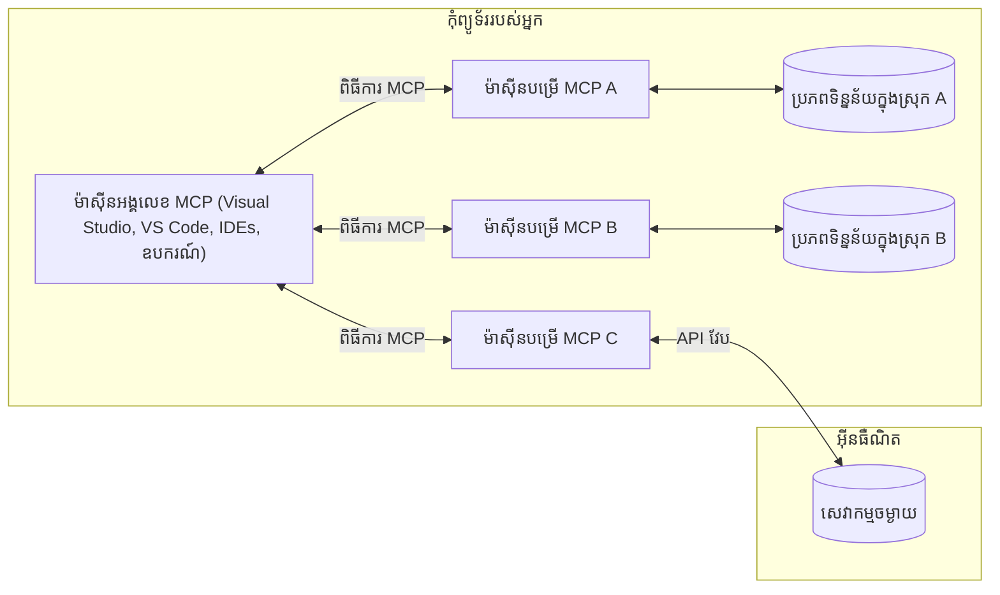

# គំនិត​គោល​នៃ MCP: ការជំនាញអំពីសេវាកម្ម Model Context Protocol សម្រាប់ការរួមបញ្ចូល AI

[](https://youtu.be/earDzWGtE84)

_(ចុចរូបភាពខាងលើដើម្បីមើលវីដេអូរបស់មេរៀននេះ)_

[Model Context Protocol (MCP)](https://github.com/modelcontextprotocol) គឺជាស៊្រទោលការងារដែលមានកម្លាំង និងស្តង់ដារដែលធ្វើឲ្យប្រសើរឡើងនូវការប្រាស្រ័យទាក់ទងរវាងម៉ូដែលភាសាធំៗ (LLMs) និងឧបករណ៍ក្រៅពី មូលដ្ឋានទិន្នន័យ និងកម្មវិធីផ្សេងៗ។ 
មេរៀននេះនឹងណែនាំអ្នកឲ្យស្គាល់គំនិតគោលនៃ MCP។ អ្នកនឹងរៀនអំពីសំណង់គ្លាយិន-clients-server របស់វា, រចនាសម្ព័ន្ធចម្បង, វិធីសាស្រ្ដប្រាស្រ័យទាក់ទង និងអនុវត្តន៍ល្អបំផុត។

- **ការយល់ព្រមខ្លួនឯងយ៉ាងច្បាស់ពីអ្នកប្រើ**: ការចូលប្រើទិន្នន័យ និងប្រតិបត្តិការ គ្មានអនុញ្ញាតឲ្យធ្វើមុនមានការយល់ព្រមច្បាស់ពីអ្នកប្រើ។ អ្នកប្រើត្រូវយល់ច្បាស់ថាទិន្នន័យអ្វីត្រូវចូលប្រើ និងសកម្មភាពអ្វីនឹងត្រូវអនុវត្តដោយមានការគ្រប់គ្រងលំអិតលើសិទ្ធិ និងការអនុញ្ញាត។

- **ការការពារមPrivacyទិន្នន័យ**: ទិន្នន័យអ្នកប្រើត្រូវបានបង្ហាញតែមានការយល់ព្រមច្បាស់ និងត្រូវបានការពារដោយការគ្រប់គ្រងការចូលប្រើដែលរឹងមាំគ្រប់ដំណាក់កាលនៃប្រតិបត្តិការនេះ។ ការអនុវត្តត្រូវទប់ស្កាត់ការផ្ទេរទិន្នន័យដែលមិនមានសិទ្ធិ និងរក្សារមានដែនកំណត់ប្រកបដោយភាពឯកជនយ៉ាងតឹងរ៉ឹង។

- **សុវត្ថិភាពក្នុងការអនុវត្តឧបករណ៍**: ការហៅប្រើឧបករណ៍ទាំងអស់ត្រូវការការយល់ព្រមយ៉ាងច្បាស់ពីអ្នកប្រើជាមួយនឹងការយល់ដឹងច្បាស់ពីមុខងារ, ប៉ារ៉ាម៉ែត្រ និងផលប៉ះពាល់ដែលអាចមាន។ ដែនកំណត់សុវត្ថិភាពរឹងមាំត្រូវទប់ស្កាត់ការអនុវត្តឧបករណ៍ដែលមិនមានសុវត្ថិភាព ឬបំណងអាក្រក់។

- **សុវត្ថិភាពស្រទាប់ការផ្ទេរ**: រង្វាស់ប្រាស្រ័យទាក់ទងទាំងអស់គួរត្រូវបានប្រើវិធីសាស្រ្ដការអ៊ិនគ្រីប និងផ្ទៀងផ្ទាត់សម្គាល់ត្រឹមត្រូវ។ ការតភ្ជាប់ចម្ងាយត្រូវអនុវត្តបិទនៅលើសាលាសុវត្ថិភាព និងគ្រប់គ្រងសិទ្ធិបានត្រឹមត្រូវ។

#### យោងតាមការអនុវត្ត៖

- **ការគ្រប់គ្រងសិទ្ធិ**: អនុវត្តប្រព័ន្ធការគ្រប់គ្រងសិទ្ធិលម្អិតដែលអនុញ្ញាតឲ្យអ្នកប្រើគ្រប់គ្រងថាតើម៉ាស៊ីនមេ ឧបករណ៍ និងធនធានណាអាចចូលប្រើបាន
- **ការផ្ទៀងផ្ទាត់ និងការអនុញ្ញាត**: ប្រើវិធីសាស្រ្តផ្ទៀងផ្ទាត់សុវត្ថិភាព (OAuth, សោ API) ជាមួយការគ្រប់គ្រងស្លាកសញ្ញា និងកំណត់អស់សម័យត្រឹមត្រូវ  
- **ការផ្ទៀងផ្ទាត់អិនភុយ**: ផ្ទៀងផ្ទាត់ប៉ារ៉ាម៉ែត្រ និងទិន្នន័យបញ្ចូលទាំងអស់អាស្រ័យលើប្លង់ដែលកំណត់ដើម្បីទប់ស្កាត់ការវាយប្រហារ injection
- **ការចុះបញ្ជីត្រួតពិនិត្យ**: រក្សាទុកកំណត់ហេតុរួមទាំងអស់សម្រាប់ត្រួតពិនិត្យសុវត្ថិភាព និងការប្រកាន់ខ្ជាប់ច្បាប់

## ទិដ្ឋភាពទូទៅ

មេរៀននេះស្វែងយល់អំពីសំណង់គ្លាយុតចម្បង និងធាតុរចនាសម្ព័ន្ធមួយចំនួនដែលបង្កើតឡើង Model Context Protocol (MCP) ។ អ្នកនឹងរៀនអំពីសំណង់គ្លាយិន-clients-server, ធាតុសំខាន់ៗ និងវិធីសាស្រ្ដប្រាស្រ័យទាក់ទងដែលជាមូលដ្ឋាននៃការប្រាស្រ័យទាក់ទង MCP ។

## គោលដៅសំខាន់នៃការរៀន

នៅចុងបញ្ចប់នៃមេរៀននេះ អ្នកនឹង៖

- យល់ដឹងអំពីសំណង់គ្លាយិន-clients-server របស់ MCP។
- កំណត់តួនាទី និងការទទួលខុសត្រូវរបស់ Hosts, Clients, និង Servers។
- វិភាគលក្ខណៈសំខាន់ៗដែលធ្វើឲ្យ MCP ជាស្រទាប់រួមបញ្ចូលបត់បែន។
- រៀនពីវិធីរាល់ព័ត៌មានហែលឆ្លងក្នុងប្រព័ន្ធ MCP។
- ទទួលបានចំណេះដឹងផ្ទាល់ខ្លួនតាមរយៈឧទាហរណ៍កូដនៅ .NET, Java, Python និង JavaScript ។

## សំណង់គ្លាយ MCP: មើលជម្រៅទ្វេសំរាប់អ្នក

ប្រព័ន្ធ MCP ត្រូវបានបង្កើតលើគំរូ client-server។ រចនាសម្ព័ន្ធចែកចាយនេះអនុញ្ញាតឱ្យកម្មវិធី AI ទាក់ទងជាមួយឧបករណ៍, មូលដ្ឋានទិន្នន័យ, API និងធនធានបរិបទប្រកបដោយប្រសិទ្ធភាព។ មកមើលសំណង់នេះជាដំណាក់ទាំងវាំងទៅធាតុចម្បងរបស់វា។

នៅចំ​កណ្តាល ប្រព័ន្ធ MCP អនុវត្តសំណង់ client-server ដែលកម្មវិធី host អាចភ្ជាប់ទៅម៉ាស៊ីនមេជាច្រើនបាន៖


- **MCP Hosts**: កម្មវិធីដូចជា VSCode, Claude Desktop, IDEs ឬឧបករណ៍ AI ដែលចង់ចូលប្រើទិន្នន័យតាមរយៈ MCP
- **MCP Clients**: អតិថិជន protocol ដែលថែរក្សាការតភ្ជាប់ 1:1 ជាមួយម៉ាស៊ីនមេ
- **MCP Servers**: កម្មវិធីដែលមានទំងន់ស្រាល ដែលបង្ហាញមុខងារពិសេសតាម Model Context Protocol ស្តង់ដា
- **មូលដ្ឋានទិន្នន័យក្នុងមូលដ្ឋាន**: ឯកសារ, មូលដ្ឋានទិន្នន័យ និងសេវាកម្មលើកុំព្យូទ័ររបស់អ្នកដែលម៉ាស៊ីនមេ MCP អាចចូលប្រើបានយ៉ាងសុវត្ថិភាព
- **សេវាកម្មពីចម្ងាយ**: ប្រព័ន្ធក្រៅដែលមានក្នុងអ៊ីនធឺណិតដែលម៉ាស៊ីនមេ MCP អាចភ្ជាប់តាម API។

ប្រព័ន្ធ MCP ត្រូវបានអភិវឌ្ឍជាស្តង់ដារដែលអនុវត្តន៍ដោយកំណែដោយកាលបរិច្ឆេទ (ទ្រង់ទ្រាយ YYYY-MM-DD)។ កំណែប្រព័ន្ធបច្ចុប្បន្នគឺ **2025-11-25**។ អ្នកអាចមើលអាប់ដេតចុងក្រោយទៅ [លក្ខណៈពិសេស protocol](https://modelcontextprotocol.io/specification/2025-11-25/)

### 1. Hosts

នៅក្នុង Model Context Protocol (MCP), **Hosts** គឺជាកម្មវិធី AI ដែលមានមុខងារជាច្រកចូលដំណើរការ ដែលអ្នកប្រើប្រាស់ប្រើប្រាស់ប្រាស្រ័យដោយប្រព័ន្ធនេះ។ Hosts ត្រូវទទួលខុសត្រូវដំណើរការនិងគ្រប់គ្រងការតភ្ជាប់ទៅម៉ាស៊ីនមេទាំងពីរពីរជាមួយ MCP clients ផ្តាច់មុខសម្រាប់ការតភ្ជាប់ម៉ាស៊ីនមេទាំងឡាយ។ ឧទាហរណ៍ Hosts មានដូចជា៖

- **កម្មវិធី AI**: Claude Desktop, Visual Studio Code, Claude Code
- **បរិយាកាសអភិវឌ្ឍ**: IDEs និងកម្មវិធីកែសម្រួលកូដដែលមានការរួមបញ្ចូល MCP  
- **កម្មវិធីផ្ទាល់ខ្លួន**: តួអង្គ AI និងឧបករណ៍ដែលបានបង្កើតផ្ទាល់ខ្លួន

**Hosts** គឺជាកម្មវិធីដែលវាស់វែងប្រតិបត្តិការម៉ូដែល AI។ ពួកវា៖

- **រៀបចំបន្ទាត់ AI Models**: ធ្វើឬទាក់ទងជាមួយ LLMs ដើម្បីបង្កើតការឆ្លើយតប ហើយគ្រប់គ្រងដំណើរការអនុវត្ត AI
- **គ្រប់គ្រងការតភ្ជាប់ Clients**: បង្កើត និងថែរក្សាតែមួយ MCP client គ្រប់ការតភ្ជាប់ម៉ាស៊ីនមេ MCP មួយៗ
- **គ្រប់គ្រងផ្ទៃមុខអ្នកប្រើ**: គ្រប់គ្រងផ្លូវហៅជជែក ប្រតិកម្មអ្នកប្រើ និងការបង្ហាញចម្លើយ  
- **អនុវត្តសុវត្ថិភាព**: គ្រប់គ្រងសិទ្ធិ ការរឹតបន្តឹងសុវត្ថិភាព និងការផ្ទៀងផ្ទាត់
- **គ្រប់គ្រងការយល់ព្រមពីអ្នកប្រើ**: គ្រប់គ្រងការយល់ព្រមរបស់អ្នកប្រើសម្រាប់ការចែករំលែកទិន្នន័យ និងការអនុវត្តឧបករណ៍


### 2. Clients

**Clients** ជាធាតុចម្បងដែលថែរក្សាការតភ្ជាប់មួយទៅមួយដោយអនុញ្ញាតឲ្យ Hosts ចូលប្រើម៉ាស៊ីនមេ MCP បានយ៉ាងរបៀបរៀបចំ និងសុវត្ថិភាព។ MCP client ខ្លួនមួយ ត្រូវបានបង្កើតឡើងដោយ Host ដើម្បីភ្ជាប់ទៅម៉ាស៊ីនមេ MCP មួយជាក់លាក់នោះ ជាតម្រូវការឲ្យមានការប្រាស្រ័យទាក់ទងដែលហាមឃាត់ការលំអៀង។ ការមានច្រើន clients អនុញ្ញាតឲ្យ Hosts ភ្ជាប់ទៅម៉ាស៊ីនមេជាច្រើនក្នុងពេលតែមួយ។

**Clients** ជាធាតុភ្ជាប់នៅក្នុងកម្មវិធី host។ ពួកវា៖

- **ការប្រាស្រ័យទាក់ទង Protocol**: ផ្ញើសំណើ JSON-RPC 2.0 ទៅម៉ាស៊ីនមេជាមួយបណ្ដាលនិងសេចក្ដីណែនាំ
- **ការចរចាលក្ខណៈ**: ចរចាលក្ខណៈគាំទ្រ និងកំណែ protocol ជាមួយម៉ាស៊ីនមេនៅពេលចាប់ផ្ដើម
- **ការអនុវត្តឧបករណ៍**: គ្រប់គ្រងសំណើហៅឧបករណ៍ពីម៉ូដែល និងដំណើរការឆ្លើយតប
- **ការអាប់ដេតពេលវេលាពិតប្រាកដ**: គ្រប់គ្រងការជូនដំណឹង និងបច្ចុប្បន្នភាពពេលវេលាពិតប្រាកដពីម៉ាស៊ីនមេ
- **ដំណើរការឆ្លើយតប**: ដំណើរការនិងទ្រង់ទ្រាយចម្លើយពីម៉ាស៊ីនមេសម្រាប់បង្ហាញទៅអ្នកប្រើ

### 3. Servers

**Servers** គឺជាកម្មវិធីដែលផ្តល់បរិបទ, ឧបករណ៍, និងមុខងារដល់ MCP clients។ វាអាចអនុវត្តនៅលើកុំព្យូទ័រផ្ទាល់ (ដូចជាគណនីតែមួយជាមួយ Host) ឬឆ្ងាយ (លើវេទិកាផ្ទាល់ខាងក្រៅ)។ ពួកវាទទួលបានសំណើពី clients និងផ្តល់ចម្លើយដែលមានរចនាសម្ព័ន្ធត្រឹមត្រូវ។ Servers បង្ហាញមុខងារពិសេសតាមរយៈ Model Context Protocol ស្តង់ដា។

**Servers** ជាសេវាកម្មដែលផ្តល់បរិបទ និងមុខងារ។ ពួកវា៖

- **ចុះបញ្ជីមុខងារ**: ចុះបញ្ជី និងបង្ហាញ primitives ដែលមាន (ធនធាន, បណ្ដាល, ឧបករណ៍) ទៅ clients
- **ដំណើរការសំណើរ**: ទទួល និងអនុវត្តន៍ហៅឧបករណ៍, សំណើធនធាន និងសំណើបណ្ដាលពី clients
- **ផ្តល់បរិបទ**: ផ្តល់ព័ត៌មានបរិបទ និងទិន្នន័យដើម្បីបង្កើនការឆ្លើយតបរបស់ម៉ូដែល
- **គ្រប់គ្រងស្ថានភាព**: រក្សាស្ថានភាពសម័យ និងដោះសោដំណើរការស្ថានភាពបើចាំបាច់
- **ជូនដំណឹងពេលវេលាពិតប្រាកដ**: ផ្ញើជូនដំណឹងអំពីការផ្លាស់ប្តូរមុខងារ និងការអាប់ដេតទៅ clients ដែលភ្ជាប់

Servers អាចបានអភិវឌ្ឍដោយគ្រប់គ្នា ដើម្បីពង្រឹងមុខងារម៉ូដែលជាមួយមុខងារពិសេស ហើយគាំទ្របរិបទធ្វើការ និងចំណុះចម្ងាយទាំងពីរ។

### 4. Server Primitives

Servers នៅក្នុង Model Context Protocol (MCP) ផ្តល់ primitives ចម្បងបីប្រភេទ ដែលកំណត់គ្រឹះដីសម្រាប់ការប្រាស្រ័យល្អបៀបរវាង clients, hosts, និងម៉ូដែលភាសា។ Primitives ទាំងនេះកំណត់ប្រភេទព័ត៌មានបរិបទ និងសកម្មភាពដែលមាននៅតាមរយៈ protocol។

ម៉ាស៊ីនមេ MCP អាចបង្ហាញផលបញ្ចូលផ្សំពី primitives ចម្បងបីខាងក្រោម៖

#### Resources 

**ធនធាន** គឺជាមូលដ្ឋានទិន្នន័យ ដែលផ្តល់ព័ត៌មានបរិបទទៅកម្មវិធី AI។ ពួកវាតំណាងឱ្យមាតិកាឈរឬចល័តដែលអាចបង្កើនការយល់ដឹង និងការសម្រេចចិត្តរបស់ម៉ូដែល៖

- **ទិន្នន័យបរិបទ**: ព័ត៌មានរចនាសម្ព័ន្ធ និងបរិបទសម្រាប់ការប្រើប្រាស់ម៉ូដែល AI
- **មូលដ្ឋានចំណេះដឹង**: ឯកសាររាយនាម អត្ថបទ សៀវភៅណែនាំ និងស្រាវជ្រាវ
- **មូលដ្ឋានទិន្នន័យក្នុងមូលដ្ឋាន**: ឯកសារ មូលដ្ឋានទិន្នន័យ និងព័ត៌មានប្រព័ន្ធក្នុងមូលដ្ឋាន  
- **ទិន្នន័យក្រៅប្រព័ន្ធ**: ចម្លើយ API សេវាកម្មវែប និងទិន្នន័យប្រព័ន្ធចម្ងាយ
- **មាតិកាអាចផ្លាស់ប្តូរ**: ទិន្នន័យពេលវេលាពិតប្រាកដដែលបញ្ជាប្រកបដោយលក្ខខណ្ឌក្រៅបរទេស

ធនធានត្រូវកំណត់ដោយ URI ហើយគាំទ្រការស្វែងរកតាមរយៈ `resources/list` និងការទាញយកតាមរយៈ `resources/read`:

```text
file://documents/project-spec.md
database://production/users/schema
api://weather/current
```

#### Prompts

**បណ្ដាល** គឺជាការរចនាទិដ្ឋភាពអាចប្រើឡើងវិញដែលជួយរៀបចំការប្រាស្រ័យជាមួយម៉ូដែលភាសា។ ពួកវាបង្ហាញលំនាំសកម្មភាពត្រឹមត្រូវ និងលំនាំដំណើរការដែលបានបង្កើតជាម៉ូដែល៖

- **ការប្រាស្រ័យដើមគំរូ**: សារដែលបានរៀបចំជាមុន និងការចាប់ផ្តើមជជែក
- **លំនាំដំណើរការងារ**: ជួរតួដែលបានស្តង់ដារសម្រាប់ការងារធម្មតា និងការប្រាស្រ័យ
- **ឧទាហរណ៍ Few-shot**: លំនាំក្នុងបែបឧទាហរណ៍សម្រាប់ការបញ្ជាក់ម៉ូដែល
- **បណ្ដាលប្រព័ន្ធ**: បណ្ដាលមូលដ្ឋានដែលកំណត់ឥរិយាបថ និងបរិបទម៉ូដែល
- **បណ្ដាលអាចបត់បែន**: បណ្ដាលដែលពិសោធន៍ប៉ារ៉ាម៉ែត្រ និងអាចបត់បែនទៅបរិបទជាក់លាក់

បណ្ដាលគាំទ្រការជំនួសអថេរ ហើយអាចស្វែងរកតាម `prompts/list` និងទាញយកតាម `prompts/get`:

```markdown
Generate a {{task_type}} for {{product}} targeting {{audience}} with the following requirements: {{requirements}}
```

#### Tools

**ឧបករណ៍** គឺជាអនុគមន៍អាចអនុវត្តដែលម៉ូដែល AI អាចហៅដើម្បីអនុវត្តសកម្មភាពជាក់លាក់។ ពួកវាតំណាងឲ្យ "គ្រឹះស័ក្តី" នៃប្រព័ន្ធ MCP ដែលអនុញ្ញាតឲ្យម៉ូដែលប្រតិបត្តិការលើប្រព័ន្ធក្រៅ៖

- **អនុគមន៍អាចអនុវត្ត**: ប្រតិបត្តិការតូចៗដែលម៉ូដែលអាចហៅជាមួយប៉ារ៉ាម៉ែត្រពិសេស
- **ការរួមបញ្ចូលប្រព័ន្ធក្រៅ**: ហៅ API, ស្វែងរកមូលដ្ឋានទិន្នន័យ, ប្រតិបត្តិការឯកសារ, គណនា
- **អត្តសញ្ញាណដ៏ពិសេស**: ឧបករណ៍គ្រប់មួយមានឈ្មោះ, ពិពណ៌នា និងប្លង់ប៉ារ៉ាម៉ែត្រដែលខុសគ្នា
- **បញ្ចូលចេញរចនាសម្ព័ន្ធ**: ឧបករណ៍ទទួលប៉ារ៉ាម៉ែត្រដែលបានផ្ទៀងផ្ទាត់ និងបង្ហាញចម្លើយដ៏រចនាសម្ព័ន្ធ
- **មុខងារសកម្មភាព**: អនុញ្ញាតម៉ូដែលអនុវត្តសកម្មភាពពិតប្រាកដ និងទាញយកទិន្នន័យបច្ចុប្បន្ន

ឧបករណ៍ត្រូវបានកំណត់ជាមួយ JSON Schema សម្រាប់ការផ្ទៀងផ្ទាត់ប៉ារ៉ាម៉ែត្រ និងស្វែងរកតាម `tools/list` ហើយអាចអនុវត្តតាម `tools/call`។ ឧបករណ៍ក៏អាចមាន **រូបតំណាង** ជាប្រភេទមេតាដាតាពិសេសសម្រាប់ការបង្ហាញ UI ល្អប្រសើរជាងមុន។

**ការបញ្ជាក់បែបធម្មតា**: ឧបករណ៍គាំទ្រការបញ្ជាក់អាកប្បបរមា (ដូចជា `readOnlyHint`, `destructiveHint`) ដែលពន្យល់ថា ឧបករណ៍មួយមានលក្ខណៈអានតែម្ដង ឬមានលក្ខណៈបំផ្លាញ ដើម្បីជួយ clients ធ្វើការសម្រេចចិត្តយ៉ាងត្រឹមត្រូវអំពីការអនុវត្តឧបករណ៍។

ឧទាហរណ៍នៃការកំណត់ឧបករណ៍៖

```typescript
server.tool(
  "search_products", 
  {
    query: z.string().describe("Search query for products"),
    category: z.string().optional().describe("Product category filter"),
    max_results: z.number().default(10).describe("Maximum results to return")
  }, 
  async (params) => {
    // បំពេញការស្វែងរក និងបញ្ជូនលទ្ធផលដែលមានរចនាសម្ព័ន្ធ
    return await productService.search(params);
  }
);
```

## Client Primitives

នៅក្នុង Model Context Protocol (MCP), **clients** អាចបង្ហាញ primitives ដែលអនុញ្ញាតឲ្យម៉ាស៊ីនមេស្នើសុំមុខងារបន្ថែមពីកម្មវិធី host ។ ពួក primitives ផ្ទាល់ខ្លួនទាំងនេះអនុញ្ញាតឲ្យមានការវិនិយោគម៉ាស៊ីនមេដែលមានភាពសំបូរបែប និងអាចចូលដល់មុខងារ AI និងប្រតិកម្មអ្នកប្រើ។

### Sampling

**Sampling** អនុញ្ញាតឲ្យម៉ាស៊ីនមេស្នើសុំការបញ្ចប់ម៉ូដែលភាសាពីកម្មវិធី AI របស់ client។ Primitive នេះអនុញ្ញាតម៉ាស៊ីនមេចូលដល់សមត្ថភាព LLM ដោយគ្មានតម្រូវឲ្យបញ្ចូល SDK ម៉ូដែលផ្ទាល់គេ៖

- **ចូលរួមដោយមិនពឹងផ្អែកលើម៉ូដែល**: ម៉ាស៊ីនមេអាចស្នើសុំការបញ្ចប់ដោយគ្មានការបញ្ចូល LLM SDK ឬគ្រប់គ្រងការចូលម៉ូដែល
- **AI បានចាប់ផ្ដើមដោយម៉ាស៊ីនមេ**: អនុញ្ញាតម៉ាស៊ីនមេបង្កើតមាតិកាដោយឯករាជ្យជាមួយម៉ូដែល AI របស់ client
- **បញ្ហាសំរាប់ប្រើ LLM ជាដំណាក់កាល**: គាំទ្រករណីស្មុគស្មាញដែលម៉ាស៊ីនមេត្រូវការជំនួយ AI សម្រាប់ដំណើរការ
- **បង្កើតមាតិកាបរិបទ**: អនុញ្ញាតម៉ាស៊ីនមេបង្កើតចម្លើយបរិបទដោយប្រើម៉ូដែលរបស់ host
- **គាំទ្រការហៅឧបករណ៍**: ម៉ាស៊ីនមេអាចរួមបញ្ចូលប៉ារ៉ាម៉ែត្រប្រភេទ `tools` និង `toolChoice` ដើម្បីអនុញ្ញាតម៉ូដែល client ហៅឧបករណ៍នៅក្នុងដំណើរការ sampling

Sampling ត្រូវបានចាប់ផ្ដើមតាមវិធីសាស្រ្ត `sampling/complete` ដែលម៉ាស៊ីនមេស្នើសុំការបញ្ចប់ទៅ clients ។

### Roots

**Roots** ផ្តល់វិធីស្តង់ដារមួយសម្រាប់ clients ដើម្បីបង្ហាញដែនកំណត់ប្រព័ន្ធ​ឯកសារ ទៅម៉ាស៊ីនមេ ជួយម៉ាស៊ីនមេយល់ថាតើថតឯកសារ និងឯកសារណាដែលពួកគេអាចចូលប្រើបាន៖

- **ដែនកំណត់ប្រព័ន្ធឯកសារ**: កំណត់ដែនកំណត់នៅកន្លែងដែលម៉ាស៊ីនមេអាចដំណើរការនៅក្នុងប្រព័ន្ធ​ឯកសារ
- **ការគ្រប់គ្រងការចូលប្រើ**: ជួយម៉ាស៊ីនមេយល់ថាតើថតឯកសារ និងឯកសារណាដែលមានសិទ្ធិចូលបាន
- **ការអាប់ដេតដំណើរការផ្លាស់ប្តូរ**: Clients អាចជូនដំណឹងម៉ាស៊ីនមេពេលបញ្ជី roots ផ្លាស់ប្តូរ
- **ការ​កំណត់​នៅលើ URI**: Roots ប្រើ URI `file://` ដើម្បីកំណត់ថតឯកសារ និងឯកសារដែលអាចចូលបាន

Roots ត្រូវបានស្វែងរកតាមរយៈវិធីសាស្រ្ត `roots/list` នៅពេលដែល roots ផ្លាស់ប្តូរ clients ផ្ញើ `notifications/roots/list_changed` ទៅម៉ាស៊ីនមេ។

### Elicitation  

**Elicitation** អនុញ្ញាតឲ្យម៉ាស៊ីនមេស្នើសុំព័ត៌មានបន្ថែម ឬការបញ្ជាក់ពីអ្នកប្រើតាមរយៈផ្ទៃមុខ client៖

- **សំណើកំណត់បញ្ចូលអ្នកប្រើ**: ម៉ាស៊ីនមេអាចស្នើសុំព័ត៌មានបន្ថែមនៅពេលចាំបាច់សម្រាប់ការអនុវត្តឧបករណ៍
- **ប្រអប់បញ្ជាក់**: ស្នើសុំការយល់ព្រមពីអ្នកប្រើសម្រាប់ប្រតិបត្ដិការមានកម្រិតជាក់លាក់ ឬមានផលប៉ះពាល់
- **ដំណើរការរៀបចំឆ្លើយតប**: អនុញ្ញាតម៉ាស៊ីនមែតបង្កើតដំណើរប្រតិកម្មអ្នកប្រើជាជំហានៗ
- **ការប្រមូលប៉ារ៉ាម៉ែត្រផ្លាស់ប្តូរ**: ប្រមូលប៉ារ៉ាម៉ែត្រដែលអវរមានឬបង្កើតពេលអនុវត្តឧបករណ៍

សំណើ elicitation ត្រូវផ្ញើតាមវិធីសាស្រ្ត `elicitation/request` ដើម្បីប្រមូលបញ្ចូលអ្នកប្រើតាមរយៈផ្ទៃមុខ client ។

**របៀប URL សម្រាប់ Elicitation**: ម៉ាស៊ីនមេក៏អាចស្នើសុំប្រតិកម្មអ្នកប្រើតាមរយៈ URL ដែលអនុញ្ញាតឲ្យម៉ាស៊ីនមេលៃតម្រូវឲ្យអ្នកប្រើចូលទៅគេហទំព័រខាងក្រៅសម្រាប់ការផ្ទៀងផ្ទាត់, ការបញ្ជាក់ ឬការបញ្ចូលទិន្នន័យ។

### Logging

**Logging** អនុញ្ញាតម៉ាស៊ីនមេទាញយកសារកំណត់ហេតុដែលមានរចនាសម្ព័ន្ធទៅ clients សម្រាប់ការដោះស្រាយបញ្ហា, ត្រួតពិនិត្យ ព្រមទាំងការមើលឃើញប្រតិបត្តិការ៖

- **គាំទ្រការដោះស្រាយបញ្ហា**: អនុញ្ញាតម៉ាស៊ីនមេផ្តល់កំណត់ហេតុភាពអនុវត្តលម្អិតសម្រាប់ដោះស្រាយបញ្ហា
- **ត្រួតពិនិត្យប្រតិបត្តិការ**: ផ្ញើការបច្ចុប្បន្នភាពស្ថានភាពនិងមាតិកាប្រតិបត្តិតទៅ clients
- **រាយការណ៍កំហុស**: ផ្តល់ពិពណ៌ការកំហុសលម្អិត និងព័ត៌មានវាយតម្លៃវិសោធនកម្ម
- **ផ្លូវតាម Audit**: បង្កើតកំណត់ហេតុផ្សព្វផ្សាយពីប្រតិបត្តិការម៉ាស៊ីនមេទាំងមូល និងសេចក្ដីសម្រេច

សារកំណត់ហេតុនេះត្រូវផ្ញើទៅ clients ដើម្បីផ្តល់ភាពច្បាស់លាស់អំពីប្រតិបត្តិការម៉ាស៊ីនមេ និងជួយដោះស្រាយបញ្ហា។

## ដំណើរការព័ត៌មានក្នុង MCP

Model Context Protocol (MCP) កំណត់រចនាសម្ព័ន្ធដំណើរការព័ត៌មានក្នុងចន្លោះ hosts, clients, servers, និងម៉ូដែល។ ការយល់ដឹងអំពីដំណើរការនេះជួយបំភ្លឺពីរបៀបដែលសំណើរអ្នកប្រើត្រូវដំណើរការ និងរបៀបដែលឧបករណ៍ក្រៅ និងទិន្នន័យផ្សេងៗ ត្រូវបាន​រួមបញ្ចូលទៅក្នុងចម្លើយម៉ូដែល។
- **ម៉ាស៊ីនបម្រើចាប់ផ្តើមការតភ្ជាប់**  
  ពាក្យកម្មម៉ាស៊ីនបម្រើ (ដូចជា IDE ឬផ្ទាំងសម្ភាសន៍) បង្កើតការតភ្ជាប់ទៅម៉ាស៊ីនបម្រើ MCP ដែលទូទៅធ្វើតាម STDIO, WebSocket ឬការដឹកជញ្ជូនផ្សេងទៀតដែលគាំទ្រ។

- **ការចរចាសមត្ថភាព**  
  ពាណិជ្ជកម្ម (ដែលបញ្ចូលក្នុងម៉ាស៊ីនបម្រើ) និងម៉ាស៊ីនបម្រើប្តូរព័ត៌មានអំពីលក្ខណៈសម្បត្តិ ដែលជំនួយ បំពង់ប្រឹក្សា និងកំណែផ្នែកពិធីការ។ នេះធ្វើឲ្យទាំងពីរគ្នាបញ្ជាក់បានពីសមត្ថភាពដែលអាចប្រើបានសម្រាប់វគ្គសិក្សា។

- **សំណើរមនុស្សប្រើប្រាស់**  
  មនុស្សប្រើប្រាស់ធ្វើប្រតិបត្តិការជាមួយម៉ាស៊ីនបម្រើ (ឧទាហរណ៍ បញ្ចូលការបញ្ជា ឬបញ្ចូលសំណើ)។ ម៉ាស៊ីនបម្រើប្រមូលព័ត៌មាននេះ ហើយផ្ញើទៅពាណិជ្ជកម្មសម្រាប់ដំណើរការ។

- **ការប្រើប្រាស់ធនធាន ឬឧបករណ៍**  
  - ពាណិជ្ជកម្មអាចស្នើសុំបរិបទផ្សេងទៀត ឬធនធានពីម៉ាស៊ីនបម្រើ (ដូចជា ឯកសារ បញ្ជីទិន្នន័យ ឬអត្ថបទមូលដ្ឋានចំណេះដឹង) ដើម្បីពង្រីកការយល់ដឹងរបស់ម៉ូដែល។
  - ប្រសិនបើម៉ូដែលកំណត់ថាត្រូវការឧបករណ៍ (ឧទាហរណ៍ ដើម្បីយកទិន្នន័យ គណនា ឬហៅ API) ពាណិជ្ជកម្មផ្ញើសំណើហៅឧបករណ៍ទៅម៉ាស៊ីនបម្រើ ដោយបញ្ជាក់ឈ្មោះឧបករណ៍ និងប៉ារ៉ាម៉ែត្រ។

- **ការប្រតិបត្តិរបស់ម៉ាស៊ីនបម្រុះ**  
  ម៉ាស៊ីនបម្រើទទួលសំណើធនធានឬឧបករណ៍ ប្រតិបត្តិការoperation(s)ចាំបាច់ (ដូចជា រត់មុខងារ ស្វែងរកទិន្នន័យ ឬយកឯកសារ) ហើយផ្ញើលទ្ធផលវិញទៅពាណិជ្ជកម្មជាម៉ូដដំណាង។

- **ការបង្កើតចម្លើយ**  
  ពាណិជ្ជកម្មបញ្ចូលចម្លើយពីម៉ាស៊ីនបម្រើ (ទិន្នន័យធនធាន ផលិតផលឧបករណ៍ ល។

ម៉ូដែលប្រើព័ត៌មាននេះ ដើម្បីបង្កើតចម្លើយលម្អិត និងសមហត្ថភាព។

- **ការត្រូវបង្ហាញលទ្ធផល**  
  ម៉ាស៊ីនបម្រើទទួលចេញពីពាណិជ្ជកម្ម និងបង្ហាញទៅអ្នកប្រើប្រាស់ ដែលសព្វថ្ងៃរួមមានអត្ថបទដែលម៉ូដែលបង្កើត និងលទ្ធផលពីការប្រតិបត្តិឧបករណ៍ ឬស្វែងរកធនធាន។

ចលាចល​នេះអនុញ្ញាតឲ្យ MCP គាំទ្រកម្មវិធី AI ដែលមានអន្តរកម្មខ្ពស់ និងមានការយល់ដឹងពីបរិបទ ដោយភ្ជាប់ម៉ូដែលជាមួយឧបករណ៍ និងប្រភពទិន្នន័យខាងក្រៅយ៉ាងរលូន។

## រចនាសម្ព័ន្ធនិងស្រទាប់ពិធីការ

MCP មានរចនាសម្ព័ន្ធពីរ ស្របគ្នាសម្រាប់ផ្តល់វិថីការទំនាក់ទំនងពេញលេញ៖

### ស្រទាប់ទិន្នន័យ

**ស្រទាប់ទិន្នន័យ** អនុវត្តពីមូលដ្ឋាន MCP ដោយប្រើ **JSON-RPC 2.0** ជាគោលដៅ។ ស្រទាប់នេះកំណត់រចនាសម្ព័ន្ធសារជា សេនៃម៉ាស្សា និងលំនាញអន្តរកម្ម៖

#### ធាតុគោល:

- **ពិធីការរបៀប JSON-RPC 2.0**៖ ទំនាក់ទំនងទាំងអស់ប្រើទ្រង់ទ្រាយសារតាម JSON-RPC 2.0 សម្រាប់ហៅវិធី សូម និងជូនដំណឹង
- **ការគ្រប់គ្រងជីវិតវគ្គ**៖ គ្រប់គ្រងការចាប់ផ្តើមតភ្ជាប់ ចរចាសមត្ថភាព និងបញ្ចប់វគ្គរវាងពាណិជ្ជកម្ម និងម៉ាស៊ីនបម្រើ
- **មុខងារមូលដ្ឋានម៉ាស៊ីនបម្រើ**៖ អនុញ្ញាតម៉ាស៊ីនបម្រើផ្តល់មុខងារមូលដ្ឋានតាមឧបករណ៍ ធនធាន និងសំណើ
- **មុខងារមូលដ្ឋានពាណិជ្ជកម្ម**៖ អនុញ្ញាតម៉ាស៊ីនបម្រើស្នើការបង្ហាញពី LLMs សុំការបញ្ចូលពីអ្នកប្រើ និងផ្ញើសារកំណត់ហេតុ
- **ជូនដំណឹងពេលវេលាពិត**៖ គាំទ្រជូនដំណឹងអាស៊ីនគ្រាដើម្បីធ្វើបច្ចុប្បន្នភាពដោយមិនចាំបាច់ស្ទង់មើល

#### លក្ខណៈសំខាន់:

- **ចរចាកំណែពិធីការ**៖ ប្រើកំណែផ្អែកលើកាលបរិច្ឆេទ (YYYY-MM-DD) ដើម្បីធានាការចងក្រងគ្នា
- **រកឃើញសមត្ថភាព**៖ ពាណិជ្ជកម្ម និងម៉ាស៊ីនបម្រើប្តូរព័ត៌មានលក្ខណៈជាមួយគ្នា ក្រោមការចាប់ផ្តើម
- **វគ្គមានស្ថានភាព**៖ រក្សាស្ថានភាពតភ្ជាប់រវាងអន្តរកម្មជាច្រើន សម្រាប់ភាពបន្តបន្ទាប់នៃបរិបទ

### ស្រទាប់ដឹកជញ្ជូន

**ស្រទាប់ដឹកជញ្ជូន** គ្រប់គ្រងបណ្តាញទំនាក់ទំនង ការវេចខ្ចប់សារ និងការផ្ទៀងផ្ទាត់រវាងចូលរួម MCP៖

#### របៀបដឹកជញ្ជូនដែលគាំទ្រ:

1. **ដឹកជញ្ជូន STDIO**:  
   - ប្រើចូល/ចេញស្តង់ដាសម្រាប់ទំនាក់ទំនងដំណើរការផ្ទាល់  
   - ល្អក្រាស់សម្រាប់ដំណើរការពេញលេញនៅលើម៉ាស៊ីនដូចគ្នាដោយគ្មានការកម្ចាត់បណ្តាញ  
   - ប្រើធម្មតាសម្រាប់ការអនុវត្តម៉ាស៊ីនបម្រើ MCP ក្នុងស្រុក

2. **ដឹកជញ្ជូន HTTP ដែលអាចប្រើស្ទ្រីមបាន**:  
   - ប្រើ HTTP POST សម្រាប់សារពាណិជ្ជកម្មទៅម៉ាស៊ីនបម្រើ  
   - ជម្រើស Server-Sent Events (SSE) សម្រាប់ម៉ាស៊ីនបម្រើបញ្ចូន到ម៉ាស៊ីនបម្រើ  
   - អាចទំនាក់ទំនងចម្ងាយតាមបណ្តាញ  
   - គាំទ្រការផ្ទៀងផ្ទាត់ HTTP ស្តង់ដា (បណ្ដុំប័ណ្ណ ឬកូនសោ API ក្បាលពិសេស)  
   - MCP ផ្តល់អនុសាសន៍ប្រើ OAuth សម្រាប់ការផ្ទៀងផ្ទាត់ដោយសុវត្ថិភាពផ្អែកលើប័ណ្ណ

#### ការធ្វើ abstraction ដឹកជញ្ជូន:

ស្រទាប់ដឹកជញ្ជូនបំបែកព័ត៌មានលំអិតពីស្រទាប់ទិន្នន័យ អនុញ្ញាតឲ្យប្រើទ្រង់ទ្រាយសារផ្ទាល់របស់ JSON-RPC 2.0 ជួរប្រេកង់គ្នារវាងមុខងារដឹកជញ្ជូនទាំងអស់។ ការបំបែកនេះអាចឲ្យកម្មវិធីផ្លាស់ប្តូរពីម៉ាស៊ីនបម្រើក្នុងស្រុកទៅម៉ាស៊ីនបម្រើចម្ងាយបានដោយរលូន។

### ការពិចារណាសុវត្ថិភាព

ការអនុវត្ត MCP ត្រូវតែគោរពគោលការណ៍សុវត្ថិភាពសំខាន់ៗ ដើម្បីធានាការជួបប្រទៈប្រាកដជាសុវត្ថិភាព ពាក់ព័ន្ធ និងទុកចិត្តបានក្នុងគ្រប់ប្រតិបត្តិការពិធីការ៖

- **ការយល់ព្រម និងការគ្រប់គ្រងអ្នកប្រើ**: អ្នកប្រើប្រាស់ត្រូវផ្តល់ការយល់ព្រមច្បាស់លាស់ មុនពេលចូលដំណើរការទិន្នន័យ ឬបំពេញប្រតិបត្តិការ។ ពួកគេគួរតែមានការគ្រប់គ្រងច្បាស់លាស់អំពីទិន្នន័យដែលចែករំលែក និងសកម្មភាពណាដែលបានអនុញ្ញាតិ ដោយមានផ្ទាំងអ្នកប្រើមានភាពយល់ច្បាស់សម្រាប់ពិនិត្យនិងអនុម័តកិច្ចការនានា។

- **ភាពឯកជនទិន្នន័យ**: ទិន្នន័យអ្នកប្រើត្រូវបានបង្ហាញតែដោយការយល់ព្រមច្បាស់លាស់ ហើយត្រូវរក្សាឲ្យមានការគ្រប់គ្រងចូលដំណើរការដោយសមរម្យ។ ការអនុវត្ត MCP ត្រូវការពារការផ្ទេរទិន្នន័យដែលមិនបានអនុញ្ញាត និងធានាថាភាពឯកជនត្រូវបានគ្រប់គ្រងក្នុងគ្រប់ប្រតិបត្តិការជួបប្រទះ។

- **សុវត្ថិភាពឧបករណ៍**: មុនហៅឧបករណ៍ណាមួយ ការយល់ព្រមច្បាស់លាស់ពីអ្នកប្រើប្រាស់ត្រូវបានទាមទារ។ អ្នកប្រើគួរតែមានការយល់ដឹងច្បាស់អំពីមុខងាររបស់ឧបករណ៍នីមួយៗ និងតម្រូវការគោលដៅសុវត្ថិភាពឆាប់រហ័ស ដើម្បីទប់ស្កាត់ការប្រតិបត្តិនៅលើឧបករណ៍ដែលមិនមានការគ្រប់គ្រង ឬមានហានិភ័យ។

ដោយគោរពគោលការណ៍សុវត្ថិភាពនេះ MCP ធានាការទុកចិត្ត ភាពឯកជន និងសុវត្ថិភាពអ្នកប្រើបានរក្សាទុកក្នុងគ្រប់ប្រតិបត្តិការពិធីការ ខណៈដែលមានការតភ្ជាប់ AI ថាមពលខ្ពស់ជាមួយឧបករណ៍ និងប្រភពទិន្នន័យខាងក្រៅយ៉ាងរលូន។

## ឧទាហរណ៍កូដ៖ ធាតុសំខាន់

ខាងក្រោមជាឧទាហរណ៍កូដនៅក្នុងភាសាកម្មវិធីសំណាប់ចំហរ ដែលបង្ហាញពីការអនុវត្តធាតុសំខាន់​ម៉ាស៊ីនបម្រើ MCP និងឧបករណ៍៖

### ឧទាហរណ៍ .NET៖ បង្កើតម៉ាស៊ីនបម្រើ MCP អាចប្រើឧបករណ៍ងាយៗ

នេះជាឧទាហរណ៍កូដ .NET រៀបរាប់ពីរបៀបអនុវត្តម៉ាស៊ីនបម្រើ MCP ពិតប្រាកដជាងរូបមន្តឧបករណ៍ផ្ទាល់ខ្លួន។ ឧទាហរណ៍នេះបង្ហាញរបៀបកំណត់ និងចុះបញ្ជីឧបករណ៍ ការដោះស្រាយសំណើ និងការតភ្ជាប់ម៉ាស៊ីនបម្រើប្រើ Model Context Protocol។

```csharp
using System;
using System.Threading.Tasks;
using ModelContextProtocol.Server;
using ModelContextProtocol.Server.Transport;
using ModelContextProtocol.Server.Tools;

public class WeatherServer
{
    public static async Task Main(string[] args)
    {
        // Create an MCP server
        var server = new McpServer(
            name: "Weather MCP Server",
            version: "1.0.0"
        );
        
        // Register our custom weather tool
        server.AddTool<string, WeatherData>("weatherTool", 
            description: "Gets current weather for a location",
            execute: async (location) => {
                // Call weather API (simplified)
                var weatherData = await GetWeatherDataAsync(location);
                return weatherData;
            });
        
        // Connect the server using stdio transport
        var transport = new StdioServerTransport();
        await server.ConnectAsync(transport);
        
        Console.WriteLine("Weather MCP Server started");
        
        // Keep the server running until process is terminated
        await Task.Delay(-1);
    }
    
    private static async Task<WeatherData> GetWeatherDataAsync(string location)
    {
        // This would normally call a weather API
        // Simplified for demonstration
        await Task.Delay(100); // Simulate API call
        return new WeatherData { 
            Temperature = 72.5,
            Conditions = "Sunny",
            Location = location
        };
    }
}

public class WeatherData
{
    public double Temperature { get; set; }
    public string Conditions { get; set; }
    public string Location { get; set; }
}
```

### ឧទាហរណ៍ Java៖ ធាតុម៉ាស៊ីនបម្រើ MCP

ឧទាហរណ៍នេះបង្ហាញម៉ាស៊ីនបម្រើ MCP និងការចុះបញ្ជីឧបករណ៍ដូចជា ឧទាហរណ៍ .NET ខាងលើ តែក្នុងភាសា Java។

```java
import io.modelcontextprotocol.server.McpServer;
import io.modelcontextprotocol.server.McpToolDefinition;
import io.modelcontextprotocol.server.transport.StdioServerTransport;
import io.modelcontextprotocol.server.tool.ToolExecutionContext;
import io.modelcontextprotocol.server.tool.ToolResponse;

public class WeatherMcpServer {
    public static void main(String[] args) throws Exception {
        // បង្កើតម៉ាស៊ីនមេ MCP
        McpServer server = McpServer.builder()
            .name("Weather MCP Server")
            .version("1.0.0")
            .build();
            
        // ចុះបញ្ជីឧបករណ៍អាកាសធាតុ
        server.registerTool(McpToolDefinition.builder("weatherTool")
            .description("Gets current weather for a location")
            .parameter("location", String.class)
            .execute((ToolExecutionContext ctx) -> {
                String location = ctx.getParameter("location", String.class);
                
                // ទទួលបានទិន្នន័យអាកាសធាតុ (ប្រើរបៀបសាមញ្ញ)
                WeatherData data = getWeatherData(location);
                
                // ត្រឡប់ការឆ្លើយតបដែលបានរៀបចំ
                return ToolResponse.content(
                    String.format("Temperature: %.1f°F, Conditions: %s, Location: %s", 
                    data.getTemperature(), 
                    data.getConditions(), 
                    data.getLocation())
                );
            })
            .build());
        
        // តភ្ជាប់ម៉ាស៊ីនមេដោយប្រើការដឹកជញ្ជូន stdio
        try (StdioServerTransport transport = new StdioServerTransport()) {
            server.connect(transport);
            System.out.println("Weather MCP Server started");
            // រក្សាម៉ាស៊ីនមេឲ្យដំណើរការឡើងរហូតដល់ដំណើរការត្រូវបានបញ្ឈប់
            Thread.currentThread().join();
        }
    }
    
    private static WeatherData getWeatherData(String location) {
        // ការអនុវត្តន៍នឹងហៅ API អាកាសធាតុ
        // ប្រើរបៀបសាមញ្ញសម្រាប់គោលបំណងឧទាហរណ៍
        return new WeatherData(72.5, "Sunny", location);
    }
}

class WeatherData {
    private double temperature;
    private String conditions;
    private String location;
    
    public WeatherData(double temperature, String conditions, String location) {
        this.temperature = temperature;
        this.conditions = conditions;
        this.location = location;
    }
    
    public double getTemperature() {
        return temperature;
    }
    
    public String getConditions() {
        return conditions;
    }
    
    public String getLocation() {
        return location;
    }
}
```

### ឧទាហរណ៍ Python៖ កសាងម៉ាស៊ីនបម្រើ MCP

ឧទាហរណ៍នេះប្រើ fastmcp សូមធានាថាអ្នកបានតំឡើងវាមុន៖

```python
pip install fastmcp
```
Code Sample:

```python
#!/usr/bin/env python3
import asyncio
from fastmcp import FastMCP
from fastmcp.transports.stdio import serve_stdio

# បង្កើតម៉ាស៊ីនមេ FastMCP
mcp = FastMCP(
    name="Weather MCP Server",
    version="1.0.0"
)

@mcp.tool()
def get_weather(location: str) -> dict:
    """Gets current weather for a location."""
    return {
        "temperature": 72.5,
        "conditions": "Sunny",
        "location": location
    }

# វិធីជំនួសដែលប្រើថ្នាក់
class WeatherTools:
    @mcp.tool()
    def forecast(self, location: str, days: int = 1) -> dict:
        """Gets weather forecast for a location for the specified number of days."""
        return {
            "location": location,
            "forecast": [
                {"day": i+1, "temperature": 70 + i, "conditions": "Partly Cloudy"}
                for i in range(days)
            ]
        }

# ចុះបញ្ជីឧបករណ៍ថ្នាក់
weather_tools = WeatherTools()

# ចាប់ផ្តើមម៉ាស៊ីនមេ
if __name__ == "__main__":
    asyncio.run(serve_stdio(mcp))
```

### ឧទាហរណ៍ JavaScript៖ បង្កើតម៉ាស៊ីនបម្រើ MCP

ឧទាហរណ៍នេះបង្ហាញពីរបៀបបង្កើតម៉ាស៊ីនបម្រើ MCP ក្នុង JavaScript និងរបៀបចុះបញ្ជីឧបករណ៍ពីរដែលទាក់ទងភ្នំផ្សែង។

```javascript
// កំពុងប្រើប្រាស់ SDK ពីមុខងារ Model Context Protocol ផ្លូវការជាផ្លូវការ
import { McpServer } from "@modelcontextprotocol/sdk/server/mcp.js";
import { StdioServerTransport } from "@modelcontextprotocol/sdk/server/stdio.js";
import { z } from "zod"; // សម្រាប់ការធ្វើតេស្តប៉ារ៉ាម៉ែត្រ

// បង្កើតម៉ាស៊ីនមេ MCP មួយ
const server = new McpServer({
  name: "Weather MCP Server",
  version: "1.0.0"
});

// កំណត់ឧបករណ៍អាកាសធាតុ
server.tool(
  "weatherTool",
  {
    location: z.string().describe("The location to get weather for")
  },
  async ({ location }) => {
    // នឹងធ្វើការហៅ API អាកាសធាតុជាទៀងទាត់
    // ការសាមញ្ញសម្រាប់សំណួរបង្ហាញ
    const weatherData = await getWeatherData(location);
    
    return {
      content: [
        { 
          type: "text", 
          text: `Temperature: ${weatherData.temperature}°F, Conditions: ${weatherData.conditions}, Location: ${weatherData.location}` 
        }
      ]
    };
  }
);

// កំណត់ឧបករណ៍ផ្សាយព្យាករណ៍
server.tool(
  "forecastTool",
  {
    location: z.string(),
    days: z.number().default(3).describe("Number of days for forecast")
  },
  async ({ location, days }) => {
    // នឹងធ្វើការហៅ API អាកាសធាតុជាទៀងទាត់
    // ការសាមញ្ញសម្រាប់សំណួរបង្ហាញ
    const forecast = await getForecastData(location, days);
    
    return {
      content: [
        { 
          type: "text", 
          text: `${days}-day forecast for ${location}: ${JSON.stringify(forecast)}` 
        }
      ]
    };
  }
);

// មុខងារជំនួយ
async function getWeatherData(location) {
  // លម្អិតការហៅ API
  return {
    temperature: 72.5,
    conditions: "Sunny",
    location: location
  };
}

async function getForecastData(location, days) {
  // លម្អិតការហៅ API
  return Array.from({ length: days }, (_, i) => ({
    day: i + 1,
    temperature: 70 + Math.floor(Math.random() * 10),
    conditions: i % 2 === 0 ? "Sunny" : "Partly Cloudy"
  }));
}

// ភ្ជាប់ម៉ាស៊ីនមេដោយប្រើផ្លូវ stdio transport
const transport = new StdioServerTransport();
server.connect(transport).catch(console.error);

console.log("Weather MCP Server started");
```

ឧទាហរណ៍ JavaScript នេះបង្ហាញរបៀបបង្កើតម៉ាស៊ីនបម្រើ MCP ប្រើ Model Context Protocol SDK។ វាបង្ហាញរបៀបចុះបញ្ជីឧបករណ៍ពីរ ឈ្មោះ `weatherTool` និង `forecastTool` ហើយធ្វើឲ្យពាណិជ្ជកម្ម MCP អាចប្រើតាមរយៈ `StdioServerTransport`។

## សុវត្ថិភាព និងការអនុញ្ញាត

MCP រួមមានចំនុច និងធាតុភាគរយសម្រាប់គ្រប់គ្រងសុវត្ថិភាព និងការអនុញ្ញាតក្នុងគ្រប់ប្រតិបត្តិការពិធីការ៖

1. **ការគ្រប់គ្រងការអនុញ្ញាតឧបករណ៍**:  
   ពាណិជ្ជកម្មអាចកំណត់ឧបករណ៍ណាដែលម៉ូដែលអាចប្រើក្នុងវគ្គសិក្សា។ នេះធានាថាភ្ជាប់តែឧបករណ៍ដែលទទួលការអនុញ្ញាតពីបញ្ជីត្រឹមត្រូវ បន្ថយហានិភ័យនៃប្រតិបត្ដិការដែលមិនសមរម្យឬគ្មានសុវត្ថិភាព។ ការអនុញ្ញាតអាចត្រូវបានកំណត់សំរាប់ការប្តូរតាមចំណូលចិត្តអ្នកប្រើ គោលនយោបាយអង្គការឬបរិបទអន្តរកម្ម។

2. **ការផ្ទៀងផ្ទាត់**:  
   ម៉ាស៊ីនបម្រើអាចទាមទារការផ្ទៀងផ្ទាត់មុនផ្តល់ការចូលដំណើរការឧបករណ៍ ធនធាន ឬប្រតិបត្ដិការសំខាន់។ នេះអាចរួមបញ្ចូលកូនសោ API, ទំរង់ផ្ទៀងផ្ទាត់ OAuth ឬរបៀបផ្សេងៗទៀត។ ការផ្ទៀងផ្ទាត់បានត្រឹមត្រូវធានាថា តែពាណិជ្ជកម្ម និងអ្នកប្រើដែលទុកចិត្តអាចហៅមុខងារម៉ាស៊ីនបម្រើបាន។

3. **ការផ្ទៀងផ្ទាត់​ Parameter**:  
   ការត្រួតពិនិត្យ parameter ត្រូវបានអនុវត្តមុនហៅឧបករណ៍ទាំងអស់។ ឧបករណ៍នីមួយៗកំណត់ប្រភេទ ទ្រង់ទ្រាយ និងលក្ខខណ្ឌសំរាប់ប៉ារ៉ាម៉ែត្រ ហើយម៉ាស៊ីនបម្រើផ្ទៀងផ្ទាត់សំណើចូល ដែលបញ្ចូលទិន្នន័យបញ្ចូលខូចឬមានគ្រោះថ្នាក់មិនឲ្យខាងលើឧបករណ៍ ហើយជួយរក្សាទុកត្រឹមត្រូវនៃប្រតិបត្ដិការ។

4. **កំណត់អត្រា**:  
   ដើម្បីទប់ស្កាត់ការប្រើប្រាស់អនិន្នាការ និងធានាការប្រើប្រាស់ត្រឹមត្រូវនៃធនធានម៉ាស៊ីនបម្រើ MCP អាចអនុវត្តកំណត់អត្រាសម្រាប់ហៅឧបករណ៍ និងចូលដំណើរការធនធាន។ កំណត់អត្រាអាចគ្រប់គ្រងសម្រាប់អ្នកប្រើប្រាស់វិញ សម្រាប់វគ្គ ឬសកល ជួយការពារការវាយប្រហារបដិសេធសេវាកម្ម ឬកំណត់ការប្រើប្រាស់ធនធានលើសកំណត់។

តាមរយៈការរួមបញ្ចូលគ្នា របៀបសុវត្ថិភាពទាំងនេះ MCP ផ្តល់មូលដ្ឋានដែលមានសុវត្ថិភាព សម្រាប់ភ្ជាប់ម៉ូដែលភាសាជាមួយឧបករណ៍ និងប្រភពទិន្នន័យខាងក្រៅ ខណៈប្រើប្រាស់ ផ្តល់ភាពត្រួតពិនិត្យលំអិតសម្រាប់អ្នកប្រើ និងអ្នកអភិវឌ្ឍ។

## សារពិធីការនិងចរន្តទំនាក់ទំនង

ការទំនាក់ទំនង MCP ប្រើសារម៉ាស្សានៅលើកំរង **JSON-RPC 2.0** ដើម្បីធានាការអន្តរកម្មច្បាស់លាស់ និងអាចទុកចិត្តបានរវាងម៉ាស៊ីនបម្រើ ពាណិជ្ជកម្ម និងម៉ាស៊ីនបម្រើ។ ពិធីការ កំណត់រចនាសម្ព័ន្ធសារពិសេសសំរាប់ប្រភេទប្រតិបត្ដិការ៖

### ប្រភេទសារគោល:

#### សារចាប់ផ្តើម
- សំណើ **`initialize`**: បង្កើតតភ្ជាប់ និងចរចាកំណែពិធីការ និងសមត្ថភាព
- ចម្លើយ **`initialize`**: បញ្ជាក់លក្ខណៈដែលគាំទ្រ និងព័ត៌មានម៉ាស៊ីនបម្រើ  
- **`notifications/initialized`**: សំដៅថាដំណើរការចាប់ផ្តើមហើយវគ្គត្រៀមរួច

#### សារសូមរកឃើញ
- សំណើ **`tools/list`**: ស្វែងរកឧបករណ៍ដែលមានពីម៉ាស៊ីនបម្រើ
- សំណើ **`resources/list`**: បញ្ជីធនធាន (ប្រភពទិន្នន័យ)
- សំណើ **`prompts/list`**: ទាញយកទំព័រសំណើដែលមាន

#### សារប្រតិបត្ដិការ  
- សំណើ **`tools/call`**: ប្រតិបត្តិឧបករណ៍ជាក់លាក់ទៅនឹងប៉ារ៉ាម៉ែត្រ
- សំណើ **`resources/read`**: ទាញយកមាតិកាពីធនធានជាក់លាក់
- សំណើ **`prompts/get`**: ទាញយកទំព័រសំណើជាមួយប៉ារ៉ាម៉ែត្រជាជម្រើស

#### សារផ្នែកពាណិជ្ជកម្ម
- សំណើ **`sampling/complete`**: ម៉ាស៊ីនបម្រើស្នើកំណត់ LLM ពីពាណិជ្ជកម្ម
- **`elicitation/request`**: ម៉ាស៊ីនបម្រើស្នើការបញ្ចូលពីអ្នកប្រើតាមផ្ទាំងពាណិជ្ជកម្ម
- សារកំណត់ហេតុ: ម៉ាស៊ីនបម្រើផ្ញើសារកំណត់ហេតុរចនាសម្ព័ន្ធទៅពាណិជ្ជកម្ម

#### សារជូនដំណឹង
- **`notifications/tools/list_changed`**: ម៉ាស៊ីនបម្រើជូនដំណឹងពីពាណិជ្ជកម្មអំពីការផ្លាស់ប្តូរឧបករណ៍
- **`notifications/resources/list_changed`**: ម៉ាស៊ីនបម្រើជូនដំណឹងពីការផ្លាស់ប្តូរធនធាន  
- **`notifications/prompts/list_changed`**: ម៉ាស៊ីនបម្រើជូនដំណឹងពីការផ្លាស់ប្តូរទំព័រសំណើ

### រចនាសម្ព័ន្ធសារ:

សារម៉ាស៊ីនបម្រើទាំងអស់ស្របតាមទ្រង់ទ្រាយ JSON-RPC 2.0 មាន៖  
- **សារសំណើ**: រួមមាន `id`, `method` និងប៉ារ៉ាម៉ែត្រជាជម្រើស  
- **សារឆ្លើយតប**: រួមមាន `id` និង `result` ឬ `error`  
- **សារជូនដំណឹង**: រួមមាន `method` និងប៉ារ៉ាម៉ែត្រជាជម្រើស (គ្មាន `id` ឬការឆ្លើយតប)

ការទំនាក់ទំនងរចនាសម្ព័ន្ធនេះធានាការជួបប្រទះដែលទុកចិត្តបាន អាចតាមដាន និងងាយស្រួលពង្រីក សម្រាប់ស្ថានการณ์ជាច្រើន ដូចជាបច្ចុប្បន្នភាពពេលវេលាពិត រវាងឧបករណ៍ និងការគ្រប់គ្រងកំហុសយ៉ាងជ្រៅ។

### បេសកកម្ម (កំពុងសាកល្បង)

**បេសកកម្ម** ជាលក្ខណៈពិសេសសាកល្បង ដែលផ្តល់ស្វ័យប្រវត្តិកម្មអនុវត្តន៍ធន់នឹងការស្វែងរកលទ្ធផល និងតាមដានស្ថានភាពសំរាប់សំណើ MCP៖

- **ប្រតិបត្តិការរយៈពេលវែង**: តាមដានគណនាប្រតិបត្តិលំបាក ដំណើរការឡើងវិញ និងបញ្ជូនជាបន្ទុកដុំ
- **លទ្ធផលចាំបន្តិច**: ស្ទង់ស្ថានភាពបេសកកម្ម និងទាញយកលទ្ធផលពេលបញ្ចប់
- **តាមដានស្ថានភាព**: ត្រួតពិនិត្យវឌ្ឍនភាពតាមដំណាក់កាលជីវិតទ្រង់ទ្រាយ
- **អនុវត្តាច្រើនជំហាន**: គាំទ្រការងារស្មុគស្មាញឆ្លងកាត់អន្តរកម្មច្រើនជំហាន

បេសកកម្មបិទបិទសំណើ MCP ស្ថិតក្នុងលំនាំអនុញ្ញាតអនុវត្តន៍អាស៊ីនគ្រាដូសម្រាប់ប្រតិបត្តិការដែលមិនអាចបញ្ចប់ភ្លាមៗបាន។

## ចំណុចសំខាន់

- **រចនាសម្ព័ន្ធ**: MCP ប្រើរចនាសម្ព័ន្ធម៉ាស៊ីនបម្រើពាណិជ្ជកម្ម ដែលម៉ាស៊ីនបម្រើគ្រប់គ្រងការតភ្ជាប់ពាណិជ្ជកម្មច្រើនទៅម៉ាស៊ីនបម្រើ  
- **អ្នកចូលរួម**: ប្រព័ន្ធរួមមានម៉ាស៊ីនបម្រើ (កម្មវិធី AI) ពាណិជ្ជកម្ម (ភ្ជាប់ពិធីការ) និងម៉ាស៊ីនបម្រើ (ផ្តល់សមត្ថភាព)  
- **របៀបដឹកជញ្ជូន**: គាំទ្រដឹកជញ្ជូន STDIO (ក្នុងស្រុក) និង HTTP ដែលអាចប្រើស្ទ្រីមមានជម្រើស SSE (ចម្ងាយ)  
- **មុខងារមូលដ្ឋាន**: ម៉ាស៊ីនបម្រើបង្ហាញឧបករណ៍ (មុខងារអាចរត់បាន) ធនធាន (ប្រភពទិន្នន័យ) និងសំណើ (គំរូសំណើ)  
- **មុខងារពាណិជ្ជកម្ម**: ម៉ាស៊ីនបម្រើអាចស្នើការបង្ហាញ (បញ្ចប់ LLM ជាមួយជំនួយហៅឧបករណ៍) ការស្នើសុំបញ្ចូលអ្នកប្រើ (រួម URL) ជម្រកដែន (ការកំណត់សហគ្រិនមាន) និងកំណត់ហេតុពីពាណិជ្ជកម្ម  
- **លក្ខណៈពិសេសថ្មី**: បេសកកម្មផ្តល់បន្ទះសម្រាប់អនុវត្តការងាររយៈពេលវែង  
- **មូលដ្ឋានពិធីការ**: សង់លើ JSON-RPC 2.0 ប្រើកំណែផ្អែកលើកាលបរិច្ឆេទ (បច្ចុប្បន្ន: 2025-11-25)  
- **សមត្ថភាពពេលវេលាពិត**: គាំទ្រជូនដំណឹង សមភាពពេលវេលាពិត និងការសម្របសម្រួល  
- **សុវត្ថិភាពជាមុន**: ការយល់ព្រមច្បាស់លាស់ អាណាព្យាបាលទិន្នន័យ និងដឹកជញ្ជូនមានសុវត្ថិភាពជាគោលការណ៍មូលដ្ឋាន  

## ហាត់ប្រាណ

រចនាឧបករណ៍ MCP ងាយស្រួលមួយ ដែលមានប្រយោជន៍ក្នុងដែនការងាររបស់អ្នក។ កំណត់៖  
1. ឈ្មោះឧបករណ៍  
2. ប៉ារ៉ាម៉ែត្រដែលវាគ្រប់គ្រាន់  
3. លទ្ធផលដែលវាត្រឡប់  
4. របៀបម៉ូដែលអាចប្រើឧបករណ៍នេះដោះស្រាយបញ្ហាអ្នកប្រើ

---

## តើអ្វីទៅជាដំណាក់កាលបន្ទាប់

បន្ទាប់: [ជំពូក 2៖ សុវត្ថិភាព](../02-Security/README.md)

---

<!-- CO-OP TRANSLATOR DISCLAIMER START -->
**ការបដិសេធ**៖  
ឯកសារនេះត្រូវបានបម្លែងជាភាសាខ្មែរ​ដោយប្រើសេវាកម្មបកប្រែ AI [Co-op Translator](https://github.com/Azure/co-op-translator)។ ខណៈដែលយើងខិតខំផ្តល់ភាពត្រឹមត្រូវ សូមយកចិត្តទុកដាក់ថាការបកប្រែដោយស្វ័យប្រវត្តិអាចមានកំហុសឬភាពមិនត្រឹមត្រូវ។ ឯកសារដើមនៅជាភាសាមូលដ្ឋានគួរត្រូវបានគិតថាជាធរមានដ៏ទូលំទូលាយ។ សម្រាប់ព័ត៌មានសំខាន់ៗ សូមប្រើការបកប្រែដោយអ្នកជំនាញមនុស្ស។ យើងមិនទទួលខុសត្រូវចំពោះការយល់ច្រឡំ ឬការបកស្រាយខុសចេញពីការប្រើប្រាស់ការបកប្រែនេះទេ។
<!-- CO-OP TRANSLATOR DISCLAIMER END -->