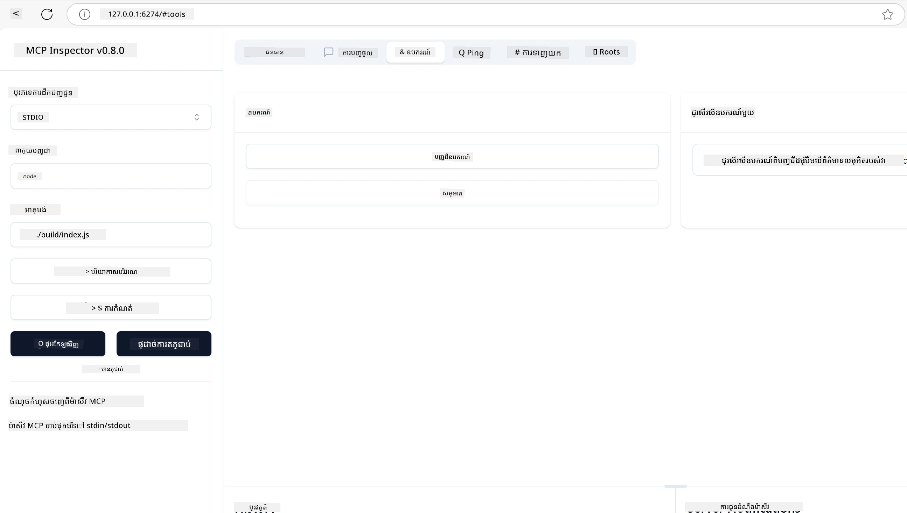
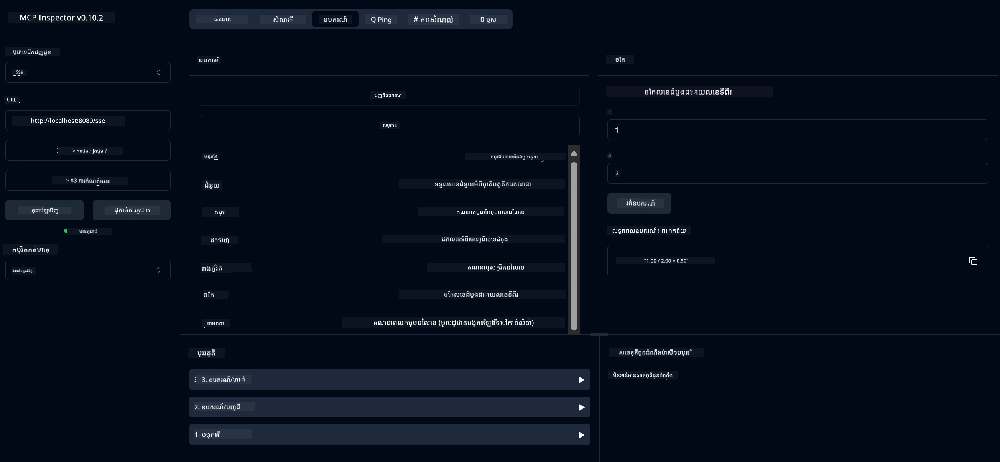
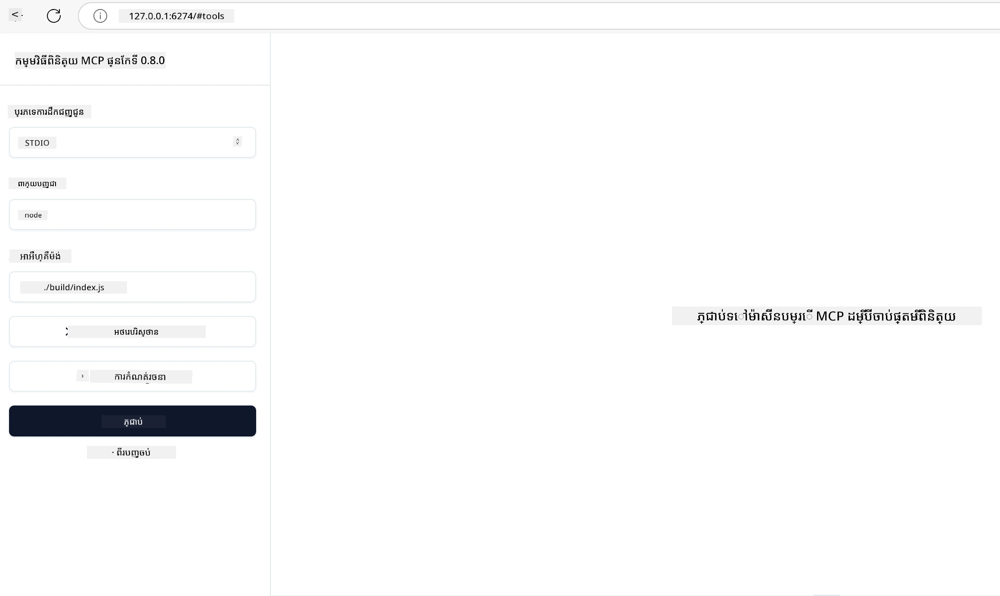
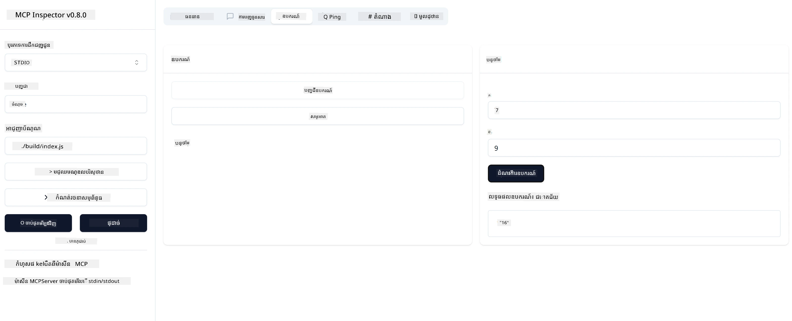

# ការចាប់ផ្តើមជាមួយ MCP

សូមស្វាគមន៍មកកាន់ជំហានដំបូងរបស់អ្នកជាមួយ Model Context Protocol (MCP)! មិនថាអ្នកថ្មីជាមួយ MCP ឬកំពុងស្វែងរកដើម្បីពង្រីកការយល់ដឹងរបស់អ្នក, មគ្គុទេសក៍នេះនឹងនាំអ្នកដំណើរការតាមដំណាក់កាលសំខាន់និងដំណើរការអភិវឌ្ឍ។ អ្នកនឹងបានស្វែងរកថា MCP ចេញទ្រព្យថានឹងធ្វើឲ្យមានការតភ្ជាប់រលូនរវាងម៉ូឌែល AI និងកម្មវិធី និងរៀនពីរបៀបដើម្បីផ្ដាច់ផ្ដើមបរិយាកាសរបស់អ្នកឲ្យរួចរាល់សម្រាប់ការកសាងនិងសាកល្បងដំណោះស្រាយដែលមាន MCP ជំរុញ។

> TLDR; បើអ្នកកសាងកម្មវិធី AI អ្នកដឹងថាអាចបន្ថែមឧបករណ៍និងធនធានផ្សេងៗទៅលើ LLM (ម៉ូឌែលភាសាធំនៅលើ) ដើម្បីធ្វើឲ្យ LLM មានចំណេះដឹងច្រើនជាងមុន។ ទោះយ៉ាងណា បើអ្នកដាក់ឧបករណ៍និងធនធានទាំងនោះនៅលើម៉ាស៊ីនបម្រើ កម្មវិធីនិងសមត្ថភាពម៉ាស៊ីនបម្រើអាចប្រើបានដោយអតិថិជនណាមួយ មិនថាមានឬគ្មាន LLM ។

## ទិដ្ឋភាពទូទៅ

មេរៀននេះផ្តល់នូវមគ្គុទេសក៍ជាក់ស្តែងសម្រាប់ការដំឡើងបរិយាកាស MCP និងការកសាងកម្មវិធី MCP ដំបូងរបស់អ្នក។ អ្នកនឹងរៀនពីរបៀបដំឡើងឧបករណ៍និងស៊ុមផ្នែកទន់, កសាងម៉ាស៊ីនបម្រើ MCP ថ្មី, បង្កើតកម្មវិធីម៉ាស៊ីនភ្ញៀវ, និងសាកល្បងការអនុវត្តរបស់អ្នក។

Model Context Protocol (MCP) គឺជាពិធីការបើកដែលកំណត់ម៉ាស៊ីនយ៉ាងស្តង់ដាអត្រានឹងរបៀបកម្មវិធីផ្តល់បរិបទទៅ LLMs។ គិតថា MCP ដូចជាវេទិកា USB-C សម្រាប់កម្មវិធី AI - វាប្រគល់វិធីស្តង់ដារក្នុងការតភ្ជាប់ម៉ូឌែល AI ទៅកាន់ប្រភពទិន្នន័យនិងឧបករណ៍ផ្សេងៗ។

## គោលបំណងរៀន

ចុងបញ្ចប់មេរៀននេះ អ្នកនឹងអាច៖

- ដំឡើងបរិយាកាសអភិវឌ្ឍសម្រាប់ MCP ក្នុង C#, Java, Python, TypeScript, និង Rust
- កសាងនិងចាប់ផ្តើមម៉ាស៊ីនបម្រើ MCP មូលដ្ឋានដែលមានមុខងារប្ដូរតាមតម្រូវការ (ធនធាន, ប្រូម, និងឧបករណ៍)
- បង្កើតកម្មវិធីម៉ាស៊ីនភ្ញៀវដែលភ្ជាប់ទៅម៉ាស៊ីនបម្រើ MCP
- សាកល្បងនិងដោះស្រាយកំហុសក្នុងការអនុវត្ត MCP

## ការដំឡើងបរិយាកាស MCP របស់អ្នក

មុននឹងចាប់ផ្តើមជាមួយ MCP វាមានសំខាន់ក្នុងការរៀបចំបរិយាកាសអភិវឌ្ឍរបស់អ្នក និងយល់ដូវចំណាត់ការមូលដ្ឋាន ដំណាក់កាលនេះនឹងណែនាំអ្នកក្នុងការតាំងទីសំរាប់ដំបូង ដើម្បីធានាថាការចាប់ផ្តើមជាមួយ MCP រលូនរបស់អ្នក។

### មុនចាប់ផ្តើម

មុនចូលរួមអភិវឌ្ឍ MCP, សូមប្រាកដថាអ្នកមាន៖

- **បរិយាកាសអភិវឌ្ឍ**៖ សម្រាប់ភាសាដែលអ្នកបានជ្រើស (C#, Java, Python, TypeScript ឬ Rust)
- **IDE/កម្មវិធីកែតម្រូវ**៖ Visual Studio, Visual Studio Code, IntelliJ, Eclipse, PyCharm ឬកម្មវិធីកែឯកសារល្អបំផុតណាមួយ
- **អ្នកគ្រប់គ្រងកញ្ចប់**៖ NuGet, Maven/Gradle, pip, npm/yarn ឬ Cargo
- **កូនសោ API**៖ សម្រាប់សេវា AI ណាមួយដែលអ្នកមានគម្រោងប្រើក្នុងកម្មវិធីម៉ាស៊ីនភ្ញៀវរបស់អ្នក

## រចនាសម្ព័ន្ធម៉ាស៊ីនបម្រើ MCP មូលដ្ឋាន

ម៉ាស៊ីនបម្រើ MCP មានភាគច្រើននៃរចនាសម្ព័ន្ធដូចជា៖

- **ការកំណត់ម៉ាស៊ីនបម្រើ**៖ កំណត់ច្រក, ការផ្ទៀងផ្ទាត់ និងការកំណត់ផ្សេងៗ
- **ធនធាន**៖ ទិន្នន័យនិងបរិបទដែលអាចធ្វើការចូលប្រើបានទៅ LLMs
- **ឧបករណ៍**៖ មុខងារដែលម៉ូឌែលអាចអញ្ជើញប្រើ
- **ប្រូម**៖ គំរូសម្រាប់បង្កើតឬត្រួតពិនិត្យអត្ថបទ

នេះគឺជាគំរូរងច្បាស់ៗក្នុង TypeScript៖

```typescript
import { McpServer, ResourceTemplate } from "@modelcontextprotocol/sdk/server/mcp.js";
import { StdioServerTransport } from "@modelcontextprotocol/sdk/server/stdio.js";
import { z } from "zod";

// បង្កើតម៉ាស៊ីនមេ MCP
const server = new McpServer({
  name: "Demo",
  version: "1.0.0"
});

// បន្ថែមឧបករណ៍បូក
server.tool("add",
  { a: z.number(), b: z.number() },
  async ({ a, b }) => ({
    content: [{ type: "text", text: String(a + b) }]
  })
);

// បន្ថែមធនធានស្វាគមន៍ប្រែប្រួល
server.resource(
  "file",
  // ប៉ារ៉ាម៉ែត្រ 'list' គ្រប់គ្រងរបៀបដែលធនធានបញ្ជីឯកសារដែលមាន។ ការកំណត់វាទៅ undefined នឹងបិទការបង្ហាញបញ្ជីសម្រាប់ធនធាននេះ។
  new ResourceTemplate("file://{path}", { list: undefined }),
  async (uri, { path }) => ({
    contents: [{
      uri: uri.href,
      text: `File, ${path}!`
    }]
  })
);

// បន្ថែមធនធានឯកសារ ដែលអានមាតិកាឯកសារ
server.resource(
  "file",
  new ResourceTemplate("file://{path}", { list: undefined }),
  async (uri, { path }) => {
    let text;
    try {
      text = await fs.readFile(path, "utf8");
    } catch (err) {
      text = `Error reading file: ${err.message}`;
    }
    return {
      contents: [{
        uri: uri.href,
        text
      }]
    };
  }
);

server.prompt(
  "review-code",
  { code: z.string() },
  ({ code }) => ({
    messages: [{
      role: "user",
      content: {
        type: "text",
        text: `Please review this code:\n\n${code}`
      }
    }]
  })
);

// ការចាប់ផ្តើមទទួលសារ​នៅលើ stdin និងបញ្ជូនសារនៅលើ stdout
const transport = new StdioServerTransport();
await server.connect(transport);
```

ក្នុងកូដខាងលើ យើងបាន៖

- នាំចូលថ្នាក់ដែលចាំបាច់ពី MCP TypeScript SDK។
- បង្កើតនិងកំណត់ម៉ាស៊ីនបម្រើ MCP ថ្មីមួយ។
- ចុះបញ្ជីឧបករណ៍ផ្ទាល់ខ្លួនមួយ (`calculator`) ជាមួយមុខងារចាប់ផ្តើម។
- ចាប់ផ្តើមម៉ាស៊ីនបម្រើដើម្បីស្តាប់សំណើ MCP ដែលចូលចិត្ត។

## ការសាកល្បងនិងដោះស្រាយកំហុស

មុនចាប់ផ្តើមសាកល្បងម៉ាស៊ីនបម្រើ MCP របស់អ្នក វាមានសារៈសំខាន់ក្នុងការយល់បានពីឧបករណ៍ដែលមាន និងវិធីសាស្រ្តល្អសម្រាប់ការដោះស្រាយកំហុស។ ការសាកល្បងដែលមានប្រសិទ្ធភាពធានាថា ម៉ាស៊ីនបម្រើរបស់អ្នកអង្ករការដំណើរការត្រឺមតាមគំរូ និងជួយអ្នករកឃើញនិងដោះស្រាយបញ្ហាបានយ៉ាងរហ័ស។ ផ្នែកក្រោមបង្ហាញពីវិធីសាស្រ្តដែលផ្តល់អនុសាសន៍សម្រាប់បញ្ជាក់គណនាតម្រូវ MCP របស់អ្នក។

MCP ផ្តល់ឧបករណ៍ជួយអ្នកសាកល្បងនិងដោះស្រាយកំហុសម៉ាស៊ីនបម្រើរបស់អ្នក៖

- **ឧបករណ៍ Inspector**, មុខងារបង្ហាញក្រាហ្វិកនេះអនុញ្ញាតឲ្យអ្នកភ្ជាប់ទៅម៉ាស៊ីនបម្រើរបស់អ្នក ហើយសាកល្បងឧបករណ៍, ប្រូម និងធនធានរបស់អ្នក។
- **curl**, អ្នកក៏អាចភ្ជាប់ទៅម៉ាស៊ីនបម្រើដោយប្រើឧបករណ៍បញ្ជា Command line ដូចជា curl ឬអតិថិជនផ្សេងៗ ដែលអាចបង្កើតនិងហៅការបញ្ជា HTTP ។

### ការប្រើ MCP Inspector

[MCP Inspector](https://github.com/modelcontextprotocol/inspector) គឺជាឧបករណ៍សាកល្បងដ៏មើលឃើញ ដែលជួយអ្នក៖

1. **រកឃើញសមត្ថភាពម៉ាស៊ីនបម្រើ**៖ ស្វ័យប្រវត្តិនិយាយសំពាធធនធាន, ឧបករណ៍ និងប្រូមដែលមាន
2. **សាកល្បងការប្រតិបត្តិឧបករណ៍**៖ សាកល្បងប៉ារ៉ាម៉ែត្រផ្សេងៗ ហើយមើលចម្លើយក្នុងពេលពិត
3. **មើលព័ត៌មានម៉ាស៊ីនបម្រើ**៖ ពិនិត្យព័ត៌មានម៉ាស៊ីនបម្រើ, ស្កីម៉ា និងការកំណត់

```bash
# ឧទាហរណ៍ TypeScript ការ៉ំព្យូទ័រ និងដំណើរការ MCP Inspector
npx @modelcontextprotocol/inspector node build/index.js
```

ពេលដែលអ្នករត់បញ្ជាខាងលើ MCP Inspector នឹងចាប់ផ្តើមវេទិកាវែបក្នុងម៉ាស៊ីនមេរបស់អ្នក។ អ្នកអាចរំពឹងមើលទៅផ្ទាំងបញ្ជាដែលបង្ហាញម៉ាស៊ីនបម្រើ MCP ដែលបានចុះបញ្ជីរបស់អ្នក, ឧបករណ៍,ធនធាន និងប្រូមដែលមាន។ មុខងារនេះអនុញ្ញាតឲ្យអ្នកទំនាក់ទំនងសាកល្បងការប្រតិបត្តិឧបករណ៍, ពិនិត្យព័ត៌មានម៉ាស៊ីនបម្រើ និងមើលចម្លើយក្នុងពេលពិតបានយ៉ាងងាយស្រួល សំរាប់បញ្ជាក់និងដោះស្រាយកំហុសអនុវត្ត MCP របស់អ្នក។

នេះគឺជារូបថតអេក្រង់នៃរបស់ដែលវាអាចមើលទៅដូចនេះ៖



## បញ្ហាទូទៅនិងដំណោះស្រាយ

| បញ្ហា | ដំណោះស្រាយដែលអាចធ្វើបាន |
|-------|----------------------------|
| ការតភ្ជាប់ត្រូវបានបដិសេធ | ពិនិត្យមើលថាម៉ាស៊ីនបម្រើកំពុងដំណើរការ និងច្រកត្រឹមត្រូវ |
| កំហុសកាលបរិច្ឆេទធ្វើឧបករណ៍ | ពិនិត្យមើលការបញ្ជាក់ទំនាក់ទំនងប៉ារ៉ាម៉ែត្រ និងការដោះស្រាយកំហុស |
| ការផ្ទៀងផ្ទាត់បរាជ័យ | បញ្ជាក់កូនសោ API និងសិទ្ធិ |
| កំហុសផ្ទៀងផ្ទាត់ស្កីម៉ា | ប្រាកដថាប៉ារ៉ាម៉ែត្រត្រូវគ្នានឹងស្កីម៉ារួចច្បាស់ |
| ម៉ាស៊ីនបម្រើមិនចាប់ផ្តើម | ពិនិត្យមើលការប្រកួតប្រជែងច្រក ឬការគាំទ្រដែលខ្វះ |
| កំហុស CORS | កំណត់ក្បាល CORS ត្រឹមត្រូវសម្រាប់សំណើអរដូចជា cross-origin |
| បញ្ហាផ្ទៀងផ្ទាត់ | បញ្ជាក់តុកKen ត្រឹមត្រូវ និងសិទ្ធិ |

## ការអភិវឌ្ឍក្នុងតំបន់

សម្រាប់ការអភិវឌ្ឍន៍ និងសាកល្បងក្នុងតំបន់ អ្នកអាចរត់ម៉ាស៊ីនបម្រើ MCP ដោយផ្ទាល់លើម៉ាស៊ីនរបស់អ្នក៖

1. **ចាប់ផ្តើមដំណើរការម៉ាស៊ីនបម្រើ**៖ ប្រតិបត្តិកម្ម MCP server របស់អ្នក
2. **កំណត់បណ្តាញ**៖ ប្រាកដថាម៉ាស៊ីនបម្រើអាចចូលដល់ដោយច្រកដែលបានរំពឹងទុក
3. **ភ្ជាប់អតិថិជន**៖ ប្រើ URL ភ្ជាប់ក្នុងតំបន់ដូចជា `http://localhost:3000`

```bash
# ឧទាហរណ៍៖ កំពុងដំណើរការម៉ាស៊ីនបម្រើ MCP TypeScript នៅក្នុងផ្លូវក្នុងម៉ាស៊ីនរបស់អ្នក
npm run start
# ម៉ាស៊ីនបម្រើកំពុងដំណើរការនៅ http://localhost:3000
```

## ការកសាងម៉ាស៊ីនបម្រើ MCP ដំបូងរបស់អ្នក

យើងបានគ្របដណ្តប់ [មូលដ្ឋានគំនិត](../../01-CoreConcepts/README.md) ក្នុងមេរៀនមុនៗ ហើយឥឡូវនេះពេលវេលាដើម្បីអនុវត្តចំណេះដឹងនោះ។

### ម៉ាស៊ីនបម្រើអាចធ្វើអ្វីបានខ្លះ

មុននឹងចាប់ផ្តើមសរសេរកូដ មកលើកឡើងចងចាំថាម៉ាស៊ីនបម្រើអាចធ្វើអ្វីបានខ្លះ៖

ម៉ាស៊ីនបម្រើ MCP អាច៖

- ចូលដំណើរការឯកសារចំរូងនិងមូលដ្ឋានទិន្នន័យក្នុងតំបន់
- ភ្ជាប់ទៅ APIs ពីចម្ងាយ
- អនុវត្តន៍កំណត់គណនា
- បញ្ចូលជាមួយឧបករណ៍និងសេវាកម្មផ្សេងៗ
- ផ្ដល់ផ្ទាំងប្រើប្រាស់សម្រាប់អន្តរកម្ម

ល្អហើយ, ឥឡូវយើងបានដឹងអ្វីដែលអាចធ្វើបាន គេបន្តសរសេរកូដ។

## លំហាត់៖ បង្កើតម៉ាស៊ីនបម្រើ

ដើម្បីបង្កើតមាស៊ីនបម្រើ អ្នកត្រូវតែធ្វើតាមជំហានដូចខាងក្រោម៖

- តំឡើង MCP SDK។
- បង្កើតគម្រោងនិងរៀបចំរចនាសម្ព័ន្ធគម្រោង។
- សរសេរកូដម៉ាស៊ីនបម្រើ។
- សាកល្បងម៉ាស៊ីនបម្រើ។

### -1- បង្កើតគម្រោង

#### TypeScript

```sh
# បង្កើតថតគម្រោង និងចាប់ផ្តើមគំរោង npm
mkdir calculator-server
cd calculator-server
npm init -y
```

#### Python

```sh
# បង្កើតថតគម្រោង
mkdir calculator-server
cd calculator-server
# បើកថតក្នុង Visual Studio Code - លោតចោលនេះប្រសិនបើអ្នកកំពុងប្រើ IDE ផ្សេងទៀត
code .
```

#### .NET

```sh
dotnet new console -n McpCalculatorServer
cd McpCalculatorServer
```

#### Java

សម្រាប់ Java, បង្កើតគម្រោង Spring Boot៖

```bash
curl https://start.spring.io/starter.zip \
  -d dependencies=web \
  -d javaVersion=21 \
  -d type=maven-project \
  -d groupId=com.example \
  -d artifactId=calculator-server \
  -d name=McpServer \
  -d packageName=com.microsoft.mcp.sample.server \
  -o calculator-server.zip
```

ដកស្រង់ឯកសារ zip៖

```bash
unzip calculator-server.zip -d calculator-server
cd calculator-server
# ជាមុខងារជាជម្រើស អាចយកការប្រឡងដែលមិនបានប្រើប្រាស់ចេញ
rm -rf src/test/java
```

បន្ថែមការកំណត់ពេញលេញខាងក្រោមទៅឯកសារ *pom.xml* របស់អ្នក៖

```xml
<?xml version="1.0" encoding="UTF-8"?>
<project xmlns="http://maven.apache.org/POM/4.0.0"
    xmlns:xsi="http://www.w3.org/2001/XMLSchema-instance"
    xsi:schemaLocation="http://maven.apache.org/POM/4.0.0 http://maven.apache.org/xsd/maven-4.0.0.xsd">
    <modelVersion>4.0.0</modelVersion>
    
    <!-- Spring Boot parent for dependency management -->
    <parent>
        <groupId>org.springframework.boot</groupId>
        <artifactId>spring-boot-starter-parent</artifactId>
        <version>3.5.0</version>
        <relativePath />
    </parent>

    <!-- Project coordinates -->
    <groupId>com.example</groupId>
    <artifactId>calculator-server</artifactId>
    <version>0.0.1-SNAPSHOT</version>
    <name>Calculator Server</name>
    <description>Basic calculator MCP service for beginners</description>

    <!-- Properties -->
    <properties>
        <java.version>21</java.version>
        <maven.compiler.source>21</maven.compiler.source>
        <maven.compiler.target>21</maven.compiler.target>
    </properties>

    <!-- Spring AI BOM for version management -->
    <dependencyManagement>
        <dependencies>
            <dependency>
                <groupId>org.springframework.ai</groupId>
                <artifactId>spring-ai-bom</artifactId>
                <version>1.0.0-SNAPSHOT</version>
                <type>pom</type>
                <scope>import</scope>
            </dependency>
        </dependencies>
    </dependencyManagement>

    <!-- Dependencies -->
    <dependencies>
        <dependency>
            <groupId>org.springframework.ai</groupId>
            <artifactId>spring-ai-starter-mcp-server-webflux</artifactId>
        </dependency>
        <dependency>
            <groupId>org.springframework.boot</groupId>
            <artifactId>spring-boot-starter-actuator</artifactId>
        </dependency>
        <dependency>
         <groupId>org.springframework.boot</groupId>
         <artifactId>spring-boot-starter-test</artifactId>
         <scope>test</scope>
      </dependency>
    </dependencies>

    <!-- Build configuration -->
    <build>
        <plugins>
            <plugin>
                <groupId>org.springframework.boot</groupId>
                <artifactId>spring-boot-maven-plugin</artifactId>
            </plugin>
            <plugin>
                <groupId>org.apache.maven.plugins</groupId>
                <artifactId>maven-compiler-plugin</artifactId>
                <configuration>
                    <release>21</release>
                </configuration>
            </plugin>
        </plugins>
    </build>

    <!-- Repositories for Spring AI snapshots -->
    <repositories>
        <repository>
            <id>spring-milestones</id>
            <name>Spring Milestones</name>
            <url>https://repo.spring.io/milestone</url>
            <snapshots>
                <enabled>false</enabled>
            </snapshots>
        </repository>
        <repository>
            <id>spring-snapshots</id>
            <name>Spring Snapshots</name>
            <url>https://repo.spring.io/snapshot</url>
            <releases>
                <enabled>false</enabled>
            </releases>
        </repository>
    </repositories>
</project>
```

#### Rust

```sh
mkdir calculator-server
cd calculator-server
cargo init
```

### -2- បន្ថែមផ្នត់គំនូស

ឥឡូវនេះគម្រោងបានបង្កើតរួចហើយ ត្រូវបន្ថែមផ្នត់គំនូស៖

#### TypeScript

```sh
# ប្រសិនបើមិនបានដំណើរការរួចទេ សូម​ដំឡើង TypeScript ជាទូទៅ
npm install typescript -g

# ដំឡើង MCP SDK និង Zod សម្រាប់ផ្ទៀងផ្ទាត់សំណុំបែបបទ
npm install @modelcontextprotocol/sdk zod
npm install -D @types/node typescript
```

#### Python

```sh
# បង្កើតបរិបទវីរុចយ៉ែលមួយ និងដំឡើងការគាំទ្រ
python -m venv venv
venv\Scripts\activate
pip install "mcp[cli]"
```

#### Java

```bash
cd calculator-server
./mvnw clean install -DskipTests
```

#### Rust

```sh
cargo add rmcp --features server,transport-io
cargo add serde
cargo add tokio --features rt-multi-thread
```

### -3- បង្កើតឯកសារគម្រោង

#### TypeScript

បើកឯកសារ *package.json* ហើយប្តូរទៅខាងក្រោមដើម្បីធានាបានថាអ្នកអាចកសាងនិងរត់ម៉ាស៊ីនបម្រើបាន៖

```json
{
  "name": "calculator-server",
  "version": "1.0.0",
  "main": "index.js",
  "type": "module",
  "scripts": {
    "build": "tsc",
    "start": "npm run build && node ./build/index.js",
  },
  "keywords": [],
  "author": "",
  "license": "ISC",
  "description": "A simple calculator server using Model Context Protocol",
  "dependencies": {
    "@modelcontextprotocol/sdk": "^1.16.0",
    "zod": "^3.25.76"
  },
  "devDependencies": {
    "@types/node": "^24.0.14",
    "typescript": "^5.8.3"
  }
}
```

បង្កើតឯកសារ *tsconfig.json* ជាមួយមាតិកាដូចខាងក្រោម៖

```json
{
  "compilerOptions": {
    "target": "ES2022",
    "module": "Node16",
    "moduleResolution": "Node16",
    "outDir": "./build",
    "rootDir": "./src",
    "strict": true,
    "esModuleInterop": true,
    "skipLibCheck": true,
    "forceConsistentCasingInFileNames": true
  },
  "include": ["src/**/*"],
  "exclude": ["node_modules"]
}
```

បង្កើតថតសម្រាប់កូដប្រភពរបស់អ្នក៖

```sh
mkdir src
touch src/index.ts
```

#### Python

បង្កើតឯកសារ *server.py*

```sh
touch server.py
```

#### .NET

តំឡើងកញ្ចប់ NuGet តម្រូវការ៖

```sh
dotnet add package ModelContextProtocol --prerelease
dotnet add package Microsoft.Extensions.Hosting
```

#### Java

សម្រាប់គម្រោង Java Spring Boot រចនាសម្ព័ន្ធគម្រោងត្រូវបានបង្កើតដោយស្វ័យប្រវត្តិ។

#### Rust

សម្រាប់ Rust, ឯកសារ *src/main.rs* ត្រូវបានបង្កើតដោយលំនាំដើមនៅពេលអ្នករត់ `cargo init`។ បើកឯកសារនិងលុបកូដលំនាំដើម។

### -4- សរសេរកូដម៉ាស៊ីនបម្រើ

#### TypeScript

បង្កើតឯកសារ *index.ts* ហើយបន្ថែមកូដខាងក្រោម៖

```typescript
import { McpServer, ResourceTemplate } from "@modelcontextprotocol/sdk/server/mcp.js";
import { StdioServerTransport } from "@modelcontextprotocol/sdk/server/stdio.js";
import { z } from "zod";
 
// បង្កើតម៉ាស៊ីនមេ MCP
const server = new McpServer({
  name: "Calculator MCP Server",
  version: "1.0.0"
});
```

ឥឡូវអ្នកមានម៉ាស៊ីនបម្រើមួយ ប៉ុន្តែវាមិនធ្វើអ្វីច្រើនទេ អាចជួយបញ្ចប់វា។

#### Python

```python
# server.py
from mcp.server.fastmcp import FastMCP

# បង្កើតម៉ាស៊ីនបម្រើ MCP
mcp = FastMCP("Demo")
```

#### .NET

```csharp
using Microsoft.Extensions.DependencyInjection;
using Microsoft.Extensions.Hosting;
using Microsoft.Extensions.Logging;
using ModelContextProtocol.Server;
using System.ComponentModel;

var builder = Host.CreateApplicationBuilder(args);
builder.Logging.AddConsole(consoleLogOptions =>
{
    // Configure all logs to go to stderr
    consoleLogOptions.LogToStandardErrorThreshold = LogLevel.Trace;
});

builder.Services
    .AddMcpServer()
    .WithStdioServerTransport()
    .WithToolsFromAssembly();
await builder.Build().RunAsync();

// add features
```

#### Java

សម្រាប់ Java, បង្កើតធាតុគ្រប់គ្រងម៉ាស៊ីនបម្រើសំខាន់ៗ។ ជាលម្អិត, ប្ដូរឧទ្យោកម្មស្នាដៃនេះ៖

*src/main/java/com/microsoft/mcp/sample/server/McpServerApplication.java*:

```java
package com.microsoft.mcp.sample.server;

import org.springframework.ai.tool.ToolCallbackProvider;
import org.springframework.ai.tool.method.MethodToolCallbackProvider;
import org.springframework.boot.SpringApplication;
import org.springframework.boot.autoconfigure.SpringBootApplication;
import org.springframework.context.annotation.Bean;
import com.microsoft.mcp.sample.server.service.CalculatorService;

@SpringBootApplication
public class McpServerApplication {

    public static void main(String[] args) {
        SpringApplication.run(McpServerApplication.class, args);
    }
    
    @Bean
    public ToolCallbackProvider calculatorTools(CalculatorService calculator) {
        return MethodToolCallbackProvider.builder().toolObjects(calculator).build();
    }
}
```

បង្កើតសេវាកម្ម calculator *src/main/java/com/microsoft/mcp/sample/server/service/CalculatorService.java*:

```java
package com.microsoft.mcp.sample.server.service;

import org.springframework.ai.tool.annotation.Tool;
import org.springframework.stereotype.Service;

/**
 * Service for basic calculator operations.
 * This service provides simple calculator functionality through MCP.
 */
@Service
public class CalculatorService {

    /**
     * Add two numbers
     * @param a The first number
     * @param b The second number
     * @return The sum of the two numbers
     */
    @Tool(description = "Add two numbers together")
    public String add(double a, double b) {
        double result = a + b;
        return formatResult(a, "+", b, result);
    }

    /**
     * Subtract one number from another
     * @param a The number to subtract from
     * @param b The number to subtract
     * @return The result of the subtraction
     */
    @Tool(description = "Subtract the second number from the first number")
    public String subtract(double a, double b) {
        double result = a - b;
        return formatResult(a, "-", b, result);
    }

    /**
     * Multiply two numbers
     * @param a The first number
     * @param b The second number
     * @return The product of the two numbers
     */
    @Tool(description = "Multiply two numbers together")
    public String multiply(double a, double b) {
        double result = a * b;
        return formatResult(a, "*", b, result);
    }

    /**
     * Divide one number by another
     * @param a The numerator
     * @param b The denominator
     * @return The result of the division
     */
    @Tool(description = "Divide the first number by the second number")
    public String divide(double a, double b) {
        if (b == 0) {
            return "Error: Cannot divide by zero";
        }
        double result = a / b;
        return formatResult(a, "/", b, result);
    }

    /**
     * Calculate the power of a number
     * @param base The base number
     * @param exponent The exponent
     * @return The result of raising the base to the exponent
     */
    @Tool(description = "Calculate the power of a number (base raised to an exponent)")
    public String power(double base, double exponent) {
        double result = Math.pow(base, exponent);
        return formatResult(base, "^", exponent, result);
    }

    /**
     * Calculate the square root of a number
     * @param number The number to find the square root of
     * @return The square root of the number
     */
    @Tool(description = "Calculate the square root of a number")
    public String squareRoot(double number) {
        if (number < 0) {
            return "Error: Cannot calculate square root of a negative number";
        }
        double result = Math.sqrt(number);
        return String.format("√%.2f = %.2f", number, result);
    }

    /**
     * Calculate the modulus (remainder) of division
     * @param a The dividend
     * @param b The divisor
     * @return The remainder of the division
     */
    @Tool(description = "Calculate the remainder when one number is divided by another")
    public String modulus(double a, double b) {
        if (b == 0) {
            return "Error: Cannot divide by zero";
        }
        double result = a % b;
        return formatResult(a, "%", b, result);
    }

    /**
     * Calculate the absolute value of a number
     * @param number The number to find the absolute value of
     * @return The absolute value of the number
     */
    @Tool(description = "Calculate the absolute value of a number")
    public String absolute(double number) {
        double result = Math.abs(number);
        return String.format("|%.2f| = %.2f", number, result);
    }

    /**
     * Get help about available calculator operations
     * @return Information about available operations
     */
    @Tool(description = "Get help about available calculator operations")
    public String help() {
        return "Basic Calculator MCP Service\n\n" +
               "Available operations:\n" +
               "1. add(a, b) - Adds two numbers\n" +
               "2. subtract(a, b) - Subtracts the second number from the first\n" +
               "3. multiply(a, b) - Multiplies two numbers\n" +
               "4. divide(a, b) - Divides the first number by the second\n" +
               "5. power(base, exponent) - Raises a number to a power\n" +
               "6. squareRoot(number) - Calculates the square root\n" + 
               "7. modulus(a, b) - Calculates the remainder of division\n" +
               "8. absolute(number) - Calculates the absolute value\n\n" +
               "Example usage: add(5, 3) will return 5 + 3 = 8";
    }

    /**
     * Format the result of a calculation
     */
    private String formatResult(double a, String operator, double b, double result) {
        return String.format("%.2f %s %.2f = %.2f", a, operator, b, result);
    }
}
```

**ធាតុបន្ថែមសម្រាប់សេវាកម្មដែលរួចរាល់សម្រាប់ផលិតកម្ម៖**

បង្កើតការកំណត់ចាប់ផ្តើម *src/main/java/com/microsoft/mcp/sample/server/config/StartupConfig.java*:

```java
package com.microsoft.mcp.sample.server.config;

import org.springframework.boot.CommandLineRunner;
import org.springframework.context.annotation.Bean;
import org.springframework.context.annotation.Configuration;

@Configuration
public class StartupConfig {
    
    @Bean
    public CommandLineRunner startupInfo() {
        return args -> {
            System.out.println("\n" + "=".repeat(60));
            System.out.println("Calculator MCP Server is starting...");
            System.out.println("SSE endpoint: http://localhost:8080/sse");
            System.out.println("Health check: http://localhost:8080/actuator/health");
            System.out.println("=".repeat(60) + "\n");
        };
    }
}
```

បង្កើតកម្មវិធីត្រួតពិនិត្យសុខភាព *src/main/java/com/microsoft/mcp/sample/server/controller/HealthController.java*:

```java
package com.microsoft.mcp.sample.server.controller;

import org.springframework.http.ResponseEntity;
import org.springframework.web.bind.annotation.GetMapping;
import org.springframework.web.bind.annotation.RestController;
import java.time.LocalDateTime;
import java.util.HashMap;
import java.util.Map;

@RestController
public class HealthController {
    
    @GetMapping("/health")
    public ResponseEntity<Map<String, Object>> healthCheck() {
        Map<String, Object> response = new HashMap<>();
        response.put("status", "UP");
        response.put("timestamp", LocalDateTime.now().toString());
        response.put("service", "Calculator MCP Server");
        return ResponseEntity.ok(response);
    }
}
```

បង្កើតអ្នកគ្រប់គ្រងករណីល្បួង *src/main/java/com/microsoft/mcp/sample/server/exception/GlobalExceptionHandler.java*:

```java
package com.microsoft.mcp.sample.server.exception;

import org.springframework.http.HttpStatus;
import org.springframework.http.ResponseEntity;
import org.springframework.web.bind.annotation.ExceptionHandler;
import org.springframework.web.bind.annotation.RestControllerAdvice;

@RestControllerAdvice
public class GlobalExceptionHandler {

    @ExceptionHandler(IllegalArgumentException.class)
    public ResponseEntity<ErrorResponse> handleIllegalArgumentException(IllegalArgumentException ex) {
        ErrorResponse error = new ErrorResponse(
            "Invalid_Input", 
            "Invalid input parameter: " + ex.getMessage());
        return new ResponseEntity<>(error, HttpStatus.BAD_REQUEST);
    }

    public static class ErrorResponse {
        private String code;
        private String message;

        public ErrorResponse(String code, String message) {
            this.code = code;
            this.message = message;
        }

        // កម្មវិធីដើម្បីទទួលបានតម្លៃ
        public String getCode() { return code; }
        public String getMessage() { return message; }
    }
}
```

បង្កើតប៊ឺណ័រផ្ទាល់ខ្លួន *src/main/resources/banner.txt*:

```text
_____      _            _       _             
 / ____|    | |          | |     | |            
| |     __ _| | ___ _   _| | __ _| |_ ___  _ __ 
| |    / _` | |/ __| | | | |/ _` | __/ _ \| '__|
| |___| (_| | | (__| |_| | | (_| | || (_) | |   
 \_____\__,_|_|\___|\__,_|_|\__,_|\__\___/|_|   
                                                
Calculator MCP Server v1.0
Spring Boot MCP Application
```

</details>

#### Rust

បន្ថែមកូដខាងក្រោមនៅលើកំពូលឯកសារ *src/main.rs*។ កូដនេះនាំចូលបណ្ណាល័យ និងមូឌុលចាំបាច់សម្រាប់ម៉ាស៊ីនបម្រើ MCP របស់អ្នក។

```rust
use rmcp::{
    handler::server::{router::tool::ToolRouter, tool::Parameters},
    model::{ServerCapabilities, ServerInfo},
    schemars, tool, tool_handler, tool_router,
    transport::stdio,
    ServerHandler, ServiceExt,
};
use std::error::Error;
```

ម៉ាស៊ីនបម្រើ calculator នឹងមានរូបមន្តសាមញ្ញមួយអាចបូកលេខពីរចូលគ្នា។ យើងបង្កើត struct មួយសម្រាប់តំណាងសំណើ calculator។

```rust
#[derive(Debug, serde::Deserialize, schemars::JsonSchema)]
pub struct CalculatorRequest {
    pub a: f64,
    pub b: f64,
}
```

បន្ទាប់មក បង្កើត struct មួយសម្រាប់តំណាងម៉ាស៊ីនបម្រើ calculator។ struct នេះនឹងផ្តួចផ្តើម tool router ដែលប្រើសម្រាប់ចុះបញ្ជីឧបករណ៍។

```rust
#[derive(Debug, Clone)]
pub struct Calculator {
    tool_router: ToolRouter<Self>,
}
```

ឥឡូវនេះ យើងអាចអនុវត្ត struct `Calculator` ដើម្បីបង្កើតអinstance ថ្មីរបស់ម៉ាស៊ីនបម្រើ និងអនុវត្ត handler របស់ម៉ាស៊ីនបម្រើដើម្បីផ្តល់ព័ត៌មានម៉ាស៊ីនបម្រើ។

```rust
#[tool_router]
impl Calculator {
    pub fn new() -> Self {
        Self {
            tool_router: Self::tool_router(),
        }
    }
}

#[tool_handler]
impl ServerHandler for Calculator {
    fn get_info(&self) -> ServerInfo {
        ServerInfo {
            instructions: Some("A simple calculator tool".into()),
            capabilities: ServerCapabilities::builder().enable_tools().build(),
            ..Default::default()
        }
    }
}
```

ចុងក្រោយ យើងត្រូវអនុវត្តមុខងារចម្បងដើម្បីចាប់ផ្តើមម៉ាស៊ីនបម្រើ។ មុខងារនេះនឹងបង្កើតអinstance របស់ struct `Calculator` និងបម្រើវាតាមបញ្ជូល/បញ្ជាបញ្ចេញស្តង់ដារ។

```rust
#[tokio::main]
async fn main() -> Result<(), Box<dyn Error>> {
    let service = Calculator::new().serve(stdio()).await?;
    service.waiting().await?;
    Ok(())
}
```

ម៉ាស៊ីនបម្រើឥឡូវនេះត្រូវបានរៀបចំដើម្បីផ្តល់ព័ត៌មានមូលដ្ឋានអំពីខ្លួនវា។ បន្ទាប់មក យើងនឹងបន្ថែមឧបករណ៍មួយសម្រាប់អនុវត្តន៍ការបូក។

### -5- ការបន្ថែមឧបករណ៍និងធនធាន

បន្ថែមឧបករណ៍និងធនធានដោយបន្ថែមកូដខាងក្រោម៖

#### TypeScript

```typescript
server.tool(
  "add",
  { a: z.number(), b: z.number() },
  async ({ a, b }) => ({
    content: [{ type: "text", text: String(a + b) }]
  })
);

server.resource(
  "greeting",
  new ResourceTemplate("greeting://{name}", { list: undefined }),
  async (uri, { name }) => ({
    contents: [{
      uri: uri.href,
      text: `Hello, ${name}!`
    }]
  })
);
```

ឧបករណ៍របស់អ្នកទទួលប៉ារ៉ាម៉ែត្រ `a` និង `b` ហើយដំណើរការមុខងារ ដែលបង្កើតចម្លើយក្នុងរបៀប៖

```typescript
{
  contents: [{
    type: "text", content: "some content"
  }]
}
```

ធនធានរបស់អ្នកចូលបានតាមរយៈស្រចឹមអក្សរ "greeting" និងទទួលប៉ារ៉ាម៉ែត្រ `name` ហើយបង្កើតចម្លើយដូចគ្នានឹងឧបករណ៍៖

```typescript
{
  uri: "<href>",
  text: "a text"
}
```

#### Python

```python
# បន្ថែមឧបករណ៍បូក
@mcp.tool()
def add(a: int, b: int) -> int:
    """Add two numbers"""
    return a + b


# បន្ថែមធនធានស្វាគមន៍មានសកម្មភាព
@mcp.resource("greeting://{name}")
def get_greeting(name: str) -> str:
    """Get a personalized greeting"""
    return f"Hello, {name}!"
```

ក្នុងកូដខាងលើ យើងបាន៖

- កំណត់ឧបករណ៍ `add` ដែលទទួលប៉ារ៉ាម៉ែត្រ `a` និង `b` ដែលជា លេខគត់ទាំងពីរ។
- បង្កើតធនធានឈ្មោះ `greeting` ដែលទទួលប៉ារ៉ាម៉ែត្រ `name`។

#### .NET

បន្ថែមនេះទៅឯកសារ Program.cs របស់អ្នក៖

```csharp
[McpServerToolType]
public static class CalculatorTool
{
    [McpServerTool, Description("Adds two numbers")]
    public static string Add(int a, int b) => $"Sum {a + b}";
}
```

#### Java

ឧបករណ៍បានបង្កើតរួចហើយនៅជំហានមុន។

#### Rust

បន្ថែមឧបករណ៍ថ្មីនៅក្នុងប្លុក `impl Calculator`៖

```rust
#[tool(description = "Adds a and b")]
async fn add(
    &self,
    Parameters(CalculatorRequest { a, b }): Parameters<CalculatorRequest>,
) -> String {
    (a + b).to_string()
}
```

### -6- កូដចុងក្រោយ

មកបន្ថែមកូដចុងក្រោយដែលយើងទាមទារដើម្បីឲ្យម៉ាស៊ីនបម្រើអាចចាប់ផ្តើមបាន៖

#### TypeScript

```typescript
// ចាប់ផ្តើមទទួលសារ​លើ stdin និង​ផ្ញើសារ​លើ stdout
const transport = new StdioServerTransport();
await server.connect(transport);
```

នេះគឺជា កូដពេញលេញ៖

```typescript
// index.ts
import { McpServer, ResourceTemplate } from "@modelcontextprotocol/sdk/server/mcp.js";
import { StdioServerTransport } from "@modelcontextprotocol/sdk/server/stdio.js";
import { z } from "zod";

// បង្កើតម៉ាស៊ីនមេ MCP
const server = new McpServer({
  name: "Calculator MCP Server",
  version: "1.0.0"
});

// បន្ថែមឧបករណ៍បូក
server.tool(
  "add",
  { a: z.number(), b: z.number() },
  async ({ a, b }) => ({
    content: [{ type: "text", text: String(a + b) }]
  })
);

// បន្ថែមធនធានសារ​បិទ​ស្វាគមន៍​អោយ​ដំណើរការ
server.resource(
  "greeting",
  new ResourceTemplate("greeting://{name}", { list: undefined }),
  async (uri, { name }) => ({
    contents: [{
      uri: uri.href,
      text: `Hello, ${name}!`
    }]
  })
);

// ចាប់ផ្តើមទទួលសារ​នៅលើ stdin និងផ្ញើសារនៅលើ stdout
const transport = new StdioServerTransport();
server.connect(transport);
```

#### Python

```python
# server.py
from mcp.server.fastmcp import FastMCP

# បង្កើតម៉ាស៊ីនមេ MCP
mcp = FastMCP("Demo")


# បន្ថែមឧបករណ៍បូកসম
@mcp.tool()
def add(a: int, b: int) -> int:
    """Add two numbers"""
    return a + b


# បន្ថែមធនធានស្វាគមន៍ឌុយណាមិច
@mcp.resource("greeting://{name}")
def get_greeting(name: str) -> str:
    """Get a personalized greeting"""
    return f"Hello, {name}!"

# ប្លុកការប្រតិបត្តិការសំខាន់ - នេះគឺចាំបាច់សម្រាប់ដំណើរការម៉ាស៊ីនមេ
if __name__ == "__main__":
    mcp.run()
```

#### .NET

បង្កើតឯកសារ Program.cs ជាមួយមាតិកាខាងក្រោម៖

```csharp
using Microsoft.Extensions.DependencyInjection;
using Microsoft.Extensions.Hosting;
using Microsoft.Extensions.Logging;
using ModelContextProtocol.Server;
using System.ComponentModel;

var builder = Host.CreateApplicationBuilder(args);
builder.Logging.AddConsole(consoleLogOptions =>
{
    // Configure all logs to go to stderr
    consoleLogOptions.LogToStandardErrorThreshold = LogLevel.Trace;
});

builder.Services
    .AddMcpServer()
    .WithStdioServerTransport()
    .WithToolsFromAssembly();
await builder.Build().RunAsync();

[McpServerToolType]
public static class CalculatorTool
{
    [McpServerTool, Description("Adds two numbers")]
    public static string Add(int a, int b) => $"Sum {a + b}";
}
```

#### Java

ថ្នាក់កម្មវិធីស្នាដៃចម្បងដើម្បីរួចរាល់របស់អ្នកគួរតែដូចខាងក្រោម៖

```java
// McpServerApplication.java
package com.microsoft.mcp.sample.server;

import org.springframework.ai.tool.ToolCallbackProvider;
import org.springframework.ai.tool.method.MethodToolCallbackProvider;
import org.springframework.boot.SpringApplication;
import org.springframework.boot.autoconfigure.SpringBootApplication;
import org.springframework.context.annotation.Bean;
import com.microsoft.mcp.sample.server.service.CalculatorService;

@SpringBootApplication
public class McpServerApplication {

    public static void main(String[] args) {
        SpringApplication.run(McpServerApplication.class, args);
    }
    
    @Bean
    public ToolCallbackProvider calculatorTools(CalculatorService calculator) {
        return MethodToolCallbackProvider.builder().toolObjects(calculator).build();
    }
}
```

#### Rust

កូដចុងក្រោយសម្រាប់ម៉ាស៊ីនបម្រើ Rust ควรเหมือนกับនេះ៖

```rust
use rmcp::{
    ServerHandler, ServiceExt,
    handler::server::{router::tool::ToolRouter, tool::Parameters},
    model::{ServerCapabilities, ServerInfo},
    schemars, tool, tool_handler, tool_router,
    transport::stdio,
};
use std::error::Error;

#[derive(Debug, serde::Deserialize, schemars::JsonSchema)]
pub struct CalculatorRequest {
    pub a: f64,
    pub b: f64,
}

#[derive(Debug, Clone)]
pub struct Calculator {
    tool_router: ToolRouter<Self>,
}

#[tool_router]
impl Calculator {
    pub fn new() -> Self {
        Self {
            tool_router: Self::tool_router(),
        }
    }
    
    #[tool(description = "Adds a and b")]
    async fn add(
        &self,
        Parameters(CalculatorRequest { a, b }): Parameters<CalculatorRequest>,
    ) -> String {
        (a + b).to_string()
    }
}

#[tool_handler]
impl ServerHandler for Calculator {
    fn get_info(&self) -> ServerInfo {
        ServerInfo {
            instructions: Some("A simple calculator tool".into()),
            capabilities: ServerCapabilities::builder().enable_tools().build(),
            ..Default::default()
        }
    }
}

#[tokio::main]
async fn main() -> Result<(), Box<dyn Error>> {
    let service = Calculator::new().serve(stdio()).await?;
    service.waiting().await?;
    Ok(())
}
```

### -7- សាកល្បងម៉ាស៊ីនបម្រើ

ចាប់ផ្តើមម៉ាស៊ីនបម្រើជាមួយបញ្ជានេះ៖

#### TypeScript

```sh
npm run build
```

#### Python

```sh
mcp run server.py
```

> ដើម្បីប្រើ MCP Inspector, ប្រើ `mcp dev server.py` ដែលនឹងចាប់ផ្តើម Inspector ដោយស្វ័យប្រវត្តិ និងផ្តល់នូវសញ្ញាសំណុំប្រតិបត្តិការផ្លូវការដែលត្រូវការ។ បើប្រើ `mcp run server.py`, អ្នកត្រូវចាប់ផ្តើម Inspector ដោយដៃ និងកំណត់ភ្ជាប់។

#### .NET

ប្រាកដថាអ្នកនៅក្នុងថតគម្រោងរបស់អ្នក៖

```sh
cd McpCalculatorServer
dotnet run
```

#### Java

```bash
./mvnw clean install -DskipTests
java -jar target/calculator-server-0.0.1-SNAPSHOT.jar
```

#### Rust

រត់បញ្ជាខាងក្រោមដើម្បីដាក់លំអរនិងរត់ម៉ាស៊ីនបម្រើ៖

```sh
cargo fmt
cargo run
```

### -8- រត់ដោយប្រើ inspector

inspector គឺជាឧបករណ៍ល្អដែលអាចចាប់ផ្តើមម៉ាស៊ីនបម្រើរបស់អ្នក ហើយអនុញ្ញាតឲ្យអ្នកអន្តរកម្មជាមួយវាដើម្បីពិនិត្យមើលថាវាដំណើរការបានត្រឹមត្រូវ។ ចាប់ផ្តើមវា៖

> [!NOTE]
> វាអាចមើលទៅខុសគ្នានៅក្នុងវាល "command" ព្រោះវាមានបញ្ជារបស់ការរត់ម៉ាស៊ីនបម្រើជាមួយ runtime ជាក់លាក់របស់អ្នក។

#### TypeScript

```sh
npx @modelcontextprotocol/inspector node build/index.js
```

ឬបន្ថែមវាទៅក្នុង *package.json* របស់អ្នកដូច្នេះ៖ `"inspector": "npx @modelcontextprotocol/inspector node build/index.js"` រួចបន្ទាប់មករត់ `npm run inspector`

#### Python

Python រុំឧបករណ៍ Node.js មួយ​ដែលឈ្មោះ inspector។ អាចហៅឧបករណ៍នេះដូចខាងក្រោម៖

```sh
mcp dev server.py
```

ទោះយ៉ាងណា វាមិនអនុវត្តសប្បាយមុខងារទាំងអស់នៅលើឧបករណ៍នោះទេ ដូច្នេះអ្នកត្រូវបានផ្តល់អនុសាសន៍ឲ្យរត់ឧបករណ៍ Node.js ដោយផ្ទាល់ដូចខាងក្រោម៖

```sh
npx @modelcontextprotocol/inspector mcp run server.py
```

បើអ្នកកំពុងប្រើឧបករណ៍ ឬ IDE ដែលអនុញ្ញាតឲ្យអ្នកកំណត់បញ្ជា និងអង្គភាពសម្រាប់ការរត់ស្គ្រីប,
make sure to set `python` in the `Command` field and `server.py` as `Arguments`. This ensures the script runs correctly.

#### .NET

Make sure you're in your project directory:

```sh
cd McpCalculatorServer
npx @modelcontextprotocol/inspector dotnet run
```

#### Java

Ensure you calculator server is running
The run the inspector:

```cmd
npx @modelcontextprotocol/inspector
```

In the inspector web interface:

1. Select "SSE" as the transport type
2. Set the URL to: `http://localhost:8080/sse`
3. Click "Connect"



**អ្នកបានភ្ជាប់ទៅម៉ាស៊ីនបម្រើរួចហើយ**
**ផ្នែកសាកល្បងម៉ាស៊ីនបម្រើ Java បានបញ្ចប់ហើយ**

ផ្នែកបន្ទាប់គឺអំពីអន្តរកម្មជាមួយម៉ាស៊ីនបម្រើ។

អ្នកគួរតែឃើញចំណុចប្រទាក់អ្នកប្រើដូចខាងក្រោម៖



1. ភ្ជាប់ទៅម៉ាស៊ីនបម្រើដោយជ្រើសប៊ូតុង Connect  
  ពេលដែលអ្នកភ្ជាប់ទៅម៉ាស៊ីនបម្រើ អ្នកគួរតែឃើញដូចខាងក្រោម៖

  

1. ជ្រើស "Tools" និង "listTools" អ្នកគួរតែឃើញ "Add" បង្ហាញឡើង ជ្រើស "Add" ហើយបំពេញតម្លៃប៉ារ៉ាម៉ែត្រ។

  អ្នកគួរតែឃើញចម្លើយដូចខាងក្រោម គឺលទ្ធផលពីឧបករណ៍ "add"៖

  

អបអរសាទរ អ្នកបានបង្កើត និងរត់ម៉ាស៊ីនបម្រើដំបូងរបស់អ្នកជោគជ័យ!

#### Rust

ដើម្បីរត់ម៉ាស៊ីនបម្រើ Rust ជាមួយ MCP Inspector CLI ប្រើពាក្យបញ្ជាដូចខាងក្រោម៖

```sh
npx @modelcontextprotocol/inspector cargo run --cli --method tools/call --tool-name add --tool-arg a=1 b=2
```

### Official SDKs

MCP ផ្តល់ជូន SDKs ផ្លូវការសម្រាប់ភាសាច្រើន៖

- [C# SDK](https://github.com/modelcontextprotocol/csharp-sdk) - រៀបចំជាមួយ Microsoft
- [Java SDK](https://github.com/modelcontextprotocol/java-sdk) - រៀបចំជាមួយ Spring AI
- [TypeScript SDK](https://github.com/modelcontextprotocol/typescript-sdk) - ការអនុវត្ត TypeScript ផ្លូវការ
- [Python SDK](https://github.com/modelcontextprotocol/python-sdk) - ការអនុវត្ត Python ផ្លូវការ
- [Kotlin SDK](https://github.com/modelcontextprotocol/kotlin-sdk) - ការអនុវត្ត Kotlin ផ្លូវការ
- [Swift SDK](https://github.com/modelcontextprotocol/swift-sdk) - រៀបចំជាមួយ Loopwork AI
- [Rust SDK](https://github.com/modelcontextprotocol/rust-sdk) - ការអនុវត្ត Rust ផ្លូវការ

## Key Takeaways

- ការតំឡើងបរិស្ថានអភិវឌ្ឍ MCP គឺសាមញ្ញជាមួយ SDKs ពីរាជភាសា
- ការបង្កើតម៉ាស៊ីនបម្រើ MCP រួមមានការបង្កើត និងចុះបញ្ជីឧបករណ៍ជាមួយស្កីម៉ាសច្បាស់លាស់
- ការសាកល្បង និងដោះស្រាយបញ្ហាគឺសំខាន់សម្រាប់ការអនុវត្ត MCP ដែលទុកចិត្តបាន

## Samples

- [Java Calculator](../samples/java/calculator/README.md)
- [.Net Calculator](../../../../03-GettingStarted/samples/csharp)
- [JavaScript Calculator](../samples/javascript/README.md)
- [TypeScript Calculator](../samples/typescript/README.md)
- [Python Calculator](../../../../03-GettingStarted/samples/python)
- [Rust Calculator](../../../../03-GettingStarted/samples/rust)

## Assignment

បង្កើតម៉ាស៊ីនបម្រើ MCP ងាយៗមួយជាមួយឧបករណ៍ដែលអ្នកជ្រើស៖

1. អនុវត្តឧបករណ៍នៅភាសាដែលអ្នកចូលចិត្ត (.NET, Java, Python, TypeScript, ឬ Rust)។
2. កំណត់ប៉ារ៉ាម៉ែត្រ និងតម្លៃត្រឡប់។  
3. រត់ឧបករណ៍ inspector ដើម្បីធ្វើឲ្យប្រាកដថាម៉ាស៊ីនបម្រើដំណើរការត្រឹមត្រូវ។  
4. សាកល្បងអនុវត្តន៍ជាមួយអញ្ញើផ្សេងៗ។

## Solution

[Solution](./solution/README.md)

## Additional Resources

- [Build Agents using Model Context Protocol on Azure](https://learn.microsoft.com/azure/developer/ai/intro-agents-mcp)
- [Remote MCP with Azure Container Apps (Node.js/TypeScript/JavaScript)](https://learn.microsoft.com/samples/azure-samples/mcp-container-ts/mcp-container-ts/)
- [.NET OpenAI MCP Agent](https://learn.microsoft.com/samples/azure-samples/openai-mcp-agent-dotnet/openai-mcp-agent-dotnet/)

## What's next

Next: [Getting Started with MCP Clients](../02-client/README.md)

---

<!-- CO-OP TRANSLATOR DISCLAIMER START -->
**ការផ្ដល់ការបដិសេធ**៖  
ឯកសារនេះត្រូវបានបកប្រែដោយប្រើសេវាបកប្រែ AI [Co-op Translator](https://github.com/Azure/co-op-translator)។ ខណៈពេលយើងខិតខំប្រឹងប្រែងសម្រាប់ភាពត្រឹមត្រូវ សូមយកចិត្តទុកដាក់ទាក់អំពីថាការបកប្រែដោយស្វ័យមករ可能មានកំហុសឬភាពមិនត្រឹមត្រូវខ្លះ។ ឯកសារដើមក្នុងភាសារបស់វាគួរត្រូវបានគិតថាជាមូលដ្ឋានដើម។ សម្រាប់ព័ត៌មានសំខាន់ៗ ការបកប្រែដោយអ្នកជំនាញមនុស្សគឺត្រូវបានផ្ដល់អនុសាសន៍។ យើងមិនទទួលខុសត្រូវចំពោះការយល់ច្រឡំ ឬការបកប្រែខុសបញ្ចេញពីការប្រើប្រាស់ការបកប្រែនេះឡើយ។
<!-- CO-OP TRANSLATOR DISCLAIMER END -->