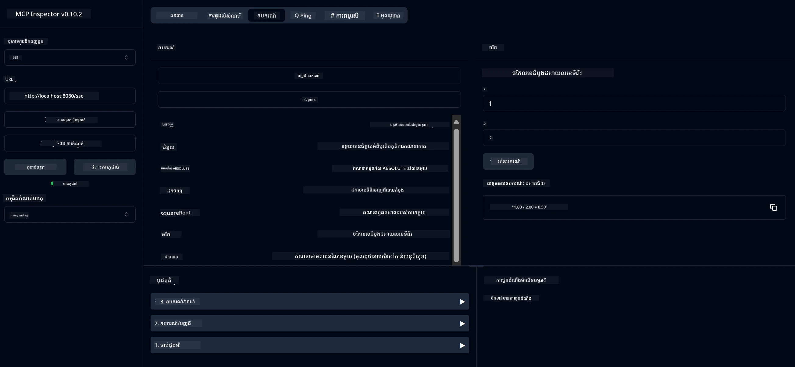

# Basic Calculator MCP Service

សេវាកម្មនេះផ្តល់ជូននូវប្រតិបត្តិការគណនាគ្រឹះមួយចំនួន តាមរយៈ Model Context Protocol (MCP) ប្រើ Spring Boot ជាមួយការដឹកជញ្ជូន WebFlux។ វាត្រូវបានរចនាឡើងជា ឧទាហរណ៍សាមញ្ញសម្រាប់អ្នកចាប់ផ្ដើមដែលកំពុងសិក្សាអំពីការអនុវត្ត MCP។

សម្រាប់ព័ត៌មានបន្ថែម សូមមើលឯកសារយោង [MCP Server Boot Starter](https://docs.spring.io/spring-ai/reference/api/mcp/mcp-server-boot-starter-docs.html)។


## ការប្រើប្រាស់សេវា

សេវាកម្មនេះបង្ហាញចំពោះចុងផ្លូវ API ខាងក្រោមតាមរយៈពិធីសាស្រ្ត MCP៖

- `add(a, b)`: បូកលេខពីរ
- `subtract(a, b)`: ដកលេខទីពីរចេញពីលេខទីមួយ
- `multiply(a, b)`:គុណលេខពីរ
- `divide(a, b)`: ចែកលេខទីមួយដោយលេខទីពីរ (ពិនិត្យលេខសូន្យ)
- `power(base, exponent)`: គណនាថាមពលនៃលេខមួយ
- `squareRoot(number)`: គណនារមណីយដ្ឋានការ៉េ (ពិនិត្យលេខអវិជ្ជមាន)
- `modulus(a, b)`: គណនាអិនតេករ៉េ (នៅពេលចែក)
- `absolute(number)`: គណនាតម្លៃដាច់ដោយឡែក

## អាសយដ្ឋានអាស្រ័យ

គម្រោងនេះត្រូវការអាសយដ្ឋានអាស្រ័យសំខាន់ៗដូចខាងក្រោម៖

```xml
<dependency>
    <groupId>org.springframework.ai</groupId>
    <artifactId>spring-ai-starter-mcp-server-webflux</artifactId>
</dependency>
```

## ការសាងសង់គម្រោង

សាងសង់គម្រោងដោយប្រើ Maven៖
```bash
./mvnw clean install -DskipTests
```

## ការរត់ម៉ាស៊ីនមេ

### ការប្រើប្រាស់ Java

```bash
java -jar target/calculator-server-0.0.1-SNAPSHOT.jar
```

### ការប្រើប្រាស់ MCP Inspector

MCP Inspector គឺជាឧបករណ៍ជំនួយសម្រាប់ធ្វើបច្ចុប្បន្នភាពជាមួយសេវាកម្ម MCP។ ដើម្បីប្រើប្រាស់វាជាមួយសេវាកម្មគណនាតារាងនេះ៖

1. **ដំឡើងនិងបើក MCP Inspector** នៅក្នុងវីនដូរបញ្ជាថ្មី៖
   ```bash
   npx @modelcontextprotocol/inspector
   ```

2. **ចូលទៅកាន់ UI បណ្ដាញ** ដោយចុចលើ URL ដែលកម្មវិធីបញ្ចេញ (ជាទូទៅ http://localhost:6274)

3. **កំណត់ការតភ្ជាប់**៖
   - កំណត់ប្រភេទដឹកជញ្ជូនទៅ "SSE"
   - កំណត់ URL ទៅចុងផ្លូវ SSE របស់ម៉ាស៊ីនមេដែលកំពុងរត់៖ `http://localhost:8080/sse`
   - ចុច "Connect"

4. **ប្រើប្រាស់ឧបករណ៍**៖
   - ចុច "List Tools" ដើម្បីមើលប្រតិបត្តិការ calculator ដែលមាន
   - ជ្រើសឧបករណ៍ និងចុច "Run Tool" ដើម្បីអនុវត្តប្រតិបត្តិការ



---

<!-- CO-OP TRANSLATOR DISCLAIMER START -->
**ការបដិសេធ**៖  
ឯកសារនេះត្រូវបានបកប្រែដោយប្រើសេវាកម្មបកប្រែ AI [Co-op Translator](https://github.com/Azure/co-op-translator)។ ម្យ៉ាងវិញទៀត ខណៈដែលយើងខិតខំប្រឹងប្រែងសម្រាប់ភាពត្រឹមត្រូវ សូមយល់ថាការបកប្រែដោយស្វ័យប្រវត្តិក្នុងឯកសារនេះអាចមានកំហុសឬភាពមិនត្រឹមត្រូវ។ ឯកសារដើមជាភាសាទូទៅគួរត្រូវបានទទួលស្គាល់ថាជា​ប្រភព​ដែលមានអំណាច។ សម្រាប់ព័ត៌មានសំខាន់ ប្រសិនបើត្រូវផ្ទៀងផ្ទាត់ការបកប្រែដោយអ្នកជំនាញមនុស្សគឺជាការផ្តល់អនុសាសន៍។ យើងមិនទទួលខុសត្រូវចំពោះការយល់ច្រឡំ ឬការបកប្រែខុស​ដែលកើតឡើងពីការប្រើប្រាស់ការបកប្រែនេះឡើយ។
<!-- CO-OP TRANSLATOR DISCLAIMER END -->