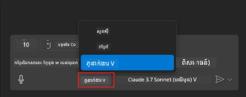
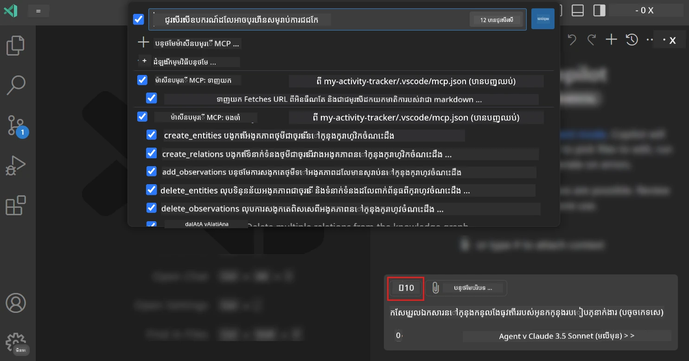
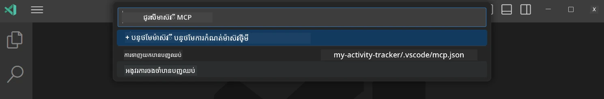
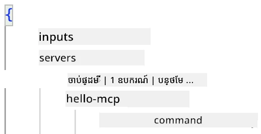
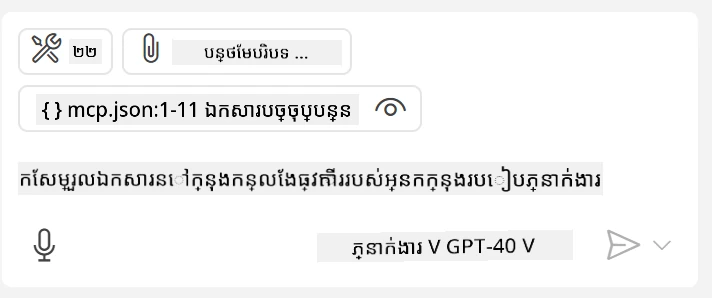
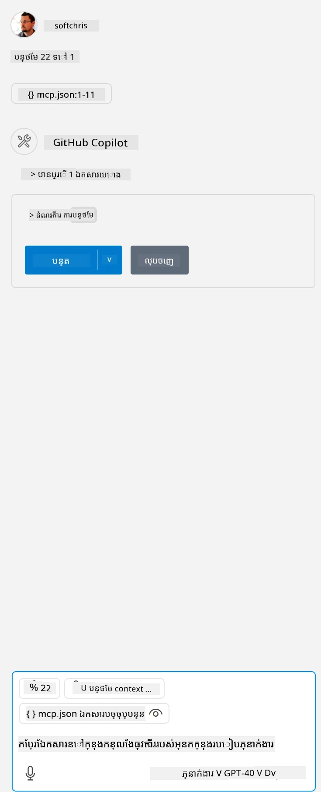

# ការប្រើប្រាស់ម៉ាស៊ែរពីរបៀប GitHub Copilot Agent

Visual Studio Code និង GitHub Copilot អាចចូលជាអតិថិជន (client) និងប្រើប្រាស់ MCP Server ។ តើហេតុអ្វីបានជាយើងចង់ធ្វើបែបនេះ អ្នកអាចសួរបាន? វាមានន័យថា អ្វីដែល MCP Server មានឥឡូវនេះ អាចប្រើបានពីក្នុង IDE របស់អ្នក។ ផ្តល់ឱ្យអ្នកនូវឧទាហរណ៍ ដូចជា ការបន្ថែម MCP server របស់ GitHub នេះអាចអនុញ្ញាតឱ្យអ្នកត្រួតពិនិត្យ GitHub តាមរយៈការផ្តល់សំណួរដោយមិនចាំបាច់វាយពាក្យបញ្ជាក់ក្នុង Terminal ។ ឬនិយាយទូទៅ អ្វីៗណាដែលអាចបង្កើនបទពិសោធន៍អ្នកអភិវឌ្ឍន៍បាន ទាំងអស់គឺគ្រប់គ្រងដោយភាសាបាន។ ឥឡូវលោកអ្នកចាប់ផ្តើមឃើញអត្ថប្រយោជន៍ហើយមែន?

## ទិដ្ឋភាពទូទៅ

មេរៀននេះបង្ហាញពីរបៀបប្រើ Visual Studio Code និងរបៀប Agent របស់ GitHub Copilot ជាអតិថិជនសម្រាប់ MCP Server របស់អ្នក។

## គោលបំណងសិក្សា

នៅចប់មេរៀននេះ អ្នកនឹងអាច៖

- ប្រើ MCP Server តាមរយៈ Visual Studio Code។
- ប្រតិបត្តិមុខងារដូចជា ឧបករណ៍តាមរយៈ GitHub Copilot។
- កំណត់ការកំណត់ Visual Studio Code ដើម្បីរកនិងគ្រប់គ្រង MCP Server របស់អ្នក។

## ការប្រើប្រាស់

អ្នកអាចគ្រប់គ្រង MCP Server របស់អ្នកពីរបីវិធីដូចខាងក្រោម៖

- មុខងារប្រើប្រាស់​មុខងារ អ្នកនឹងមើលឃើញរបៀបធ្វើបែបនេះនៅក្រោយតាមក្បាលជំពូកនេះ។
- Terminal អាចគ្រប់គ្រងអ្វីៗពី terminal ដោយប្រើកម្មវិធី `code`៖

  ដើម្បីបន្ថែម MCP Server ចូលក្នុងប្រវត្តិរូបអ្នក ប្រើជម្រើសបញ្ជា --add-mcp ហើយផ្ដល់ការកំណត់ JSON របស់ម៉ាស៊ែរនៅទ្រង់ទ្រាយ {\"name\":\"server-name\",\"command\":...}។

  ```
  code --add-mcp "{\"name\":\"my-server\",\"command\": \"uvx\",\"args\": [\"mcp-server-fetch\"]}"
  ```

### រូបថតអេក្រង់





ចាំបាច់និយាយបន្ថែមពីរបៀបប្រើផ្ទាំងការប្រើប្រាស់ក្នុងផ្នែកបន្ទាប់។

## វិធីសាស្រ្ត

នេះគឺជាវិធីដែលយើងត្រូវបន្តចូលក្នុងកម្រិតខ្ពស់៖

- កំណត់ឯកសារមួយដើម្បីរក MCP Server របស់យើង។
- ចាប់ផ្តើម/ភ្ជាប់ទៅម៉ាស៊ែរនោះដើម្បីឲ្យវាបង្ហាញមុខងាររបស់វា។
- ប្រើមុខងារ​នោះ​តាមរយៈផ្ទាំង GitHub Copilot Chat។

ល្អ៎ ឥឡូវដែលយើងបានយល់ពីលំហូរ តោះសាកល្បងប្រើ MCP Server តាមរយៈ Visual Studio Code ក្នុងលំហ’exercice មួយ។

## លំហ’exercice៖ ការប្រើម៉ាស៊ែរមួយ

ក្នុងលំហ’exerciceនេះ យើងនឹងកំណត់ Visual Studio Code ដើម្បីស្វែងរក MCP Server របស់អ្នក ដើម្បីអាចប្រើប្រាស់ពីផ្ទាំង GitHub Copilot Chat បាន។

### -0- ជំហានមុន, អនុញ្ញាតឲ្យស្វែងរក MCP Server

អ្នកប្រហែលជាត្រូវការអនុញ្ញាតឲ្យបើកការស្វែងរក MCP Server។

1. ចូលទៅ `File -> Preferences -> Settings` នៅក្នុង Visual Studio Code ។

1. ស្វែងរក "MCP" និងបើក `chat.mcp.discovery.enabled` ក្នុងឯកសារ settings.json ។

### -1- បង្កើតឯកសារកំណត់

ចាប់ផ្តើមដោយបង្កើតឯកសារកំណត់ក្នុង Root project របស់អ្នក។ អ្នកត្រូវការឯកសារដែលមានឈ្មោះ MCP.json ហើយដាក់វានៅក្នុងថត .vscode ។ វាគួរត្រូវមានរូបរាងដូចនេះៈ

```text
.vscode
|-- mcp.json
```

បន្ទាប់មក មកមើលរបៀបដែលយើងអាចបន្ថែមបញ្ជីម៉ាស៊ែរមួយ។

### -2- កំណត់ម៉ាស៊ែរ

បន្ថែមមាតិកាខាងក្រោមទៅ *mcp.json*៖

```json
{
    "inputs": [],
    "servers": {
       "hello-mcp": {
           "command": "node",
           "args": [
               "build/index.js"
           ]
       }
    }
}
```

ខាងលើគឺជាឧទាហរណ៍សាមញ្ញមួយពីរបៀបចាប់ផ្តើមម៉ាស៊ែរដែលសរសេរដោយ Node.js សម្រាប់ភាសារអភិវឌ្ឍផ្សេងៗ បង្ហាញពាក្យបញ្ជាសម្រាប់ចាប់ផ្តើមម៉ាស៊ែរដោយប្រើ `command` និង `args` ។

### -3- ចាប់ផ្តើមម៉ាស៊ែរ

ឥឡូវនេះដែលអ្នកបានបន្ថែមបញ្ជីសូមចាប់ផ្តើមម៉ាស៊ែរនោះ៖

1. រកបញ្ជីរបស់អ្នកក្នុង *mcp.json* ហើយប្រាកដថាអ្នកបានឃើញរូបតំណាង "play"៖

    

1. ចុចរូបតំណាង "play" អ្នកគួរតែឃើញរូបតំណាងឧបករណ៍នៅក្នុង GitHub Copilot Chat បង្ហាញលេខឧបករណ៍ដែលអាចប្រើបានកើនឡើង។ ប្រសិនបើអ្នកចុចរូបតំណាងឧបករណ៍ នោះអ្នកនឹងឃើញបញ្ជីឧបករណ៍ដែលបានចុះបញ្ជី។ អ្នកអាចពិនិត្យ/បដិសេធឧបករណ៍នីមួយៗ ដោយផ្អែកលើថាតើអ្នកចង់ឲ្យ GitHub Copilot ប្រើប្រាស់ដូចជា context ឬមិនប្រើមែនទេ៖

  

1. ដើម្បីរត់ឧបករណ៍មួយ សូមវាយសំណួរដែលអ្នកដឹងថាតែសមស្របនឹងពិពណ៌នារបស់ឧបករណ៍មួយក្នុងទំរង់ដូចជា "បន្ថែម 22 ទៅ 1"៖

  

  អ្នកនឹងឃើញការឆ្លើយតបថា 23 ។

## បេសកកម្ម

សូមសាកល្បងបន្ថែមបញ្ជីម៉ាស៊ែរ ក្នុងឯកសារ *mcp.json* របស់អ្នក ហើយប្រាកដថាអ្នកអាចចាប់ផ្តើម/បញ្ឈប់ម៉ាស៊ែរ។ ជាក់ច្បាស់ថាអ្នកអាចទំនាក់ទំនងជាមួយឧបករណ៍នៅលើម៉ាស៊ែរ តាមរយៈផ្ទាំង GitHub Copilot Chat។

## ដំណោះស្រាយ

[ដំណោះស្រាយ](./solution/README.md)

## ចំណុចសង្ខេបសំខាន់ៗ

ចំណុចសង្ខេបពីជំពូកនេះគឺដូចខាងក្រោម៖

- Visual Studio Code គឺជាអតិថិជនល្អមួយដែលអនុញ្ញាតឲ្យអ្នកប្រើប្រាស់ MCP Server និងឧបករណ៍របស់ពួកវាច្រើន។
- ផ្ទាំង GitHub Copilot Chat គឺជារបៀបដែលអ្នកអាចសម្រុកទាន់ទៅម៉ាស៊ែរ។
- អ្នកអាចស្នើអ្នកប្រើឲ្យបញ្ចូលបញ្ចូលដូចជា key API ដែលអាចផ្ញើទៅ MCP Server ពេលកំណត់បញ្ជីម៉ាស៊ែរ ក្នុងឯកសារ *mcp.json* ។

## ឧទាហរណ៍គំរូ

- [គណនី Java](../samples/java/calculator/README.md)
- [គណនី .Net](../../../../03-GettingStarted/samples/csharp)
- [គណនី JavaScript](../samples/javascript/README.md)
- [គណនី TypeScript](../samples/typescript/README.md)
- [គណនី Python](../../../../03-GettingStarted/samples/python)

## ឯកសារបន្ថែម

- [ឯកសារ Visual Studio](https://code.visualstudio.com/docs/copilot/chat/mcp-servers)

## វិធីបន្ទាប់

- បន្ទាប់៖ [បង្កើត stdio Server](../05-stdio-server/README.md)

---

<!-- CO-OP TRANSLATOR DISCLAIMER START -->
**ការបដិសេធ**៖  
ឯកសារនេះត្រូវបានបកប្រែដោយប្រើសេវាកម្មបកប្រែ AI [Co-op Translator](https://github.com/Azure/co-op-translator)។ ខណៈពេលយើងខិតខំរកភាពត្រឹមត្រូវ សូមយល់ថាការបកប្រែដោយស្វ័យប្រវត្តិអាចមានកំហុសឬភាពមិនត្រឹមត្រូវ។ ឯកសារដើមនៅភាសាមូលដ្ឋានគួរត្រូវបានគេហៅថា ជាដើមតម្រូវការដែលមានសុពលភាព។ សម្រាប់ព័ត៌មានសំខាន់ៗ ខំប្រឹងប្រែងបកប្រែដោយមនុស្សជំនាញជាលក្ខណៈជាការប្រសើរ។ យើងមិនទទួលខុសត្រូវចំពោះការយល់ច្រឡំឬការបកស្រាយខុសដែលកើតឡើងពីការប្រើប្រាស់ការបកប្រែនេះឡើយ។
<!-- CO-OP TRANSLATOR DISCLAIMER END -->