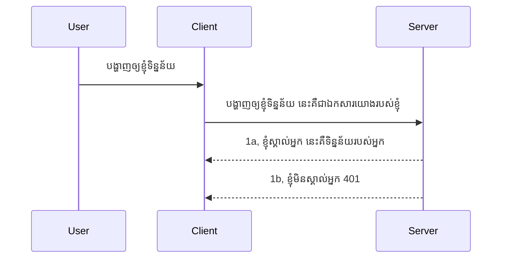

# សម្ងាត់សាមញ្ញ

SDKs MCP គាំទ្រការប្រើប្រាស់ OAuth 2.1 ដែលត្រឹមត្រូវជាដំណើរការពីរបៀបជាច្រើនពាក់ព័ន្ធនឹងគំនិតដូចជា auth server, resource server, ការផ្សាយ credential, ទទួលបានកូដ, ផ្លាស់ប្តូរកូដជាសញ្ញាបត្រ bearer រហូតដល់អ្នកអាចទទួលបានទិន្នន័យ resource របស់អ្នក។ ប្រសិនបើអ្នកមិនទៀងទាត់នឹង OAuth ដែលជារឿងល្អមួយក្នុងការអនុវត្ត ប្រសិនបើអ្នកគួរចាប់ផ្តើមដោយកម្រិតផ្នែក auth មូលដ្ឋានមួយ ហើយបន្តកសាងធ្វើឲ្យមានសុវត្ថិភាពកាន់តែប្រសើរឡើង។ នោះហើយហេតុផលដែលជំពូកនេះមានសម្រាប់ កសាងអ្នកឡើងទៅ auth ដែលកាន់តែចំរូងចំរាស។

## Auth, តើយើងមានន័យថាម៉េច?

Auth គឺជាការសង្ខេបរបស់ authentication និង authorization។ គំនិតគឺថាយើងត្រូវធ្វើពីរជំហាន៖

- **Authentication** គឺជាដំណើរការបញ្ជាក់ថាយើងអនុញ្ញាតឲ្យមនុស្សជាក់លាក់ចូលផ្ទះមែន ឬថាវាភាពត្រឹមត្រូវក្នុងការមានសិទ្ធិ "នៅទីនេះ" ដែលមានន័យថាអាចចូលប្រើប្រាស់ resource server ដែលស្ថិតនៅលើ MCP Server របស់យើង។
- **Authorization** គឺជាការស្នើរកំណត់ថា អ្នកប្រើប្រាស់គួរតែមានសិទ្ធិប្រើប្រាស់ធនធានជាក់លាក់ដែលពួកគេស្នើសុំ ឧទាហរណ៍ អន្ដរាគមន៍លម្អិតលើការបញ្ជាទិញ ឬផលិតផលណាដែលអាចឱ្យអានមិនអាចលុបបាន ជាឧទាហរណ៍ផ្ទៀតផៀត។

## Credentials៖ តើយើងប្រាប់ប្រព័ន្ធថាយើងជាអ្នកណា ដោយរបៀបអ្វី?

ជា ចំពោះអ្នកអភិវឌ្ឍន៍វេបភាគច្រើន សេចក្តីគិតគឺផ្តល់ credential ទៅម៉ាស៊ីនបម្រើ ជាពិសេសជាអ្នកសម្ងាត់ដែលប្រាប់ថាពួកគេចូល "Authentication" ។ Credential នេះភាគច្រើនជាកូដ base64 របស់ឈ្មោះអ្នកប្រើ និងពាក្យសំងាត់ ឬ API key ដែលកំណត់តួអង្គអ្នកប្រើខ្លួនឯងជាក់លាក់។

វាពាក់ព័ន្ធនឹងការផ្ញើតាម header ដែលមានឈ្មោះ "Authorization" ដូចជា៖

```json
{ "Authorization": "secret123" }
```
  
នេះភាគច្រើនត្រូវបានគេហៅថា basic authentication។ របៀបដំណើរការទូទៅបន្ទាប់បន្សំមានដូចជា៖  


ឥឡូវនេះដែលយើងយល់ពីរបៀបដំណើរការពីចំណុចមួយរបស់ flow តើយើងអាចអនុវត្តវាបានយ៉ាងដូចម្តេច? ម៉ាស៊ីនបម្រើវេបភាគច្រើនមានគំនិតហៅថា middleware ដែលជាកូដផ្នែកមួយដំណើរការជាផ្នែកនៃសំណើអាចផ្ទៀងផ្ទាត់ credential ហើយប្រសិនបើ credential ត្រឹមត្រូវ អាចអនុញ្ញាតឲ្យសំណើឆ្លងកាត់បាន។ ប្រសិនបើសំណើគ្មាន credential ត្រឹមត្រូវ អ្នកនឹងទទួលបានកំហុស auth។ មកមើលរបៀបអនុវត្តន៍៖

**Python**

```python
class AuthMiddleware(BaseHTTPMiddleware):
    async def dispatch(self, request, call_next):

        has_header = request.headers.get("Authorization")
        if not has_header:
            print("-> Missing Authorization header!")
            return Response(status_code=401, content="Unauthorized")

        if not valid_token(has_header):
            print("-> Invalid token!")
            return Response(status_code=403, content="Forbidden")

        print("Valid token, proceeding...")
       
        response = await call_next(request)
        # បន្ថែមក្បាលអតិថិជនណាមួយ ឬប្ដូរជាមួយចម្លើយពេលណាមួយ
        return response


starlette_app.add_middleware(CustomHeaderMiddleware)
```
  
នៅទីនេះយើងមាន៖  

- បង្កើត middleware សំខាន់ `AuthMiddleware` ដែលវិធីសាស្រ្ត `dispatch` របស់វាត្រូវបាន web server ហៅ។
- បន្ថែម middleware ទៅម៉ាស៊ីនបម្រើវេប៖

    ```python
    starlette_app.add_middleware(AuthMiddleware)
    ```
  
- សរសេរត្រួតពិនិត្យដែលពិនិត្យថា header Authorization មាន និងសម្ងាត់ត្រូវទេ៖

    ```python
    has_header = request.headers.get("Authorization")
    if not has_header:
        print("-> Missing Authorization header!")
        return Response(status_code=401, content="Unauthorized")

    if not valid_token(has_header):
        print("-> Invalid token!")
        return Response(status_code=403, content="Forbidden")
    ```
  
    បើសម្ងាត់មាននិងត្រឹមត្រូវ យើងអនុញ្ញាតឲ្យសំណើឆ្លងកាត់ដោយហៅ `call_next` ហើយត្រឡប់ឱ្យវិញនូវចម្លើយ។

    ```python
    response = await call_next(request)
    # បញ្ចូលក្បាលអតិថិជនណាមួយ ឬផ្លាស់ប្តូរនៅក្នុងការឆ្លើយតបក្នុងវិធីមួយ
    return response
    ```
  
របៀបដំណើរការរបស់វាគឺ បើសំណើវេបត្រូវធ្វើទៅម៉ាស៊ីនបម្រើ middleware នឹងត្រូវបានហៅ ហើយយោងទៅតាមអនុវត្តន៍វាអាចអនុញ្ញាតឲ្យសំណើឆ្លងកាត់ ឬត្រលប់កំហុសមួយដែលបង្ហាញថាអតិថិជនគ្មានសិទ្ធិបន្ត។

**TypeScript**

នៅទីនេះយើងបង្កើត middleware ជាមួយ framework អ្នកគាំទ្រ Express ដែលបឋមសំណើមុនពេលវាទៅដល់ MCP Server។ នេះគឺជាកូដសម្រាប់វា៖

```typescript
function isValid(secret) {
    return secret === "secret123";
}

app.use((req, res, next) => {
    // ១. តើក្បាលអនុញ្ញាតមានរួចរួមទេ?
    if(!req.headers["Authorization"]) {
        res.status(401).send('Unauthorized');
    }
    
    let token = req.headers["Authorization"];

    // ២. ពិនិត្យភាពត្រឹមត្រូវ។
    if(!isValid(token)) {
        res.status(403).send('Forbidden');
    }

   
    console.log('Middleware executed');
    // ៣. ផ្ញើសំណើទៅជំហានបន្ទាប់ក្នុងបំពង់សំណើ។
    next();
});
```
  
ក្នុងកូដនេះយើង៖

1. ពិនិត្យថា header Authorization មានមែនបើយ៉ាងណា មិនមាន យើងផ្ញើកំហុស 401។
2. បញ្ជាក់ថា credential/token ត្រឹមត្រូវ បើមិនត្រឹមត្រូវ យើងផ្ញើកំហុស 403។
3. ចុងក្រោយ អនុញ្ញាតឲ្យសំណើឆ្លងកាត់ pipeline និងត្រឡប់ធនធានដែលបានស្នើ។

## លំហាត់៖ អនុវត្ត authentication

យើងចាប់យកចំណេះដឹងនេះហើយព្យាយាមអនុវត្តវា។ នេះជាគំរាប់ផែនការជាពីរ៖

ម៉ាស៊ីនបម្រើ  

- បង្កើតម៉ាស៊ីនបម្រើវេប និងគំរូ MCP។
- អនុវត្ត middleware សម្រាប់ម៉ាស៊ីនបម្រើ។

អតិថិជន  

- ផ្ញើសំណើវេបជាមួយ credential តាម header។

### -1- បង្កើតម៉ាស៊ីនបម្រើវេប និងគំរូ MCP

នៅជំហានដំបូង យើងត្រូវបង្កើត instance ម៉ាស៊ីនបម្រើវេប និង MCP Server។

**Python**

នៅទីនេះយើងបង្កើត instance MCP Server, បង្កើត web app starlette ហើយប្រើ uvicorn ដើម្បីដំណើរការ។

```python
# កំពុងបង្កើតម៉ាស៊ីនមេ MCP

app = FastMCP(
    name="MCP Resource Server",
    instructions="Resource Server that validates tokens via Authorization Server introspection",
    host=settings["host"],
    port=settings["port"],
    debug=True
)

# កំពុងបង្កើតកម្មវិធីគេហទំព័រ starlette
starlette_app = app.streamable_http_app()

# បម្រើកម្មវិធីតាមរយៈ uvicorn
async def run(starlette_app):
    import uvicorn
    config = uvicorn.Config(
            starlette_app,
            host=app.settings.host,
            port=app.settings.port,
            log_level=app.settings.log_level.lower(),
        )
    server = uvicorn.Server(config)
    await server.serve()

run(starlette_app)
```
  
ក្នុងកូដនេះយើង៖

- បង្កើត MCP Server
- បង្កើត starlette web app ពី MCP Server, `app.streamable_http_app()`
- រៀបចំ និងបម្រើ web app ប្រើ uvicorn `server.serve()` ។

**TypeScript**

នៅទីនេះយើងបង្កើត instance MCP Server។

```typescript
const server = new McpServer({
      name: "example-server",
      version: "1.0.0"
    });

    // ... កំណត់ធនធានម៉ាស៊ីនបម្រើ ឧបករណ៍ និងការបញ្ជា ...
```
  
ការបង្កើត MCP Server នេះត្រូវធ្វើនៅក្នុងគ្រឿងផ្សំពាណិជ្ជកម្ម POST /mcp ដូច្នេះយើងយកកូដខាងលើចូលមកដូច្នេះ៖

```typescript
import express from "express";
import { randomUUID } from "node:crypto";
import { McpServer } from "@modelcontextprotocol/sdk/server/mcp.js";
import { StreamableHTTPServerTransport } from "@modelcontextprotocol/sdk/server/streamableHttp.js";
import { isInitializeRequest } from "@modelcontextprotocol/sdk/types.js"

const app = express();
app.use(express.json());

// ផែនទីសម្រាប់ផ្ទុកការដឹកជញ្ជូនដោយកំណត់អត្តសញ្ញាណសម័យ
const transports: { [sessionId: string]: StreamableHTTPServerTransport } = {};

// គ្រប់គ្រងសំណើ POST សម្រាប់ការទំនាក់ទំនងពីអ្នកអតិថិជនទៅម៉ាស៊ីនមេ
app.post('/mcp', async (req, res) => {
  // ពិនិត្យអត្តសញ្ញាណសម័យដែលមានស្រាប់
  const sessionId = req.headers['mcp-session-id'] as string | undefined;
  let transport: StreamableHTTPServerTransport;

  if (sessionId && transports[sessionId]) {
    // ប្រើប្រាស់វិធីដឹកជញ្ជូនដែលមានស្រាប់ម្ដងទៀត
    transport = transports[sessionId];
  } else if (!sessionId && isInitializeRequest(req.body)) {
    // សំណើចាប់ផ្តើមថ្មី
    transport = new StreamableHTTPServerTransport({
      sessionIdGenerator: () => randomUUID(),
      onsessioninitialized: (sessionId) => {
        // ផ្ទុកវិធីដឹកជញ្ជូនដោយអត្តសញ្ញាណសម័យ
        transports[sessionId] = transport;
      },
      // ការការពារការប្តូរទីតាំង DNS ត្រូវបានបិទជាប្រពៃណីសម្រាប់ការចម្រុះត្រឡប់ក្រោយ។ ប្រសិនបើអ្នកកំពុងបើកម៉ាស៊ីនមេនេះ
      // នៅក្នុងតំបន់ស្រុក សូមប្រាកដថា បានកំណត់ៈ
      // enableDnsRebindingProtection: true,
      // allowedHosts: ['127.0.0.1'],
    });

    // សម្អាតការដឹកជញ្ជូនពេលបានបិទ
    transport.onclose = () => {
      if (transport.sessionId) {
        delete transports[transport.sessionId];
      }
    };
    const server = new McpServer({
      name: "example-server",
      version: "1.0.0"
    });

    // ... តំឡើងធនធានម៉ាស៊ីនមេ ឧបករណ៍ និងការបញ្ជូនសារ ...

    // តភ្ជាប់ទៅម៉ាស៊ីនមេ MCP
    await server.connect(transport);
  } else {
    // សំណើមិនត្រឹមត្រូវ
    res.status(400).json({
      jsonrpc: '2.0',
      error: {
        code: -32000,
        message: 'Bad Request: No valid session ID provided',
      },
      id: null,
    });
    return;
  }

  // គ្រប់គ្រងសំណើ
  await transport.handleRequest(req, res, req.body);
});

// អ្នកគ្រប់គ្រងដែលអាចប្រើឡើងវិញសម្រាប់សំណើ GET និង DELETE
const handleSessionRequest = async (req: express.Request, res: express.Response) => {
  const sessionId = req.headers['mcp-session-id'] as string | undefined;
  if (!sessionId || !transports[sessionId]) {
    res.status(400).send('Invalid or missing session ID');
    return;
  }
  
  const transport = transports[sessionId];
  await transport.handleRequest(req, res);
};

// គ្រប់គ្រងសំណើ GET សម្រាប់ការជូនដំណឹងពីម៉ាស៊ីនមេទៅអ្នកអតិថិជនតាមរយៈ SSE
app.get('/mcp', handleSessionRequest);

// គ្រប់គ្រងសំណើ DELETE សម្រាប់បញ្ចប់សម័យ
app.delete('/mcp', handleSessionRequest);

app.listen(3000);
```
  
ឥឡូវនេះអ្នកឃើញថាការបង្កើត MCP Server ត្រូវបានផ្លាស់ទីនៅក្នុង `app.post("/mcp")`។

ចូរបន្តជំហានបន្ទាប់បង្កើត middleware ដើម្បីយើងអាចធ្វើការត្រួតពិនិត្យ credential ចូលមក។

### -2- អនុវត្ត middleware សម្រាប់ម៉ាស៊ីនបម្រើ

យើងចាប់ផ្តើមពីផ្នែក middleware បន្ទាប់។ នៅទីនេះយើងនឹងបង្កើត middleware មួយដែលស្វែងរក credential ក្នុង header `Authorization` ហើយផ្ទៀងផ្ទាត់វា។ ប្រសិនបើអនុញ្ញាត វានឹងអនុញ្ញាតសំណើបន្តទៅដំណើរការដែលត្រូវការ (ឧ. រាយម៉ាស៊ីន, អានធនធាន ឬមុខងារ MCP មួយណា ដែលអតិថិជនបានស្នើ)។

**Python**

ក្នុងការបង្កើត middleware យើងត្រូវបង្កើត class ដែលច наслед BaseHTTPMiddleware។ មានផ្នែកចំនួនពីរដែលគួរចាប់អារម្មណ៍៖

- សំណើ (`request`), ដែលយើងអាន header ព័ត៌មានមក។
- `call_next` ជាការហៅក្រោយដែលយើងត្រូវហៅ ប្រសិនបើអតិថិជនបានយក credential ដែលយើងទទួល។

ដំបូង ត្រូវដោះស្រាយករណី header `Authorization` គឺបាត់ ៖

```python
has_header = request.headers.get("Authorization")

# មិនមានក្បាលមួយណា, បរាជ័យជាមួយ 401, ផ្សេង​ទៀតបន្ត។
if not has_header:
    print("-> Missing Authorization header!")
    return Response(status_code=401, content="Unauthorized")
```
  
នៅទីនេះយើងផ្ញើសារបដិសេធ 401 unauthorized ដោយសារគ client មិនគោរពការផ្ទៀងផ្ទាត់។

បន្ទាប់ ប្រសិនបើមាន credential ត្រូវផ្លូវត្រួតពិនិត្យភាពត្រឹមត្រូវដូចជា៖

```python
 if not valid_token(has_header):
    print("-> Invalid token!")
    return Response(status_code=403, content="Forbidden")
```
  
សូមចំណាំថាអ្នកផ្ញើសារបដិសេធ 403 forbidden ខាងលើ។ មកមើល middleware ជាលំអិតខាងក្រោមដែលអនុវត្តរឿងទាំងអស់ដែលបានរៀបរាប់៖

```python
class AuthMiddleware(BaseHTTPMiddleware):
    async def dispatch(self, request, call_next):

        has_header = request.headers.get("Authorization")
        if not has_header:
            print("-> Missing Authorization header!")
            return Response(status_code=401, content="Unauthorized")

        if not valid_token(has_header):
            print("-> Invalid token!")
            return Response(status_code=403, content="Forbidden")

        print("Valid token, proceeding...")
        print(f"-> Received {request.method} {request.url}")
        response = await call_next(request)
        response.headers['Custom'] = 'Example'
        return response

```
  
ល្អណាស់ តើយ៉ាងម៉េចទៅនឹងមុខងារ `valid_token`? នៅទីនេះ៖

```python
# មិនត្រូវប្រើសម្រាប់ផលិតកម្ម - ត្រូវធ្វើឱ្យប្រសើរឡើង!!
def valid_token(token: str) -> bool:
    # លុបចេញពីពាក្យ "Bearer "
    if token.startswith("Bearer "):
        token = token[7:]
        return token == "secret-token"
    return False
```
  
វាគួរតែមានការកែលម្អជាងនេះ។

*សំខាន់៖* អ្នកមិនគួរមានសម្ងាត់ដូចនេះនៅក្នុងកូដរបស់អ្នកទេ។ អ្នកគួរទទួលបានតម្លៃដែលត្រូវធៀបទៅពីប្រភពទិន្នន័យ ឬ IDP (identity service provider) ឬល្អជាងនេះ អោយ IDP ជួយធ្វើការផ្ទៀងផ្ទាត់។

**TypeScript**

ក្នុងការអនុវត្តន៍ជាមួយ Express យើងត្រូវហៅមុខងារ `use` ដែលទទួល middleware functions។

យើងត្រូវជួបប្រទៈ៖

- ធ្វើប្រតិបត្តិការ ជាមួយអង្គភាព request ដើម្បីពិនិត្យ credential ដែលផ្ញើក្នុង `Authorization` property។
- ផ្ទៀងផ្ទាត់ credential ហើយប្រសិនបើត្រឹមត្រូវ អនុញ្ញាតឲ្យសំណើបន្ត ហើយអនុញ្ញាតឲ្យមាន MCP request របស់ អតិថិជនធ្វើតាមដែលត្រូវការ (ឧ. រាយម៉ាស៊ីន អានធនធាន ឬអ្វីផ្សេងទៀតដែលពាក់ព័ន្ធ MCP)។

នៅទីនេះ យើងពិនិត្យថា header `Authorization` មានទេ ប្រសិនបើគ្មាន យើងបញ្ឈប់សំណើ៖

```typescript
if(!req.headers["authorization"]) {
    res.status(401).send('Unauthorized');
    return;
}
```
  
បើ header មិនមាននៅដំបូង អ្នកទទួលបានកំហុស 401។

បន្ទាប់ យើងពិនិត្យថា credential ត្រឹមត្រូវទេ ប្រសិនបើមិនត្រឹមត្រូវ យើងបញ្ឈប់សំណើ និងផ្ញើសារខុសលើកដូចខាងក្រោម៖

```typescript
if(!isValid(token)) {
    res.status(403).send('Forbidden');
    return;
} 
```
  
សូមចំណាំថាឥឡូវអ្នកទទួលបានកំហុស 403។

នេះគឺជាកូដពេញលេញ៖

```typescript
app.use((req, res, next) => {
    console.log('Request received:', req.method, req.url, req.headers);
    console.log('Headers:', req.headers["authorization"]);
    if(!req.headers["authorization"]) {
        res.status(401).send('Unauthorized');
        return;
    }
    
    let token = req.headers["authorization"];

    if(!isValid(token)) {
        res.status(403).send('Forbidden');
        return;
    }  

    console.log('Middleware executed');
    next();
});
```
  
យើងបានរៀបចំម៉ាស៊ីនបម្រើវេបដើម្បីទទួល middleware ដែលពិនិត្យ credential ដែលអតិថិជនសង្ឃឹមផ្ញើមក។ ដូច្នេះអតិថិជនផ្ទាល់ខ្លួនយ៉ាងដូចម្តេច?

### -3- ផ្ញើសំណើវេបទៅជាមួយ credential តាម header

យើងត្រូវធានាថាអតិថិជនផ្ញើ credential តាម header។ ពីព្រោះយើងនឹងប្រើ MCP client ដើម្បីធ្វើវា យើងត្រូវស្វែងយល់ពីរបៀបដែលធ្វើបាន។

**Python**

សម្រាប់អតិថិជន យើងត្រូវផ្ញើ header ជាមួយ credential ដូចជា៖

```python
# កុំដាក់តម្លៃជាកូដរឹង, ដាក់វាឲ្យមានតិចជាងគេក្នុងអថេរបរិយាកាសឬឃ្លាំងទិន្នន័យដែលមានសុវត្ថិភាពជាងនេះ
token = "secret-token"

async with streamablehttp_client(
        url = f"http://localhost:{port}/mcp",
        headers = {"Authorization": f"Bearer {token}"}
    ) as (
        read_stream,
        write_stream,
        session_callback,
    ):
        async with ClientSession(
            read_stream,
            write_stream
        ) as session:
            await session.initialize()
      
            # TODO, អ្វីដែលអ្នកចង់ធ្វើនៅក្នុងអ្នកទទួល, ឧទាហរណ៍ បញ្ជីឧបករណ៍, ហៅឧបករណ៍ និងអ្វីផ្សេងៗ។
```
  
សូមចំណាំថាយើងបំពេញអង្គភាព `headers` ដូចជា ` headers = {"Authorization": f"Bearer {token}"}`។

**TypeScript**

យើងអាចដោះស្រាយនេះក្នុងពីរជំហាន៖

1. បំពេញវត្ថុ configuration ជាមួយ credential របស់យើង។
2. ផ្ញើវត្ថុ configuration ទៅ transport។

```typescript

// កុំកូដរឹតតែតម្លៃដូចដែលបង្ហាញនៅទីនេះ។ យ៉ាងហោចណាស់ មានវាឱ្យជាផលិតផលបរិវេណ និងប្រើអ្វីមួយដូចជា dotenv (ក្នុងរប режима dev)។
let token = "secret123"

// កំណត់វត្ថុជម្រើសចរន្តអ្នកប្រើ
let options: StreamableHTTPClientTransportOptions = {
  sessionId: sessionId,
  requestInit: {
    headers: {
      "Authorization": "secret123"
    }
  }
};

// ផ្ញើវត្ថុជម្រើសទៅចរន្ត
async function main() {
   const transport = new StreamableHTTPClientTransport(
      new URL(serverUrl),
      options
   );
```
  
នៅទីនេះអ្នកឃើញយើងត្រូវបង្កើតអង្គភាព `options` ហើយដាក់ headers របស់យើងនៅក្រោម `requestInit` property។

*សំខាន់៖* ជាបច្ចុប្បន្ន មានបញ្ហាជាច្រើនក្នុងការអនុវត្តនេះ។ ជាដំបូង ការផ្ញើ credential យ៉ាងនេះគឺមានហានិភ័យ លើកលែងតែអ្នកមាន HTTPS នោះ។ ទោះជាយ៉ាងណា credential អាចត្រូវគេឆក់បាន ដូចនេះអ្នកត្រូវមានប្រព័ន្ធដែលអាចលៃតម្រូវ token ឆាប់រហ័ស និងបញ្ចូលការត្រួតពិនិត្យបន្ថែមដូចជា ត្រួតពិនិត្យប្រភពទីតាំង, ពិនិត្យបើសំណើអ្នកពេញលេញ (បែបធ្វើសកម្មភាពបដិសេធជាពី bot) ជាសង្ខេប មានបញ្ហានៅដាច់តែក្នុងការវាយតម្លៃ។

ថាតើបញ្ហា សម្រាប់ API ងាយស្រួលណាស់ ដែលអ្នកមិនចង់ឲ្យនរណាម្នាក់ហៅ API អ្នកដោយគ្មានការផ្ទៀងផ្ទាត់ ការដែលយើងមាននៅទីនេះគឺជាចំណុចចាប់ផ្តើមល្អមួយ។

ដោយយកចិត្ដដូច្នេះ យើងព្យាយាមបង្កើនសុវត្ថិភាពបន្តិចពីរចំណុចតាមរូបแบบ JSON Web Token ដែលមានឈ្មោះក្រៅពិភពជាញឹកញាប់ជា JWT ឬ "JOT" tokens។

## JSON Web Tokens, JWT

ដូច្នេះ យើងកំពុងព្យាយាមបង្កើនពីការផ្ញើ credential ងាយស្រួលណាស់។ តើការកែលម្អភ្លាមៗដែលយើងទទួលបានពីការយក JWT មកប្រើមានអ្វីខ្លះ?

- **ការកែលម្អសុវត្ថិភាព**។ ក្នុង basic auth អ្នកផ្ញើឈ្មោះអ្នកប្រើនិងពាក្យសំងាត់ជា token base64 បន្ទាប់បន្សំ ឬផ្ញើ API key ជារៀងរាល់ពេល នេះបង្កើនហានិភ័យ។ ជាមួយ JWT អ្នកផ្ញើឈ្មោះអ្នកប្រើនិងពាក្យសម្ងាត់ ហើយទទួលបាន token ជំនួសវិញ ដែលមានកំណត់ពេលវេលា ប្រាប់ថាវានឹងផុតកំណត់។ JWT អនុញ្ញាតឲ្យប្រើការគ្រប់គ្រងទូលំទូលាយដោយបំបែកតួអង្គជាច្រើន ដូចជា roles, scopes និង permissions។
- **ភាពពុំមានរដ្ឋ និងការពង្រីក** JWT គឺមានព័ត៌មានអ្នកប្រើប្រាស់គ្រប់គ្រាន់ក្នុងខ្លួន វា​ពិការបង្កើត session ផ្ទុកនៅម៉ាស៊ីនបម្រើ។ Token អាចត្រូវបានផ្ទៀងផ្ទាត់នៅក្នុងតំបន់ក្រោយ។
- **ភាពអាចធ្វើការរួមគ្នា និងសហប្រតិបត្តិការ** JWT ជាគ្រឿងមួយសំខាន់ក្នុង Open ID Connect ហើយប្រើជាមួយអ្នកផ្គត់ផ្គង់ភាពសម្គាល់ដូចជា Entra ID, Google Identity និង Auth0។ វាអាចប្រើការចូលគ្រប់គ្រងតែមួយនិងច្រើនទៀត ដែលធ្វើឲ្យមានគុណភាពសម្រាប់ឧស្សាហកម្មធំ។
- **ភាពចំណុច និងភាពបត់បែន** JWT អាចប្រើជាមួយ API Gateways ផ្សេងៗដូចជា Azure API Management, NGINX និងច្រើនទៀត។ វាគាំទ្រករណី authentication ផ្សេងៗ និងការប្រាស្រ័យទាក់ទងម៉ាស៊ីនបម្រើទៅម៉ាស៊ីនបម្រើ រួមមាន impersonation និង delegation។
- **ប្រសិទ្ធភាព និងការផ្ទុក** JWT អាចត្រូវបានផ្ទុកនៅក្រៅបន្ទាន់បន្ទាប់ពី decode ដែលកាត់បន្ថយការតម្រឹមបត់គល់។ វាជួយពិសេសសម្រាប់កម្មវិធីដែលមានចរាចរណ៍ខ្ពស់ ដោយបង្កើន throughput និងកាត់បន្ថយផ្ទុកលើហ៊្វ្រេមវ័រដែលបានជ្រើស។
- **មុខងាររបស់វា** វាក៏គាំទ្រការត្រួតពិនិត្យ (introspection) និងការបដិសេធ token (revocation) ផងដែរ។

ជាមួយអត្ថប្រយោជន៍ទាំងនេះ ចូរមើលរបៀបដែលយើងអាចរីកចម្រើនការអនុវត្តរបស់យើងទៅកម្រិតបន្ទាប់បាន។

## បំលែង ការផ្ទៀងផ្ទាត់សាមញ្ញទៅ JWT

ដូច្នេះ ការផ្លាស់ប្តូរបំផុតដែលយើងត្រូវធ្វើ នៅកម្រិតដ៏ខ្ពស់គឺ៖

- **រៀនបង្កើត token JWT** ហើយធ្វើឲ្យវាស្រេចក្នុងការផ្ញើពី client ទៅ server។
- **ផ្ទៀងផ្ទាត់ token JWT** ហើយប្រសិនបើត្រឹមត្រូវ អនុញ្ញាតឲ្យ client ទទួលធនធានរបស់យើង។
- **ផ្ទុក token ក្នុងរបៀបសុវត្ថិភាព**។ របៀបផ្ទុក token នេះ។
- **ការពារបណ្តាផ្លូវ**។ យើងត្រូវការការពារបណ្តាផ្លូវ និងមុខងារ MCP ជាក់លាក់។
- **បន្ថែម refresh tokens**។ ធ្វើឲ្យមាន token ដែលមានអាយុកាលខ្លី ប៉ុន្តែមិនភ្លេច refresh token ដែលមានអាយុកាលវែង និងអាចប្រើសម្រាប់ទទួល token ថ្មីបើ token ផុតកំណត់។ ការត្រលប់និងយុទ្ធសាស្រ្តកែប្រែវា។

### -1- បង្កើត token JWT

ដំបូង token JWT មានផ្នែកខាងក្រោម៖

- **header** អាល់ហ្គរីធម៏ដែលប្រើ និងប្រភេទ token។
- **payload** ព័ត៌មានអំពី token មុខងារ ដូចជា sub (អ្នកប្រើ ឬអង្គភាពដែល token ផ្ដល់សិទ្ធ) exp (ពេលវាផុតកំណត់) role (តួនាទី)។
- **signature** ចុះហត្ថលេខាជាមួយសម្ងាត់ឬកូនសោឯកជន។

សម្រាប់នេះ យើងត្រូវបង្កើត header, payload និង token ដែលបាន encode។

**Python**

```python

import jwt
import jwt
from jwt.exceptions import ExpiredSignatureError, InvalidTokenError
import datetime

# គ្រឿងចក្រ​ឯកជន​ដែលប្រើសម្រាប់ចុះហត្ថលេខា JWT
secret_key = 'your-secret-key'

header = {
    "alg": "HS256",
    "typ": "JWT"
}

# ព័ត៌មានអ្នកប្រើ និងការទាមទាររបស់វា និងពេលផុតកំណត់
payload = {
    "sub": "1234567890",               # ប្រធានបទ (អត្តសញ្ញាណអ្នកប្រើ)
    "name": "User Userson",                # ការទាមទារផ្ទាល់ខ្លួន
    "admin": True,                     # ការទាមទារផ្ទាល់ខ្លួន
    "iat": datetime.datetime.utcnow(),# បានចេញផ្សាយនៅ
    "exp": datetime.datetime.utcnow() + datetime.timedelta(hours=1)  # ផុតកំណត់
}

# កូដបំលែងវា
encoded_jwt = jwt.encode(payload, secret_key, algorithm="HS256", headers=header)
```
  
ក្នុងកូដខាងលើ យើងបាន៖

- កំណត់ header ប្រើ HS256 ជា algorithm ហើយប្រភេទ token ជា JWT។
- បង្កើត payload ដែលមាន បំណះ (subject) ឬ user id, username, role, ពេលវាគេលើកដំបូង និងពេលវាផុតកំណត់ ដែលអនុវត្តរបស់មុខងារកំណត់ពេល។

**TypeScript**

នៅទីនេះយើងត្រូវការទ្រទ្រង់ជំនួយណាមួយ ដើម្បីបង្កើត token JWT ។

Dependencies

```sh

npm install jsonwebtoken
npm install --save-dev @types/jsonwebtoken
```
  
ឥឡូវនេះដែលមាន dependencies អញ្ចឹងចូរបង្កើត header, payload ហើយតាមរយៈវា បង្កើត token encode ។

```typescript
import jwt from 'jsonwebtoken';

const secretKey = 'your-secret-key'; // ប្រើអថេរពិសេសក្នុងការផលិត

// កំណត់ payload
const payload = {
  sub: '1234567890',
  name: 'User usersson',
  admin: true,
  iat: Math.floor(Date.now() / 1000), // បានចេញនៅ
  exp: Math.floor(Date.now() / 1000) + 60 * 60 // មួយម៉ោងនឹងផុតកំណត់
};

// កំណត់ header (ជាជម្រើស, jsonwebtoken កំណត់លំនាំដើម)
const header = {
  alg: 'HS256',
  typ: 'JWT'
};

// បង្កើត token
const token = jwt.sign(payload, secretKey, {
  algorithm: 'HS256',
  header: header
});

console.log('JWT:', token);
```
  
token នេះ :

បានចុះហត្ថ HS256
មានសុពលភាពរយៈពេល 1 ម៉ោង
មាន claims ដូចជា sub, name, admin, iat និង exp។

### -2- ផ្ទៀងផ្ទាត់ token

យើងក៏ត្រូវការផ្ទៀងផ្ទាត់ token ផង ដោយធ្វើវានៅលើម៉ាស៊ីនបម្រើ ដើម្បីធានាថាអ្វីដែល client ផ្ញើមក ត្រឹមត្រូវពិតប្រាកដ។ មានការត្រួតពិនិត្យជាច្រើនដែលយើងគួរធ្វើ ចាប់ពីរចនាសម្ព័ន្ធរបស់វា រហូតដល់ភាពត្រឹមត្រូវ។ អ្នកត្រូវបានលើកទឹកចិត្តឲ្យបន្ថែមការត្រួតពិនិត្យបន្ថែមដូចជា ពិនិត្យថាអ្នកប្រើប្រាស់មាននៅក្នុងប្រព័ន្ធរបស់អ្នក និងបន្ថែម។

ក្នុងការផ្ទៀងផ្ទាត់ token ត្រូវ decode វាមុន ដើម្បីអានហើយចាប់ផ្តើមពិនិត្យ៖

**Python**

```python

# បកស្រាយ និងផ្ទៀងផ្ទាត់ JWT
try:
    decoded = jwt.decode(token, secret_key, algorithms=["HS256"])
    print("✅ Token is valid.")
    print("Decoded claims:")
    for key, value in decoded.items():
        print(f"  {key}: {value}")
except ExpiredSignatureError:
    print("❌ Token has expired.")
except InvalidTokenError as e:
    print(f"❌ Invalid token: {e}")

```
  
ក្នុងកូដនេះ យើងហៅ `jwt.decode` ។ ប្រើ token, សម្ងាត់ key និង algorithm ដែលបានជ្រើស។ សូមចំណាំយើងប្រើ try-catch ដើម្បីចាប់ករណី validate បរាជ័យ។

**TypeScript**

នៅទីនេះយើងត្រូវហៅ `jwt.verify` ដើម្បីទទួលបាន token ដែល decode ហើយអាចធ្វើការវិភាគបន្ថែមបាន។ ប្រសិនបើហៅនេះបរាជ័យ មិនត្រឹមត្រូវនោះទេ ឬបានផុតសុពលភាព។

```typescript

try {
  const decoded = jwt.verify(token, secretKey);
  console.log('Decoded Payload:', decoded);
} catch (err) {
  console.error('Token verification failed:', err);
}
```
  
សម្គាល់៖ ដូចបានរៀបរាប់មុន វាសមហើយបន្ថែមការត្រួតពិនិត្យបន្ថែម ដើម្បីធានា token នេះប្រាប់ពីអ្នកប្រើប្រាស់ នៅក្នុងប្រព័ន្ធរបស់យើង និងប្រើប្រាស់សិទិ្ធត្រឹមត្រូវ។

បន្ទាប់ យើងមកមើលការគ្រប់គ្រងសិទិ្ធលើតួនាទី RBAC (Role Based Access Control) ដែលគេហៅសង្ខេបថា RBAC។
## ការបន្ថែមការត្រួតពិនិត្យការចូលដំណើរការដោយផ្អែកលើតួនាទី

គំនិតគឺយើងចង់បង្ហាញថាតួនាទីផ្សេងៗមានសិទ្ធិខុសគ្នា។ ឧទាហរណ៍ យើងសន្មត់ថាអ្នកគ្រប់គ្រងអាចធ្វើអ្វីគ្រប់យ៉ាងបាន ហើយអ្នកប្រើធម្មតាអាចអាន/សរសេរ និងភ្ញៀវអាចអានតែប៉ុណ្ណោះ។ ដូច្នេះ ទីនេះគឺជាម៉ាស៊ិនសិទ្ធិដែលអាចមាន៖

- Admin.Write  
- User.Read  
- Guest.Read  

យើងមកមើលពីរបៀបដែលយើងអាចអនុវត្តការត្រួតពិនិត្យដូច្នេះដោយប្រើ middleware។ Middleware អាចបន្ថែមបានលើមុខងារបញ្ជាផ្លូវ និងសម្រាប់មុខងារទាំងអស់។

**Python**

```python
from starlette.middleware.base import BaseHTTPMiddleware
from starlette.responses import JSONResponse
import jwt

# កុំមានសម្ងាត់នោះនៅក្នុងកូដដូច្នេះនេះគឺសម្រាប់គោលបំណងបង្ហាញប៉ុណ្ណោះ។ អានវាពីកន្លែងដែលមានសុវត្ថិភាព។
SECRET_KEY = "your-secret-key" # ដាក់វានៅក្នុងអថេរ env
REQUIRED_PERMISSION = "User.Read"

class JWTPermissionMiddleware(BaseHTTPMiddleware):
    async def dispatch(self, request, call_next):
        auth_header = request.headers.get("Authorization")
        if not auth_header or not auth_header.startswith("Bearer "):
            return JSONResponse({"error": "Missing or invalid Authorization header"}, status_code=401)

        token = auth_header.split(" ")[1]
        try:
            decoded = jwt.decode(token, SECRET_KEY, algorithms=["HS256"])
        except jwt.ExpiredSignatureError:
            return JSONResponse({"error": "Token expired"}, status_code=401)
        except jwt.InvalidTokenError:
            return JSONResponse({"error": "Invalid token"}, status_code=401)

        permissions = decoded.get("permissions", [])
        if REQUIRED_PERMISSION not in permissions:
            return JSONResponse({"error": "Permission denied"}, status_code=403)

        request.state.user = decoded
        return await call_next(request)


```
  
មានវិធីខ្លះៗក្នុងការបន្ថែម middleware ដូចខាងក្រោម៖

```python

# ជម្រើស 1: បន្ថែម middleware នៅពេលកំពុងបង្កើតកម្មវិធី starlette
middleware = [
    Middleware(JWTPermissionMiddleware)
]

app = Starlette(routes=routes, middleware=middleware)

# ជម្រើស 2: បន្ថែម middleware បន្ទាប់ពីកម្មវិធី starlette ត្រូវបានបង្កើតរួច
starlette_app.add_middleware(JWTPermissionMiddleware)

# ជម្រើស 3: បន្ថែម middleware សម្រាប់មួយមარშុយ
routes = [
    Route(
        "/mcp",
        endpoint=..., # ប្រតិបត្តិករ
        middleware=[Middleware(JWTPermissionMiddleware)]
    )
]
```
  
**TypeScript**

យើងអាចប្រើ `app.use` និង middleware មួយដែលនឹងរត់សម្រាប់សំណើទាំងអស់។  

```typescript
app.use((req, res, next) => {
    console.log('Request received:', req.method, req.url, req.headers);
    console.log('Headers:', req.headers["authorization"]);

    // 1. ពិនិត្យមើលថាតើក្បាលសិទ្ធិបានផ្ញើរឬនៅ

    if(!req.headers["authorization"]) {
        res.status(401).send('Unauthorized');
        return;
    }
    
    let token = req.headers["authorization"];

    // 2. ពិនិត្យមើលថាតើស្លាកសက္គណះត្រឹមត្រូវ
    if(!isValid(token)) {
        res.status(403).send('Forbidden');
        return;
    }  

    // 3. ពិនិត្យមើលថាតើអ្នកប្រើប្រាស់ស្លាកសက္គណះមាននៅក្នុងប្រព័ន្ធរបស់យើងឬទេ
    if(!isExistingUser(token)) {
        res.status(403).send('Forbidden');
        console.log("User does not exist");
        return;
    }
    console.log("User exists");

    // 4. ធ្វើការផ្ទៀងផ្ទាត់ថាស្លាកសက္គណះមានសិទ្ធិត្រឹមត្រូវ
    if(!hasScopes(token, ["User.Read"])){
        res.status(403).send('Forbidden - insufficient scopes');
    }

    console.log("User has required scopes");

    console.log('Middleware executed');
    next();
});

```
  
មានរឿងមួយចំនួនដែលយើងអាចអោយ middleware របស់យើងធ្វើ និងដែល middleware ត្រូវធ្វើ សំខាន់ៗគឺ៖

1. ពិនិត្យមើលថាអ្នកប្រើមាន authorization header ទេឬនៅ  
2. ពិនិត្យមើលថា token ត្រឹមត្រូវ យើងហៅ `isValid` ដែលជាវិធីសាស្រ្តដែលយើងបានសរសេរដើម្បីពិនិត្យភាពសុចរិត និងត្រឹមត្រូវរបស់ token JWT។  
3. ធ្វើការបញ្ជាក់ថាអ្នកប្រើមាននៅក្នុងប្រព័ន្ធរបស់យើង យើងគួរតែពិនិត្យនេះ។  

   ```typescript
    // អ្នកប្រើនៅក្នុងDB
   const users = [
     "user1",
     "User usersson",
   ]

   function isExistingUser(token) {
     let decodedToken = verifyToken(token);

     // ធ្វើការ ត្រួតពិនិត្យថា អ្នកប្រើមាននៅក្នុងDBឬទេ
     return users.includes(decodedToken?.name || "");
   }
   ```
  
ខាងលើនេះ យើងបានបង្កើតបញ្ជី `users` ងាយៗមួយ ដែលគួរតែត្រូវបានរក្សាទុកនៅក្នុងមូលដ្ឋានទិន្នន័យ។

4. លើសពីនេះ យើងគួរតែពិនិត្យថា token មានសិទ្ធិត្រឹមត្រូវ។

   ```typescript
   if(!hasScopes(token, ["User.Read"])){
        res.status(403).send('Forbidden - insufficient scopes');
   }
   ```
  
នៅក្នុងកូដខាងលើពី middleware យើងពិនិត្យមើលថា token មានសិទ្ធิ User.Read ប្រសិនបើគ្មាន យើងបញ្ចូនសារ error 403។ ខាងក្រោមជាវិធីជំនួយ `hasScopes`។

   ```typescript
   function hasScopes(scope: string, requiredScopes: string[]) {
     let decodedToken = verifyToken(scope);
    return requiredScopes.every(scope => decodedToken?.scopes.includes(scope));
  }  
   ```

Have a think which additional checks you should be doing, but these are the absolute minimum of checks you should be doing.

Using Express as a web framework is a common choice. There are helpers library when you use JWT so you can write less code.

- `express-jwt`, helper library that provides a middleware that helps decode your token.
- `express-jwt-permissions`, this provides a middleware `guard` that helps check if a certain permission is on the token.

Here's what these libraries can look like when used:

```typescript
const express = require('express');
const jwt = require('express-jwt');
const guard = require('express-jwt-permissions')();

const app = express();
const secretKey = 'your-secret-key'; // put this in env variable

// Decode JWT and attach to req.user
app.use(jwt({ secret: secretKey, algorithms: ['HS256'] }));

// Check for User.Read permission
app.use(guard.check('User.Read'));

// multiple permissions
// app.use(guard.check(['User.Read', 'Admin.Access']));

app.get('/protected', (req, res) => {
  res.json({ message: `Welcome ${req.user.name}` });
});

// Error handler
app.use((err, req, res, next) => {
  if (err.code === 'permission_denied') {
    return res.status(403).send('Forbidden');
  }
  next(err);
});

```
  
ឥឡូវនេះអ្នកបានឃើញរបៀបដែល middleware អាចត្រូវបានប្រើសម្រាប់ authentication និង authorization ទាំងពីរ តើយើងធ្វើអ្វីបន្ថែមសម្រាប់ MCP ទេ? យើងមកស្វែងរកនៅផ្នែកបន្ទាប់។

### -3- បន្ថែម RBAC ទៅ MCP

អ្នកបានឃើញរហូតមកថាតើអ្នកអាចបន្ថែម RBAC តាម middleware បានយ៉ាងដូចម្តេច ប៉ុន្តែក្នុង MCP គ្មានវិធីងាយស្រួលក្នុងការបន្ថែម RBAC សម្រាប់មុខងារ MCP ក្នុងមួយទេ ដូច្នេះតើយើងធ្វើដូចម្តេច? ល្អ យើងគ្រាន់តែមុខទហៅកូដដូចខាងក្រោមដើម្បីពិនិត្យថាអតិថិជនមានសិទ្ធិក្នុងការហៅឧបករណ៍ជាក់លាក់។

អ្នកមានជម្រើសជាច្រើនក្នុងការប្រព្រឹត្តទៅ RBAC សម្រាប់មុខងារផ្សេងគ្នា ខាងក្រោមជាឧទាហរណ៍៖

- បន្ថែមការពិនិត្យសម្រាប់ឧបករណ៍ មធ្យោបាយ prompt សំរាប់កន្លែងដែលអ្នកត្រូវបានពិនិត្យមើលកម្រិតសិទ្ធិ។

   **python**

   ```python
   @tool()
   def delete_product(id: int):
      try:
          check_permissions(role="Admin.Write", request)
      catch:
        pass # អតិថិជនបរាជ័យក្នុងការ​ផ្តល់អំណាច កើតមានកំហុស​អំណាច
   ```
  
   **typescript**

   ```typescript
   server.registerTool(
    "delete-product",
    {
      title: Delete a product",
      description: "Deletes a product",
      inputSchema: { id: z.number() }
    },
    async ({ id }) => {
      
      try {
        checkPermissions("Admin.Write", request);
        // ត្រូវធ្វើ, ផ្ញើ id ទៅ productService និង remote entry
      } catch(Exception e) {
        console.log("Authorization error, you're not allowed");  
      }

      return {
        content: [{ type: "text", text: `Deletected product with id ${id}` }]
      };
    }
   );
   ```


- ប្រើវិធីសាស្រ្តម៉ាស៊ីនបម្រើទំនើប និងអ្នកចែកចាយសំណើ ដើម្បីកាត់បន្ថយកន្លែងដែលអ្នកត្រូវតែធ្វើការពិនិត្យ។

   **Python**

   ```python
   
   tool_permission = {
      "create_product": ["User.Write", "Admin.Write"],
      "delete_product": ["Admin.Write"]
   }

   def has_permission(user_permissions, required_permissions) -> bool:
      # user_permissions: បញ្ជីសិទ្ធិដែលអ្នកប្រើមាន
      # required_permissions: បញ្ជីសិទ្ធិដែលត្រូវការសម្រាប់ឧបករណ៍
      return any(perm in user_permissions for perm in required_permissions)

   @server.call_tool()
   async def handle_call_tool(
     name: str, arguments: dict[str, str] | None
   ) -> list[types.TextContent]:
    # សន្និដ្ឋាន request.user.permissions គឺជាបញ្ជីសិទ្ធិសម្រាប់អ្នកប្រើ
     user_permissions = request.user.permissions
     required_permissions = tool_permission.get(name, [])
     if not has_permission(user_permissions, required_permissions):
        # បង្ហោះកំហុស "អ្នកមិនមានសិទ្ធិហៅឧបករណ៍ {name}"
        raise Exception(f"You don't have permission to call tool {name}")
     # បន្តនិងហៅឧបករណ៍
     # ...
   ```   
   

   **TypeScript**

   ```typescript
   function hasPermission(userPermissions: string[], requiredPermissions: string[]): boolean {
       if (!Array.isArray(userPermissions) || !Array.isArray(requiredPermissions)) return false;
       // ត្រឡប់មក true ប្រសិនបើអ្នកប្រើមានសិទ្ធិត្រូវការច្រើនជាងមួយយ៉ាងហោចណាស់
       
       return requiredPermissions.some(perm => userPermissions.includes(perm));
   }
  
   server.setRequestHandler(CallToolRequestSchema, async (request) => {
      const { params: { name } } = request;
  
      let permissions = request.user.permissions;
  
      if (!hasPermission(permissions, toolPermissions[name])) {
         return new Error(`You don't have permission to call ${name}`);
      }
  
      // បន្តទៅ..
   });
   ```
  
   ចំណាំ អ្នកត្រូវមើលថា middleware របស់អ្នកបានផ្ដល់ token ដែលបានdecode ទៅនៅលើ user property របស់សំណើ ដើម្បីឲ្យកូដខាងលើមានភាពសាមញ្ញ។

### សង្ខេប

ឥឡូវនេះយើងបានពិភាក្សាអំពីរបៀបបន្ថែមការគាំទ្រ RBAC ទូទៅ និងសម្រាប់ MCP ជាក់លាក់ វេលានេះគឺការព្យាយាមអនុវត្តសុវត្ថិភាពដោយខ្លួនឯង ដើម្បីធានាថាអ្នកបានយល់ពីគំនិតដែលបានបង្ហាញ។  

## ការងារ ១៖ សាងសង់ម៉ាស៊ីនបម្រើ mcp និងម៉ាស៊ីនអតិថិជន mcp ដោយប្រើការផ្ទៀងផ្ទាត់មូលដ្ឋាន

នៅទីនេះ អ្នកនឹងយកអ្វីដែលបានរៀនពីការផ្ញើព័ត៌មានសម្គាល់តាមរយៈ header។

## ដំណោះស្រាយ ១

[ដំណោះស្រាយ ១](./code/basic/README.md)

## ការងារ ២៖ បឺតកម្រិតដំណោះស្រាយពីការងារ ១ ដើម្បីប្រើ JWT

យកដំណោះស្រាយទីមួយមកតែពេលនេះ យើងត្រូវធ្វើឲ្យកាន់តែប្រសើរឡើង។  

ជំនួសការប្រើប្រាស់ Basic Auth យើងត្រូវប្រើ JWT។  

## ដំណោះស្រាយ ២

[ដំណោះស្រាយ ២](./solution/jwt-solution/README.md)

## ការប្រកួតប្រជែង

បន្ថែមការត្រួតពិនិត្យ RBAC តាមឧបករណ៍ដែលយើងបានពិពណ៌នានៅក្នុងផ្នែក "បន្ថែម RBAC ទៅ MCP"។

## សង្ខេប

សង្ឃឹមថាអ្នកបានរៀនច្រើនក្នុងជំពូកនេះ ចាប់ពីគ្មានសុវត្ថិភាពអី ទៅដល់សុវត្ថិភាពមូលដ្ឋាន ទៅដល់ JWT និងរបៀបដែលវាអាចបន្ថែមទៅ MCP។

យើងបានបង្កើតមូលដ្ឋានមាំមួនជាមួយ JWT ផ្ទាល់ខ្លួន ប៉ុន្តែពេលយើងធំធេងឡើង យើងកំពុងផ្លាស់ប្តូរទៅគំរូអត្តសញ្ញាណដែលមានស្តង់ដារ។ ការទទួលយក IdP ដូចជា Entra ឬ Keycloak ឲ្យយើងអាចបញ្ចេញកាតំរូង ចុះតាមតម្រឹម និងគ្រប់គ្រងរយៈពេលជីវិត token នៅលើវេទិកាដែលទទួលបានទុកចិត្ដ — ធ្វើឲ្យយើងអាចផ្តោតលើតុល្យភាពកម្មវិធី និងបទពិសោធន៍អ្នកប្រើ។  

សម្រាប់រឿងនោះ យើងមានជំពូក​ [ខ្ពស់កម្រិត​ អំពី Entra](../../05-AdvancedTopics/mcp-security-entra/README.md)។  

## តើបន្ទាប់មក?

- បន្ទាប់: [ការតំឡើងម៉ាស៊ីនផ្ដល់សេវ MCP](../12-mcp-hosts/README.md)

---

<!-- CO-OP TRANSLATOR DISCLAIMER START -->
**ការបដិសេធ**៖  
ឯកសារនេះត្រូវបានបកប្រែដោយប្រើសេវាកម្មបកប្រែ AI [Co-op Translator](https://github.com/Azure/co-op-translator)។ ខណៈពេលដែលយើងខិតខំព្យាយាមរកភាពត្រឹមត្រូវ សូមយល់ឱ្យបានថាការបកប្រែដោយស្វ័យប្រវត្តិសម្តែងអាចមានកំហុស ឬការប្រកួតប្រជែងខុស។ ឯកសារដើមក្នុងភាសាមូលដ្ឋានគួរត្រូវបានចាត់ទុកជាដើមទុនស៊ីជម្រៅ។ សម្រាប់ព័ត៌មានសំខាន់ៗ យើងណែនាំឱ្យប្រើការបកប្រែដោយមនុស្សជំនាញវិជ្ជាជីវៈ។ យើងមិនទទួលខុសត្រូវចំពោះការយល់ច្រឡំ ឬការបំភាន់ដែលកើតមានពីការប្រើប្រាស់ការបកប្រែនេះឡើយ។
<!-- CO-OP TRANSLATOR DISCLAIMER END -->