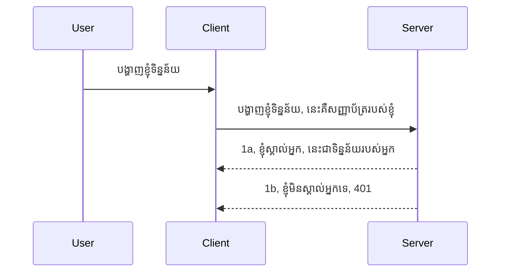

# ងាយស្រួល auth

MCP SDKs គាំទ្រការប្រើប្រាស់ OAuth 2.1 ដែលនិយាយតាមការពិតគឺជាដំណើរការមួយដែលមានច្រើនជំហានជាមួយគំនិតដូចជា auth server, resource server, ការផ្ញើអត្តសញ្ញាណប័ណ្ណ, ទទួលបានកូដ, ប្តូរកូដទៅជា bearer token រហូតដល់អ្នកអាចទទួលបានទិន្នន័យធនធានរបស់អ្នកបានចុងក្រោយ។ ប្រសិនបើអ្នកមិនស្គាល់ OAuth ដែលជារឿងដ៏ល្អមួយក្នុងការអនុវត្តន៍ទេ នោះវាជាឧបាយសំខាន់ក្នុងការចាប់ផ្តើមពីកម្រិត auth មូលដ្ឋានមួយហើយបង្កើតឡើងវិញដល់សុវត្ថិភាពល្អប្រសើរឡើង។ ដូច្នេះហេតុអ្វីបានជាបទនេះមាននៅទីនេះ ដើម្បីរុំរើបអ្នកទៅកាន់ auth ដែលមានកម្រិតខ្ពស់ជាងមុន។

## Auth, តើយើងមានន័យដូចម្តេច?

Auth គឺជាការសង្ខេបសម្រាប់ការផ្ទៀងផ្ទាត់និងការអនុញ្ញាត។ គំនិតគឺថាយើងត្រូវធ្វើរឿងពីរនេះ:

- **ការផ្ទៀងផ្ទាត់អត្តសញ្ញាណ** ដែលជាដំណើរការរកឃើញថាតើយើងអនុញ្ញាតឲ្យមនុស្សម្នាក់ចូលទៅក្នុងផ្ទះរបស់យើងទេ ដើម្បីបញ្ជាក់ថាពួកគេចូលកាន់ទីនេះបានដែលមានសិទ្ធិចូលប្រើ resource server ដែលជាកន្លែងដែលមុខងារ MCP Server របស់យើងស្ថិតនៅ។
- **ការអនុញ្ញាត** គឺជាការស្វែងរកថាតើអ្នកប្រើម្នាក់គួរតែមានសិទ្ធិចូលប្រើធនធានជាក់លាក់ដែលពួកគេស្នើរសុំ ដូចជាលើបញ្ជាទិញនេះ ឬផលិតផលទាំងនេះ ឬតើពួកគេសម្របសម្រូលអានមាតិកាប៉ុន្មាន ប៉ុន្តែមិនអាចលុបបានជាករណីផ្សេងទៀត។

## អត្តសញ្ញាណប័ណ្ណ៖ តើយើងប្រាប់ប្រព័ន្ធយ៉ាងដូចម្តេចថាយើង ជា អ្នកណា

មិនប្រាកដថា អ្នកអភិវឌ្ឍន៍គេហទំព័រច្រើនភាគច្រើនចាប់ផ្តើមគិតក្នុងលក្ខណៈផ្តល់អត្តសញ្ញាណប័ណ្ណទៅម៉ាស៊ីនបម្រើ មធ្យោបាយភាគច្រើនគឺជាសម្ងាត់មួយដែលនិយាយថាពួកគេចូលសម្របសម្រូល "Authentication"។ អត្តសញ្ញាណប័ណ្ណនេះជាភាគច្រើនជារូបមន្ត base64 ដែលបម្រែបម្រើពីឈ្មោះអ្នកប្រើនិងពាក្យសម្ងាត់ ឬក៏កូនសោ API មួយដែលកំណត់លទ្ធភាពអ្នកប្រើម្នាក់ជាក់លាក់។

នេះរួមមានការផ្ញើតាម header មួយដែលហៅថា "Authorization" ដូចខាងក្រោម៖

```json
{ "Authorization": "secret123" }
```

ភាគច្រើនហៅថា basic authentication។ របៀបដំណើរការមូលដ្ឋានទាំងមូលគឺដូចខាងក្រោម៖


ឥឡូវនេះដែលយើងយល់ពីរបៀបដំណើរការពីលក្ខខណ្ឌលំហូរ តើយើងអាចអនុវត្តរវាងដូចម្តេច? ភាគច្រើនម៉ាស៊ីនបម្រើគេហទំព័រមានគំនិត middleware មួយ គឺកូដមួយដែលដំណើរការជាផ្នែកនៃសំណើដែលអាចផ្ទៀងផ្ទាត់អត្តសញ្ញាណប័ណ្ណបាន ហើយបើអត្តសញ្ញាណប័ណ្ណត្រឹមត្រូវ អាចអនុញ្ញាតឲ្យសំណើអាចឆ្លងកាត់។ ប្រសិនបើសំណើមិនមានអត្តសញ្ញាណប័ណ្ណត្រឹមត្រូវ នោះអ្នកនឹងទទួលបានបញ្ហាស្នាក់នៅ auth error។ យើងមកមើលរបៀបដែលអាចអនុវត្តបាន៖

**Python**

```python
class AuthMiddleware(BaseHTTPMiddleware):
    async def dispatch(self, request, call_next):

        has_header = request.headers.get("Authorization")
        if not has_header:
            print("-> Missing Authorization header!")
            return Response(status_code=401, content="Unauthorized")

        if not valid_token(has_header):
            print("-> Invalid token!")
            return Response(status_code=403, content="Forbidden")

        print("Valid token, proceeding...")
       
        response = await call_next(request)
        # បន្ថែមក្បាលអតិថិជនណាមួយ ឬផ្លាស់ប្តូរឆ្លើយតបមួយក្នុងវិធីណាមួយ
        return response


starlette_app.add_middleware(CustomHeaderMiddleware)
```

នៅទីនេះយើងមានៈ

- បង្កើត middleware មួយហៅថា `AuthMiddleware` ដែលមានវិធីសាស្រ្ត `dispatch` ត្រូវបានហៅដោយម៉ាស៊ីនបម្រើគេហទំព័រ។
- បន្ថែម middleware ទៅម៉ាស៊ីនបម្រើ:

    ```python
    starlette_app.add_middleware(AuthMiddleware)
    ```

- សរសេរផ្នែក logic ដើម្បីផ្ទៀងផ្ទាត់ថាតើ header Authorization មានរួចហើយ បើសម្ងាត់ដែលបានផ្ញើត្រឹមត្រូវ ឬអត់៖

    ```python
    has_header = request.headers.get("Authorization")
    if not has_header:
        print("-> Missing Authorization header!")
        return Response(status_code=401, content="Unauthorized")

    if not valid_token(has_header):
        print("-> Invalid token!")
        return Response(status_code=403, content="Forbidden")
    ```

    ប្រសិនបើសម្ងាត់មាននិងត្រឹមត្រូវ យើងអនុញ្ញាតឲ្យសំណើឆ្លងកាត់ដោយហៅ `call_next` ហើយត្រឡប់តម្លៃថា response។

    ```python
    response = await call_next(request)
    # បន្ថែមក្បាលអតិថិជនណាមួយ ឬផ្លាស់ប្តូរ ក្នុងការឆ្លើយតបមួយក្នុងរបៀបអ្វីមួយ
    return response
    ```

របៀបដំណើរការគឺប្រសិនបើសំណើគេហទំព័រត្រូវបានធ្វើទៅម៉ាស៊ីនបម្រើ middleware នឹងត្រូវបានហៅហើយដោយការអនុវត្តន៍របស់វា វានឹងឲ្យឲ្យសំណើឆ្លងកាត់ ឬបញ្ចប់ដោយត្រឡប់ error មួយដែលបង្ហាញថា client មិនត្រូវបានអនុញ្ញាតឲ្យបន្ត។

**TypeScript**

នៅទីនេះយើងបង្កើត middleware ជាមួយ Express framework ដែលពេញនិយម និងរាំងស្ទះសំណើមុនពេលវាទៅដល់ MCP Server។ នេះជា​កូដសម្រាប់វា៖

```typescript
function isValid(secret) {
    return secret === "secret123";
}

app.use((req, res, next) => {
    // 1. មានក្បាលអធិបតីភាពទេ?
    if(!req.headers["Authorization"]) {
        res.status(401).send('Unauthorized');
    }
    
    let token = req.headers["Authorization"];

    // 2. ពិនិត្យត្រឹមត្រូវភាព។
    if(!isValid(token)) {
        res.status(403).send('Forbidden');
    }

   
    console.log('Middleware executed');
    // 3. ផ្ញើការសំណើទៅជំហានបន្ទាប់ក្នុងបណ្ដោយសំណើ។
    next();
});
```

នៅក្នុងកូដនេះ យើងបាន:

1. ពិនិត្យថាតើ header Authorization មានក្នុងទីតាំងដំបូងទេ ប្រសិនបើមិនមាន យើងផ្ញើកំហុស 401។
2. បញ្ជាក់ថាតើអត្តសញ្ញាណប័ណ្ណ/ token ត្រឹមត្រូវ ឬអត់ ប្រសិនបើមិន ត្រូវ យើងផ្ញើកំហុស 403។
3. ចុងក្រោយ ផ្ញើសំណើនៅ Pipeline នៃសំណើ និងត្រឡប់ធនធានដែលបានស្នើ។

## ការប្រលង៖ អនុវត្ត authentication

យើងយកចំណេះដឹងរបស់យើងហើយព្យាយាមអនុវត្តវា ដូចខាងក្រោមគឺផែនការ៖

ម៉ាស៊ីនបម្រើ

- បង្កើតម៉ាស៊ីនបម្រើគេហទំព័រ និងអinstance MCP។
- អនុវត្ត middleware សម្រាប់ម៉ាស៊ីនបម្រើ។

Client

- ផ្ញើសំណើគេហទំព័រ ជាមួយអត្តសញ្ញាណប័ណ្ណ តាម header។

### -1- បង្កើតម៉ាស៊ីនបម្រើគេហទំព័រ និងអinstance MCP

នៅជំហានដំបូង យើងត្រូវបង្កើតអinstance ម៉ាស៊ីនបម្រើគេហទំព័រនិង MCP Server។

**Python**

នៅទីនេះយើងបង្កើតនូវ MCP server instance, បង្កើត starlette web app ហើយផ្ញើវា ដោយប្រើ uvicorn ។

```python
# កំពុងបង្កើតម៉ាស៊ីនបម្រើ MCP

app = FastMCP(
    name="MCP Resource Server",
    instructions="Resource Server that validates tokens via Authorization Server introspection",
    host=settings["host"],
    port=settings["port"],
    debug=True
)

# កំពុងបង្កើតកម្មវិធីបណ្ដាញ starlette
starlette_app = app.streamable_http_app()

# កំពុងបម្រើកម្មវិធីតាមរយៈ uvicorn
async def run(starlette_app):
    import uvicorn
    config = uvicorn.Config(
            starlette_app,
            host=app.settings.host,
            port=app.settings.port,
            log_level=app.settings.log_level.lower(),
        )
    server = uvicorn.Server(config)
    await server.serve()

run(starlette_app)
```

នៅក្នុងកូដនេះ យើងបាន:

- បង្កើត MCP Server។
- បង្កើត starlette web app ពី MCP Server `app.streamable_http_app()`។
- ផ្ញើនិងបម្រើ web app ដោយប្រើ uvicorn `server.serve()`។

**TypeScript**

នៅទីនេះយើងបង្កើតនូវ MCP Server instance។

```typescript
const server = new McpServer({
      name: "example-server",
      version: "1.0.0"
    });

    // ... កំណត់ធនធានម៉ាស៊ីនមេ ឧបករណ៍ និងការបញ្ចេញសំណើ...
```

ការបង្កើត MCP Server នេះត្រូវធ្វើនៅក្នុងកំណត់ចំណុចផ្លូវ POST /mcp ដូចនេះយើងយកកូដខាងលើរួចផ្លាស់ប្តូរជាទម្រង់ដូចខាងក្រោម៖

```typescript
import express from "express";
import { randomUUID } from "node:crypto";
import { McpServer } from "@modelcontextprotocol/sdk/server/mcp.js";
import { StreamableHTTPServerTransport } from "@modelcontextprotocol/sdk/server/streamableHttp.js";
import { isInitializeRequest } from "@modelcontextprotocol/sdk/types.js"

const app = express();
app.use(express.json());

// ផែនទីសម្រាប់រក្សាទុកការដឹកជញ្ជូនដោយអត្តសញ្ញាណសម័យ
const transports: { [sessionId: string]: StreamableHTTPServerTransport } = {};

// ដោះស្រាយសំណើ POST សម្រាប់ការទំនាក់ទំនងពីអតិថិជនទៅម៉ាស៊ីនមេ
app.post('/mcp', async (req, res) => {
  // ពិនិត្យអត្តសញ្ញាណសម័យដែលមានរួចហើយ
  const sessionId = req.headers['mcp-session-id'] as string | undefined;
  let transport: StreamableHTTPServerTransport;

  if (sessionId && transports[sessionId]) {
    // ប្រើឡើងវិញការដឹកជញ្ជូនដែលមានរួចហើយ
    transport = transports[sessionId];
  } else if (!sessionId && isInitializeRequest(req.body)) {
    // សំណើដំណើរការថ្មី
    transport = new StreamableHTTPServerTransport({
      sessionIdGenerator: () => randomUUID(),
      onsessioninitialized: (sessionId) => {
        // រក្សាទុកការដឹកជញ្ជូនដោយអត្តសញ្ញាណសម័យ
        transports[sessionId] = transport;
      },
      // ការពារការប្ដូរតំណ DNS ត្រូវបានបិទដោយលំនាំដើមសម្រាប់ការប្រតិបត្តិដែលត្រលប់ក្រោយ។ ប្រសិនបើអ្នកកំពុងដំណើរការម៉ាស៊ីនមេនេះ
      // នៅក្នុងថ្នាក់ប្លុក, សូមធ្វើការកំណត់:
      // enableDnsRebindingProtection: true,
      // allowedHosts: ['127.0.0.1'],
    });

    // សម្អាតការដឹកជញ្ជូនពេលបិទ
    transport.onclose = () => {
      if (transport.sessionId) {
        delete transports[transport.sessionId];
      }
    };
    const server = new McpServer({
      name: "example-server",
      version: "1.0.0"
    });

    // ... រៀបចំធនធានម៉ាស៊ីនមេ, ប្រដាប់ចំបង, និងការផ្តល់ដំណឹង ...

    // តភ្ជាប់ទៅម៉ាស៊ីនមេ MCP
    await server.connect(transport);
  } else {
    // សំណើមិនត្រឹមត្រូវ
    res.status(400).json({
      jsonrpc: '2.0',
      error: {
        code: -32000,
        message: 'Bad Request: No valid session ID provided',
      },
      id: null,
    });
    return;
  }

  // ដោះស្រាយសំណើ
  await transport.handleRequest(req, res, req.body);
});

// អ្នកដោះស្រាយដែលអាចប្រើឡើងវិញសម្រាប់សំណើ GET និង DELETE
const handleSessionRequest = async (req: express.Request, res: express.Response) => {
  const sessionId = req.headers['mcp-session-id'] as string | undefined;
  if (!sessionId || !transports[sessionId]) {
    res.status(400).send('Invalid or missing session ID');
    return;
  }
  
  const transport = transports[sessionId];
  await transport.handleRequest(req, res);
};

// ដោះស្រាយសំណើ GET សម្រាប់ការជូនដំណឹងពីម៉ាស៊ីនមេទៅអតិថិជនតាមរយៈ SSE
app.get('/mcp', handleSessionRequest);

// ដោះស្រាយសំណើ DELETE សម្រាប់បញ្ចប់សម័យ
app.delete('/mcp', handleSessionRequest);

app.listen(3000);
```

ឥឡូវអ្នកបានឃើញថាការបង្កើត MCP Server ត្រូវបានផ្លាស់ទីក្នុង `app.post("/mcp")` ។

យើងទៅបន្តជំហានបន្ទាប់នៃការបង្កើត middleware ដើម្បីអាចផ្ទៀងផ្ទាត់អត្តសញ្ញាណប័ណ្ណដែលចូលមក។

### -2- អនុវត្ត middleware សម្រាប់ម៉ាស៊ីនបម្រើ

យើងមកដល់ផ្នែក middleware បន្ត។ នៅទីនេះ យើងនឹងបង្កើត middleware មួយដែលស្វែងរកអត្តសញ្ញាណប័ណ្ណក្នុង header `Authorization` ហើយផ្ទៀងផ្ទាត់វា។ ប្រសិនបើវាគ្មានបញ្ហា សំណើនឹងបន្តធ្វើអ្វីដែលវាត្រូវធ្វើ (ដូចជារាយឈ្មោះឧបករណ៍ អានធនធាន ឬមុខងារ MCP ដែល client ស្នើរមក)។

**Python**

ដើម្បីបង្កើត middleware យើងត្រូវបង្កើតថ្នាក់មួយដែលទទួលពី `BaseHTTPMiddleware`។ មានឯកសារចំណាប់អារម្មណ៍ពីរគឺ៖

- អត្រាស្នើសុំ `request` ដែលយើងអានheader ពីវា។
- `call_next` ដែលជាការហៅបន្ទាប់ដែលយើងត្រូវហៅ ប្រសិនបើ client បានយកអត្តសញ្ញាណប័ណ្ណដែលយើងទទួលយក។

ដំបូងយើងត្រូវដោះស្រាយករណី ប្រសិនបើ header `Authorization` ខ្វះ៖

```python
has_header = request.headers.get("Authorization")

# គ្មានក្បាលតារាង មានបរាជ័យជាមួយ ៤០១ ប្រសិនបើមិនមានបន្តទៅ។
if not has_header:
    print("-> Missing Authorization header!")
    return Response(status_code=401, content="Unauthorized")
```

នៅទីនេះយើងផ្ញើសារកំហុស 401 unauthorized ពីព្រោះ client បានបរាជ័យក្នុង authentication ។

បន្ទាប់មក ប្រសិនបើអត្តសញ្ញាណប័ណ្ណត្រូវបានផ្ញើ មក យើងត្រូវពិនិត្យភាពត្រឹមត្រូវ ដូចខាងក្រោម៖

```python
 if not valid_token(has_header):
    print("-> Invalid token!")
    return Response(status_code=403, content="Forbidden")
```

សម្គាល់ថាយើងផ្ញើសារកំហុស 403 forbidden នៅខាងលើ។ យើងមកមើល middleware ពេញលេញខាងក្រោមដែលអនុវត្តគ្រប់យ៉ាងដែលបាននិយាយពីលើ៖

```python
class AuthMiddleware(BaseHTTPMiddleware):
    async def dispatch(self, request, call_next):

        has_header = request.headers.get("Authorization")
        if not has_header:
            print("-> Missing Authorization header!")
            return Response(status_code=401, content="Unauthorized")

        if not valid_token(has_header):
            print("-> Invalid token!")
            return Response(status_code=403, content="Forbidden")

        print("Valid token, proceeding...")
        print(f"-> Received {request.method} {request.url}")
        response = await call_next(request)
        response.headers['Custom'] = 'Example'
        return response

```

អស្ចារ្យ ប៉ុន្តែ function `valid_token` យ៉ាងដូចម្តេច? ខាងក្រោមនេះ៖

```python
# កុំ​ប្រើ​សម្រាប់​ផលិតកម្ម - សូមធ្វើឲ្យកាន់តែប្រសើរ !!
def valid_token(token: str) -> bool:
    # ដក prefix "Bearer " ចេញ
    if token.startswith("Bearer "):
        token = token[7:]
        return token == "secret-token"
    return False
```

នេះគួរតែមានការកែលម្អកាន់តែប្រសើរជាក់ស្តែង។

សារៈសំខាន់៖ អ្នកមិនគួរតែងកូដមានសម្ងាត់ដូចនេះឡើយ។ អ្នកគួរតែយកតម្លៃដែលត្រូវប្រៀបធៀបពីប្រភពទិន្នន័យ ឬ IDP (identity service provider) ឬល្អជាងនេះ សូមឲ្យ IDP ជួយផ្ទៀងផ្ទាត់។

**TypeScript**

ដើម្បីអនុវត្តនេះជាមួយ Express យើងត្រូវហៅមធ្យោបាយ `use` ដែលទទួល middleware functions ។

យើងត្រូវ:

- ធ្វើការប្រាស្រ័យទាក់ទងជាមួយអត្រាស្នើសុំដើម្បីពិនិត្យអត្តសញ្ញាណប័ណ្ណដែលបានផ្ញើក្នុង property `Authorization`។
- ផ្ទៀងផ្ទាត់អត្តសញ្ញាណប័ណ្ណ ហើយប្រសិនបើត្រឹមត្រូវ អនុញ្ញាតឲ្យសំណើបន្តទៅមុខ ហើយអនុវត្តរបស់ MCP client ដូចដែលត្រូវជាដើម (ដូចជារាយឈ្មោះឧបករណ៍ អានធនធាន ឬអ្វីផ្សេងទៀតដែល MCP នឹងធ្វើ)។

នៅទីនេះ យើងពិនិត្យឲ្យដឹងថា header `Authorization` មានឬអត់ ហើយប្រសិនបើមិន មាន យើងឈប់សំណើឲ្យធ្វើ:

```typescript
if(!req.headers["authorization"]) {
    res.status(401).send('Unauthorized');
    return;
}
```

ប្រសិនបើ header មិនបានផ្ញើនៅទីតាំងដំបូង អ្នកនឹងទទួលកំហុស 401 ។

បន្ទាប់មក យើងពិនិត្យថា credential ត្រឹមត្រូវ ឬអត់ ប្រសិនបើមិន ត្រូវ យើងឈប់សំណើនោះ ប៉ុន្តែជាមួយសារខុសប្លែកបន្តិច៖

```typescript
if(!isValid(token)) {
    res.status(403).send('Forbidden');
    return;
} 
```

សម្គាល់ថាឥឡូវអ្នកទទួលកំហុស 403 ។

នេះជាកូដពេញលេញ៖

```typescript
app.use((req, res, next) => {
    console.log('Request received:', req.method, req.url, req.headers);
    console.log('Headers:', req.headers["authorization"]);
    if(!req.headers["authorization"]) {
        res.status(401).send('Unauthorized');
        return;
    }
    
    let token = req.headers["authorization"];

    if(!isValid(token)) {
        res.status(403).send('Forbidden');
        return;
    }  

    console.log('Middleware executed');
    next();
});
```

យើងបានរៀបចំម៉ាស៊ីនបម្រើគេហទំព័រឱ្យទទួល middleware ដើម្បីពិនិត្យអត្តសញ្ញាណប័ណ្ណដែល client យើងសង្ឃឹមថាចេញផ្ញើមក។ តើយើងនិយាយអំពី client ដូចម្តេច?

### -3- ផ្ញើសំណើគេហទំព័រ ជាមួយអត្តសញ្ញាណប័ណ្ណ តាម header

យើងត្រូវប្រាកដថា client ផ្ញើអត្តសញ្ញាណប័ណ្ណតាម header។ ព្រោះយើងនឹងប្រើ MCP client ដើម្បីធ្វើដូច្នេះ យើងត្រូវស្វែងរករបៀបធ្វើ។

**Python**

សម្រាប់ client យើងត្រូវផ្ញើ header ជាមួយអត្តសញ្ញាណប័ណ្ណ ដូចខាងក្រោម៖

```python
# កុំដាក់តម្លៃដោយប្រញាប់ ប្រើវានៅក្នុង environment variable ឬក៏ការផ្ទុកដែលមានសុវត្ថិភាពជាង
token = "secret-token"

async with streamablehttp_client(
        url = f"http://localhost:{port}/mcp",
        headers = {"Authorization": f"Bearer {token}"}
    ) as (
        read_stream,
        write_stream,
        session_callback,
    ):
        async with ClientSession(
            read_stream,
            write_stream
        ) as session:
            await session.initialize()
      
            # TODO តើអ្នកចង់អោយអ្វីបំពេញនៅក្នុង client, ឧ. បញ្ជីឧបករណ៍, ហៅឧបករណ៍ ល។
```

សម្គាល់ថាយើងបញ្ចូល property `headers` ដូចនេះ ` headers = {"Authorization": f"Bearer {token}"}`។

**TypeScript**

យើងអាចដោះស្រាយនេះពីរជំហាន៖

1. បំពេញវត្ថុ configuration ជាមួយអត្តសញ្ញាណប័ណ្ណ។
2. ផ្ញើវត្ថុ configuration ទៅការដឹកជញ្ជូន។

```typescript

// កុំកូដរឹងតម្លៃដូចដែលបង្ហាញនៅទីនេះទេ។ យ៉ាងហោចណាស់ មានវាជាតួអង្គEnv មួយហើយប្រើប្រាស់អ្វីដែលមានដូចជា dotenv (នៅរបៀប dev)។
let token = "secret123"

// កំណត់ជម្រើសជំរុញឧបករណ៍អតិថិជនមួយ
let options: StreamableHTTPClientTransportOptions = {
  sessionId: sessionId,
  requestInit: {
    headers: {
      "Authorization": "secret123"
    }
  }
};

// ផ្ញើជម្រើសទៅឧបករណ៍ជំរុញ
async function main() {
   const transport = new StreamableHTTPClientTransport(
      new URL(serverUrl),
      options
   );
```

នៅទីនេះ អ្នកឃើញថាយើងចាំបាច់បង្កើតវត្ថុ `options` ហើយដាក់ header របស់យើងក្រោម property `requestInit`។

សារៈសំខាន់៖ តើយើងអាចកែលម្អវានោះពីនេះ? ចូរទៅមុខ អនុវត្តបច្ចុប្បន្នមានបញ្ហាមួយចំនួន។ ជាដំបូង ការផ្ញើអត្តសញ្ញាណប័ណ្ណដូចនេះគឺស្រួលបាត់បង់ បើមិនប្រើ HTTPS យ៉ាងហោចណាស់ ទោះយ៉ាងណា អត្តសញ្ញាណប័ណ្ណអាចត្រូវលួចបាន ក៏ដូច្នេះអ្នកត្រូវការប្រព័ន្ធដែលអនុញ្ញាតឲ្យលុប token រងភ្លាមៗ ហើយបន្ថែមការ​ពិនិត្យបន្ថែម ដូចជាតើវាមកពីទីណា មួយ អ្វីដែលស្នើរអតិភាពច្រើនពេក (អាកប្បកិរិយាបែបពូកែ) ជាដើម មានបញ្ហារបស់អ្នកមួយចំនួន។

គួរត្រូវបាននិយាយថា សម្រាប់ API ងាយៗណាស់ ដែលអ្នកមិនចង់ឲ្យនរណាម្នាក់ហៅ API របស់អ្នក រហូតដល់ត្រូវអនុញ្ញាត អ្វីដែលយើងមាននៅទីនេះត្រូវបានចាប់ផ្តើមល្អ។ 

ជាមួយនឹងរឿងដែលបាននិយាយ យើងចង់ព្យាយាមធ្វើឲ្យសុវត្ថិភាពរឹងមាំជាងមុន ដោយប្រើទ្រង់ទ្រាយមានស្ដង់ដារដូចជា JSON Web Token ដែលគេហៅថា JWT ឬ token "JOT"។

## JSON Web Tokens, JWT

ដូច្នេះ យើងកំពុងព្យាយាមធ្វើឲ្យប្រសើរពីការផ្ញើអត្តសញ្ញាណប័ណ្ណងាយៗ។ តើការកែលម្អភ្លាមៗដែលយើងទទួលបានដោយគាំទ្រ JWT គឺអ្វីខ្លះ?

- **ការកែលម្អសុវត្ថិភាព**។ នៅក្នុង basic auth អ្នកផ្ញើឈ្មោះអ្នកប្រើនិងពាក្យសម្ងាត់ជារ_token base64 ដើមចូលៗ ដែលបន្ថែមហានិភ័យ។ ជាមួយ JWT អ្នកផ្ញើឈ្មោះអ្នកប្រើនិងពាក្យសម្ងាត់ ហើយទទួលបាន token ត្រឡប់មកវិញ ដែលមានកំណត់ពេលវេលា មានន័យថាវានឹងផុតកំណត់។ JWT អនុញ្ញាតឲ្យអ្នកប្រើការគ្រប់គ្រងសិទ្ធិលម្អិត ដូចជា តួនាទី ជួររ៉េន និងសិទ្ធិ។
- **កម្រិតគ្មានរដ្ឋ និងការពង្រីកអន្តរាគមន៍**។ JWT មានព័ត៌មានអ្នកប្រើគ្រប់គ្រាន់នៅខ្លួនវា ដែលបាត់បង់តម្រូវការផ្ទុកនៅម៉ាស៊ីនបម្រើក្នុងសម័យ Session។ Token ក៏អាចផ្ទៀងផ្ទាត់ផ្ទាល់។
- **ការធ្វើបច្ចុប្បន្នភាព និងសម្ព័ន្ធភាព**។ JWT គឺជាមុខមាត់មួយនៃ Open ID Connect និងប្រើជាមួយអ្នកផ្តល់សញ្ជាតិដូចជា Entra ID, Google Identity និង Auth0។ វាបង្កើតឲ្យអាចប្រើ single sign on និងលើសពីនោះទៀត ដែលធ្វើឲ្យវាជាកម្រិត for អាជីវកម្ម។
- **ភាពធម្មតា និងអាចបត់បែន**។ JWT ក៏អាចប្រើជាមួយ API Gateways ដូចជា Azure API Management, NGINX និងផ្សេងៗទៀត។ វាគាំទ្រការប្រើប្រាស់ authentication និងការទំនាក់ទំនងម៉ាស៊ីនបម្រើទៅម៉ាស៊ីនបម្រើរួមមាន impersonation និង delegation។
- **សមត្ថភាព និងការកែម៉េចកែ**។ JWT អាចត្រូវបាន cache បន្ទាប់ពី decode ដែលបន្សុទ្ធតម្រូវការបំបែកផ្សំ។ វាជួយជាក់ស្តែងជាមួយកម្មវិធីដែលមានចរាចរណ៍ខ្ពស់ ដោយធ្វើឲ្យ throughput ជ្រាបចូលលឿន និងបន្ថយការលំបាកសម្រាប់អាគារដែលបានជ្រើសរើស។
- **មុខងារលំអិត**។ វាគាំទ្រការត្រួតពិនិត្យ (introspection) និងការលុបចោល (revocation) token ។

ជាមួយអត្ថប្រយោជន៍ទាំងអស់នេះ យើងមកមើលរបៀបយើងអាចបន្ថែមកម្រិតអនុវត្តរបស់យើងឲ្យខ្ពស់ជាងមុន។

## ការបម្លែង basic auth ទៅជា JWT

ដូច្នេះ ការផ្លាស់ប្តូរដែលយើងត្រូវធ្វើតាមកម្រិតទូលំទូលាយ គឺ៖

- **រៀនបង្កើត token JWT** និងធ្វើឲ្យវាត្រូវបានផ្ញើពី client ទៅម៉ាស៊ីនបម្រើ។
- **ផ្ទៀងផ្ទាត់ token JWT** ហើយប្រសិនបើត្រឹមត្រូវ អនុញ្ញាតឲ្យ client ប្រើធនធានរបស់យើង។
- **ការផ្ទុក token មានសុវត្ថិភាព**។ តើយើងរក្សាទុក token នេះយ៉ាងដូចម្តេច។
- **ការការពារផ្លូវបង្ហាញ**។ យើងត្រូវការការពារផ្លូវ និងមុខងារ MCP ជាក់លាក់។
- **បញ្ចូល refresh tokens**។ ប្រាកដថាយើងបង្កើត tokens ដែលមានអាយុកាលខ្លី ប៉ុន្តែមាន refresh tokens ដែលមានអាយុកាលវែង ដែលអាចប្រើសម្រាប់ទទួលបាន tokens ថ្មីប្រសិនបើវា​ផុតកំណត់។ ផ្តល់ប្រាកដថាមាន endpoint refresh និងយុទ្ធសាស្ត្របង្វិល token ។

### -1- បង្កើត token JWT

ដំបូង token JWT មានផ្នែកដូចខាងក្រោម៖

- **header** ដែលជាអាល់គុយរីធម៍ដែលប្រើនិងប្រភេទ token។
- **payload** ដែលមាន claims, ដូចជា sub (អ្នកប្រើ ឬអង្គភាពដែល token តំណាង។ ក្នុងករណី auth វា​ជា user id ជាទូទៅ), exp (កាលបរិច្ឆេទផុតកំណត់) role (តួនាទី)
- **signature** ដែលបានចុះហត្ថលេខាជាមួយសម្ងាត់ ឬ key ផ្ទាល់ខ្លួន។

សម្រាប់នេះ យើងត្រូវបង្កើត header, payload និង token ដែលបាន encode។

**Python**

```python

import jwt
import jwt
from jwt.exceptions import ExpiredSignatureError, InvalidTokenError
import datetime

# កូនសោសម្ងាត់ដែលប្រើសម្រាប់ហត្ថលេខាលើ JWT
secret_key = 'your-secret-key'

header = {
    "alg": "HS256",
    "typ": "JWT"
}

# ព័ត៌មានអ្នកប្រើ និងការទាមទាររបស់វា និងពេលផុតកំណត់
payload = {
    "sub": "1234567890",               # វត្ថុ (អត្តសញ្ញាណអ្នកប្រើ)
    "name": "User Userson",                # ការទាមទារផ្ទាល់ខ្លួន
    "admin": True,                     # ការទាមទារផ្ទាល់ខ្លួន
    "iat": datetime.datetime.utcnow(),# បានចេញផ្សាយនៅ
    "exp": datetime.datetime.utcnow() + datetime.timedelta(hours=1)  # ពេលផុតកំណត់
}

# កូដឌីតវា
encoded_jwt = jwt.encode(payload, secret_key, algorithm="HS256", headers=header)
```

នៅក្នុងកូដខាងលើ យើងបាន៖

- កំណត់ header ប្រើ HS256 ជាអាល់គុយរីធម៍ ហើយបញ្ជាក់ប្រភេទជា JWT។
- បង្កើត payload បានរាប់បញ្ចូល subject ឬ user id ឈ្មោះអ្នកប្រើ តួនាទី ថ្ងៃចេញផ្តល់ និងថ្ងៃផុតកំណត់ ដូច្នេះអនុវត្តកំណត់ពេលវេលាដូចដែលបាននិយាយពីមុន។

**TypeScript**

នៅទីនេះ យើងត្រូវការគ្រឿងផ្សំជួយក្នុងការបង្កើត JWT token។

ការពឹងផ្អែក

```sh

npm install jsonwebtoken
npm install --save-dev @types/jsonwebtoken
```

ឥឡូវនេះដែលយើងមានវា តោះ បង្កើត header, payload ហើយតាមរយៈវា បង្កើត token ដែលបាន encode។

```typescript
import jwt from 'jsonwebtoken';

const secretKey = 'your-secret-key'; // ប្រើប្រាស់អថេរបរិស្ថានក្នុងការផលិត

// កំណត់ផ្ទុកទិន្នន័យ
const payload = {
  sub: '1234567890',
  name: 'User usersson',
  admin: true,
  iat: Math.floor(Date.now() / 1000), // ផ្តល់ចេញនៅ
  exp: Math.floor(Date.now() / 1000) + 60 * 60 // ផុតកំណត់ក្នុងរយៈពេល១ម៉ោង
};

// កំណត់ក្បាល (ជាជម្រើស, jsonwebtoken កំណត់លំនាំដើម)
const header = {
  alg: 'HS256',
  typ: 'JWT'
};

// បង្កើតតួសំគាល់
const token = jwt.sign(payload, secretKey, {
  algorithm: 'HS256',
  header: header
});

console.log('JWT:', token);
```

token នេះ:

ចុះហត្ថលេខាដោយប្រើ HS256
ត្រឹមត្រូវរយៈពេល 1 ម៉ោង
រួមមាន claims ដូចជា sub, name, admin, iat និង exp ។

### -2- ផ្ទៀងផ្ទាត់ token

យើងក៏ត្រូវបញ្ចាំងផ្ទៀងផ្ទាត់ token ផងដែរ នេះគឺអ្វីដែលគួរធ្វើនៅម៉ាស៊ីនបម្រើ ដើម្បីធ្វើឲ្យប្រាកដថាអ្វីដែល client ផ្ញើមកគឺត្រឹមត្រូវពិតប្រាកដ។ មានករណីត្រួតពិនិត្យជាច្រើនយើងគួរធ្វើទាំងពីរប្រភេទ​រង់ចាំដើម្បីធ្វើការផ្ទៀងផ្ទាត់រចនាសម្ព័ន្ធរបស់វា និងភាពត្រឹមត្រូវរបស់វា។ អ្នកក៏ត្រូវបានអញ្ជើញឲ្យបន្ថែមត្រួតពិនិត្យផ្សេងៗ ដើម្បីពិនិត្យថាអ្នកប្រើមានក្នុងប្រព័ន្ធរបស់អ្នក ឬអត់ និងផ្ទៀងផ្ទាត់សិទ្ធិរបស់វា។

ដើម្បីផ្ទៀងផ្ទាត់ token យើងត្រូវ decode វា ដើម្បីអាន ហើយទទួលបានការត្រួតពិនិត្យលើភាពត្រឹមត្រូវរបស់វា៖

**Python**

```python

# បកស្រាយ និងផ្ទៀងផ្ទាត់ JWT
try:
    decoded = jwt.decode(token, secret_key, algorithms=["HS256"])
    print("✅ Token is valid.")
    print("Decoded claims:")
    for key, value in decoded.items():
        print(f"  {key}: {value}")
except ExpiredSignatureError:
    print("❌ Token has expired.")
except InvalidTokenError as e:
    print(f"❌ Invalid token: {e}")

```

នៅក្នុងកូដនេះ យើងហៅ `jwt.decode` ប្រើ token សម្ងាត់ key និង algorithm ដែលបានជ្រើស។ សម្គាល់ថាយើងប្រើ try-catch ព្រោះការផ្ទៀងផ្ទាត់មិនជោគជ័យ នាំឲ្យមានកំហុសរួច។

**TypeScript**

នៅទីនេះ យើងត្រូវហៅ `jwt.verify` ដើម្បីទទួលបាន version decode របស់ token ដែលយើងអាចវិភាគបន្ថែម។ ប្រសិនបើហៅបរាជ័យ នោះមានន័យថារចនាសម្ព័ន្ធនៃ token មិនត្រឹមត្រូវ ឬវាមិនត្រឹមត្រូវទៀតហើយ។

```typescript

try {
  const decoded = jwt.verify(token, secretKey);
  console.log('Decoded Payload:', decoded);
} catch (err) {
  console.error('Token verification failed:', err);
}
```

សម្គាល់៖ ដូចដែលបាននិយាយពីមុន យើងគួរធ្វើត្រួតពិនិត្យបន្ថែម ដើម្បីធានាថា token នេះបង្ហាញអ្នកប្រើម្នាក់នៅក្នុងប្រព័ន្ធរបស់យើង និងធានាថាអ្នកប្រើមានសិទ្ធិនៅលើអ្វីដែលវាស្នើរអ្នកឲ្យមាន។

បន្ទាប់មក យើងមកមើលការគ្រប់គ្រងការចូលប្រើដោយផ្អែកលើតួនាទី ដែលហៅថា RBAC។
## ការបន្ថែមការត្រួតពិនិត្យចូលផ្អែកលើតួនាទី

គំនិតគឺថាយើងចង់បញ្ចេញថាតួនាទីផ្សេងៗមានការអនុញ្ញាតនីមួយៗផ្សេងគ្នា។ ឧទាហរណ៍ យើងគិតថាអ្នកគ្រប់គ្រងអាចធ្វើបានគ្រប់យ៉ាង ហើយអ្នកប្រើប្រាស់ធម្មតាអាចអាន/សរសេរ បាន និងភ្ញៀវអាចអានបានតែប៉ុណ្ណោះ។ ដូច្នេះ ខាងក្រោមគឺជាកម្រិតសិទ្ធិដែលអាចមាន៖

- Admin.Write 
- User.Read
- Guest.Read

ចង់មើលថាយើងអាចអនុវត្តការត្រួតពិនិត្យដូចនេះដោយមាន middleware យ៉ាងដូចម្តេច។ Middleware អាចត្រូវបន្ថែមតាមរយៈផ្លូវទៅមុខ និងសម្រាប់ផ្លូវទាំងអស់។

**Python**

```python
from starlette.middleware.base import BaseHTTPMiddleware
from starlette.responses import JSONResponse
import jwt

# កុំមានពាក្យសម្ងាត់ក្នុងកូដដូចនេះទេ នេះសម្រាប់បង្ហាញតែប៉ុណ្ណោះ។ អានវាពីកន្លែងដែលមានសុវត្ថិភាព។
SECRET_KEY = "your-secret-key" # ដាក់វានៅក្នុងអថេរបរិស្ថាន
REQUIRED_PERMISSION = "User.Read"

class JWTPermissionMiddleware(BaseHTTPMiddleware):
    async def dispatch(self, request, call_next):
        auth_header = request.headers.get("Authorization")
        if not auth_header or not auth_header.startswith("Bearer "):
            return JSONResponse({"error": "Missing or invalid Authorization header"}, status_code=401)

        token = auth_header.split(" ")[1]
        try:
            decoded = jwt.decode(token, SECRET_KEY, algorithms=["HS256"])
        except jwt.ExpiredSignatureError:
            return JSONResponse({"error": "Token expired"}, status_code=401)
        except jwt.InvalidTokenError:
            return JSONResponse({"error": "Invalid token"}, status_code=401)

        permissions = decoded.get("permissions", [])
        if REQUIRED_PERMISSION not in permissions:
            return JSONResponse({"error": "Permission denied"}, status_code=403)

        request.state.user = decoded
        return await call_next(request)


```
  
មានវិធីផ្សេងៗជាច្រើនក្នុងការបន្ថែម middleware ដូចខាងក្រោម៖

```python

# ជម្រើសទី 1: បញ្ចូល middleware ពីពេលកំពុងបង្កើតកម្មវិធី starlette
middleware = [
    Middleware(JWTPermissionMiddleware)
]

app = Starlette(routes=routes, middleware=middleware)

# ជម្រើសទី 2: បញ្ចូល middleware បន្ទាប់ពីកម្មវិធី starlette ត្រូវបានបង្កើតរួច
starlette_app.add_middleware(JWTPermissionMiddleware)

# ជម្រើសទី 3: បញ្ចូល middleware លើមួយផ្លូវ
routes = [
    Route(
        "/mcp",
        endpoint=..., # អ្នកដំណើរការ
        middleware=[Middleware(JWTPermissionMiddleware)]
    )
]
```
  
**TypeScript**

យើងអាចប្រើ `app.use` និង middleware ដែលនឹងរត់សម្រាប់ការស្នើសុំទាំងអស់។

```typescript
app.use((req, res, next) => {
    console.log('Request received:', req.method, req.url, req.headers);
    console.log('Headers:', req.headers["authorization"]);

    // 1. ពិនិត្យមើលថា តើក្បាលការអនុញ្ញាតបានផ្ញើរួចហើយឬទេ

    if(!req.headers["authorization"]) {
        res.status(401).send('Unauthorized');
        return;
    }
    
    let token = req.headers["authorization"];

    // 2. ពិនិត្យមើលថា តើសញ្ញាសម្គាល់មានសុពលភាពឬទេ
    if(!isValid(token)) {
        res.status(403).send('Forbidden');
        return;
    }  

    // 3. ពិនិត្យមើលថា តើអ្នកប្រើប្រាស់សញ្ញាសម្គាល់មាននៅក្នុងប្រព័ន្ធរបស់យើងឬអត់
    if(!isExistingUser(token)) {
        res.status(403).send('Forbidden');
        console.log("User does not exist");
        return;
    }
    console.log("User exists");

    // 4. ផ្ទៀងផ្ទាត់ថា សញ្ញាសម្គាល់មានសិទ្ធិត្រឹមត្រូវ
    if(!hasScopes(token, ["User.Read"])){
        res.status(403).send('Forbidden - insufficient scopes');
    }

    console.log("User has required scopes");

    console.log('Middleware executed');
    next();
});

```
  
មានរឿងជាច្រើនដែលយើងអាចអនុញាតមIDDLEWARE របស់យើងធ្វើ និងដែល middleware នេះគួរតែធ្វើ គឺ៖

1. ពិនិត្យមើលថា authorization header មានរួចហើយឬនៅ
2. ពិនិត្យថាទំព័រត្រឹមត្រូវ យើងហៅ `isValid` ដែលជាវិធីសាស្រ្តដែលយើងបានសរសេរដើម្បីពិនិត្យភាពត្រឹមត្រូវ និងតម្លាភាពនៃ JWT token។
3. ផ្ទៀងផ្ទាត់ថាគណនីអ្នកប្រើមាននៅក្នុងប្រព័ន្ធរបស់យើង យើងគួរតែពិនិត្យឲ្យបាន។

   ```typescript
    // អ្នកប្រើនៅក្នុងទិន្នន័យ
   const users = [
     "user1",
     "User usersson",
   ]

   function isExistingUser(token) {
     let decodedToken = verifyToken(token);

     // ត្រូវធ្វើ, ពិនិត្យមើលថា អ្នកប្រើមាននៅក្នុងទិន្នន័យឬអត់
     return users.includes(decodedToken?.name || "");
   }
   ```
  
ខាងលើនេះ យើងបានបង្កើតបញ្ជី `users` ងាយស្រួលមួយ ដែលគួរតែមាននៅក្នុងមូលដ្ឋានទិន្នន័យ។

4. បន្ថែមពីនេះ យើងគួរតែពិនិត្យថាទំព័រមានសិទ្ធិត្រឹមត្រូវ។

   ```typescript
   if(!hasScopes(token, ["User.Read"])){
        res.status(403).send('Forbidden - insufficient scopes');
   }
   ```
  
ក្នុងកូដខាងលើពី middleware យើងពិនិត្យថាទំព័រមានសិទ្ធិ User.Read ប្រសិនបើមិនមាន យើងផ្ញើកំហុស 403។ ខាងក្រោមជាវិធីសាមញ្ញ `hasScopes`។

   ```typescript
   function hasScopes(scope: string, requiredScopes: string[]) {
     let decodedToken = verifyToken(scope);
    return requiredScopes.every(scope => decodedToken?.scopes.includes(scope));
  }
   ```

Have a think which additional checks you should be doing, but these are the absolute minimum of checks you should be doing.

Using Express as a web framework is a common choice. There are helpers library when you use JWT so you can write less code.

- `express-jwt`, helper library that provides a middleware that helps decode your token.
- `express-jwt-permissions`, this provides a middleware `guard` that helps check if a certain permission is on the token.

Here's what these libraries can look like when used:

```typescript
const express = require('express');
const jwt = require('express-jwt');
const guard = require('express-jwt-permissions')();

const app = express();
const secretKey = 'your-secret-key'; // put this in env variable

// Decode JWT and attach to req.user
app.use(jwt({ secret: secretKey, algorithms: ['HS256'] }));

// Check for User.Read permission
app.use(guard.check('User.Read'));

// multiple permissions
// app.use(guard.check(['User.Read', 'Admin.Access']));

app.get('/protected', (req, res) => {
  res.json({ message: `Welcome ${req.user.name}` });
});

// Error handler
app.use((err, req, res, next) => {
  if (err.code === 'permission_denied') {
    return res.status(403).send('Forbidden');
  }
  next(err);
});

```
  
ឥឡូវនេះអ្នកបានឃើញថា middleware អាចប្រើសម្រាប់ទាំងការផ្ទៀងផ្ទាត់ និងការអនុញ្ញាត ប៉ុន្តែ MCP តើវាប្រែប្រួលអ្វីខ្លះចំពោះ auth ទេ? តោះមកស្វែងរកនៅផ្នែកបន្ត។

### -3- បន្ថែម RBAC ទៅ MCP

អ្នកបានឃើញរហូតមកដល់ពេលនេះថាតើអ្នកអាចបន្ថែម RBAC តាមរយៈ middleware បានយ៉ាងដូចម្តេច ហើយសម្រាប់ MCP មិនមានវិធីងាយស្រួលដើម្បីបន្ថែម RBAC សម្រាប់មុខងារតែមួយៗទេ ដូច្នេះតើយើងធ្វើដូចម្តេច? ជាការពិត យើងត្រូវបន្ថែមកូដដូចនេះ ដើម្បីពិនិត្យថាអតិថិជនមានសិទ្ធិក្នុងការហៅឧបករណ៍ជាក់លាក់មួយទេ៖

អ្នកមានជម្រើសជាច្រើនក្នុងការធ្វើ RBAC សម្រាប់មុខងារតែមួយៗ ខាងក្រោមគឺជាជម្រើសខ្លះ៖

- បន្ថែមការត្រួតពិនិត្យសម្រាប់មុខងារ ឧបករណ៍ ឬ prompt ដែលអ្នកត្រូវការ ពិនិត្យកម្រិតសិទ្ធិ។

   **python**

   ```python
   @tool()
   def delete_product(id: int):
      try:
          check_permissions(role="Admin.Write", request)
      catch:
        pass # អតិថិជនបរាជ័យក្នុងការអនុញ្ញាត សូមលុបបញ្ហាអនុញ្ញាត
   ```
  
   **typescript**

   ```typescript
   server.registerTool(
    "delete-product",
    {
      title: Delete a product",
      description: "Deletes a product",
      inputSchema: { id: z.number() }
    },
    async ({ id }) => {
      
      try {
        checkPermissions("Admin.Write", request);
        // សូមធ្វើ, ផ្ញើ id ទៅកាន់ productService និង remote entry
      } catch(Exception e) {
        console.log("Authorization error, you're not allowed");  
      }

      return {
        content: [{ type: "text", text: `Deletected product with id ${id}` }]
      };
    }
   );
   ```


- ប្រើវិធីសាស្រ្ត server កំរិតខ្ពស់ និងអ្នកដឹកនាំសំណើ ដូច្នេះអ្នកអាចកាត់បន្ថយចំនួនកន្លែងដែលត្រូវធ្វើការត្រួតពិនិត្យ។

   **Python**

   ```python
   
   tool_permission = {
      "create_product": ["User.Write", "Admin.Write"],
      "delete_product": ["Admin.Write"]
   }

   def has_permission(user_permissions, required_permissions) -> bool:
      # user_permissions: បញ្ជីនៃសិទិ្ធដែលអ្នកប្រើមាន
      # required_permissions: បញ្ជីនៃសិទិ្ធដែលត្រូវការសម្រាប់ឧបករណ៍
      return any(perm in user_permissions for perm in required_permissions)

   @server.call_tool()
   async def handle_call_tool(
     name: str, arguments: dict[str, str] | None
   ) -> list[types.TextContent]:
    # ទទួលស្គាល់ថា request.user.permissions គឺជាបញ្ជីនៃសិទិ្ធសម្រាប់អ្នកប្រើ
     user_permissions = request.user.permissions
     required_permissions = tool_permission.get(name, [])
     if not has_permission(user_permissions, required_permissions):
        # បង្ហោះកំហុស "អ្នកមិនមានសិទិ្ធក្នុងការហៅឧបករណ៍ {name}"
        raise Exception(f"You don't have permission to call tool {name}")
     # បន្តនិងហៅឧបករណ៍
     # ...
   ```   
   

   **TypeScript**

   ```typescript
   function hasPermission(userPermissions: string[], requiredPermissions: string[]): boolean {
       if (!Array.isArray(userPermissions) || !Array.isArray(requiredPermissions)) return false;
       // ត្រឡប់តម្លៃ true ប្រសិនបើអ្នកប្រើប្រាស់មានសិទ្ធិចាំបាច់យ៉ាងហោចណាស់មួយ
       
       return requiredPermissions.some(perm => userPermissions.includes(perm));
   }
  
   server.setRequestHandler(CallToolRequestSchema, async (request) => {
      const { params: { name } } = request;
  
      let permissions = request.user.permissions;
  
      if (!hasPermission(permissions, toolPermissions[name])) {
         return new Error(`You don't have permission to call ${name}`);
      }
  
      // បន្តទៅ..
   });
   ```
  
សូមចំណាំ អ្នកត្រូវធានាថា middleware របស់អ្នកផ្ទុក token ដែលបាន decode ទៅលើមូលប្បទាន user នៃសំណើ ដូច្នេះកូដខាងលើនេះឲ្យមានភាពងាយស្រួល។

### សារប្រមូល

ឥឡូវនេះដែលយើងបានពិភាក្សាអំពីរបៀបបន្ថែមគាំទ្រ RBAC ជាទូទៅ និងសម្រាប់ MCP ជាពិសេស ម៉ោងនេះគឺពេលឲ្យអ្នកសាកល្បងអនុវត្តសុវត្ថិភាពដោយខ្លួនឯង ដើម្បីធានាថាអ្នកបានយល់ដឹងលើបទបញ្ជាដែលបានបង្ហាញ។

## កិច្ចការ 1: បង្កើតម៉ាស៊ីនមេ mcp និងម៉ាស៊ីនអតិថិជន mcp ដោយប្រើការផ្ទៀងផ្ទាត់គោលបំណង

នៅទីនេះ អ្នកនឹងយកអ្វីដែលបានរៀនពីការផ្ញើសំណើរជាមួយសារ៖

## ដំណោះស្រាយ 1

[ដំណោះស្រាយ 1](./code/basic/README.md)

## កិច្ចការ 2: លើកកម្ពស់ដំណោះស្រាយពីកិច្ចការ 1 ដើម្បីប្រើ JWT

យកដំណោះស្រាយដំបូង ប៉ុន្តែនៅពេលនេះ យើងត្រូវកែលម្អវា។

ជំនួសការប្រើ Basic Auth យើងនឹងប្រើ JWT។

## ដំណោះស្រាយ 2

[ដំណោះស្រាយ 2](./solution/jwt-solution/README.md)

## បញ្ហាប្រឈម

បន្ថែម RBAC សម្រាប់មុខងារដែលយើងបានពិពណ៌នានៅផ្នែក "បន្ថែម RBAC ទៅ MCP"។

## សេចក្តីសង្ខេប

សង្ឃឹមថាអ្នកបានរៀនច្រើនក្នុងជំពូកនេះ ចាប់ពីគ្មានសុវត្ថិភាពទាំងស្រុង រហូតដល់សុវត្ថិភាពមូលដ្ឋាន រហូតដល់ JWT និងរបៀបដែលវាអាចត្រូវបានបន្ថែមទៅ MCP។

យើងបានសាងសង់មូលដ្ឋានរឹងមាំជាមួយ JWT ផ្ទាល់ខ្លួន ប៉ុន្តែពេលដែលយើងធំធេង យើងកំពុងផ្លាស់ប្តូរទៅរកគំរូអត្តសញ្ញាណដែលផ្ដល់តាមស្តង់ដា។ ការរើសយក IdP ដូចជា Entra ឬ Keycloak នឹងអនុញ្ញាតឲ្យយើងដកការចេញផ្សាយ token ការផ្ទៀងផ្ទាត់ និងការគ្រប់គ្រងជីវវិទ្យា បណ្តោះអាសន្នទៅវេទិកាដែលទុកចិត្តបាន — សំរាប់ការផ្តោតលើតុល្យការនិងបទពិសោធន៍អ្នកប្រើ។

សម្រាប់នោះ យើងមានជំពូក [ជាន់ខ្ពស់ជាងនេះពី Entra](../../05-AdvancedTopics/mcp-security-entra/README.md)។

## តើបន្ទាប់ទៅ?

- បន្ទាប់: [ការតំឡើងម៉ាស៊ីនមេ MCP](../12-mcp-hosts/README.md)

---

<!-- CO-OP TRANSLATOR DISCLAIMER START -->
**ការត្រូវដាច់**៖  
ឯកសារនេះត្រូវបានបកប្រែដោយប្រើសេវាបកប្រែ AI [Co-op Translator](https://github.com/Azure/co-op-translator)។ ខណៈពេលយើងខិតខំរកភាពច្បាស់លាស់ សូមជ្រាបថាការបកប្រែដោយស្វ័យប្រវត្តិនេះអាចមានកំហុស ឬភាពមិនច្បាស់លាស់។ ឯកសារដើមជាភាសាដើមគួរត្រូវបានទទួលស្គាល់ថាជាដើមប្រភពដែលមានសញ្ញាផ្លូវការបំផុត។ សម្រាប់ព័ត៌មានសំខាន់ៗ ដែលមានកំហុសកំណត់ ប្រាស្រ័យដោយអ្នកបកប្រែដែលមានជំនាញគឺត្រូវបានណែនាំ។ យើងមិនទទួលខុសត្រូវចំពោះការយល់ច្រឡំ ឬការបកស្រាយខុសៗដែលកើតឡើងពីការប្រើប្រាស់ការបកប្រែនេះឡើយ។
<!-- CO-OP TRANSLATOR DISCLAIMER END -->