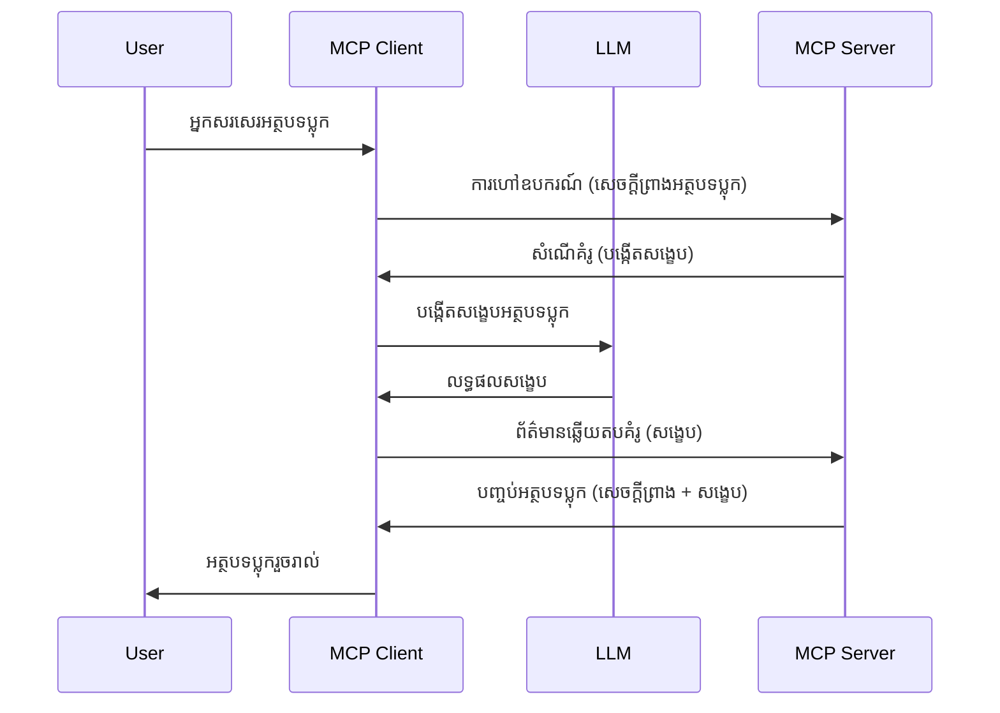

# Sampling - ការផ្ដល់ភារកិច្ចទៅកាន់អតិថិជន

ពេលខ្លះ អ្នកត្រូវការអោយ MCP Client និង MCP Server ប្រព្រឹត្តការជាមួយគ្នាដើម្បីសម្រេចគោលដៅរួម។ អ្នកអាចមានករណីដែល Server ត្រូវការជំនួយពី LLM ដែលអង្គុយនៅលើអតិថិជន។ សម្រាប់ស្ថានភាពនេះ ការ sampling គឺជារឿងដែលអ្នកគួរត្រូវប្រើ។

យើងមកស្វែងយល់ពីករណីប្រើប្រាស់ជាចម្បង និងរបៀបសាងសង់ដំណោះស្រាយដែលមាន sampling។

## ទិដ្ឋភាពទូទៅ

នៅក្នុងមេរៀននេះ យើងផ្តោតលើការពិពណ៌នាថាតើពេលណា និងកន្លែងណាក្នុងការប្រើ Sampling និងរបៀបកំណត់វា។

## គោលបំណងសិក្សា

នៅក្នុងជំពូកនេះ យើងនឹង៖

- ពន្យល់អ្វីទៅជា Sampling និងពេលណាគួរប្រើវា។
- បង្ហាញរបៀបកំណត់ Sampling នៅក្នុង MCP។
- ផ្ដល់ឧទាហរណ៍ការប្រើ Sampling ក្នុងសកម្មភាព។

## Sampling ជាអ្វី និងហេតុអ្វីត្រូវប្រើ?

Sampling គឺជាមុខងារ​ជំនាន់បន្ទាប់ដែលដំណើរការដូចតទៅ៖


### សំណើ Sampling

ឥឡូវនេះយើងមានទិដ្ឋភាពទូទៅនៃស្ថានភាពទន់ភាគហ៊ុនមួយ បោះមកពិភាក្សាអំពីសំណើ sampling ដែលស្វែប៊ឺរ(Server)ផ្ញើទៅអតិថិជន។ វាប្រាប់អំពីការសំណើបែប JSON-RPC ដូចខាងក្រោម៖

```json
{
  "jsonrpc": "2.0",
  "id": 1,
  "method": "sampling/createMessage",
  "params": {
    "messages": [
      {
        "role": "user",
        "content": {
          "type": "text",
          "text": "Create a blog post summary of the following blog post: <BLOG POST>"
        }
      }
    ],
    "modelPreferences": {
      "hints": [
        {
          "name": "claude-3-sonnet"
        }
      ],
      "intelligencePriority": 0.8,
      "speedPriority": 0.5
    },
    "systemPrompt": "You are a helpful assistant.",
    "maxTokens": 100
  }
}
```

មានចំនុចមួយចំនួនដែលគួរត្រូវលើកឡើង៖

- Prompt ដែលនៅក្រោម content -> text ជា prompt របស់យើង ដែលជាណែនាំឲ្យ LLM សង្ខេបមាតិកាប្លុកប៉ុស្តិ៍។

- **modelPreferences** ផ្នែកនេះគឺជាការជ្រើសរើស មតិយោបល់ ដើម្បីណែនាំរបៀបកំណត់ជាមួយ LLM។ អ្នកប្រើអាចជ្រើសរើសទទួលយកកំណត់នេះឬផ្លាស់ប្តូរពួកវា។ ក្នុងករណីនេះ មានការណែនាំអំពីម៉ូឌែលដែលគួរប្រើ កំលាំងនិងអាទិភាពឆ្លាតវៃ។
- **systemPrompt** វាជា prompt ប្រព័ន្ធធម្មតារបស់អ្នក ដែលផ្ដល់អត្តសញ្ញាណនិងមានការណែនាំ។
- **maxTokens** វាជាលក្ខណៈនិងប្រើប្រាស់សំរាប់បញ្ជាក់ចំនួន tokens ដែលណែនាំឲ្យប្រើក្នុងភារកិច្ចនេះ។

### ជឿនលឿន Sampling

ចម្លើយនេះគឺជាអ្វីដែល MCP Client ផ្ញើត្រឡប់ទៅ MCP Server ជាការឆ្លើយតបពី client ក្រោយពេលហៅ LLM រង់ចាំចម្លើយហើយបង្កើតសារនេះឡើងវិញ។ វាបង្ហាញជារូបរាង JSON-RPC ដូចខាងក្រោម៖

```json
{
  "jsonrpc": "2.0",
  "id": 1,
  "result": {
    "role": "assistant",
    "content": {
      "type": "text",
      "text": "Here's your abstract <ABSTRACT>"
    },
    "model": "gpt-5",
    "stopReason": "endTurn"
  }
}
```

សូមចំអិនថាចម្លើយនេះជាសេចក្ដីសង្ខេបនៃប្លុកប៉ុស្តិ៍ដូចដែលយើងបានស្នើសុំ ហើយសូមចំអិនថា ម៉ូឌែលដែលប្រើ "gpt-5" មិនមែនជាអ្វីដែលយើងបានស្នើទេ ប៉ុន្តែ "gpt-5" ជំនួស "claude-3-sonnet"។ វាអាចបង្ហាញថាអ្នកប្រើអាចផ្លាស់ប្តូរជម្រើសរបស់ខ្លួនបាន ហើយសំណើ Sampling របស់អ្នកគឺជាការណែនាំ។

ល្អហើយ ឥឡូវនេះយើងយល់ពីចរន្តសំខាន់ ប្រព័ន្ធដែលគួរប្រើវាសម្រាប់ "បង្កើតប្លុកប៉ុស្តិ៍ + សេចក្ដីសង្ខេប", តោះមកមើលអ្វីដែលយើងត្រូវធ្វើដើម្បីអោយវាដំណើរការ។

### ប្រភេទសារនេះ

សារសម្រាប់ Sampling មិនមានដែនកំណត់ត្រឹមតែអត្ថបទតែមួយទេ ប៉ុន្តែអ្នកអាចផ្ញើរូបភាព និងសំឡេងផងដែរ។ ដូច្នេះ JSON-RPC ប្រហែលជា៖

**អត្ថបទ**

```json
{
  "type": "text",
  "text": "The message content"
}
```

**មាតិការូបភាព**

```json
{
  "type": "image",
  "data": "base64-encoded-image-data",
  "mimeType": "image/jpeg"
}
```

**មាតិការសំឡេង**

```json
{
  "type": "audio",
  "data": "base64-encoded-audio-data",
  "mimeType": "audio/wav"
}
```

> NOTE: សម្រាប់ព័ត៌មានលម្អិតបន្ថែមលើ Sampling សូមពិនិត្យ [ឯកសារផ្លូវការណ៍](https://modelcontextprotocol.io/specification/2025-06-18/client/sampling)

## របៀបកំណត់ Sampling នៅក្នុង Client

> ចំណាំ៖ ប្រសិនបើអ្នកកំពុងបង្កើតតែ Server, អ្នកមិនចាំបាច់ធ្វើការជាច្រើននៅទីនេះទេ។

នៅក្នុង Client អ្នកត្រូវបញ្ជាក់មុខងារខាងក្រោម៖

```json
{
  "capabilities": {
    "sampling": {}
  }
}
```

វានឹងត្រូវបានយកទៅប្រើនៅពេល client ដែលបានជ្រើសរើសចាប់ផ្តើមជាមួយ server។

## ឧទាហរណ៍សកម្មភាព Sampling - បង្កើតប្លុកប៉ុស្តិ៍

អារម្មណ៍ចង់គូរ sampling server រួមគ្នា យើងត្រូវធ្វើការខាងក្រោម៖

1. បង្កើតឧបករណ៍នៅលើ Server។
1. ឧបករណ៍នោះគួរបង្កើតសំណើ sampling។
1. ឧបករណ៍គួររង់ចាំការឆ្លើយតបសំណើ sampling ពី client។
1. បន្ទាប់មកផលប៉ៈពាល់នៃឧបករណ៍គួរត្រូវបានផលិត។

មកមើលកូដជាដំណាក់កាល៖

### -1- បង្កើតឧបករណ៍

**python**

```python
@mcp.tool()
async def create_blog(title: str, content: str, ctx: Context[ServerSession, None]) -> str:
    """Create a blog post and generate a summary"""

```

### -2- បង្កើតសំណើ sampling

បន្ថែមកូដខាងក្រោមក្នុងឧបករណ៍របស់អ្នក៖

**python**

```python
post = BlogPost(
        id=len(posts) + 1,
        title=title,
        content=content,
        abstract=""
    )

prompt = f"Create an abstract of the following blog post: title: {title} and draft: {content} "

result = await ctx.session.create_message(
        messages=[
            SamplingMessage(
                role="user",
                content=TextContent(type="text", text=prompt),
            )
        ],
        max_tokens=100,
)

```

### -3- រង់ចាំចម្លើយ និងត្រឡប់ចម្លើយ

**python**

```python
post.abstract = result.content.text

posts.append(post)

# ត្រឡប់ផលិតផលពេញលេញ
return json.dumps({
    "id": post.title,
    "abstract": post.abstract
})
```

### -4- កូដពេញលេញ

**python**

```python
from starlette.applications import Starlette
from starlette.routing import Mount, Host

from mcp.server.fastmcp import Context, FastMCP

from mcp.server.session import ServerSession
from mcp.types import SamplingMessage, TextContent

import json


from uuid import uuid4
from typing import List
from pydantic import BaseModel


mcp = FastMCP("Blog post generator")

# app = FastAPI()

posts = []

class BlogPost(BaseModel):
    id: int
    title: str
    content: str
    abstract: str

posts: List[BlogPost] = []

@mcp.tool()
async def create_blog(title: str, content: str, ctx: Context[ServerSession, None]) -> str:
    """Create a blog post and generate a summary"""

    post = BlogPost(
        id=len(posts) + 1,
        title=title,
        content=content,
        abstract=""
    )

    prompt = f"Create an abstract of the following blog post: title: {title} and draft: {content} "

    result = await ctx.session.create_message(
        messages=[
            SamplingMessage(
                role="user",
                content=TextContent(type="text", text=prompt),
            )
        ],
        max_tokens=100,
    )

    post.abstract = result.content.text

    posts.append(post)

    # ត្រឡប់មកអត្ថបទប្លក់ពេញលេញ
    return json.dumps({
        "id": post.title,
        "abstract": post.abstract
    })

if __name__ == "__main__":
    print("Starting server...")
    # mcp.run()
    mcp.run(transport="streamable-http")

# ប្រតិបត្តិមុខងារជាមួយ៖ python server.py
```

### -5- សាកល្បងក្នុង Visual Studio Code

ដើម្បីសាកល្បងនៅក្នុង Visual Studio Code សូមអនុវត្តដូចខាងក្រោម៖

1. ចាប់ផ្តើម server នៅក្នុង terminal
1. បន្ថែមវាទៅ *mcp.json* (ហើយជួបថាដំណើរការរួច) ដូចនេះ៖

   ```json
   "servers": {
      "blog-server": {
        "type": "http",
        "url": "http://localhost:8000/mcp"
      }
   }
   ```

1. វាយ prompt មួយ៖

   ```text
   create a blog post named "Where Python comes from", the content is "Python is actually named after Monty Python Flying Circus"
   ```

1. អនុញ្ញាតឲ្យ sampling ដំណើរការ។ នៅពេលដំបូងអ្នកពិនិត្យមើលនេះ អ្នកនឹងត្រូវមានប្រអប់សារ​បន្ថែមដែលត្រូវទទួលយក ហើយបន្ទាប់មកអ្នកនឹងឃើញប្រអប់សារធម្មតាដែលស្នើឲ្យអ្នកដំណើរការឧបករណ៍មួយ

1. ពិនិត្យលទ្ធផល។ អ្នកនឹងឃើញលទ្ធផលត្រូវបានបង្ហាញយ៉ាងស្រស់ស្អាតនៅក្នុង GitHub Copilot Chat ប៉ុន្តែអ្នកក៏អាចពិនិត្យ JSON ផ្ទាល់បានផងដែរ។

**អត្ថប្រយោជន៍**។ ឧបករណ៍ Visual Studio Code មានការគាំទ្រល្អសម្រាប់ sampling។ អ្នកអាចកំណត់ការចូលប្រើ Sampling លើ server ដែលបានដំឡើងដោយចូលទៅរកវា ដូចខាងក្រោម៖

1. ចូលទៅផ្នែក extension។
1. ជ្រើសរើសរូបតំណាង cog សម្រាប់ server ដែលបានដំឡើងក្នុងផ្នែក "MCP SERVERS - INSTALLED"។
1. ជ្រើស "Configure Model Access" នៅទីនេះ អ្នកអាចជ្រើសម៉ូឌែលដែល GitHub Copilot អនុញ្ញាតឲ្យប្រើនៅពេលធ្វើ sampling។ អ្នកក៏អាចមើលសំណើ sampling ឥលូវកន្លងមកដោយជ្រើស "Show Sampling requests"។

## កិច្ចការផ្ទះ

ក្នុងកិច្ចការនេះ អ្នកនឹងបង្កើត Sampling មួយដែលខុសពីមូលដ្ឋាន គឺ sampling សមាហរណកម្មសម្រាប់បង្កើតពិពណ៌នាផលិតផល។ នេះជាស្ថានភាពរបស់អ្នក៖

**ស្ថានភាព**៖ អ្នកបម្រើការនៅផ្នែកបត់ក្រោយក្នុង e-commerce ត្រូវការជំនួយ វាពិបាកពេលវេលាច្រើនក្នុងការបង្កើតពិពណ៌នាផលិតផល។ ដូច្នេះ អ្នកត្រូវបង្កើតដំណោះស្រាយដែលអ្នកអាចហៅឧបករណ៍ "create_product" ជាមួយ "title" និង "keywords" ជាអាគម និងវាគួរតែមកពេញលេញជាមួយពិពណ៌នា "description" ដែលត្រូវបំពេញដោយ LLM របស់ client។

TIP: ប្រើអ្វីដែលអ្នករៀនពីមុន របៀបសាងសង់ server និងឧបករណ៍របស់វា តាមរយៈសំណើ sampling។

## ដំណោះស្រាយ

[ដំណោះស្រាយ](./solution/README.md)

## អ្វីដែលត្រូវយកចំណាំ

Sampling គឺជាមុខងារដ៏មានសមត្ថភាពដែលអនុញ្ញាតឲ្យ server ផ្ដល់ភារកិច្ចទៅ client នៅពេលវាត្រូវការជំនួយពី LLM ។

## តើអ្វីទៅជាដំណាក់កាលបន្ទាប់

- [ជំពូក 4 - ការអនុវត្តជាក់ស្តែង](../../04-PracticalImplementation/README.md)

---

<!-- CO-OP TRANSLATOR DISCLAIMER START -->
**ការបដិសេធ**៖  
ឯកសារនេះត្រូវបានបកប្រែដោយប្រើសេវាកម្មបកប្រែ AI [Co-op Translator](https://github.com/Azure/co-op-translator)។ ខណៈពេលយើងខិតខំគោរពភាពត្រឹមត្រូវ សូមយល់ថាការបកប្រែដោយស្វ័យប្រវត្តិអាចមានកំហុសឬមិនត្រឹមត្រូវ។ ឯកសារដើមដែលមានភាសាមួយបានត្រូវគិតថាជាឯកសារមូលដ្ឋានដែលមានអំណាច។ សម្រាប់ព័ត៌មានសំខាន់ៗ ការបកប្រែដោយមនុស្សជាជំនាញត្រូវបានផ្តល់អនុសាសន៍។ យើងមិនទទួលខុសត្រូវសម្រាប់ការយល់ច្រឡំ ឬការរងការបកប្រែខុសប្លែកណាមួយដែលកើតចេញពីការប្រើប្រាស់ការបកប្រែនេះឡើយ។
<!-- CO-OP TRANSLATOR DISCLAIMER END -->