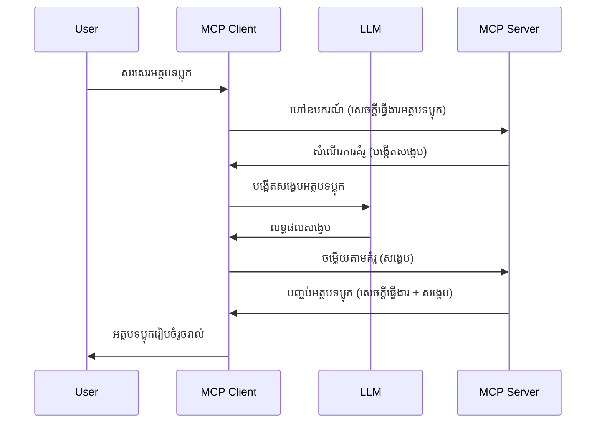

# Sampling - ផ្ទេរមុខងារទៅឱ្យ Client

ខ្លះពេល អ្នកត្រូវការឲ្យ MCP Client និង MCP Server រួមគ្នាដើម្បីសម្រេចគោលបំណងរួមមួយ។ អ្នកអាចមានករណីដែល Server ត្រូវការជំនួយពី LLM ដែលស្ថិតនៅលើ client។ សម្រាប់ស្ថានការណ៍នេះ sampling ជាវិធីដែលអ្នកគួរប្រើ។

ចង់ស្វែងយល់ពីករណីប្រើប្រាស់ និងវិធីសាស្រ្តកសាងដំណោះស្រាយដែលពាក់ព័ន្ធ sampling។

## ទិដ្ឋភាពទូទៅ

ក្នុងមេរៀននេះ យើងផ្តោតលើការពន្យល់ពីពេលណា និងកន្លែងណាដើម្បីប្រើ Sampling និងវិធីកំណត់រចនាសម្ព័ន្ធវា។

## គោលបំណងសិក្សា

ក្នុងជំពូកនេះ យើងនឹង៖

- ពន្យល់ពី Sampling ជាអ្វី និងពេលណាត្រូវប្រើវា។
- បង្ហាញពីវិធីកំណត់ Sampling នៅក្នុង MCP។
- ផ្តល់ឧទាហរណ៍នៃការប្រើប្រាស់ Sampling ក្នុងការអនុវត្ត។

## Sampling ជាអ្វី ហើយហេតុអ្វីគួរប្រើវា?

Sampling គឺជាមុខងារលំពាធមួយដែលដំណើរការដូចតទៅ៖


### ការស្នើរសុំ Sampling

យល់ហើយ ឥឡូវយើងមានទិដ្ឋភាពទូលំទូលាយលើស្ថានการณ์ជាក់ស្ដែងមួយ តោះនិយាយពីសំណើ Sampling ដែល server ផ្ញើត្រឡប់ទៅ client។ តើសំណើដូចនេះអាចមើលទៅដូចម្តេចក្នុងរូបមន្ត JSON-RPC៖

```json
{
  "jsonrpc": "2.0",
  "id": 1,
  "method": "sampling/createMessage",
  "params": {
    "messages": [
      {
        "role": "user",
        "content": {
          "type": "text",
          "text": "Create a blog post summary of the following blog post: <BLOG POST>"
        }
      }
    ],
    "modelPreferences": {
      "hints": [
        {
          "name": "claude-3-sonnet"
        }
      ],
      "intelligencePriority": 0.8,
      "speedPriority": 0.5
    },
    "systemPrompt": "You are a helpful assistant.",
    "maxTokens": 100
  }
}
```

មានបញ្ហាណាមួយគួរត្រូវបានគូសបញ្ជាក់ខាងក្រោម៖

- Prompt នៅក្រោម content -> text គឺជាការបញ្ជាដែលជាការណែនាំសម្រាប់ LLM ដើម្បីសង្ខេបមាតិកាផ្សាយពាណិជ្ជកម្ម។
- **modelPreferences**៖ ផ្នែកនេះគឺជាការពេញចិត្ត ឬជាការផ្ដល់អនុសាសន៍អំពីគ្រោងការដើម្បីប្រើប្រាស់ជាមួយ LLM។ អ្នកប្រើអាចជ្រើសរើសទៅតាមការណែនាំឬប្ដូរវា។ក្នុងករណីនេះមានការណែនាំពីម៉ូឌែលដែលត្រូវប្រើ និងអាទិភាពលើល្បឿន និង បញ្ញា។
- **systemPrompt**, នេះជាការបញ្ជារប្រព័ន្ធធម្មតារបស់អ្នកដែលផ្ដល់បុគ្គលិកលក្ខណ៍ដល់ LLM របស់អ្នក និងមានការណែនាំនានា។
- **maxTokens**, នេះជាលក្ខណៈមួយរបស់សំណើរដែលបង្ហាញថាម៉ោងតិចប៉ុន្មានត្រូវបានណែនាំសម្រាប់ភារកិច្ចនេះ។

### ឆ្លើយតប Sampling

ឆ្លើយតបនេះគឺជាអ្វីដែល MCP Client ផ្ញើត្រឡប់ទៅ MCP Server និងជាលទ្ធផលនៃការហៅ LLM របស់ client រង់ចាំឆ្លើយតប ហើយបន្ទាប់មកបង្កើតសារនេះឡើងវិញ។ នេះគឺដូចទៅក្នុង JSON-RPC៖

```json
{
  "jsonrpc": "2.0",
  "id": 1,
  "result": {
    "role": "assistant",
    "content": {
      "type": "text",
      "text": "Here's your abstract <ABSTRACT>"
    },
    "model": "gpt-5",
    "stopReason": "endTurn"
  }
}
```

សូមចុចមើលឃើញថា ឆ្លើយតបនេះគឺជារឿងបែបសង្ខេបនៃការផ្សាយពាណិជ្ជកម្មដូចដែលយើងបានស្នើសុំ។ ក៏សូមចំណាំថា ម៉ូឌែលដែលបានប្រើមិនមែនជាដែលយើងបានស្នើតែ "gpt-5" ជាង "claude-3-sonnet"។ វាគឺដើម្បីបង្ហាញថាអ្នកប្រើអាចផ្លាស់ប្ដូរសេចក្តីសំរេចក្នុងការប្រើ និងសំណើរបស់អ្នកក៏ជាការផ្ដល់អនុសាសន៍។

យល់ហើយថា ដំណើរការសំខាន់ ហើយភារកិច្ចដែលមានប្រយោជន៍ក្នុងការប្រើវា "បង្កើតប្លក់ និងសង្ខេបទំព័រ" នោះតោះមើលអ្វីដែលត្រូវធ្វើដើម្បីឲ្យវាដំណើរការបាន។

### ប្រភេទសារប្រាស

សារប្រាស Sampling មិនត្រូវបានកំណត់ច្រឹកចរណ៍តែអក្សរប៉ុណ្ណោះទេ អ្នកអាចផ្ញើរូបភាព និងសូរ៍ផងដែរ។ នេះជារូបមន្ត JSON-RPC ដែលមានភាពខុសគ្នា៖

**អត្ថបទ**

```json
{
  "type": "text",
  "text": "The message content"
}
```

**មាតិការូបភាព**

```json
{
  "type": "image",
  "data": "base64-encoded-image-data",
  "mimeType": "image/jpeg"
}
```

**មាតិកាសូរ**

```json
{
  "type": "audio",
  "data": "base64-encoded-audio-data",
  "mimeType": "audio/wav"
}
```

> NOTE: សម្រាប់ព័ត៌មានលម្អិតបន្ថែមអំពី Sampling សូមពិនិត្យឯកសារផ្លូវការនៅ [official docs](https://modelcontextprotocol.io/specification/2025-06-18/client/sampling)

## វិធីកំណត់ Sampling នៅក្នុង Client

> ចំណាំ៖ ប្រសិនបើអ្នកសាងសង់តែ server ផ្ទាល់ អ្នកមិនចាំបាច់ធ្វើអ្វីច្រើននៅទីនេះទេ។

នៅ client អ្នកត្រូវបញ្ជាក់មុខងារដូចខាងក្រោម៖

```json
{
  "capabilities": {
    "sampling": {}
  }
}
```

នេះនឹងត្រូវបានប្រើនៅពេល client ដែលបានជ្រើសរើសចាប់ផ្តើមជាមួយ server។

## ឧទាហរណ៍ Sampling នៅក្នុងការអនុវត្ត - បង្កើតប្លក់មួយ

ចង់កូដ server sampling រួមគ្នា យើងត្រូវធ្វើដូចខាងក្រោម៖

1. បង្កើតឧបករណ៍នៅលើ Server។
2. ឧបករណ៍នោះគួរបង្កើតសំណើ Sampling។
3. ឧបករណ៍គួរព្រមានចាំការឆ្លើយតបពីសំណើ sampling របស់ client។
4. បន្ទាប់មកលទ្ធផលឧបករណ៍គួរត្រូវបានបង្កើត។

មើលកូដជាគន្លងជំហាន៖

### -1- បង្កើតឧបករណ៍

**python**

```python
@mcp.tool()
async def create_blog(title: str, content: str, ctx: Context[ServerSession, None]) -> str:
    """Create a blog post and generate a summary"""

```

### -2- បង្កើតសំណើ sampling

បន្ថែមឧបករណ៍របស់អ្នកជាមួយកូដដូចខាងក្រោម៖

**python**

```python
post = BlogPost(
        id=len(posts) + 1,
        title=title,
        content=content,
        abstract=""
    )

prompt = f"Create an abstract of the following blog post: title: {title} and draft: {content} "

result = await ctx.session.create_message(
        messages=[
            SamplingMessage(
                role="user",
                content=TextContent(type="text", text=prompt),
            )
        ],
        max_tokens=100,
)

```

### -3- រង់ចាំឆ្លើយតប និងបញ្ចូនឆ្លើយតប

**python**

```python
post.abstract = result.content.text

posts.append(post)

# ត្រឡប់ទៅផលិតផលពេញលេញ
return json.dumps({
    "id": post.title,
    "abstract": post.abstract
})
```

### -4- កូដពេញលេញ

**python**

```python
from starlette.applications import Starlette
from starlette.routing import Mount, Host

from mcp.server.fastmcp import Context, FastMCP

from mcp.server.session import ServerSession
from mcp.types import SamplingMessage, TextContent

import json


from uuid import uuid4
from typing import List
from pydantic import BaseModel


mcp = FastMCP("Blog post generator")

# app = FastAPI()

posts = []

class BlogPost(BaseModel):
    id: int
    title: str
    content: str
    abstract: str

posts: List[BlogPost] = []

@mcp.tool()
async def create_blog(title: str, content: str, ctx: Context[ServerSession, None]) -> str:
    """Create a blog post and generate a summary"""

    post = BlogPost(
        id=len(posts) + 1,
        title=title,
        content=content,
        abstract=""
    )

    prompt = f"Create an abstract of the following blog post: title: {title} and draft: {content} "

    result = await ctx.session.create_message(
        messages=[
            SamplingMessage(
                role="user",
                content=TextContent(type="text", text=prompt),
            )
        ],
        max_tokens=100,
    )

    post.abstract = result.content.text

    posts.append(post)

    # ត្រឡប់មកវិញអត្ថបទប្លុកពេញលេញ
    return json.dumps({
        "id": post.title,
        "abstract": post.abstract
    })

if __name__ == "__main__":
    print("Starting server...")
    # mcp.run()
    mcp.run(transport="streamable-http")

# បើករត់កម្មវិធីជាមួយ៖ python server.py
```

### -5- សាកល្បងវា​នៅក្នុង Visual Studio Code

ដើម្បីសាកល្បងនេះនៅក្នុង Visual Studio Code សូមធ្វើដូចខាងក្រោម៖

1. ចាប់ផ្តើម server ក្នុង terminal។
2. បញ្ចូលវា​ក្នុង *mcp.json* (ហើយធានាថាវាចាប់ផ្តើម) ឧទាហរណ៍ដូចខាងក្រោម៖

   ```json
   "servers": {
      "blog-server": {
        "type": "http",
        "url": "http://localhost:8000/mcp"
      }
   }
   ```

3. វាយ prompt៖

   ```text
   create a blog post named "Where Python comes from", the content is "Python is actually named after Monty Python Flying Circus"
   ```

4. អនុញ្ញាតឲ្យ sampling ដំណើរការ។ ជាលើកដំបូងដែលអ្នកសាកល្បង អ្នកនឹងបានប្រឈមមុខនឹងប្រអប់សំណួរបន្ថែមដែលអ្នកត្រូវទទួលយក បន្ទាប់មកអ្នកនឹងឃើញប្រអប់ធម្មតាអំពីការស្នើសុំបញ្ជាឲ្យបើកឧបករណ៍មួយ។

5. ពិនិត្យលទ្ធផល។ អ្នកនឹងឃើញលទ្ធផលទាំងក្នុង GitHub Copilot Chat ដែលបង្ហាញយ៉ាងស្អាត ហើយអ្នកអាចពិនិត្យឃើញ JSON ចិត្តថ្លា។

**Bonus**. កម្មវិធី Visual Studio Code មានការគាំទ្រល្អសម្រាប់ sampling។ អ្នកអាចកំណត់ការចូលដំណើរការការសំណើ sampling នៅលើ server ដែលបានដំឡើងដោយចូលទៅកាន់ផ្នែកនេះ៖

1. ចូលទៅផ្នែកកម្មវិធីបន្ថែម។
2. ជ្រើសរើសរូបតំណាង cog ចំពោះ server ដែលបានដំឡើងនៅក្នុងផ្នែក "MCP SERVERS - INSTALLED"។
3. ជ្រើសរើស "Configure Model Access", នៅទីនេះអ្នកអាចជ្រើសម៉ូឌែលដែល GitHub Copilot អនុញ្ញាតឲ្យប្រើពេលធ្វើ sampling។ អ្នកក៏អាចមើលសំណើ sampling ទាំងអស់ដែលគេបានធ្វើថ្មីៗនេះ ដោយជ្រើសរើស "Show Sampling requests"។

## ការចាត់តាំង

ក្នុងការចាត់តាំងនេះ អ្នកនឹងបង្កើត sampling ផ្សេងគ្នាបន្តិចគឺ sampling integration ដែលគាំទ្រការបង្កើតការពណ៌នាផលិតផល។ នេះជាទិដ្ឋភាពរបស់អ្នក៖

**ទិដ្ឋភាព**៖ អ្នកសិក្សាការិយាល័យនៅខាងក្រោយអេឡិចត្រូនិច ត្រូវការជំនួយ ដើម្បីបង្កើតការពណ៌នាផលិតផល ដែលជារឿងចំណាយពេលវេលាច្រើន។ ដូច្នេះ អ្នកត្រូវសាងសង់ដំណោះស្រាយមួយដែលអាចហៅឧបករណ៍ "create_product" ជាមួយ "title" និង "keywords" ជាអាគុយម៉ង់ ហើយវាគួរបង្កើតផលិតផលពេញលេញ រួមមាន "description" ដែលត្រូវបានបញ្ចូលដោយ LLM របស់ client។

TIP: ប្រើអ្វីដែលអ្នកបានរៀនមុននេះក្នុងការសាងសង់ server និងឧបករណ៍របស់វា ដោយប្រើសំណើ sampling។

## ដំណោះស្រាយ

[Solution](./solution/README.md)

## ចំណុចសំខាន់

Sampling គឺជាមុខងារដ៏មានអំណាចដែលអនុញ្ញាតឲ្យ server ផ្ទេរភារកិច្ចទៅឱ្យ client នៅពេលចាំបាច់ជំនួយពី LLM។

## បន្ទាប់

- [ជំពូក 4 - ការអនុវត្តប្រាក់កម្ចី](../../04-PracticalImplementation/README.md)

---

<!-- CO-OP TRANSLATOR DISCLAIMER START -->
**ការបដិសេធ**៖  
ឯកសារនេះ​ត្រូវបានបកប្រែ​ដោយប្រព័ន្ធបកប្រែ AI [Co-op Translator](https://github.com/Azure/co-op-translator)។ ខណៈពេលដែល​យើង​ព្យាយាម​បាន​ត្រឹមត្រូវ អ្នកគួរតែដឹងថា​បកប្រែ​ដោយស្វ័យប្រវត្តិ​អាចមានកំហុស ឬមិនត្រឹមត្រូវ។ ឯកសារដើមក្នុងភាសាម្ចាស់របស់វាគួរត្រូវបានពិចារណាថាជា ប្រភពដែលមានអំណាច។ សម្រាប់ព័ត៌មានសំខាន់ៗ សូម​ពិចារណាបកប្រែ​ដោយមនុស្សអ្នកជំនាញ។ យើងមិនទទួលបន្ទុកចំពោះការយល់ច្រឡំ ឬការបកប្រែខុសពីការប្រើប្រាស់បកប្រែនេះទេ។
<!-- CO-OP TRANSLATOR DISCLAIMER END -->