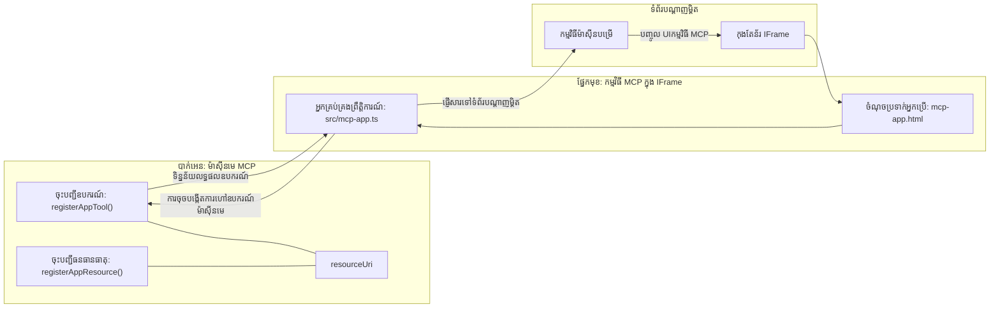

# MCP Apps

MCP Apps គឺជាគំនិតថ្មីមួយក្នុង MCP។ គំនិតគឺមិនត្រឹមតែអ្នកឆ្លើយតបដោយទិន្នន័យពីការហៅឧបករណ៍ទេ អ្នកក៏ផ្តល់ព័ត៌មានអំពីរបៀបដែលព័ត៌មាននេះគួរត្រូវបានបន្តិចបន្តួច។ នោះមានន័យថាលទ្ធផលឧបករណ៍ឥឡូវនេះអាចរួមមានព័ត៌មាន UI ផងដែរ។ ហេតុអ្វីបានជាយើងចង់បានអ្វីបែបនេះ? ច្បាស់ហើយ សូមគិតពីរបៀបដែលអ្នកធ្វើរឿងនៅថ្ងៃនេះ។ អ្នកសង្ឃឹមថានឹងប្រើលទ្ធផលពី MCP Server ដោយដាក់មុខងារ​frontend មួយខាងមុខវា ដែលគឺកូដដែលអ្នកត្រូវសរសេរនិងថែរក្សា។ មួយចំនួននៃពេលវេលាគឺវាអាចជាវិធីដែលអ្នកចង់បាន ប៉ុន្តែក៏មានពេលវេលាដដែលដែលវាល្អប្រសើរបើអ្នកអាចយកសំណុំព័ត៌មានមួយដែលមានខ្លួនឯងបូកក្តៅ មានទាំងទិន្នន័យ និងផ្ទាំងអ្នកប្រើ។

## ទិដ្ឋភាពទូទៅ

មេរៀននេះផ្តល់ការណែនាំប្រតិបត្តិមួយអំពី MCP Apps របៀបចាប់ផ្តើម និងរបៀបរួមបញ្ចូលវាចូលទៅក្នុង Web Apps របស់អ្នកដែលមានរួច។ MCP Apps គឺជាការបន្ថែមថ្មីមួយទៅក្នុងស្ដង់ដា MCP។

## គោលបំណងរៀន

នៅចុងបញ្ចប់មេរៀននេះ អ្នកអាច:

- ពន្យល់អំពី MCP Apps។
- ពេលណាត្រូវប្រើ MCP Apps។
- បង្កើតនិងរួមបញ្ចូល MCP Apps របស់អ្នកដោយផ្ទាល់។

## MCP Apps - វាដំណើរការយ៉ាងដូចម្តេច

គំនិតជាមួយ MCP Apps គឺផ្តល់ចម្លើយដែលជាប្រភេទធាតុដែលត្រូវបានបង្ហាញ។ ធាតុនោះអាចមានទាំងទម្រង់មើលឃើញ និងអន្តរកម្ម ដូចជាការចុចប៊ូតុង ការបញ្ចូលរបស់អ្នកប្រើ និងផ្សេងទៀត។ យើងចាប់ផ្តើមពីផ្នែកម៉ាស៊ីនមេ និង MCP Server របស់យើង។ ដើម្បីបង្កើតធាតុ MCP App អ្នកត្រូវបង្កើតឧបករណ៍មួយ និងធនធានកម្មវិធីមួយ។ ភាគទាំងពីរនេះត្រូវបានភ្ជាប់ដោយ resourceUri។

នេះជាឧទាហរណ៍មួយ។ មកវិញព្យាយាមមើលអ្វីដែលរួមមាន និងតើផ្នែកណាធ្វើអ្វីខ្លះ៖

```text
server.ts -- responsible for registering tools and the component as a UI component
src/
  mcp-app.ts -- wiring up event handlers
mcp-app.html -- the user interface
```

រូបភាពនេះពណ៌នាស្ថាបត្យកម្មសម្រាប់បង្កើតធាតុមួយ និងយោលទស្សន៍របស់វា។


ចូរព្យាយាមបញ្ជាក់កំពូលភារកិច្ចសម្រាប់ផ្នែកខាងក្រោយនឹងផ្នែកមុខដោយបរិវេណព័ត៌មាន។

### ផ្នែកខាងក្រោយ

មានពីរពីរអ្វីដែលយើងត្រូវធ្វើនៅទីនេះ៖

- ចុះបញ្ជីឧបករណ៍ដែលខុសគ្នាដែលយើងចង់អន្តរកម្ម។
- កំណត់ធាតុ។

**ចុះបញ្ជីឧបករណ៍**

```typescript
registerAppTool(
    server,
    "get-time",
    {
      title: "Get Time",
      description: "Returns the current server time.",
      inputSchema: {},
      _meta: { ui: { resourceUri } }, // បត់តភ្ជាប់ឧបករណ៍នេះទៅកាន់ធនធាន UI របស់វា
    },
    async () => {
      const time = new Date().toISOString();
      return { content: [{ type: "text", text: time }] };
    },
  );

```

កូដខាងលើពណ៌នាអំពីឥរិយាបថ ដែលវាបង្ហាញឧបករណ៍មួយឈ្មោះ `get-time`។ វាមានទីផ្សារបញ្ចូលគ្មានទេ ប៉ុន្តែបញ្ចប់ដោយបង្កើតម៉ោងបច្ចុប្បន្ន។ យើងមានសមត្ថភាពកំណត់ `inputSchema` សម្រាប់ឧបករណ៍ដែលត្រូវការដើម្បីទទួលបញ្ចូលរបស់អ្នកប្រើ។

**ចុះបញ្ជីធាតុ**

នៅក្នុងឯកសារដូចគ្នា អ្នកត្រូវចុះបញ្ជីធាតុ​ផងដែរ៖

```typescript
const resourceUri = "ui://get-time/mcp-app.html";

// ចុះបញ្ជីធនធាន ដែលបញ្ចូនត្រឡប់ HTML/JavaScript ដែលបញ្ចប់សម្រាប់ UI។
registerAppResource(
  server,
  resourceUri,
  resourceUri,
  { mimeType: RESOURCE_MIME_TYPE },
  async () => {
    const html = await fs.readFile(path.join(DIST_DIR, "mcp-app.html"), "utf-8");

    return {
    contents: [
        { uri: resourceUri, mimeType: RESOURCE_MIME_TYPE, text: html },
    ],
    };
  },
);
```

ចំណាំថាយើងរៀបរាប់ `resourceUri` ដើម្បីភ្ជាប់ធាតុជាមួយឧបករណ៍របស់វា។ អ្វីដែលគួរឱ្យចាប់អារម្មណ៍គឺ callback ដែលយើងផ្ទុកឯកសារ UI និងត្រឡប់ធាតុវិញ។

### ផ្នែកមុខធាតុ

ដូចជាផ្នែកខាងក្រោយ មានពីរផ្នែកនៅទីនេះ:

- ផ្នែកមុខសរសេរជា HTML សុទ្ធ។
- កូដដែលគ្រប់គ្រងព្រឹត្តិការណ៍ និងអ្វីដែលត្រូវធ្វើ ដូចជាហៅឧបករណ៍ ឬផ្ញើសារ​ចុងបញ្ចប់ទៅ parent window។

**ផ្ទាំងអ្នកប្រើ**

មកមើលផ្ទាំងអ្នកប្រើ។

```html
<!-- mcp-app.html -->
<!DOCTYPE html>
<html lang="en">
  <head>
    <meta charset="UTF-8" />
    <title>Get Time App</title>
  </head>
  <body>
    <p>
      <strong>Server Time:</strong> <code id="server-time">Loading...</code>
    </p>
    <button id="get-time-btn">Get Server Time</button>
    <script type="module" src="/src/mcp-app.ts"></script>
  </body>
</html>
```

**ការតភ្ជាប់ព្រឹត្តិការណ៍**

ផ្នែកចុងក្រោយគឺការតភ្ជាប់ព្រឹត្តិការណ៍។ នោះមានន័យថាយើងកំណត់ថាផ្នែកណា ក្នុង UI គួរត្រូវបានដាក់ handlers ព្រឹត្តិការណ៍ និងត្រូវធ្វើអ្វីបើព្រឹត្តិការណ៍ត្រូវបានកើតឡើង៖

```typescript
// mcp-app.ts

import { App } from "@modelcontextprotocol/ext-apps";

// ទទួលយកហៅឧបករណ៍
const serverTimeEl = document.getElementById("server-time")!;
const getTimeBtn = document.getElementById("get-time-btn")!;

// បង្កើតឧទាហរណ៍កម្មវិធី
const app = new App({ name: "Get Time App", version: "1.0.0" });

// ដោះស្រាយលទ្ធផលឧបករណ៍ពីមេសុីនបម្រើ។ កំណត់មុន `app.connect()` ដើម្បីជៀសវាង
// ខកខានលទ្ធផលឧបករណ៍ដំបូង។
app.ontoolresult = (result) => {
  const time = result.content?.find((c) => c.type === "text")?.text;
  serverTimeEl.textContent = time ?? "[ERROR]";
};

// ភ្ជាប់ព្រឹត្តិការណ៍ចុចប៊ូតុង
getTimeBtn.addEventListener("click", async () => {
  // `app.callServerTool()` អនុញ្ញាតឲ្យ UI ស្នើរទិន្នន័យថ្មីពីមេសុីនបម្រើ
  const result = await app.callServerTool({ name: "get-time", arguments: {} });
  const time = result.content?.find((c) => c.type === "text")?.text;
  serverTimeEl.textContent = time ?? "[ERROR]";
});

// ភ្ជាប់ទៅម៉ាស៊ីនផ្ទះ
app.connect();
```

ដូចដែលអ្នកឃើញពីខាងលើ នេះជាកូដធម្មតាសម្រាប់ភ្ជាប់ធាតុ DOM ទៅនឹងព្រឹត្តិការណ៍។ ឥទ្ធិពលដែលគួររំលេចគឺការហៅទៅ `callServerTool` ដែលបញ្ចប់ដោយហៅឧបករណ៍លើផ្នែកខាងក្រោយ។

## ការដោះស្រាយបញ្ហាក្នុងការបញ្ចូលរបស់អ្នកប្រើ

ឥឡូវនេះ យើងបានឃើញធាតុដែលមានប៊ូតុងមួយ ដែលពេលចុចហៅឧបករណ៍។ តោះមកមើលតើយើងអាចបន្ថែមធាតុ UI ផ្សេងៗ ដូចជាវាលបញ្ចូល និងមើលថាតើយើងអាចផ្ញើ arguments ទៅឧបករណ៍មួយបានឬទេ។ យើងមកអនុវត្តន៍មុខងារ FAQ មួយ។ វាគួរត្រូវដំណើរការ​ដូចខាងក្រោម៖

- គួរត្រូវមានប៊ូតុង និងធាតុបញ្ចូលមួយដែលអ្នកប្រើវាយពាក្យគន្លឹះសម្រាប់ស្វែងរក ដូចជា "Shipping"។ នេះគួរត្រូវហៅឧបករណ៍មួយនៅផ្នែកខាងក្រោយ ដែលធ្វើការស្វែងរកក្នុងទិន្នន័យ FAQ។
- ឧបករណ៍មួយដែលគាំទ្រការស្វែងរក FAQ ដដែល។

មកបញ្ចូលការគាំទ្រដែលត្រូវការនៅផ្នែកខាងក្រោយមុន៖

```typescript
const faq: { [key: string]: string } = {
    "shipping": "Our standard shipping time is 3-5 business days.",
    "return policy": "You can return any item within 30 days of purchase.",
    "warranty": "All products come with a 1-year warranty covering manufacturing defects.",
  }

registerAppTool(
    server,
    "get-faq",
    {
      title: "Search FAQ",
      description: "Searches the FAQ for relevant answers.",
      inputSchema: zod.object({
        query: zod.string().default("shipping"),
      }),
      _meta: { ui: { resourceUri: faqResourceUri } }, // តភ្ជាប់ឧបករណ៍នេះទៅឯកសារធនធាន UI របស់វា
    },
    async ({ query }) => {
      const answer: string = faq[query.toLowerCase()] || "Sorry, I don't have an answer for that.";
      return { content: [{ type: "text", text: answer }] };
    },
  );
```

អ្វីដែលយើងឃើញនៅទីនេះ គឺរបៀបយើងបំពេញ `inputSchema` និងផ្តល់ schema `zod` ដូចជា៖

```typescript
inputSchema: zod.object({
  query: zod.string().default("shipping"),
})
```

ក្នុង schema ខាងលើ យើងប្រកាសថាអ្នកមានប៉ារ៉ាម៉ែត្រ `query` ដែលជាជម្រើស និងមានតម្លៃដើមជា "shipping"។

បានហើយ មកទៅ *mcp-app.html* ដើម្បីមើល UI ថាត្រូវបង្កើតអ្វី៖

```html
<div class="faq">
    <h1>FAQ response</h1>
    <p>FAQ Response: <code id="faq-response">Loading...</code></p>
    <input type="text" id="faq-query" placeholder="Enter FAQ query" />
    <button id="get-faq-btn">Get FAQ Response</button>
  </div>
```

ល្អ ទានេះយើងមានធាតុបញ្ចូល មួយ និងប៊ូតុង។ តោះទៅ *mcp-app.ts* ដើម្បីភ្ជាប់​ព្រឹត្តិការណ៍ទាំងនេះ៖

```typescript
const getFaqBtn = document.getElementById("get-faq-btn")!;
const faqQueryInput = document.getElementById("faq-query") as HTMLInputElement;

getFaqBtn.addEventListener("click", async () => {
  const query = faqQueryInput.value;
  const result = await app.callServerTool({ name: "get-faq", arguments: { query } });
  const faq = result.content?.find((c) => c.type === "text")?.text;
  faqResponseEl.textContent = faq ?? "[ERROR]";
});
```

ក្នុងកូដខាងលើ យើងបាន:

- បង្កើត references ទៅធាតុ UI ទាក់ទាញ។
- គ្រប់គ្រងចុចប៊ូតុង ដើម្បីវាយតម្លៃវាលបញ្ចូល និងហៅ `app.callServerTool()` ជាមួយ `name` និង `arguments` ដែលថ្មីស្រឡាងបញ្ចូល `query` ជាតម្លៃ។

អ្វីដែលកើតឡើងពេលអ្នកហៅ `callServerTool` គឺវាព្រមព្រៀងផ្ញើសារទៅកាន់ parent window ដែលរបាំងនោះចុងបញ្ចប់ហៅ MCP Server ។

### ព្យាយាមវា

ព្យាយាមនេះយើងគួរតែឃើញដូចខាងក្រោម៖


និងនេះជាកន្លែងដែលយើងព្យាយាមដោយបញ្ចូលដូចជា "warranty"


ដើម្បីរត់កូដនេះ ចូលទៅកាន់ [ផ្នែកកូដ](./code/README.md)

## ការធ្វើតេស្តក្នុង Visual Studio Code

Visual Studio Code មានការគាំទ្រល្អសម្រាប់ MVP Apps ហើយវាអាចជាវិធីងាយស្រួលបំផុតក្នុងការធ្វើតេស្ត MCP Apps របស់អ្នក។ ដើម្បីប្រើ Visual Studio Code ចូរបន្ថែមបន្ទាត់ម៉ាស៊ីនមេចូលទៅក្នុង *mcp.json* ដូចខាងក្រោម៖

```json
"my-mcp-server-7178eca7": {
    "url": "http://localhost:3001/mcp",
    "type": "http"
  }
```

បន្ទាប់មកចាប់ផ្តើមម៉ាស៊ីនមេ អ្នកគួរតែអាចទំនាក់ទំនងជាមួយ MVP App របស់អ្នកតាមរយៈ ប្រអប់សន្ទនា Chat Window បើអ្នកបានដំឡើង GitHub Copilot ។

ដោយបញ្ជាក់ទៅ prompt, ឧទាហរណ៍ "#get-faq":


ហើយដូចពេលដែលអ្នករត់វាតាមកម្មវិធីរុករកវេប អ្នកនឹងឃើញវាផ្ទាំងដូចខាងក្រោម៖


## មុខងារ

បង្កើតហ្គេមរុក្ខព្រិលក្រហម។ វាគួរត្រូវមានដូចខាងក្រោម៖

UI:

- បញ្ជីចុះក្រោមដែលមានជម្រើស
- ប៊ូតុងសម្រាប់ដាក់ជម្រើស
- កិច្ចសរសេរមួយបង្ហាញថា នរណាដាក់ជម្រើសអ្វី ហើយនរណាឈ្នះ

ម៉ាស៊ីនមេ:

- គួរត្រូវមានឧបករណ៍រុក្ខព្រិលក្រហមដែលទទួល "choice" ជាតម្លៃបញ្ចូល។ វាគួរត្រូវបង្ហាញជម្រើសកុំព្យូទ័រនិងកំណត់អ្នកឈ្នះផងដែរ។

## ដំណោះស្រាយ

[ដំណោះស្រាយ](./assignment/README.md)

## សង្ខេប

យើងបានរៀនអំពីគំនិតថ្មី MCP Apps។ វាជាគំនិតថ្មីដែលអនុញ្ញាតឲ្យ MCP Servers មានមតិមិនត្រឹមតែពីទិន្នន័យទេ ប៉ុន្តែអំពីរបៀបដែលទិន្នន័យនេះត្រូវបានបង្ហាញផងដែរ។

បន្ថែមពីនេះ យើងបានរៀនថា MCP Apps ត្រូវបានផ្ទុកក្នុង IFrame ហើយក្នុងការប្រាស្រ័យទាក់ទងជាមួយ MCP Servers ពួកវាត្រូវផ្ញើសារទៅកាន់កម្មវិធីវេបទំព័រមេ។ មានបណ្ណាល័យជាច្រើន សម្រាប់ JavaScript ផ្ទាល់ និង React និងផ្សេងទៀត ដែលធ្វើឲ្យការប្រាស្រ័យនេះកាន់តែងាយស្រួល។

## ចំណុចសំខាន់ដែលទទួលបាន

នេះជាអ្វីដែលអ្នកបានរៀន៖

- MCP Apps គឺជាស្តង់ដាថ្មីដែលអាចមានប្រយោជន៍ពេលអ្នកចង់ផ្ញើទាំងទិន្នន័យ និងលក្ខណៈ UI។
- កម្មវិធីប្រភេទនេះរត់ក្នុង IFrame ដើម្បីសុវត្ថិភាព។

## តើមានអ្វីបន្ទាប់

- [ជំពូក 4](../../04-PracticalImplementation/README.md)

---

<!-- CO-OP TRANSLATOR DISCLAIMER START -->
**ការបដិសេធ**៖
ឯកសារនេះត្រូវបានបកប្រែដោយប្រើសេវាកម្មបកប្រែ AI [Co-op Translator](https://github.com/Azure/co-op-translator)។ ខណៈពេលយើងខិតខំសម្រាប់ភាពត្រឹមត្រូវ សូមយញឹកថាការបកប្រែដោយស្វ័យប្រវត្តិអាចមានកំហុស ឬអត្ថន័យមិនត្រឹមត្រូវ។ ឯកសារដើមជាភាសាម៉ែត្រូវបានចាត់ទុកជាមូលដ្ឋានដែលមានសុពលភាព។ សម្រាប់ព័ត៌មានសំខាន់ៗ ការបកប្រែដោយមនុស្សជំនាញត្រូវបានស្នើសុំ។ យើងមិនទទួលខុសត្រូវចំពោះការយល់ច្រឡំ ឬការបកប្រែខុសឆ្គង ដែលបណ្តាលមកពីការប្រើប្រាស់ការបកប្រែនេះឡើយ។
<!-- CO-OP TRANSLATOR DISCLAIMER END -->