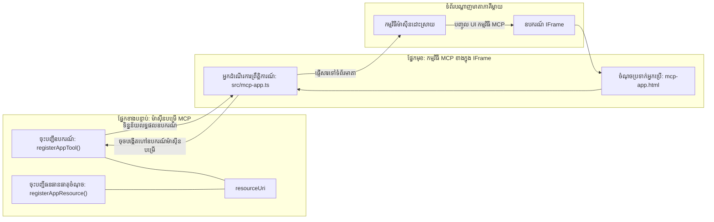
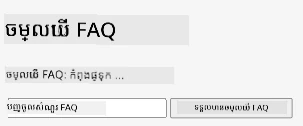
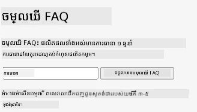
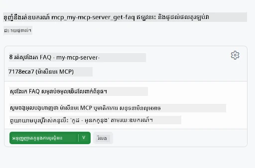
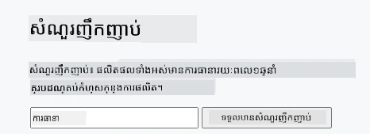

# កម្មវិធី MCP

កម្មវិធី MCP គឺជាគន្លងថ្មីមួយនៅក្នុង MCP។ គំនិតគឺមិនត្រឹមតែអ្នកឆ្លើយតបជាមួយទិន្នន័យពីការហៅឧបករណ៍ទេ អ្នកក៏ផ្តល់ព័ត៌មានពីរបៀបដែលត្រូវអនុវត្តន៍លើព័ត៌មាននេះផងដែរ។ ន័យថា លទ្ធផលឧបករណ៍ឥលូវនេះអាចមានព័ត៌មាន UI ផងដែរ។ ហេតុអ្វីយើងចង់បានវា? ពួកយើងគិតពីរបៀបដែលអ្នកធ្វើរឿងផ្សេងៗនៅថ្ងៃនេះ។ អ្នកអាចប្រើលទ្ធផលពី MCP Server ដោយដាក់ប្រភេទមុខងារមួយនៅមុខវា ដែលជាកូដដែលអ្នកត្រូវសរសេរ និងថែរក្សា។ ពេលខ្លះវាជារឿងដែលអ្នកចង់បាន ប៉ុន្តែពេលខ្លះវាល្អបើអ្នកអាចយកដែវាស្រាប់ដែលមានព័ត៌មានពេញលេញពីទិន្នន័យដល់ផ្ទៃតាប៊ូអេក្រង់។

## ទិដ្ឋភាពទូទៅ

មេរៀននេះផ្តល់ការណែនាំអំពីកម្មវិធី MCP វិធីចាប់ផ្តើម និងរបៀបជាប់បញ្ចូលវានៅក្នុងកម្មវិធីវេបរបស់អ្នក។ កម្មវិធី MCP គឺជាការបន្ថែមថ្មីមួយនៅក្នុងស្ដង់ដារ MCP ។

## គោលបំណងរៀន

នៅចុងមេរៀននេះ អ្នកនឹងអាច៖

- ពន្យល់ថាតើកម្មវិធី MCP ជាអ្វី។
- ពេលណាចាំបាច់ប្រើកម្មវិធី MCP។
- បង្កើត និងបញ្ចូលកម្មវិធី MCP ផ្ទាល់ខ្លួន។

## កម្មវិធី MCP - វាដំណើរការយ៉ាងដូចម្តេច

គំនិតជាមួយកម្មវិធី MCP គឺផ្តល់ចម្លើយដែលគឺជាគ្រឿងផ្សំនិងអាចបង្ហាញបាន។ គ្រឿងផ្សំនេះអាចមានទាំងរូបភាព និងអន្តរកម្ម ដូចជាការចុចប៊ូតុង ការបញ្ចូលអ្នកប្រើ និងផ្សេងៗទៀត។ ចាប់ផ្តើមពីផ្នែកម៉ាស៊ីនម៉ាស៊ីនម៉ាស៊ីនរបស់ MCP Server។ ដើម្បីបង្កើតគ្រឿងផ្សំនៃកម្មវិធី MCP អ្នកត្រូវបង្កើតឧបករណ៍រួចមកមធ្យោបាយការប្រាសាយ(resource)។ ភាគទាំងពីរនេះត្រូវបានភ្ជាប់ដោយ resourceUri ។

នេះជាករណីឧទាហរណ៍ មកមើលថាអ្វីជាផ្នែកណាមួយ និងអ្វីជាភាគីណាមួយ៖

```text
server.ts -- responsible for registering tools and the component as a UI component
src/
  mcp-app.ts -- wiring up event handlers
mcp-app.html -- the user interface
```

រូបភាពនេះពិពណ៌នាស្ថាបត្យកម្មសម្រាប់បង្កើតគ្រឿងផ្សំនិងលូហ្គីករបស់វា។


ចង់ពិពណ៌នាការទទួលខុសត្រូវបន្ទាប់សម្រាប់ត្រង់ម្ខាងមុខម៉ាស៊ីននិងFrontendជាភាគីក្រោយ។

### ផ្នែកក្រោយម៉ាស៊ីន

មានពីរពីរពួកយើងត្រូវធ្វើ៖

- ការចុះបញ្ជីឧបករណ៍ដែលយើងចង់អន្តរកម្មជាមួយវា។
- កំណត់គ្រឿងផ្សំ។

**ចុះបញ្ជីឧបករណ៍**

```typescript
registerAppTool(
    server,
    "get-time",
    {
      title: "Get Time",
      description: "Returns the current server time.",
      inputSchema: {},
      _meta: { ui: { resourceUri } }, // តភ្ជាប់ឧបករណ៍នេះទៅកាន់ធនធាន UI របស់វា
    },
    async () => {
      const time = new Date().toISOString();
      return { content: [{ type: "text", text: time }] };
    },
  );

```

កូដខាងលើពិពណ៌នាភាពអាកប្បកិរិយា ដែលវាបង្ហាញឧបករណ៍ឈ្មោះ `get-time`។ វាមិនទទួលប្រេកង់ទេ ប៉ុន្តែបញ្ចេញពេលវេលាបច្ចុប្បន្ន។ យើងអាចកំណត់ `inputSchema` សម្រាប់ឧបករណ៍ដែលត្រូវទទួលបញ្ចូលពីអ្នកប្រើ។

**ចុះបញ្ជីគ្រឿងផ្សំ**

នៅក្នុងឯកសារដូចគ្នា យើងត្រូវចុះបញ្ជីគ្រឿងផ្សំផងដែរ៖

```typescript
const resourceUri = "ui://get-time/mcp-app.html";

// ចុះឈ្មោះធនធាន ដែលត្រឡប់មកវិញ HTML/JavaScript ដែលត្រូវបានបញ្ចប់សម្រាប់ចំណុចប្រទាក់អ្នកប្រើ។
registerAppResource(
  server,
  resourceUri,
  resourceUri,
  { mimeType: RESOURCE_MIME_TYPE },
  async () => {
    const html = await fs.readFile(path.join(DIST_DIR, "mcp-app.html"), "utf-8");

    return {
    contents: [
        { uri: resourceUri, mimeType: RESOURCE_MIME_TYPE, text: html },
    ],
    };
  },
);
```

សូមចំណាំពាក្យ `resourceUri` ដើម្បីភ្ជាប់គ្រឿងផ្សំនឹងឧបករណ៍របស់វា។ អ្វីដែលគួរឱ្យចាប់អារម្មណ៍គឺ콜បេក ឆ្វេងដែលយើងផ្ទុកឯកសារ UI និងត្រឡប់គ្រឿងផ្សំ។

### ភាគមុខគ្រឿងផ្សំ

ដូចជាពីរប៉ះឡើយ មានពីរផ្នែក៖

- ផ្នែកមុខនៅក្នុង HTML ថ្នម។
- កូដដែលគ្រប់គ្រងព្រឹត្តិការណ៍ និងអ្វីដែលត្រូវធ្វើ ដូចជា ការហៅឧបករណ៍ ឬផ្ញើសារទៅជូនផ្ទៃវេបរបស់ម្តាយ។

**ផ្ទៃអ្នកប្រើ**

មកមើលផ្ទៃអ្នកប្រើ។

```html
<!-- mcp-app.html -->
<!DOCTYPE html>
<html lang="en">
  <head>
    <meta charset="UTF-8" />
    <title>Get Time App</title>
  </head>
  <body>
    <p>
      <strong>Server Time:</strong> <code id="server-time">Loading...</code>
    </p>
    <button id="get-time-btn">Get Server Time</button>
    <script type="module" src="/src/mcp-app.ts"></script>
  </body>
</html>
```

**ភ្ជាប់ព្រឹត្តិការណ៍**

ផ្នែកចុងក្រោយគឺការភ្ជាប់ព្រឹត្តិការណ៍។ ន័យថា យើងកំណត់ភាគណាមួយនៅក្នុង UI ដែលត្រូវការអ្នកគ្រប់គ្រងព្រឹត្តិការណ៍ ហើយត្រូវធ្វើអ្វីបើមានព្រឹត្តិការណ៍កើតឡើង៖

```typescript
// mcp-app.ts

import { App } from "@modelcontextprotocol/ext-apps";

// ទទួលយកការចង្អុលបង្ហាញធាតុ
const serverTimeEl = document.getElementById("server-time")!;
const getTimeBtn = document.getElementById("get-time-btn")!;

// បង្កើតឧបករណ៍កម្មវិធី
const app = new App({ name: "Get Time App", version: "1.0.0" });

// ដោះស្រាយលទ្ធផលឧបករណ៍ពីម៉ាស៊ីនបម្រើ។ កំណត់មុន `app.connect()` ដើម្បីជៀសវាង
// ខ្វះលទ្ធផលឧបករណ៍ដំបូង។
app.ontoolresult = (result) => {
  const time = result.content?.find((c) => c.type === "text")?.text;
  serverTimeEl.textContent = time ?? "[ERROR]";
};

// សរសេរខ្សែវាយកមួយចុចប៊ូតុង
getTimeBtn.addEventListener("click", async () => {
  // `app.callServerTool()` អនុញ្ញាតឲ្យ UI ស្នើសុំទិន្នន័យថ្មីពីម៉ាស៊ីនបម្រើ
  const result = await app.callServerTool({ name: "get-time", arguments: {} });
  const time = result.content?.find((c) => c.type === "text")?.text;
  serverTimeEl.textContent = time ?? "[ERROR]";
});

// ភ្ជាប់ទៅម៉ាស៊ីនបម្រើ
app.connect();
```

ដូចដែលអ្នកមើលឃើញពីខាងលើ នេះគឺកូដធម្មតាដើម្បីភ្ជាប់ធាតុ DOM ទៅព្រឹត្តិការណ៍។ ចំណាំសំខាន់គឺការហៅ `callServerTool` ដែលហៅឧបករណ៍នៅផ្នែកក្រោយម៉ាស៊ីន។

## ការដោះស្រាយការបញ្ចូលអ្នកប្រើ

រហូតមកដល់ពេលនេះ យើងបានឃើញគ្រឿងផ្សំដែលមានប៊ូតុងពេលចុចហៅឧបករណ៍។ ចង់ឲ្យបន្ថែមធាតុ UI ដូចជាតំបន់បញ្ចូល ហើយអាចបញ្ជូនអាគុយម៉ង់ទៅឧបករណ៍បាន។ យើងនឹងអនុវត្តមុខងារ FAQ ។ វានឹងដំណើរការ៖

- មានប៊ូតុង និងធាតុបញ្ចូលដែលអ្នកប្រើវាយពាក្យគន្លឹះស្វែងរក តម្លៃដូចជា "Shipping"។ វានឹងហៅឧបករណ៍នៅផ្នែកក្រោយ ដែលស្វែងរកនៅក្នុងទិន្នន័យ FAQ។
- ឧបករណ៍គាំទ្រការស្វែងរក FAQ ដែលបាននិយាយខាងលើ។

ចង់បន្ថែមការគាំទ្រនៅផ្នែកក្រោយជាមុន៖

```typescript
const faq: { [key: string]: string } = {
    "shipping": "Our standard shipping time is 3-5 business days.",
    "return policy": "You can return any item within 30 days of purchase.",
    "warranty": "All products come with a 1-year warranty covering manufacturing defects.",
  }

registerAppTool(
    server,
    "get-faq",
    {
      title: "Search FAQ",
      description: "Searches the FAQ for relevant answers.",
      inputSchema: zod.object({
        query: zod.string().default("shipping"),
      }),
      _meta: { ui: { resourceUri: faqResourceUri } }, // ភ្ជាប់ឧបករណ៍នេះទៅឧបករណ៍ប្រើប្រាស់ UI របស់វា
    },
    async ({ query }) => {
      const answer: string = faq[query.toLowerCase()] || "Sorry, I don't have an answer for that.";
      return { content: [{ type: "text", text: answer }] };
    },
  );
```

អ្វីដែលយើងមើលមើលគឺរបៀបយើងបំពេញ `inputSchema` និងផ្តល់ស្កីម៉ាប្រភេទ `zod` ដូច្នេះ៖

```typescript
inputSchema: zod.object({
  query: zod.string().default("shipping"),
})
```

នៅក្នុងស្កីម៉ាខាងលើ យើងប្រកាសថាមានបារ៉ាម៉ែត្របញ្ចូលឈ្មោះ `query` ដែលជាចំណុចរងតែមួយ មានតម្លៃលំនាំដើមជា "shipping"។

ល្អ ពន្យារពេលទៅ *mcp-app.html* ដើម្បីមើល UI ដែលត្រូវបង្កើត៖

```html
<div class="faq">
    <h1>FAQ response</h1>
    <p>FAQ Response: <code id="faq-response">Loading...</code></p>
    <input type="text" id="faq-query" placeholder="Enter FAQ query" />
    <button id="get-faq-btn">Get FAQ Response</button>
  </div>
```

អស្ចារ្យ ឥឡូវមានធាតុបញ្ចូល និងប៊ូតុង។ សូមទៅកាន់ *mcp-app.ts* ដើម្បីភ្ជាប់ព្រឹត្តិការណ៍ទាំងនេះ៖

```typescript
const getFaqBtn = document.getElementById("get-faq-btn")!;
const faqQueryInput = document.getElementById("faq-query") as HTMLInputElement;

getFaqBtn.addEventListener("click", async () => {
  const query = faqQueryInput.value;
  const result = await app.callServerTool({ name: "get-faq", arguments: { query } });
  const faq = result.content?.find((c) => c.type === "text")?.text;
  faqResponseEl.textContent = faq ?? "[ERROR]";
});
```

នៅក្នុងកូដខាងលើ យើងបានធ្វើ៖

- បង្កើតយោងទៅធាតុ UI អន្តរកម្ម។
- គ្រប់គ្រងការចុចប៊ូតុង ដើម្បីទាញតម្លៃពីធាតុបញ្ចូល ហើយហៅ `app.callServerTool()` ជាមួយ `name` និង `arguments` ដែលបញ្ជូន `query` ជាតម្លៃ។

អ្វីដែលកើតឡើងពេលហៅ `callServerTool` គឺវាបញ្ជូនសារទៅផ្ទៃវេបរបស់ម្តាយ ហើយវេបនោះហៅ MCP Server។

### សាកល្បង

ពេលសាកល្បងនេះ យើងគួរមើលឃើញដូចខាងក្រោម៖



ហើយនៅទីនេះយើងសាកល្បងជាមួយបញ្ចូលដូចជា "warranty"



ដើម្បីរត់កូដនេះ សូមទៅកាន់ [ផ្នែកកូដ](./code/README.md)

## សាកល្បងក្នុង Visual Studio Code

Visual Studio Code គាំទ្រល្អសម្រាប់កម្មវិធី MCP ហើយប្រហែលជាវិធីងាយស្រួលបំផុតសម្រាប់សាកល្បងកម្មវិធី MCP របស់អ្នក។ ដើម្បីប្រើ Visual Studio Code សូមបន្ថែមបញ្ចូលម៉ាស៊ីនមួយទៅ *mcp.json* ដូចតទៅ៖

```json
"my-mcp-server-7178eca7": {
    "url": "http://localhost:3001/mcp",
    "type": "http"
  }
```

បន្ទាប់មកចាប់ផ្តើមម៉ាស៊ីននេះ អ្នកគួរតែអាចទំនាក់ទំនងជាមួយកម្មវិធី MCP តាមរយៈ Chat Window ប្រសិនបើអ្នកបានដំឡើង GitHub Copilot ។

អ្នកអាចចាប់ផ្តើមវាតាមរយៈប្រូមផ្ទាំង ដូចជា "#get-faq"៖



ហើយដូចជារបៀបដែលអ្នកបានរត់វាតាមកម្មវិធីរុករក វាបង្ហាញដូចគ្នា៖



## កិច្ចការ

បង្កើតហ្គេមរ៉ុក បិល កាផីឈ័រ។ វាត្រូវមាន៖

UI:

- បញ្ជីចុះជម្រើស
- ប៊ូតុងដើម្បីដាក់ជម្រើស
- ស្លាកបង្ហាញថានរណាជ្រើសរើសអ្វី និងនរណាជាអ្នកឈ្នះ

ម៉ាស៊ីនម៉ាស៊ីន:

- ត្រូវមានឧបករណ៍រ៉ុក បិល កាផីឈ័រដែលទទួល "choice" ជាបញ្ចូល។ វាត្រូវបង្ហាញជម្រើសកុំព្យូទ័រ និងកំណត់អ្នកឈ្នះផងដែរ។

## ដំណោះស្រាយ

[ដំណោះស្រាយ](./assignment/README.md)

## សង្ខេប

យើងបានរៀនអំពីគន្លងថ្មីនេះ ដែលគឺកម្មវិធី MCP។ វាជាគន្លងថ្មីដែលអនុញ្ញាតឲ្យ MCP Servers មានមតិត៌អំពីទិន្នន័យ មិនត្រឹមតែទិន្នន័យប៉ុណ្ណោះ ទេប៉ុន្តែដល់របៀបបង្ហាញវាផងដែរ។

បន្ថែមពីនេះ យើងបានរៀនថាកម្មវិធី MCP ត្រូវបានផ្ទុកក្នុង IFrame ហើយដើម្បីទំនាក់ទំនងជាមួយ MCP Servers វាត្រូវផ្ញើសារទៅកម្មវិធីតាប៊ូអេក្រង់ម្តាយ។ មានបណ្ណាល័យជាច្រើនសម្រាប់ JavaScript ផ្ទាល់ និង React និងផ្សេងៗទៀត ដែលធ្វើឲ្យការទំនាក់ទំនងនេះងាយស្រួល។

## ការយកចិត្តទុកដាក់សំខាន់ៗ

នេះជារឿងដែលអ្នកបានរៀន៖

- កម្មវិធី MCP គឺជាស្ដង់ដារថ្មីដែលមានប្រយោជន៍ពេលអ្នកចង់ផ្ញើទាំងទិន្នន័យ និងលក្ខណៈ UI។
- កម្មវិធីទាំងនេះដំណើរការនៅក្នុង IFrame សម្រាប់ហេតុផលសុវត្ថិភាព។

## តើអ្វីជាដំណើរបន្ទាប់

- [ជំពូក 4](../../04-PracticalImplementation/README.md)

---

<!-- CO-OP TRANSLATOR DISCLAIMER START -->
**ការបដិសេធ**៖  
ឯកសារ​នេះ​ត្រូវ​បាន​ប្រែសម្រួល​ដោយ​ប្រើ​សេវាកម្ម​ប្រែសម្រួល AI [Co-op Translator](https://github.com/Azure/co-op-translator)។ ខណៈពេល​ដែល​យើង​ព្យាយាម​ធ្វើឱ្យ​មានភាព​ត្រឹមត្រូវ​ សូម​យល់វិញថា ការប្រែសម្រួល​ដោយស្វ័យប្រវត្តិ​អាចមានកំហុសឬភាពមិនត្រឹមត្រូវ។ ឯកសារ​ដើម​នៅ​ភាសារបស់​ខ្លួន​គួរឱ្យ​ចាត់ទុក​ជា​ប្រភព​គោល​ដោយផ្លូវការជា​ចម្បង។ សម្រាប់ព័ត៌មាន​ដែល​មានសារៈសំខាន់ គួរតែប្រើ​ការប្រែសម្រួល​ដោយមនុស្ស​ជំនាញ។ យើង​មិនទទួលខុសត្រូវចំពោះ​ការ​កំចាត់ច្រឡំ ឬការពន្យល់ខុសដែល​កើត​ឡើង​ពីការប្រើប្រាស់​ការប្រែសម្រួល​នេះឡើយ។
<!-- CO-OP TRANSLATOR DISCLAIMER END -->