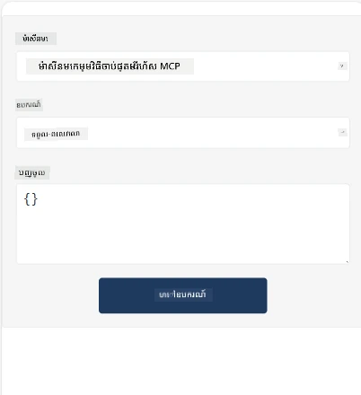
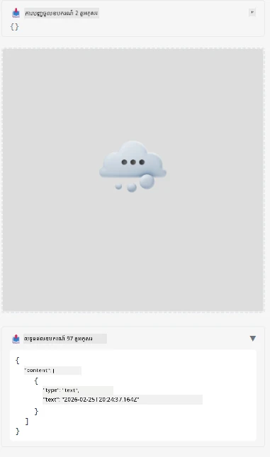

នេះគឺជាឧទាហរណ៍បង្ហាញ MCP App

## តំឡើង

1. នាវាទៅកាន់ថត *mcp-app*
1. បើកដំណើរការ `npm install` វាគួរតែតំឡើងការពឹងផ្អែកខាងหน้ากับខាងស្ដាំ

ពិនិត្យមើលថា backend បម្លែងត្រឹមត្រូវដោយការបើកដំណើរការ:

```sh
npx tsc --noEmit
```

គួរតែគ្មានចេញផ្សាយណាឡើយ ប្រសិនបើរឿងគ្រប់យ៉ាងនៅក្នុងលក្ខណៈល្អ។

## បើកដំណើរការ backend

> នេះអាចត្រូវការការងារបន្ថែមបើអ្នកកំពុងប្រើម៉ាស៊ីន Windows ព្រោះដំណោះស្រាយ MCP Apps ប្រើបណ្ណាល័យ `concurrently` ដើម្បីបើកដំណើរការ ដែលអ្នកត្រូវស្វែងរកជំនួស។ នេះជាជួរដេកបញ្ហា នៅ *package.json* នៃ MCP App:

    ```json
    "start": "concurrently \"cross-env NODE_ENV=development INPUT=mcp-app.html vite build --watch\" \"tsx watch main.ts\""
    ```

កម្មវិធីនេះមានពីរផ្នែក គឺផ្នែក backend និងផ្នែក host។

ចាប់ផ្តើម backend ដោយហៅ៖

```sh
npm start
```

នេះគួរតែចាប់ផ្តើម backend នៅ `http://localhost:3001/mcp`។

> ប្រសិនបើអ្នកនៅក្នុង Codespace អ្នកប្រហែលជាត្រូវការកំណត់ port visibility ដល់សាធារណៈ។ ពិនិត្យមើលថាអ្នកអាចចូលទៅកាន់ endpoint នៅទំព័ររុករក តាមរយៈ https://<name of Codespace>.app.github.dev/mcp

## ជម្រើស -1 សាកល្បងកម្មវិធីនៅ Visual Studio Code

ដើម្បីសាកល្បងដំណោះស្រាយនៅ Visual Studio Code សូមអនុវត្តដូចតទៅ៖

- បន្ថែមចំណុចម៉ាស៊ីនបម្រើទៅក្នុង `mcp.json` ដូចខាងក្រោម៖

    ```json
    {
        "servers": {
            "my-mcp-server-7178eca7": {
                "url": "http://localhost:3001/mcp",
                "type": "http"
            }
        },
        "inputs": []
    }
    ```

1. ចុចប៊ូតុង "start" ក្នុង *mcp.json*
1. ធ្វើឱ្យប្រាកដថាបង្អួចសន្ទនាបើក ហើយវាយ `get-faq` អ្នកគួរមើលឃើញលទ្ធផលដូចខាងក្រោម៖

    

## ជម្រើស -2- សាកល្បងកម្មវិធីជាមួយ host

រ៉េបូវ <https://github.com/modelcontextprotocol/ext-apps> មានម៉ាស៊ីនបម្រើជាច្រើនដែលអ្នកអាចប្រើសាកល្បង Apps MVP របស់អ្នកបាន។

យើងនឹងផ្តល់ជម្រើសពីរជួលនៅទីនេះ៖

### ម៉ាស៊ីនក្នុងតំបន់

- នាវាទៅកាន់ *ext-apps* បន្ទាប់ពីអ្នកបានកូពី repo។

- តំឡើងការពឹងផ្អែក

   ```sh
   npm install
   ```

- នៅក្នុងផ្ទាំងស្ថិតិបញ្ជាពីរបិទផ្សេង ធ្វើការចូលទៅកាន់ *ext-apps/examples/basic-host*

    > ប្រសិនបើអ្នកនៅក្នុង Codespace អ្នកត្រូវនាវាទៅកាន់ serve.ts ជួរលេខ 27 ហើយជំនួស http://localhost:3001/mcp ជាមួយ URL Codespace របស់អ្នកសម្រាប់ backend ពោលគឺ ឧទាហរណ៍ https://psychic-xylophone-657rpjgvxpc5g64-3001.app.github.dev/mcp

- បើកដំណើរការ host:

    ```sh
    npm start
    ```

    នេះគួរតែភ្ជាប់ host ជាមួយ backend និងអ្នកគួរមើលឃើញកម្មវិធីដំណើរការដូចខាងក្រោម៖

    

### Codespace

នេះត្រូវការការងារបន្ថែមបន្តិចដើម្បីឱ្យបរិក្ខារទីតាំង Codespace ធ្វើការបាន។ ដើម្បីប្រើ host តាមរយៈ Codespace៖

- មើលថត *ext-apps* ហើយទៅកាន់ *examples/basic-host*។
- បើកដំណើរការ `npm install` ដើម្បីតំឡើងការពឹងផ្អែក
- បើកដំណើរការ `npm start` ដើម្បីចាប់ផ្តើម host។

## សាកល្បងកម្មវិធី

សាកល្បងកម្មវិធីដោយវិធីដូចខាងក្រោម៖

- ជ្រើសរើសប៊ូតុង "Call Tool" ហើយអ្នកគួរមើលឃើញលទ្ធផលដូចខាងក្រោម៖

    

ល្អណាស់ វាធ្វើការបានទាំងអស់។

---

<!-- CO-OP TRANSLATOR DISCLAIMER START -->
**ការបដិសេធ**៖  
ឯកសារនេះបានបកប្រែដោយប្រើសេវាបកប្រែ AI [Co-op Translator](https://github.com/Azure/co-op-translator)។ នៅខណៈពេលយើងខិតខំរកភាពត្រឹមត្រូវ សូមដឹងថាការបកប្រែដោយស្វ័យប្រវត្តិក្នុងមួយចំនួនអាចមានកំហុស ឬភាពមិនត្រឹមត្រូវណាមួយ។ ឯកសារដើមក្នុងភាសាម្ចាស់របស់វាគួរត្រូវបានគេចាត់ទុកថាជាធនធានមានអំណាចសម្រាប់ព័ត៌មាន។ ចំពោះព័ត៌មានសំខាន់ៗ គ្រាន់តែផ្តល់អនុសាសន៍ឲ្យប្រើការបកប្រែដោយមនុស្សជំនាញវិជ្ជាជីវៈ។ យើងមិនទទួលខុសត្រូវចំពោះការយល់ច្រឡំ ឬការបកស្រាយខុសៗណាមួយដែលកើតឡើងពីការប្រើប្រាស់ការបកប្រែនេះឡើយ។
<!-- CO-OP TRANSLATOR DISCLAIMER END -->