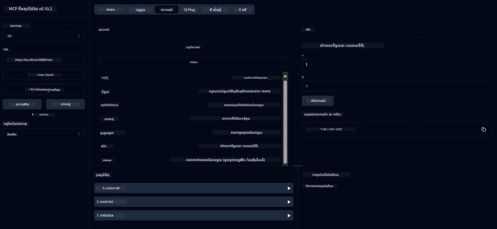

# សេវាកម្មកាលគណនេយ្យមូលដ្ឋាន MCP

សេវាកម្មនេះផ្តល់នូវប្រតិបត្តិការ​កាល​គណនេយ្យមូលដ្ឋានតាមរយៈ​ប្រព័ន្ធ Model Context Protocol (MCP) ដោយប្រើ Spring Boot ជាមួយការដឹកជញ្ជូន WebFlux។ វាត្រូវបានរចនាឡើងជាគំរូសាមញ្ញសម្រាប់អ្នកដំបូងដែលកំពុងសិក្សាពីការអនុវត្ត MCP។

សម្រាប់ព័ត៌មានបន្ថែម សូមមើលឯកសារយោង [MCP Server Boot Starter](https://docs.spring.io/spring-ai/reference/api/mcp/mcp-server-boot-starter-docs.html)។

## ទិដ្ឋភាពទូទៅ

សេវាកម្មនេះបង្ហាញពី៖
- ការគាំទ្រ SSE (Server-Sent Events)
- ការចុះបញ្ជីឧបករណ៍ដោយស្វ័យប្រវត្តិស_using`@Tool` annotation របស់ Spring AI
- មុខងារកាលគណនេយ្យមូលដ្ឋាន៖
  - ការរួមបញ្ចូល ការដក ផលគុណ ហើយបែង
  - ការគណនាថាមពល និងឫសការ៉េ
  - ការគណនា modulus (នៅសំណល់) និងតម្លៃភាព مطلق
  - មុខងារជំនួយសម្រាប់ពិពណ៌នាប្រតិបត្តិការ

## មុខងារ

សេវាកម្មកាល​គណនេយ្យនេះផ្តល់នូវមុខងារដូចខាងក្រោម៖

1. **ប្រតិបត្តិការអរូបិចមូលដ្ឋាន**៖
   - បូកលេខពីរចូលគ្នា
   - ដកលេខមួយពីលេខមួយទៀត
   - គុណលេខពីរចូលគ្នា
   - ចែកលេខមួយដោយលេខមួយ (មានការត្រួតពិនិត្យចែកដោយសូន្យ)

2. **ប្រតិបត្តិការវិជ្ជមាន**៖
   - គណនាថាមពល (លើកមូលដ្ឋានទៅកម្រិតសណ្ឋាន)
   - គណនាឫសការ៉េ (មានការត្រួតពិនិត្យលេខអវិជ្ជមាន)
   - គណនាម៉ូឌុលស (នៅសំណល់)
   - គណនាតម្លៃភាព مطلق

3. **ប្រព័ន្ធជំនួយ**៖
   - មុខងារជំនួយដំបូងដែលពន្យល់ពីប្រតិបត្តិការទាំងអស់ដែលមាន

## ការប្រើប្រាស់សេវាកម្ម

សេវាកម្មនេះបង្ហាញចេញ API endpoints តាមរយៈ​ពិធីករ MCP៖

- `add(a, b)`: បូកលេខពីរចូលគ្នា
- `subtract(a, b)`: ដកលេខទីពីរពីលេខទីមួយ
- `multiply(a, b)`: គុណលេខពីរចូលគ្នា
- `divide(a, b)`: ចែកលេខទីមួយដោយលេខទីពីរ (មានការត្រួតពិនិត្យចែកដោយសូន្យ)
- `power(base, exponent)`: គណនថាមពល
- `squareRoot(number)`: គណនាឫសការ៉េ (មានការត្រួតពិនិត្យលេខអវិជ្ជមាន)
- `modulus(a, b)`: គណនាសំណល់
- `absolute(number)`: គណនាតម្លៃភាព مطلق
- `help()`: ទទួលបានព័ត៌មានអំពីប្រតិបត្តិការដែលមាន

## អតិថិជនសាកល្បង

អតិថិជនសាកល្បងសាមញ្ញត្រូវបានបញ្ចូលក្នុងកញ្ចប់ `com.microsoft.mcp.sample.client`។ ថ្នាក់ `SampleCalculatorClient` បង្ហាញពីប្រតិបត្តិការដែលមានក្នុងសេវាកម្មកាលគណនេយ្យ។

## ការប្រើប្រាស់អតិថិជន LangChain4j

គម្រោងរួមបញ្ចូលអតិថិជនគំរូ LangChain4j ក្នុង `com.microsoft.mcp.sample.client.LangChain4jClient` ដែលបង្ហាញពីការរួមបញ្ចូលសេវាកម្មកាល​គណនេយ្យជាមួយ LangChain4j និងម៉ូដែល GitHub៖

### លក្ខខណ្ឌមុន

1. **ការតំឡើងToken GitHub**:

   ដើម្បីប្រើម៉ូដែល AI របស់ GitHub (ដូចជា phi-4) អ្នកត្រូវការទិដ្ឋភាពចូលផ្ទាល់ខ្លួន GitHub៖

   a. ចូលទៅកាន់ការកំណត់គណនី GitHub របស់អ្នក៖ https://github.com/settings/tokens
   
   b. ចុច "Generate new token" → "Generate new token (classic)"
   
   c. ផ្ដល់ឈ្មោះសម្រាប់ token របស់អ្នក
   
   d. ជ្រើស scope ដូចខាងក្រោម៖
      - `repo` (ការគ្រប់គ្រង​ពេញលេញនៃឃ្លាំងឯកជន)
      - `read:org` (អានក្រុម និងសមាជិកក្រុម ព្រមទាំងគម្រោងក្នុងអង្គភាព)
      - `gist` (បង្កើត gists)
      - `user:email` (ចូលប្រើអាសយដ្ឋានអ៊ីមែលអ្នកប្រើ (អានបានតែ))
   
   e. ចុច "Generate token" ហើយចម្លង token ថ្មីរបស់អ្នក
   
   f. កំណត់វាជាតម្លៃបរិស្ថាន៖
      
      នៅលើ Windows:
      ```
      set GITHUB_TOKEN=your-github-token
      ```
      
      នៅលើ macOS/Linux:
      ```bash
      export GITHUB_TOKEN=your-github-token
      ```

   g. សម្រាប់ការតំឡើងយូរអង្វែង អ្នកអាចបន្ថែមវាទៅក្នុងអថេរបរិស្ថានតាមការកំណត់ប្រព័ន្ធ

2. បញ្ចូលផ្នែក​ពឹងផ្អែក LangChain4j GitHub ទៅក្នុងគម្រោងរបស់អ្នក (បានបញ្ចូលរួចក្នុង pom.xml)៖
   ```xml
   <dependency>
       <groupId>dev.langchain4j</groupId>
       <artifactId>langchain4j-github</artifactId>
       <version>${langchain4j.version}</version>
   </dependency>
   ```

3. ប្រាកដថាសែរ៉្វើកាល​គណនេយ្យកំពុងរត់នៅ `localhost:8080`

### ការរត់អតិថិជន LangChain4j

គំរូនេះបង្ហាញ៖
- ការតភ្ជាប់ទៅម៉ាស៊ីនមេ MCP កាលគណនេយ្យ តាមរយៈការដឹកជញ្ជូន SSE
- ការប្រើ LangChain4j ដើម្បីបង្កើត chatbot ដែលប្រើប្រតិបត្តិការកាល​គណនេយ្យ
- ការរួមបញ្ចូលជាមួយម៉ូដែល AI GitHub (បច្ចុប្បន្នគឺម៉ូដែល phi-4)

អតិថិជនផ្ញើសំណួរគំរូសម្រាប់បង្ហាញមុខងារដូចខាងក្រោម៖
1. គណនាចំនួនបូករវាងលេខពីរ
2. ស្វែងរកឫសការេរបស់លេខមួយ
3. ទទួលបានព័ត៌មានជំនួយអំពីប្រតិបត្តិការកាល​គណនេយ្យដែលមាន

រត់គំរូហើយពិនិត្យមើលលទ្ធផលនៅក្នុង console ដើម្បីមើលថាម៉ូដែល AI ប្រើឧបករណ៍កាល​គណនេយ្យដើម្បីឆ្លើយសំណួរ។

### ការកំណត់ម៉ូដែល GitHub

អតិថិជន LangChain4j ត្រូវបានកំណត់ឲ្យប្រើម៉ូដែល phi-4 របស់ GitHub ជាមួយការកំណត់ដូចខាងក្រោម៖

```java
ChatLanguageModel model = GitHubChatModel.builder()
    .apiKey(System.getenv("GITHUB_TOKEN"))
    .timeout(Duration.ofSeconds(60))
    .modelName("phi-4")
    .logRequests(true)
    .logResponses(true)
    .build();
```
  
ដើម្បីប្រើម៉ូដែល GitHub ផ្សេងទៀត អ្នកអាចផ្លាស់ប្តូរ parameter `modelName` ទៅម៉ូដែលផ្សេង ដែលគាំទ្រ (ឧ. "claude-3-haiku-20240307", "llama-3-70b-8192", ល។)។

## ផ្នែកពឹងផ្អែក

គម្រោងត្រូវការផ្នែកពឹងផ្អែកសំខាន់ៗដូចខាងក្រោម៖

```xml
<!-- For MCP Server -->
<dependency>
    <groupId>org.springframework.ai</groupId>
    <artifactId>spring-ai-starter-mcp-server-webflux</artifactId>
</dependency>

<!-- For LangChain4j integration -->
<dependency>
    <groupId>dev.langchain4j</groupId>
    <artifactId>langchain4j-mcp</artifactId>
    <version>${langchain4j.version}</version>
</dependency>

<!-- For GitHub models support -->
<dependency>
    <groupId>dev.langchain4j</groupId>
    <artifactId>langchain4j-github</artifactId>
    <version>${langchain4j.version}</version>
</dependency>
```
  
## ការកសាងគម្រោង

កសាងគម្រោងដោយប្រើ Maven៖
```bash
./mvnw clean install -DskipTests
```
  
## ការរត់ម៉ាស៊ីនមេ

### ការប្រើប្រាស់ Java

```bash
java -jar target/calculator-server-0.0.1-SNAPSHOT.jar
```
  
### ការប្រើ MCP Inspector

MCP Inspector គឺជាឧបករណ៍មានប្រយោជន៍សម្រាប់ធ្វើអន្តរកម្មជាមួយសេវាកម្ម MCP។ ដើម្បីប្រើវាជាមួយសេវាកម្មកាល​គណនេយ្យនេះ៖

1. **ដំឡើង និងរត់ MCP Inspector** នៅក្នុងវិនដូរថ្មី៖
   ```bash
   npx @modelcontextprotocol/inspector
   ```
  
2. **ចូលប្រើ UI គេហទំព័រ** ដោយចុចលើ URL ដែលកម្មវិធីបង្ហាញ (ជាទូទៅ http://localhost:6274)

3. **កំណត់ការតភ្ជាប់**៖
   - កំណត់ប្រភេទការដឹកជញ្ជូនជា "SSE"
   - កំណត់ URL ទៅ SSE endpoint នៃម៉ាស៊ីនមេរបស់អ្នក៖ `http://localhost:8080/sse`
   - ចុច "Connect"

4. **ប្រើឧបករណ៍**៖
   - ចុច "List Tools" ដើម្បីមើលប្រតិបត្តិការកាល​គណនេយ្យដែលមាន
   - ជ្រើសឧបករណ៍ ហើយចុច "Run Tool" ដើម្បីអនុវត្តប្រតិបត្តិការ



### ការប្រើប្រាស់ Docker

គម្រោងរួមបញ្ចូល Dockerfile សម្រាប់ការផ្គត់ផ្គង់ជាកុងតឺន័រ៖

1. **កសាងរូបភាព Docker**៖
   ```bash
   docker build -t calculator-mcp-service .
   ```
  
2. **រត់កុងតឺន័រ Docker**៖
   ```bash
   docker run -p 8080:8080 calculator-mcp-service
   ```
  
នេះនឹង៖
- កសាងរូបភាព Docker ច្រើនដំណាក់កាល ជាមួយ Maven 3.9.9 និង Eclipse Temurin 24 JDK
- បង្កើតរូបភាព container ដែលមានប្រសិទ្ធភាព
- បង្ហាញសេវាកម្មនៅលើព្រួញ 8080
- ចាប់ផ្តើមសេវាកម្ម MCP កាល​គណនេយ្យក្នុង container

អ្នកអាចចូលប្រើសេវាកម្មនៅ `http://localhost:8080` ពេល container កំពុងរត់។

## ដោះស្រាយបញ្ហា

### បញ្ហាទូទៅជាមួយ Token GitHub

1. **បញ្ហាសិទ្ធិ Token**៖ ប្រសិនបើអ្នកទទួលបានកំហុស 403 Forbidden សូមពិនិត្យថា token របស់អ្នកមានសិទ្ធិត្រឹមត្រូវដូចបានបង្ហាញក្នុងលក្ខខណ្ឌមុន។

2. **រកមិនឃើញ Token**៖ ប្រសិនបើអ្នកទទួលបានកំហុស "No API key found" សូមប្រាកដថា environment variable GITHUB_TOKEN ត្រូវបានកំណត់ត្រឹមត្រូវ។

3. **កំណត់អត្រាចូលប្រើ**៖ GitHub API មានកំណត់អត្រា។ ប្រសិនបើអ្នកប្រទះកំហុសកំណត់អត្រា (ស្ថានធានលេខ 429) សូមរង់ចាំប៉ុន្មាននាទីមុនព្យាយាមម្តងទៀត។

4. **ភាពផុតកំណត់របស់ Token**៖ Token GitHub អាចផុតកំណត់។ ប្រសិនបើអ្នកទទួលបានកំហុសបញ្ជាក់សុពលភាពបន្ទាប់ពីរយៈពេល សូមបង្កើត token ថ្មី និងបន្ទាន់សម័យ environment variable របស់អ្នក។

បើអ្នកត្រូវការជំនួយបន្ថែម សូមពិនិត្យ [ឯកសារ LangChain4j](https://github.com/langchain4j/langchain4j) ឬ [ឯកសារ GitHub API](https://docs.github.com/en/rest)។

---

<!-- CO-OP TRANSLATOR DISCLAIMER START -->
**ការប្រុងប្រយ័ត្ន**៖  
ឯកសារនេះត្រូវបានបំលែងភាសាតាមរយៈសេវាកម្មបំលែងភាសា AI [Co-op Translator](https://github.com/Azure/co-op-translator)។ ទោះបីយើងខិតខំរកភាពត្រឹមត្រូវ ក៏សូមយកចិត្តទុកដាក់ថាការបំលែងភាសាដោយស្វ័យប្រវត្តិនេះអាចមានកំហុសឬការមិនត្រឹមត្រូវខ្លះ។ ឯកសារដើមនៅក្នុងភាសារបស់វាគួរត្រូវបានគិតថាជាដើមហើយជាហារឡិចសម្រាប់យោង។ សម្រាប់ព័ត៌មានសំខាន់ សូមពិចារណាការប្រើប្រាស់ការបំលែងភាសាដោយមនុស្សជំនាញវិជ្ជាជីវៈ។ យើងមិនទទួលខុសត្រូវចំពោះការយល់ច្រឡំ ឬការបកស្រាយខុសភាសាចេញពីការប្រើប្រាស់ការបំលែងភាសានេះឡើយ។
<!-- CO-OP TRANSLATOR DISCLAIMER END -->