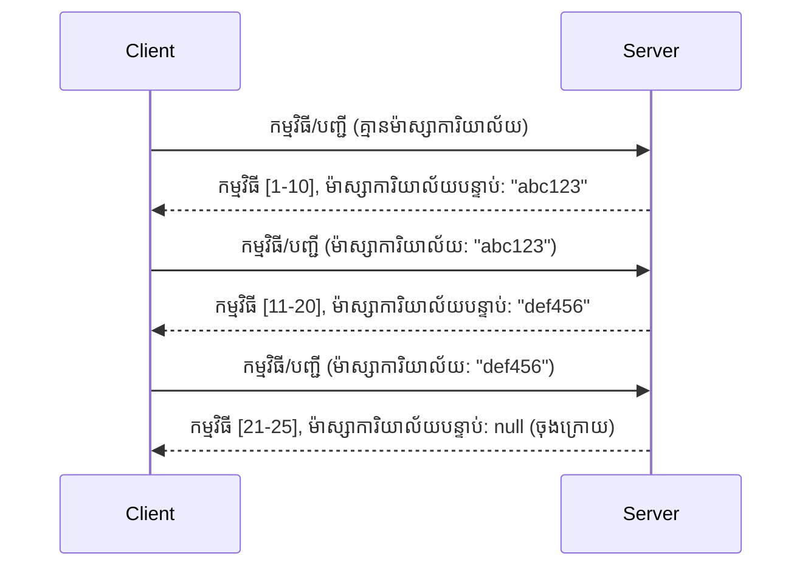

# ការបំបែកទំព័រ និងក្រុមលទ្ធផលធំក្នុង MCP

ពេលម៉ាស៊ីនមេ MCP របស់អ្នកដំណើរការទិន្នន័យធំ - មិនថា​បញ្ជីឯកសារពេញនិយមរាប់ពាន់ៗ, កំណត់ត្រាឃ្លាំងទិន្នន័យ, ឬលទ្ឋផលស្វែងរក - អ្នកត្រូវការបំបែកទំព័រដើម្បីគ្រប់គ្រងអង្គចងចាំយ៉ាងមានប្រសិទ្ធភាព និងផ្តល់បទពិសោធន៍ប្រើប្រាស់ឆាប់រហ័ស។ មគ្គុទេសក៍នេះលើកឡើងពីរបៀបអនុវត្តន៍ និងប្រើប្រាស់ការបំបែកទំព័រនៅក្នុង MCP។

## ហេតុអ្វីបានជាការបំបែកទំព័រមានសារៈសំខាន់

គ្មានការបំបែកទំព័រ លទ្ធផលធំៗអាចបណ្តាលឲ្យមាន៖

- **ការចំណាយអង្គចងចាំពេក** - โหลดកំណត់ត្រាលានលានលានពេញលេញនៅពេលតែមួយ
- **ពេលចម្លើយយឺត** - អ្នកប្រើរង់ចាំ ខណៈដែលទិន្នន័យទាំងអស់កំពុងត្រូវបានផ្ទុក
- **កំហុសផុតកំណត់ពេលវេលា** - ការស្នើសុំលើសកំណត់ពេលវេលា
- **កម្មវិធី AI យឺតចចាស់** - LLMs យល់ពិបាកជាមួយបរិបទធំពេក

MCP ប្រើ **ការបំបែកទំព័រតាមមុខតំណាង Cursor** សម្រាប់ការបង្ហាញទំព័រដោយទុកចិត្តបាន និងមានភាពថេរនៅក្នុងក្រុមលទ្ធផល។

---

## របៀបបំបែកទំព័រនៅក្នុង MCP

### គំនិត Cursor

**Cursor** ជាខ្សែអក្សរបិទមិនច្បាស់ដែលសម្គាល់ទីតាំងរបស់អ្នកនៅក្នុងក្រុមលទ្ធផល។ គិតថាវា ដូចជា​មិនស្លាបរបស់សៀវភៅវែងមួយ។


### ការបំបែកទំព័រនៅក្នុងវិធីសាស្រ្ត MCP

វិធីសាស្រ្ត MCP ទាំងអស់ខាងក្រោមគាំទ្រការបំបែកទំព័រ៖

| វិធីសាស្រ្ត | ត្រឡប់ | គាំទ្រ Cursor |
|--------|---------|----------------|
| `tools/list` | ការបញ្ជាក់ឧបករណ៍ | ✅ |
| `resources/list` | ការបញ្ជាក់ធនធាន | ✅ |
| `prompts/list` | ការបញ្ជាក់បំភ្លឺ | ✅ |
| `resources/templates/list` | ម៉ូដែលធនធាន | ✅ |

---

## ការអនុវត្តម៉ាស៊ីនមេ

### Python (FastMCP)

```python
from mcp.server import Server
from mcp.types import Tool, ListToolsResult
import math

app = Server("paginated-server")

# ប្រមូលទិន្នន័យធំនិយម
ALL_TOOLS = [
    Tool(name=f"tool_{i}", description=f"Tool number {i}", inputSchema={})
    for i in range(100)
]

PAGE_SIZE = 10

@app.list_tools()
async def list_tools(cursor: str | None = None) -> ListToolsResult:
    """List tools with pagination support."""
    
    # បកស្រាយ cursor ដើម្បីទទួលបានទីតាំងចាប់ផ្តើម
    start_index = 0
    if cursor:
        try:
            start_index = int(cursor)
        except ValueError:
            start_index = 0
    
    # ទទួលបានទំព័រផលប៉ុន
    end_index = min(start_index + PAGE_SIZE, len(ALL_TOOLS))
    page_tools = ALL_TOOLS[start_index:end_index]
    
    # គណនាតំណកបន្ទាប់
    next_cursor = None
    if end_index < len(ALL_TOOLS):
        next_cursor = str(end_index)
    
    return ListToolsResult(
        tools=page_tools,
        nextCursor=next_cursor
    )
```

### TypeScript

```typescript
import { Server } from "@modelcontextprotocol/sdk/server/index.js";
import { ListToolsResultSchema } from "@modelcontextprotocol/sdk/types.js";

const server = new Server({
  name: "paginated-server",
  version: "1.0.0"
});

// ឯកសារទិន្នន័យធំនៅក្នុងការសម្រួល
const ALL_TOOLS = Array.from({ length: 100 }, (_, i) => ({
  name: `tool_${i}`,
  description: `Tool number ${i}`,
  inputSchema: { type: "object", properties: {} }
}));

const PAGE_SIZE = 10;

server.setRequestHandler(ListToolsResultSchema, async (request) => {
  // បកកូដភ្ជាប់អក្សរ
  let startIndex = 0;
  if (request.params?.cursor) {
    startIndex = parseInt(request.params.cursor, 10) || 0;
  }
  
  // ទទួលបានទំព័រនៃលទ្ធផល
  const endIndex = Math.min(startIndex + PAGE_SIZE, ALL_TOOLS.length);
  const pageTools = ALL_TOOLS.slice(startIndex, endIndex);
  
  // គណនាភ្ជាប់អក្សរបន្ទាប់
  const nextCursor = endIndex < ALL_TOOLS.length ? String(endIndex) : undefined;
  
  return {
    tools: pageTools,
    nextCursor
  };
});
```

### Java (Spring MCP)

```java
@Service
public class PaginatedToolService {
    
    private static final int PAGE_SIZE = 10;
    private final List<Tool> allTools;
    
    public PaginatedToolService() {
        // ចាប់ផ្ដើមតំណើរការទិន្នន័យធំ
        this.allTools = IntStream.range(0, 100)
            .mapToObj(i -> new Tool("tool_" + i, "Tool number " + i, Map.of()))
            .collect(Collectors.toList());
    }
    
    @McpMethod("tools/list")
    public ListToolsResult listTools(@Param("cursor") String cursor) {
        // បកប្រែក្រឡាច្រៀង
        int startIndex = 0;
        if (cursor != null && !cursor.isEmpty()) {
            try {
                startIndex = Integer.parseInt(cursor);
            } catch (NumberFormatException e) {
                startIndex = 0;
            }
        }
        
        // ទទួលបានទំព័រវិលតប
        int endIndex = Math.min(startIndex + PAGE_SIZE, allTools.size());
        List<Tool> pageTools = allTools.subList(startIndex, endIndex);
        
        // គណនា​ក្រឡាច្រៀងបន្ទាប់
        String nextCursor = endIndex < allTools.size() ? String.valueOf(endIndex) : null;
        
        return new ListToolsResult(pageTools, nextCursor);
    }
}
```

---

## ការអនុវត្តភាគីអតិថិជន

### Python Client

```python
from mcp import ClientSession

async def get_all_tools(session: ClientSession) -> list:
    """Fetch all tools using pagination."""
    all_tools = []
    cursor = None
    
    while True:
        result = await session.list_tools(cursor=cursor)
        all_tools.extend(result.tools)
        
        if result.nextCursor is None:
            break
        cursor = result.nextCursor
    
    return all_tools

# ការប្រើប្រាស់
async with client_session as session:
    tools = await get_all_tools(session)
    print(f"Found {len(tools)} tools")
```

### TypeScript Client

```typescript
import { Client } from "@modelcontextprotocol/sdk/client/index.js";

async function getAllTools(client: Client): Promise<Tool[]> {
  const allTools: Tool[] = [];
  let cursor: string | undefined = undefined;
  
  do {
    const result = await client.listTools({ cursor });
    allTools.push(...result.tools);
    cursor = result.nextCursor;
  } while (cursor);
  
  return allTools;
}

// ការប្រើប្រាស់
const tools = await getAllTools(client);
console.log(`Found ${tools.length} tools`);
```

### លំនាំ Lazy Loading

សម្រាប់ទិន្នន័យធំៗណាស់, ផ្ទុកទំព័រដោយតម្រូវការ៖

```python
class PaginatedToolIterator:
    """Lazily iterate through paginated tools."""
    
    def __init__(self, session: ClientSession):
        self.session = session
        self.cursor = None
        self.buffer = []
        self.exhausted = False
    
    async def __anext__(self):
        # ត្រឡប់ពីប៊ូហ្វើរបើមាន
        if self.buffer:
            return self.buffer.pop(0)
        
        # ពិចារណាតើយើងបានប្រើបញ្ចប់ទំព័រទាំងអស់រួចហើយឫនៅ
        if self.exhausted:
            raise StopAsyncIteration
        
        # ទាញទំព័របន្ទាប់
        result = await self.session.list_tools(cursor=self.cursor)
        self.buffer = list(result.tools)
        self.cursor = result.nextCursor
        
        if self.cursor is None:
            self.exhausted = True
        
        if not self.buffer:
            raise StopAsyncIteration
        
        return self.buffer.pop(0)
    
    def __aiter__(self):
        return self

# ការប្រើប្រាស់ - ជាប្រសិទ្ធិភាពអង្គចងចាំសម្រាប់ទិន្នន័យធំៗ
async for tool in PaginatedToolIterator(session):
    process_tool(tool)
```

---

## ការបំបែកទំព័រសម្រាប់ធនធាន

ធនធានជាញឹកញាប់ត្រូវការបំបែកទំព័រសម្រាប់ថតឯកសារ ឬទិន្នន័យធំៗ៖

```python
from mcp.server import Server
from mcp.types import Resource, ListResourcesResult
import os

app = Server("file-server")

@app.list_resources()
async def list_resources(cursor: str | None = None) -> ListResourcesResult:
    """List files in directory with pagination."""
    
    directory = "/data/files"
    all_files = sorted(os.listdir(directory))
    
    # ដែកូដកន្លែងកំណត់ទីតាំង (លំដាប់ឯកសារ)
    start_index = int(cursor) if cursor else 0
    page_size = 20
    end_index = min(start_index + page_size, len(all_files))
    
    # បង្កើតបញ្ជីធនធានសម្រាប់ទំព័រនេះ
    resources = []
    for filename in all_files[start_index:end_index]:
        filepath = os.path.join(directory, filename)
        resources.append(Resource(
            uri=f"file://{filepath}",
            name=filename,
            mimeType="application/octet-stream"
        ))
    
    # គណនាកន្លែងកំណត់បន្ទាប់
    next_cursor = str(end_index) if end_index < len(all_files) else None
    
    return ListResourcesResult(
        resources=resources,
        nextCursor=next_cursor
    )
```

---

## យុទ្ធសាស្ត្ររចនាគន្លង Cursor

### យុទ្ធសាស្ត្រទី 1៖ អាស្រ័យលើ Index (សាមញ្ញ)

```python
# ការសរសេរជាការធ្វើអ្នកសួរដោយគ្រាន់តែជាសន្ទស្សន៍
cursor = "50"  # ចាប់ផ្តើមពីធាតុ ៥០
```

**អត្ថប្រយោជន៍៖** សាមញ្ញ មិនមានស្ថានភាព
**គុណវិបត្តិ៖** លទ្ធផលអាចផ្លាស់ប្ដូរប្រសិនបើមានការបន្ថែម/យកចេញ

### យុទ្ធសាស្ត្រទី 2៖ អាស្រ័យលើ ID (ថេរ)

```python
# ការលីសគឺជាអត្តសញ្ញាណចុងក្រោយដែលបានឃើញ
cursor = "item_abc123"  # ចាប់ផ្តើមបន្ទាប់ពីធាតុនេះ
```

**អត្ថប្រយោជន៍៖** ថេរដោយគ្មានការផ្លាស់ប្ដូរបើទោះបីវត្ថុផ្លាស់ប្ដូរផងដែរ
**គុណវិបត្តិ៖** ត្រូវការចំនួន ID ដែលមានលំដាប់

### យុទ្ធសាស្ត្រទី 3៖ អក្សរកូដស្ថានភាព (ស្មុគស្មាញ)

```python
import base64
import json

def encode_cursor(state: dict) -> str:
    return base64.b64encode(json.dumps(state).encode()).decode()

def decode_cursor(cursor: str) -> dict:
    return json.loads(base64.b64decode(cursor).decode())

# ក្រឡាចក្រជាន់មានបរិច្ឆេទស្ថានភាពជាច្រើន
cursor = encode_cursor({
    "offset": 50,
    "filter": "active",
    "sort": "name"
})
```

**អត្ថប្រយោជន៍៖** អាចអក្សរកូដស្ថានភាពស្មុគស្មាញ
**គុណវិបត្តិ៖** ស្មុគស្មាញជាងនេះ ទ្រង់ទ្រាយ Cursor ធំជាង

---

## វិធីសាស្ត្រល្អបំផុត

### 1. ជ្រើសទំហំព្រិលគោលល្អ

```python
# គិតចំពោះទំហំទិន្នន័យ
PAGE_SIZE_SMALL_ITEMS = 100   # ម៉េតាដាតាសាមញ្ញ
PAGE_SIZE_MEDIUM_ITEMS = 20   # វត្ថុមានពហុភាព
PAGE_SIZE_LARGE_ITEMS = 5     # មាតិកាស្មុគស្មាញ
```

### 2. ដោះស្រាយ Cursor មិនត្រឹមត្រូវដោយញាត់ញយ

```python
@app.list_tools()
async def list_tools(cursor: str | None = None) -> ListToolsResult:
    try:
        start_index = int(cursor) if cursor else 0
        if start_index < 0 or start_index >= len(ALL_TOOLS):
            start_index = 0  # កំណត់ឡើងវិញទៅដើម
    except (ValueError, TypeError):
        start_index = 0  # កំណត់ទីតាំងមិនត្រឹមត្រូវ, ចាប់ផ្តើមថ្មី
    # ...
```

### 3. រួមបញ្ចូលការរាប់សរុប (ជាជម្រើស)

```python
return ListToolsResult(
    tools=page_tools,
    nextCursor=next_cursor,
    # ការអនុវត្តខ្លះមានការរួមបញ្ចូលសរុបសម្រាប់ការរីកចម្រើន UI
    _meta={"total": len(ALL_TOOLS)}
)
```

### 4. សាកល្បងករណីចុងបញ្ចប់

```python
async def test_pagination():
    # សំណុំលទ្ធផលទទេ
    result = await session.list_tools()
    assert result.tools == []
    assert result.nextCursor is None
    
    # ទំព័រតែមួយ
    result = await session.list_tools()
    assert len(result.tools) <= PAGE_SIZE
    
    # កំណត់មិនត្រឹមត្រូវ
    result = await session.list_tools(cursor="invalid")
    assert result.tools  # គួរតែបង្ហាញទំព័រដំបូង
```

---

## ចំណុចចរាចរណ៍ទូទៅ

### ❌ បញ្ជូនលទ្ធផលទាំងអស់រួចបំបែកទំព័រពីភាគីអតិថិជន

```python
# អាក្រក់៖ ដំណើរការទាំងអស់ចូលទៅក្នុងចងចាំ
@app.list_tools()
async def list_tools() -> ListToolsResult:
    all_tools = load_all_tools()  # ឧបករណ៍ 1លាន!
    return ListToolsResult(tools=all_tools)
```

### ✅ បំបែកទំព័រនៅប្រភពទិន្នន័យ

```python
# ល្អ: ផ្ទុកតែអ្វីដែលត្រូវការតែប៉ុណ្ណោះ
@app.list_tools()
async def list_tools(cursor: str | None = None) -> ListToolsResult:
    offset = int(cursor) if cursor else 0
    tools = await db.query_tools(offset=offset, limit=PAGE_SIZE)
    return ListToolsResult(tools=tools, nextCursor=...)
```

---

## តើអ្វីទៅជាដំណើរបន្ទាប់

- [ម៉ូឌុល 5.14 - វិស្វកម្មបរិបទ](../../05-AdvancedTopics/mcp-contextengineering/README.md)
- [ម៉ូឌុល 8 - វិធីសាស្ត្រល្អបំផុត](../../08-BestPractices/README.md)
- [3.8 - ការធ្វើតេស្តម៉ាស៊ីនមេ MCP របស់អ្នក](../../03-GettingStarted/08-testing/README.md)

---

## ធនធានបន្ថែម

- [លក្ខណៈពិសេស MCP - ការបំបែកទំព័រ](https://spec.modelcontextprotocol.io/specification/2025-11-25/)
- [ការពិពណ៌នាអំពីការបំបែកទំព័រតាម Cursor](https://slack.engineering/evolving-api-pagination-at-slack/)
- [តេស្ត pagination SDK Python](https://github.com/modelcontextprotocol/python-sdk/blob/main/tests/client/test_list_methods_cursor.py)

---

<!-- CO-OP TRANSLATOR DISCLAIMER START -->
**ការបដិសេធ**៖  
ឯកសារនេះត្រូវបានបញ្ច្រាសជាភាសាដោយប្រើសេវាកម្មបកប្រែ AI [Co-op Translator](https://github.com/Azure/co-op-translator)។ ខណៈពេលយើងខិតខំរកភាពត្រឹមត្រូវ សូមប្រាកដថាការបកប្រែដោយស្វ័យប្រវត្តិនោះអាចមានកំហុស ឬភាពមិនត្រឹមត្រូវ។ ឯកសារដើមនៅក្នុងភាសារដើមគួរត្រូវបានគេចាត់ទុកជាផ្លូវការបំផុត។ សម្រាប់ព័ត៌មានសំខាន់ សូមផ្តល់អោយមានការបកប្រែដោយមនុស្សវិជ្ជាជីវៈ។ យើងមិនទទួលខុសត្រូវចំពោះការយល់ច្រឡំ ឬការបកប្រែលើកដានដែលកើតឡើងពីការប្រើប្រាស់ការបកប្រែនេះនោះទេ។
<!-- CO-OP TRANSLATOR DISCLAIMER END -->