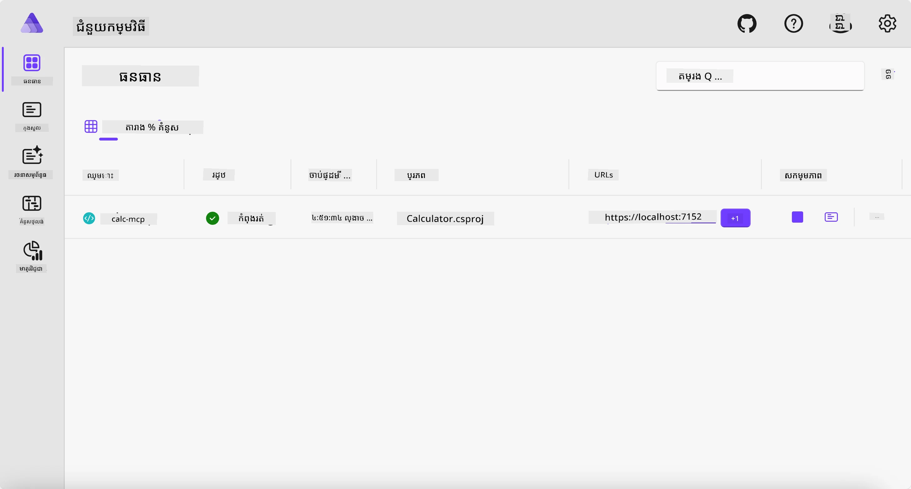
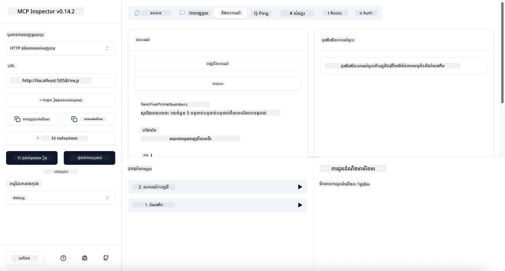
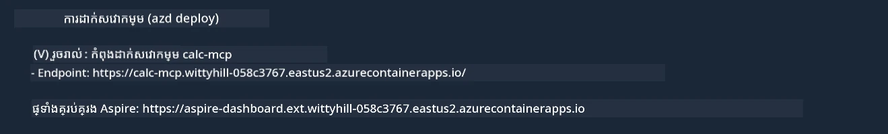

# លំនាំ

ឧទាហរណ៍មុនបង្ហាញពីវិធីប្រើផ<Project> របស់ .NET ជាប្រភេទ `stdio` ហើយវិធីដំណើរការប្ញស័រជាមួយថាសធាតុតំបន់។ វាជាដំណោះស្រាយល្អនៅនៅក្នុងស្ថានការណ៍ជាច្រើន។ ទោះជាយ៉ាងណា វាក៏អាចមានប្រយោជន៍ក្នុងការរត់បញ្ជាប្ញស័រពីចម្ងាយ ដូចជាស្ថានភាពរង្វុងពពក។ នេះជារឿងដែលប្រភេទ `http` ត្រូវបានប្រើ។

ពិនិត្យមើលដំណោះស្រាយក្នុងថត `04-PracticalImplementation` វាអាចបង្ហាញថាមានភាពស្មុគស្មាញជាងមុនជាច្រើន។ ប៉ុន្តែការពិតវាមិនមែនជាប់លំបាកទេ។ ប្រសិនបើលោកអ្នកពិនិត្យយ៉ាងជិតស្និទ្ធទៅលើគម្រោង `src/Calculator` អ្នកនឹងមើលឃើញថាវា​គឺ​ជា​កូដ​ដដែល​ជាង​មុន។ ចំណុចខុសគ្នាអ្នកកំពុងប្រើបណ្ណាល័យផ្សេង `ModelContextProtocol.AspNetCore` ដើម្បីគ្រប់គ្រងការស្នើសុំនៃ HTTP។ ហើយយើងបានផ្លាស់ប្តូរមេធត្យូត `IsPrime` ឲ្យទៅជារបៀបឯកជន ដើម្បីបង្ហាញថាអ្នកអាចមានមេធត្យូឯកជននៅក្នុងកូដរបស់អ្នក។ កូដដែលនៅសល់គឺដូចដើម។

គម្រោងផ្សេងទៀតមកពី [.NET Aspire](https://learn.microsoft.com/dotnet/aspire/get-started/aspire-overview)។ ការមាន .NET Aspire នៅក្នុងដំណោះស្រាយនឹងបង្កើនបទពិសោធន៍របស់អ្នកអភិវឌ្ឍក្នុងពេលអភិវឌ្ឍន៍ និងសាកល្បង និងជួយក្នុងការបង្កើនការយល់ដឹង។ វាមិនបញ្ជាក់ត្រូវការដើម្បីរត់បញ្ជាប្ញស័រទេ ប៉ុន្ត្តវាជាព្រឹត្តិការណ៍ល្អក្នុងដំណោះស្រាយរបស់អ្នក។

## ចាប់ផ្តើមបញ្ជាប្ញស័រពីក្នុងតំបន់

1. ពី Visual Studio Code (ជាមួយផ្នែកបន្ថែម C# DevKit) ចូលទៅថត `04-PracticalImplementation/samples/csharp`។
1. រត់ពាក្យបញ្ជាដូចខាងក្រោមដើម្បីចាប់ផ្តើមបញ្ជាប្ញស័រ៖

   ```bash
    dotnet watch run --project ./src/AppHost
   ```

1. ពេលវេបប្រាសរីនបើកផ្ទាំងគ្រប់គ្រង .NET Aspire សូមចំណាំ URL ប្រភេទ `http`។ វាគួរតែមានរូបរាងដូចជា `http://localhost:5058/`។

   

## សាកល្បង Streamable HTTP ជាមួយ MCP Inspector

បើលោកអ្នកមាន Node.js 22.7.5 ឫខ្ពស់ជាងនេះ អ្នកអាចប្រើ MCP Inspector ដើម្បីសាកល្បងបញ្ជាប្ញស័ររបស់អ្នក។

ចាប់ផ្តើមបញ្ជាប្ញស័រ ហើយរត់ពាក្យបញ្ជាដូចខាងក្រោមនៅក្នុងបញ្ញាសារមួយ៖

```bash
npx @modelcontextprotocol/inspector http://localhost:5058
```



- ជ្រើសប្រភេទផ្លូវដឹកថា `Streamable HTTP`។
- នៅវាល Url បញ្ចូល URL របស់បញ្ជាប្ញស័រដែលបានចំណាំមុន ហើយបន្ថែម `/mcp` នៅខាងក្រោយ។ វាគួរតែមានប្រភេទ `http` (មិនមែន `https`) ហើយរូបរាងដូចជា `http://localhost:5058/mcp`។
- ចុចប៊ូតុង Connect។

អ្វីដែលល្អអំពី Inspector គឺវាបង្កើតគំនិតមើលឃើញល្អលើអ្វីដែលកំពុងកើតមាន។

- សាកល្បងបង្ហាញបរិក្ខារដែលមាន
- សាកល្បងមុខងារមួយចំនួន វាគួរតែដំណើរការដូចមុន។

## សាកល្បង MCP Server ជាមួយ GitHub Copilot Chat ក្នុង VS Code

ដើម្បីប្រើផ្លូវដឹក Streamable HTTP ជាមួយ GitHub Copilot Chat ប្រែប្រួលការកំណត់របស់ម៉ាស៊ីនបម្រើ `calc-mcp` ដែលបានបង្កើតមុននេះដូចខាងក្រោម៖

```jsonc
// .vscode/mcp.json
{
  "servers": {
    "calc-mcp": {
      "type": "http",
      "url": "http://localhost:5058/mcp"
    }
  }
}
```

សាកល្បងខ្លះ៖

- ស្នើសុំ "3 prime numbers after 6780"។ សម្គាល់ថា Copilot នឹងប្រើឧបករណ៍ថ្មី `NextFivePrimeNumbers` ហើយបង្ហាញតែ 3 លេខគោលបត្រដំបូង។
- ស្នើសុំ "7 prime numbers after 111", ដើម្បីមើលអ្វីកើតឡើង។
- ស្នើសុំ "John មានបង្អែម 24 និងចង់ចែកចាយអោយកូន 3 របស់គាត់។ តើកូនម្នាក់មានបង្អែមប៉ុន្មាន?", ដើម្បីមើលអ្វីកើតឡើង។

## ចាត់ចែងបញ្ជាប្ញស័រទៅ Azure

មកចាត់ចែងបញ្ជាប្ញស័រទៅ Azure ដើម្បីឲ្យមនុស្សច្រើនប្រើបាន។

ពីក្នុងបញ្ញាសារ ចូលទៅថត `04-PracticalImplementation/samples/csharp` ហើយរត់ពាក្យបញ្ជាដូចខាងក្រោម៖

```bash
azd up
```

បន្ទាប់ពីការចាត់ចែងបានបញ្ចប់ អ្នកគួរតែឃើញសារដូចខាងក្រោម៖



ចាប់យក URL ហើយប្រើវាក្នុង MCP Inspector និង GitHub Copilot Chat។

```jsonc
// .vscode/mcp.json
{
  "servers": {
    "calc-mcp": {
      "type": "http",
      "url": "https://calc-mcp.gentleriver-3977fbcf.australiaeast.azurecontainerapps.io/mcp"
    }
  }
}
```

## តើអ្វីទៅបន្ទាប់?

យើងបានសាកល្បងប្រភេទផ្លូវដឹក និងឧបករណ៍សាកល្បងផ្សេងៗ។ យើងបានចាត់ចែងម៉ាស៊ីនបម្រើ MCP របស់អ្នកទៅ Azure។ ប៉ុន្តែបើម៉ាស៊ីនបម្រើរបស់យើងត្រូវការចូលប្រើធនធានឯកជន? ឧទាហរណ៍ មូលដ្ឋានទិន្នន័យ ឫ API ឯកជន? នៅជំពូកក្រោយ យើងនឹងមើលថាតើធ្វើដូចម្តេចដើម្បីបង្កើនសុវត្ថិភាពសម្រាប់ម៉ាស៊ីនបម្រើរបស់យើង។

---

<!-- CO-OP TRANSLATOR DISCLAIMER START -->
**ការសម្ដែងអភ័យទោស**៖
ឯកសារនេះត្រូវបានបកប្រែដោយប្រើសេវាកម្មបកប្រែ AI [Co-op Translator](https://github.com/Azure/co-op-translator)។ ខណៈពេលដែលយើងខំប្រឹងរក្សាការត្រឹមត្រូវ សូមយល់ដឹងថាការបកប្រែដោយស្វ័យប្រវត្តិអាចមានកំហុស ឬការខ្វះខាត។ ឯកសារដើមក្នុងភាសាមូលដ្ឋានរបស់វាគួរត្រូវបានគិតថាជាឯកសារដែលមានអំណាចបំផុត។ សម្រាប់ព័ត៌មានដែលមានសារៈសំខាន់ ការបកប្រែដោយមនុស្សដែលមានជំនាញត្រូវបានផ្តល់អនុសាសន៍។ យើងមិនទទួលខុសត្រូវចំពោះការយល់ខុស ឬការបកផ្សំខុសចេញពីការប្រើប្រាស់ការបកប្រែនេះទេ។
<!-- CO-OP TRANSLATOR DISCLAIMER END -->